# 1. Introduction

본 문서는 우리 팀에서 개발한 부동산 중개 플랫폼인 'Real Estate Hub'의 Software Design Specification(SDS)이다. 본 문서에서는 Real Estate Hub를 위해 기존에 식별한 기능적 요구사항을 구현하기 위해 시스템을 여러 관점에서 바라보고 설계한다. Use case analysis는 사용자 관점에서 시스템이 사용자에게 제공하는 기능을 나타내고, Class diagram은 시스템 소프트웨어의 클래스 간 관계를 나타낸다. 
Sequence diagram과 State machine diagram은 시스템의 동적 관점을 묘사했다. User interface prototype은 시스템에서 사용자가 접하는 UI들에 관해 서술한다.
<br><br>
Real Estate Hub는 부동산 거래의 모든 참여자들을 위한 종합 플랫폼이다. 일반 사용자는 매물을 검색하고, 관심 매물을 관리하며, 브로커에게 중개를 요청할 수 있다. 
브로커는 자신의 프로필을 관리하고, 의뢰를 받아 처리하며, 고객과 실시간으로 소통할 수 있다. 관리자는 시스템 전체를 모니터링하고 매물과 사용자를 관리한다. 시스템은 네이버 지도 API를 활용한 지도 기반 검색, 실시간 채팅, 알림 시스템, 매물 비교 기능 등 현대적인 부동산 플랫폼에 필요한 모든 핵심 기능을 제공한다. 
<br><br>
본 문서 작성 시 가장 중요하게 생각한 점은 Diagram 간의 일관성이다. 즉 여러 Diagram 간 모순되는 부분이 없도록 주의하여 작성했다. 예를 들어, 특정 기능의 Sequence diagram에서 사용된 object와 message는 모두 같은 기능의 Class diagram에 있는 association, attribute, operation과 일치한다. 
또한 Sequence diagram의 흐름은 Use case description의 main success scenario와 일치한다. 이러한 일관성은 각 장마다 다시 설명한다. 또한 이전 단계에서 산출된 SRS 문서에 작성된 기능들이 빠짐없이 Diagram에 반영되어 작성되었는지를 확인하고 SRS 문서와 본 문서 간의 차이 또는 모순이 없도록 하였다. 
<br><br>
Real Estate Hub는 크게 백엔드 서버와 프론트엔드 웹 애플리케이션으로 구성되어 있다. 백엔드는 Spring Boot 프레임워크를 기반으로 한 Java 애플리케이션으로 개발되었으며, RESTful API 아키텍처를 따른다. 데이터베이스로는 MySQL을 사용하며, JPA(Java Persistence API)를 통해 객체 관계 매핑을 구현했다. 인증 시스템은 JWT(JSON Web Token) 기반으로 구현되어 있으며, Spring Security를 활용하여 세밀한 권한 관리를 제공한다. 프론트엔드는 바닐라 JavaScript로 구현된 Single Page Application(SPA)이다. 
<br><br>
시스템 아키텍처는 도메인 주도 설계(Domain-Driven Design, DDD) 원칙을 따르며, 각 도메인은 독립적인 패키지로 구성되어 있다. 주요 도메인으로는 인증(auth), 사용자(user), 브로커 프로필(broker_profile), 매물(property), 채팅(chat), 알림(alert, notification), 중개 위임(delegation), 소유권 검증(ownership), 매물 비교(preference) 등이 있다. 각 도메인은 자신만의 엔티티, 서비스, 컨트롤러, DTO를 가지며, 명확한 책임 분리를 통해 유지보수성과 확장성을 높였다. 
<br><br>
보안은 시스템 설계의 핵심 고려사항이다. 비밀번호는 BCrypt 알고리즘으로 암호화되어 저장되며, 모든 API 요청은 JWT 토큰을 통해 인증된다. 액세스 토큰은 1시간의 짧은 수명을 가지며, 리프레시 토큰은 HttpOnly 쿠키로 전송되어 XSS 공격으로부터 보호된다. Spring Security의 필터 체인을 통해 요청별 권한 검증이 이루어지며, 역할 기반 접근 제어(RBAC)를 통해 사용자 유형에 따른 기능 제한이 구현되어 있다. 
<br><br>
데이터베이스 설계는 정규화 원칙을 따르면서도 성능을 고려한 최적화가 이루어졌다. 모든 엔티티는 BaseEntity를 상속받아 생성일시와 수정일시를 자동으로 추적하며, 이는 감사(audit) 추적과 데이터 관리에 중요한 역할을 한다. 관계형 데이터베이스의 외래키 제약조건을 적극 활용하여 데이터 무결성을 보장하며, JPA의 지연 로딩(Lazy Loading)을 통해 불필요한 데이터 조회를 최소화했다. 
<br><br>
시스템의 핵심 기능 중 하나인 지도 기반 검색은 네이버 지도 API와의 통합을 통해 구현되었다. 사용자는 지도에서 직접 매물을 탐색할 수 있으며, 필터링 기능을 통해 원하는 조건의 매물만 표시할 수 있다. 사용자의 마지막 지도 상태(위치, 줌 레벨)는 UserMapState 엔티티에 저장되어, 재접속 시 동일한 화면에서 시작할 수 있도록 하여 사용자 경험을 크게 향상시켰다. 
<br><br>
<br><br>

# 2. Use case analysis

<br>

이 Use Case Diagram은 부동산 통합 플랫폼(Real Estate Hub System)의 주요 기능과 외부 액터 간 상호작용을 시각화한 것이다.
본 시스템은 일반 사용자(User), 매물 소유자(Owner), 브로커(Broker), 관리자(Admin), 시스템/엔진(System), 지도 서비스(Map Service)의 여섯 주체가 상호 연계되어 작동한다.
전체 기능은 회원 인증, 매물 등록 및 검증, 지도 기반 매물 탐색, 대리중개(위임), 채팅/알림, 가격 분석 및 추천 등으로 구성된다.

주요 액터 설명 <br>
User (사용자) 일반 이용자. 매물 검색, 필터 적용, 지도 탐색, 즐겨찾기, 채팅, 평점 등록 등의 기능을 수행한다. <br>
Owner (소유자) 자신의 부동산을 시스템에 등록하고, 서류 업로드 및 중개 위임 요청 등을 수행한다. <br>
Broker (브로커) 소유자로부터 받은 위임을 관리하고, 매물 거래를 중개하며 평가를 받는다. <br>
Admin (관리자) 시스템 전반의 데이터 검수, 매물 신청 검토, 승인·거절 처리 등을 담당한다. <br>
System / Engine (시스템/엔진) 자동 추천, 가격 예측, 이상거래 탐지 등 백엔드 AI 및 데이터 분석 모듈을 의미한다. <br>
Map Service (지도 서비스) 외부 지도 API (예: Naver Map, Kakao Map)로부터 위치, POI, 인구 통계 데이터를 제공한다. <br>

# Use case 1. 매물 등록 신청

## 1.1 GENERAL CHARACTERISTICS

1.1.1 Summary : 사용자가 매물 소유권 증명을 위한 신청서를 상세정보와 필수 서류와 함께 제출하는 기능

1.1.2 Scope : None

1.1.3 Level : user level

1.1.4 Author : None

1.1.5 Last Update : None

1.1.6 Status : Implemented

1.1.7 Primary Actor : User

1.1.8 Preconditions

- 사용자가 로그인되어 있어야 함 (JWT 토큰 보유)
- `/api/ownership/**` 엔드포인트는 인증된 사용자만 접근 가능

  1.1.9 Trigger

- 사용자가 매물 소유권 신청 폼에서 "신청하기" 버튼을 클릭했을 때

  1.1.10 Success Post Conditions

- 매물 소유권 신청이 데이터베이스에 저장됨 (Status: PENDING)
- 업로드된 서류 파일들이 서버 저장소(`uploads/ownership/`)에 저장됨
- 고유한 파일명(타임스탬프 + UUID)으로 파일 저장
- 신청 ID가 포함된 응답 반환
- 관리자에게 검토 대기 상태로 전달됨

  1.1.11 Failure Post Conditions

- 신청 데이터가 저장되지 않음
- 업로드된 파일들이 저장되지 않음
- 사용자에게 오류 메시지 반환

## 1.2 MAIN SUCCESS SCENARIO

| Step | Action                                                                                                                  |
| ---- | ----------------------------------------------------------------------------------------------------------------------- |
| S    | 사용자가 매물 등록 신청 폼을 연다.                                                                                      |
| 1    | 사용자가 신청자 정보를 입력한다 (이름, 연락처, 매물과의 관계).                                                          |
| 2    | 사용자가 지도에서 주소를 검색하거나 좌표를 선택한다.                                                                    |
| 3    | 시스템이 지도 API를 통해 주소 정보를 조회한다 (`GET /api/ownership/map/address` 또는 `/api/ownership/map/coordinates`). |
| 4    | 사용자가 건물명, 상세주소, 우편번호를 입력한다.                                                                         |
| 5    | 사용자가 소유권 증명 서류 파일을 업로드한다.                                                                            |
| 6    | 시스템이 파일 검증을 수행한다 (크기, 형식).                                                                             |
| 7    | 사용자가 "신청하기" 버튼을 클릭한다.                                                                                    |
| 8    | 시스템이 JWT 토큰을 검증한다.                                                                                           |
| 9    | 시스템이 중복 신청 여부를 체크한다.                                                                                     |
| 10   | 시스템이 업로드 디렉토리를 생성한다 (존재하지 않는 경우).                                                               |
| 11   | 시스템이 파일들을 서버 저장소에 저장한다 (고유 파일명: `yyyyMMdd_HHmmss_UUID.확장자`).                                  |
| 12   | 시스템이 문서 정보를 데이터베이스에 저장한다.                                                                           |
| 13   | 시스템이 신청 정보를 데이터베이스에 저장한다 (Status: PENDING).                                                         |
| 14   | 시스템이 신청 ID를 포함한 응답을 반환한다.                                                                              |

## 1.3 EXTENSION SCENARIOS

| Step | Branching Action                                                                                                                                                                                                                                                                                                                                                       |
| ---- | ---------------------------------------------------------------------------------------------------------------------------------------------------------------------------------------------------------------------------------------------------------------------------------------------------------------------------------------------------------------------- |
| 6    | 6a. 파일이 비어있는 경우<br>- 6a1. "빈 파일은 업로드할 수 없습니다" 오류 메시지를 출력한다.<br><br>6b. 파일 크기가 10MB를 초과하는 경우<br>- 6b1. "파일 크기는 10MB를 초과할 수 없습니다" 오류 메시지를 출력한다.<br><br>6c. 지원하지 않는 파일 형식인 경우<br>- 6c1. "지원하지 않는 파일 형식입니다. PDF, JPG, PNG, DOCX만 업로드 가능합니다" 오류 메시지를 출력한다. |
| 8    | 8a. JWT 토큰이 유효하지 않은 경우<br>- 8a1. 401 Unauthorized 응답을 반환한다.                                                                                                                                                                                                                                                                                          |
| 9    | 9a. 같은 주소로 PENDING 상태 신청이 이미 존재하는 경우<br>- 9a1. "같은 주소로 심사 중인 신청이 이미 존재합니다" 오류 메시지를 출력한다.<br><br>9b. 기존 매물에 대해 이미 신청한 경우<br>- 9b1. "이미 해당 매물에 신청이 존재합니다" 오류 메시지를 출력한다.                                                                                                            |
| 11   | 11a. 파일 저장 실패 시<br>- 11a1. "파일 저장에 실패했습니다" 오류 메시지를 출력한다.<br><br>11b. 파일 개수와 문서 타입 개수가 일치하지 않는 경우<br>- 11b1. "파일 개수와 문서 타입 개수가 일치하지 않습니다" 오류 메시지를 출력한다.                                                                                                                                   |
| 13   | 13a. 사용자가 존재하지 않는 경우<br>- 13a1. "사용자가 존재하지 않습니다" 오류 메시지를 출력한다.                                                                                                                                                                                                                                                                       |
| \*   | \*a. 기타 예외 발생 시<br>- \*a1. "매물 등록 처리 중 오류가 발생했습니다" 오류 메시지를 출력한다.                                                                                                                                                                                                                                                                      |

## 1.4 RELATED INFORMATION

1.4.1 Performance : ≤ 1 second

1.4.2 Frequency

- 사용자당 신청 빈도 제한 없음
- 중복 신청 방지 로직 존재

  1.4.3 Concurrency : 제한없음

  1.4.4 Due Date : None

# Use case 2. 매물 신청 현황 조회

## 2.1 GENERAL CHARACTERISTICS

2.1.1 Summary : 사용자가 신청한 매물들의 상태를 확인한다.

2.1.2 Scope : None

2.1.3 Level : user level

2.1.4 Author : None

2.1.5 Last Update : None

2.1.6 Status : Implemented

2.1.7 Primary Actor : User

2.1.8 Preconditions

- 사용자가 로그인되어 있어야 함 (JWT 토큰 보유)
- `/api/ownership/**` 엔드포인트는 인증된 사용자만 접근 가능

  2.1.9 Trigger

- 사용자가 내 신청 내역 페이지에 접근하거나 특정 신청 상세를 조회할 때

  2.1.10 Success Post Conditions

- 사용자의 모든 신청 내역이 목록으로 표시됨
- 각 신청의 상태(심사중/승인됨/거절됨)가 표시됨
- 심사중인 경우 남은 일수가 표시됨 (마감일: 수정일 + 7일)
- 거절된 경우 거절 사유가 표시됨
- 첨부된 서류를 원본 파일명으로 다운로드 가능

  2.1.11 Failure Post Conditions

- 신청 내역 조회 실패 시 오류 메시지 출력
- 권한이 없는 신청 접근 시 오류 메시지 출력

## 2.2 MAIN SUCCESS SCENARIO

| Step | Action                                                                                         |
| ---- | ---------------------------------------------------------------------------------------------- |
| S    | 사용자가 내 신청 내역 페이지에 접근한다.                                                       |
| 1    | 시스템이 JWT 토큰을 검증한다.                                                                  |
| 2    | 시스템이 현재 사용자 ID로 ownership_claims 테이블을 조회한다 (`GET /api/ownership/my-claims`). |
| 3    | 시스템이 각 신청의 상태를 확인한다 (PENDING/APPROVED/REJECTED).                                |
| 4    | 시스템이 신청 목록을 반환한다 (신청 ID, 주소, 상태, 신청일, 마감일 등).                        |
| 5    | 사용자가 특정 신청을 클릭하여 상세 정보를 조회한다.                                            |
| 6    | 시스템이 해당 신청의 상세 정보를 조회한다 (`GET /api/ownership/claims/{claimId}`).             |
| 7    | 시스템이 신청자 정보, 매물 정보, 첨부 서류 목록을 반환한다.                                    |
| 8    | 상태가 'APPROVED'인 경우 '승인됨'으로 표시한다.                                                |
| 9    | 상태가 'PENDING'인 경우 '심사중'으로 표시하고 남은 일수를 계산하여 표시한다 (마감일 - 현재일). |
| 10   | 상태가 'REJECTED'인 경우 '거절됨'으로 표시하고 거절 사유를 함께 표시한다.                      |
| 11   | 사용자가 첨부 서류의 다운로드 버튼을 클릭한다.                                                 |
| 12   | 시스템이 문서 정보를 조회한다 (`GET /api/ownership/documents/{documentId}/download`).          |
| 13   | 시스템이 파일 존재 여부와 읽기 가능 여부를 확인한다.                                           |
| 14   | 시스템이 원본 파일명으로 인코딩하여 파일을 다운로드한다.                                       |

## 2.3 EXTENSION SCENARIOS

| Step | Branching Action                                                                                                                                                                                              |
| ---- | ------------------------------------------------------------------------------------------------------------------------------------------------------------------------------------------------------------- |
| 1    | 1a. JWT 토큰이 유효하지 않은 경우<br>- 1a1. 401 Unauthorized 응답을 반환한다.                                                                                                                                 |
| 2    | 2a. 신청 내역이 없는 경우<br>- 2a1. 빈 목록을 반환한다.                                                                                                                                                       |
| 6    | 6a. 신청을 찾을 수 없는 경우<br>- 6a1. "신청을 찾을 수 없습니다" 오류 메시지를 출력한다.<br><br>6b. 다른 사용자의 신청에 접근하려는 경우<br>- 6b1. "접근 권한이 없습니다" 오류 메시지를 출력한다.             |
| 12   | 12a. 문서를 찾을 수 없는 경우<br>- 12a1. "문서를 찾을 수 없습니다" 오류 메시지를 출력한다.                                                                                                                    |
| 13   | 13a. 파일이 존재하지 않거나 읽을 수 없는 경우<br>- 13a1. "파일을 읽을 수 없습니다" 오류 메시지를 출력한다.                                                                                                    |
| 14   | 14a. 파일 경로가 잘못된 경우<br>- 14a1. "파일 경로가 잘못되었습니다" 오류 메시지를 출력한다.<br><br>14b. 파일 다운로드 중 오류 발생<br>- 14b1. "파일 다운로드 중 오류가 발생했습니다" 오류 메시지를 출력한다. |

## 2.4 RELATED INFORMATION

2.4.1 Performance : ≤ 1 second

2.4.2 Frequency

- 사용자가 내 신청 내역 페이지 접근 시마다
- 특정 신청 상세 조회 시마다
- 서류 다운로드 시마다

  2.4.3 Concurrency : 제한없음

  2.4.4 Due Date : None

# Use case 3. 매물 관리 현황 요약

## 3.1 GENERAL CHARACTERISTICS

3.1.1 Summary : 전체 매물 관리 상황을 한눈에 파악할 수 있도록 요약 정보를 제공한다.

3.1.2 Scope : None

3.1.3 Level : user level

3.1.4 Author : None

3.1.5 Last Update : None

3.1.6 Status : Implemented

3.1.7 Primary Actor : User

3.1.8 Preconditions

- 사용자가 로그인되어 있어야 함 (JWT 토큰 보유)
- `/api/ownership/**` 엔드포인트는 인증된 사용자만 접근 가능

  3.1.9 Trigger

- 사용자가 매물 관리 대시보드 또는 내 신청 내역 페이지에 접근할 때

  3.1.10 Success Post Conditions

- 각 상태별(심사중/승인됨/거절됨) 매물 건수가 표시됨
- 매물 목록이 제목, 주소, 상태, 신청자 정보와 함께 표시됨
- 상태별로 색상과 라벨이 구분되어 직관적으로 확인 가능
- 매물이 없는 경우 안내 문구 표시

  3.1.11 Failure Post Conditions

- 매물 목록 조회 실패 시 오류 메시지 출력

## 3.2 MAIN SUCCESS SCENARIO

| Step | Action                                                                                                          |
| ---- | --------------------------------------------------------------------------------------------------------------- |
| S    | 사용자가 매물 관리 대시보드에 접근한다.                                                                         |
| 1    | 시스템이 JWT 토큰을 검증한다.                                                                                   |
| 2    | 시스템이 현재 사용자 ID로 ownership_claims 테이블을 조회한다 (`GET /api/ownership/my-claims`).                  |
| 3    | 시스템이 조회된 신청 목록을 반환한다.                                                                           |
| 4    | 시스템이 각 신청의 상태(PENDING/APPROVED/REJECTED)를 확인한다.                                                  |
| 5    | 시스템이 상태별 건수를 계산한다.                                                                                |
| 6    | 시스템이 심사중(PENDING) 건수를 표시한다.                                                                       |
| 7    | 시스템이 승인됨(APPROVED) 건수를 표시한다.                                                                      |
| 8    | 시스템이 거절됨(REJECTED) 건수를 표시한다.                                                                      |
| 9    | 시스템이 각 매물의 제목, 주소, 상태, 신청자 정보를 목록으로 표시한다.                                           |
| 10   | 시스템이 상태별로 색상과 라벨을 구분하여 표시한다 (PENDING: 노란색/주황색, APPROVED: 초록색, REJECTED: 빨간색). |
| 11   | 사용자가 매물 목록을 확인한다.                                                                                  |

## 3.3 EXTENSION SCENARIOS

| Step | Branching Action                                                                                                                                    |
| ---- | --------------------------------------------------------------------------------------------------------------------------------------------------- |
| 1    | 1a. JWT 토큰이 유효하지 않은 경우<br>- 1a1. 401 Unauthorized 응답을 반환한다.                                                                       |
| 2    | 2a. 매물 목록 조회 실패<br>- 2a1. 오류 메시지를 표시한다.<br>- 2a2. 재시도 버튼을 제공한다.                                                         |
| 3    | 3a. 신청 내역이 없는 경우 (빈 목록 반환)<br>- 3a1. "현재 등록된 매물이 없습니다" 안내 문구를 표시한다.<br>- 3a2. 상태별 건수를 모두 0으로 표시한다. |

## 3.4 RELATED INFORMATION

3.4.1 Performance : ≤ 1 second

3.4.2 Frequency

- 매물 관리 대시보드 접근 시마다

  3.4.3 Concurrency : 제한없음

  3.4.4 Due Date : None

# Use case 4. 지도 위치 설정 기능

## 4.1 GENERAL CHARACTERISTICS

4.1.1 Summary : 사용자가 지도를 통해 정확한 매물 위치를 설정하도록 한다.

4.1.2 Scope : None

4.1.3 Level : user level

4.1.4 Author : None

4.1.5 Last Update : None

4.1.6 Status : Implemented

4.1.7 Primary Actor : User

4.1.8 Preconditions

- 사용자가 로그인되어 있어야 함 (JWT 토큰 보유)
- 매물 등록 신청 폼이 열려 있어야 함
- 지도 API 서비스가 정상 작동해야 함

  4.1.9 Trigger

- 사용자가 매물 등록 신청 시 지도에서 위치를 선택하거나 주소를 입력할 때

  4.1.10 Success Post Conditions

- 선택한 위치의 좌표(latitude, longitude)가 저장됨
- 좌표에 해당하는 주소 정보가 자동으로 조회되어 표시됨
- 주소 필드에 도로명주소, 지번주소, 건물명, 우편번호가 자동 완성됨
- 매물 신청 시 위치 정보가 함께 저장됨

  4.1.11 Failure Post Conditions

- 지도 API 호출 실패 시 오류 메시지 출력
- 위치 정보가 저장되지 않음

## 4.2 MAIN SUCCESS SCENARIO

| Step | Action                                                                                                           |
| ---- | ---------------------------------------------------------------------------------------------------------------- |
| S    | 사용자가 매물 등록 신청 폼에서 지도를 연다.                                                                      |
| 1    | 시스템이 지도를 표시한다 (확대, 축소, 이동 가능).                                                                |
| 2    | 사용자가 지도에서 원하는 위치를 클릭한다.                                                                        |
| 3    | 시스템이 클릭한 위치의 좌표(latitude, longitude)를 저장한다.                                                     |
| 4    | 시스템이 해당 위치에 마커를 표시한다.                                                                            |
| 5    | 시스템이 좌표로 주소를 조회한다 (`GET /api/ownership/map/address?latitude={lat}&longitude={lng}`).               |
| 6    | 시스템이 Reverse Geocoding을 수행하여 주소 정보를 반환한다.                                                      |
| 7    | 시스템이 도로명주소, 지번주소, 건물명, 우편번호를 주소 필드에 자동 완성한다.                                     |
| 8    | 사용자가 자동 완성된 주소 정보를 확인한다.                                                                       |
| 9    | 사용자가 필요시 상세주소를 추가 입력한다.                                                                        |
| 10   | 사용자가 신청하기 버튼을 클릭한다.                                                                               |
| 11   | 시스템이 위치 정보(propertyAddress, locationX, locationY, buildingName, postalCode)를 매물 신청과 함께 저장한다. |

## 4.3 EXTENSION SCENARIOS

| Step | Branching Action                                                                                                                                                                                                                                                                                                                                                                                         |
| ---- | -------------------------------------------------------------------------------------------------------------------------------------------------------------------------------------------------------------------------------------------------------------------------------------------------------------------------------------------------------------------------------------------------------- |
| 2    | 2a. 사용자가 주소를 직접 입력하는 경우<br>- 2a1. 사용자가 주소 검색창에 주소를 입력한다.<br>- 2a2. 시스템이 주소로 좌표를 조회한다 (`GET /api/ownership/map/coordinates?address={address}`).<br>- 2a3. 시스템이 Geocoding을 수행하여 좌표를 반환한다.<br>- 2a4. 시스템이 지도 중심을 해당 좌표로 이동한다.<br>- 2a5. 시스템이 해당 위치에 마커를 표시한다.<br>- 2a6. 시스템이 주소 필드를 자동 완성한다. |
| 3    | 3a. 사용자가 마커를 드래그하여 위치를 변경하는 경우<br>- 3a1. 시스템이 새로운 좌표를 저장한다.<br>- 3a2. 시스템이 새로운 좌표로 주소를 재조회한다.<br>- 3a3. 시스템이 주소 필드를 업데이트한다.                                                                                                                                                                                                          |
| 5    | 5a. 지도 API 호출 실패<br>- 5a1. "주소 조회에 실패했습니다" 오류 메시지를 표시한다.<br>- 5a2. 사용자가 주소를 수동으로 입력할 수 있도록 한다.                                                                                                                                                                                                                                                            |
| 6    | 6a. 좌표에 해당하는 주소를 찾을 수 없는 경우<br>- 6a1. 기본 주소 정보를 반환한다 (서울시청 기준).<br>- 6a2. 사용자에게 주소를 수동으로 확인하도록 안내한다.                                                                                                                                                                                                                                              |
| \*   | \*a. 주변 건물 검색 기능 사용<br>- \*a1. 사용자가 주변 건물 검색 버튼을 클릭한다.<br>- \*a2. 시스템이 현재 위치 기준 반경 500m 내 건물을 조회한다 (`GET /api/ownership/map/nearby-buildings`).<br>- \*a3. 시스템이 건물 목록을 표시한다 (건물명, 카테고리, 주소, 거리).<br>- \*a4. 사용자가 건물을 선택하면 해당 위치로 이동한다.                                                                        |

## 4.4 RELATED INFORMATION

4.4.1 Performance : ≤ 1 second

4.4.2 Frequency

- 매물 등록 신청 시마다
- 지도에서 위치 변경 시마다
- 주소 입력 시마다

  4.4.3 Concurrency : 제한없음, 동시 API 호출 지원, 지도 API 응답 시간에 따라 성능 변동 가능

  4.4.4 Due Date : None

# Use case 5. 소유권 증명 서류 업로드

## 5.1 GENERAL CHARACTERISTICS

5.1.1 Summary : 다양한 종류의 소유권 증명 서류를 업로드 할 수 있다.

5.1.2 Scope : None

5.1.3 Level : user level

5.1.4 Author : None

5.1.5 Last Update : None

5.1.6 Status : Implemented

5.1.7 Primary Actor : User

5.1.8 Preconditions

- 사용자가 로그인되어 있어야 함 (JWT 토큰 보유)
- 매물 등록 신청 폼이 열려 있어야 함

  5.1.9 Trigger

- 사용자가 매물 등록 신청 시 서류 업로드 버튼을 클릭할 때

  5.1.10 Success Post Conditions

- 업로드된 파일이 서버 저장소에 저장됨 (`uploads/ownership/`)
- 파일 정보가 ownership_documents 테이블에 저장됨
- 원본 파일명, 저장 파일명, 파일 크기, 업로드 시간이 기록됨
- 관리자가 추후 확인 가능

  5.1.11 Failure Post Conditions

- 파일 업로드 실패 시 오류 메시지 출력
- 파일이 저장되지 않음

## 5.2 MAIN SUCCESS SCENARIO

| Step | Action                                                                                         |
| ---- | ---------------------------------------------------------------------------------------------- |
| S    | 사용자가 매물 등록 신청 폼에서 서류 업로드 섹션을 연다.                                        |
| 1    | 시스템이 서류 타입 목록을 조회한다 (`GET /api/ownership/document-types`).                      |
| 2    | 시스템이 드롭다운에 서류 타입을 표시한다 (등기부등본, 신분증, 주민등록등본, 납세증명서, 기타). |
| 3    | 사용자가 드롭다운에서 서류 타입을 선택한다.                                                    |
| 4    | 사용자가 파일 선택 버튼을 클릭하여 파일을 선택한다.                                            |
| 5    | 시스템이 파일 형식을 검증한다 (PDF, JPG, PNG, DOCX, DOC).                                      |
| 6    | 시스템이 파일 크기를 검증한다 (10MB 이하).                                                     |
| 7    | 사용자가 추가 서류를 업로드하기 위해 "서류 추가" 버튼을 클릭한다.                              |
| 8    | 시스템이 새로운 서류 입력 필드를 추가한다.                                                     |
| 9    | 사용자가 여러 개의 서류를 선택한다.                                                            |
| 10   | 사용자가 신청하기 버튼을 클릭한다.                                                             |
| 11   | 시스템이 파일 개수와 문서 타입 개수가 일치하는지 확인한다.                                     |
| 12   | 시스템이 각 파일을 서버 저장소에 저장한다 (고유 파일명: `yyyyMMdd_HHmmss_UUID.확장자`).        |
| 13   | 시스템이 각 파일 정보를 ownership_documents 테이블에 저장한다.                                 |
| 14   | 시스템이 원본 파일명, 저장 파일명, 파일 경로, 파일 크기, 콘텐츠 타입, 업로드 시간을 기록한다.  |
| 15   | 시스템이 신청 완료 메시지를 표시한다.                                                          |

## 5.3 EXTENSION SCENARIOS

| Step | Branching Action                                                                                                                                                                                                                                                                |
| ---- | ------------------------------------------------------------------------------------------------------------------------------------------------------------------------------------------------------------------------------------------------------------------------------- |
| 5    | 5a. 지원하지 않는 파일 형식인 경우<br>- 5a1. "지원하지 않는 파일 형식입니다. PDF, JPG, PNG, DOCX만 업로드 가능합니다" 오류 메시지를 출력한다.<br>- 5a2. 파일 선택을 취소한다.                                                                                                   |
| 6    | 6a. 파일 크기가 10MB를 초과하는 경우<br>- 6a1. "파일 크기는 10MB를 초과할 수 없습니다" 오류 메시지를 출력한다.<br>- 6a2. 파일 선택을 취소한다.<br><br>6b. 빈 파일을 업로드하는 경우<br>- 6b1. "빈 파일은 업로드할 수 없습니다" 오류 메시지를 출력한다.                          |
| 11   | 11a. 파일 개수와 문서 타입 개수가 일치하지 않는 경우<br>- 11a1. "파일 개수와 문서 타입 개수가 일치하지 않습니다" 오류 메시지를 출력한다.<br>- 11a2. 사용자에게 서류 타입을 다시 선택하도록 안내한다.                                                                            |
| 12   | 12a. 파일 저장 실패<br>- 12a1. "파일 저장에 실패했습니다" 오류 메시지를 출력한다.<br>- 12a2. 업로드를 중단한다.<br><br>12b. 업로드 디렉토리가 존재하지 않는 경우<br>- 12b1. 시스템이 자동으로 디렉토리를 생성한다 (`uploads/ownership/`).<br>- 12b2. 파일 저장을 계속 진행한다. |

## 5.4 RELATED INFORMATION

5.4.1 Performance : ≤ 1 second

5.4.2 Frequency

- 매물 등록 신청 시마다
- 매물 수정 시마다

  5.4.3 Concurrency : 제한없음, 동시 업로드 지원, 파일명 충돌 방지 - 타임스탬프 + UUID 조합

  5.4.4 Due Date : None

# Use case 6. 심사 중 매물 신청 수정

## 6.1 GENERAL CHARACTERISTICS

6.1.1 Summary : 사용자가 심사중인 매물 신청 정보를 수정할 수 있다.

6.1.2 Scope : None

6.1.3 Level : user level

6.1.4 Author : None

6.1.5 Last Update : None

6.1.6 Status : Implemented

6.1.7 Primary Actor : User

6.1.8 Preconditions

- 사용자가 로그인되어 있어야 함 (JWT 토큰 보유)
- 수정하려는 신청이 존재해야 함
- 신청 상태가 PENDING(심사중)이어야 함

  6.1.9 Trigger

- 사용자가 심사중인 신청의 수정 버튼을 클릭할 때

  6.1.10 Success Post Conditions

- 신청 정보가 수정됨
- 수정된 정보가 데이터베이스에 저장됨
- 감사 로그에 수정 이력이 기록됨
- updatedAt 필드가 현재 시간으로 갱신됨

  6.1.11 Failure Post Conditions

- 신청 정보가 수정되지 않음
- 오류 메시지 출력

## 6.2 MAIN SUCCESS SCENARIO

| Step | Action                                                                      |
| ---- | --------------------------------------------------------------------------- |
| S    | 사용자가 내 신청 내역에서 심사중인 신청을 선택한다.                         |
| 1    | 시스템이 신청 상태를 확인한다 (PENDING 여부).                               |
| 2    | 시스템이 수정 버튼을 활성화한다.                                            |
| 3    | 사용자가 수정 버튼을 클릭한다.                                              |
| 4    | 시스템이 기존 신청 정보를 수정 폼에 표시한다.                               |
| 5    | 사용자가 필요한 항목을 변경한다 (신청자 정보, 주소, 위치, 첨부 서류 등).    |
| 6    | 사용자가 수정 완료 버튼을 클릭한다.                                         |
| 7    | 시스템이 JWT 토큰을 검증한다.                                               |
| 8    | 시스템이 신청을 조회한다 (`PUT /api/ownership/claims/{claimId}`).           |
| 9    | 시스템이 수정 권한을 확인한다 (본인의 신청인지).                            |
| 10   | 시스템이 신청 상태를 확인한다 (PENDING 상태인지).                           |
| 11   | 시스템이 기본 정보를 업데이트한다 (이름, 연락처, 매물과의 관계, 추가 정보). |
| 12   | 시스템이 위치 정보를 업데이트한다 (주소, 좌표, 건물명, 상세주소, 우편번호). |
| 13   | 새로운 파일이 업로드된 경우 기존 문서를 삭제하고 새 문서를 저장한다.        |
| 14   | 시스템이 updatedAt 필드를 현재 시간으로 갱신한다 (PreUpdate).               |
| 15   | 시스템이 감사 로그를 생성한다 (UPDATE_CLAIM 액션).                          |
| 16   | 시스템이 수정된 신청 정보를 반환한다.                                       |

## 6.3 EXTENSION SCENARIOS

| Step | Branching Action                                                                                                                                                                                                                                                                                         |
| ---- | -------------------------------------------------------------------------------------------------------------------------------------------------------------------------------------------------------------------------------------------------------------------------------------------------------- |
| 1    | 1a. 신청 상태가 APPROVED(승인됨)인 경우<br>- 1a1. 수정 버튼을 비활성화한다.<br>- 1a2. "승인된 신청은 수정할 수 없습니다" 안내 메시지를 표시한다.<br><br>1b. 신청 상태가 REJECTED(거절됨)인 경우<br>- 1b1. 수정 버튼을 비활성화한다.<br>- 1b2. "거절된 신청은 수정할 수 없습니다" 안내 메시지를 표시한다. |
| 7    | 7a. JWT 토큰이 유효하지 않은 경우<br>- 7a1. 401 Unauthorized 응답을 반환한다.                                                                                                                                                                                                                            |
| 8    | 8a. 신청을 찾을 수 없는 경우<br>- 8a1. "신청을 찾을 수 없습니다" 오류 메시지를 출력한다.                                                                                                                                                                                                                 |
| 9    | 9a. 다른 사용자의 신청을 수정하려는 경우<br>- 9a1. "수정 권한이 없습니다" 오류 메시지를 출력한다.                                                                                                                                                                                                        |
| 10   | 10a. 신청 상태가 PENDING이 아닌 경우<br>- 10a1. "심사중인 신청만 수정할 수 있습니다" 오류 메시지를 출력한다.                                                                                                                                                                                             |
| 13   | 13a. 파일 업로드 실패<br>- 13a1. 파일 저장 오류 메시지를 출력한다.<br>- 13a2. 기존 정보는 유지된다.                                                                                                                                                                                                      |

## 6.4 RELATED INFORMATION

6.4.1 Performance : ≤ 1 second (파일 업로드 제외), 파일 업로드 시간은 파일 크기에 따라 다름, 기존 문서 삭제 후 새 문서 업로드, 감사 로그 자동 생성

6.4.2 Frequency

- 사용자가 신청 수정 시마다
- PENDING 상태인 신청만 수정 가능

  6.4.3 Concurrency : 제한없음, 트랜잭션 관리로 데이터 일관성 보장, PreUpdate로 updatedAt 자동 갱신

  6.4.4 Due Date : None

# Use case 7. 관리자 매물 신청 검토 및 처리

## 7.1 GENERAL CHARACTERISTICS

7.1.1 Summary : 관리자가 신청을 검토하고 승인 또는 거절한다.

7.1.2 Scope : None

7.1.3 Level : user level

7.1.4 Author : None

7.1.5 Last Update : None

7.1.6 Status : Implemented

7.1.7 Primary Actor : Admin

7.1.8 Preconditions

- 관리자 권한으로 로그인되어 있어야 함
- 검토할 신청이 존재해야 함

  7.1.9 Trigger

- 관리자가 신청 목록에 접근하거나 특정 신청을 검토할 때

  7.1.10 Success Post Conditions

- 신청 상태가 APPROVED 또는 REJECTED로 변경됨
- 승인 시 Property 엔티티가 자동 생성됨
- 거절 시 거절 사유가 저장됨
- 검토 시간(reviewedAt)이 기록됨
- 감사 로그에 검토 이력이 기록됨
- 사용자에게 알림이 전송됨

  7.1.11 Failure Post Conditions

- 신청 상태가 변경되지 않음
- 오류 메시지 출력

## 7.2 MAIN SUCCESS SCENARIO

| Step | Action                                                                                           |
| ---- | ------------------------------------------------------------------------------------------------ |
| S    | 관리자가 관리자 페이지에 접근한다.                                                               |
| 1    | 시스템이 관리자 권한을 확인한다 (role = "admin").                                                |
| 2    | 시스템이 모든 신청 내역을 조회한다 (`GET /api/ownership/admin/claims`).                          |
| 3    | 시스템이 신청 목록을 리스트 형태로 표시한다 (신청자, 주소, 상태, 신청일 등).                     |
| 4    | 관리자가 특정 신청을 선택한다.                                                                   |
| 5    | 시스템이 신청 상세 정보를 조회한다 (`GET /api/ownership/admin/claims/{claimId}`).                |
| 6    | 시스템이 신청자 정보, 매물 정보, 첨부 서류 목록을 표시한다.                                      |
| 7    | 관리자가 첨부 서류를 확인한다 (다운로드 가능).                                                   |
| 8    | 관리자가 승인 또는 거절을 결정한다.                                                              |
| 9    | 관리자가 승인 버튼을 클릭한다.                                                                   |
| 10   | 시스템이 신청 상태를 APPROVED로 변경한다 (`POST /api/ownership/admin/claims/{claimId}/approve`). |
| 11   | 시스템이 검토자(admin)와 검토 시간(reviewedAt)을 기록한다.                                       |
| 12   | 시스템이 Property 엔티티를 자동 생성한다.                                                        |
| 13   | 시스템이 매물 제목을 자동 생성한다 (건물명 또는 주소 기반, 중복 방지).                           |
| 14   | 시스템이 Property 정보를 저장한다 (제목, 주소, 상태=AVAILABLE, 등록유형=OWNER, 소유자, 좌표).    |
| 15   | 시스템이 신청과 Property를 연결한다 (역참조 설정).                                               |
| 16   | 시스템이 감사 로그를 생성한다 (APPROVE_CLAIM 액션, 신청자/주소 정보 포함).                       |
| 17   | 시스템이 사용자에게 승인 알림을 전송한다 (제목: "매물 승인 완료", 메시지: 주소 포함).            |
| 18   | 시스템이 승인 완료 메시지를 표시한다.                                                            |

## 7.3 EXTENSION SCENARIOS

| Step | Branching Action                                                                                                                                                                                                                                                                                                                                                                                                                                                                                                                                                                                            |
| ---- | ----------------------------------------------------------------------------------------------------------------------------------------------------------------------------------------------------------------------------------------------------------------------------------------------------------------------------------------------------------------------------------------------------------------------------------------------------------------------------------------------------------------------------------------------------------------------------------------------------------- |
| 1    | 1a. 관리자 권한이 없는 경우<br>- 1a1. "관리자 권한이 필요합니다" 오류 메시지를 출력한다.<br>- 1a2. 403 Forbidden 응답을 반환한다.                                                                                                                                                                                                                                                                                                                                                                                                                                                                           |
| 5    | 5a. 신청을 찾을 수 없는 경우<br>- 5a1. "신청을 찾을 수 없습니다" 오류 메시지를 출력한다.                                                                                                                                                                                                                                                                                                                                                                                                                                                                                                                    |
| 9    | 9a. 관리자가 거절 버튼을 클릭하는 경우<br>- 9a1. 시스템이 거절 사유 입력 창을 표시한다.<br>- 9a2. 관리자가 거절 사유를 입력한다.<br>- 9a3. 시스템이 신청 상태를 REJECTED로 변경한다 (`POST /api/ownership/admin/claims/{claimId}/reject`).<br>- 9a4. 시스템이 거절 사유(rejectionReason)를 저장한다.<br>- 9a5. 시스템이 검토자(admin)와 검토 시간(reviewedAt)을 기록한다.<br>- 9a6. 시스템이 감사 로그를 생성한다 (REJECT_CLAIM 액션, 거절 사유 포함).<br>- 9a7. 시스템이 사용자에게 거절 알림을 전송한다 (제목: "매물 신청 거절", 메시지: 거절 사유 포함).<br>- 9a8. 시스템이 거절 완료 메시지를 표시한다. |
| 10   | 10a. 관리자를 찾을 수 없는 경우<br>- 10a1. "관리자를 찾을 수 없습니다" 오류 메시지를 출력한다.                                                                                                                                                                                                                                                                                                                                                                                                                                                                                                              |
| 12   | 12a. 이미 Property가 연결되어 있는 경우<br>- 12a1. Property 생성을 건너뛴다.                                                                                                                                                                                                                                                                                                                                                                                                                                                                                                                                |
| 13   | 13a. 매물 제목 중복 발생<br>- 13a1. 제목 뒤에 번호를 추가한다 (예: "강남역 (1)", "강남역 (2)").<br>- 13a2. 중복이 없을 때까지 번호를 증가시킨다.                                                                                                                                                                                                                                                                                                                                                                                                                                                            |

## 7.4 RELATED INFORMATION

7.4.1 Performance : ≤ 2 second

7.4.2 Frequency

- 관리자가 신청 검토 시마다
- 승인/거절 처리 시마다

  7.4.3 Concurrency : 제한없음, 트랜잭션 관리로 데이터 일관성 보장, 감사 로그로 모든 검토 이력 추적 가능, 알림 시스템으로 사용자에게 실시간 전달

  7.4.4 Due Date : None

# Use case 8. 매물 자동 생성

## 8.1 GENERAL CHARACTERISTICS

8.1.1 Summary : 승인된 신청 정보를 기반으로 매물을 자동 생성한다.

8.1.2 Scope : None

8.1.3 Level : system level

8.1.4 Author : None

8.1.5 Last Update : None

8.1.6 Status : Implemented

8.1.7 Primary Actor : System

8.1.8 Preconditions

- 매물 신청이 존재해야 함
- 관리자가 신청을 승인해야 함
- 신청 상태가 APPROVED로 변경되어야 함

  8.1.9 Trigger

- 관리자가 신청 승인 버튼을 클릭하여 승인 처리가 완료될 때

  8.1.10 Success Post Conditions

- Property 엔티티가 데이터베이스에 생성됨
- 신청(OwnershipClaim)과 매물(Property)이 서로 참조됨 (양방향 관계)
- 매물 제목이 중복되지 않도록 자동 생성됨
- 매물과 사용자(소유자) 간 관계가 매핑됨
- 지도 좌표가 Property 엔티티에 저장됨
- 매물 상태가 AVAILABLE로 설정됨

  8.1.11 Failure Post Conditions

- Property 엔티티가 생성되지 않음
- 신청과 매물 간 참조 관계가 설정되지 않음

## 8.2 MAIN SUCCESS SCENARIO

| Step | Action                                                                            |
| ---- | --------------------------------------------------------------------------------- |
| S    | 관리자가 신청 승인 처리를 완료한다.                                               |
| 1    | 시스템이 createPropertyFromClaim 메서드를 호출한다.                               |
| 2    | 시스템이 이미 Property가 연결되어 있는지 확인한다.                                |
| 3    | 시스템이 매물 제목을 자동 생성한다 (generatePropertyTitle 메서드 호출).           |
| 4    | 시스템이 건물명이 있는지 확인한다.                                                |
| 5    | 건물명이 있으면 건물명을 제목으로 사용한다.                                       |
| 6    | 건물명이 없으면 주소에서 동/구 정보를 추출하여 제목을 생성한다.                   |
| 7    | 상세주소가 있으면 제목에 추가한다.                                                |
| 8    | 시스템이 제목 중복 여부를 확인한다 (propertyRepository.existsByTitle).            |
| 9    | 중복이 있으면 제목 뒤에 번호를 추가한다 (예: "강남역 (1)", "강남역 (2)").         |
| 10   | 중복이 없을 때까지 번호를 증가시킨다.                                             |
| 11   | 시스템이 Property 엔티티를 생성한다.                                              |
| 12   | 시스템이 제목(title)을 설정한다.                                                  |
| 13   | 시스템이 주소(address)를 설정한다 (신청의 propertyAddress 또는 "주소 정보 없음"). |
| 14   | 시스템이 상태(status)를 AVAILABLE로 설정한다.                                     |
| 15   | 시스템이 등록 유형(listingType)을 OWNER로 설정한다.                               |
| 16   | 시스템이 소유자(owner)를 신청자로 설정한다.                                       |
| 17   | 시스템이 신청(claim)을 연결한다.                                                  |
| 18   | 시스템이 좌표(locationX, locationY)를 설정한다.                                   |
| 19   | 시스템이 이상치 여부(anomalyAlert)를 false로 설정한다.                            |
| 20   | 시스템이 Property를 데이터베이스에 저장한다.                                      |
| 21   | 시스템이 신청(claim)에 Property를 역참조로 설정한다.                              |
| 22   | 시스템이 신청을 데이터베이스에 저장한다 (양방향 관계 완성).                       |

## 8.3 EXTENSION SCENARIOS

| Step | Branching Action                                                                                                                                                      |
| ---- | --------------------------------------------------------------------------------------------------------------------------------------------------------------------- |
| 2    | 2a. 이미 Property가 연결되어 있는 경우<br>- 2a1. Property 생성을 건너뛴다.<br>- 2a2. 메서드를 종료한다.                                                               |
| 4    | 4a. 건물명이 없는 경우<br>- 4a1. 주소 정보를 확인한다.<br>- 4a2. 주소를 공백으로 분리한다.<br>- 4a3. 마지막 두 부분을 제목으로 사용한다 (동/구 정보).                 |
| 6    | 6a. 주소도 없는 경우<br>- 6a1. "매물"을 기본 제목으로 사용한다.                                                                                                       |
| 8    | 8a. 제목이 중복되는 경우<br>- 8a1. 제목 뒤에 " (1)"을 추가한다.<br>- 8a2. 여전히 중복이면 번호를 증가시킨다 " (2)", " (3)" 등.<br>- 8a3. 중복이 없을 때까지 반복한다. |
| 13   | 13a. 주소 정보가 없는 경우<br>- 13a1. "주소 정보 없음"을 기본값으로 설정한다.                                                                                         |

## 8.4 RELATED INFORMATION

8.4.1 Performance : ≤ 1 second

8.4.2 Frequency

- 신청 승인 시마다 자동 실행
- 승인 프로세스의 일부로 실행

  8.4.3 Concurrency : 제한없음, 트랜잭션 내에서 실행되어 데이터 일관성 보장, 제목 중복 체크로 동시성 문제 방지

  8.4.4 Due Date : None

# Use case 9. 채팅방 접속 및 생성

## 9.1 GENERAL CHARACTERISTICS

9.1.1 Summary : 사용자가 매물 상세 페이지에서 채팅방에 접속하거나, 없을 경우 새로운 채팅방을 생성한다.

9.1.2 Scope : None

9.1.3 Level : user level

9.1.4 Author : 김도림

9.1.5 Last Update : None

9.1.6 Status : Analysis

9.1.7 Primary Actor : User(logined)

9.1.8 Preconditions

- 로그인이 되어 있어야 한다

  9.1.9 Trigger

- 채팅 버튼을 누른다

  9.1.10 Success Post Conditions

- 기존 채팅방이 존재하면 입장하고, 없을 경우 새로운 채팅방이 생성된다
- 채팅방에는 참여자 정보와 생성 시각이 기록된다

  9.1.11 Failure Post Conditions

- 채팅방 생성 또는 접속에 실패하면 오류 메시지가 출력된다

## 9.2 MAIN SUCCESS SCENARIO

| Step | Action                                                                      |
| ---- | --------------------------------------------------------------------------- |
| S    | 사용자가 매물 상세 화면에서 '대화하기' 버튼을 클릭한다.                     |
| 1    | 시스템이 사용자의 로그인 상태와 토큰을 확인한다.                            |
| 2    | 시스템이 매물 ID와 사용자 정보를 기반으로 기존 채팅방 존재 여부를 조회한다. |
| 3    | 기존 채팅방이 있으면 해당 방으로 입장한다.                                  |
| 4    | 채팅방이 없으면 새로운 채팅방을 생성한다.                                   |
| 5    | 채팅방 생성 시 참여자 정보(판매자–구매자–중개인)와 생성 시각을 기록한다.    |
| 6    | 채팅방 화면으로 전환되어 메시지 목록을 불러온다.                            |

## 9.3 EXTENSION SCENARIOS

| Step | Branching Action                                                                                                                                                                                                                                             |
| ---- | ------------------------------------------------------------------------------------------------------------------------------------------------------------------------------------------------------------------------------------------------------------ |
| 1    | 1a. 로그인을 하지 않은 상태이다.<br>- 1a1. 로그인하지 않은 상태에서 버튼을 누르면 오류 메시지를 띄우고 로그인 화면으로 이동한다.                                                                                                                             |
| 2    | 2a. 채팅방이 존재한다<br>- 2a1. 기존 채팅방이 존재하면 새로 생성하지 않고 해당 방으로 이동한다.                                                                                                                                                              |
| 4    | 4a. 동일 매물 및 참여자 조합이 존재한다<br>- 4a1. 동일 매물 및 동일 참여자 조합의 채팅방이 이미 존재하면 오류 메시지를 표시한다.<br><br>4b. 서버 오류나 네트워크 오류가 발생한다.<br>- 4b1. 서버 오류나 네트워크 실패 시 재시도 버튼과 오류 안내를 표시한다. |

## 9.4 RELATED INFORMATION

9.4.1 Performance : ≤ 2 seconds (채팅방 생성 또는 입장까지)

9.4.2 Frequency

- 사용자가 매물 상세 화면에서 채팅 기능을 사용할 때마다

  9.4.3 Concurrency : 동일 매물에 대해 여러 사용자가 동시에 시도할 수 있으나, 시스템은 중복 채팅방 생성을 방지한다.

  9.4.4 Due Date : None

# Use case 10. 메시지 송수신

## 10.1 GENERAL CHARACTERISTICS

10.1.1 Summary : 사용자가 채팅방에서 텍스트 메시지를 주고받을 수 있다.

10.1.2 Scope : None

10.1.3 Level : user level

10.1.4 Author : 김도림

10.1.5 Last Update : None

10.1.6 Status : Analysis

10.1.7 Primary Actor : 로그인한 사용자

10.1.8 Preconditions

- 로그인 상태이며, 유효한 채팅방(room_id)에 입장한 상태여야 한다.

  10.1.9 Trigger

- 사용자가 채팅 입력창에 메시지를 작성하고 전송 버튼을 누른다.

  10.1.10 Success Post Conditions

- 메시지가 Supabase 데이터베이스의 chat_message 테이블에 저장된다.
- 주기적 조회(또는 실시간 구독) 로직을 통해 새로운 메시지가 화면에 표시된다.
- 각 메시지에는 발신자, 발신 시각, 읽음 여부가 함께 기록된다.

  10.1.11 Failure Post Conditions

- 메시지가 비어 있거나 DB 쓰기 실패 시 전송되지 않으며 오류 메시지가 표시된다.

## 10.2 MAIN SUCCESS SCENARIO

| Step | Action                                                                                |
| ---- | ------------------------------------------------------------------------------------- |
| S    | 사용자가 채팅 입력창에 메시지를 작성한다.                                             |
| 1    | 시스템이 입력된 메시지가 비어 있지 않은지 검증한다.                                   |
| 2    | 사용자가 전송 버튼을 누르면, 시스템이 chat_message 테이블에 메시지를 INSERT 요청한다. |
| 3    | Supabase를 통해 메시지 데이터(방 ID, 작성자, 내용, 작성시각)를 저장한다.              |
| 4    | DB에 저장 성공 시 시스템이 로컬 메시지 목록에 즉시 반영한다.                          |

## 10.3 EXTENSION SCENARIOS

| Step | Branching Action                                                                                                                                                    |
| ---- | ------------------------------------------------------------------------------------------------------------------------------------------------------------------- |
| 2    | 2a. 네트워크 또는 DB 연결 오류 발생<br>- 2a1. 시스템이 오류를 감지하고 "전송 실패" 안내를 표시한다.<br>- 2a2. 재시도 버튼을 통해 INSERT 요청을 다시 시도할 수 있다. |
| 3    | 3a. DB 삽입은 성공했으나 SELECT 주기보다 빠르게 UI가 갱신되지 않는다.<br>- 3a1. 다음 조회 주기 시 최신 메시지가 동기화된다.                                         |
| 4    | 4a. 다른 사용자가 메시지를 보냈을 경우<br>- 4a1. 시스템이 주기적 SELECT 시 해당 메시지를 감지하고 대화 목록에 추가한다.                                             |

## 10.4 RELATED INFORMATION

10.4.1 Performance : ≤ 2 seconds (DB 쓰기 및 주기적 읽기 포함 반영까지)

10.4.2 Frequency

- 채팅 세션 중 메시지 입력 시마다 발생

  10.4.3 Concurrency : 다수의 사용자가 동시에 메시지를 저장할 수 있으며, DB는 created_at 기준으로 순서가 보장된다.

  10.4.4 Due Date : None

# Use case 11. 기존 내역 불러오기

## 11.1 GENERAL CHARACTERISTICS

11.1.1 Summary : 사용자가 채팅방에 재접속했을 때 과거 메시지를 불러와 확인할 수 있다.

11.1.2 Scope : None

11.1.3 Level : user level

11.1.4 Author : 김도림

11.1.5 Last Update : None

11.1.6 Status : Analysis

11.1.7 Primary Actor : User(logined)

11.1.8 Preconditions

- 로그인 상태이며, 유효한 채팅방(room_id)에 입장한 상태여야 한다.
- chat_message 테이블에 해당 채팅방의 메시지 데이터가 존재해야 한다.

  11.1.9 Trigger

- 사용자가 채팅방에 재입장하거나 스크롤을 올려 과거 메시지를 요청한다.

  11.1.10 Success Post Conditions

- 최근 메시지부터 일정 개수의 메시지가 화면에 표시된다.
- 사용자가 스크롤 또는 추가 요청 시, 더 오래된 메시지가 순차적으로 로드된다.

  11.1.11 Failure Post Conditions

- 네트워크 또는 DB 조회 오류로 인해 메시지를 불러오지 못하면 오류 안내가 표시된다.

## 11.2 MAIN SUCCESS SCENARIO

| Step | Action                                                                                                   |
| ---- | -------------------------------------------------------------------------------------------------------- |
| S    | 사용자가 채팅방에 입장한다.                                                                              |
| 1    | 시스템이 chat_message 테이블에서 해당 room_id의 최신 N개 메시지를 조회한다.                              |
| 2    | 조회된 메시지를 created_at 기준 오름차순으로 정렬한다.                                                   |
| 3    | 정렬된 메시지를 화면에 표시한다.                                                                         |
| 4    | 사용자가 상단으로 스크롤하거나 "이전 메시지 보기"를 요청하면, 시스템이 더 오래된 메시지를 추가 조회한다. |
| 5    | 새로 불러온 메시지는 기존 목록의 앞쪽에 병합되어 시간순으로 표시된다.                                    |

## 11.3 EXTENSION SCENARIOS

| Step | Branching Action                                                                                                                      |
| ---- | ------------------------------------------------------------------------------------------------------------------------------------- |
| 1    | 1a. 네트워크 또는 DB 연결 오류 발생<br>- 1a1. 시스템이 오류를 감지하고 "전송 실패" 안내를 표시한다.<br>- 1a2. 재시도 버튼을 제공한다. |
| 4    | 4a. 더 이상 과거 메시지가 없음<br>- 4a1. "더 이상 불러올 메시지가 없습니다." 안내 문구를 표시한다.                                    |
| 5    | 5a. 다른 사용자가 메시지를 보냈을 경우<br>- 5a1. 시스템이 주기적 SELECT 시 해당 메시지를 감지하고 대화 목록에 추가한다.               |

## 11.4 RELATED INFORMATION

11.4.1 Performance : ≤ 1 seconds

11.4.2 Frequency

- 채팅방 입장 시 1회 자동 호출 + 사용자 요청 시 추가 호출

  11.4.3 Concurrency

- 여러 사용자가 동시에 조회하더라도 읽기 전용 쿼리이므로 DB 락 없음.
- 메시지는 created_at 및 message_id 기준으로 정렬 일관성 유지.

  11.4.4 Due Date : None

# Use case 12. 읽음 처리

## 12.1 GENERAL CHARACTERISTICS

12.1.1 Summary : 사용자가 읽은 메시지를 표시하고, 상대방도 이를 확인할 수 있다.

12.1.2 Scope : None

12.1.3 Level : user level

12.1.4 Author : 김도림

12.1.5 Last Update : None

12.1.6 Status : Analysis

12.1.7 Primary Actor : User(logined)

12.1.8 Preconditions

- 로그인 상태이며, 유효한 채팅방(room_id)에 입장한 상태여야 한다.
- chat_message 테이블에 해당 채팅방의 메시지 데이터가 존재해야 한다.

  12.1.9 Trigger

- 사용자가 채팅방에서 메시지를 열람하거나 "모두 읽음"을 실행한다.

  12.1.10 Success Post Conditions

- 열람한 메시지가 읽음 상태로 표시된다.
- 상대방(들)도 해당 메시지의 읽음 여부를 확인할 수 있다.
- 채팅방 목록/알림에서 미확인 메시지 개수가 갱신된다.

  12.1.11 Failure Post Conditions

- 읽음 상태 갱신 실패 시 UI에 실패 안내가 표시되고, 다음 동기화 시 재시도한다.

## 12.2 MAIN SUCCESS SCENARIO

| Step | Action                                                                                        |
| ---- | --------------------------------------------------------------------------------------------- |
| S    | 사용자가 채팅방 화면을 연다(또는 특정 메시지까지 스크롤한다).                                 |
| 1    | 시스템이 사용자가 화면에서 확인한 마지막 메시지 ID를 계산한다(뷰포트 내 최하단 확인 기준 등). |
| 2    | 시스템이 chat_message에 읽음 플래그를 업데이트한다.                                           |
| 3    | 시스템이 현재 사용자의 미확인 메시지 수를 0 또는 감소치로 갱신한다.                           |
| 4    | 상대방이 이후 조회할 때, 읽음 상태가 반영된 메시지 메타데이터를 수신한다.                     |
| 5    | 사용자가 "모두 읽음" 실행 시, 현재 시점 기준 최신 메시지까지 일괄 업데이트한다.               |

## 12.3 EXTENSION SCENARIOS

| Step | Branching Action                                                                                                           |
| ---- | -------------------------------------------------------------------------------------------------------------------------- |
| 1    | 1a. 네트워크 또는 DB 연결 오류 발생<br>- 1a1. 로컬에 마지막 읽음 포인터를 보관하고, 연결 복구 시 재전송한다.               |
| 2    | 2a. 중복/과거 포인터 보고<br>- 2a1. 서버는 더 큰(더 최신) 포인터만 수용한다(id/created_at 비교).                           |
| 3    | 3a. 다중 기기 동시 사용<br>- 3a1. 가장 최신 포인터로 서버 상태를 정규화하고 클라이언트에 브로드캐스트한다(주기 조회 반영). |

## 12.4 RELATED INFORMATION

12.4.1 Performance : ≤ 1 second

12.4.2 Frequency

- 화면 진입/스크롤 시 수시 발생, "모두 읽음"은 사용자 액션 시 발생

  12.4.3 Concurrency : 동일 사용자의 다중 세션 동시 갱신 가능 — 서버는 단조 증가 규칙으로 정합성 보장

  12.4.4 Due Date : None

# Use case 13. 재접속 시 이어보기

## 13.1 GENERAL CHARACTERISTICS

13.1.1 Summary : 사용자가 채팅방에 다시 들어왔을 때 마지막으로 본 지점 이후의 메시지만 확인할 수 있다.

13.1.2 Scope : None

13.1.3 Level : user level

13.1.4 Author : 김도림

13.1.5 Last Update : None

13.1.6 Status : Analysis

13.1.7 Primary Actor : User(logined)

13.1.8 Preconditions

- 로그인 상태이며, 유효한 채팅방(room_id)에 입장한 상태여야 한다.
- 사용자별 마지막 읽음 플래그가 서버에 저장되어 있어야 한다.

  13.1.9 Trigger

- 사용자가 채팅방에 재입장한다.

  13.1.10 Success Post Conditions

- 마지막으로 읽은 메시지 이후의 새로운 메시지만 우선 표시된다.
- 불필요한 과거 내역 재조회 없이 효율적으로 대화를 이어볼 수 있다.

  13.1.11 Failure Post Conditions

- 마지막 읽음 포인터 조회 실패 시 기본(최근 N개) 로딩으로 대체하고 안내 메시지를 표시한다.

## 13.2 MAIN SUCCESS SCENARIO

| Step | Action                                                                            |
| ---- | --------------------------------------------------------------------------------- |
| S    | 사용자가 채팅방에 재입장한다.                                                     |
| 1    | 시스템이 서버에서 사용자별 last_read_message_id(또는 last_read_at)를 조회한다.    |
| 2    | 시스템이 해당 지점 이후의 메시지를 우선 SELECT 하여 리스트에 표시한다(최신 정렬). |
| 3    | 필요 시 사용자는 과거 메시지를 추가 요청하여 스크롤로 불러올 수 있다.             |
| 4    | 표시 완료 후, 화면 노출 범위까지 자동으로 읽음 포인터를 갱신한다.                 |

## 13.3 EXTENSION SCENARIOS

| Step | Branching Action                                                                                                   |
| ---- | ------------------------------------------------------------------------------------------------------------------ |
| 1    | 1a. 포인터가 존재하지 않음(최초 입장)<br>- 1a1. 최근 N개(예: 50개) 메시지를 기본으로 로드한다.                     |
| 2    | 2a. 다중 기기에서 포인터가 서로 다름<br>- 2a1. 서버 포인터를 단일 진실 소스로 사용하고 클라이언트는 이를 수용한다. |
| 3    | 3a. 네트워크/DB 오류<br>- 3a1. 최근 N개 로딩으로 폴백하고, 재시도 버튼 제공.                                       |

## 13.4 RELATED INFORMATION

13.4.1 Performance : ≤ 1 seconds

13.4.2 Frequency

- 채팅방 재입장 시마다 1회 + 추가 과거 조회 시 반복

  13.4.3 Concurrency : 읽기 위주 시나리오로 DB 락 이슈 없음. 포인터 갱신은 단조 증가로 경쟁 상태 방지.

  13.4.4 Due Date : None

# Use case 14. 회원가입

## 14.1 GENERAL CHARACTERISTICS

14.1.1 Summary : 사용자는 이메일, 비밀번호, 역할 등을 입력하여 계정을 생성한다.

14.1.2 Scope : None

14.1.3 Level : user level

14.1.4 Author : None

14.1.5 Last Update : None

14.1.6 Status : Analysis

14.1.7 Primary Actor : User(Not Login)

14.1.8 Preconditions

- 사용자가 로그인하지 않은 상태여야 한다.

  14.1.9 Trigger

- 로그인 화면에서 회원가입 버튼을 누를 때.

  14.1.10 Success Post Conditions

- 로그인 페이지로 이동한다.
- 사용자는 로그인을 할 수 있다.

  14.1.11 Failure Post Conditions

- 사용자는 로그인을 할 수 없다.
- 사용자는 시스템을 이용할 수 없다.

## 14.2 MAIN SUCCESS SCENARIO

| Step | Action                                                                                               |
| ---- | ---------------------------------------------------------------------------------------------------- |
| S    | 사용자가 회원가입 페이지에 접속한다.                                                                 |
| 1    | 사용자는 사용자 유형으로 regular, broker, admin 중에 선택한다.                                       |
| 2    | 사용자는 이메일, 사용자명, 비밀번호를 필수로 기입한다.                                               |
| 3    | 사용자는 회원 가입 시 최대 30개의 중복 불가인 태그 등록이 가능하고 없는 태그는 DB에서 자동 생성된다. |
| 4    | 시스템이 입력값을 검증한다.                                                                          |
| 5    | 회원가입 완료시 사용자가 입력한 사용자/중개사 프로필(broker일 경우)/태그를 저장한다.                 |
| 6    | 시스템이 로그인 페이지로 이동시킨다.                                                                 |

## 14.3 EXTENSION SCENARIOS

| Step | Branching Action                                                                                                                                                                                                           |
| ---- | -------------------------------------------------------------------------------------------------------------------------------------------------------------------------------------------------------------------------- |
| 1    | 1a. broker 선택 시<br>- 1a1. licenseNumber를 필수로 기입하고 agencyName은 선택적으로 기입한다. 시스템은 이를 확인한다.                                                                                                     |
| 4    | 4a. 이메일, 사용자명, 비밀번호(8~64자)의 입력값 검증 실패<br>- 4a1. 시스템이 사용자에게 오류 메시지를 보여준다.<br><br>4b. 이미 등록된 이메일인 경우<br>- 4b1. 시스템은 "이미 등록된 이메일입니다" 오류 메시지를 보여준다. |

## 14.4 RELATED INFORMATION

14.4.1 Performance : < 3sec

14.4.2 Frequency

- 사용자당 최초 1번

  14.4.3 Concurrency : 제한 없음

  14.4.4 Due Date : None

# Use case 15. 로그인 / 토큰 관리

## 15.1 GENERAL CHARACTERISTICS

15.1.1 Summary : 사용자가 시스템의 기능을 이용하기 위해 로그인을 하고 시스템은 이를 토큰 관리를 통해 유지 및 차단하는 기능.

15.1.2 Scope : None

15.1.3 Level : user level

15.1.4 Author : None

15.1.5 Last Update : None

15.1.6 Status : Analysis

15.1.7 Primary Actor : User(Not login)

15.1.8 Preconditions

- 회원가입이 이미 완료된 상태여야 한다.

  15.1.9 Trigger

- 사용자가 로그인 페이지에서 이메일과 비밀번호를 입력한 후 로그인 버튼을 누를 때.

  15.1.10 Success Post Conditions

- 사용자는 시스템의 기능들을 사용 가능하다
- AccessToken(JWT)와 RefreshToken이 발급된다.

  15.1.11 Failure Post Conditions

- 사용자는 로그인 페이지에 머물러 있다.
- 오류 메시지가 표시된다.

## 15.2 MAIN SUCCESS SCENARIO

| Step | Action                                                                              |
| ---- | ----------------------------------------------------------------------------------- |
| S    | 사용자가 로그인 페이지에서 이메일과 비밀번호를 입력한다.                            |
| 1    | 사용자가 로그인 버튼을 클릭한다.                                                    |
| 2    | 시스템은 이메일과 비밀번호를 검증한다.                                              |
| 3    | 시스템은 로그인 성공시 AccessToken(JWT)와 RefreshToken을 발급한다.                  |
| 4    | 시스템은 RefreshToken 만료일을 14일과 30일 중에 결정한다.                           |
| 5    | 시스템은 사용자의 역할에 따라 분기된 메인 페이지를 보여준다.                        |
| 6    | AccessToken 만료시 사용자는 RefreshToken을 이용해 새로운 AccessToken 재발급 받는다. |

## 15.3 EXTENSION SCENARIOS

| Step | Branching Action                                                                                                                                                                           |
| ---- | ------------------------------------------------------------------------------------------------------------------------------------------------------------------------------------------ |
| 2    | 2a. 이메일이나 비밀번호가 잘못되어 로그인에 실패한다.<br>- 2a1. 로그인 실패시 에러 메시지를 보여준다.<br>- 2a2. 이메일과 비밀번호를 다시 입력 받는다.                                      |
| 6    | 6a. 만료/폐기된 RefreshToken을 사용할때 AccessToken재발급이 불가능하다.<br>- 6a1. 토큰이 만료 되었다는 오류 메시지를 보여준다.<br>- 6a2. 로그인 페이지로 이동하여 새로 로그인 하도록 한다. |

## 15.4 RELATED INFORMATION

15.4.1 Performance : < 4sec

15.4.2 Frequency

- 사용자가 로그인할 때마다

  15.4.3 Concurrency : 제한 없음

  15.4.4 Due Date : None

# Use case 16. 로그아웃

## 16.1 GENERAL CHARACTERISTICS

16.1.1 Summary : 사용자가 로그아웃을 요청하는 기능.

16.1.2 Scope : None

16.1.3 Level : user level

16.1.4 Author : None

16.1.5 Last Update : None

16.1.6 Status : Analysis

16.1.7 Primary Actor : User(logined)

16.1.8 Preconditions

- 사용자는 로그인 상태여야 한다.
- 시스템에 토큰이 저장되어 있어야 한다.

  16.1.9 Trigger

- 사용자가 로그아웃 버튼을 눌렀을 때.

  16.1.10 Success Post Conditions

- 로그인 페이지로 이동한다.
- 시스템에서 토큰을 삭제한다.
- 사용자는 재인증 없이는 API요청이 불가능하다.

  16.1.11 Failure Post Conditions

- 현 페이지 그대로 유지된다.
- 오류 메시지가 표시된다.

## 16.2 MAIN SUCCESS SCENARIO

| Step | Action                                                         |
| ---- | -------------------------------------------------------------- |
| S    | 사용자가 로그아웃 버튼을 클릭한다.                             |
| 1    | 시스템은 RefreshToken을 revoked 처리하여 무효화한다.           |
| 2    | 브라우저 쿠키와 LocalStorage/SessionStorage의 토큰을 삭제한다. |
| 3    | 시스템이 로그인 페이지로 이동시킨다.                           |

## 16.3 EXTENSION SCENARIOS

| Step | Branching Action                                                                                    |
| ---- | --------------------------------------------------------------------------------------------------- |
| 1    | 1a. Token이 이미 만료/폐기 되었을 경우<br>- 1a1. 이미 처리된 것으로 간주해서 2번 step으로 이동한다. |

## 16.4 RELATED INFORMATION

16.4.1 Performance : < 3sec

16.4.2 Frequency

- 사용자가 로그아웃할 때마다

  16.4.3 Concurrency : 제한 없음

  16.4.4 Due Date : None

# Use case 17. 비밀번호 재설정

## 17.1 GENERAL CHARACTERISTICS

17.1.1 Summary : 사용자가 비밀번호 분실 시 재설정 하는 기능.

17.1.2 Scope : None

17.1.3 Level : user level

17.1.4 Author : None

17.1.5 Last Update : None

17.1.6 Status : Analysis

17.1.7 Primary Actor : User(Not login)

17.1.8 Preconditions

- 회원가입이 완료된 상태여야 한다.

  17.1.9 Trigger

- 로그인 페이지에서 비밀번호 찾기를 누를 때.

  17.1.10 Success Post Conditions

- 로그인 페이지로 이동되며 재설정된 비밀번호로 로그인이 가능하다.
- 기존 PasswordResetToken은 만료 처리된다.

  17.1.11 Failure Post Conditions

- 사용자는 비밀번호 재설정 화면에 머물러 있다.
- 오류 메시지가 표시된다.

## 17.2 MAIN SUCCESS SCENARIO

| Step | Action                                                                                       |
| ---- | -------------------------------------------------------------------------------------------- |
| S    | 사용자가 로그인 페이지에서 비밀번호 찾기 버튼을 클릭한다.                                    |
| 1    | 사용자가 이메일 주소를 입력한다.                                                             |
| 2    | 시스템이 PasswordResetToken을 발급한다. 이는 1시간동안 유효하고 만료 시 재사용이 불가능하다. |
| 3    | 시스템이 비밀번호 재설정 링크가 담긴 이메일을 사용자에게 발송한다.                           |
| 4    | 사용자는 메일 링크를 클릭하여 비밀번호 재설정 화면으로 이동한다.                             |
| 5    | 사용자는 새 비밀번호를 입력한다.                                                             |
| 6    | 시스템은 토큰 유효성 검증 후 비밀번호 유효성을 검증한다.                                     |
| 7    | 시스템이 비밀번호를 업데이트하고 로그인 페이지로 이동시킨다.                                 |

## 17.3 EXTENSION SCENARIOS

| Step | Branching Action                                                                                                                                                                                                                                                                                                      |
| ---- | --------------------------------------------------------------------------------------------------------------------------------------------------------------------------------------------------------------------------------------------------------------------------------------------------------------------- |
| 2    | 2a. 입력한 이메일이 등록되지 않은 경우<br>- 2a1. 보안상 이유로 "비밀번호 재설정 링크가 발송되었습니다" 메시지를 표시하지만 실제로는 이메일을 발송하지 않는다.                                                                                                                                                         |
| 6    | 6a. 토큰이 유효하지 않은 경우<br>- 6a1. "유효하지 않거나 만료된 링크입니다" 오류 메시지를 보여준다.<br><br>6b. 비밀번호가 8~64자가 아닌 경우<br>- 6b1. "비밀번호는 8~64자여야 합니다" 오류 메시지를 보여준다.<br><br>6c. 기존과 동일한 비밀번호인 경우<br>- 6c1. "기존 비밀번호와 동일합니다" 오류 메시지를 보여준다. |

## 17.4 RELATED INFORMATION

17.4.1 Performance : < 5sec

17.4.2 Frequency

- 사용자가 비밀번호를 잊었을 때

  17.4.3 Concurrency : 제한 없음

  17.4.4 Due Date : None

# Use case 18. 사용자 프로필 관리

## 18.1 GENERAL CHARACTERISTICS

18.1.1 Summary : 사용자가 자신의 프로필 정보를 조회하고 수정하는 기능.

18.1.2 Scope : None

18.1.3 Level : user level

18.1.4 Author : None

18.1.5 Last Update : None

18.1.6 Status : Analysis

18.1.7 Primary Actor : User(logined)

18.1.8 Preconditions

- 로그인 상태여야 한다.
- 회원 가입 시에 프로필 정보를 입력한 상태여야 한다.

  18.1.9 Trigger

- 프로필 버튼을 눌러 프로필 패널을 띄울 때.

  18.1.10 Success Post Conditions

- 프로필 패널에 사용자 프로필 정보가 나타난다.
- 프로필 수정 시 변경사항이 데이터베이스에 저장된다.

  18.1.11 Failure Post Conditions

- 프로필 패널이 열리지 않거나 정보가 나타나지 않는다.
- 오류 메시지가 표시된다.

## 18.2 MAIN SUCCESS SCENARIO

| Step | Action                                                                           |
| ---- | -------------------------------------------------------------------------------- |
| S    | 사용자가 프로필 버튼을 클릭한다.                                                 |
| 1    | 시스템이 프로필 패널을 연다.                                                     |
| 2    | 시스템이 이메일, 닉네임, 역할, 전화번호, 소개글, 사진, 태그를 조회하여 표시한다. |

## 18.3 EXTENSION SCENARIOS

| Step | Branching Action                                                                                                                                                                                                                                                                                                                                                                                                                                                                                                                    |
| ---- | ----------------------------------------------------------------------------------------------------------------------------------------------------------------------------------------------------------------------------------------------------------------------------------------------------------------------------------------------------------------------------------------------------------------------------------------------------------------------------------------------------------------------------------- |
| 2    | 2a. broker 계정인 경우<br>- 2a1. licenseNumber, agencyName, intro, profileImageUrl을 같이 포함하여 표시한다.<br><br>2b. 프로필 수정 버튼을 누른 경우<br>- 2b1. 사용자는 현재 비밀번호를 입력해야 한다.<br>- 2b2. 프로필 태그, 사진, 비밀번호, 프로필 소개문을 수정 가능하다.<br>- 2b3. 시스템은 사용자가 태그 수정시 전체 삭제 후 재등록한다.(최대 30개, 중복불가, 없으면 DB를 생성한다)<br>- 2b4. 비밀번호 변경 시에는 기존 비밀번호 검증 및 동일 여부를 확인한다.<br>- 2b5. 시스템은 비밀번호 변경 성공시 새로운 해시로 저장한다. |

## 18.4 RELATED INFORMATION

18.4.1 Performance : < 5sec

18.4.2 Frequency

- 사용자가 프로필을 조회하거나 수정할 때마다

  18.4.3 Concurrency : 제한 없음

  18.4.4 Due Date : None

# Use case 19. 매물 목록 조회 (전체)

## 19.1 GENERAL CHARACTERISTICS

19.1.1 Summary : 사용자가 등록된 매물을 전체 목록으로 확인한다.

19.1.2 Scope : None

19.1.3 Level : user level

19.1.4 Author : 김도림

19.1.5 Last Update : None

19.1.6 Status : Analysis

19.1.7 Primary Actor : User(logined)

19.1.8 Preconditions

- 사용자는 로그인 상태여야 한다.

  19.1.9 Trigger

- 사용자가 "전체 매물 보기" 메뉴를 선택한다.

  19.1.10 Success Post Conditions

- 전체 매물 목록이 페이지 단위로 표시된다.
- 기본 정렬은 최신순이며, 상태·유형·가격·지역 기준으로 필터링이 가능하다.

  19.1.11 Failure Post Conditions

- 서버 또는 네트워크 오류로 조회 실패 시 오류 메시지가 표시된다.

## 19.2 MAIN SUCCESS SCENARIO

| Step | Action                                                                               |
| ---- | ------------------------------------------------------------------------------------ |
| S    | 사용자가 "전체 매물 보기" 메뉴를 선택한다.                                           |
| 1    | 시스템이 로그인 토큰을 확인한다.                                                     |
| 2    | 시스템이 property 테이블에서 매물 목록을 페이지 단위로 조회한다.                     |
| 3    | 결과를 최신순으로 정렬하여 화면에 표시한다.                                          |
| 4    | 사용자가 필터(상태, 유형, 가격, 지역 등)를 지정하면 시스템이 조건에 맞게 재조회한다. |

## 19.3 EXTENSION SCENARIOS

| Step | Branching Action                                                                                           |
| ---- | ---------------------------------------------------------------------------------------------------------- |
| 1    | 1a. 로그인 상태가 아님<br>- 1a1. 시스템이 로그인 화면으로 이동시키고 인증 후 재시도하도록 안내한다.        |
| 2    | 2a. 네트워크 또는 DB 오류<br>- 2a1. "목록을 불러올 수 없습니다." 메시지를 표시하고 재시도 버튼을 제공한다. |
| 4    | 4a. 필터 조건에 해당하는 매물이 없음<br>- 4a1. "조건에 맞는 매물이 없습니다." 안내 문구를 표시한다.        |

## 19.4 RELATED INFORMATION

19.4.1 Performance : ≤ 1.5 seconds

19.4.2 Frequency

- 사용자 탐색 시마다 발생

  19.4.3 Concurrency : 다수의 사용자가 동시에 조회 가능

  19.4.4 Due Date : None

# Use case 20. 내 매물 관리

## 20.1 GENERAL CHARACTERISTICS

20.1.1 Summary : 사용자가 본인이 등록한 매물을 따로 확인하고 관리한다.

20.1.2 Scope : None

20.1.3 Level : user level

20.1.4 Author : 김도림

20.1.5 Last Update : None

20.1.6 Status : Analysis

20.1.7 Primary Actor : Owner(logined) or intermediary

20.1.8 Preconditions

- 로그인 상태이며, 사용자 ID와 매물의 등록자 ID가 일치해야 한다.

  20.1.9 Trigger

- 사용자가 "내 매물" 메뉴를 선택한다.

  20.1.10 Success Post Conditions

- 본인 등록 매물 목록이 표시된다.
- 매물 상태 변경 또는 정보 수정이 가능하다.

  20.1.11 Failure Post Conditions

- 서버 오류 또는 권한 불일치 시 수정/조회 실패.
- 오류 메시지가 표시된다.

## 20.2 MAIN SUCCESS SCENARIO

| Step | Action                                                                         |
| ---- | ------------------------------------------------------------------------------ |
| S    | 사용자가 "내 매물" 메뉴를 선택한다.                                            |
| 1    | 시스템이 로그인 사용자의 user_id를 확인한다.                                   |
| 2    | 시스템이 property 테이블에서 owner_id = user_id 조건으로 매물 목록을 조회한다. |
| 3    | 조회 결과를 화면에 표시하고, 필터와 정렬 기능을 동일하게 제공한다.             |
| 4    | 사용자가 매물 상태 변경 또는 수정 요청 시 시스템이 해당 항목을 업데이트한다.   |
| 5    | 성공 시 "저장되었습니다." 안내 메시지를 표시한다.                              |

## 20.3 EXTENSION SCENARIOS

| Step | Branching Action                                                                             |
| ---- | -------------------------------------------------------------------------------------------- |
| 1    | 1a. 로그인 상태가 아님<br>- 1a1. 로그인 페이지로 이동 후 인증 완료 시 메뉴 재로드한다.       |
| 2    | 2a. 네트워크 또는 DB 오류<br>- 2a1. "내 매물을 불러올 수 없습니다." 안내 후 재시도 제공한다. |
| 4    | 4a. 매물 수정 중 권한 불일치<br>- 4a1. "수정 권한이 없습니다." 안내 표시한다.                |

## 20.4 RELATED INFORMATION

20.4.1 Performance : ≤ 1.5 seconds

20.4.2 Frequency

- 사용자가 자신의 매물을 확인할 때마다

  20.4.3 Concurrency : 동일 사용자의 다중 요청 발생 가능

  20.4.4 Due Date : None

# Use case 21. 타인 매물 조회

## 21.1 GENERAL CHARACTERISTICS

21.1.1 Summary : 사용자가 다른 소유자가 등록한 매물만 확인한다.

21.1.2 Scope : None

21.1.3 Level : user level

21.1.4 Author : 김도림

21.1.5 Last Update : None

21.1.6 Status : Analysis

21.1.7 Primary Actor : User(logined)

21.1.8 Preconditions

- 로그인 상태이며, property.owner_id ≠ user_id 조건이 적용되어야 한다.

  21.1.9 Trigger

- 사용자가 "다른 소유자 매물 보기" 메뉴를 선택한다.

  21.1.10 Success Post Conditions

- 자신이 등록하지 않은 매물 목록이 표시된다.
- 매물의 기본 정보와 거래 조건을 열람할 수 있다.

  21.1.11 Failure Post Conditions

- 조회 실패 시 오류 메시지가 표시된다.

## 21.2 MAIN SUCCESS SCENARIO

| Step | Action                                                              |
| ---- | ------------------------------------------------------------------- |
| S    | 사용자가 "다른 소유자 매물 보기" 메뉴를 선택한다.                   |
| 1    | 시스템이 로그인 사용자의 user_id를 확인한다.                        |
| 2    | 시스템이 property 테이블에서 owner_id != user_id 조건으로 조회한다. |
| 3    | 조회 결과를 최신순으로 정렬하여 화면에 표시한다.                    |
| 4    | 사용자는 매물 상세 정보를 열람할 수 있다.                           |

## 21.3 EXTENSION SCENARIOS

| Step | Branching Action                                                                          |
| ---- | ----------------------------------------------------------------------------------------- |
| 1    | 1a. 로그인 상태가 아님<br>- 1a1. 로그인 후 다시 메뉴 접근하도록 안내한다.                 |
| 2    | 2a. 네트워크 또는 DB 오류<br>- 2a1. "매물을 불러올 수 없습니다." 안내 후 재시도 제공한다. |

## 21.4 RELATED INFORMATION

21.4.1 Performance : ≤ 1.5 seconds

21.4.2 Frequency

- 사용자가 다른 소유자의 매물을 확인할 때마다

  21.4.3 Concurrency : 다수의 사용자가 동시에 조회 가능

  21.4.4 Due Date : None

# Use case 22. 매물 상세 조회

## 22.1 GENERAL CHARACTERISTICS

22.1.1 Summary : 사용자가 특정 매물의 세부 정보를 확인한다.

22.1.2 Scope : None

22.1.3 Level : user level

22.1.4 Author : 김도림

22.1.5 Last Update : None

22.1.6 Status : Analysis

22.1.7 Primary Actor : User(logined)

22.1.8 Preconditions

- 로그인 상태이며, 매물이 유효한 property_id를 가지고 있어야 한다.

  22.1.9 Trigger

- 사용자가 매물 목록에서 특정 매물을 선택한다.

  22.1.10 Success Post Conditions

- 매물의 세부 정보(제목, 주소, 가격, 면적, 건축년도, 상태 등)가 표시된다.
- 거래 조건(매매/전세/월세, 보증금, 관리비 등)과 이미지가 함께 표시된다.

  22.1.11 Failure Post Conditions

- 매물 정보 조회 실패 시 오류 안내가 표시된다.

## 22.2 MAIN SUCCESS SCENARIO

| Step | Action                                                                           |
| ---- | -------------------------------------------------------------------------------- |
| S    | 사용자가 매물 목록에서 특정 매물을 선택한다.                                     |
| 1    | 시스템이 선택된 property_id를 확인한다.                                          |
| 2    | 시스템이 property, property_offers, property_images 테이블을 조회한다.           |
| 3    | 조회된 데이터를 통합하여 상세 화면에 표시한다.                                   |
| 4    | 사용자는 상세 정보를 열람하고, 필요 시 채팅 또는 즐겨찾기 기능을 사용할 수 있다. |

## 22.3 EXTENSION SCENARIOS

| Step | Branching Action                                                                              |
| ---- | --------------------------------------------------------------------------------------------- |
| 1    | 1a. 잘못된 property_id<br>- 1a1. "존재하지 않는 매물입니다." 메시지를 표시하고 목록으로 복귀. |
| 2    | 2a. 네트워크 및 DB 연결 오류<br>- 2a1. "매물 정보를 불러올 수 없습니다." 안내 표시.           |
| 3    | 3a. 이미지나 추가 정보 누락<br>- 3a1. 누락된 항목은 빈 영역 또는 대체 문구로 표시한다.        |

## 22.4 RELATED INFORMATION

22.4.1 Performance : ≤ 1.5 seconds

22.4.2 Frequency

- 매물 상세 페이지 진입 시마다 1회

  22.4.3 Concurrency : 다수의 사용자가 동시에 조회 가능

  22.4.4 Due Date : None

# Use case 23. 위임 관리

## 23.1 GENERAL CHARACTERISTICS

23.1.1 Summary : 매물 소유자가 브로커에게 판매 위임을 요청하고, 브로커가 이를 승인·거절·취소·삭제할 수 있는 기능.

23.1.2 Scope : None

23.1.3 Level : user level

23.1.4 Author : None

23.1.5 Last Update : None

23.1.6 Status : Analysis

23.1.7 Primary Actor : Owner

23.1.8 Secondary Actor : Broker

23.1.9 Preconditions

- 소유자는 로그인 상태이며 본인 소유 매물이 존재해야 한다.
- 브로커는 실제 프로필이 등록되어 있어야 한다.

  23.1.10 Trigger

- 소유자가 위임 요청을 생성하거나 브로커가 요청을 처리할 때.

  23.1.11 Success Post Conditions

- 위임 요청이 생성·승인·거절·취소·삭제되고 매물 상태가 일관되게 반영된다.

  23.1.12 Failure Post Conditions

- 요청 또는 상태 변경이 반영되지 않는다.
- 오류 메시지가 표시된다.

## 23.2 MAIN SUCCESS SCENARIO

| Step | Action                                                                            |
| ---- | --------------------------------------------------------------------------------- |
| S    | 소유자가 본인 매물 상세 화면에서 '브로커 위임 요청' 버튼을 클릭한다.              |
| 1    | 소유자가 브로커를 선택하고 거래 유형(매매/전세/월세)에 맞게 필수 금액을 입력한다. |
| 2    | 시스템은 동일 매물에 PENDING 요청이 존재하는지 확인한다.                          |
| 3    | 시스템이 유효한 브로커인지 확인 후 위임 요청을 PENDING 상태로 생성한다.           |
| 4    | 브로커는 자신에게 도착한 요청 목록을 확인한다.                                    |
| 5    | 브로커는 개별 요청을 승인하거나 거절 사유를 입력해 거절한다.                      |
| 6    | 승인 시 매물이 공개 매물 목록에 등록된다.                                         |
| 7    | 소유자는 본인이 보낸 요청 내역을 확인하고 대기 중인 요청은 취소할 수 있다.        |
| 8    | 소유자는 승인된 요청을 제외한 대기/거절/취소 요청을 삭제할 수 있다.               |

## 23.3 EXTENSION SCENARIOS

| Step | Branching Action                                                                                                |
| ---- | --------------------------------------------------------------------------------------------------------------- |
| 2    | 2a. 동일 매물에 PENDING 요청 존재<br>- 2a1. 새 요청 생성을 차단하고 "이미 요청이 존재합니다" 메시지를 표시한다. |
| 3    | 3a. 브로커가 유효하지 않은 경우<br>- 3a1. 시스템이 요청 생성을 거부한다.                                        |
| 5    | 5a. 이미 처리된 요청을 다시 처리 시도<br>- 5a1. 승인/거절 동작이 차단된다.                                      |
| 8    | 8a. 승인된 요청을 삭제 시도<br>- 8a1. 시스템이 삭제를 차단하고 안내 메시지를 표시한다.                          |

## 23.4 RELATED INFORMATION

23.4.1 Performance : ≤ 1 second

23.4.2 Frequency

- 제한 없음

  23.4.3 Concurrency : 제한 없음

  23.4.4 Due Date : None

# Use Case 24. 알림 기능

## 24.1 GENERAL CHARACTERISTICS

24.1.1 Summary
시스템은 즐겨찾기 매물 상태 변화, 추천 매물, 예산 도달, 계약서 승인, 거래 완료 등 다양한 이벤트 발생 시 사용자에게 알림을 자동 전송하며, 사용자는 알림함을 통해 이를 확인·관리한다.

24.1.2 Scope
None

24.1.3 Level
User level

24.1.4 Author
None

24.1.5 Last Update
None

24.1.6 Status
Analysis

24.1.7 Primary Actor
User

24.1.8 Secondary Actors
System, Admin, Broker

24.1.9 Preconditions
- 사용자는 로그인 상태여야 한다.
- 알림 수신이 허용된 사용자여야 한다.
- 사용자 계정은 정상 상태여야 한다.

24.1.10 Trigger
아래와 같은 이벤트가 발생했을 때 알림이 생성된다.

- 즐겨찾기 매물 거래 완료  
- 즐겨찾기 매물 가격 하락  
- 조건 만족한 추천 매물 등록  
- 설정 예산 범위에 해당하는 매물 등록(예산 도달)  
- 관리자의 계약서 검토 완료(승인)  
- 구매 중인 매물의 거래 완료 처리(구매 완료)

24.1.11 Success Post Conditions
- 알림이 정상적으로 생성되어 사용자 알림함에 최신순으로 표시된다.
- 사용자는 알림을 읽음/삭제로 관리할 수 있다.
- 알림을 통해 관련 화면(매물 상세, 추천 매물 리스트 등)으로 이동할 수 있다.

24.1.12 Failure Post Conditions
- 알림 생성 또는 동기화에 실패할 수 있다.
- 오류 메시지가 사용자에게 표시된다.
- 서버 로그에 실패 원인이 기록된다.

---

## 24.2 MAIN SUCCESS SCENARIO

| Step | Action |
|------|--------|
| S    | 시스템이 조건 충족 이벤트(거래 완료, 가격 하락, 추천 매물 등)를 감지한다. |
| 1    | 시스템이 해당 이벤트에 맞는 알림 객체를 생성한다. |
| 2    | 시스템이 알림을 사용자 계정에 전송하고 알림함에 저장한다. |
| 3    | 사용자는 사이드바의 알림 아이콘을 눌러 알림함을 연다. |
| 4    | 시스템은 알림 목록을 최신순으로 로드한다. |
| 5    | 사용자는 알림을 읽음 처리하거나 삭제할 수 있다. |
| 6    | 사용자는 알림을 선택하여 매물 상세·추천 매물 리스트 등 관련 화면으로 이동한다. |

---

## 24.3 EXTENSION SCENARIOS

| Step | Branching Action |
|------|------------------|
| 2 | **2a. 네트워크 오류로 알림 저장 또는 전송 실패**<br> - 2a1. 시스템은 내부 재시도 정책을 적용한다.<br> - 2a2. 실패 시 서버 로그에 기록하고 사용자에게 오류 안내를 표시한다. |
| 4 | **4a. 알림 목록 로드 실패**<br> - 4a1. 시스템은 캐시된 알림을 우선 표시한다.<br> - 4a2. 화면 상단에 ‘동기화 실패’ 메시지를 출력한다. |
| 5 | **5a. 일부 알림 상태(읽음/삭제) 업데이트 실패**<br> - 5a1. 성공한 항목만 반영하고, 실패 항목은 사용자에게 별도 안내 메시지를 표시한다. |

---

## 24.4 RELATED INFORMATION

24.4.1 Performance
알림 생성·전송·조회는 ≤ 1초 이내 처리되어야 한다.

24.4.2 Frequency
제한 없음 — 이벤트 발생 횟수 및 사용자 활동에 따라 자동 발생.

24.4.3 Concurrency
사용자 수와 관계없이 동시 처리 지원.

24.4.4 Due Date
None


# Use case 25. 지도 매물 시각화

## 25.1 GENERAL CHARACTERISTICS

25.1.1 Summary : 사용자의 지도 화면에 매물 위치를 아이콘으로 표시한다.

25.1.2 Scope : None

25.1.3 Level : user level

25.1.4 Author : None

25.1.5 Last Update : None

25.1.6 Status : Analysis

25.1.7 Primary Actor : User(logined)

25.1.8 Preconditions

- 로그인을 한 상태여야 한다.

  25.1.9 Trigger

- 지도 화면 최초 진입, 또는 줌/팬 등 뷰포트 변경 이벤트 발생.

  25.1.10 Success Post Conditions

- 지도에 현재 뷰포트 내 매물이 상태별 컬러 마커로 표시된다.
- 매물 선택 시 요약 패널/시트에 상세 정보가 로드된다.

  25.1.11 Failure Post Conditions

- 지도에 매물 띄우기를 실패한다.
- 오류 메시지가 표시된다.

## 25.2 MAIN SUCCESS SCENARIO

| Step | Action                                                                                                                        |
| ---- | ----------------------------------------------------------------------------------------------------------------------------- |
| S    | 사용자가 지도 화면에 진입한다.                                                                                                |
| 1    | 시스템이 네이버 지도 API를 이용하여 지도를 렌더링한다.                                                                        |
| 2    | 시스템이 현재 지도 뷰포트(BBOX: south, west, north, east)와 필터(상태, 가격 범위 등)를 읽는다.                                |
| 3    | 시스템이 데이터베이스에서 매물 목록을 조회한다. (BBOX + 상태 필터, 페이지네이션)                                              |
| 4    | 시스템이 결과를 상태별 컬러 규칙에 따라 마커/클러스터로 렌더링한다. (available/pending/sold)                                  |
| 5    | 사용자가 마커를 클릭하면 시스템이 properties, property_images, property_offers에서 상세를 조회하여 하단 시트/카드에 표시한다. |
| 6    | 사용자가 지도를 줌/팬하면 시스템이 범위를 재조회하고 마커를 갱신한다.                                                         |

## 25.3 EXTENSION SCENARIOS

| Step | Branching Action                                                                                                                   |
| ---- | ---------------------------------------------------------------------------------------------------------------------------------- |
| 1    | 1a. 지도 API 호출 실패<br>- 1a1. 재시도를 수행하고 오류 메시지를 출력한다.                                                         |
| 2    | 2a. 로그인 토큰이 없거나 유효하지 않은 경우<br>- 2a1. "로그인이 필요합니다" 메시지를 출력한다.<br>- 2a2. 로그인 페이지로 이동한다. |
| 3    | 3a. 네트워크 또는 DB 조회 실패<br>- 3a1. 캐시된 데이터를 표시하고 "데이터를 불러올 수 없습니다" 메시지를 표시한다.                 |

## 25.4 RELATED INFORMATION

25.4.1 Performance : ≤ 1 second

25.4.2 Frequency

- 지도를 호출할 때마다

  25.4.3 Concurrency : 제한 없음

  25.4.4 Due Date : None

# Use case 26. 사용자 위치 표시

## 26.1 GENERAL CHARACTERISTICS

26.1.1 Summary : 사용자의 현재 위치를 지도에 표시한다.

26.1.2 Scope : None

26.1.3 Level : user level

26.1.4 Author : None

26.1.5 Last Update : None

26.1.6 Status : Analysis

26.1.7 Primary Actor : User(logined)

26.1.8 Preconditions

- 사용자가 위치 권한을 허용한 상태여야 한다.

  26.1.9 Trigger

- 지도 화면이 처음 호출되거나 '현재 위치' 버튼을 클릭했을 때.

  26.1.10 Success Post Conditions

- 사용자의 현재 위치를 지도 중심으로 표시한다.
- 위치 정보 획득이 실패하면 기본 위치(시청)를 중심으로 설정한다.

  26.1.11 Failure Post Conditions

- GPS 신호 또는 권한 획득 실패 시 기본 중심(시청)으로 설정된다.

## 26.2 MAIN SUCCESS SCENARIO

| Step | Action                                                                    |
| ---- | ------------------------------------------------------------------------- |
| S    | 사용자가 지도 화면에 진입하거나 '현재 위치' 버튼을 클릭한다.              |
| 1    | 시스템이 위치 권한 상태를 확인한다.                                       |
| 2    | 권한이 허용되어 있으면 현재 GPS 좌표를 획득한다.                          |
| 3    | 지도 중심을 현재 위치로 이동하고 마커로 표시한다.                         |
| 4    | 사용자가 '현재 위치 고정' 버튼을 클릭하면 현재 중심 좌표를 DB에 저장한다. |

## 26.3 EXTENSION SCENARIOS

| Step | Branching Action                                                                                                                                           |
| ---- | ---------------------------------------------------------------------------------------------------------------------------------------------------------- |
| 1    | 1a. 위치 권한이 비활성화된 경우<br>- 1a1. 권한 요청 팝업을 표시한다.<br>- 1a2. 거부 시 기본 중심(시청 좌표)으로 이동한다.                                  |
| 2    | 2a. GPS 신호를 받지 못한 경우<br>- 2a1. 마지막 저장된 사용자 위치를 불러와 중심으로 이동한다.<br>- 2a2. 마지막 위치 정보도 없을 경우 시청 좌표로 이동한다. |

## 26.4 RELATED INFORMATION

26.4.1 Performance : ≤ 1 second

26.4.2 Frequency

- 지도 진입 또는 '현재 위치' 버튼 클릭 시마다

  26.4.3 Concurrency : 제한 없음

  26.4.4 Due Date : None

# Use case 27. 지도 매물 즐겨찾기

## 27.1 GENERAL CHARACTERISTICS

27.1.1 Summary : 즐겨찾기 등록/조회/삭제 기능을 통해 사용자가 관심 매물을 관리한다.

27.1.2 Scope : None

27.1.3 Level : user level

27.1.4 Author : None

27.1.5 Last Update : None

27.1.6 Status : Analysis

27.1.7 Primary Actor : User(logined)

27.1.8 Preconditions

- 로그인되어 있어야 하며 토큰이 유효해야 한다.

  27.1.9 Trigger

- 즐겨찾기 탭 클릭 또는 매물 카드의 하트 버튼 클릭 시.

  27.1.10 Success Post Conditions

- 즐겨찾기 목록을 정상 조회하거나 등록/삭제 동작을 완료한다.

  27.1.11 Failure Post Conditions

- 네트워크 또는 인증 오류시 즐겨찾기 목록/등록이 실패한다.
- 오류 메시지가 표시된다.

## 27.2 MAIN SUCCESS SCENARIO

| Step | Action                                                                                           |
| ---- | ------------------------------------------------------------------------------------------------ |
| S    | 사용자가 즐겨찾기 탭을 클릭한다.                                                                 |
| 1    | 시스템이 현재 로그인된 사용자의 토큰을 검증한다.                                                 |
| 2    | favorites 테이블에서 해당 사용자 id와 일치하는 즐겨찾기 목록을 조회한다.                         |
| 3    | 지도에 즐겨찾기 매물들을 하트 표시된 상태로 표시한다.                                            |
| 4    | 사용자가 즐겨찾기 매물 클릭 시 지도 중심을 해당 매물 좌표로 이동시키고 상세정보 패널을 표시한다. |

## 27.3 EXTENSION SCENARIOS

| Step | Branching Action                                                                                                                                                                                                                                                                                                   |
| ---- | ------------------------------------------------------------------------------------------------------------------------------------------------------------------------------------------------------------------------------------------------------------------------------------------------------------------ |
| 1    | 1a. 즐겨찾기 추가<br>- 1a1. 매물의 하트 버튼 클릭 시 현재 로그인된 사용자 토큰으로 favorites 테이블에 데이터 추가한다.<br>- 1a2. 추가 후 하트 버튼이 빨간색으로 변한다.<br><br>1b. 즐겨찾기 제거<br>- 1b1. 빨간색 하트 클릭 시 favorites 테이블에서 해당 데이터를 삭제한다.<br>- 1b2. 버튼 색상이 회색으로 변한다. |
| 2    | 2a. 토큰이 유효하지 않은 경우<br>- 2a1. "로그인이 필요합니다" 메시지를 표시하고 로그인 페이지로 이동한다.                                                                                                                                                                                                          |
| 3    | 3a. 정보 조회 실패<br>- 3a1. 조회 실패 시 실패 원인을 상단 알림창에 표시한다.<br>- 3a2. 재시도 버튼 제공한다.                                                                                                                                                                                                      |

## 27.4 RELATED INFORMATION

27.4.1 Performance : ≤ 1 second

27.4.2 Frequency

- 즐겨찾기 탭 또는 버튼 클릭 시

  27.4.3 Concurrency : 제한 없음

  27.4.4 Due Date : None

# Use case 28. 매물 상세정보 표시

## 28.1 GENERAL CHARACTERISTICS

28.1.1 Summary : 마커 클릭 시 매물의 상세정보를 사이드바로 표시한다.

28.1.2 Scope : None

28.1.3 Level : user level

28.1.4 Author : None

28.1.5 Last Update : None

28.1.6 Status : Analysis

28.1.7 Primary Actor : User(logined)

28.1.8 Preconditions

- 지도에 매물 마커가 표시되어 있어야 한다.

  28.1.9 Trigger

- 사용자가 마커를 클릭했을 때.

  28.1.10 Success Post Conditions

- 매물 정보 패널이 열리고 상세 정보가 표시된다.

  28.1.11 Failure Post Conditions

- 매물 정보 조회 또는 표시 실패 시 오류 메시지를 출력한다.

## 28.2 MAIN SUCCESS SCENARIO

| Step | Action                                                                                   |
| ---- | ---------------------------------------------------------------------------------------- |
| S    | 사용자가 지도에서 마커를 클릭한다.                                                       |
| 1    | 시스템이 클릭된 마커의 property_id를 획득한다.                                           |
| 2    | 데이터베이스에서 properties, property_images, property_offers, favorite 정보를 조회한다. |
| 3    | 조회한 정보를 사이드바에 렌더링한다.                                                     |

## 28.3 EXTENSION SCENARIOS

| Step | Branching Action                                                                                       |
| ---- | ------------------------------------------------------------------------------------------------------ |
| 2    | 2a. 매물 정보 조회 실패<br>- 2a1. 실패 메시지를 표시하고 재시도 버튼을 제공한다.                       |
| 3    | 3a. 이미지 로드 실패<br>- 3a1. 대체 이미지를 표시하고 "이미지를 불러올 수 없습니다" 메시지를 표시한다. |

## 28.4 RELATED INFORMATION

28.4.1 Performance : ≤ 1 second

28.4.2 Frequency

- 마커 클릭 시마다

  28.4.3 Concurrency : 제한 없음

  28.4.4 Due Date : None

# Use case 29. 필터

## 29.1 GENERAL CHARACTERISTICS

29.1.1 Summary : 매물을 필터링한다.

29.1.2 Scope : None

29.1.3 Level : user level

29.1.4 Author : None

29.1.5 Last Update : None

29.1.6 Status : Analysis

29.1.7 Primary Actor : User(logined)

29.1.8 Preconditions

- 지도 화면과 매물 정보가 활성화되어 있어야 한다.

  29.1.9 Trigger

- 사용자가 개별 또는 종합 필터를 지정하고 적용 버튼을 클릭할 때.
- 검색창에 위치를 입력하고 확인을 누를 때.

  29.1.10 Success Post Conditions

- 필터 조건에 맞는 매물만 지도에 표시된다.
- 지도가 위치에 맞게 이동된다.

  29.1.11 Failure Post Conditions

- 필터 적용 및 이동 실패 시 오류 메시지 출력 및 필터 해제.

## 29.2 MAIN SUCCESS SCENARIO

| Step | Action                                                                         |
| ---- | ------------------------------------------------------------------------------ |
| S    | 사용자가 필터를 지정한 후 적용 버튼을 클릭한다.                                |
| 1    | 시스템이 property_offers 및 properties 테이블에서 조건에 맞는 매물을 조회한다. |
| 2    | 결과를 지도에 표시하고 건물 상태에 따라 다른 색상으로 표시한다.                |
| 3    | 필터가 적용된 경우 필터 버튼이 파란색으로 표시된다.                            |
| 4    | 필터가 없는 경우 모든 매물을 표시한다.                                         |

## 29.3 EXTENSION SCENARIOS

| Step | Branching Action                                                                                                                                                                                                                                                                                   |
| ---- | -------------------------------------------------------------------------------------------------------------------------------------------------------------------------------------------------------------------------------------------------------------------------------------------------- |
| 1    | 1a. 종합 필터 적용<br>- 1a1. 모든 조건을 한 번에 지정 후 적용 버튼 클릭 시 필터가 적용된다.<br>- 1a2. 결과 매물만 지도에 표시된다.<br><br>1b. 위치 검색<br>- 1b1. 위치를 검색한다.<br>- 1b2. 관련된 위치가 하단에 표시된다.<br>- 1b3. 위치 클릭 시 해당 위치 데이터를 받아와 지도 중심을 이동한다. |
| 2    | 2a. 필터 조회 실패<br>- 2a1. 필터 적용 실패 시 오류 메시지를 출력하고 필터가 해제된다.                                                                                                                                                                                                             |

## 29.4 RELATED INFORMATION

29.4.1 Performance : ≤ 1 second

29.4.2 Frequency

- 필터 지정 시마다

  29.4.3 Concurrency : 제한 없음

  29.4.4 Due Date : None

# Use case 30. 추천 매물

## 30.1 GENERAL CHARACTERISTICS

30.1.1 Summary : 알고리즘을 통한 사용자의 관심사와 선호도를 분석하여 개인화된 매물을 추천하는 기능

30.1.2 Scope : None

30.1.3 Level : user level

30.1.4 Author : None

30.1.5 Last Update : None

30.1.6 Status : Analysis

30.1.7 Primary Actor : User(logined)

30.1.8 Preconditions

- 로그인한 상태여야 하면 이전에 선호도를 등록해놓은 상태여야 한다.

  30.1.9 Trigger

- 사용자가 로그인 하거나 추천매물 섹션에 접근할 때.

  30.1.10 Success Post Conditions

- 개인화된 매물 리스트가 추천 섹션에 표시된다.

  30.1.11 Failure Post Conditions

- 데이터 부족 또는 알고리즘 오류 시 추천이 표시되지 않는다.

## 30.2 MAIN SUCCESS SCENARIO

| Step | Action                                                                                           |
| ---- | ------------------------------------------------------------------------------------------------ |
| S    | 사용자가 로그인한다.                                                                             |
| 1    | 사용자가 열람한 매물 수를 확인한다.                                                              |
| 2    | 매물 클릭 시 DB에 사용한 ID, 매물 ID 속성 정보를 저장한다.                                       |
| 3    | 열람 매물 수가 기준 이상이 되거나 이전에 저장해놓은 선호도가 있다면 추천 계산 트리거가 발생한다. |
| 4    | 수집 데이터의 유효성 검증 → 원-핫 인코딩/정규화 처리 → 벡터화 수행.                              |
| 5    | 전체 매물 벡터와 사용자 벡터 간 유사도를 계산한다.                                               |
| 6    | 유사도 순으로 정렬 후 추천매물 섹션에 표시한다.                                                  |
| 7    | 새 매물 클릭 시 재계산 및 재정렬 수행.                                                           |
| 8    | 일정 매물 추가 조회시 추천 계산 트리거가 재 조회된다.                                            |

## 30.3 EXTENSION SCENARIOS

| Step | Branching Action                                                                                                                                           |
| ---- | ---------------------------------------------------------------------------------------------------------------------------------------------------------- |
| 1    | 1a. 위치 권한이 비활성화된 경우<br>- 1a1. 권한 요청 팝업을 표시한다.<br>- 1a2. 거부 시 기본 중심(시청 좌표)으로 이동한다.                                  |
| 2    | 2a. GPS 신호를 받지 못한 경우<br>- 2a1. 마지막 저장된 사용자 위치를 불러와 중심으로 이동한다.<br>- 2a2. 마지막 위치 정보도 없을 경우 시청 좌표로 이동한다. |

## 30.4 RELATED INFORMATION

30.4.1 Performance : ≤ 1 second

30.4.2 Frequency

- 지도 진입 또는 '현재 위치' 버튼 클릭 시마다

  30.4.3 Concurrency : 제한없음

# Use case 31. 중개인 목록 표시

## 31.1 GENERAL CHARACTERISTICS

31.1.1 Summary : 등록된 중개인 목록과 상세 정보를 조회하고, 상세에서 연락/위임 의뢰로 연결하는 기능

31.1.2 Scope : None

31.1.3 Level : user level

31.1.4 Author : None

31.1.5 Last Update : None

31.1.6 Status : Analysis

31.1.7 Primary Actor : User(logined)

31.1.8 Preconditions

- 사용자는 로그인 상태이며 중개인 목록 조회 권한이 있어야 한다.

  31.1.9 Trigger

- 사용자가 중개인 목록 아이콘을 클릭하거나 검색을 수행할 때.

  31.1.10 Success Post Conditions

- 중개인 목록과 상세 정보가 표시되고, 연락 및 위임 의뢰가 가능하다.

  31.1.11 Failure Post Conditions

- 목록 또는 상세 정보를 불러오지 못한다.

## 31.2 MAIN SUCCESS SCENARIO

| Step | Action                                                                                          |
| ---- | ----------------------------------------------------------------------------------------------- |
| S    | 사용자가 중개인 목록 아이콘을 클릭한다.                                                         |
| 1    | 시스템이 등록된 중개인 전체 목록을 불러온다.                                                    |
| 2    | 검색어가 없으면 전체 목록을 표시하고, 입력 시 필터링한다.                                       |
| 3    | 사용자가 특정 중개인의 상세 정보를 클릭한다.                                                    |
| 4    | 시스템이 해당 중개인의 연락처, 면허번호, 소개, 리뷰, 거래 건수를 표시한다.                      |
| 5    | 사용자는 상세의 '연락하기' 버튼으로 메시지 또는 전화 연결을 시도하거나, 위임 요청으로 이동한다. |

## 31.3 EXTENSION SCENARIOS

| Step | Branching Action                                                                               |
| ---- | ---------------------------------------------------------------------------------------------- |
| 1    | 1a. 네트워크 오류로 목록 로드 실패<br>- 1a1. 재시도 버튼과 오류 메시지를 표시한다.             |
| 4    | 4a. 상세 정보 중 일부 누락<br>- 4a1. 이용 가능한 정보만 표시하고, 누락 데이터는 추후 갱신한다. |
| 5    | 5a. 연락 권한 미허용<br>- 5a1. 권한 요청 안내 또는 대체 연락 수단을 제공한다.                  |

## 31.4 RELATED INFORMATION

31.4.1 Performance : ≤ 1 second

31.4.2 Frequency

- 제한 없음

  31.4.3 Concurrency : 제한 없음

# Use case 32. 전세가율 계산기

## 32.1 GENERAL CHARACTERISTICS

32.1.1 Summary : 매물의 전세가율(전세가/매매가×100)을 계산하고, 주변 평균 및 AI 예측을 활용해 표시하는 기능

32.1.2 Scope : None

32.1.3 Level : user level

32.1.4 Author : None

32.1.5 Last Update : None

32.1.6 Status : Analysis

32.1.7 Primary Actor : User(logined)

32.1.8 Preconditions

- 사용자는 매물 상세 페이지에 접근할 수 있어야 하며, DB에서 전세가와 매매가 또는 예측값을 조회할 수 있어야 한다.

  32.1.9 Trigger

- 사용자가 매물 상세 페이지에 진입하거나 '전세가율 보기'를 선택할 때.

  32.1.10 Success Post Conditions

- 전세가율이 계산되어 소수점 둘째 자리로 표시되고, 주변 평균 대비 높음/낮음 여부가 함께 표시된다.

  32.1.11 Failure Post Conditions

- 전세가율 계산 또는 표시가 실패한다.

## 32.2 MAIN SUCCESS SCENARIO

| Step | Action                                                                        |
| ---- | ----------------------------------------------------------------------------- |
| S    | 사용자가 매물 상세 페이지에 진입한다.                                         |
| 1    | 시스템이 DB에서 전세가와 매매가를 조회한다.                                   |
| 2    | 시스템이 전세가/매매가×100을 계산하고 소수점 둘째 자리로 반올림한다.          |
| 3    | 주변 매물 전세가율 평균을 조회하여 비교 결과(높음/낮음)를 산출한다.           |
| 4    | 매매가 데이터가 없으면 AI 예측 매매가를 사용해 "AI 예측 전세가율"로 표시한다. |
| 5    | 계산 결과와 비교 정보를 상세 페이지에 표시한다.                               |

## 32.3 EXTENSION SCENARIOS

| Step | Branching Action                                                                                        |
| ---- | ------------------------------------------------------------------------------------------------------- |
| 2    | 2a. 전세가 또는 매매가 데이터가 없음<br>- 2a1. AI 예측 값을 사용하고, 실패 시 "정보 없음"으로 표시한다. |
| 3    | 3a. 주변 매물 데이터 부족<br>- 3a1. 평균 비교 없이 전세가율만 표시한다.                                 |
| 4    | 4a. 계산 오류 발생<br>- 4a1. 오류 메시지를 표시하고 재시도 버튼을 제공한다.                             |

## 32.4 RELATED INFORMATION

32.4.1 Performance : ≤ 1 second

32.4.2 Frequency

- 제한 없음

  32.4.3 Concurrency : 제한 없음

# Use case 33. 경매 기능

## 33.1 GENERAL CHARACTERISTICS

33.1.1 Summary :  
매물 소유자가 경매를 생성하고, 브로커가 입찰을 제출하며, 소유자가 최종 입찰을 수락하여 경매를 종료하는 전체 흐름을 관리하는 기능

33.1.2 Scope : None

33.1.3 Level : user level

33.1.4 Author : None

33.1.5 Last Update : None

33.1.6 Status : Analysis

33.1.7 Primary Actor :  
- **Primary** : 매물 소유자(User - owner)  
- **Secondary** : 브로커(User - broker)

33.1.8 Preconditions

- 매물 소유자는 자신의 매물 상세 페이지 또는 관리 화면에 접근할 수 있어야 한다.  
- 브로커는 인증된 broker 계정이어야 한다.  
- 매물은 존재해야 하며 조회 권한이 있어야 한다.  
- 기존에 30일 내 진행 중인 경매가 없어야 한다.  
- 매물이 위임 상태가 아니어야 한다.

33.1.9 Trigger

- 소유자가 "경매 생성"을 선택할 때  
- 브로커가 “입찰 제출”을 선택할 때  
- 소유자가 “입찰 수락(경매 종료)”을 선택할 때

33.1.10 Success Post Conditions

- 새로운 경매가 생성되며 상태가 “진행중”으로 설정된다.  
- 브로커의 입찰이 정상적으로 기록되고 최고 금액이 갱신된다.  
- 소유자가 특정 입찰을 선택하면 해당 입찰이 낙찰 처리되고 경매가 종료된다.  
- 종료 시 담당 브로커 자동 지정·거래 조건 생성·참여자 알림 전송 등이 수행된다.

33.1.11 Failure Post Conditions

- 경매 생성/입찰/종료 중 하나라도 검증 실패 시 해당 동작이 무효 처리된다.  
- 권한 부족, 데이터 누락, 조건 불충족 등이 발생하면 오류 메시지가 표시된다.

---

## 33.2 MAIN SUCCESS SCENARIO

| Step | Action |
|------|--------|
| S    | 소유자가 매물 상세 화면에서 경매 생성을 선택한다. |
| 1    | 시스템이 매물 존재 여부·소유자 여부·위임 여부·중복 경매 여부(30일 이내)를 검증한다. |
| 2    | 시스템이 거래 유형·주거 형태·층수 등 입력된 경매 조건을 검증한다. |
| 3    | 조건이 충족되면 새 경매를 생성하고 상태를 ‘IN_PROGRESS(진행중)’로 설정한다. |
| 4    | 브로커가 경매 상세 화면에서 입찰 금액을 입력하고 제출을 요청한다. |
| 5    | 시스템은 경매 상태가 진행중인지 확인하고, 사용자가 브로커 계정인지 확인한다. |
| 6    | 시스템은 제출된 금액이 기존 최고 금액보다 높은지 검증한다. |
| 7    | 유효한 경우 입찰을 저장하고 최고 금액을 갱신한다. |
| 8    | 시스템은 매물 소유자에게 “새로운 입찰 도착” 알림을 전송한다. |
| 9    | 시스템은 직전 최고 입찰자에게 “내 입찰이 상회됨” 알림을 전송한다. |
| 10   | 소유자가 입찰 목록 중 하나를 선택하여 “입찰 수락(경매 종료)”을 누른다. |
| 11   | 시스템이 소유자 권한과 경매 상태(미종료), 이미 낙찰 여부를 검증한다. |
| 12   | 선택된 입찰을 낙찰로 표시하고 경매를 ‘COMPLETED’ 또는 ‘ENDED’로 변경한다. |
| 13   | 담당 브로커 자동 지정·판매 조건 생성·참여자 알림 발송을 수행한다. |
| 14   | 상세 페이지에 경매 종료 및 낙찰 정보를 표시한다. |

---

## 33.3 EXTENSION SCENARIOS

| Step | Branching Action |
|------|------------------|
| 1    | **1a. 매물이 존재하지 않음 또는 접근 권한 없음**<br>- 1a1. 경매 생성 불가 메시지를 표시한다. |
| 1    | **1b. 소유자가 아님**<br>- 1b1. 경매 생성 기능을 허용하지 않는다. |
| 1    | **1c. 매물이 위임된 상태**<br>- 1c1. 새로운 경매 생성이 거부된다. |
| 1    | **1d. 최근 30일 내 진행 중 경매가 있음**<br>- 1d1. 중복 경매 생성 불가 메시지를 표시한다. |
| 4    | **4a. 브로커가 아님**<br>- 4a1. 입찰 제출이 거부된다. |
| 4    | **4b. 경매가 이미 종료됨**<br>- 4b1. 입찰 등록 불가 메시지를 표시한다. |
| 6    | **6a. 제출 금액이 최고가 이하**<br>- 6a1. “입찰 금액이 유효하지 않음” 메시지를 표시한다. |
| 10   | **10a. 소유자가 아님**<br>- 10a1. 경매 종료 기능을 차단한다. |
| 11   | **11a. 이미 종료된 경매**<br>- 11a1. 입찰 수락이 불가하다. |
| 13   | **13a. 알림 전송 실패**<br>- 13a1. 경매는 종료되지만 알림은 재시도 또는 로그만 기록한다. |

---

## 33.4 RELATED INFORMATION

33.4.1 Performance  
- 경매 생성·입찰 제출·입찰 수락은 모두 ≤ 1초 이내 처리

33.4.2 Frequency  
- 제한 없음 (브로커 입찰 횟수도 제한 없음, 검증 통과 시)

33.4.3 Concurrency  
- 여러 브로커가 동시에 입찰 가능  
- 경쟁 상태 발생 시 최고 금액은 DB 레벨에서 원자적으로 업데이트해야 함(낙찰 단일성 보장)
- 

# Use case 34. 매물 비교

## 34.1 GENERAL CHARACTERISTICS

34.1.1 Summary : 사용자가 여러 매물을 비교 그룹으로 묶고 가중치 기반 점수와 순위를 조회하는 기능이다.  
34.1.2 Scope : None  
34.1.3 Level : user level  
34.1.4 Author : None  
34.1.5 Last Update : None  
34.1.6 Status : Analysis  
34.1.7 Primary Actor : User (logined)

34.1.8 Preconditions  
- 사용자가 로그인되어 있어야 한다.  
- 비교 대상 매물이 데이터베이스에 존재해야 한다.  
- `/api/comparisons/**` 엔드포인트는 인증된 사용자만 접근할 수 있다.

34.1.9 Trigger  
- 사용자가 매물 상세 또는 목록 화면에서 “비교하기” 버튼을 클릭한다.  
- 사용자가 비교 그룹을 생성하거나 선택한다.

34.1.10 Success Post Conditions  
- 비교 그룹이 생성 또는 갱신되어 저장된다.  
- 그룹 내 비교 매물 목록이 저장된다.  
- 가중치 설정이 저장된다.  
- 계산된 비교 결과가 사용자에게 반환된다.

34.1.11 Failure Post Conditions  
- 비교 그룹 또는 아이템 저장이 실패한다.  
- 가중치 설정이 실패한다.  
- 비교 계산이 실행되지 않는다.  
- 오류 메시지가 반환된다.

---

## 34.2 MAIN SUCCESS SCENARIO

| Step | Action |
|------|--------|
| S | 사용자가 비교 기능 화면을 연다. |
| 1 | 사용자가 비교 그룹을 생성하거나 선택한다. |
| 2 | 사용자가 매물을 비교 그룹에 추가한다. |
| 3 | 시스템이 중복 매물 여부를 검사한다. |
| 4 | 사용자가 비교 항목의 가중치를 설정한다. |
| 5 | 사용자가 “비교 실행” 버튼을 클릭한다. |
| 6 | 시스템이 JWT 토큰과 그룹 소유자 권한을 검증한다. |
| 7 | 시스템이 비교 대상 매물의 속성을 조회한다. |
| 8 | 시스템이 정규화와 가중치 적용을 통해 점수를 계산한다. |
| 9 | 시스템이 계산된 점수 기준으로 매물을 정렬한다. |
| 10 | 시스템이 점수·순위·요약 정보를 생성한다. |
| 11 | 시스템이 결과를 클라이언트에 반환한다. |
| 12 | 클라이언트가 UI에 결과를 렌더링한다. |

---

## 34.3 EXTENSION SCENARIOS

| Step | Branching Action |
|------|------------------|
| S | **Sa. 로그인하지 않은 사용자이다.**<br>- Sa1. “로그인이 필요합니다.” 메시지를 표시하고 로그인 화면으로 이동한다. |
| 1 | **1a. 그룹 생성 또는 선택 과정에서 권한 오류가 발생했다.**<br>- 1a1. 시스템은 작업을 중단하고 오류 메시지를 표시한다. |
| 2 | **2a. 비교 그룹에 포함된 매물이 1개 이하이다.**<br>- 2a1. 시스템은 “비교는 2개 이상 필요합니다.” 메시지를 표시한다. |
| 3 | **3a. 동일 매물을 다시 추가하려 한다.**<br>- 3a1. 시스템은 “이미 존재하는 매물입니다.” 메시지를 표시한다. |
| 4 | **4a. 사용자가 설정한 가중치의 합이 0이다.**<br>- 4a1. 시스템은 기본 가중치를 자동 설정한다. |
| 5 | **5a. 요청 데이터 형식이 잘못되었다.**<br>- 5a1. 시스템은 “요청 형식 오류” 메시지를 반환한다. |
| 6 | **6a. JWT 토큰이 만료되었거나 유효하지 않다.**<br>- 6a1. 시스템은 401 Unauthorized 응답을 반환한다. |
| 7 | **7a. 일부 매물 속성 정보가 누락되었다.**<br>- 7a1. 시스템은 누락된 필드를 0 또는 중립값으로 처리한다. |
| 8 | **8a. 점수 계산 중 예외가 발생했다.**<br>- 8a1. 시스템은 계산을 중단하고 5xx 오류를 반환한다. |
| 9 | **9a. 정렬 과정에서 데이터 오류가 발생했다.**<br>- 9a1. 기본 순서로 정렬하거나 오류 메시지를 표시한다. |
| 10 | **10a. 결과 생성 중 특정 매물의 필드 오류가 발생했다.**<br>- 10a1. 문제가 있는 매물을 제외하거나 오류를 반환한다. |
| 11 | **11a. 응답 생성 중 서버 오류가 발생했다.**<br>- 11a1. 시스템은 5xx 오류를 반환한다. |
| 12 | **12a. 클라이언트 렌더링 오류가 발생했다.**<br>- 12a1. 클라이언트는 오류 메시지를 표시하고 화면 기본 상태를 유지한다. |

---

## 34.4 RELATED INFORMATION

34.4.1 Performance : ≤ 1 second  
34.4.2 Frequency : 제한 없음  
34.4.3 Concurrency : 제한 없음  
34.4.4 Due Date : None

---

# Use case 35. 실거래가 조회

## 35.1 GENERAL CHARACTERISTICS

35.1.1 Summary : 매물 주소 기반으로 실거래가 이력을 조회하는 기능이다.  
35.1.2 Scope : None  
35.1.3 Level : user level  
35.1.4 Author : None  
35.1.5 Last Update : None  
35.1.6 Status : Analysis  
35.1.7 Primary Actor : User (logined)

35.1.8 Preconditions  
- 매물이 데이터베이스에 존재해야 한다.  
- 실거래 데이터(realestate_deals)가 존재해야 한다.  
- `/api/deals/**` 엔드포인트는 인증이 필요하다.

35.1.9 Trigger  
- 사용자가 실거래 조회를 요청한다.  
- 매물 상세 화면 진입 시 자동 조회가 실행된다.

35.1.10 Success Post Conditions  
- strict/loose 매칭이 적용되며 실거래 목록이 반환된다.

35.1.11 Failure Post Conditions  
- 주소 파싱 실패 시 조회가 불가능하다.  
- 실거래 데이터가 없으면 빈 배열이 반환된다.  
- 서버 오류 시 표준 오류 메시지가 반환된다.

---

## 35.2 MAIN SUCCESS SCENARIO

| Step | Action |
|------|--------|
| S | 사용자가 매물 상세 화면을 연다. |
| 1 | 사용자가 실거래 조회를 요청한다. |
| 2 | 시스템이 JWT를 검증한다. |
| 3 | 시스템이 주소를 파싱하여 city_raw, gu, road_full을 추출한다. |
| 4 | 약칭 도시명을 전체 명칭으로 매핑한다. |
| 5 | strict 매칭을 수행한다. |
| 6 | strict 결과가 없으면 loose 매칭을 수행한다. |
| 7 | 면적 ±10% 조건을 적용한다. |
| 8 | contract_date_int를 계산한다. |
| 9 | 결과를 시간순으로 정렬한다. |
| 10 | DealResponse 목록으로 변환하여 반환한다. |

---

## 35.3 EXTENSION SCENARIOS

| Step | Branching Action |
|------|------------------|
| 1 | **1a. 조회 요청 데이터가 누락되었다.**<br>- 1a1. 시스템은 오류 메시지를 반환한다. |
| 2 | **2a. JWT 토큰이 유효하지 않다.**<br>- 2a1. 시스템은 401 Unauthorized 응답을 반환한다. |
| 3 | **3a. 주소 파싱에 실패했다.**<br>- 3a1. 빈 배열을 반환한다. |
| 5 | **5a. strict 매칭 결과가 없다.**<br>- 5a1. loose 매칭을 수행한다. |
| 7 | **7a. 면적 정보가 없다.**<br>- 7a1. 면적 필터를 제외하고 조회한다. |
| 8 | **8a. 날짜 변환 중 오류가 발생했다.**<br>- 8a1. 해당 레코드를 제외하거나 조회를 중단한다. |
| 9 | **9a. 정렬 중 오류가 발생했다.**<br>- 9a1. 시스템은 기본 순서로 반환한다. |
| 10 | **10a. DealResponse 변환 중 오류가 발생했다.**<br>- 10a1. 시스템은 오류 메시지를 반환한다. |
| * | **\*a. 기타 예외가 발생했다.**<br>- \*a1. 시스템은 5xx 오류를 반환한다. |

---

## 35.4 RELATED INFORMATION

35.4.1 Performance : ≤ 500ms  
35.4.2 Frequency : 상세 화면 로딩 시 1회  
35.4.3 Concurrency : 제한 없음  
35.4.4 Due Date : None

---

# Use case 36. 이상 매물 탐지

## 36.1 GENERAL CHARACTERISTICS

36.1.1 Summary : 실거래 평균 대비 매물 가격의 이상 여부를 자동 판정하는 기능이다.  
36.1.2 Scope : None  
36.1.3 Level : system level  
36.1.4 Author : None  
36.1.5 Last Update : None  
36.1.6 Status : Implemented  
36.1.7 Primary Actor : System (Trigger)

36.1.8 Preconditions  
- properties 테이블에 INSERT 또는 UPDATE가 발생해야 한다.  
- realestate_deals 데이터가 존재해야 한다.  
- 이상 탐지 트리거가 활성화되어 있어야 한다.

36.1.9 Trigger  
- 매물 입력 또는 수정 시 트리거 함수가 실행된다.

36.1.10 Success Post Conditions  
- NEW.anomaly_alert 값이 true, false, null 중 하나로 설정된다.

36.1.11 Failure Post Conditions  
- 주소 파싱 실패 시 null로 설정된다.  
- 실거래가 존재하지 않으면 null이 설정된다.  
- 트리거 오류 발생 시 트랜잭션에 영향을 줄 수 있다.

---

## 36.2 MAIN SUCCESS SCENARIO

| Step | Action |
|------|--------|
| S | 매물 INSERT 또는 UPDATE가 발생한다. |
| 1 | 시스템이 price 또는 address가 null인지 검증한다. |
| 2 | null이면 anomaly_alert를 null로 설정한다. |
| 3 | 시스템이 주소를 정규화하고 city_raw, gu, road_full을 추출한다. |
| 4 | 약칭 도시명을 전체 명칭으로 매핑한다. |
| 5 | strict 기준으로 실거래 후보를 조회한다. |
| 6 | strict 결과가 없으면 loose 매칭으로 조회한다. |
| 7 | 면적 조건(±10%)을 적용한다. |
| 8 | 실거래 평균가를 계산한다. |
| 9 | 매물 가격을 10,000원 단위로 환산한다. |
| 10 | 편차 비율을 계산한다. |
| 11 | 편차가 30% 초과하면 anomaly_alert를 true로 설정한다. |
| 12 | 그 이하면 false로 설정한다. |
| 13 | NEW 레코드를 반환한다. |

---

## 36.3 EXTENSION SCENARIOS

| Step | Branching Action |
|------|------------------|
| 1 | **1a. price 또는 address가 null이다.**<br>- 1a1. anomaly_alert를 null로 설정하고 트리거를 종료한다. |
| 5 | **5a. strict 기준 결과가 존재하지 않는다.**<br>- 5a1. loose 기준으로 조회한다. |
| 8 | **8a. 실거래 평균가가 null이다.**<br>- 8a1. anomaly_alert를 null로 설정한다. |
| 10 | **10a. 편차 계산 중 0으로 나누기 오류가 발생했다.**<br>- 10a1. anomaly_alert를 null로 설정한다. |
| * | **\*a. 기타 예외가 발생했다.**<br>- \*a1. 트랜잭션 정책에 따라 롤백하거나 예외를 반환한다. |

---

## 36.4 RELATED INFORMATION

36.4.1 Performance : Trigger는 100ms 내외로 작동해야 한다.  
36.4.2 Frequency : 매물 생성 또는 수정 시마다 실행된다.  
36.4.3 Concurrency : 다중 입력 상황에서도 안정적으로 동작해야 한다.  
36.4.4 Due Date : None

---

# 3. Class Diagram

# 1. 인증 및 사용자 관리 관련

# User 클래스

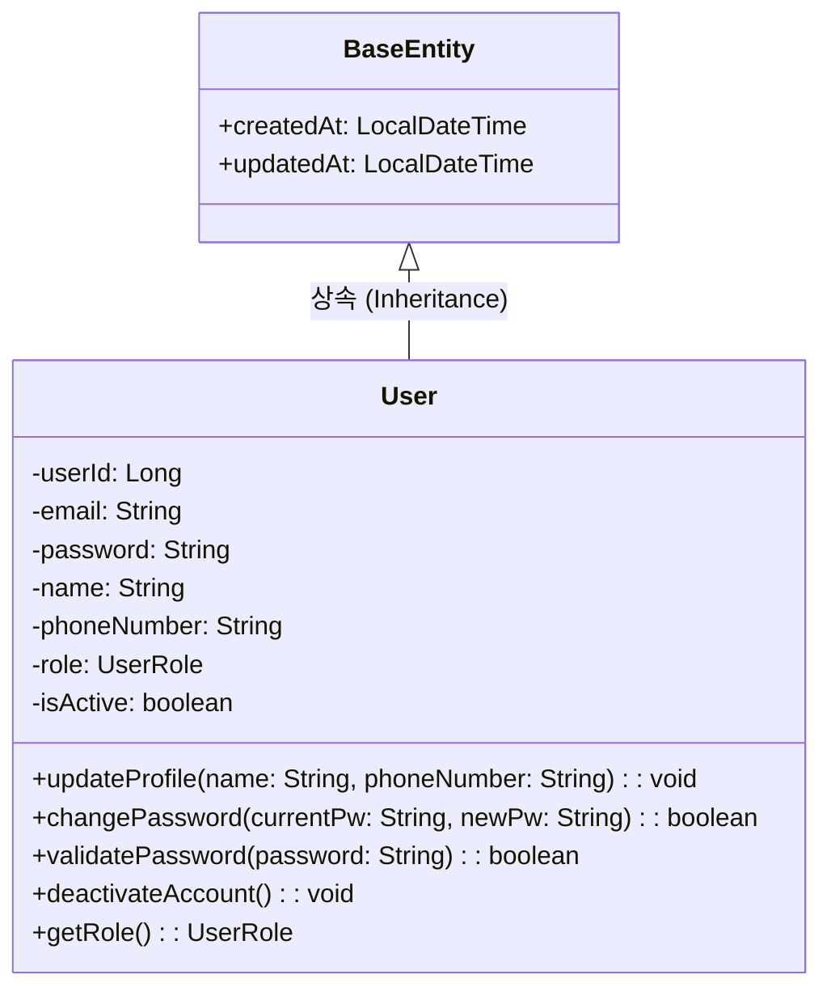

## 1.1. class description
일반 사용자의 기본 정보와 인증 정보를 관리하는 클래스이다. 회원가입, 로그인, 프로필 수정 등 사용자와 관련된 핵심 정보를 담고 있으며, 모든 사용자 유형의 기본이 되는 클래스이다.

## 1.2. attribution 구분

### 1.2.1. userId
* **name**: userId
* **type**: Long
* **visibility**: private
* **description**: 사용자를 고유하게 식별하기 위한 primary key로, 데이터베이스에서 자동 생성되는 사용자의 고유 ID이다.

### 1.2.2. email
* **name**: email
* **type**: String
* **visibility**: private
* **description**: 사용자의 이메일 주소로 로그인 ID로 사용되며, 시스템 내에서 고유해야 한다. 이메일 인증 및 알림 발송에도 사용된다.

### 1.2.3. password
* **name**: password
* **type**: String
* **visibility**: private
* **description**: BCrypt 알고리즘으로 암호화된 사용자의 비밀번호이다. 평문으로 저장되지 않으며, 보안을 위해 암호화된 형태로만 데이터베이스에 저장된다.

### 1.2.4. name
* **name**: name
* **type**: String
* **visibility**: private
* **description**: 사용자의 실명이다. 거래 시 본인 확인 및 계약서 작성에 사용되는 중요한 정보이다.

### 1.2.5. phoneNumber
* **name**: phoneNumber
* **type**: String
* **visibility**: private
* **description**: 사용자의 휴대폰 번호로, 연락처 확인 및 SMS 알림 발송에 사용된다.

### 1.2.6. role
* **name**: role
* **type**: UserRole
* **visibility**: private
* **description**: 사용자의 권한 수준을 나타내는 열거형 변수이다. GENERAL, BROKER, ADMIN 중 하나의 값을 가지며, 접근 권한 제어에 사용된다.

### 1.2.7. isActive
* **name**: isActive
* **type**: boolean
* **visibility**: private
* **description**: 사용자 계정의 활성화 상태를 나타낸다. false인 경우 로그인이 차단되며, 계정 정지나 탈퇴 시 사용된다.

### 1.2.8. createdAt
* **name**: createdAt
* **type**: LocalDateTime
* **visibility**: private
* **description**: 사용자 계정이 생성된 날짜와 시간이다. BaseEntity로부터 상속받아 자동으로 설정된다.

### 1.2.9. updatedAt
* **name**: updatedAt
* **type**: LocalDateTime
* **visibility**: private
* **description**: 사용자 정보가 마지막으로 수정된 날짜와 시간이다. BaseEntity로부터 상속받아 자동으로 업데이트된다.

## 1.3. Operations 구분

### 1.3.1. updateProfile
* **name**: updateProfile
* **type**: void
* **visibility**: public
* **description**: 사용자의 프로필 정보(이름, 전화번호 등)를 수정하는 메서드이다. 이메일과 비밀번호를 제외한 기본 정보를 업데이트한다.

### 1.3.2. changePassword
* **name**: changePassword
* **type**: boolean
* **visibility**: public
* **description**: 현재 비밀번호를 확인한 후 새로운 비밀번호로 변경하는 메서드이다. 변경 성공 시 true를 반환한다.

### 1.3.3. validatePassword
* **name**: validatePassword
* **type**: boolean
* **visibility**: public
* **description**: 입력받은 평문 비밀번호가 저장된 암호화된 비밀번호와 일치하는지 BCrypt를 통해 검증하는 메서드이다.

### 1.3.4. deactivateAccount
* **name**: deactivateAccount
* **type**: void
* **visibility**: public
* **description**: 사용자 계정을 비활성화하는 메서드이다. isActive를 false로 설정하여 로그인을 차단한다.

### 1.3.5. getRole
* **name**: getRole
* **type**: UserRole
* **visibility**: public
* **description**: 현재 사용자의 권한 수준을 반환하는 getter 메서드이다. 권한 검증 시 사용된다.


# Broker 클래스

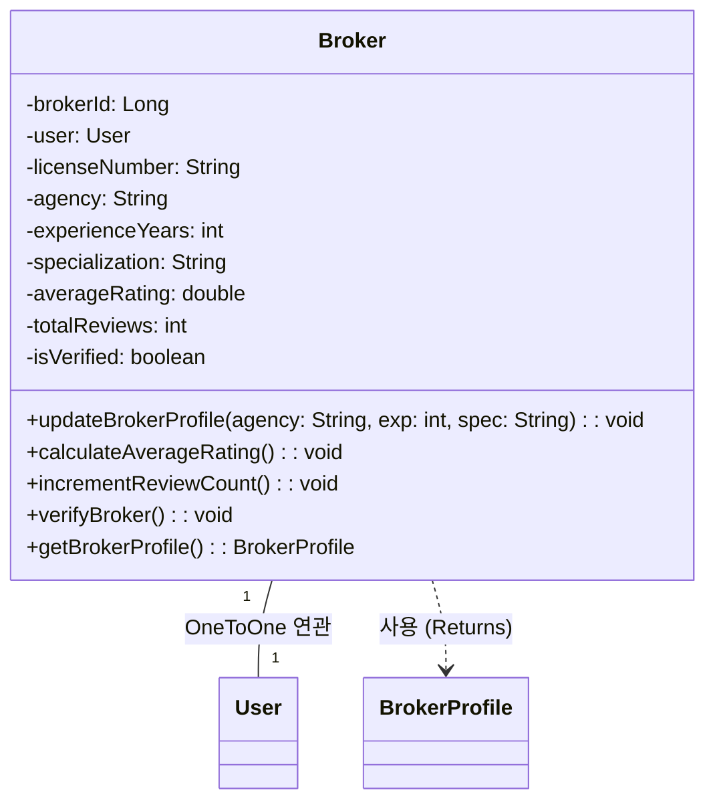

## 2.1. class description
브로커 사용자의 정보를 관리하는 클래스이다. User 클래스를 상속받아 일반 사용자의 모든 속성을 포함하며, 브로커 고유의 프로필 정보와 자격증 정보를 추가로 관리한다.

## 2.2. attribution 구분

### 2.2.1. brokerId
* **name**: brokerId
* **type**: Long
* **visibility**: private
* **description**: 브로커를 고유하게 식별하기 위한 primary key이다. userId와는 별도로 관리된다.

### 2.2.2. user
* **name**: user
* **type**: User
* **visibility**: private
* **description**: 연관된 User 객체에 대한 참조이다. OneToOne 관계로 브로커의 기본 사용자 정보를 담고 있다.

### 2.2.3. licenseNumber
* **name**: licenseNumber
* **type**: String
* **visibility**: private
* **description**: 브로커의 부동산 중개사 자격증 번호이다. 브로커 자격 검증에 필수적인 정보이다.

### 2.2.4. agency
* **name**: agency
* **type**: String
* **visibility**: private
* **description**: 브로커가 소속된 부동산 중개업소의 이름이다.

### 2.2.5. experienceYears
* **name**: experienceYears
* **type**: int
* **visibility**: private
* **description**: 브로커의 경력 연수이다. 프로필에 표시되어 신뢰도 판단 지표로 사용된다.

### 2.2.6. specialization
* **name**: specialization
* **type**: String
* **visibility**: private
* **description**: 브로커의 전문 분야이다. 예를 들어 아파트, 상가, 오피스텔 등의 특화 분야를 나타낸다.

### 2.2.7. averageRating
* **name**: averageRating
* **type**: double
* **visibility**: private
* **description**: 브로커가 받은 리뷰들의 평균 평점이다. 0.0부터 5.0까지의 값을 가진다.

### 2.2.8. totalReviews
* **name**: totalReviews
* **type**: int
* **visibility**: private
* **description**: 브로커가 받은 총 리뷰 개수이다. 신뢰도 판단에 사용된다.

### 2.2.9. isVerified
* **name**: isVerified
* **type**: boolean
* **visibility**: private
* **description**: 브로커의 자격증 및 소속 업소가 관리자에 의해 검증되었는지 여부를 나타낸다.

## 2.3. Operations 구분

### 2.3.1. updateBrokerProfile
* **name**: updateBrokerProfile
* **type**: void
* **visibility**: public
* **description**: 브로커의 프로필 정보(소속 업소, 전문 분야, 경력 등)를 수정하는 메서드이다.

### 2.3.2. calculateAverageRating
* **name**: calculateAverageRating
* **type**: void
* **visibility**: public
* **description**: 브로커가 받은 모든 리뷰의 평점을 계산하여 averageRating을 업데이트하는 메서드이다.

### 2.3.3. incrementReviewCount
* **name**: incrementReviewCount
* **type**: void
* **visibility**: public
* **description**: 새로운 리뷰가 등록될 때 totalReviews를 1 증가시키는 메서드이다.

### 2.3.4. verifyBroker
* **name**: verifyBroker
* **type**: void
* **visibility**: public
* **description**: 관리자가 브로커의 자격을 검증했을 때 isVerified를 true로 설정하는 메서드이다.

### 2.3.5. getBrokerProfile
* **name**: getBrokerProfile
* **type**: BrokerProfile
* **visibility**: public
* **description**: 브로커의 상세 프로필 정보를 BrokerProfile 객체로 반환하는 메서드이다.


# Admin 클래스

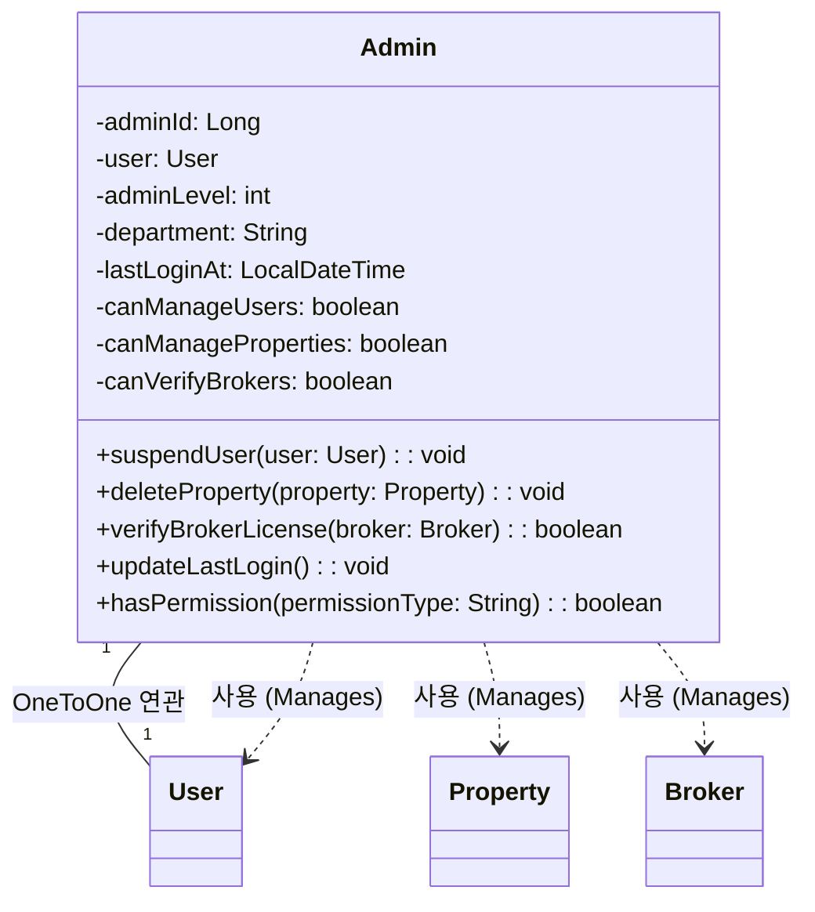

## 3.1. class description
시스템 관리자의 정보를 관리하는 클래스이다. User 클래스를 상속받아 일반 사용자의 모든 속성을 포함하며, 관리자 고유의 권한 및 활동 이력을 추가로 관리한다.

## 3.2. attribution 구분

### 3.2.1. adminId
* **name**: adminId
* **type**: Long
* **visibility**: private
* **description**: 관리자를 고유하게 식별하기 위한 primary key이다. userId와는 별도로 관리된다.

### 3.2.2. user
* **name**: user
* **type**: User
* **visibility**: private
* **description**: 연관된 User 객체에 대한 참조이다. OneToOne 관계로 관리자의 기본 사용자 정보를 담고 있다.

### 3.2.3. adminLevel
* **name**: adminLevel
* **type**: int
* **visibility**: private
* **description**: 관리자의 권한 수준을 나타낸다. 레벨이 높을수록 더 많은 관리 권한을 가진다.

### 3.2.4. department
* **name**: department
* **type**: String
* **visibility**: private
* **description**: 관리자가 소속된 부서명이다. 예를 들어 운영팀, 고객지원팀 등이 있다.

### 3.2.5. lastLoginAt
* **name**: lastLoginAt
* **type**: LocalDateTime
* **visibility**: private
* **description**: 관리자가 마지막으로 로그인한 날짜와 시간이다. 관리자 활동 모니터링에 사용된다.

### 3.2.6. canManageUsers
* **name**: canManageUsers
* **type**: boolean
* **visibility**: private
* **description**: 사용자 관리 권한이 있는지 여부를 나타낸다. true인 경우 사용자 계정을 차단하거나 삭제할 수 있다.

### 3.2.7. canManageProperties
* **name**: canManageProperties
* **type**: boolean
* **visibility**: private
* **description**: 매물 관리 권한이 있는지 여부를 나타낸다. true인 경우 부적절한 매물을 삭제하거나 수정할 수 있다.

### 3.2.8. canVerifyBrokers
* **name**: canVerifyBrokers
* **type**: boolean
* **visibility**: private
* **description**: 브로커 검증 권한이 있는지 여부를 나타낸다. true인 경우 브로커의 자격증을 검증할 수 있다.

## 3.3. Operations 구분

### 3.3.1. suspendUser
* **name**: suspendUser
* **type**: void
* **visibility**: public
* **description**: 특정 사용자의 계정을 정지시키는 메서드이다. canManageUsers 권한이 있어야 실행 가능하다.

### 3.3.2. deleteProperty
* **name**: deleteProperty
* **type**: void
* **visibility**: public
* **description**: 부적절한 매물을 삭제하는 메서드이다. canManageProperties 권한이 있어야 실행 가능하다.

### 3.3.3. verifyBrokerLicense
* **name**: verifyBrokerLicense
* **type**: boolean
* **visibility**: public
* **description**: 브로커의 자격증을 검증하는 메서드이다. 검증 성공 시 true를 반환하며, canVerifyBrokers 권한이 필요하다.

### 3.3.4. updateLastLogin
* **name**: updateLastLogin
* **type**: void
* **visibility**: public
* **description**: 관리자가 로그인할 때 lastLoginAt을 현재 시간으로 업데이트하는 메서드이다.

### 3.3.5. hasPermission
* **name**: hasPermission
* **type**: boolean
* **visibility**: public
* **description**: 특정 작업에 대한 권한이 있는지 확인하는 메서드이다. 권한 종류를 인자로 받아 해당 권한 여부를 반환한다.


# AuthService 클래스

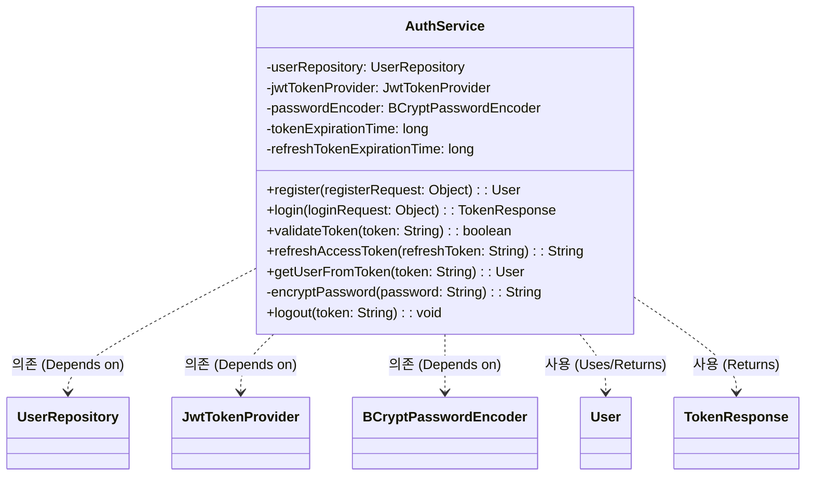

## 4.1. class description
사용자 인증 및 인가를 처리하는 서비스 클래스이다. 회원가입, 로그인, JWT 토큰 생성 및 검증, 비밀번호 암호화 등 인증과 관련된 모든 비즈니스 로직을 담당한다.

## 4.2. attribution 구분

### 4.2.1. userRepository
* **name**: userRepository
* **type**: UserRepository
* **visibility**: private
* **description**: User 엔티티에 대한 데이터베이스 접근을 담당하는 Repository이다. 사용자 정보 조회 및 저장에 사용된다.

### 4.2.2. jwtTokenProvider
* **name**: jwtTokenProvider
* **type**: JwtTokenProvider
* **visibility**: private
* **description**: JWT 토큰 생성 및 검증을 담당하는 컴포넌트이다. 액세스 토큰과 리프레시 토큰을 관리한다.

### 4.2.3. passwordEncoder
* **name**: passwordEncoder
* **type**: BCryptPasswordEncoder
* **visibility**: private
* **description**: 비밀번호를 BCrypt 알고L리즘으로 암호화하는 인코더이다. Spring Security에서 제공한다.

### 4.2.4. tokenExpirationTime
* **name**: tokenExpirationTime
* **type**: long
* **visibility**: private
* **description**: 액세스 토큰의 유효 시간이다. 밀리초 단위로 저장되며, 기본값은 1시간이다.

### 4.2.5. refreshTokenExpirationTime
* **name**: refreshTokenExpirationTime
* **type**: long
* **visibility**: private
* **description**: 리프레시 토큰의 유효 시간이다. 밀리초 단위로 저장되며, 기본값은 7일이다.

## 4.3. Operations 구분

### 4.3.1. register
* **name**: register
* **type**: User
* **visibility**: public
* **description**: 새로운 사용자를 회원가입 처리하는 메서드이다. 이메일 중복 확인, 비밀번호 암호화를 수행한 후 사용자를 데이터베이스에 저장하고 생성된 User 객체를 반환한다.

### 4.3.2. login
* **name**: login
* **type**: TokenResponse
* **visibility**: public
* **description**: 사용자 로그인을 처리하는 메서드이다. 이메일과 비밀번호를 검증한 후 액세스 토큰과 리프레시 토큰을 생성하여 TokenResponse 객체로 반환한다.

### 4.3.3. validateToken
* **name**: validateToken
* **type**: boolean
* **visibility**: public
* **description**: JWT 토큰의 유효성을 검증하는 메서드이다. 토큰의 서명, 만료 시간 등을 확인하여 유효한 토큰인지 판단한다.

### 4.3.4. refreshAccessToken
* **name**: refreshAccessToken
* **type**: String
* **visibility**: public
* **description**: 리프레시 토큰을 사용하여 새로운 액세스 토큰을 발급하는 메서드이다. 리프레시 토큰이 유효한 경우에만 새로운 액세스 토큰을 반환한다.

### 4.3.5. getUserFromToken
* **name**: getUserFromToken
* **type**: User
* **visibility**: public
* **description**: JWT 토큰에서 사용자 정보를 추출하는 메서드이다. 토큰의 클레임에서 사용자 ID를 가져와 해당 User 객체를 반환한다.

### 4.3.6. encryptPassword
* **name**: encryptPassword
* **type**: String
* **visibility**: private
* **description**: 평문 비밀번호를 BCrypt 알고리즘으로 암호화하는 메서드이다. 회원가입 및 비밀번호 변경 시 사용된다.

### 4.3.7. logout
* **name**: logout
* **type**: void
* **visibility**: public
* **description**: 사용자 로그아웃을 처리하는 메서드이다. 토큰을 무효화하거나 블랙리스트에 추가한다.


# UserRole 클래스

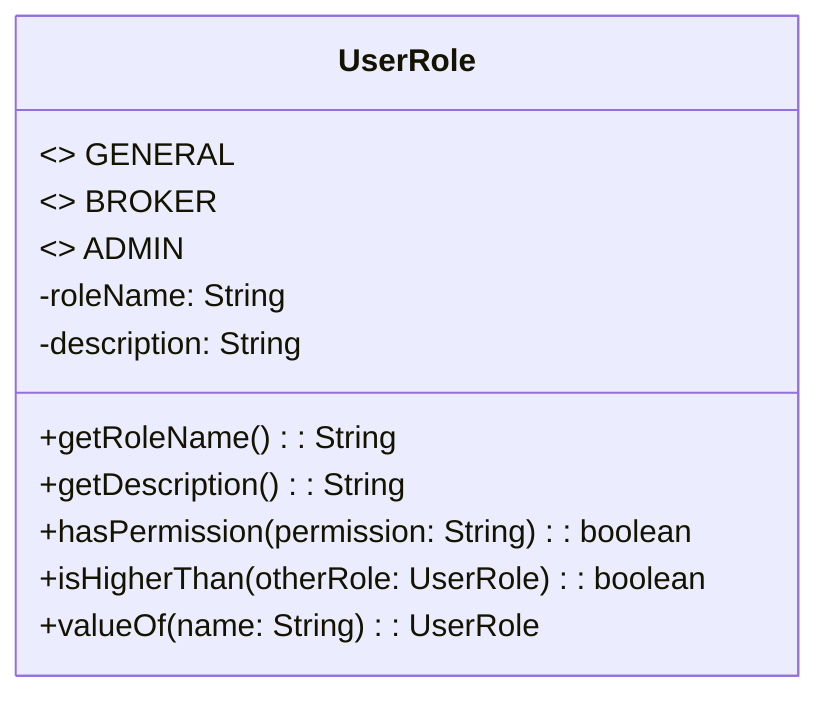

## 5.1. class description
사용자의 권한 수준을 정의하는 열거형(Enum) 클래스이다. GENERAL, BROKER, ADMIN의 세 가지 역할을 정의하며, 각 역할에 따라 시스템 접근 권한이 달라진다.

## 5.2. attribution 구분

### 5.2.1. GENERAL
* **name**: GENERAL
* **type**: UserRole
* **visibility**: public
* **description**: 일반 사용자를 나타내는 열거형 상수이다. 매물 검색, 관심 매물 등록, 브로커에게 중개 요청 등의 기본 기능을 사용할 수 있다.

### 5.2.2. BROKER
* **name**: BROKER
* **type**: UserRole
* **visibility**: public
* **description**: 브로커 사용자를 나타내는 열거형 상수이다. 일반 사용자의 모든 기능에 더해 프로필 관리, 중개 위임 수락, 고객과의 채팅 등의 기능을 사용할 수 있다.

### 5.2.3. ADMIN
* **name**: ADMIN
* **type**: UserRole
* **visibility**: public
* **description**: 관리자를 나타내는 열거형 상수이다. 시스템의 모든 기능에 접근할 수 있으며, 사용자 관리, 매물 관리, 브로커 검증 등의 관리 기능을 수행할 수 있다.

### 5.2.4. roleName
* **name**: roleName
* **type**: String
* **visibility**: private
* **description**: 역할의 이름을 문자열로 저장하는 속성이다. 예를 들어 GENERAL의 경우 "일반사용자", BROKER의 경우 "브로커"로 저장된다.

### 5.2.5. description
* **name**: description
* **type**: String
* **visibility**: private
* **description**: 각 역할에 대한 설명을 저장하는 속성이다. UI에 역할 정보를 표시할 때 사용된다.

## 5.3. Operations 구분

### 5.3.1. getRoleName
* **name**: getRoleName
* **type**: String
* **visibility**: public
* **description**: 역할의 이름을 반환하는 getter 메서드이다. UI에 사용자 권한을 표시할 때 사용된다.

### 5.3.2. getDescription
* **name**: getDescription
* **type**: String
* **visibility**: public
* **description**: 역할에 대한 설명을 반환하는 getter 메서드이다. 사용자에게 권한에 대한 안내를 제공할 때 사용된다.

### 5.3.3. hasPermission
* **name**: hasPermission
* **type**: boolean
* **visibility**: public
* **description**: 특정 기능에 대한 접근 권한이 있는지 확인하는 메서드이다. 권한 종류를 문자열로 받아 해당 역할이 그 권한을 가지고 있는지 boolean으로 반환한다.

### 5.3.4. isHigherThan
* **name**: isHigherThan
* **type**: boolean
* **visibility**: public
* **description**: 다른 역할과 비교하여 현재 역할의 권한 수준이 더 높은지 확인하는 메서드이다. 예를 들어 ADMIN이 BROKER보다 높은 권한을 가진다.

### 5.3.5. valueOf
* **name**: valueOf
* **type**: UserRole
* **visibility**: public static
* **description**: 문자열로부터 해당하는 UserRole 열거형 상수를 반환하는 정적 메서드이다. 데이터베이스에서 읽어온 문자열을 열거형으로 변환할 때 사용된다.

============================================================================================

# 2. 브로커 프로필 관련

# BrokerProfile 클래스

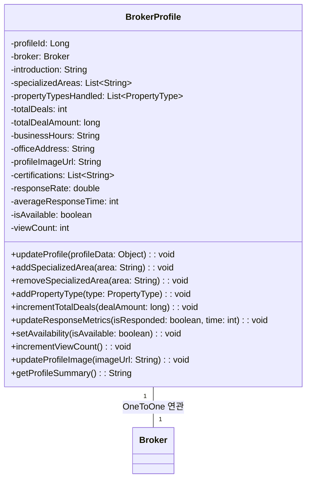

## 1.1. class description
브로커의 상세 프로필 정보를 관리하는 클래스이다. Broker 클래스와 OneToOne 관계를 맺으며, 브로커의 자기소개, 전문 지역, 거래 실적, 영업시간 등 고객에게 보여질 상세한 프로필 정보를 담고 있다. 이 클래스는 사용자가 브로커를 선택할 때 참고하는 핵심 정보를 제공한다.

## 1.2. attribution 구분

### 1.2.1. profileId
* **name**: profileId
* **type**: Long
* **visibility**: private
* **description**: 브로커 프로필을 고유하게 식별하기 위한 primary key이다. 데이터베이스에서 자동 생성되는 프로필의 고유 ID로, 각 브로커마다 하나의 프로필만 존재한다.

### 1.2.2. broker
* **name**: broker
* **type**: Broker
* **visibility**: private
* **description**: 이 프로필이 속한 브로커 객체에 대한 참조이다. OneToOne 관계로 연결되어 있으며, 브로커의 기본 정보에 접근할 때 사용된다.

### 1.2.3. introduction
* **name**: introduction
* **type**: String
* **visibility**: private
* **description**: 브로커의 자기소개 텍스트이다. 최대 1000자까지 작성할 수 있으며, 브로커의 경력, 강점, 서비스 철학 등을 자유롭게 표현한다. 고객들이 브로커의 성향을 파악하는 데 중요한 정보이다.

### 1.2.4. specializedAreas
* **name**: specializedAreas
* **type**: List\<String\>
* **visibility**: private
* **description**: 브로커가 전문적으로 다루는 지역 목록이다. 예를 들어 "강남구", "서초구", "송파구" 등이 포함될 수 있으며, 사용자가 특정 지역의 전문가를 찾을 때 필터링 기준으로 사용된다.

### 1.2.5. propertyTypesHandled
* **name**: propertyTypesHandled
* **type**: List\<PropertyType\>
* **visibility**: private
* **description**: 브로커가 주로 취급하는 매물 유형 목록이다. 아파트, 빌라, 오피스텔, 상가 등의 PropertyType 열거형 값들을 리스트로 저장하며, 각 브로커의 전문 분야를 명확히 보여준다.

### 1.2.6. totalDeals
* **name**: totalDeals
* **type**: int
* **visibility**: private
* **description**: 브로커가 성사시킨 총 거래 건수이다. 경력과 더불어 브로커의 실력을 보여주는 객관적인 지표로, 숫자가 높을수록 경험이 풍부한 브로커임을 나타낸다.

### 1.2.7. totalDealAmount
* **name**: totalDealAmount
* **type**: long
* **visibility**: private
* **description**: 브로커가 성사시킨 거래의 총 금액이다. 단위는 원이며, 브로커가 다룬 매물의 규모를 파악할 수 있는 지표이다. 고액 거래 경험이 많은 브로커를 찾을 때 참고된다.

### 1.2.8. businessHours
* **name**: businessHours
* **type**: String
* **visibility**: private
* **description**: 브로커의 영업 시간 정보이다. 예를 들어 "평일 09:00-18:00, 주말 10:00-17:00" 형식으로 저장되며, 고객이 연락 가능한 시간대를 확인할 수 있다.

### 1.2.9. officeAddress
* **name**: officeAddress
* **type**: String
* **visibility**: private
* **description**: 브로커가 근무하는 사무실의 주소이다. 직접 방문 상담을 원하는 고객들을 위한 정보이며, 지도 API와 연동하여 위치를 표시할 수 있다.

### 1.2.10. profileImageUrl
* **name**: profileImageUrl
* **type**: String
* **visibility**: private
* **description**: 브로커의 프로필 사진 URL이다. S3나 다른 클라우드 스토리지에 저장된 이미지 파일의 경로를 문자열로 저장하며, 사용자에게 브로커의 얼굴을 보여줌으로써 신뢰감을 높인다.

### 1.2.11. certifications
* **name**: certifications
* **type**: List\<String\>
* **visibility**: private
* **description**: 브로커가 보유한 자격증 및 인증서 목록이다. 부동산 관련 추가 자격증이나 교육 이수 내역을 저장하며, 전문성을 입증하는 데 사용된다.

### 1.2.12. responseRate
* **name**: responseRate
* **type**: double
* **visibility**: private
* **description**: 브로커의 문의 응답률이다. 0부터 100까지의 값을 가지며, 고객의 채팅이나 연락에 얼마나 빠르게 응답하는지를 백분율로 나타낸다. 높은 응답률은 성실한 브로커임을 보여준다.

### 1.2.13. averageResponseTime
* **name**: averageResponseTime
* **type**: int
* **visibility**: private
* **description**: 브로커의 평균 응답 시간이다. 단위는 분이며, 고객의 문의에 평균적으로 얼마나 빨리 답변하는지를 나타낸다. 빠른 응답 시간은 고객 만족도를 높이는 중요한 요소이다.

### 1.2.14. isAvailable
* **name**: isAvailable
* **type**: boolean
* **visibility**: private
* **description**: 브로커가 현재 새로운 의뢰를 받을 수 있는 상태인지를 나타낸다. false인 경우 일시적으로 휴무 중이거나 업무 포화 상태임을 의미하며, 사용자에게 표시된다.

### 1.2.15. viewCount
* **name**: viewCount
* **type**: int
* **visibility**: private
* **description**: 브로커 프로필이 조회된 총 횟수이다. 인기도를 나타내는 지표로 사용되며, 검색 결과 정렬 시 참고될 수 있다.

## 1.3. Operations 구분

### 1.3.1. updateProfile
* **name**: updateProfile
* **type**: void
* **visibility**: public
* **description**: 브로커가 자신의 프로필 정보를 수정하는 메서드이다. 자기소개, 전문 지역, 영업시간, 사무실 주소 등 변경 가능한 모든 정보를 업데이트할 수 있다. 수정 시 updatedAt 필드가 자동으로 갱신된다.

### 1.3.2. addSpecializedArea
* **name**: addSpecializedArea
* **type**: void
* **visibility**: public
* **description**: 브로커의 전문 지역 목록에 새로운 지역을 추가하는 메서드이다. 지역명을 매개변수로 받아 specializedAreas 리스트에 추가하며, 중복된 지역은 추가하지 않도록 검증한다.

### 1.3.3. removeSpecializedArea
* **name**: removeSpecializedArea
* **type**: void
* **visibility**: public
* **description**: 브로커의 전문 지역 목록에서 특정 지역을 제거하는 메서드이다. 더 이상 해당 지역을 전문적으로 다루지 않을 때 사용된다.

### 1.3.4. addPropertyType
* **name**: addPropertyType
* **type**: void
* **visibility**: public
* **description**: 브로커가 취급하는 매물 유형 목록에 새로운 유형을 추가하는 메서드이다. PropertyType 열거형을 매개변수로 받아 propertyTypesHandled 리스트에 추가한다.

### 1.3.5. incrementTotalDeals
* **name**: incrementTotalDeals
* **type**: void
* **visibility**: public
* **description**: 새로운 거래가 성사되었을 때 총 거래 건수를 1 증가시키는 메서드이다. 거래 금액을 매개변수로 받아 totalDealAmount도 함께 업데이트한다.

### 1.3.6. updateResponseMetrics
* **name**: updateResponseMetrics
* **type**: void
* **visibility**: public
* **description**: 새로운 문의 응답 데이터를 바탕으로 응답률과 평균 응답 시간을 재계산하는 메서드이다. 응답 여부와 응답 시간을 매개변수로 받아 통계를 업데이트한다.

### 1.3.7. setAvailability
* **name**: setAvailability
* **type**: void
* **visibility**: public
* **description**: 브로커의 현재 의뢰 가능 상태를 변경하는 메서드이다. boolean 값을 매개변수로 받아 isAvailable을 설정하며, 브로커가 휴가나 업무 과부하로 일시적으로 의뢰를 받을 수 없을 때 사용된다.

### 1.3.8. incrementViewCount
* **name**: incrementViewCount
* **type**: void
* **visibility**: public
* **description**: 브로커 프로필이 조회될 때마다 viewCount를 1 증가시키는 메서드이다. 프로필 페이지가 로드될 때 자동으로 호출되어 인기도를 추적한다.

### 1.3.9. updateProfileImage
* **name**: updateProfileImage
* **type**: void
* **visibility**: public
* **description**: 브로커의 프로필 사진을 변경하는 메서드이다. 새로운 이미지 URL을 매개변수로 받아 profileImageUrl을 업데이트하며, 이전 이미지는 스토리지에서 삭제할 수 있다.

### 1.3.10. getProfileSummary
* **name**: getProfileSummary
* **type**: String
* **visibility**: public
* **description**: 브로커 프로필의 요약 정보를 반환하는 메서드이다. 이름, 경력 연수, 평균 평점, 총 거래 건수 등 핵심 정보를 간단한 문자열로 조합하여 리스트 뷰에서 표시할 때 사용된다.


# BrokerReview 클래스

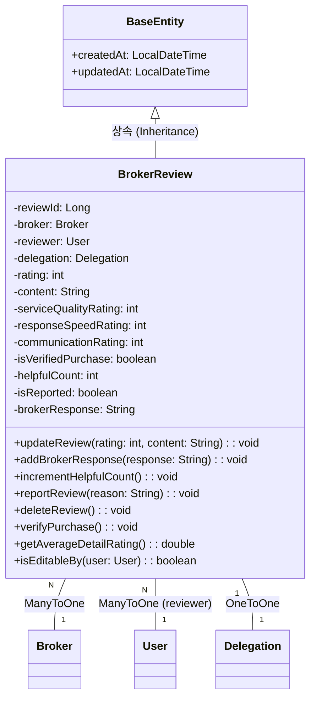

## 2.1. class description
브로커에 대한 고객의 리뷰를 관리하는 클래스이다. 중개 서비스를 이용한 사용자가 브로커에게 남긴 평점과 후기를 저장하며, 다른 사용자들이 브로커를 선택할 때 중요한 참고 자료가 된다. 각 리뷰는 작성자, 대상 브로커, 평점, 내용, 작성일 등의 정보를 포함한다.

## 2.2. attribution 구분

### 2.2.1. reviewId
* **name**: reviewId
* **type**: Long
* **visibility**: private
* **description**: 리뷰를 고유하게 식별하기 위한 primary key이다. 데이터베이스에서 자동 생성되는 리뷰의 고유 ID로, 각 리뷰를 구분하는 데 사용된다.

### 2.2.2. broker
* **name**: broker
* **type**: Broker
* **visibility**: private
* **description**: 리뷰 대상이 되는 브로커 객체에 대한 참조이다. ManyToOne 관계로, 한 브로커는 여러 개의 리뷰를 받을 수 있다. 이 참조를 통해 특정 브로커의 모든 리뷰를 조회할 수 있다.

### 2.2.3. reviewer
* **name**: reviewer
* **type**: User
* **visibility**: private
* **description**: 리뷰를 작성한 사용자 객체에 대한 참조이다. ManyToOne 관계로, 한 사용자는 여러 브로커에게 리뷰를 남길 수 있다. 리뷰어의 이름과 정보를 표시할 때 사용된다.

### 2.2.4. delegation
* **name**: delegation
* **type**: Delegation
* **visibility**: private
* **description**: 이 리뷰가 연관된 중개 위임 건에 대한 참조이다. OneToOne 관계로, 각 중개 위임이 완료된 후 하나의 리뷰를 남길 수 있다. 실제 거래를 경험한 사용자만 리뷰를 작성하도록 보장한다.

### 2.2.5. rating
* **name**: rating
* **type**: int
* **visibility**: private
* **description**: 브로커에 대한 평점이다. 1부터 5까지의 정수값을 가지며, 5점이 가장 높은 평가이다. 이 값들이 모여 브로커의 평균 평점을 계산하는 데 사용된다.

### 2.2.6. content
* **name**: content
* **type**: String
* **visibility**: private
* **description**: 리뷰의 상세 내용이다. 최대 1000자까지 작성할 수 있으며, 브로커의 서비스에 대한 구체적인 경험과 평가를 자유롭게 서술한다. 다른 사용자들이 브로커를 선택할 때 실질적인 도움을 준다.

### 2.2.7. serviceQualityRating
* **name**: serviceQualityRating
* **type**: int
* **visibility**: private
* **description**: 서비스 품질에 대한 세부 평점이다. 1부터 5까지의 값을 가지며, 브로커의 전문성, 친절도, 정확성 등을 구체적으로 평가한다.

### 2.2.8. responseSpeedRating
* **name**: responseSpeedRating
* **type**: int
* **visibility**: private
* **description**: 응답 속도에 대한 세부 평점이다. 1부터 5까지의 값을 가지며, 브로커가 문의나 요청에 얼마나 신속하게 응답했는지를 평가한다.

### 2.2.9. communicationRating
* **name**: communicationRating
* **type**: int
* **visibility**: private
* **description**: 의사소통 능력에 대한 세부 평점이다. 1부터 5까지의 값을 가지며, 브로커의 설명 능력, 경청 태도 등을 평가한다.

### 2.2.10. isVerifiedPurchase
* **name**: isVerifiedPurchase
* **type**: boolean
* **visibility**: private
* **description**: 실제 거래를 완료한 후 작성된 리뷰인지를 나타낸다. delegation이 완료 상태인 경우 자동으로 true가 되며, 검증된 리뷰임을 표시하여 신뢰도를 높인다.

### 2.2.11. helpfulCount
* **name**: helpfulCount
* **type**: int
* **visibility**: private
* **description**: 다른 사용자들이 이 리뷰를 도움이 된다고 표시한 횟수이다. 리뷰의 유용성을 나타내는 지표로, 정렬 시 우선순위를 결정하는 데 사용된다.

### 2.2.12. isReported
* **name**: isReported
* **type**: boolean
* **visibility**: private
* **description**: 이 리뷰가 부적절한 내용으로 신고되었는지를 나타낸다. true인 경우 관리자 검토 대기 상태이며, 일시적으로 공개가 제한될 수 있다.

### 2.2.13. brokerResponse
* **name**: brokerResponse
* **type**: String
* **visibility**: private
* **description**: 브로커가 리뷰에 대해 남긴 답변이다. 최대 500자까지 작성할 수 있으며, 브로커가 고객의 의견에 성실하게 응대하는 모습을 보여줄 수 있다.

### 2.2.14. createdAt
* **name**: createdAt
* **type**: LocalDateTime
* **visibility**: private
* **description**: 리뷰가 작성된 날짜와 시간이다. BaseEntity로부터 상속받아 자동으로 설정되며, 최신 리뷰를 우선 표시하는 정렬 기준으로 사용된다.

### 2.2.15. updatedAt
* **name**: updatedAt
* **type**: LocalDateTime
* **visibility**: private
* **description**: 리뷰가 마지막으로 수정된 날짜와 시간이다. 리뷰어가 내용을 수정하거나 브로커가 답변을 추가할 때 자동으로 갱신된다.

## 2.3. Operations 구분

### 2.3.1. updateReview
* **name**: updateReview
* **type**: void
* **visibility**: public
* **description**: 리뷰 작성자가 리뷰 내용을 수정하는 메서드이다. 평점과 내용을 매개변수로 받아 업데이트하며, 작성 후 일정 기간 내에만 수정이 가능하도록 제한할 수 있다.

### 2.3.2. addBrokerResponse
* **name**: addBrokerResponse
* **type**: void
* **visibility**: public
* **description**: 브로커가 리뷰에 대한 답변을 작성하는 메서드이다. 답변 내용을 매개변수로 받아 brokerResponse 필드를 설정하며, 브로커만 자신의 리뷰에 답변할 수 있도록 권한을 확인한다.

### 2.3.3. incrementHelpfulCount
* **name**: incrementHelpfulCount
* **type**: void
* **visibility**: public
* **description**: 사용자가 리뷰를 도움이 된다고 표시할 때 helpfulCount를 1 증가시키는 메서드이다. 같은 사용자가 중복으로 표시하지 못하도록 검증이 필요하다.

### 2.3.4. reportReview
* **name**: reportReview
* **type**: void
* **visibility**: public
* **description**: 사용자가 부적절한 리뷰를 신고하는 메서드이다. 신고 사유를 매개변수로 받아 isReported를 true로 설정하고, 관리자에게 알림을 전송한다.

### 2.3.5. deleteReview
* **name**: deleteReview
* **type**: void
* **visibility**: public
* **description**: 리뷰를 삭제하는 메서드이다. 작성자 본인이나 관리자만 삭제할 수 있으며, 실제로는 데이터를 삭제하지 않고 isDeleted 플래그를 설정하는 소프트 삭제를 수행한다.

### 2.3.6. verifyPurchase
* **name**: verifyPurchase
* **type**: void
* **visibility**: public
* **description**: 연관된 중개 위임이 완료되었을 때 isVerifiedPurchase를 true로 설정하는 메서드이다. 실제 거래를 기반으로 한 검증된 리뷰임을 표시한다.

### 2.3.7. getAverageDetailRating
* **name**: getAverageDetailRating
* **type**: double
* **visibility**: public
* **description**: 세부 평점들(서비스 품질, 응답 속도, 의사소통)의 평균을 계산하여 반환하는 메서드이다. 브로커의 다양한 측면을 종합적으로 평가하는 데 사용된다.

### 2.3.8. isEditableBy
* **name**: isEditableBy
* **type**: boolean
* **visibility**: public
* **description**: 특정 사용자가 이 리뷰를 수정할 수 있는 권한이 있는지 확인하는 메서드이다. 작성자 본인이거나 작성 후 일정 시간이 지나지 않았을 때 true를 반환한다.


# BrokerRating 클래스

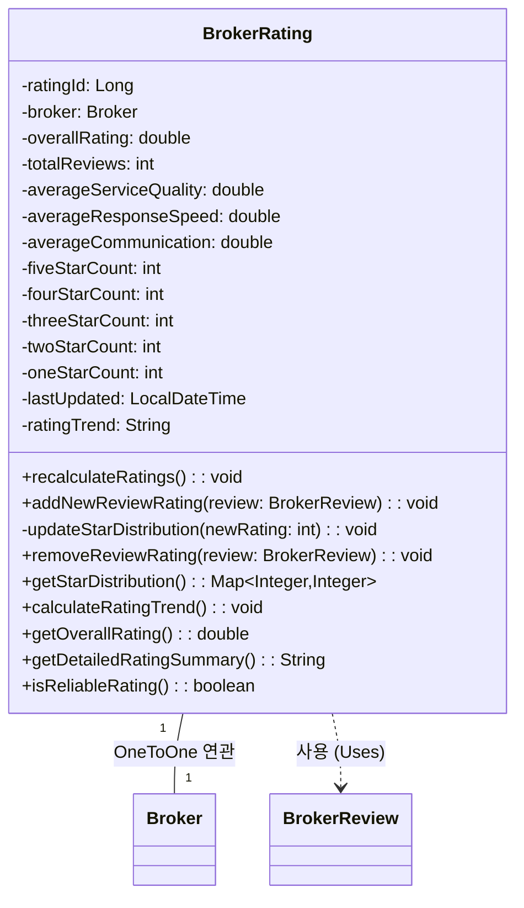

## 3.1. class description
브로커의 평점을 계산하고 관리하는 클래스이다. 여러 리뷰의 평점을 종합하여 브로커의 전체 평균 평점을 계산하고, 각 세부 항목별 평점도 산출한다. 이 클래스는 브로커의 평가 지표를 실시간으로 업데이트하고, 사용자에게 신뢰할 수 있는 평점 정보를 제공하는 역할을 한다.

## 3.2. attribution 구분

### 3.2.1. ratingId
* **name**: ratingId
* **type**: Long
* **visibility**: private
* **description**: 평점 레코드를 고유하게 식별하기 위한 primary key이다. 데이터베이스에서 자동 생성되는 평점의 고유 ID로, 각 브로커마다 하나의 평점 레코드를 가진다.

### 3.2.2. broker
* **name**: broker
* **type**: Broker
* **visibility**: private
* **description**: 이 평점이 속한 브로커 객체에 대한 참조이다. OneToOne 관계로 연결되어 있으며, 각 브로커는 하나의 종합 평점 정보를 가진다.

### 3.2.3. overallRating
* **name**: overallRating
* **type**: double
* **visibility**: private
* **description**: 브로커의 전체 평균 평점이다. 0.0부터 5.0까지의 값을 가지며, 소수점 첫째 자리까지 표시된다. 모든 리뷰의 rating 값을 평균하여 계산되며, 브로커 검색 시 가장 중요한 정렬 기준 중 하나이다.

### 3.2.4. totalReviews
* **name**: totalReviews
* **type**: int
* **visibility**: private
* **description**: 브로커가 받은 총 리뷰 개수이다. 평점의 신뢰도를 판단하는 데 중요한 지표로, 리뷰 개수가 많을수록 평점의 신뢰성이 높아진다.

### 3.2.5. averageServiceQuality
* **name**: averageServiceQuality
* **type**: double
* **visibility**: private
* **description**: 서비스 품질에 대한 평균 평점이다. 0.0부터 5.0까지의 값을 가지며, 모든 리뷰의 serviceQualityRating을 평균하여 계산된다.

### 3.2.6. averageResponseSpeed
* **name**: averageResponseSpeed
* **type**: double
* **visibility**: private
* **description**: 응답 속도에 대한 평균 평점이다. 0.0부터 5.0까지의 값을 가지며, 모든 리뷰의 responseSpeedRating을 평균하여 계산된다.

### 3.2.7. averageCommunication
* **name**: averageCommunication
* **type**: double
* **visibility**: private
* **description**: 의사소통 능력에 대한 평균 평점이다. 0.0부터 5.0까지의 값을 가지며, 모든 리뷰의 communicationRating을 평균하여 계산된다.

### 3.2.8. fiveStarCount
* **name**: fiveStarCount
* **type**: int
* **visibility**: private
* **description**: 5점 평점을 받은 리뷰의 개수이다. 평점 분포를 시각화할 때 사용되며, 브로커의 우수성을 나타내는 지표이다.

### 3.2.9. fourStarCount
* **name**: fourStarCount
* **type**: int
* **visibility**: private
* **description**: 4점 평점을 받은 리뷰의 개수이다. 평점 분포 분석에 사용된다.

### 3.2.10. threeStarCount
* **name**: threeStarCount
* **type**: int
* **visibility**: private
* **description**: 3점 평점을 받은 리뷰의 개수이다. 평점 분포 분석에 사용된다.

### 3.2.11. twoStarCount
* **name**: twoStarCount
* **type**: int
* **visibility**: private
* **description**: 2점 평점을 받은 리뷰의 개수이다. 평점 분포 분석에 사용된다.

### 3.2.12. oneStarCount
* **name**: oneStarCount
* **type**: int
* **visibility**: private
* **description**: 1점 평점을 받은 리뷰의 개수이다. 평점 분포를 완성하며, 낮은 평가를 받은 경우를 파악하는 데 사용된다.

### 3.2.13. lastUpdated
* **name**: lastUpdated
* **type**: LocalDateTime
* **visibility**: private
* **description**: 평점이 마지막으로 업데이트된 날짜와 시간이다. 새로운 리뷰가 추가되거나 기존 리뷰가 수정될 때 자동으로 갱신된다.

### 3.2.14. ratingTrend
* **name**: ratingTrend
* **type**: String
* **visibility**: private
* **description**: 최근 평점의 변화 추세를 나타낸다. "상승", "유지", "하락" 중 하나의 값을 가지며, 최근 3개월간의 평점 변화를 분석하여 설정된다.

## 3.3. Operations 구분

### 3.3.1. recalculateRatings
* **name**: recalculateRatings
* **type**: void
* **visibility**: public
* **description**: 브로커의 모든 리뷰를 다시 조회하여 평점을 재계산하는 메서드이다. 전체 평균 평점과 세부 항목별 평점을 모두 업데이트하며, 새로운 리뷰가 추가되거나 기존 리뷰가 수정/삭제될 때 호출된다.

### 3.3.2. addNewReviewRating
* **name**: addNewReviewRating
* **type**: void
* **visibility**: public
* **description**: 새로운 리뷰가 추가되었을 때 기존 평점에 새 평점을 반영하는 메서드이다. BrokerReview 객체를 매개변수로 받아, 전체 평점을 재계산하지 않고 효율적으로 업데이트한다. 리뷰 개수가 많을 때 성능상 이점이 있다.

### 3.3.3. updateStarDistribution
* **name**: updateStarDistribution
* **type**: void
* **visibility**: private
* **description**: 새로운 평점이 추가될 때 해당 평점에 맞는 카운터를 증가시키는 메서드이다. 예를 들어 5점 리뷰가 추가되면 fiveStarCount를 1 증가시킨다.

### 3.3.4. removeReviewRating
* **name**: removeReviewRating
* **type**: void
* **visibility**: public
* **description**: 리뷰가 삭제되었을 때 해당 리뷰의 평점을 전체 평점에서 제외하는 메서드이다. BrokerReview 객체를 매개변수로 받아 평점을 재계산하고 별점 분포도 조정한다.

### 3.3.5. getStarDistribution
* **name**: getStarDistribution
* **type**: Map\<Integer, Integer\>
* **visibility**: public
* **description**: 1점부터 5점까지의 평점 분포를 Map 형태로 반환하는 메서드이다. UI에서 평점 분포를 막대 그래프나 원형 차트로 표시할 때 사용된다.

### 3.3.6. calculateRatingTrend
* **name**: calculateRatingTrend
* **type**: void
* **visibility**: public
* **description**: 최근 3개월간의 평점 변화를 분석하여 ratingTrend를 업데이트하는 메서드이다. 이전 기간과 현재 기간의 평점을 비교하여 상승, 유지, 하락 중 하나를 설정한다.

### 3.3.7. getOverallRating
* **name**: getOverallRating
* **type**: double
* **visibility**: public
* **description**: 현재 전체 평균 평점을 반환하는 getter 메서드이다. 브로커 리스트나 프로필 페이지에서 평점을 표시할 때 사용된다.

### 3.3.8. getDetailedRatingSummary
* **name**: getDetailedRatingSummary
* **type**: String
* **visibility**: public
* **description**: 전체 평점, 리뷰 개수, 세부 항목별 평점을 포함한 종합 요약 정보를 문자열로 반환하는 메서드이다. 브로커 프로필에서 평점 정보를 상세히 표시할 때 사용된다.

### 3.3.9. isReliableRating
* **name**: isReliableRating
* **type**: boolean
* **visibility**: public
* **description**: 평점이 신뢰할 수 있는 수준인지 판단하는 메서드이다. 일반적으로 리뷰 개수가 10개 이상일 때 신뢰할 수 있다고 판단하며, 이를 기반으로 사용자에게 정보를 제공한다.

============================================================================================

# 3. 매물 관련

# PropertyController 클래스

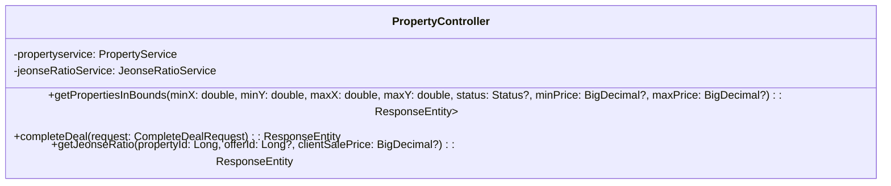
## 1.1. class description
지도 범위 검색, 거래 완료 처리, 전세가율 계산 요청을 처리하는 클래스이다. REST 요청을 검증하고 서비스 계층에 위임한다.

## 1.2. attribution 구분

### 1.2.1. propertyservice
* **name**: propertyservice
* **type**: PropertyService
* **visibility**: private
* **description**: 지도/상세/거래완료 로직을 수행한다.

### 1.2.2. jeonseRatioService
* **name**: jeonseRatioService
* **type**: JeonseRatioService
* **visibility**: private
* **description**: 전세가율 계산을 수행한다.

## 1.3. Operations 구분

### 1.3.1. getPropertiesInBounds
* **name**: getPropertiesInBounds
* **type**: ResponseEntity<List<PropertyMarkerDto>>
* **visibility**: public
* **description**: 지도 사각 범위와 상태/가격 조건으로 매물 마커 목록을 조회한다.

### 1.3.2. completeDeal
* **name**: completeDeal
* **type**: ResponseEntity<Void>
* **visibility**: public
* **description**: 브로커 권한 확인 후 특정 매물을 거래 완료로 처리한다.

### 1.3.3. getJeonseRatio
* **name**: getJeonseRatio
* **type**: ResponseEntity<JeonseRatioResponse>
* **visibility**: public
* **description**: 전세가율을 계산하여 반환한다.


# PropertyFavoriteController 클래스

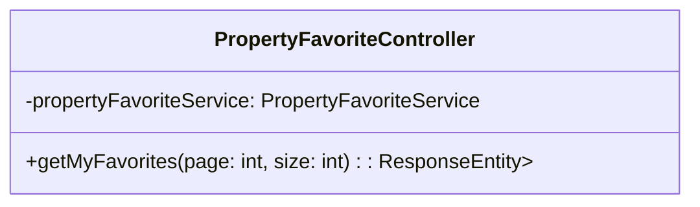
## 2.1. class description
인증 사용자의 찜 목록 API를 제공하는 클래스이다. 로그인 컨텍스트를 이용해 페이지네이션 조회를 수행한다.

## 2.2. attribution 구분

### 2.2.1. propertyFavoriteService
* **name**: propertyFavoriteService
* **type**: PropertyFavoriteService
* **visibility**: private
* **description**: 찜 목록 조회 비즈니스 로직을 수행한다.

## 2.3. Operations 구분

### 2.3.1. getMyFavorites
* **name**: getMyFavorites
* **type**: ResponseEntity<List<PropertyFavoriteDto>>
* **visibility**: public
* **description**: 로그인 사용자의 찜 목록을 조회한다.


# PropertyFavoriteToggleController 클래스

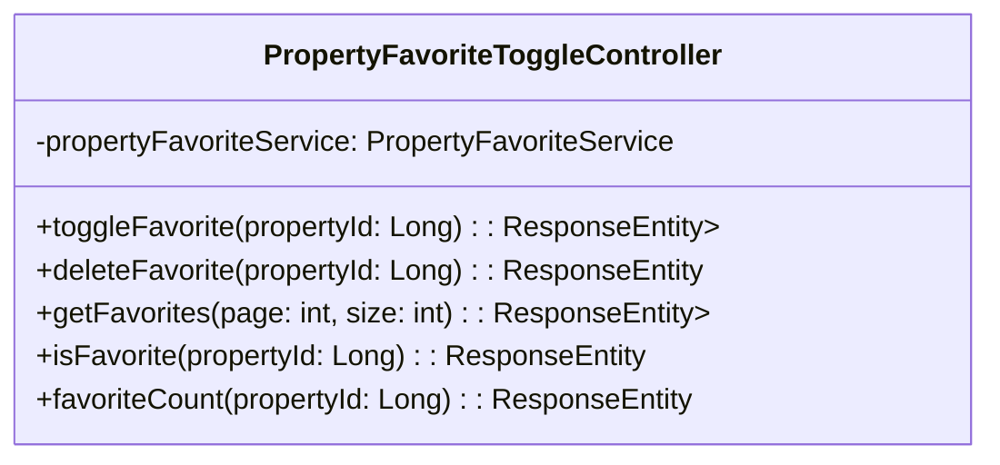
## 3.1. class description
특정 매물에 대한 찜 on/off 토글 및 조회 기능을 제공하는 클래스이다.

## 3.2. attribution 구분

### 3.2.1. propertyFavoriteService
* **name**: propertyFavoriteService
* **type**: PropertyFavoriteService
* **visibility**: private
* **description**: 찜 토글/카운트 로직을 수행한다.

## 3.3. Operations 구분

### 3.3.1. toggleFavorite
* **name**: toggleFavorite
* **type**: ResponseEntity<Map<String, Boolean>>
* **visibility**: public
* **description**: 해당 매물의 찜 상태를 토글한다.

### 3.3.2. deleteFavorite
* **name**: deleteFavorite
* **type**: ResponseEntity<Void>
* **visibility**: public
* **description**: 해당 매물의 찜을 해제한다.

### 3.3.3. getFavorites
* **name**: getFavorites
* **type**: ResponseEntity<List<PropertyFavoriteDto>>
* **visibility**: public
* **description**: 내 찜 목록을 조회한다.

### 3.3.4. isFavorite
* **name**: isFavorite
* **type**: ResponseEntity<Boolean>
* **visibility**: public
* **description**: 특정 매물에 대한 내 찜 여부를 반환한다.

### 3.3.5. favoriteCount
* **name**: favoriteCount
* **type**: ResponseEntity<Long>
* **visibility**: public
* **description**: 해당 매물의 총 찜 수를 반환한다.


# PropertyOfferController 클래스

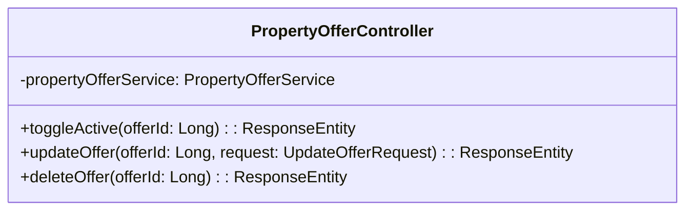
## 4.1. class description
매물 오퍼의 활성화/수정/삭제를 처리하는 클래스이다. 오퍼 소유자 권한을 검증한다.

## 4.2. attribution 구분

### 4.2.1. propertyOfferService
* **name**: propertyOfferService
* **type**: PropertyOfferService
* **visibility**: private
* **description**: 오퍼 권한 검증과 상태 변경을 수행한다.

## 4.3. Operations 구분

### 4.3.1. toggleActive
* **name**: toggleActive
* **type**: ResponseEntity<PropertyOfferResponse>
* **visibility**: public
* **description**: 특정 오퍼의 활성/비활성을 토글한다.

### 4.3.2. updateOffer
* **name**: updateOffer
* **type**: ResponseEntity<PropertyOfferResponse>
* **visibility**: public
* **description**: 오퍼의 상세 정보를 수정한다.

### 4.3.3. deleteOffer
* **name**: deleteOffer
* **type**: ResponseEntity<Void>
* **visibility**: public
* **description**: 정책 검증 후 오퍼를 삭제한다.


# PropertyQueryController 클래스

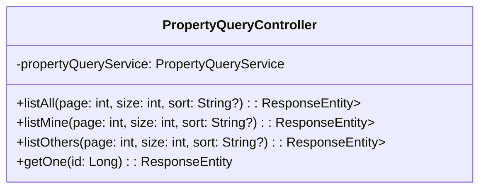
## 5.1. class description
목록/상세 조회(전체/내 것/타인 것) 엔드포인트를 제공하는 클래스이다.

## 5.2. attribution 구분

### 5.2.1. propertyQueryService
* **name**: propertyQueryService
* **type**: PropertyQueryService
* **visibility**: private
* **description**: 페이지네이션·정렬·상세 변환 로직을 수행한다.

## 5.3. Operations 구분

### 5.3.1. listAll
* **name**: listAll
* **type**: ResponseEntity<List<PropertyResponse>>
* **visibility**: public
* **description**: 전체 매물 목록을 조회한다.

### 5.3.2. listMine
* **name**: listMine
* **type**: ResponseEntity<List<PropertyResponse>>
* **visibility**: public
* **description**: 내가 등록한 매물 목록을 조회한다.

### 5.3.3. listOthers
* **name**: listOthers
* **type**: ResponseEntity<List<PropertyResponse>>
* **visibility**: public
* **description**: 타인이 등록한 매물 목록을 조회한다.

### 5.3.4. getOne
* **name**: getOne
* **type**: ResponseEntity<PropertyWithOffersDto>
* **visibility**: public
* **description**: 단건 상세(오퍼 포함)를 조회한다.


# PropertySearchController 클래스

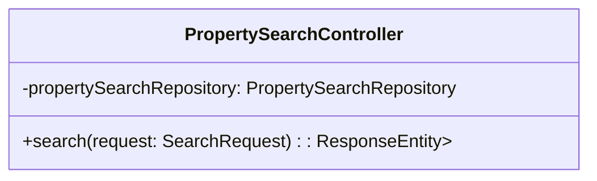
## 6.1. class description
복합 조건의 검색을 수행하는 클래스이다.

## 6.2. attribution 구분

### 6.2.1. propertySearchRepository
* **name**: propertySearchRepository
* **type**: PropertySearchRepository
* **visibility**: private
* **description**: 동적 쿼리 빌드를 통해 검색을 수행한다.

## 6.3. Operations 구분

### 6.3.1. search
* **name**: search
* **type**: ResponseEntity<List<PropertyResponse>>
* **visibility**: public
* **description**: SearchRequest 바디를 받아 조건 검색을 수행한다.


# CompleteDealRequest 클래스

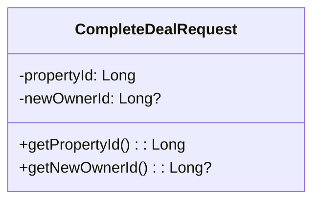
## 7.1. class description
거래 완료 처리에 필요한 입력 값을 담는 클래스이다.

## 7.2. attribution 구분

### 7.2.1. propertyId
* **name**: propertyId
* **type**: Long
* **visibility**: private
* **description**: 거래 완료 대상 매물의 식별자이다.

### 7.2.2. newOwnerId
* **name**: newOwnerId
* **type**: Long?
* **visibility**: private
* **description**: 거래 완료 시 새 소유자의 식별자이다(선택).

## 7.3. Operations 구분

### 7.3.1. getters/setters
* **name**: getters/setters
* **type**: Long / Long?
* **visibility**: public
* **description**: 직렬화/역직렬화를 위해 접근자를 제공한다.


# JeonseRatioResponse 클래스

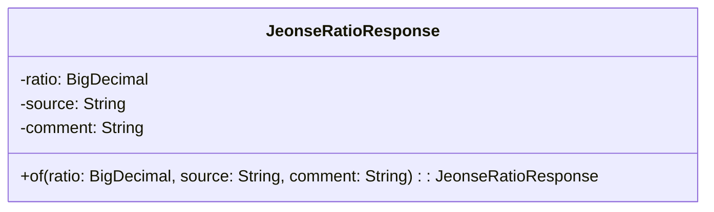
## 8.1. class description
전세가율 계산 결과를 담는 클래스이다.

## 8.2. attribution 구분

### 8.2.1. ratio
* **name**: ratio
* **type**: BigDecimal
* **visibility**: private
* **description**: 계산된 전세가율 값이다.

### 8.2.2. source
* **name**: source
* **type**: String
* **visibility**: private
* **description**: 매매가의 출처를 나타낸다.

### 8.2.3. comment
* **name**: comment
* **type**: String
* **visibility**: private
* **description**: 전세가율 해석 코멘트이다.

## 8.3. Operations 구분

### 8.3.1. of
* **name**: of
* **type**: static factory
* **visibility**: public
* **description**: 전달된 값으로 응답 객체를 생성한다.


# PropertyDetailDto 클래스

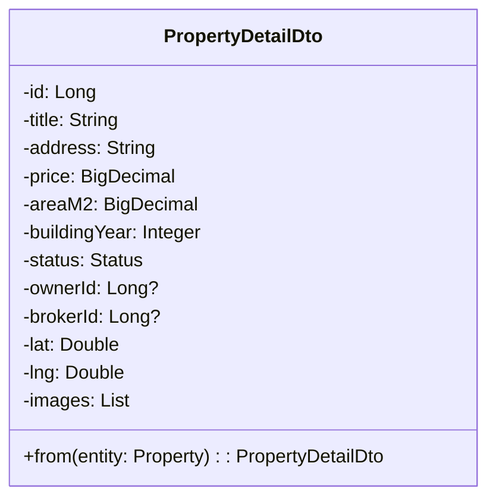
## 9.1. class description
단건 상세 화면에 필요한 매물 정보를 묶는 클래스이다.

## 9.2. attribution 구분

### 9.2.1. id
* **name**: id
* **type**: Long
* **visibility**: private
* **description**: 매물의 식별자이다.

### 9.2.2. title
* **name**: title
* **type**: String
* **visibility**: private
* **description**: 매물의 제목이다.

### 9.2.3. address
* **name**: address
* **type**: String
* **visibility**: private
* **description**: 매물의 주소이다.

### 9.2.4. price
* **name**: price
* **type**: BigDecimal
* **visibility**: private
* **description**: 대표 가격(매매가)이다.

### 9.2.5. areaM2
* **name**: areaM2
* **type**: BigDecimal
* **visibility**: private
* **description**: 전용면적(m²)이다.

### 9.2.6. buildingYear
* **name**: buildingYear
* **type**: Integer
* **visibility**: private
* **description**: 준공년도이다.

### 9.2.7. status
* **name**: status
* **type**: Enum
* **visibility**: private
* **description**: 매물의 상태이다.

### 9.2.8. ownerId
* **name**: ownerId
* **type**: Long?
* **visibility**: private
* **description**: 소유자 식별자이다.

### 9.2.9. brokerId
* **name**: brokerId
* **type**: Long?
* **visibility**: private
* **description**: 브로커 식별자이다.

### 9.2.10. lat
* **name**: lat
* **type**: Double
* **visibility**: private
* **description**: 위도 값이다.

### 9.2.11. lng
* **name**: lng
* **type**: Double
* **visibility**: private
* **description**: 경도 값이다.

### 9.2.12. images
* **name**: images
* **type**: List<String>
* **visibility**: private
* **description**: 이미지 URL 목록이다.

## 9.3. Operations 구분

### 9.3.1. from
* **name**: from
* **type**: static builder
* **visibility**: public
* **description**: 엔티티와 연관 데이터로 DTO를 생성한다.


# PropertyFavoriteDto 클래스

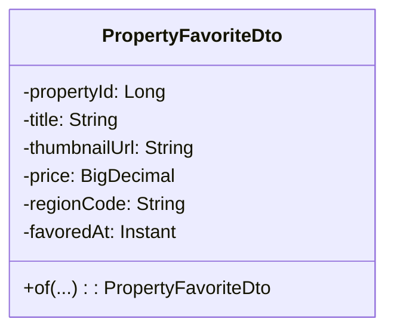
## 10.1. class description
찜 카드 목록 표시를 위한 정보를 담는 클래스이다.

## 10.2. attribution 구분

### 10.2.1. propertyId
* **name**: propertyId
* **type**: Long
* **visibility**: private
* **description**: 매물 식별자이다.

### 10.2.2. title
* **name**: title
* **type**: String
* **visibility**: private
* **description**: 매물 제목이다.

### 10.2.3. thumbnailUrl
* **name**: thumbnailUrl
* **type**: String
* **visibility**: private
* **description**: 대표 이미지 URL이다.

### 10.2.4. price
* **name**: price
* **type**: BigDecimal
* **visibility**: private
* **description**: 표시용 가격이다.

### 10.2.5. regionCode
* **name**: regionCode
* **type**: String
* **visibility**: private
* **description**: 행정 구역 코드이다.

### 10.2.6. favoredAt
* **name**: favoredAt
* **type**: Instant
* **visibility**: private
* **description**: 찜한 시각이다.

## 10.3. Operations 구분

### 10.3.1. of
* **name**: of
* **type**: static builder
* **visibility**: public
* **description**: 네이티브/템플릿 결과에서 DTO를 생성한다.


# PropertyFilterDto 클래스

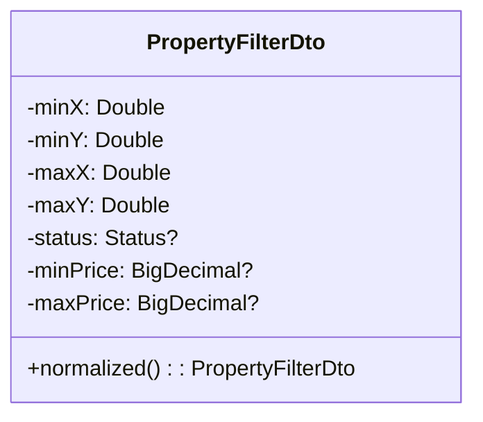
## 11.1. class description
지도 범위/상태/가격 필터를 보관하는 클래스이다.

## 11.2. attribution 구분

### 11.2.1. minX
* **name**: minX
* **type**: Double
* **visibility**: private
* **description**: 좌하단 경도의 최소값이다.

### 11.2.2. minY
* **name**: minY
* **type**: Double
* **visibility**: private
* **description**: 좌하단 위도의 최소값이다.

### 11.2.3. maxX
* **name**: maxX
* **type**: Double
* **visibility**: private
* **description**: 우상단 경도의 최대값이다.

### 11.2.4. maxY
* **name**: maxY
* **type**: Double
* **visibility**: private
* **description**: 우상단 위도의 최대값이다.

### 11.2.5. status
* **name**: status
* **type**: Enum?
* **visibility**: private
* **description**: 매물 상태 필터이다.

### 11.2.6. minPrice
* **name**: minPrice
* **type**: BigDecimal?
* **visibility**: private
* **description**: 최소 가격 필터이다.

### 11.2.7. maxPrice
* **name**: maxPrice
* **type**: BigDecimal?
* **visibility**: private
* **description**: 최대 가격 필터이다.

## 11.3. Operations 구분

### 11.3.1. normalized
* **name**: normalized
* **type**: PropertyFilterDto
* **visibility**: public
* **description**: 경계 뒤집힘을 보정한 새 필터를 반환한다.


# PropertyMarkerDto 클래스

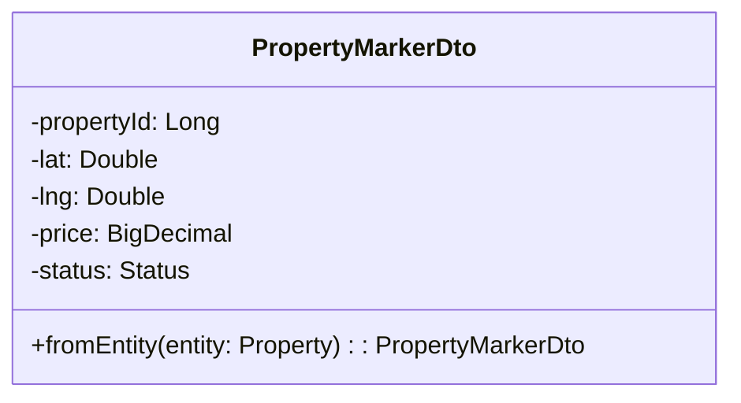
## 12.1. class description
지도 마커 렌더링에 필요한 최소 정보를 담는 클래스이다.

## 12.2. attribution 구분

### 12.2.1. propertyId
* **name**: propertyId
* **type**: Long
* **visibility**: private
* **description**: 매물 식별자이다.

### 12.2.2. lat
* **name**: lat
* **type**: Double
* **visibility**: private
* **description**: 위도 값이다.

### 12.2.3. lng
* **name**: lng
* **type**: Double
* **visibility**: private
* **description**: 경도 값이다.

### 12.2.4. price
* **name**: price
* **type**: BigDecimal
* **visibility**: private
* **description**: 표시용 가격이다.

### 12.2.5. status
* **name**: status
* **type**: Enum
* **visibility**: private
* **description**: 매물 상태이다.

## 12.3. Operations 구분

### 12.3.1. fromEntity
* **name**: fromEntity
* **type**: static builder
* **visibility**: public
* **description**: 엔티티로부터 DTO를 생성한다.


# PropertyOfferCreateRequest 클래스

```mermaid
classDiagram
  class PropertyOfferCreateRequest {
    -type: Enum
    -houseType: Enum
    -totalPrice: BigDecimal?
    -deposit: BigDecimal?
    -monthlyRent: BigDecimal?
    -maintenanceFee: BigDecimal?
    -floor: Integer?
    -availableFrom: LocalDate?
    -negotiable: Boolean
    -optionsBitset: String?
    +toEntity(property: Property): PropertyOffer
  }
```
## 13.1. class description
오퍼 생성/수정 입력을 담는 클래스이다.

## 13.2. attribution 구분

### 13.2.1. type
* **name**: type
* **type**: Enum
* **visibility**: private
* **description**: 거래 유형이다.

### 13.2.2. houseType
* **name**: houseType
* **type**: Enum
* **visibility**: private
* **description**: 주택 유형이다.

### 13.2.3. totalPrice
* **name**: totalPrice
* **type**: BigDecimal?
* **visibility**: private
* **description**: 매매가이다.

### 13.2.4. deposit
* **name**: deposit
* **type**: BigDecimal?
* **visibility**: private
* **description**: 보증금이다.

### 13.2.5. monthlyRent
* **name**: monthlyRent
* **type**: BigDecimal?
* **visibility**: private
* **description**: 월세 금액이다.

### 13.2.6. maintenanceFee
* **name**: maintenanceFee
* **type**: BigDecimal?
* **visibility**: private
* **description**: 관리비이다.

### 13.2.7. floor
* **name**: floor
* **type**: Integer?
* **visibility**: private
* **description**: 층수이다.

### 13.2.8. availableFrom
* **name**: availableFrom
* **type**: LocalDate?
* **visibility**: private
* **description**: 입주 가능일이다.

### 13.2.9. negotiable
* **name**: negotiable
* **type**: Boolean
* **visibility**: private
* **description**: 가격 협상 가능 여부이다.

### 13.2.10. optionsBitset
* **name**: optionsBitset
* **type**: String?
* **visibility**: private
* **description**: 옵션 비트마스크 문자열이다.

## 13.3. Operations 구분

### 13.3.1. toEntity
* **name**: toEntity
* **type**: PropertyOffer
* **visibility**: public
* **description**: 유효성 검증 후 엔티티로 변환한다.


# PropertyOfferDto 클래스

```mermaid
classDiagram
  class PropertyOfferDto {
    -offerId: Long
    -type: Enum
    -totalPrice: BigDecimal?
    -deposit: BigDecimal?
    -monthlyRent: BigDecimal?
    -isActive: Boolean
    -floor: Integer?
    -availableFrom: LocalDate?
    +fromEntity(offer: PropertyOffer): PropertyOfferDto
  }
```
## 14.1. class description
화면 표시용 오퍼 정보를 담는 클래스이다.

## 14.2. attribution 구분

### 14.2.1. offerId
* **name**: offerId
* **type**: Long
* **visibility**: private
* **description**: 오퍼의 식별자이다.

### 14.2.2. type
* **name**: type
* **type**: Enum
* **visibility**: private
* **description**: 거래 유형이다.

### 14.2.3. totalPrice
* **name**: totalPrice
* **type**: BigDecimal?
* **visibility**: private
* **description**: 매매가이다.

### 14.2.4. deposit
* **name**: deposit
* **type**: BigDecimal?
* **visibility**: private
* **description**: 보증금이다.

### 14.2.5. monthlyRent
* **name**: monthlyRent
* **type**: BigDecimal?
* **visibility**: private
* **description**: 월세 금액이다.

### 14.2.6. isActive
* **name**: isActive
* **type**: Boolean
* **visibility**: private
* **description**: 활성 여부이다.

### 14.2.7. floor
* **name**: floor
* **type**: Integer?
* **visibility**: private
* **description**: 층수이다.

### 14.2.8. availableFrom
* **name**: availableFrom
* **type**: LocalDate?
* **visibility**: private
* **description**: 입주 가능일이다.

## 14.3. Operations 구분

### 14.3.1. fromEntity
* **name**: fromEntity
* **type**: static builder
* **visibility**: public
* **description**: 오퍼 엔티티를 DTO로 변환한다.


# PropertyOfferResponse 클래스

```mermaid
classDiagram
  class PropertyOfferResponse {
    -offer: PropertyOfferDto
    -message: String
    +of(offer: PropertyOfferDto, message: String): PropertyOfferResponse
  }
```
## 15.1. class description
오퍼 활성 토글/수정/삭제 응답을 담는 클래스이다.

## 15.2. attribution 구분

### 15.2.1. offer
* **name**: offer
* **type**: PropertyOfferDto
* **visibility**: private
* **description**: 응답에 포함되는 오퍼 DTO이다.

### 15.2.2. message
* **name**: message
* **type**: String
* **visibility**: private
* **description**: 처리 결과 메시지이다.

## 15.3. Operations 구분

### 15.3.1. of
* **name**: of
* **type**: static factory
* **visibility**: public
* **description**: 편의 생성기를 제공한다.


# PropertyResponse 클래스

```mermaid
classDiagram
  class PropertyResponse {
    -id: Long
    -title: String
    -regionCode: String
    -price: BigDecimal
    -thumbnailUrl: String?
    -createdAt: Instant
    -status: Enum
    -listingType: Enum
    +from(property: Property): PropertyResponse
  }
```
## 16.1. class description
목록 화면용 매물 요약 정보를 담는 클래스이다.

## 16.2. attribution 구분

### 16.2.1. id
* **name**: id
* **type**: Long
* **visibility**: private
* **description**: 매물 식별자이다.

### 16.2.2. title
* **name**: title
* **type**: String
* **visibility**: private
* **description**: 매물 제목이다.

### 16.2.3. regionCode
* **name**: regionCode
* **type**: String
* **visibility**: private
* **description**: 행정 구역 코드이다.

### 16.2.4. price
* **name**: price
* **type**: BigDecimal
* **visibility**: private
* **description**: 대표 가격이다.

### 16.2.5. thumbnailUrl
* **name**: thumbnailUrl
* **type**: String?
* **visibility**: private
* **description**: 썸네일 URL이다.

### 16.2.6. createdAt
* **name**: createdAt
* **type**: Instant
* **visibility**: private
* **description**: 생성일시이다.

### 16.2.7. status
* **name**: status
* **type**: Enum
* **visibility**: private
* **description**: 상태 값이다.

### 16.2.8. listingType
* **name**: listingType
* **type**: Enum
* **visibility**: private
* **description**: 등록 유형이다.

## 16.3. Operations 구분

### 16.3.1. from
* **name**: from
* **type**: static builder
* **visibility**: public
* **description**: 엔티티/조인 결과에서 DTO로 변환한다.


# PropertyWithOffersDto 클래스

```mermaid
classDiagram
  class PropertyWithOffersDto {
    -property: PropertyDetailDto
    -offers: List<PropertyOfferDto>
    +of(property: PropertyDetailDto, offers: List<PropertyOfferDto>): PropertyWithOffersDto
  }
```
## 17.1. class description
상세 화면에서 매물 + 다수 오퍼를 함께 반환하는 클래스이다.

## 17.2. attribution 구분

### 17.2.1. property
* **name**: property
* **type**: PropertyDetailDto
* **visibility**: private
* **description**: 매물 상세 DTO이다.

### 17.2.2. offers
* **name**: offers
* **type**: List<PropertyOfferDto>
* **visibility**: private
* **description**: 오퍼 DTO 목록이다.

## 17.3. Operations 구분

### 17.3.1. of
* **name**: of
* **type**: static factory
* **visibility**: public
* **description**: 편의 생성기를 제공한다.


# UpdateOfferRequest 클래스

```mermaid
classDiagram
  class UpdateOfferRequest {
    -totalPrice: BigDecimal?
    -deposit: BigDecimal?
    -monthlyRent: BigDecimal?
    -maintenanceFee: BigDecimal?
    -floor: Integer?
    -availableFrom: LocalDate?
    -negotiable: Boolean?
    -optionsBitset: String?
    +applyTo(offer: PropertyOffer)
  }
```
## 18.1. class description
오퍼 수정에 필요한 입력 값을 담는 클래스이다.

## 18.2. attribution 구분

### 18.2.1. totalPrice
* **name**: totalPrice
* **type**: BigDecimal?
* **visibility**: private
* **description**: 매매가(선택)이다.

### 18.2.2. deposit
* **name**: deposit
* **type**: BigDecimal?
* **visibility**: private
* **description**: 보증금(선택)이다.

### 18.2.3. monthlyRent
* **name**: monthlyRent
* **type**: BigDecimal?
* **visibility**: private
* **description**: 월세(선택)이다.

### 18.2.4. maintenanceFee
* **name**: maintenanceFee
* **type**: BigDecimal?
* **visibility**: private
* **description**: 관리비(선택)이다.

### 18.2.5. floor
* **name**: floor
* **type**: Integer?
* **visibility**: private
* **description**: 층수(선택)이다.

### 18.2.6. availableFrom
* **name**: availableFrom
* **type**: LocalDate?
* **visibility**: private
* **description**: 입주 가능일(선택)이다.

### 18.2.7. negotiable
* **name**: negotiable
* **type**: Boolean?
* **visibility**: private
* **description**: 협상 가능 여부(선택)이다.

### 18.2.8. optionsBitset
* **name**: optionsBitset
* **type**: String?
* **visibility**: private
* **description**: 옵션 비트마스크(선택)이다.

## 18.3. Operations 구분

### 18.3.1. applyTo
* **name**: applyTo
* **type**: void
* **visibility**: public
* **description**: 전달된 엔티티에 변경 사항을 반영한다.


# SearchRequest 클래스

```mermaid
classDiagram
  class SearchRequest {
    -types: List<Enum>
    -minArea: BigDecimal?
    -maxArea: BigDecimal?
    -minFloor: Integer?
    -maxFloor: Integer?
    -optionMode: Enum
    -optionBits: String?
    -minSale: BigDecimal?
    -maxSale: BigDecimal?
    -minJeonse: BigDecimal?
    -maxJeonse: BigDecimal?
    -minWolse: BigDecimal?
    -maxWolse: BigDecimal?
    -minYear: Integer?
    -maxYear: Integer?
    -page: Integer
    -size: Integer
    -sort: String?
    +toCriteria(): Map<String, Object>
  }
```
## 19.1. class description
다중 조건 검색을 위한 요청 바디를 담는 클래스이다.

## 19.2. attribution 구분

### 19.2.1. types
* **name**: types
* **type**: List<Enum>
* **visibility**: private
* **description**: 오퍼 타입 목록이다.

### 19.2.2. minArea
* **name**: minArea
* **type**: BigDecimal?
* **visibility**: private
* **description**: 면적 최소값이다.

### 19.2.3. maxArea
* **name**: maxArea
* **type**: BigDecimal?
* **visibility**: private
* **description**: 면적 최대값이다.

### 19.2.4. minFloor
* **name**: minFloor
* **type**: Integer?
* **visibility**: private
* **description**: 층수 최소값이다.

### 19.2.5. maxFloor
* **name**: maxFloor
* **type**: Integer?
* **visibility**: private
* **description**: 층수 최대값이다.

### 19.2.6. optionMode
* **name**: optionMode
* **type**: Enum
* **visibility**: private
* **description**: 옵션 비트마스크 매칭 모드이다.

### 19.2.7. optionBits
* **name**: optionBits
* **type**: String?
* **visibility**: private
* **description**: 옵션 비트마스크 문자열이다.

### 19.2.8. minSale/maxSale/minJeonse/maxJeonse/minWolse/maxWolse
* **name**: minSale/maxSale/minJeonse/maxJeonse/minWolse/maxWolse
* **type**: BigDecimal?×6
* **visibility**: private
* **description**: 거래유형별 가격 범위 필터이다.

### 19.2.9. minYear
* **name**: minYear
* **type**: Integer?
* **visibility**: private
* **description**: 준공년도 최소값이다.

### 19.2.10. maxYear
* **name**: maxYear
* **type**: Integer?
* **visibility**: private
* **description**: 준공년도 최대값이다.

### 19.2.11. page
* **name**: page
* **type**: Integer
* **visibility**: private
* **description**: 페이지 번호이다.

### 19.2.12. size
* **name**: size
* **type**: Integer
* **visibility**: private
* **description**: 페이지 크기이다.

### 19.2.13. sort
* **name**: sort
* **type**: String?
* **visibility**: private
* **description**: 정렬 스펙이다.

## 19.3. Operations 구분

### 19.3.1. toCriteria
* **name**: toCriteria
* **type**: Map<String, Object>
* **visibility**: public
* **description**: 검색 레포지토리에 전달할 파라미터 맵으로 변환한다.


# FavoriteJpaRepository 클래스

```mermaid
classDiagram
  class FavoriteJpaRepository {
    -entityManager: EntityManager
    +existsByUserIdAndPropertyId(userId: Long, propertyId: Long): boolean
    +deleteByUserIdAndPropertyId(userId: Long, propertyId: Long): long
    +countByPropertyId(propertyId: Long): long
    +findUserIdsByPropertyId(propertyId: Long): List<Long>
  }
```
## 20.1. class description
찜(Favorite) 엔티티 JPA 접근을 제공하는 클래스이다.

## 20.2. attribution 구분

### 20.2.1. entityManager
* **name**: entityManager
* **type**: EntityManager
* **visibility**: protected
* **description**: 기본 JPA 동작에 사용한다.

## 20.3. Operations 구분

### 20.3.1. existsByUserIdAndPropertyId
* **name**: existsByUserIdAndPropertyId
* **type**: boolean
* **visibility**: public
* **description**: 특정 유저-매물 조합의 찜 존재 여부를 확인한다.

### 20.3.2. deleteByUserIdAndPropertyId
* **name**: deleteByUserIdAndPropertyId
* **type**: long
* **visibility**: public
* **description**: 찜을 삭제한다.

### 20.3.3. countByPropertyId
* **name**: countByPropertyId
* **type**: long
* **visibility**: public
* **description**: 매물의 총 찜 수를 반환한다.

### 20.3.4. findUserIdsByPropertyId
* **name**: findUserIdsByPropertyId
* **type**: List<Long>
* **visibility**: public
* **description**: 해당 매물을 찜한 사용자 ID 목록을 반환한다.


# PropertyFavoriteRepository 클래스

```mermaid
classDiagram
  class PropertyFavoriteRepository {
    -jdbcTemplate: NamedParameterJdbcTemplate
    +findFavorites(userId: Long, limit: int, offset: int): List<PropertyFavoriteDto>
  }
```
## 21.1. class description
네이티브 SQL/템플릿으로 찜 목록 조회를 제공하는 클래스이다.

## 21.2. attribution 구분

### 21.2.1. jdbcTemplate
* **name**: jdbcTemplate
* **type**: NamedParameterJdbcTemplate
* **visibility**: private
* **description**: 네이티브 조인/페이지네이션 처리를 수행한다.

## 21.3. Operations 구분

### 21.3.1. findFavorites
* **name**: findFavorites
* **type**: List<PropertyFavoriteDto>
* **visibility**: public
* **description**: 썸네일 1장을 포함하여 내 찜 목록을 조회한다.


# PropertyOfferRepository 클래스

```mermaid
classDiagram
  class PropertyOfferRepository {
    +jpaRepository: SpringData
    +findByPropertyId(propertyId: Long): List<PropertyOffer>
    +findActiveJeonseTop1ByPropertyIdOrderByUpdatedAtDesc(propertyId: Long): Optional<PropertyOffer>
  }
```
## 22.1. class description
오퍼 엔티티 JPA 접근을 제공하는 클래스이다.

## 22.2. attribution 구분

### 22.2.1. jpaRepository
* **name**: jpaRepository
* **type**: Spring Data Infrastructure
* **visibility**: public
* **description**: 표준 CRUD/조회 기능을 제공한다.

## 22.3. Operations 구분

### 22.3.1. findByPropertyId
* **name**: findByPropertyId
* **type**: List<PropertyOffer>
* **visibility**: public
* **description**: 특정 매물의 모든 오퍼를 조회한다.

### 22.3.2. findActiveJeonseTop1ByPropertyIdOrderByUpdatedAtDesc
* **name**: findActiveJeonseTop1ByPropertyIdOrderByUpdatedAtDesc
* **type**: Optional<PropertyOffer>
* **visibility**: public
* **description**: 활성 전세 오퍼 최신 1건을 조회한다.


# PropertyRepository 클래스

```mermaid
classDiagram
  class PropertyRepository {
    -entityManager: EntityManager
    +findInBounds(minX: double, minY: double, maxX: double, maxY: double, status: Status?, minPrice: BigDecimal?, maxPrice: BigDecimal?): List<Property>
    +markAsSoldIfBrokerAuthorized(propertyId: Long, brokerId: Long): int
  }
```
## 23.1. class description
매물 엔티티 JPA 접근을 제공하는 클래스이다.

## 23.2. attribution 구분

### 23.2.1. entityManager
* **name**: entityManager
* **type**: EntityManager
* **visibility**: protected
* **description**: JPQL 업데이트 및 조회에 사용한다.

## 23.3. Operations 구분

### 23.3.1. findInBounds
* **name**: findInBounds
* **type**: List<Property>
* **visibility**: public
* **description**: 지도 경계/상태/가격으로 필터링된 매물을 조회한다.

### 23.3.2. markAsSoldIfBrokerAuthorized
* **name**: markAsSoldIfBrokerAuthorized
* **type**: int
* **visibility**: public
* **description**: 브로커 권한/상태 조건을 만족할 때 거래 완료로 업데이트한다.


# PropertySearchRepository 클래스

```mermaid
classDiagram
  class PropertySearchRepository {
    -jdbcTemplate: NamedParameterJdbcTemplate
    +search(params: Map<String,Object>): List<PropertyResponse>
  }
```
## 24.1. class description
NamedParameterJdbcTemplate로 복합 검색을 수행하는 클래스이다.

## 24.2. attribution 구분

### 24.2.1. jdbcTemplate
* **name**: jdbcTemplate
* **type**: NamedParameterJdbcTemplate
* **visibility**: private
* **description**: SQL 실행과 매핑을 담당한다.

## 24.3. Operations 구분

### 24.3.1. search
* **name**: search
* **type**: List<PropertyResponse>
* **visibility**: public
* **description**: SearchRequest를 해석해 필터링/페이징된 결과를 반환한다.


# PropertywoRepository 클래스

```mermaid
classDiagram
  class PropertywoRepository {
    +jpaRepository: SpringData
    +findAllByStatusOrderByCreatedAtDesc(status: Status, pageable: Pageable): Page<Property>
    +findAllByOwnerId(ownerId: Long, pageable: Pageable): Page<Property>
  }
```
## 25.1. class description
매물 목록 페이지네이션 파생 쿼리를 제공하는 클래스이다.

## 25.2. attribution 구분

### 25.2.1. jpaRepository
* **name**: jpaRepository
* **type**: Spring Data Infrastructure
* **visibility**: public
* **description**: 표준 CRUD/조회 기능을 제공한다.

## 25.3. Operations 구분

### 25.3.1. findAllByStatusOrderByCreatedAtDesc
* **name**: findAllByStatusOrderByCreatedAtDesc
* **type**: Page<Property>
* **visibility**: public
* **description**: 상태별 최신순 목록을 반환한다.

### 25.3.2. findAllByOwnerId
* **name**: findAllByOwnerId
* **type**: Page<Property>
* **visibility**: public
* **description**: 내 매물만 페이지네이션으로 조회한다.


# JeonseRatioService 클래스

```mermaid
classDiagram
  class JeonseRatioService {
    -propertyRepository: PropertyRepository
    -propertyOfferRepository: PropertyOfferRepository
    +calculate(propertyId: Long, offerId: Long?, clientSalePrice: BigDecimal?): JeonseRatioResponse
  }
```
## 26.1. class description
전세가율을 계산하는 클래스이다.

## 26.2. attribution 구분

### 26.2.1. propertyRepository
* **name**: propertyRepository
* **type**: PropertyRepository
* **visibility**: private
* **description**: 매물 정보를 조회한다.

### 26.2.2. propertyOfferRepository
* **name**: propertyOfferRepository
* **type**: PropertyOfferRepository
* **visibility**: private
* **description**: 오퍼 정보를 조회한다.

## 26.3. Operations 구분

### 26.3.1. calculate
* **name**: calculate
* **type**: JeonseRatioResponse
* **visibility**: public
* **description**: 보증금/매매가로 전세가율을 계산한다(소수 둘째 자리 반올림).


# PropertyFavoriteService 클래스

```mermaid
classDiagram
  class PropertyFavoriteService {
    -favoriteJpaRepository: FavoriteJpaRepository
    -propertyFavoriteRepository: PropertyFavoriteRepository
    +toggle(userId: Long, propertyId: Long): boolean
    +delete(userId: Long, propertyId: Long)
    +list(userId: Long, limit: int, offset: int): List<PropertyFavoriteDto>
    +exists(userId: Long, propertyId: Long): boolean
    +count(propertyId: Long): long
  }
```
## 27.1. class description
찜 토글/삭제/조회 로직을 제공하는 클래스이다.

## 27.2. attribution 구분

### 27.2.1. favoriteJpaRepository
* **name**: favoriteJpaRepository
* **type**: FavoriteJpaRepository
* **visibility**: private
* **description**: 단순 존재/삭제/카운트 조회에 사용한다.

### 27.2.2. propertyFavoriteRepository
* **name**: propertyFavoriteRepository
* **type**: PropertyFavoriteRepository
* **visibility**: private
* **description**: 조인 기반 찜 목록 조회에 사용한다.

## 27.3. Operations 구분

### 27.3.1. toggle
* **name**: toggle
* **type**: boolean
* **visibility**: public
* **description**: 찜을 토글하고 현재 상태를 반환한다.

### 27.3.2. delete
* **name**: delete
* **type**: void
* **visibility**: public
* **description**: 찜을 명시적으로 해제한다.

### 27.3.3. list
* **name**: list
* **type**: List<PropertyFavoriteDto>
* **visibility**: public
* **description**: 내 찜 목록을 조회한다.

### 27.3.4. exists
* **name**: exists
* **type**: boolean
* **visibility**: public
* **description**: 특정 유저-매물 찜 존재 여부를 확인한다.

### 27.3.5. count
* **name**: count
* **type**: long
* **visibility**: public
* **description**: 해당 매물의 찜 수를 반환한다.


# PropertyOfferService 클래스

```mermaid
classDiagram
  class PropertyOfferService {
    -propertyOfferRepository: PropertyOfferRepository
    +toggleActive(offerId: Long, userId: Long): PropertyOfferResponse
    +update(offerId: Long, request: UpdateOfferRequest, userId: Long): PropertyOfferResponse
    +delete(offerId: Long, userId: Long)
  }
```
## 28.1. class description
오퍼의 권한 검증 및 상태 변경을 수행하는 클래스이다.

## 28.2. attribution 구분

### 28.2.1. propertyOfferRepository
* **name**: propertyOfferRepository
* **type**: PropertyOfferRepository
* **visibility**: private
* **description**: 오퍼 CRUD에 사용한다.

## 28.3. Operations 구분

### 28.3.1. toggleActive
* **name**: toggleActive
* **type**: PropertyOfferResponse
* **visibility**: public
* **description**: 오퍼 활성/비활성을 토글한다.

### 28.3.2. update
* **name**: update
* **type**: PropertyOfferResponse
* **visibility**: public
* **description**: 오퍼 내용을 수정한다.

### 28.3.3. delete
* **name**: delete
* **type**: void
* **visibility**: public
* **description**: 삭제 정책을 검증한 뒤 오퍼를 삭제한다.


# PropertyQueryService 클래스

```mermaid
classDiagram
  class PropertyQueryService {
    -propertywoRepository: PropertywoRepository
    -propertyOfferRepository: PropertyOfferRepository
    +listAll(page: int, size: int, sort: String?): List<PropertyResponse>
    +listMine(userId: Long, page: int, size: int, sort: String?): List<PropertyResponse>
    +listOthers(userId: Long, page: int, size: int, sort: String?): List<PropertyResponse>
    +getOneWithOffers(id: Long): PropertyWithOffersDto
  }
```
## 29.1. class description
목록/상세 조회를 담당하는 클래스이다.

## 29.2. attribution 구분

### 29.2.1. propertywoRepository
* **name**: propertywoRepository
* **type**: PropertywoRepository
* **visibility**: private
* **description**: 페이지네이션 목록 조회에 사용한다.

### 29.2.2. propertyOfferRepository
* **name**: propertyOfferRepository
* **type**: PropertyOfferRepository
* **visibility**: private
* **description**: 오퍼 묶음 조회에 사용한다.

## 29.3. Operations 구분

### 29.3.1. listAll
* **name**: listAll
* **type**: List<PropertyResponse>
* **visibility**: public
* **description**: 전체 목록을 조회한다.

### 29.3.2. listMine
* **name**: listMine
* **type**: List<PropertyResponse>
* **visibility**: public
* **description**: 내가 등록한 매물 목록을 조회한다.

### 29.3.3. listOthers
* **name**: listOthers
* **type**: List<PropertyResponse>
* **visibility**: public
* **description**: 타인이 등록한 매물 목록을 조회한다.

### 29.3.4. getOneWithOffers
* **name**: getOneWithOffers
* **type**: PropertyWithOffersDto
* **visibility**: public
* **description**: 단건 상세와 오퍼 리스트를 함께 반환한다.


# propertyservice 클래스

```mermaid
classDiagram
  class propertyservice {
    -propertyRepository: PropertyRepository
    -propertyOfferRepository: PropertyOfferRepository
    +getMarkers(filter: PropertyFilterDto): List<PropertyMarkerDto>
    +getDetail(id: Long): PropertyDetailDto
    +completeDeal(request: CompleteDealRequest, brokerId: Long)
  }
```
## 30.1. class description
지도 마커 조회, 단건 상세, 브로커 거래 완료를 처리하는 클래스이다.

## 30.2. attribution 구분

### 30.2.1. propertyRepository
* **name**: propertyRepository
* **type**: PropertyRepository
* **visibility**: private
* **description**: 매물 조회 및 업데이트에 사용한다.

### 30.2.2. propertyOfferRepository
* **name**: propertyOfferRepository
* **type**: PropertyOfferRepository
* **visibility**: private
* **description**: 오퍼 조회에 사용한다.

## 30.3. Operations 구분

### 30.3.1. getMarkers
* **name**: getMarkers
* **type**: List<PropertyMarkerDto>
* **visibility**: public
* **description**: lat=Y/lng=X 규칙으로 지도 마커를 생성한다.

### 30.3.2. getDetail
* **name**: getDetail
* **type**: PropertyDetailDto
* **visibility**: public
* **description**: 단건 상세 데이터를 생성한다.

### 30.3.3. completeDeal
* **name**: completeDeal
* **type**: void
* **visibility**: public
* **description**: 브로커 권한 검증 후 거래 완료를 반영하고 이벤트를 발행한다.


# Favorite 클래스

```mermaid
classDiagram
  class BaseEntity {
    +createdAt: Instant
    +updatedAt: Instant
  }
  class Favorite {
    -id: Long
    -userId: Long
    -propertyId: Long
    +@PrePersist setCreatedAt()
  }
  BaseEntity <|-- Favorite
```
## 31.1. class description
유저와 매물 간의 찜 관계를 나타내는 클래스이다.

## 31.2. attribution 구분

### 31.2.1. id
* **name**: id
* **type**: Long
* **visibility**: private
* **description**: PK 식별자이다.

### 31.2.2. userId
* **name**: userId
* **type**: Long
* **visibility**: private
* **description**: 사용자 식별자이다.

### 31.2.3. propertyId
* **name**: propertyId
* **type**: Long
* **visibility**: private
* **description**: 매물 식별자이다.

### 31.2.4. createdAt
* **name**: createdAt
* **type**: Instant
* **visibility**: private
* **description**: 생성일시는 상속.

## 31.3. Operations 구분

### 31.3.1. @PrePersist setCreatedAt
* **name**: @PrePersist setCreatedAt
* **type**: void
* **visibility**: private
* **description**: 저장 시 생성일을 기록한다.


# PriceAnomaly 클래스

```mermaid
classDiagram
  class BaseEntity {
    +createdAt: Instant
    +updatedAt: Instant
  }
  class PriceAnomaly {
    -id: Long
    -property: Property
    -score: BigDecimal
    -reason: String
    +@PrePersist setCreatedAt()
  }
  BaseEntity <|-- PriceAnomaly
```
## 32.1. class description
매물의 가격 이상치 정보를 기록하는 클래스이다.

## 32.2. attribution 구분

### 32.2.1. id
* **name**: id
* **type**: Long
* **visibility**: private
* **description**: PK 식별자이다.

### 32.2.2. property
* **name**: property
* **type**: Property
* **visibility**: private
* **description**: 대상 매물 레퍼런스이다.

### 32.2.3. score
* **name**: score
* **type**: BigDecimal
* **visibility**: private
* **description**: 이상치 점수이다.

### 32.2.4. reason
* **name**: reason
* **type**: String
* **visibility**: private
* **description**: 이상치 사유이다.

### 32.2.5. createdAt
* **name**: createdAt
* **type**: Instant
* **visibility**: private
* **description**: 생성일시는 상속.

## 32.3. Operations 구분

### 32.3.1. @PrePersist setCreatedAt
* **name**: @PrePersist setCreatedAt
* **type**: void
* **visibility**: private
* **description**: 저장 시 생성일을 기록한다.


# Property 클래스

```mermaid
classDiagram
  class BaseEntity {
    +createdAt: Instant
    +updatedAt: Instant
  }
  class Property {
    -id: Long
    -title: String
    -address: String
    -regionCode: String
    -locationX: Double
    -locationY: Double
    -areaM2: BigDecimal
    -price: BigDecimal
    -status: Enum
    -listingType: Enum
    -buildingYear: Integer
    -ownerId: Long?
    -brokerId: Long?
    -anomalyAlert: Boolean
    +@PrePersist setCreatedAt()
    +@PreUpdate setUpdatedAt()
  }
  BaseEntity <|-- Property
```
## 33.1. class description
매물의 기본 정보를 나타내는 클래스이다.

## 33.2. attribution 구분

### 33.2.1. id
* **name**: id
* **type**: Long
* **visibility**: private
* **description**: PK 식별자이다.

### 33.2.2. title
* **name**: title
* **type**: String
* **visibility**: private
* **description**: 매물 제목이다.

### 33.2.3. address
* **name**: address
* **type**: String
* **visibility**: private
* **description**: 주소이다.

### 33.2.4. regionCode
* **name**: regionCode
* **type**: String
* **visibility**: private
* **description**: 행정 구역 코드이다.

### 33.2.5. locationX
* **name**: locationX
* **type**: Double
* **visibility**: private
* **description**: 경도 값이다.

### 33.2.6. locationY
* **name**: locationY
* **type**: Double
* **visibility**: private
* **description**: 위도 값이다.

### 33.2.7. areaM2
* **name**: areaM2
* **type**: BigDecimal
* **visibility**: private
* **description**: 전용면적(m²)이다.

### 33.2.8. price
* **name**: price
* **type**: BigDecimal
* **visibility**: private
* **description**: 대표 가격이다.

### 33.2.9. status
* **name**: status
* **type**: Enum
* **visibility**: private
* **description**: 상태 값이다.

### 33.2.10. listingType
* **name**: listingType
* **type**: Enum
* **visibility**: private
* **description**: 등록 유형이다.

### 33.2.11. buildingYear
* **name**: buildingYear
* **type**: Integer
* **visibility**: private
* **description**: 준공년도이다.

### 33.2.12. ownerId
* **name**: ownerId
* **type**: Long?
* **visibility**: private
* **description**: 소유자 식별자이다.

### 33.2.13. brokerId
* **name**: brokerId
* **type**: Long?
* **visibility**: private
* **description**: 브로커 식별자이다.

### 33.2.14. anomalyAlert
* **name**: anomalyAlert
* **type**: Boolean
* **visibility**: private
* **description**: 이상치 경고 여부이다.

### 33.2.15. createdAt/updatedAt
* **name**: createdAt/updatedAt
* **type**: Instant
* **visibility**: private
* **description**: 상속된 생성/갱신일시이다.

## 33.3. Operations 구분

### 33.3.1. @PrePersist setCreatedAt
* **name**: @PrePersist setCreatedAt
* **type**: void
* **visibility**: private
* **description**: 저장 시 생성일을 기록한다.

### 33.3.2. @PreUpdate setUpdatedAt
* **name**: @PreUpdate setUpdatedAt
* **type**: void
* **visibility**: private
* **description**: 수정 시 갱신일을 기록한다.


# PropertyImage 클래스

```mermaid
classDiagram
  class BaseEntity {
    +createdAt: Instant
    +updatedAt: Instant
  }
  class PropertyImage {
    -id: Long
    -property: Property
    -imageUrl: String
    -sortOrder: Integer
    +@PrePersist setCreatedAt()
  }
  BaseEntity <|-- PropertyImage
```
## 34.1. class description
매물의 이미지 정보를 나타내는 클래스이다.

## 34.2. attribution 구분

### 34.2.1. id
* **name**: id
* **type**: Long
* **visibility**: private
* **description**: PK 식별자이다.

### 34.2.2. property
* **name**: property
* **type**: Property
* **visibility**: private
* **description**: 소속 매물이다.

### 34.2.3. imageUrl
* **name**: imageUrl
* **type**: String
* **visibility**: private
* **description**: 이미지 URL이다.

### 34.2.4. sortOrder
* **name**: sortOrder
* **type**: Integer
* **visibility**: private
* **description**: 정렬 순서이다.

### 34.2.5. createdAt
* **name**: createdAt
* **type**: Instant
* **visibility**: private
* **description**: 생성일시는 상속.

## 34.3. Operations 구분

### 34.3.1. @PrePersist setCreatedAt
* **name**: @PrePersist setCreatedAt
* **type**: void
* **visibility**: private
* **description**: 저장 시 생성일을 기록한다.


# PropertyOffer 클래스

```mermaid
classDiagram
  class BaseEntity {
    +createdAt: Instant
    +updatedAt: Instant
  }
  class PropertyOffer {
    -id: Long
    -property: Property
    -type: Enum
    -houseType: Enum
    -totalPrice: BigDecimal?
    -deposit: BigDecimal?
    -monthlyRent: BigDecimal?
    -maintenanceFee: BigDecimal?
    -floor: Integer?
    -availableFrom: LocalDate?
    -negotiable: Boolean
    -isActive: Boolean
    -optionsBitset: String?
    +@PrePersist setCreatedAt()
    +@PreUpdate setUpdatedAt()
  }
  BaseEntity <|-- PropertyOffer
```
## 35.1. class description
매물의 판매/전세/월세 등 거래 제안을 나타내는 클래스이다.

## 35.2. attribution 구분

### 35.2.1. id
* **name**: id
* **type**: Long
* **visibility**: private
* **description**: PK 식별자이다.

### 35.2.2. property
* **name**: property
* **type**: Property
* **visibility**: private
* **description**: 대상 매물이다.

### 35.2.3. type
* **name**: type
* **type**: Enum
* **visibility**: private
* **description**: 거래 유형이다.

### 35.2.4. houseType
* **name**: houseType
* **type**: Enum
* **visibility**: private
* **description**: 주택 유형이다.

### 35.2.5. totalPrice
* **name**: totalPrice
* **type**: BigDecimal?
* **visibility**: private
* **description**: 매매가이다.

### 35.2.6. deposit
* **name**: deposit
* **type**: BigDecimal?
* **visibility**: private
* **description**: 보증금이다.

### 35.2.7. monthlyRent
* **name**: monthlyRent
* **type**: BigDecimal?
* **visibility**: private
* **description**: 월세이다.

### 35.2.8. maintenanceFee
* **name**: maintenanceFee
* **type**: BigDecimal?
* **visibility**: private
* **description**: 관리비이다.

### 35.2.9. floor
* **name**: floor
* **type**: Integer?
* **visibility**: private
* **description**: 층수이다.

### 35.2.10. availableFrom
* **name**: availableFrom
* **type**: LocalDate?
* **visibility**: private
* **description**: 입주 가능일이다.

### 35.2.11. negotiable
* **name**: negotiable
* **type**: Boolean
* **visibility**: private
* **description**: 협상 가능 여부이다.

### 35.2.12. isActive
* **name**: isActive
* **type**: Boolean
* **visibility**: private
* **description**: 활성 여부이다.

### 35.2.13. optionsBitset
* **name**: optionsBitset
* **type**: String?
* **visibility**: private
* **description**: 옵션 비트마스크이다.

### 35.2.14. createdAt/updatedAt
* **name**: createdAt/updatedAt
* **type**: Instant
* **visibility**: private
* **description**: 상속된 생성/갱신일시이다.

## 35.3. Operations 구분

### 35.3.1. @PrePersist setCreatedAt
* **name**: @PrePersist setCreatedAt
* **type**: void
* **visibility**: private
* **description**: 저장 시 생성일을 기록한다.

### 35.3.2. @PreUpdate setUpdatedAt
* **name**: @PreUpdate setUpdatedAt
* **type**: void
* **visibility**: private
* **description**: 수정 시 갱신일을 기록한다.


# PropertyReview 클래스

```mermaid
classDiagram
  class BaseEntity {
    +createdAt: Instant
    +updatedAt: Instant
  }
  class PropertyReview {
    -id: Long
    -property: Property
    -userId: Long
    -rating: Integer
    -comment: String
    +@PrePersist setCreatedAt()
    +@PreUpdate setUpdatedAt()
  }
  BaseEntity <|-- PropertyReview
```
## 36.1. class description
사용자가 매물에 남긴 리뷰를 나타내는 클래스이다.

## 36.2. attribution 구분

### 36.2.1. id
* **name**: id
* **type**: Long
* **visibility**: private
* **description**: PK 식별자이다.

### 36.2.2. property
* **name**: property
* **type**: Property
* **visibility**: private
* **description**: 리뷰 대상 매물이다.

### 36.2.3. userId
* **name**: userId
* **type**: Long
* **visibility**: private
* **description**: 작성자 식별자이다.

### 36.2.4. rating
* **name**: rating
* **type**: Integer
* **visibility**: private
* **description**: 평점(1~5)이다.

### 36.2.5. comment
* **name**: comment
* **type**: String
* **visibility**: private
* **description**: 리뷰 코멘트이다.

### 36.2.6. createdAt/updatedAt
* **name**: createdAt/updatedAt
* **type**: Instant
* **visibility**: private
* **description**: 상속된 생성/갱신일시이다.

## 36.3. Operations 구분

### 36.3.1. @PrePersist setCreatedAt
* **name**: @PrePersist setCreatedAt
* **type**: void
* **visibility**: private
* **description**: 저장 시 생성일을 기록한다.

### 36.3.2. @PreUpdate setUpdatedAt
* **name**: @PreUpdate setUpdatedAt
* **type**: void
* **visibility**: private
* **description**: 수정 시 갱신일을 기록한다.

# 4. 지도 관련 

# MapApiService 클래스

```mermaid
classDiagram
    %% --- MapApiService 클래스 정의 ---
    class MapApiService {
        %% 클래스 설명: 지도 API 연동 서비스로 좌표-주소 변환 및 주변 건물 검색 기능 제공
        -restTemplate: RestTemplate
        -logger: Logger
        -naverClientId: String
        -naverClientSecret: String

        %% --- Operations ---
        +getAddressFromCoordinates(latitude: double, longitude: double): AddressInfo
        +getCoordinatesFromAddress(address: String): CoordinateInfo
        +searchNearbyBuildings(latitude: double, longitude: double, radius: int): List~BuildingInfo~
    }

    %% --- 내부 DTO 클래스들 ---
    class AddressInfo {
        -roadAddress: String
        -jibunAddress: String
        -buildingName: String
        -postalCode: String
        -regionCode: String
    }

    class CoordinateInfo {
        -latitude: double
        -longitude: double
        -accuracy: String
    }

    class BuildingInfo {
        -name: String
        -category: String
        -address: String
        -distance: int
    }

    %% --- 관계 정의 ---
    MapApiService ..> AddressInfo : 반환 (Returns)
    MapApiService ..> CoordinateInfo : 반환 (Returns)
    MapApiService ..> BuildingInfo : 반환 (Returns)
```

## 1.1. class description

지도 API 연동 서비스로 카카오맵, 네이버맵, 구글맵 등의 API를 통합 관리하는 클래스이다. 좌표를 주소로 변환하는 Reverse Geocoding, 주소를 좌표로 변환하는 Geocoding, 주변 건물 검색 기능을 제공한다. 현재는 네이버 API 구독이 필요하므로 더미 데이터를 사용하여 구현되어 있다.

## 1.2. attribution 구분

### 1.2.1. restTemplate

- **name**: restTemplate
- **type**: RestTemplate
- **visibility**: private
- **description**: HTTP 요청을 수행하기 위한 Spring의 RestTemplate 객체이다. 외부 지도 API 호출 시 사용된다.

### 1.2.2. logger

- **name**: logger
- **type**: Logger
- **visibility**: private
- **description**: SLF4J Logger 객체로 지도 API 호출 및 응답에 대한 로깅을 수행한다. 디버깅 및 모니터링에 사용된다.

### 1.2.3. naverClientId

- **name**: naverClientId
- **type**: String
- **visibility**: private
- **description**: 네이버 지도 API 호출 시 필요한 클라이언트 ID이다. application.yml의 `naver.map.client-id` 설정값이 주입된다.

### 1.2.4. naverClientSecret

- **name**: naverClientSecret
- **type**: String
- **visibility**: private
- **description**: 네이버 지도 API 호출 시 필요한 클라이언트 시크릿 키이다. application.yml의 `naver.map.client-secret` 설정값이 주입된다.

## 1.3. Operations 구분

### 1.3.1. getAddressFromCoordinates

- **name**: getAddressFromCoordinates
- **type**: AddressInfo
- **visibility**: public
- **description**: 좌표(위도, 경도)를 입력받아 해당 위치의 주소 정보를 반환하는 Reverse Geocoding 메서드이다. 좌표 범위에 따라 대구, 부산, 서울 강남, 서울 시청(기본값) 중 하나의 주소 정보를 반환한다. 도로명주소, 지번주소, 건물명, 우편번호, 행정구역코드를 포함한 AddressInfo 객체를 반환한다.

### 1.3.2. getCoordinatesFromAddress

- **name**: getCoordinatesFromAddress
- **type**: CoordinateInfo
- **visibility**: public
- **description**: 주소 문자열을 입력받아 해당 위치의 좌표 정보를 반환하는 Geocoding 메서드이다. 주소에 "대구", "남구", "부산", "서울", "강남" 등의 키워드가 포함되어 있는지 확인하여 해당 지역의 좌표를 반환한다. 위도, 경도, 정확도(EXACT 또는 APPROXIMATE)를 포함한 CoordinateInfo 객체를 반환한다.

### 1.3.3. searchNearbyBuildings

- **name**: searchNearbyBuildings
- **type**: List<BuildingInfo>
- **visibility**: public
- **description**: 특정 좌표를 중심으로 지정된 반경 내의 주변 건물 정보를 검색하는 메서드이다. 현재는 더미 데이터로 "강남역"과 "강남파이낸스센터" 두 개의 건물 정보를 반환한다. 실제 구현 시에는 POI(Point of Interest) 검색 API를 사용할 예정이다. 건물명, 카테고리, 주소, 거리(미터)를 포함한 BuildingInfo 객체의 리스트를 반환한다.

---

# AddressInfo 클래스

```mermaid
classDiagram
    class AddressInfo {
        %% 클래스 설명: Reverse Geocoding 결과로 반환되는 주소 정보 DTO
        -roadAddress: String
        -jibunAddress: String
        -buildingName: String
        -postalCode: String
        -regionCode: String
    }
```

## 2.1. class description

Reverse Geocoding 결과로 반환되는 주소 정보를 담는 DTO(Data Transfer Object) 클래스이다. 좌표를 주소로 변환한 결과를 구조화하여 전달하며, 도로명주소, 지번주소, 건물명, 우편번호, 행정구역코드 등의 상세 주소 정보를 포함한다.

## 2.2. attribution 구분

### 2.2.1. roadAddress

- **name**: roadAddress
- **type**: String
- **visibility**: private
- **description**: 도로명주소 정보이다. 예: "서울 강남구 강남대로 396"

### 2.2.2. jibunAddress

- **name**: jibunAddress
- **type**: String
- **visibility**: private
- **description**: 지번주소 정보이다. 예: "서울 강남구 역삼동 825"

### 2.2.3. buildingName

- **name**: buildingName
- **type**: String
- **visibility**: private
- **description**: 건물명 정보이다. 예: "강남역", "서울시청"

### 2.2.4. postalCode

- **name**: postalCode
- **type**: String
- **visibility**: private
- **description**: 우편번호 정보이다. 예: "06292"

### 2.2.5. regionCode

- **name**: regionCode
- **type**: String
- **visibility**: private
- **description**: 행정구역코드 정보이다. 예: "1168010100"

---

# CoordinateInfo 클래스

```mermaid
classDiagram
    class CoordinateInfo {
        %% 클래스 설명: Geocoding 결과로 반환되는 좌표 정보 DTO
        -latitude: double
        -longitude: double
        -accuracy: String
    }
```

## 3.1. class description

Geocoding 결과로 반환되는 좌표 정보를 담는 DTO(Data Transfer Object) 클래스이다. 주소를 좌표로 변환한 결과를 구조화하여 전달하며, 위도, 경도, 정확도 정보를 포함한다.

## 3.2. attribution 구분

### 3.2.1. latitude

- **name**: latitude
- **type**: double
- **visibility**: private
- **description**: 위도 정보이다. 예: 37.4979 (서울 강남 지역)

### 3.2.2. longitude

- **name**: longitude
- **type**: double
- **visibility**: private
- **description**: 경도 정보이다. 예: 127.0276 (서울 강남 지역)

### 3.2.3. accuracy

- **name**: accuracy
- **type**: String
- **visibility**: private
- **description**: 좌표의 정확도를 나타낸다. "EXACT"(정확한 매칭), "INTERPOLATION"(보간), "APPROXIMATE"(근사값) 중 하나의 값을 가진다.

---

# BuildingInfo 클래스

```mermaid
classDiagram
    class BuildingInfo {
        %% 클래스 설명: 주변 건물 검색 결과로 반환되는 건물 정보 DTO
        -name: String
        -category: String
        -address: String
        -distance: int
    }
```

## 4.1. class description

주변 건물 검색 결과로 반환되는 건물 정보를 담는 DTO(Data Transfer Object) 클래스이다. POI(Point of Interest) 검색 결과를 구조화하여 전달하며, 건물명, 카테고리, 주소, 거리 정보를 포함한다.

## 4.2. attribution 구분

### 4.2.1. name

- **name**: name
- **type**: String
- **visibility**: private
- **description**: 건물명 또는 장소명이다. 예: "강남역", "강남파이낸스센터"

### 4.2.2. category

- **name**: category
- **type**: String
- **visibility**: private
- **description**: 건물의 카테고리 또는 유형이다. 예: "지하철역", "오피스빌딩"

### 4.2.3. address

- **name**: address
- **type**: String
- **visibility**: private
- **description**: 건물의 주소 정보이다. 예: "서울 강남구 강남대로 396"

### 4.2.4. distance

- **name**: distance
- **type**: int
- **visibility**: private
- **description**: 검색 기준 좌표로부터의 거리를 미터 단위로 나타낸다. 예: 0 (현재 위치), 200 (200미터 거리)

---

# UserMapState 클래스

```mermaid
classDiagram
    %% --- UserMapState 클래스 정의 ---
    class UserMapState {
        %% 클래스 설명: 사용자의 지도 상태(위치, 줌 레벨)를 저장하는 클래스
        -userId: Long
        -user: User
        -locationX: Double
        -locationY: Double
        -zoomLevel: Integer
        -updatedAt: LocalDateTime

        %% --- Operations ---
        +updateTime(): void
    }

    %% --- User 클래스 (참조용) ---
    class User {
        -userId: Long
        -email: String
        -name: String
    }

    %% --- 관계 정의 ---
    UserMapState --> User : 일대일 (OneToOne)
```

## 5.1. class description

사용자의 지도 상태(마지막 위치와 줌 레벨)를 저장하는 클래스이다. 사용자가 지도를 사용할 때 마지막으로 본 위치와 줌 레벨을 기억하여, 다음 접속 시 동일한 상태로 지도를 표시할 수 있도록 한다. User 엔티티와 일대일 관계를 가지며, userId를 Primary Key로 사용한다.

## 5.2. attribution 구분

### 5.2.1. userId

- **name**: userId
- **type**: Long
- **visibility**: private
- **description**: 사용자를 고유하게 식별하기 위한 primary key이다. User 엔티티의 userId와 동일한 값을 가지며, @MapsId 어노테이션을 통해 User의 ID를 공유한다.

### 5.2.2. user

- **name**: user
- **type**: User
- **visibility**: private
- **description**: 지도 상태를 소유한 사용자 엔티티에 대한 참조이다. @OneToOne 관계로 설정되어 있으며, LAZY 로딩 방식을 사용한다. @MapsId를 통해 userId를 공유한다.

### 5.2.3. locationX

- **name**: locationX
- **type**: Double
- **visibility**: private
- **description**: 사용자가 마지막으로 본 지도의 경도(longitude) 좌표이다. null 값을 허용하며, 사용자가 지도를 처음 사용하는 경우 null일 수 있다.

### 5.2.4. locationY

- **name**: locationY
- **type**: Double
- **visibility**: private
- **description**: 사용자가 마지막으로 본 지도의 위도(latitude) 좌표이다. null 값을 허용하며, 사용자가 지도를 처음 사용하는 경우 null일 수 있다.

### 5.2.5. zoomLevel

- **name**: zoomLevel
- **type**: Integer
- **visibility**: private
- **description**: 사용자가 마지막으로 설정한 지도의 줌 레벨이다. 숫자가 클수록 더 확대된 상태를 의미한다. null 값을 허용하며, 기본 줌 레벨은 클라이언트에서 설정된다.

### 5.2.6. updatedAt

- **name**: updatedAt
- **type**: LocalDateTime
- **visibility**: private
- **description**: 지도 상태가 마지막으로 업데이트된 날짜와 시간이다. @PrePersist와 @PreUpdate를 통해 엔티티가 저장되거나 수정될 때 자동으로 현재 시간으로 갱신된다.

## 5.3. Operations 구분

### 5.3.1. updateTime

- **name**: updateTime
- **type**: void
- **visibility**: public
- **description**: 엔티티가 저장되거나 수정될 때 자동으로 호출되는 메서드이다. @PrePersist와 @PreUpdate 어노테이션이 적용되어 있어, updatedAt 필드를 현재 시간으로 자동 갱신한다. 사용자가 지도 상태를 변경할 때마다 마지막 업데이트 시간이 기록된다.

---

# PropertyMarkerDto 클래스

```mermaid
classDiagram
    %% --- PropertyMarkerDto 클래스 정의 ---
    class PropertyMarkerDto {
        %% 클래스 설명: 지도에 표시할 매물 마커 정보를 담는 DTO (Record 타입)
        +id: Long
        +title: String
        +address: String
        +price: BigDecimal
        +status: String
        +lat: Double
        +lng: Double
    }
```

## 6.1. class description

지도에 표시할 매물 마커 정보를 담는 DTO(Data Transfer Object) 클래스이다. Java Record 타입으로 구현되어 불변(immutable) 객체이며, 매물의 기본 정보와 위치 좌표를 포함한다. 지도 API에서 매물 위치를 마커로 표시할 때 사용되며, 사용자가 지도를 탐색할 때 효율적으로 매물 정보를 전달하기 위한 경량화된 데이터 구조이다.

## 6.2. attribution 구분

### 6.2.1. id

- **name**: id
- **type**: Long
- **visibility**: public
- **description**: 매물을 고유하게 식별하기 위한 primary key이다. Property 엔티티의 id와 동일한 값을 가지며, 마커 클릭 시 상세 정보를 조회하는 데 사용된다.

### 6.2.2. title

- **name**: title
- **type**: String
- **visibility**: public
- **description**: 매물의 제목이다. 지도 마커에 마우스를 올렸을 때 또는 마커 클릭 시 표시되는 매물의 간략한 이름이다. 예: "강남역 오피스텔", "서울시청 인근 아파트"

### 6.2.3. address

- **name**: address
- **type**: String
- **visibility**: public
- **description**: 매물의 주소 정보이다. 도로명주소 또는 지번주소가 저장되며, 마커 팝업이나 간략 정보 표시 시 사용된다. 예: "서울 강남구 강남대로 396"

### 6.2.4. price

- **name**: price
- **type**: BigDecimal
- **visibility**: public
- **description**: 매물의 가격 정보이다. 매매가, 전세가, 월세 등의 금액을 나타내며, 지도에서 가격 필터링이나 마커 정보 표시에 사용된다. null 값을 허용하여 가격 미정인 매물도 표시할 수 있다.

### 6.2.5. status

- **name**: status
- **type**: String
- **visibility**: public
- **description**: 매물의 거래 상태를 나타낸다. "AVAILABLE"(거래 가능), "PENDING"(거래 진행 중), "SOLD"(판매 완료), "HIDDEN"(숨김) 중 하나의 값을 가진다. 마커의 색상이나 아이콘을 다르게 표시하는 데 사용된다.

### 6.2.6. lat

- **name**: lat
- **type**: Double
- **visibility**: public
- **description**: 매물의 위도(latitude) 좌표이다. 지도에서 마커를 표시할 Y축 위치를 나타낸다. 예: 37.4979 (서울 강남 지역)

### 6.2.7. lng

- **name**: lng
- **type**: Double
- **visibility**: public
- **description**: 매물의 경도(longitude) 좌표이다. 지도에서 마커를 표시할 X축 위치를 나타낸다. 예: 127.0276 (서울 강남 지역)

## 6.3. Operations 구분

### 6.3.1. Record 특성

- **name**: Record 타입
- **type**: N/A
- **visibility**: N/A
- **description**: PropertyMarkerDto는 Java Record로 구현되어 있어 다음과 같은 특성을 가진다:
    - 모든 필드는 final이며 불변(immutable)이다.
    - 생성자, getter, equals(), hashCode(), toString() 메서드가 자동으로 생성된다.
    - 별도의 setter 메서드가 없어 생성 후 값을 변경할 수 없다.
    - 간결한 문법으로 DTO를 정의할 수 있다.

---
# 5. 채팅 관련

# ChatRoom 클래스

```mermaid
classDiagram
    %% --- ChatRoom 클래스 정의 ---
    class ChatRoom {
        %% 클래스 설명: 채팅방 관리 및 참여자 정보를 담는 클래스
        -id: Long
        -property: Property
        -user1: User
        -user2: User
        -user3: User
        -createdAt: LocalDateTime

        %% --- Operations ---
        +prePersist(): void
    }

    %% --- 관련 클래스들 ---
    class Property {
        -id: Long
        -title: String
    }

    class User {
        -userId: Long
        -name: String
    }

    %% --- 관계 정의 ---
    ChatRoom --> Property : 다대일 (ManyToOne)
    ChatRoom --> User : 다대일 (ManyToOne) - user1
    ChatRoom --> User : 다대일 (ManyToOne) - user2
    ChatRoom --> User : 다대일 (ManyToOne) - user3
```

## 1.1. class description

채팅방을 관리하는 클래스이다. 특정 매물에 대해 사용자들 간의 대화를 위한 채팅방을 생성하고 관리한다. 최대 3명의 사용자가 참여할 수 있으며, 일반적으로 매물 소유자, 구매 희망자, 중개인이 참여한다. 동일한 매물과 참여자 조합으로 중복 채팅방이 생성되지 않도록 유니크 제약조건이 설정되어 있다.

## 1.2. attribution 구분

### 1.2.1. id

- **name**: id
- **type**: Long
- **visibility**: private
- **description**: 채팅방을 고유하게 식별하기 위한 primary key로, 데이터베이스에서 자동 생성되는 채팅방의 고유 ID이다.

### 1.2.2. property

- **name**: property
- **type**: Property
- **visibility**: private
- **description**: 채팅방이 연결된 매물 정보이다. 채팅의 주제가 되는 매물을 참조하며, LAZY 로딩 방식을 사용한다. null 값을 허용하지 않는 필수 필드이다.

### 1.2.3. user1

- **name**: user1
- **type**: User
- **visibility**: private
- **description**: 채팅방의 첫 번째 참여자이다. 일반적으로 채팅방을 생성한 사용자(매물 문의자)가 된다. LAZY 로딩 방식을 사용하며, null 값을 허용하지 않는 필수 필드이다.

### 1.2.4. user2

- **name**: user2
- **type**: User
- **visibility**: private
- **description**: 채팅방의 두 번째 참여자이다. 일반적으로 매물 소유자 또는 중개인이 된다. LAZY 로딩 방식을 사용하며, null 값을 허용하지 않는 필수 필드이다.

### 1.2.5. user3

- **name**: user3
- **type**: User
- **visibility**: private
- **description**: 채팅방의 세 번째 참여자이다. 선택적으로 중개인이 참여할 때 사용된다. LAZY 로딩 방식을 사용하며, null 값을 허용하는 선택 필드이다.

### 1.2.6. createdAt

- **name**: createdAt
- **type**: LocalDateTime
- **visibility**: private
- **description**: 채팅방이 생성된 날짜와 시간이다. @PrePersist를 통해 엔티티가 저장될 때 자동으로 현재 시간으로 설정되며, 이후 수정되지 않는다.

## 1.3. Operations 구분

### 1.3.1. prePersist

- **name**: prePersist
- **type**: void
- **visibility**: public
- **description**: 엔티티가 데이터베이스에 저장되기 전에 자동으로 호출되는 메서드이다. @PrePersist 어노테이션이 적용되어 있어, createdAt 필드를 현재 시간으로 자동 설정한다.

## 1.4. Constraints

### 1.4.1. Unique Constraint

- **name**: uniq_room
- **columns**: property_id, user1_id, user2_id
- **description**: 동일한 매물과 동일한 참여자 조합으로 중복 채팅방이 생성되는 것을 방지한다. 같은 매물에 대해 같은 사용자들이 여러 개의 채팅방을 만들 수 없도록 제약한다.

---

# ChatMessage 클래스

```mermaid
classDiagram
    %% --- ChatMessage 클래스 정의 ---
    class ChatMessage {
        %% 클래스 설명: 채팅 메시지 정보를 담는 클래스
        -id: Long
        -room: ChatRoom
        -sender: User
        -content: String
        -sentAt: LocalDateTime
        -isRead: Boolean

        %% --- Operations ---
        +prePersist(): void
    }

    %% --- 관련 클래스들 ---
    class ChatRoom {
        -id: Long
    }

    class User {
        -userId: Long
        -name: String
    }

    %% --- 관계 정의 ---
    ChatMessage --> ChatRoom : 다대일 (ManyToOne)
    ChatMessage --> User : 다대일 (ManyToOne) - sender
```

## 2.1. class description

채팅 메시지 정보를 담는 클래스이다. 특정 채팅방에서 사용자가 전송한 메시지의 내용, 발신자, 전송 시간, 읽음 여부 등을 관리한다. 효율적인 메시지 조회를 위해 room_id와 id, 그리고 읽지 않은 메시지 조회를 위한 인덱스가 설정되어 있다.

## 2.2. attribution 구분

### 2.2.1. id

- **name**: id
- **type**: Long
- **visibility**: private
- **description**: 메시지를 고유하게 식별하기 위한 primary key로, 데이터베이스에서 자동 생성되는 메시지의 고유 ID이다.

### 2.2.2. room

- **name**: room
- **type**: ChatRoom
- **visibility**: private
- **description**: 메시지가 속한 채팅방 정보이다. 어느 채팅방에서 전송된 메시지인지를 나타내며, LAZY 로딩 방식을 사용한다. null 값을 허용하지 않는 필수 필드이다.

### 2.2.3. sender

- **name**: sender
- **type**: User
- **visibility**: private
- **description**: 메시지를 전송한 사용자 정보이다. 메시지의 발신자를 나타내며, LAZY 로딩 방식을 사용한다. null 값을 허용하지 않는 필수 필드이다.

### 2.2.4. content

- **name**: content
- **type**: String
- **visibility**: private
- **description**: 메시지의 실제 내용이다. TEXT 타입으로 저장되어 긴 메시지도 저장할 수 있다. null 값을 허용하지 않는 필수 필드이다.

### 2.2.5. sentAt

- **name**: sentAt
- **type**: LocalDateTime
- **visibility**: private
- **description**: 메시지가 전송된 날짜와 시간이다. @PrePersist를 통해 엔티티가 저장될 때 자동으로 현재 시간으로 설정된다. null 값을 허용하지 않는 필수 필드이다.

### 2.2.6. isRead

- **name**: isRead
- **type**: Boolean
- **visibility**: private
- **description**: 메시지의 읽음 여부를 나타낸다. 기본값은 false이며, 수신자가 메시지를 읽으면 true로 변경된다. 읽지 않은 메시지 개수를 계산하거나 알림을 표시하는 데 사용된다.

## 2.3. Operations 구분

### 2.3.1. prePersist

- **name**: prePersist
- **type**: void
- **visibility**: public
- **description**: 엔티티가 데이터베이스에 저장되기 전에 자동으로 호출되는 메서드이다. @PrePersist 어노테이션이 적용되어 있어, sentAt 필드를 현재 시간으로 자동 설정한다.

## 2.4. Indexes

### 2.4.1. idx_msg_room_id_id_asc

- **name**: idx_msg_room_id_id_asc
- **columns**: room_id, id
- **description**: 특정 채팅방의 메시지를 ID 순서대로 빠르게 조회하기 위한 복합 인덱스이다. 채팅방별 메시지 목록 조회 성능을 향상시킨다.

### 2.4.2. idx_msg_room_sender_unread

- **name**: idx_msg_room_sender_unread
- **columns**: room_id, sender_id, is_read
- **description**: 특정 채팅방에서 특정 발신자의 읽지 않은 메시지를 빠르게 조회하기 위한 복합 인덱스이다. 읽지 않은 메시지 개수 계산 및 알림 기능의 성능을 향상시킨다.

---

# 6. 알림 관련

# Notification 클래스

```mermaid
classDiagram
  class Notification {
    -id: Long
    -user: User
    -type: NotificationType
    -title: String
    -message: String
    -relatedId: Long
    -isRead: Boolean
    -createdAt: LocalDateTime
    -readAt: LocalDateTime

    +markAsRead(): void
    +onCreate(): void
  }

  class User
  class NotificationType

  Notification --> User
  Notification --> NotificationType
```

## 1.1. class description

사용자에게 발송되는 개별 알림을 표현하는 도메인 엔티티이다.  
알림 종류, 제목/내용, 대상 사용자, 관련 도메인 ID, 읽음 여부, 생성/읽음 시각 등을 저장하며 JPA를 통해 `notifications` 테이블과 매핑된다.

## 1.2. attribution 구분

### 1.2.1. id

- **name**: id  
- **type**: Long  
- **visibility**: private  
- **description**: 알림 엔티티의 기본 키이며, 데이터베이스에서 자동 생성되는 고유 ID이다.

### 1.2.2. user

- **name**: user  
- **type**: User  
- **visibility**: private  
- **description**: 이 알림을 수신하는 대상 사용자 엔티티이다. `@ManyToOne` 관계로 매핑되며, 실제 컬럼은 `user_id` 외래 키로 저장된다.

### 1.2.3. type

- **name**: type  
- **type**: NotificationType  
- **visibility**: private  
- **description**: 알림의 종류를 나타내는 열거형 값이다. 매물 승인, 시스템 공지, 채팅 메시지, 경매 알림 등 도메인 이벤트 타입을 구분한다.

### 1.2.4. title

- **name**: title  
- **type**: String  
- **visibility**: private  
- **description**: 알림의 제목 텍스트이다. 알림 리스트나 토스트에서 한 줄로 표시되는 요약 문구를 담는다.

### 1.2.5. message

- **name**: message  
- **type**: String  
- **visibility**: private  
- **description**: 알림의 상세 메시지 내용이다. 관련 도메인 이벤트에 대한 설명, 안내 문구 등이 포함된다.

### 1.2.6. relatedId

- **name**: relatedId  
- **type**: Long  
- **visibility**: private  
- **description**: 해당 알림이 참조하는 도메인 엔티티의 ID이다. 예: 매물 신청 ID, 경매 ID, 거래 ID 등. 알림을 클릭했을 때 어떤 화면으로 이동할지 결정하는데 사용된다.

### 1.2.7. isRead

- **name**: isRead  
- **type**: Boolean  
- **visibility**: private  
- **description**: 알림이 읽혔는지 여부를 나타낸다. 기본값은 `false`이며, 읽음 처리 시 `true`로 변경된다.

### 1.2.8. createdAt

- **name**: createdAt  
- **type**: LocalDateTime  
- **visibility**: private  
- **description**: 알림이 생성된 날짜와 시간이다. `@PrePersist` 콜백에서 현재 시각으로 자동 설정된다.

### 1.2.9. readAt

- **name**: readAt  
- **type**: LocalDateTime  
- **visibility**: private  
- **description**: 알림이 읽음 처리된 날짜와 시간이다. 아직 읽지 않은 알림의 경우 `null`일 수 있으며, `markAsRead()` 호출 시 현재 시각으로 채워진다.

## 1.3. Operations 구분

### 1.3.1. markAsRead

- **name**: markAsRead  
- **type**: void  
- **visibility**: public  
- **description**: 알림을 읽음 상태로 변경하는 도메인 메서드이다. `isRead`를 `true`로 설정하고, `readAt`에 현재 시각을 기록한다.

### 1.3.2. onCreate

- **name**: onCreate  
- **type**: void  
- **visibility**: protected  
- **description**: JPA `@PrePersist` 콜백으로 사용되는 라이프사이클 메서드이다. 알림이 처음 저장될 때 `createdAt`을 현재 시각으로 초기화한다.

## 1.4. NotificationType 열거형

### 1.4.1. class description

알림의 종류를 표현하는 내부 열거형이다.  
각 상수는 비즈니스 도메인 이벤트(매물 승인/거절, 시스템 업데이트, 채팅 메시지, 구매 완료, 추천 매물, 경매 관련 이벤트 등)를 나타내며, 사용자 노출용 한글 이름(`displayName`)을 가진다.

### 1.4.2. attribution 구분

#### 1.4.2.1. displayName

- **name**: displayName  
- **type**: String  
- **visibility**: private  
- **description**: 해당 알림 타입에 대한 사용자 노출용 한글 이름이다. 알림 리스트 및 상세 화면에서 보여줄 라벨로 사용된다.

### 1.4.3. enum value 구분

- **PROPERTY_APPROVED**: 매물 승인 알림 타입. 표시명 `"매물 승인"`.  
- **PROPERTY_REJECTED**: 매물 신청 거절 알림 타입. 표시명 `"매물 거절"`.  
- **SYSTEM_UPDATE**: 서비스 공지/점검/업데이트 관련 시스템 알림 타입. 표시명 `"시스템 업데이트"`.  
- **CHAT_MESSAGE**: 새 채팅 메시지 도착 알림 타입. 표시명 `"새 메시지"`.  
- **PURCHASE_COMPLETED**: 매물 거래 완료 시 구매자에게 발송되는 알림 타입. 표시명 `"구매 완료"`.  
- **RECOMMENDED_PROPERTY**: 추천 시스템에서 발견한 신규 추천 매물 알림 타입. 표시명 `"새로운 추천 매물"`.  
- **AUCTION_NEW_BID**: 경매에 새 입찰이 등록되었을 때 매물 소유자에게 보내는 알림 타입. 표시명 `"경매 새 입찰"`.  
- **AUCTION_OUTBID**: 사용자의 입찰이 다른 입찰에 의해 상회되었을 때 보내는 알림 타입. 표시명 `"내 입찰 상회"`.  
- **AUCTION_COMPLETED**: 사용자가 참여한 경매가 종료되었을 때 보내는 알림 타입. 표시명 `"참여한 경매 종료"`.

### 1.4.4. Operations 구분

#### 1.4.4.1. getDisplayName

- **name**: getDisplayName  
- **type**: String  
- **visibility**: public  
- **description**: 각 알림 타입의 한글 표시명을 반환하는 getter 메서드이다.

# NotificationResponse 클래스

```mermaid
classDiagram
  class NotificationResponse {
    +id: Long
    +type: String
    +typeDisplayName: String
    +title: String
    +message: String
    +relatedId: Long
    +isRead: Boolean
    +createdAt: LocalDateTime
    +readAt: LocalDateTime
    +timeAgo: String

    +from(notification: Notification): NotificationResponse
    -calculateTimeAgo(createdAt: LocalDateTime): String
  }

  class Notification
  NotificationResponse --> Notification
```

## 2.1. class description

`Notification` 엔티티를 클라이언트로 전달하기 위한 응답 DTO이다.  
알림의 기본 필드와 함께 `"방금 전"`, `"5분 전"`과 같은 상대 시간 문자열(`timeAgo`)까지 포함하여 알림 목록/상세 API에서 사용된다.

## 2.2. attribution 구분

### 2.2.1. id

- **name**: id  
- **type**: Long  
- **visibility**: private  
- **description**: 원본 `Notification` 엔티티의 ID이다.

### 2.2.2. type

- **name**: type  
- **type**: String  
- **visibility**: private  
- **description**: 알림 타입의 영문 이름이다. `NotificationType.name()` 값을 문자열로 담는다.

### 2.2.3. typeDisplayName

- **name**: typeDisplayName  
- **type**: String  
- **visibility**: private  
- **description**: 알림 타입의 한글 표시명이다. `NotificationType.getDisplayName()` 값이 들어간다.

### 2.2.4. title

- **name**: title  
- **type**: String  
- **visibility**: private  
- **description**: 알림의 제목 텍스트이다.

### 2.2.5. message

- **name**: message  
- **type**: String  
- **visibility**: private  
- **description**: 알림의 상세 메시지 텍스트이다.

### 2.2.6. relatedId

- **name**: relatedId  
- **type**: Long  
- **visibility**: private  
- **description**: 알림과 연관된 도메인 엔티티의 ID이다. 화면 이동에 사용된다.

### 2.2.7. isRead

- **name**: isRead  
- **type**: Boolean  
- **visibility**: private  
- **description**: 알림의 읽음 여부이다.

### 2.2.8. createdAt

- **name**: createdAt  
- **type**: LocalDateTime  
- **visibility**: private  
- **description**: 알림 생성 시각이다.

### 2.2.9. readAt

- **name**: readAt  
- **type**: LocalDateTime  
- **visibility**: private  
- **description**: 알림이 읽힌 시각이다. 아직 읽지 않았다면 `null`이다.

### 2.2.10. timeAgo

- **name**: timeAgo  
- **type**: String  
- **visibility**: private  
- **description**: 현재 시각 기준 알림 생성 시각까지의 상대 시간을 한글로 표현한 문자열이다. `"방금 전"`, `"N분 전"`, `"N시간 전"`, `"N일 전"` 형태로 노출된다.

## 2.3. Operations 구분

### 2.3.1. from

- **name**: from  
- **type**: NotificationResponse  
- **visibility**: public, static  
- **description**: `Notification` 엔티티를 입력받아 DTO로 변환하는 팩토리 메서드이다. 필드를 매핑하고, `timeAgo` 값을 계산해 채운다.

### 2.3.2. calculateTimeAgo

- **name**: calculateTimeAgo  
- **type**: String  
- **visibility**: private, static  
- **description**: 생성 시각과 현재 시각의 차이를 분 단위로 계산해 `"방금 전"`, `"N분 전"`, `"N시간 전"`, `"N일 전"` 중 하나로 변환하는 유틸리티 메서드이다.

# NotificationRepository 클래스

```mermaid
classDiagram
  class NotificationRepository {
    <<interface>>
    +findByUserIdOrderByCreatedAtDesc(userId: Long, pageable: Pageable): Page~Notification~
    +countByUserIdAndIsReadFalse(userId: Long): long
    +findByUserIdAndIsReadFalseOrderByCreatedAtDesc(userId: Long): List~Notification~
    +markAllAsReadByUserId(userId: Long): int
    +deleteReadNotificationsByUserId(userId: Long): int
    +markChatMessageNotificationsRead(userId: Long, roomId: Long): int
  }

  class Notification
  NotificationRepository --> Notification
```

## 3.1. class description

`NotificationRepository`는 `Notification` 엔티티에 대한 데이터베이스 접근을 담당하는  
Spring Data JPA 리포지토리 인터페이스이다.  
기본 CRUD 기능 외에도, 사용자별 알림 조회, 읽지 않은 알림 수 조회,  
일괄 읽음/삭제 처리 등 다양한 커스텀 JPQL 기반 메서드를 제공한다.

---

## 3.2. attribution 구분

### 3.2.1. JpaRepository 상속

- **name**: JpaRepository<Notification, Long>  
- **type**: interface extends  
- **visibility**: public  
- **description**:  
  Spring Data JPA가 제공하는 기본 CRUD, 페이징, 정렬 기능을 상속받아  
  Notification 엔티티에 대한 표준 데이터 접근 기능을 제공한다.

---

## 3.3. Operations 구분

### 3.3.1. findByUserIdOrderByCreatedAtDesc

- **name**: findByUserIdOrderByCreatedAtDesc  
- **type**: Page<Notification>  
- **visibility**: public  
- **description**:  
  특정 사용자의 알림을 생성일 기준 내림차순으로 페이징하여 조회한다.  
  일반적인 알림 목록 API에서 사용하는 기본 메서드이다.

---

### 3.3.2. countByUserIdAndIsReadFalse

- **name**: countByUserIdAndIsReadFalse  
- **type**: long  
- **visibility**: public  
- **description**:  
  해당 사용자의 읽지 않은(unread) 알림 개수를 반환한다.  
  상단 알림 벳지 숫자에 사용된다.

---

### 3.3.3. findByUserIdAndIsReadFalseOrderByCreatedAtDesc

- **name**: findByUserIdAndIsReadFalseOrderByCreatedAtDesc  
- **type**: List<Notification>  
- **visibility**: public  
- **description**:  
  특정 사용자의 읽지 않은 알림 전체 목록을 생성일 기준 내림차순으로 조회한다.  
  “읽지 않은 알림만 보기” 기능에서 사용된다.

---

### 3.3.4. markAllAsReadByUserId

- **name**: markAllAsReadByUserId  
- **type**: int  
- **visibility**: public  
- **description**:  
  지정한 사용자에 대해 읽지 않은 모든 알림을 읽음 상태로 업데이트한다.  
  JPQL `UPDATE`를 사용하기 때문에 성능이 좋으며,  
  반환값은 읽음 처리된 알림 수이다.

---

### 3.3.5. deleteReadNotificationsByUserId

- **name**: deleteReadNotificationsByUserId  
- **type**: int  
- **visibility**: public  
- **description**:  
  해당 사용자의 읽은(read) 알림들을 일괄 삭제하는 JPQL 삭제 메서드이다.  
  반환값은 삭제된 알림의 개수이다.

---

### 3.3.6. markChatMessageNotificationsRead

- **name**: markChatMessageNotificationsRead  
- **type**: int  
- **visibility**: public  
- **description**:  
  특정 채팅방(roomId)에 대해,  
  특정 사용자(userId)의 CHAT_MESSAGE 타입 알림들을 일괄 읽음 처리한다.  
  채팅방 입장 시 메시지 알림을 자동으로 읽음 처리할 때 사용된다.

# NotificationService 클래스

```mermaid
classDiagram
  class NotificationService {
    -notificationRepository: NotificationRepository
    -userRepository: UserRepository

    +getUserNotifications(userId: Long, page: int, size: int): Page~NotificationResponse~
    +getUnreadCount(userId: Long): long
    +getUnreadNotifications(userId: Long): List~NotificationResponse~
    +markAsRead(notificationId: Long, userId: Long): void
    +markChatMessageNotificationsRead(userId: Long, roomId: Long): int
    +markAllAsRead(userId: Long): int
    +deleteNotification(notificationId: Long, userId: Long): void
    +deleteReadNotifications(userId: Long): int
    +createNotification(userId: Long, type: NotificationType, title: String, message: String, relatedId: Long): void
    +createPropertyApprovedNotification(userId: Long, claimId: Long, propertyAddress: String): void
    +createPropertyRejectedNotification(userId: Long, claimId: Long, propertyAddress: String, reason: String): void
    +createRecommendedPropertyNotification(userId: Long, propertyId: Long, propertyTitleOrAddr: String): void
    +createAuctionNewBidNotificationToOwner(ownerUserId: Long, auctionId: Long, amount: BigDecimal, brokerName: String): void
    +createAuctionOutbidNotification(brokerUserId: Long, auctionId: Long, newAmount: BigDecimal): void
    +createAuctionCompletedNotification(brokerUserId: Long, auctionId: Long, winner: boolean): void
  }

  class NotificationRepository
  class UserRepository

  NotificationService --> NotificationRepository
  NotificationService --> UserRepository
```

## 4.1. class description

`NotificationService`는 알림 도메인의 핵심 비즈니스 로직을 담당하는 서비스 클래스이다.  
사용자의 알림 조회, 읽음/삭제 처리, 그리고 도메인 이벤트에 따라 다양한 타입의 알림을 생성하는 역할을 수행한다.  
컨트롤러나 이벤트 리스너는 이 서비스를 통해 알림 기능을 사용하며,  
실제 데이터베이스 접근은 `NotificationRepository`와 `UserRepository`에 위임된다.

---

## 4.2. attribution 구분

### 4.2.1. notificationRepository

- **name**: notificationRepository  
- **type**: NotificationRepository  
- **visibility**: private, final  
- **description**:  
  `Notification` 엔티티에 대한 CRUD, 조회, 일괄 업데이트/삭제 기능을 제공하는 리포지토리 의존성이다.  
  알림 조회/생성/삭제 등의 모든 DB 연산이 이 객체를 통해 수행된다.

### 4.2.2. userRepository

- **name**: userRepository  
- **type**: UserRepository  
- **visibility**: private, final  
- **description**:  
  알림을 생성할 때 대상 사용자를 조회하기 위해 사용하는 리포지토리이다.  
  `createNotification` 호출 시 사용자 존재 여부를 검증하는 데 사용된다.

---

## 4.3. Operations 구분

### 4.3.1. getUserNotifications

- **name**: getUserNotifications  
- **type**: Page<NotificationResponse>  
- **visibility**: public  
- **description**:  
  특정 사용자의 알림 목록을 페이지 단위로 조회하는 메서드이다.  
  `NotificationRepository.findByUserIdOrderByCreatedAtDesc`로 알림 엔티티를 조회한 뒤,  
  각 엔티티를 `NotificationResponse` DTO로 매핑하여 반환한다.  

---

### 4.3.2. getUnreadCount

- **name**: getUnreadCount  
- **type**: long  
- **visibility**: public  
- **description**:  
  특정 사용자의 읽지 않은(unread) 알림 개수를 반환하는 메서드이다.  
  상단 알림 아이콘 뱃지 숫자 등을 표시할 때 사용된다.

---

### 4.3.3. getUnreadNotifications

- **name**: getUnreadNotifications  
- **type**: List<NotificationResponse>  
- **visibility**: public  
- **description**:  
  특정 사용자의 읽지 않은 알림 전체 목록을 조회하여 DTO 리스트로 반환하는 메서드이다.  
  `findByUserIdAndIsReadFalseOrderByCreatedAtDesc`로 조회 후,  
  `NotificationResponse.from`으로 변환한다.

---

### 4.3.4. markAsRead

- **name**: markAsRead  
- **type**: void  
- **visibility**: public  
- **description**:  
  개별 알림을 읽음 상태로 변경하는 메서드이다.  
  1) 알림 ID로 `Notification`을 조회하고  
  2) 요청한 사용자 ID와 알림의 소유자 ID를 비교해 권한을 검증한 뒤  
  3) `notification.markAsRead()`를 호출하여 읽음 처리한다.

---

### 4.3.5. markChatMessageNotificationsRead

- **name**: markChatMessageNotificationsRead  
- **type**: int  
- **visibility**: public  
- **description**:  
  특정 사용자와 채팅방에 대해, `CHAT_MESSAGE` 타입의 알림을 일괄 읽음 처리하는 메서드이다.  
  채팅방 입장 시 해당 방의 새 메시지 알림을 모두 읽음 처리하는 데 사용되며,  
  반환값은 읽음 처리된 알림의 개수이다.

---

### 4.3.6. markAllAsRead

- **name**: markAllAsRead  
- **type**: int  
- **visibility**: public  
- **description**:  
  사용자의 모든 읽지 않은 알림을 읽음 상태로 변경하는 메서드이다.  
  `NotificationRepository.markAllAsReadByUserId`를 호출하여  
  JPQL `UPDATE`로 한 번에 처리하며, 변경된 행 수를 반환한다.

---

### 4.3.7. deleteNotification

- **name**: deleteNotification  
- **type**: void  
- **visibility**: public  
- **description**:  
  개별 알림을 삭제하는 메서드이다.  
  먼저 알림을 조회하고, 요청한 사용자와 소유자 일치 여부를 검증한 뒤 삭제한다.  
  소유자가 아닌 사용자가 삭제를 시도하면 예외를 발생시킨다.

---

### 4.3.8. deleteReadNotifications

- **name**: deleteReadNotifications  
- **type**: int  
- **visibility**: public  
- **description**:  
  특정 사용자의 읽은(read) 알림들을 일괄 삭제하는 메서드이다.  
  `deleteReadNotificationsByUserId`를 호출하여 JPQL `DELETE`로 삭제하고,  
  삭제된 알림 개수를 반환한다.

---

### 4.3.9. createNotification

- **name**: createNotification  
- **type**: void  
- **visibility**: public  
- **description**:  
  알림 생성의 공통 로직을 담당하는 메서드이다.  
  1) `userId`로 사용자를 조회하여 존재 여부를 검증하고  
  2) `Notification` 엔티티를 빌더로 생성한 뒤  
  3) `notificationRepository.save`를 통해 저장한다.  
  다른 도메인별 알림 생성 메서드들이 이 메서드를 내부적으로 사용한다.

---

### 4.3.10. createPropertyApprovedNotification

- **name**: createPropertyApprovedNotification  
- **type**: void  
- **visibility**: public  
- **description**:  
  매물 승인 처리 시 사용되는 헬퍼 메서드이다.  
  승인된 매물의 주소와 신청 ID를 기반으로 제목과 메시지를 구성하고,  
  `NotificationType.PROPERTY_APPROVED` 타입으로 알림을 생성한다.

---

### 4.3.11. createPropertyRejectedNotification

- **name**: createPropertyRejectedNotification  
- **type**: void  
- **visibility**: public  
- **description**:  
  매물 신청이 거절되었을 때 사용되는 헬퍼 메서드이다.  
  매물 주소와 거절 사유를 포함한 메시지를 만들어  
  `NotificationType.PROPERTY_REJECTED` 타입으로 알림을 생성한다.

---

### 4.3.12. createRecommendedPropertyNotification

- **name**: createRecommendedPropertyNotification  
- **type**: void  
- **visibility**: public  
- **description**:  
  추천 시스템에서 사용자 취향에 맞는 새로운 매물이 발견되었을 때,  
  해당 사용자에게 새로운 추천 매물 알림을 생성하는 메서드이다.  
  매물 제목 또는 주소를 포함해, 추천 이유를 전달하는 메시지를 구성한다.

---

### 4.3.13. createAuctionNewBidNotificationToOwner

- **name**: createAuctionNewBidNotificationToOwner  
- **type**: void  
- **visibility**: public  
- **description**:  
  경매에 새 입찰이 등록되었을 때, 매물 소유자에게 보내는 알림을 생성하는 메서드이다.  
  입찰 금액(`amount`)과 브로커 이름(`brokerName`)을 포함한 메시지를 구성하고  
  `NotificationType.AUCTION_NEW_BID` 타입으로 알림을 발송한다.

---

### 4.3.14. createAuctionOutbidNotification

- **name**: createAuctionOutbidNotification  
- **type**: void  
- **visibility**: public  
- **description**:  
  사용자의 기존 입찰보다 더 높은 입찰이 들어왔을 때,  
  해당 브로커에게 보내는 입찰 상회(outbid) 알림을 생성하는 메서드이다.  
  새 금액(`newAmount`) 정보를 포함하여  
  `NotificationType.AUCTION_OUTBID` 타입 알림을 만든다.

---

### 4.3.15. createAuctionCompletedNotification

- **name**: createAuctionCompletedNotification  
- **type**: void  
- **visibility**: public  
- **description**:  
  사용자가 참여한 경매가 종료되었을 때 호출되는 메서드이다.  
  `winner` 플래그에 따라  
  - 낙찰된 경우: “최종 선정된 브로커” 메시지  
  - 낙찰되지 않은 경우: “다른 브로커가 최종 선정” 메시지  
  로 내용을 분기하여 `NotificationType.AUCTION_COMPLETED` 타입 알림을 생성한다.

# NotificationController 클래스

```mermaid
classDiagram
  class NotificationController {
    -notificationService: NotificationService

    +getNotifications(currentUser: AuthUser, page: int, size: int): ResponseEntity
    +getUnreadCount(currentUser: AuthUser): ResponseEntity
    +getUnreadNotifications(currentUser: AuthUser): ResponseEntity
    +markAsRead(notificationId: Long, currentUser: AuthUser): ResponseEntity
    +markAllAsRead(currentUser: AuthUser): ResponseEntity
    +deleteNotification(notificationId: Long, currentUser: AuthUser): ResponseEntity
    +deleteReadNotifications(currentUser: AuthUser): ResponseEntity
  }

  class NotificationService
  NotificationController --> NotificationService
```

## 5.1. class description

`NotificationController`는 알림 관련 REST API를 제공하는 웹 컨트롤러 클래스이다.  
현재 로그인한 사용자의 알림 조회, 읽음 처리, 삭제, 읽지 않은 알림 개수 조회 등의 HTTP 요청을 처리하며,  
실제 비즈니스 로직은 `NotificationService`에 위임한다.

---

## 5.2. attribution 구분

### 5.2.1. notificationService

- **name**: notificationService  
- **type**: NotificationService  
- **visibility**: private, final  
- **description**:  
  알림 관련 비즈니스 로직을 수행하는 서비스 의존성이다.  
  모든 엔드포인트에서 알림 조회/생성/수정/삭제 작업을 이 서비스에 위임한다.

---

## 5.3. Operations 구분

### 5.3.1. getNotifications

- **name**: getNotifications  
- **type**: ResponseEntity<Page<NotificationResponse>>  
- **visibility**: public  
- **description**:  
  `GET /api/notifications` 요청을 처리하는 메서드이다.  
  현재 로그인한 사용자의 알림 목록을 페이지 단위(`page`, `size`)로 조회하여 반환한다.  
  내부적으로 `notificationService.getUserNotifications`를 호출하여  
  `Page<NotificationResponse>` 형태의 응답을 감싼 `ResponseEntity`를 반환한다.

---

### 5.3.2. getUnreadCount

- **name**: getUnreadCount  
- **type**: ResponseEntity<Map<String, Long>>  
- **visibility**: public  
- **description**:  
  `GET /api/notifications/unread-count` 요청을 처리하는 메서드이다.  
  현재 사용자의 읽지 않은 알림 개수를 조회하여  
  `{ "count": <unreadCount> }` 형태의 JSON으로 반환한다.

---

### 5.3.3. getUnreadNotifications

- **name**: getUnreadNotifications  
- **type**: ResponseEntity<List<NotificationResponse>>  
- **visibility**: public  
- **description**:  
  `GET /api/notifications/unread` 요청을 처리하는 메서드이다.  
  현재 사용자의 읽지 않은 알림 목록만 조회하여 리스트 형태로 반환한다.  
  알림 드롭다운, “읽지 않은 알림” 전용 탭 등에 사용할 수 있다.

---

### 5.3.4. markAsRead

- **name**: markAsRead  
- **type**: ResponseEntity<Void>  
- **visibility**: public  
- **description**:  
  `PUT /api/notifications/{notificationId}/read` 요청을 처리하는 메서드이다.  
  특정 알림 하나를 읽음 상태로 변경하며,  
  내부적으로 `notificationService.markAsRead(notificationId, currentUserId)`를 호출한다.  
  성공 시 바디 없는 200 OK 응답을 반환한다.

---

### 5.3.5. markAllAsRead

- **name**: markAllAsRead  
- **type**: ResponseEntity<Map<String, Integer>>  
- **visibility**: public  
- **description**:  
  `PUT /api/notifications/read-all` 요청을 처리하는 메서드이다.  
  현재 사용자의 모든 읽지 않은 알림을 읽음 처리하고,  
  `{"updatedCount": <int>}` 형태로 몇 건이 업데이트되었는지 반환한다.

---

### 5.3.6. deleteNotification

- **name**: deleteNotification  
- **type**: ResponseEntity<Void>  
- **visibility**: public  
- **description**:  
  `DELETE /api/notifications/{notificationId}` 요청을 처리하는 메서드이다.  
  특정 알림을 삭제하며, 실제 삭제 로직은 `notificationService.deleteNotification`에 위임된다.  
  성공 시 바디 없이 200 OK를 반환한다.

---

### 5.3.7. deleteReadNotifications

- **name**: deleteReadNotifications  
- **type**: ResponseEntity<Map<String, Integer>>  
- **visibility**: public  
- **description**:  
  `DELETE /api/notifications/read` 요청을 처리하는 메서드이다.  
  현재 사용자의 읽은(read) 알림들을 일괄 삭제하고,  
  `{"deletedCount": <int>}` 형태로 삭제된 개수를 반환한다.

# NotificationEventListener 클래스

```mermaid
classDiagram
  class NotificationEventListener {
    -notifications: NotificationService
    -favoriteRepo: FavoriteJpaRepository
    -userRepo: UserRepository
    -em: EntityManager

    +onChatMessageCreated(e: ChatMessageCreatedEvent): void
    +onPurchaseCompleted(e: PurchaseCompletedEvent): void
    +onSystemUpdate(e: SystemUpdateEvent): void
  }

  class NotificationService
  class FavoriteJpaRepository
  class UserRepository
  class EntityManager
  class ChatRoom
  class ChatMessageCreatedEvent
  class PurchaseCompletedEvent
  class SystemUpdateEvent

  NotificationEventListener --> NotificationService
  NotificationEventListener --> FavoriteJpaRepository
  NotificationEventListener --> UserRepository
  NotificationEventListener --> EntityManager
  NotificationEventListener --> ChatMessageCreatedEvent
  NotificationEventListener --> PurchaseCompletedEvent
  NotificationEventListener --> SystemUpdateEvent
```

## 6.1. class description

`NotificationEventListener`는 도메인 이벤트를 수신하여 알림을 생성하는 스프링 이벤트 리스너 클래스이다.  
채팅 메시지 생성, 매물 구매 완료, 시스템 업데이트와 같은 이벤트를 구독하고,  
트랜잭션 커밋 이후(`AFTER_COMMIT`) 대상 사용자에게 적절한 알림을 자동 발송한다.

이 클래스는 실시간 알림 기능의 핵심 요소로,  
직접 REST API로 만들어지는 알림이 아닌 “도메인 이벤트 기반 알림”을 담당한다.

---

## 6.2. attribution 구분

### 6.2.1. notifications

- **name**: notifications  
- **type**: NotificationService  
- **visibility**: private, final  
- **description**:  
  이벤트가 발생했을 때 실제 알림 생성 로직을 처리하는 핵심 서비스 의존성이다.  
  모든 알림 생성은 내부적으로 `NotificationService.createNotification()`에 위임된다.

---

### 6.2.2. favoriteRepo

- **name**: favoriteRepo  
- **type**: FavoriteJpaRepository  
- **visibility**: private, final  
- **description**:  
  즐겨찾기 매물 기반 알림 기능 확장에 활용될 수 있는 리포지토리이다.  
  현재 코드에서는 사용되지 않지만,  
  “즐겨찾기한 매물에 새 가격변동 발생” 같은 알림 기능 구현 시 활용될 수 있다.

---

### 6.2.3. userRepo

- **name**: userRepo  
- **type**: UserRepository  
- **visibility**: private, final  
- **description**:  
  시스템 업데이트 이벤트 시 전체 사용자 ID 목록을 조회하기 위해 사용하는 리포지토리이다.  
  “전체 사용자에게 시스템 공지 발송” 처리 시 활용된다.

---

### 6.2.4. em

- **name**: em  
- **type**: EntityManager  
- **visibility**: private, final  
- **description**:  
  채팅방 ID로 `ChatRoom` 엔티티를 조회하기 위해 사용하는 JPA EntityManager이다.  
  이벤트 객체에 채팅방 ID만 들어있기 때문에, 실제 방 정보를 조회해야 참여자 정보를 파악할 수 있다.

---

## 6.3. Operations 구분

### 6.3.1. onChatMessageCreated

- **name**: onChatMessageCreated  
- **type**: void  
- **visibility**: public  
- **description**:  
  `ChatMessageCreatedEvent` 이벤트를 처리하는 리스너 메서드이다.  
  트랜잭션 커밋 이후(AFTER_COMMIT)에 실행되며 다음 절차를 수행한다:

  1. 이벤트에 포함된 채팅방 ID로 `ChatRoom` 엔티티를 조회  
  2. 채팅방 참여자 목록 중 메시지를 보낸 사람(sender) 을 제외  
  3. 나머지 모든 참여자에게 “새 채팅 메시지” 알림 발송  
  4. 알림 내용은 메시지 본문 일부(최대 60글자)로 구성됨  

  실시간 채팅 알림 기능의 핵심 역할을 한다.

---

### 6.3.2. onPurchaseCompleted

- **name**: onPurchaseCompleted  
- **type**: void  
- **visibility**: public  
- **description**:  
  `PurchaseCompletedEvent` 이벤트를 수신해 처리하는 리스너 메서드이다.  
  매물 거래가 완료되면 구매자에게 다음 내용의 알림을 발송한다:

  - 알림 제목: “구매 완료”
  - 알림 메시지: 구매 완료 및 후속 절차 안내
  - 관련 엔티티 ID: 거래 ID

  이 이벤트 리스너는 거래 완료 플로우의 일부로서 자동 실행된다.

---

### 6.3.3. onSystemUpdate

- **name**: onSystemUpdate  
- **type**: void  
- **visibility**: public  
- **description**:  
  `SystemUpdateEvent` 이벤트를 처리하는 메서드이다.  
  시스템 공지 또는 업데이트 발생 시 다음 로직이 실행된다:

  1. 전체 사용자 ID 목록을 조회 (`userRepo.findAllIds()`)  
  2. 각 사용자에게 “시스템 업데이트” 알림 생성  
     - 제목, 내용은 이벤트 객체에서 전달됨  

  대규모 공지나 서비스 점검 정보 전달에 활용된다.

---

# 7. 중개 위임 관련

# Delegation 클래스

```mermaid
classDiagram
  %% --- 연관된 클래스 (이름만 표시) ---
  class User {
    %% 1.2.2. 중개 요청자
  }
  class Broker {
    %% 1.2.3. 중개 담당자
  }
  class Property {
    %% 1.2.4. 중개 대상 매물
  }
  class BaseEntity {
    %% 1.2.10. createdAt을 상속
    +createdAt: LocalDateTime
  }
  class StatusChange {
    %% 1.3.11. 상태 변경 이력 객체
  }

  %% --- DelegationStatus를 일반 클래스로 표현 (요청 사항) ---
  class DelegationStatus {
    %% 1.2.5. 위임 상태 (클래스로 표현됨)
    PENDING
    ACCEPTED
    IN_PROGRESS
    COMPLETED
    CANCELLED
    REJECTED
  }

  %% --- Delegation 클래스 상세 정의 ---
  class Delegation {
    %% 1.1. class description: 사용자-브로커 간의 중개 위임 관리
    -delegationId: Long
    -user: User
    -broker: Broker
    -property: Property
    -status: DelegationStatus
    -requestMessage: String
    -brokerResponse: String
    -desiredBudget: long
    -desiredMoveInDate: LocalDate
    -requestedAt: LocalDateTime
    -acceptedAt: LocalDateTime
    -completedAt: LocalDateTime
    -cancelledAt: LocalDateTime
    -estimatedCommission: long
    -actualCommission: long
    -priority: int
    -notes: String
    -isReviewSubmitted: boolean
    
    +acceptDelegation(brokerResponse: String): void
    +rejectDelegation(reasonMessage: String): void
    +startProgress(): void
    +completeDelegation(actualCommission: long): void
    +cancelDelegation(reason: String): void
    +updateStatus(newStatus: DelegationStatus): void
    +calculateEstimatedCommission(): void
    +updateNotes(newNote: String): void
    +canBeCancelledBy(user: User): boolean
    +getDuration(): long
    +getStatusHistory(): List~StatusChange~
  }

  %% --- 관계 정의 ---
  BaseEntity <|-- Delegation : 상속 (Inheritance)
  Delegation "N" -- "1" User : ManyToOne
  Delegation "N" -- "1" Broker : ManyToOne
  Delegation "N" -- "1" Property : ManyToOne
  Delegation ..> DelegationStatus : 사용 (Uses)
  Delegation ..> StatusChange : 사용 (Returns)
```

## 1.1. class description
사용자가 브로커에게 부동산 중개를 위임한 건에 대한 정보를 관리하는 핵심 클래스이다. 위임의 생성부터 완료까지의 전체 생명주기를 추적하며, 사용자와 브로커 간의 중개 계약 관계를 나타낸다. 이 클래스는 누가 누구에게 어떤 매물에 대해 중개를 요청했는지, 현재 진행 상태는 어떠한지, 언제 요청되고 완료되었는지 등의 모든 정보를 포함하고 있다. 중개 위임은 사용자가 매물을 직접 거래하는 것이 아니라 전문가인 브로커의 도움을 받아 거래를 진행하고자 할 때 생성되며, Real Estate Hub 플랫폼의 핵심 비즈니스 프로세스를 구현한다.

## 1.2. attribution 구분

### 1.2.1. delegationId
* **name**: delegationId
* **type**: Long
* **visibility**: private
* **description**: 중개 위임 건을 고유하게 식별하기 위한 primary key이다. 데이터베이스에서 자동 생성되는 위임의 고유 ID로, 각 위임 건을 추적하고 관리하는 데 사용된다. 이 ID를 통해 특정 위임 건의 전체 이력과 관련 정보를 조회할 수 있다.

### 1.2.2. user
* **name**: user
* **type**: User
* **visibility**: private
* **description**: 중개를 요청한 일반 사용자 객체에 대한 참조이다. ManyToOne 관계로, 한 사용자는 여러 브로커에게 다양한 매물에 대해 중개를 요청할 수 있다. 이 참조를 통해 위임을 요청한 고객의 연락처, 선호도, 과거 거래 이력 등의 정보에 접근할 수 있다.

### 1.2.3. broker
* **name**: broker
* **type**: Broker
* **visibility**: private
* **description**: 중개를 담당하는 브로커 객체에 대한 참조이다. ManyToOne 관계로, 한 브로커는 여러 고객으로부터 중개 의뢰를 받을 수 있다. 이 참조를 통해 담당 브로커의 프로필, 전문 분야, 연락처 등의 정보에 접근하며, 브로커에게 알림을 전송하거나 채팅을 시작할 때 사용된다.

### 1.2.4. property
* **name**: property
* **type**: Property
* **visibility**: private
* **description**: 중개 대상이 되는 매물 객체에 대한 참조이다. ManyToOne 관계로, 하나의 매물에 대해 여러 사용자가 각각 다른 브로커에게 중개를 요청할 수 있다. 이 참조를 통해 매물의 상세 정보, 가격, 위치 등을 확인하며, 브로커가 해당 매물에 대한 정보를 제공하거나 협상을 진행할 때 필요하다.

### 1.2.5. status
* **name**: status
* **type**: DelegationStatus
* **visibility**: private
* **description**: 현재 위임의 진행 상태를 나타내는 열거형 변수이다. PENDING(대기중), ACCEPTED(수락됨), IN_PROGRESS(진행중), COMPLETED(완료됨), CANCELLED(취소됨), REJECTED(거절됨) 등의 값을 가질 수 있으며, 위임 건의 생명주기를 추적한다. 이 상태에 따라 사용자와 브로커에게 다른 UI와 기능이 제공되며, 상태가 변경될 때마다 관련 당사자들에게 알림이 전송된다.


### 1.2.6. requestMessage
* **name**: requestMessage
* **type**: String
* **visibility**: private
* **description**: 사용자가 브로커에게 중개를 요청할 때 함께 보낸 메시지이다. 최대 1000자까지 작성할 수 있으며, 사용자의 구체적인 요구사항, 예산, 선호 조건, 원하는 거래 시기 등을 자유롭게 표현한다. 브로커는 이 메시지를 읽고 고객의 니즈를 파악하여 맞춤형 서비스를 제공할 수 있다.

### 1.2.7. brokerResponse
* **name**: brokerResponse
* **type**: String
* **visibility**: private
* **description**: 브로커가 위임 요청에 대해 답변한 메시지이다. 최대 1000자까지 작성할 수 있으며, 수락하는 경우 서비스 계획과 예상 일정을 안내하고, 거절하는 경우 사유를 설명한다. 이 메시지는 사용자에게 전달되어 브로커의 전문성과 성실성을 판단하는 데 도움을 준다.

### 1.2.8. desiredBudget
* **name**: desiredBudget
* **type**: long
* **visibility**: private
* **description**: 사용자가 희망하는 예산 범위이다. 단위는 원이며, 브로커가 고객에게 적합한 매물을 추천하거나 가격 협상을 진행할 때 중요한 기준이 된다. 실제 매물 가격보다 낮을 수도 있으며, 이 경우 브로커는 협상을 통해 가격을 조정하거나 대안 매물을 제시한다.

### 1.2.9. desiredMoveInDate
* **name**: desiredMoveInDate
* **type**: LocalDate
* **visibility**: private
* **description**: 사용자가 희망하는 입주 날짜이다. 브로커는 이 날짜를 고려하여 거래 일정을 계획하고, 매도자와 협상할 때 이 정보를 활용한다. 급하게 이사해야 하는 고객의 경우 이 날짜가 매우 중요한 조건이 될 수 있다.

### 1.2.10. requestedAt
* **name**: requestedAt
* **type**: LocalDateTime
* **visibility**: private
* **description**: 위임이 요청된 날짜와 시간이다. BaseEntity로부터 상속받은 createdAt과 동일한 값을 가지며, 위임 건을 시간순으로 정렬하거나 브로커의 응답 속도를 측정할 때 사용된다. 또한 오래된 미처리 요청을 자동으로 만료시키는 로직에도 활용된다.

### 1.2.11. acceptedAt
* **name**: acceptedAt
* **type**: LocalDateTime
* **visibility**: private
* **description**: 브로커가 위임을 수락한 날짜와 시간이다. null 값일 수 있으며, 브로커가 수락했을 때만 설정된다. 요청 시간과의 차이를 계산하여 브로커의 평균 응답 시간을 산출하는 데 사용된다.

### 1.2.12. completedAt
* **name**: completedAt
* **type**: LocalDateTime
* **visibility**: private
* **description**: 위임이 완료된 날짜와 시간이다. null 값일 수 있으며, 거래가 성사되었거나 중개 서비스가 종료되었을 때 설정된다. 이 시점 이후에 사용자는 브로커에 대한 리뷰를 작성할 수 있다.

### 1.2.13. cancelledAt
* **name**: cancelledAt
* **type**: LocalDateTime
* **visibility**: private
* **description**: 위임이 취소된 날짜와 시간이다. null 값일 수 있으며, 사용자나 브로커가 위임을 취소했을 때 설정된다. 취소 사유와 함께 기록되어 향후 분쟁이나 통계 분석에 활용될 수 있다.

### 1.2.14. estimatedCommission
* **name**: estimatedCommission
* **type**: long
* **visibility**: private
* **description**: 예상 중개 수수료이다. 단위는 원이며, 법정 수수료율을 기준으로 자동 계산되거나 브로커가 직접 제시할 수 있다. 사용자는 중개를 요청하기 전에 이 금액을 확인하여 총 비용을 파악할 수 있다.

### 1.2.15. actualCommission
* **name**: actualCommission
* **type**: long
* **visibility**: private
* **description**: 실제로 지불된 중개 수수료이다. 거래가 완료된 후에 설정되며, 협상이나 할인으로 인해 예상 수수료와 다를 수 있다. 이 금액은 브로커의 수익 통계와 플랫폼 수수료 계산에 사용된다.

### 1.2.16. priority
* **name**: priority
* **type**: int
* **visibility**: private
* **description**: 위임의 우선순위를 나타낸다. 1부터 5까지의 값을 가지며, 5가 가장 높은 우선순위이다. 사용자가 급하게 거래를 원하거나 프리미엄 서비스를 이용하는 경우 높은 우선순위가 부여된다. 브로커는 우선순위가 높은 위임을 먼저 처리하도록 권장된다.

### 1.2.17. notes
* **name**: notes
* **type**: String
* **visibility**: private
* **description**: 브로커가 위임 진행 과정에서 작성하는 메모이다. 고객과의 통화 내용, 현장 방문 결과, 매도자와의 협상 진행 상황 등을 자유롭게 기록한다. 이 메모는 브로커 본인만 볼 수 있으며, 업무 연속성을 유지하는 데 도움을 준다.

### 1.2.18. isReviewSubmitted
* **name**: isReviewSubmitted
* **type**: boolean
* **visibility**: private
* **description**: 위임 완료 후 사용자가 리뷰를 작성했는지 여부를 나타낸다. 완료된 위임에 대해 아직 리뷰가 작성되지 않은 경우, 사용자에게 리뷰 작성을 유도하는 알림을 전송하는 데 사용된다.

## 1.3. Operations 구분

### 1.3.1. acceptDelegation
* **name**: acceptDelegation
* **type**: void
* **visibility**: public
* **description**: 브로커가 위임 요청을 수락하는 메서드이다. 브로커의 응답 메시지를 매개변수로 받아 brokerResponse에 저장하고, status를 ACCEPTED로 변경하며, acceptedAt을 현재 시간으로 설정한다. 동시에 사용자에게 수락 알림을 전송하고, 채팅방을 자동으로 생성하여 원활한 의사소통이 가능하도록 한다. 브로커의 현재 업무 부하를 고려하여 수락 가능 여부를 먼저 확인하는 검증 로직도 포함된다.

### 1.3.2. rejectDelegation
* **name**: rejectDelegation
* **type**: void
* **visibility**: public
* **description**: 브로커가 위임 요청을 거절하는 메서드이다. 거절 사유를 담은 메시지를 매개변수로 받아 brokerResponse에 저장하고, status를 REJECTED로 변경한다. 사용자에게 거절 알림과 함께 다른 브로커 추천 목록을 제공하여 대안을 모색할 수 있도록 돕는다. 거절 사유는 통계로 수집되어 향후 매칭 알고리즘 개선에 활용된다.

### 1.3.3. startProgress
* **name**: startProgress
* **type**: void
* **visibility**: public
* **description**: 수락된 위임의 실제 작업을 시작하는 메서드이다. status를 IN_PROGRESS로 변경하며, 이 시점부터 브로커는 본격적으로 매물 상담, 현장 방문, 가격 협상 등의 중개 활동을 시작한다. 사용자에게 작업 시작 알림을 전송하고, 진행 상황을 주기적으로 업데이트하도록 브로커에게 안내한다.

### 1.3.4. completeDelegation
* **name**: completeDelegation
* **type**: void
* **visibility**: public
* **description**: 위임을 완료 처리하는 메서드이다. 거래가 성사되었거나 중개 서비스가 종료되었을 때 호출되며, status를 COMPLETED로 변경하고 completedAt을 현재 시간으로 설정한다. 실제 지불된 중개 수수료를 매개변수로 받아 actualCommission에 저장하며, 브로커의 거래 실적에 반영한다. 완료 후 사용자에게 리뷰 작성을 요청하는 알림을 전송한다.

### 1.3.5. cancelDelegation
* **name**: cancelDelegation
* **type**: void
* **visibility**: public
* **description**: 위임을 취소하는 메서드이다. 사용자나 브로커가 취소할 수 있으며, 취소 사유를 매개변수로 받아 기록한다. status를 CANCELLED로 변경하고 cancelledAt을 설정하며, 상대방에게 취소 알림을 전송한다. 위임의 현재 상태에 따라 취소 가능 여부와 위약금 발생 여부를 판단하는 로직도 포함된다.

### 1.3.6. updateStatus
* **name**: updateStatus
* **type**: void
* **visibility**: public
* **description**: 위임의 상태를 변경하는 범용 메서드이다. 새로운 DelegationStatus를 매개변수로 받아 현재 상태에서 해당 상태로 전환이 유효한지 검증한 후 변경한다. 상태 전환 규칙을 엄격하게 관리하여 잘못된 상태 변경을 방지하며, 각 상태 변경 시 적절한 후속 작업을 자동으로 수행한다.

### 1.3.7. calculateEstimatedCommission
* **name**: calculateEstimatedCommission
* **type**: void
* **visibility**: public
* **description**: 예상 중개 수수료를 계산하는 메서드이다. 매물 가격과 법정 중개보수 요율을 기준으로 자동 계산하며, 계산된 금액을 estimatedCommission에 저장한다. 거래 유형과 매물 가격대에 따라 다른 요율이 적용되며, 이 정보는 사용자가 위임을 요청하기 전에 확인할 수 있도록 제공된다.

### 1.3.8. updateNotes
* **name**: updateNotes
* **type**: void
* **visibility**: public
* **description**: 브로커가 위임 진행 과정에서 메모를 추가하거나 수정하는 메서드이다. 새로운 메모 내용을 매개변수로 받아 기존 notes에 타임스탬프와 함께 추가하며, 브로커가 작업 이력을 체계적으로 관리할 수 있도록 돕는다. 이 메모는 나중에 분쟁이 발생했을 때 증거 자료로도 활용될 수 있다.

### 1.3.9. canBeCancelledBy
* **name**: canBeCancelledBy
* **type**: boolean
* **visibility**: public
* **description**: 특정 사용자가 현재 위임을 취소할 수 있는 권한이 있는지 확인하는 메서드이다. 사용자 객체를 매개변수로 받아, 그 사용자가 위임을 요청한 고객이거나 담당 브로커인지, 그리고 현재 위임의 상태가 취소 가능한 상태인지를 종합적으로 판단하여 boolean 값을 반환한다.

### 1.3.10. getDuration
* **name**: getDuration
* **type**: long
* **visibility**: public
* **description**: 위임이 요청된 시점부터 현재까지의 경과 시간을 계산하는 메서드이다. 완료된 위임의 경우 요청부터 완료까지의 총 소요 시간을 반환하며, 단위는 일(day)이다. 이 정보는 브로커의 업무 처리 속도를 평가하는 지표로 사용된다.

### 1.3.11. getStatusHistory
* **name**: getStatusHistory
* **type**: List\<StatusChange\>
* **visibility**: public
* **description**: 위임의 상태 변경 이력을 시간순으로 반환하는 메서드이다. 언제 어떤 상태로 변경되었는지를 추적하여 리스트로 제공하며, 위임의 전체 진행 과정을 타임라인 형태로 시각화할 때 사용된다. 이는 투명한 서비스 제공과 분쟁 해결에 도움을 준다.


# DelegationStatus 클래스

```mermaid
classDiagram
  %% 2.1. class description: 중개 위임의 진행 상태를 정의 (class로 표현)
  class DelegationStatus {
    %% 2.2.1-2.2.6: Enum Constants (각각 별도 줄에 작성)
    PENDING
    ACCEPTED
    IN_PROGRESS
    COMPLETED
    CANCELLED
    REJECTED
    
    %% 2.2.7-2.2.10: Attributes
    -statusCode: String
    -statusName: String
    -description: String
    -allowedNextStatuses: List~DelegationStatus~
    
    %% 2.3.1-2.3.8: Operations
    +getStatusCode(): String
    +getStatusName(): String
    +getDescription(): String
    +canTransitionTo(targetStatus: DelegationStatus): boolean
    +isTerminalStatus(): boolean
    +requiresBrokerAction(): boolean
    +requiresUserAction(): boolean
    +getNextRecommendedAction(): String
  }
  
  %% 2.2.10. allowedNextStatuses에 대한 자기 참조 관계 (집약 관계)
  DelegationStatus "1" o--> "0..*" DelegationStatus : "allowedNextStatuses"
```

## 2.1. class description
중개 위임의 진행 상태를 정의하는 열거형(Enum) 클래스이다. 위임의 생명주기 전체를 여섯 가지 주요 상태로 구분하여 관리하며, 각 상태는 특정한 의미와 다음 가능한 상태 전환을 정의한다. 이 열거형은 위임 프로세스의 명확한 흐름을 보장하고, 각 상태에 따라 사용자와 브로커에게 적절한 기능과 정보를 제공하는 기준이 된다. 예를 들어 PENDING 상태에서는 브로커에게 수락/거절 버튼이 표시되고, IN_PROGRESS 상태에서는 진행 상황 업데이트와 채팅 기능이 활성화된다.

## 2.2. attribution 구분

### 2.2.1. PENDING
* **name**: PENDING
* **type**: DelegationStatus
* **visibility**: public
* **description**: 사용자가 브로커에게 중개를 요청했지만 브로커가 아직 응답하지 않은 대기 상태이다. 이 상태는 위임이 생성된 직후의 초기 상태이며, 브로커는 일정 시간 내에 수락 또는 거절로 응답해야 한다. 너무 오래 대기 상태로 남아있는 경우 자동으로 만료되거나 다른 브로커에게 재할당될 수 있다.

### 2.2.2. ACCEPTED
* **name**: ACCEPTED
* **type**: DelegationStatus
* **visibility**: public
* **description**: 브로커가 중개 요청을 수락한 상태이다. 이 시점에서 사용자와 브로커 간의 중개 계약이 성립되며, 채팅방이 자동으로 생성되어 양측이 소통할 수 있다. 브로커는 곧 실제 중개 활동을 시작할 준비를 하며, 사용자는 브로커의 다음 연락을 기다린다.

### 2.2.3. IN_PROGRESS
* **name**: IN_PROGRESS
* **type**: DelegationStatus
* **visibility**: public
* **description**: 브로커가 실제로 중개 활동을 진행하고 있는 상태이다. 매물 상담, 현장 방문, 가격 협상, 계약서 준비 등의 구체적인 작업이 이루어지는 단계이며, 가장 긴 시간이 소요되는 상태이다. 브로커는 주기적으로 진행 상황을 사용자에게 업데이트하며, 사용자는 언제든지 질문하거나 추가 요청을 할 수 있다.

### 2.2.4. COMPLETED
* **name**: COMPLETED
* **type**: DelegationStatus
* **visibility**: public
* **description**: 중개가 성공적으로 완료된 상태이다. 거래가 성사되었거나, 계약이 체결되었거나, 또는 중개 서비스가 정상적으로 종료되었음을 의미한다. 이 상태에 도달하면 사용자는 브로커에 대한 리뷰를 작성할 수 있으며, 중개 수수료가 정산된다. 완료된 위임은 양측의 거래 이력에 기록되어 향후 참고 자료가 된다.

### 2.2.5. CANCELLED
* **name**: CANCELLED
* **type**: DelegationStatus
* **visibility**: public
* **description**: 위임이 취소된 상태이다. 사용자나 브로커가 중도에 중개를 중단하기로 결정했거나, 고객이 다른 브로커를 선택했거나, 더 이상 매물이 필요하지 않게 된 경우 등의 이유로 취소된다. 취소 사유는 별도로 기록되며, 취소 시점과 진행 정도에 따라 부분적인 수수료가 발생할 수 있다.

### 2.2.6. REJECTED
* **name**: REJECTED
* **type**: DelegationStatus
* **visibility**: public
* **description**: 브로커가 중개 요청을 거절한 상태이다. 브로커의 업무 과부하, 전문 분야 불일치, 지역적 한계, 또는 고객의 비현실적인 요구사항 등의 이유로 거절될 수 있다. 거절 사유는 사용자에게 전달되며, 시스템은 자동으로 다른 적합한 브로커를 추천하여 사용자가 빠르게 대안을 찾을 수 있도록 돕는다.

### 2.2.7. statusCode
* **name**: statusCode
* **type**: String
* **visibility**: private
* **description**: 각 상태를 코드로 표현한 문자열이다. 예를 들어 PENDING은 "PD", ACCEPTED는 "AC"와 같은 짧은 코드로 저장될 수 있으며, 데이터베이스 저장 공간을 절약하거나 API 응답을 간소화할 때 사용된다.

### 2.2.8. statusName
* **name**: statusName
* **type**: String
* **visibility**: private
* **description**: 각 상태의 한글 또는 현지 언어 이름이다. 예를 들어 PENDING은 "대기중", ACCEPTED는 "수락됨"으로 저장되며, 사용자 인터페이스에 표시할 때 사용된다. 다국어 지원을 위해 언어별로 다른 값을 가질 수 있다.

### 2.2.9. description
* **name**: description
* **type**: String
* **visibility**: private
* **description**: 각 상태에 대한 자세한 설명이다. 사용자나 브로커에게 현재 상태가 무엇을 의미하는지, 다음 단계는 무엇인지를 안내하는 도움말로 사용되며, 툴팁이나 정보 패널에 표시된다.

### 2.2.10. allowedNextStatuses
* **name**: allowedNextStatuses
* **type**: List\<DelegationStatus\>
* **visibility**: private
* **description**: 현재 상태에서 전환 가능한 다음 상태들의 목록이다. 예를 들어 PENDING 상태에서는 ACCEPTED, REJECTED, CANCELLED로만 전환할 수 있으며, 잘못된 상태 전환을 방지하는 검증에 사용된다. 이를 통해 비즈니스 규칙을 코드 레벨에서 강제할 수 있다.

## 2.3. Operations 구분

### 10.3.1. getStatusCode
* **name**: getStatusCode
* **type**: String
* **visibility**: public
* **description**: 현재 상태의 코드를 반환하는 getter 메서드이다. API 응답이나 데이터베이스 조회 시 간결한 형태로 상태 정보를 전달할 때 사용되며, 프론트엔드에서 상태별 아이콘이나 색상을 결정하는 데 활용된다.

### 2.3.2. getStatusName
* **name**: getStatusName
* **type**: String
* **visibility**: public
* **description**: 현재 상태의 이름을 반환하는 getter 메서드이다. 사용자 인터페이스에서 상태를 읽기 쉬운 형태로 표시할 때 사용되며, 언어 설정에 따라 적절한 번역된 텍스트를 제공한다.

### 2.3.3. getDescription
* **name**: getDescription
* **type**: String
* **visibility**: public
* **description**: 현재 상태에 대한 설명을 반환하는 getter 메서드이다. 사용자가 상태의 의미를 정확히 이해할 수 있도록 상세한 안내 텍스트를 제공하며, 도움말 기능에 활용된다.

### 2.3.4. canTransitionTo
* **name**: canTransitionTo
* **type**: boolean
* **visibility**: public
* **description**: 현재 상태에서 특정 다른 상태로 전환이 가능한지 확인하는 메서드이다. 목표 상태를 매개변수로 받아 allowedNextStatuses에 포함되어 있는지 검사하며, 상태 변경 전에 유효성을 검증하는 데 사용된다. 이를 통해 잘못된 상태 전환으로 인한 데이터 무결성 문제를 예방한다.

### 2.3.5. isTerminalStatus
* **name**: isTerminalStatus
* **type**: boolean
* **visibility**: public
* **description**: 현재 상태가 최종 상태인지 확인하는 메서드이다. COMPLETED, CANCELLED, REJECTED는 최종 상태로 간주되며, 이 상태에 도달하면 더 이상 상태 변경이 불가능하다. 최종 상태의 위임은 아카이브되거나 통계 자료로 활용된다.

### 2.3.6. requiresBrokerAction
* **name**: requiresBrokerAction
* **type**: boolean
* **visibility**: public
* **description**: 현재 상태에서 브로커의 조치가 필요한지 확인하는 메서드이다. PENDING 상태에서는 브로커의 수락/거절 결정이 필요하고, IN_PROGRESS 상태에서는 진행 상황 업데이트가 필요하다. 이를 바탕으로 브로커에게 적절한 알림과 액션 버튼을 제공한다.

### 2.3.7. requiresUserAction
* **name**: requiresUserAction
* **type**: boolean
* **visibility**: public
* **description**: 현재 상태에서 사용자의 조치가 필요한지 확인하는 메서드이다. COMPLETED 상태에서는 리뷰 작성이 필요하며, 이를 기반으로 사용자에게 적절한 안내와 알림을 제공한다.

### 2.3.8. getNextRecommendedAction
* **name**: getNextRecommendedAction
* **type**: String
* **visibility**: public
* **description**: 현재 상태에서 권장되는 다음 행동을 문자열로 반환하는 메서드이다. 예를 들어 PENDING 상태에서는 브로커에게 "24시간 이내에 응답해주세요"라는 안내를, ACCEPTED 상태에서는 "고객에게 연락하여 일정을 잡으세요"라는 안내를 제공한다.


# DelegationRequest 클래스

```mermaid
classDiagram
  %% --- 연관된 엔티티 (이름만 표시) ---
  class Delegation {
    %% 3.3.7. toDelegation() 메서드가 생성/반환하는 엔티티
  }
  class User {
    %% 3.3.7. toDelegation()의 매개변수로 사용됨
  }
  class Broker {
    %% 3.3.2. 유효성 검증 대상 및 3.3.7. 매개변수로 사용됨
  }
  class Property {
    %% 3.3.3. 유효성 검증 대상
  }

  %% --- DelegationRequest DTO 클래스 상세 정의 ---
  class DelegationRequest {
    %% 3.1. class description: 중개 요청 DTO
    -brokerId: Long
    -propertyId: Long
    -requestMessage: String
    -desiredBudget: Long
    -desiredMoveInDate: LocalDate
    -priority: Integer
    -contactMethod: String
    -preferredContactTime: String
    -additionalRequirements: String
    -isUrgent: Boolean
    -agreeToTerms: Boolean
    -agreeToCommission: Boolean

    +validate(): boolean
    -validateBrokerId(): boolean
    -validatePropertyId(): boolean
    -validateDates(): boolean
    -validateBudget(): boolean
    +sanitizeInputs(): void
    +toDelegation(user: User, broker: Broker): Delegation
    +getEstimatedCommission(): long
    +checkAvailability(): boolean
    +generateRequestSummary(): String
  }

  %% --- 관계 정의 ---
  DelegationRequest ..> Delegation : "Creates"
  DelegationRequest ..> User : "Uses"
  DelegationRequest ..> Broker : "Uses"
  DelegationRequest ..> Property : "Uses"
```

## 3.1. class description
사용자가 브로커에게 중개를 요청할 때 전달하는 정보를 담은 DTO(Data Transfer Object) 클래스이다. 실제 Delegation 엔티티가 생성되기 전에 사용자로부터 필요한 모든 정보를 수집하고 검증하는 역할을 한다. 이 클래스는 웹 요청의 바디로 전달되거나 폼 데이터로 제출되며, 서비스 레이어에서 유효성을 검증한 후 실제 Delegation 엔티티로 변환된다. DTO 패턴을 사용함으로써 엔티티 클래스를 직접 노출하지 않고, 요청에 필요한 데이터만 선택적으로 받을 수 있어 보안과 유연성이 향상된다.

## 3.2. attribution 구분

### 3.2.1. brokerId
* **name**: brokerId
* **type**: Long
* **visibility**: private
* **description**: 중개를 요청할 브로커의 ID이다. 사용자가 브로커 목록에서 특정 브로커를 선택했을 때 그 브로커의 고유 ID가 여기에 저장된다. 이 ID를 통해 실제 Broker 엔티티를 조회하여 위임을 생성한다. null이 아니어야 하며, 존재하는 브로커의 ID여야 한다.

### 3.2.2. propertyId
* **name**: propertyId
* **type**: Long
* **visibility**: private
* **description**: 중개를 요청하려는 매물의 ID이다. 사용자가 관심 있는 매물 상세 페이지에서 중개 요청 버튼을 클릭했을 때 해당 매물의 ID가 자동으로 설정된다. 이 ID를 통해 실제 Property 엔티티를 조회하여 위임과 연결한다. null이 아니어야 하며, 실제 존재하는 매물이어야 한다.

### 3.2.3. requestMessage
* **name**: requestMessage
* **type**: String
* **visibility**: private
* **description**: 사용자가 브로커에게 전달하려는 메시지이다. 사용자의 구체적인 요구사항, 질문, 선호 조건 등을 자유롭게 작성할 수 있으며, 최소 10자 이상, 최대 1000자까지 입력 가능하다. 이 필드는 필수가 아닐 수 있지만, 구체적인 메시지가 있을 때 브로커가 더 나은 서비스를 제공할 수 있다.

### 3.2.4. desiredBudget
* **name**: desiredBudget
* **type**: Long
* **visibility**: private
* **description**: 사용자가 희망하는 예산이다. 양수여야 하며, 실제 매물 가격과 다를 수 있다. 브로커는 이 예산을 참고하여 가격 협상을 진행하거나 예산 내에서 가능한 대안을 제시한다. null일 수 있으며, 이 경우 매물의 정가를 기준으로 한다.

### 3.2.5. desiredMoveInDate
* **name**: desiredMoveInDate
* **type**: LocalDate
* **visibility**: private
* **description**: 사용자가 희망하는 입주 날짜이다. 오늘 날짜 이후여야 하며, 너무 먼 미래(예: 1년 후)는 허용되지 않을 수 있다. 브로커는 이 날짜를 고려하여 거래 일정을 조율하며, 급한 경우 우선순위를 높게 설정할 수 있다.

### 3.2.6. priority
* **name**: priority
* **type**: Integer
* **visibility**: private
* **description**: 사용자가 설정하는 요청의 우선순위이다. 1부터 5까지의 값을 가질 수 있으며, 기본값은 3(보통)이다. 프리미엄 사용자나 급한 거래의 경우 높은 우선순위를 설정할 수 있으며, 이는 브로커의 작업 순서에 영향을 줄 수 있다.

### 3.2.7. contactMethod
* **name**: contactMethod
* **type**: String
* **visibility**: private
* **description**: 사용자가 선호하는 연락 방법이다. "전화", "이메일", "채팅", "문자" 등의 값을 가질 수 있으며, 브로커가 고객에게 연락할 때 이 선호도를 참고한다. 여러 방법을 선택할 수 있도록 쉼표로 구분된 문자열로 저장될 수 있다.

### 3.2.8. preferredContactTime
* **name**: preferredContactTime
* **type**: String
* **visibility**: private
* **description**: 사용자가 연락 받기 선호하는 시간대이다. "오전", "오후", "저녁", "주말만" 등의 값을 가질 수 있으며, 브로커가 고객에게 연락할 최적의 시간을 파악하는 데 도움을 준다. 직장인 고객의 경우 업무 시간을 피하고자 할 때 유용하다.

### 3.2.9. additionalRequirements
* **name**: additionalRequirements
* **type**: String
* **visibility**: private
* **description**: 사용자의 추가적인 요구사항이나 특별한 조건이다. 예를 들어 반려동물 동반 가능 여부, 주차 공간 필요성, 리모델링 필요 여부 등 requestMessage에 포함되지 않은 구체적인 조건들을 기술한다. 선택적 필드이며 최대 500자까지 작성 가능하다.

### 3.2.10. isUrgent
* **name**: isUrgent
* **type**: Boolean
* **visibility**: private
* **description**: 긴급 처리가 필요한지 여부를 나타낸다. true인 경우 시스템은 자동으로 priority를 높게 설정하고, 브로커에게 긴급 알림을 전송한다. 기본값은 false이며, 남용을 방지하기 위해 일정 기간 동안 긴급 요청 횟수를 제한할 수 있다.

### 3.2.11. agreeToTerms
* **name**: agreeToTerms
* **type**: Boolean
* **visibility**: private
* **description**: 사용자가 중개 서비스 이용 약관에 동의했는지 여부이다. true여야만 요청이 처리되며, 필수 동의 항목이다. 법적 보호와 명확한 서비스 조건 제시를 위해 반드시 확인해야 한다.

### 3.2.12. agreeToCommission
* **name**: agreeToCommission
* **type**: Boolean
* **visibility**: private
* **description**: 사용자가 중개 수수료 지불에 동의했는지 여부이다. true여야만 요청이 처리되며, 예상 수수료 금액을 확인한 후 동의하도록 프로세스가 설계되어야 한다. 나중에 수수료 분쟁을 예방하는 중요한 필드이다.

## 3.3. Operations 구분

### 3.3.1. validate
* **name**: validate
* **type**: boolean
* **visibility**: public
* **description**: 요청 데이터의 유효성을 종합적으로 검증하는 메서드이다. 모든 필수 필드가 채워져 있는지, 각 필드의 값이 허용된 범위 내에 있는지, 논리적으로 모순되는 부분은 없는지 등을 체크한다. 검증에 실패하면 구체적인 오류 메시지와 함께 false를 반환하여 사용자에게 수정을 요청한다.

### 3.3.2. validateBrokerId
* **name**: validateBrokerId
* **type**: boolean
* **visibility**: private
* **description**: 브로커 ID의 유효성을 검증하는 메서드이다. null이 아닌지, 양수인지, 그리고 실제로 존재하는 브로커의 ID인지를 확인한다. 또한 해당 브로커가 현재 새로운 위임을 받을 수 있는 활성 상태인지도 검증한다.

### 3.3.3. validatePropertyId
* **name**: validatePropertyId
* **type**: boolean
* **visibility**: private
* **description**: 매물 ID의 유효성을 검증하는 메서드이다. null이 아닌지, 양수인지, 그리고 실제로 존재하며 현재 판매 중인 매물의 ID인지를 확인한다. 이미 거래 완료된 매물에 대한 위임 요청은 거부된다.

### 3.3.4. validateDates
* **name**: validateDates
* **type**: boolean
* **visibility**: private
* **description**: 날짜 관련 필드의 유효성을 검증하는 메서드이다. 희망 입주일이 오늘 이후인지, 너무 먼 미래가 아닌지 등을 확인하며, 날짜 형식이 올바른지도 검사한다.

### 3.3.5. validateBudget
* **name**: validateBudget
* **type**: boolean
* **visibility**: private
* **description**: 예산의 유효성을 검증하는 메서드이다. 양수인지, 현실적인 범위 내의 금액인지를 확인한다. 매물 가격의 일정 비율 이하로 너무 낮은 예산은 경고와 함께 재확인을 요청할 수 있다.

### 3.3.6. sanitizeInputs
* **name**: sanitizeInputs
* **type**: void
* **visibility**: public
* **description**: 사용자 입력값을 정제하는 메서드이다. 문자열 필드의 앞뒤 공백을 제거하고, XSS 공격을 방지하기 위해 위험한 HTML 태그나 스크립트를 제거하며, 허용되지 않은 특수 문자를 필터링한다. 보안을 위해 데이터베이스에 저장하기 전에 반드시 실행되어야 한다.

### 3.3.7. toDelegation
* **name**: toDelegation
* **type**: Delegation
* **visibility**: public
* **description**: 검증된 DTO 데이터를 실제 Delegation 엔티티 객체로 변환하는 메서드이다. User와 Broker 객체를 매개변수로 받아 새로운 Delegation 인스턴스를 생성하고, DTO의 모든 필드 값을 엔티티의 적절한 필드에 매핑한다. 초기 상태는 PENDING으로 설정되며, 생성 시간도 자동으로 기록된다.

### 3.3.8. getEstimatedCommission
* **name**: getEstimatedCommission
* **type**: long
* **visibility**: public
* **description**: 이 요청에 대한 예상 중개 수수료를 계산하여 반환하는 메서드이다. 매물 가격이나 사용자가 입력한 예산을 기준으로 법정 수수료율을 적용하여 계산하며, 사용자가 요청을 제출하기 전에 예상 비용을 확인할 수 있도록 한다.

### 3.3.9. checkAvailability
* **name**: checkAvailability
* **type**: boolean
* **visibility**: public
* **description**: 선택한 브로커가 현재 새로운 위임을 받을 수 있는 상태인지 확인하는 메서드이다. 브로커의 현재 업무 부하, 휴가 상태, 전문 지역 등을 종합적으로 고려하여 위임 가능 여부를 판단한다. 불가능한 경우 대체 브로커를 추천할 수 있다.

### 3.3.10. generateRequestSummary
* **name**: generateRequestSummary
* **type**: String
* **visibility**: public
* **description**: 요청 내용을 요약한 문자열을 생성하는 메서드이다. 매물 정보, 예산, 희망 일정 등의 핵심 정보를 간단히 정리하여 확인 화면이나 알림 메시지에 사용할 수 있는 형태로 제공한다. 사용자가 요청을 제출하기 전 최종 확인 단계에서 활용된다.

---

# 8. 소유권 검증 관련

```mermaid
classDiagram
  class OwnershipClaim {
    -id: Long
    -userId: Long
    -propertyId: Long
    -claimStatus: String
    -reason: String
    -createdAt: LocalDateTime
    -updatedAt: LocalDateTime
    +approve(): void
    +reject(reason: String): void
    +requestMoreDocs(reason: String): void
    +isTerminal(): boolean
  }

  class OwnershipDocument {
    -id: Long
    -claimId: Long
    -documentType: String
    -documentUrl: String
    -verified: boolean
    -uploadedAt: LocalDateTime
    +markVerified(): void
    +isImageLike(): boolean
  }

  class OwnershipClaimCreateRequest {
    -userId: Long
    -propertyId: Long
    -message: String
    -documentUrls: List~String~
    +validate(): boolean
    +toEntity(): OwnershipClaim
  }

  class OwnershipClaimRequest {
    -claimId: Long
    -action: String
    -reason: String
    -additionalDocumentUrls: List~String~
    +validate(): boolean
    +toUpdateInstruction(): Map~String,Object~
  }

  class OwnershipClaimResponse {
    -claimId: Long
    -userId: Long
    -propertyId: Long
    -status: String
    -reason: String
    -documents: List~OwnershipDocumentSummary~
    -createdAt: LocalDateTime
    -updatedAt: LocalDateTime
    +from(entity: OwnershipClaim, docs: List~OwnershipDocument~): OwnershipClaimResponse
    +summarize(): String
  }

  class OwnershipClaimRepository {
    +save(entity: OwnershipClaim): OwnershipClaim
    +findById(id: Long): Optional~OwnershipClaim~
    +findAllByUserId(userId: Long): List~OwnershipClaim~
    +existsByPropertyIdAndUserId(propertyId: Long, userId: Long): boolean
  }

  class OwnershipDocumentRepository {
    +save(doc: OwnershipDocument): OwnershipDocument
    +findAllByClaimId(claimId: Long): List~OwnershipDocument~
    +deleteById(id: Long): void
  }

  class OwnershipClaimService {
    -claimRepository: OwnershipClaimRepository
    -documentRepository: OwnershipDocumentRepository
    -clock: Clock
    +create(req: OwnershipClaimCreateRequest): OwnershipClaimResponse
    +update(req: OwnershipClaimRequest): OwnershipClaimResponse
    +getDetail(id: Long): OwnershipClaimResponse
    +listByUser(userId: Long): List~OwnershipClaimResponse~
    +attachDocuments(id: Long, urls: List~String~): OwnershipClaimResponse
  }

  class OwnershipClaimController {
    -service: OwnershipClaimService
    -mapper: Object
    +POST /ownership-claims: OwnershipClaimResponse
    +PATCH /ownership-claims/{id}: OwnershipClaimResponse
    +GET /ownership-claims/{id}: OwnershipClaimResponse
    +GET /ownership-claims?userId=: List~OwnershipClaimResponse~
  }
```

## OwnershipClaim 클래스

### 1.1 class description
부동산에 대한 소유권 주장을 표현하는 엔티티로, 사용자와 매물 간의 검증 절차를 관리한다.  
상태 전이(PENDING → APPROVED / REJECTED / NEED_MORE_DOCS)와 생성·검토 시점을 추적한다.

### 1.2 attribution 구분

#### 1.2.1. id
* **name**: id  
* **type**: Long  
* **visibility**: private  
* **description**: 소유권 주장 고유 식별자(PK).

#### 1.2.2. userId
* **name**: userId  
* **type**: Long  
* **visibility**: private  
* **description**: 주장을 제기한 사용자(User)의 ID.

#### 1.2.3. propertyId
* **name**: propertyId  
* **type**: Long  
* **visibility**: private  
* **description**: 대상 매물(Property)의 ID.

#### 1.2.4. claimStatus
* **name**: claimStatus  
* **type**: String  
* **visibility**: private  
* **description**: 처리 상태 (PENDING / APPROVED / REJECTED / NEED_MORE_DOCS).

#### 1.2.5. reason
* **name**: reason  
* **type**: String  
* **visibility**: private  
* **description**: 거절·보류 사유 또는 비고.

#### 1.2.6. createdAt
* **name**: createdAt  
* **type**: LocalDateTime  
* **visibility**: private  
* **description**: 생성 시각.

#### 1.2.7. updatedAt
* **name**: updatedAt  
* **type**: LocalDateTime  
* **visibility**: private  
* **description**: 갱신 시각.

### 1.3 Operations 구분

#### 1.3.1. approve
* **type**: void / public  
* **description**: 상태를 APPROVED로 변경하고 `updatedAt`을 갱신한다.

#### 1.3.2. reject
* **type**: void / public  
* **description**: 상태를 REJECTED로 변경하고 사유를 기록한다.

#### 1.3.3. requestMoreDocs
* **type**: void / public  
* **description**: 추가 서류 요청 상태로 전환한다.

#### 1.3.4. isTerminal
* **type**: boolean / public  
* **description**: 현재 상태가 APPROVED 또는 REJECTED인지 여부를 반환한다.

---

## OwnershipDocument 클래스

### 2.1 class description
소유권 주장에 첨부되는 증빙 문서를 나타낸다. (등기부등본, 세금영수증, 매매계약서 등)

### 2.2 attribution 구분

#### 2.2.1. id
* **type**: Long / private — 문서 고유 식별자(PK).

#### 2.2.2. claimId
* **type**: Long / private — 연관된 OwnershipClaim의 ID(FK).

#### 2.2.3. documentType
* **type**: String / private — 문서 유형(DEED, TAX, BILL 등).

#### 2.2.4. documentUrl
* **type**: String / private — 스토리지에 저장된 문서 URL.

#### 2.2.5. verified
* **type**: boolean / private — 검토 완료 여부.

#### 2.2.6. uploadedAt
* **type**: LocalDateTime / private — 업로드 시각.

### 2.3 Operations 구분

#### 2.3.1. markVerified
* **type**: void / public — 문서를 검증 완료 상태로 변경한다.

#### 2.3.2. isImageLike
* **type**: boolean / public — 이미지 또는 PDF형 문서인지 판별한다.

---

## OwnershipClaimCreateRequest 클래스

### 3.1 class description
소유권 주장을 최초로 생성할 때 사용하는 요청 DTO이다.

### 3.2 attribution 구분

#### 3.2.1. userId
* **type**: Long / private — 주장자 ID.

#### 3.2.2. propertyId
* **type**: Long / private — 대상 부동산 ID.

#### 3.2.3. message
* **type**: String / private — 검토 참고 메시지.

#### 3.2.4. documentUrls
* **type**: List<String> / private — 첨부 문서 URL 목록.

### 3.3 Operations 구분

#### 3.3.1. validate
* **type**: boolean / public — 필수 입력(userId, propertyId 등) 검증.

#### 3.3.2. toEntity
* **type**: OwnershipClaim / public — 초기 상태 PENDING으로 엔티티 변환.

---

## OwnershipClaimRequest 클래스

### 4.1 class description
소유권 주장 갱신·보완 요청 DTO로, 상태 변경 및 추가 문서 첨부 시 사용된다.

### 4.2 attribution 구분

#### 4.2.1. claimId
* **type**: Long / private — 대상 주장 ID.

#### 4.2.2. action
* **type**: String / private — 수행 동작(APPROVE, REJECT, NEED_MORE_DOCS 등).

#### 4.2.3. reason
* **type**: String / private — 사유 설명.

#### 4.2.4. additionalDocumentUrls
* **type**: List<String> / private — 추가 제출 문서 목록.

### 4.3 Operations 구분

#### 4.3.1. validate
* **type**: boolean / public — 상태 전이 규칙 검증.

#### 4.3.2. toUpdateInstruction
* **type**: Map<String,Object> / public — 서비스 계층용 변경 명세 생성.

---

## OwnershipClaimResponse 클래스

### 5.1 class description
소유권 주장 정보를 클라이언트로 반환하기 위한 응답 DTO이다.

### 5.2 attribution 구분

#### 5.2.1. claimId
* **type**: Long / private — 주장 ID.

#### 5.2.2. userId
* **type**: Long / private — 사용자 ID.

#### 5.2.3. propertyId
* **type**: Long / private — 부동산 ID.

#### 5.2.4. status
* **type**: String / private — 처리 상태.

#### 5.2.5. reason
* **type**: String / private — 상태 사유.

#### 5.2.6. documents
* **type**: List<OwnershipDocumentSummary> / private — 첨부 문서 목록.

#### 5.2.7. createdAt
* **type**: LocalDateTime / private — 생성 시각.

#### 5.2.8. updatedAt
* **type**: LocalDateTime / private — 최종 수정 시각.

### 5.3 Operations 구분

#### 5.3.1. from
* **type**: OwnershipClaimResponse / public — 엔티티와 문서 목록을 매핑.

#### 5.3.2. summarize
* **type**: String / public — 요약 텍스트 생성(예: “승인 대기 - 문서 2개”).

---

## OwnershipClaimService 클래스

### 6.1 class description
소유권 주장 생성·갱신·문서 첨부·상태 변경 로직을 담당하는 서비스 계층 클래스.

### 6.2 attribution 구분

#### 6.2.1. claimRepository
* **type**: OwnershipClaimRepository / private — 주장 데이터 접근 계층.

#### 6.2.2. documentRepository
* **type**: OwnershipDocumentRepository / private — 문서 데이터 접근 계층.

#### 6.2.3. clock
* **type**: Clock / private — 시간 주입용.

### 6.3 Operations 구분

#### 6.3.1. create
* **type**: OwnershipClaimResponse / public — 주장 생성.

#### 6.3.2. update
* **type**: OwnershipClaimResponse / public — 상태 업데이트.

#### 6.3.3. getDetail
* **type**: OwnershipClaimResponse / public — 단일 조회.

#### 6.3.4. listByUser
* **type**: List<OwnershipClaimResponse> / public — 사용자별 목록.

#### 6.3.5. attachDocuments
* **type**: OwnershipClaimResponse / public — 문서 첨부.

---

## OwnershipClaimController 클래스

### 7.1 class description
소유권 주장과 관련된 REST API를 제공하는 컨트롤러.

### 7.2 attribution 구분

#### 7.2.1. service
* **type**: OwnershipClaimService / private — 비즈니스 로직.

#### 7.2.2. mapper
* **type**: Object / private — DTO 매핑 보조.

### 7.3 Operations 구분

#### 7.3.1. POST /ownership-claims
* **type**: OwnershipClaimResponse / public — 주장 생성.

#### 7.3.2. PATCH /ownership-claims/{id}
* **type**: OwnershipClaimResponse / public — 상태 변경 및 문서 첨부.

#### 7.3.3. GET /ownership-claims/{id}
* **type**: OwnershipClaimResponse / public — 단건 상세 조회.

#### 7.3.4. GET /ownership-claims?userId=
* **type**: List<OwnershipClaimResponse> / public — 사용자별 목록 조회.

---

## OwnershipClaimRepository 클래스

### 8.1 class description
소유권 주장 엔티티용 JPA 리포지토리 인터페이스.

### 8.2 attribution 구분
- (상태 없음, 인터페이스)

### 8.3 Operations 구분

#### 8.3.1. save
* **type**: OwnershipClaim / public — 엔티티 저장.

#### 8.3.2. findById
* **type**: Optional<OwnershipClaim> / public — ID 기반 조회.

#### 8.3.3. findAllByUserId
* **type**: List<OwnershipClaim> / public — 사용자 ID로 조회.

#### 8.3.4. existsByPropertyIdAndUserId
* **type**: boolean / public — 동일 매물 중복 주장 여부 확인.

---

## OwnershipDocumentRepository 클래스

### 9.1 class description
소유권 증빙 문서용 리포지토리 인터페이스.

### 9.2 attribution 구분
- (상태 없음, 인터페이스)

### 9.3 Operations 구분

#### 9.3.1. save
* **type**: OwnershipDocument / public — 문서 저장.

#### 9.3.2. findAllByClaimId
* **type**: List<OwnershipDocument> / public — 주장 ID별 조회.

#### 9.3.3. deleteById
* **type**: void / public — 문서 삭제.


---

# 9. 매물 비교 관련

```mermaid
classDiagram
    class ComparisonGroup {
        -id: Long
        -ownerUserId: Long
        -name: String
        -description: String
        -createdAt: LocalDateTime
        -updatedAt: LocalDateTime
        +rename(newName: String): void
        +changeDescription(desc: String): void
    }

    class ComparisonItem {
        -id: Long
        -groupId: Long
        -propertyId: Long
        -capturedPrice: Long
        -capturedArea: Double
        -capturedLocationScore: Double
        -note: String
        +updateSnapshot(price: Long, area: Double): void
        +applyNote(note: String): void
    }

    class CreateGroupRequest {
        -name: String
        -description: String
        +validate(): boolean
        +toEntity(ownerUserId: Long): ComparisonGroup
    }

    class GroupDetailResponse {
        -group: GroupResponse
        -items: List~ItemResponse~
        -weights: WeightsRequest
        -computedScore: Double
        +of(...): GroupDetailResponse
        +summaryText(): String
    }

    class GroupResponse {
        -id: Long
        -name: String
        -description: String
        -itemCount: int
        -createdAt: LocalDateTime
        +from(entity: ComparisonGroup, itemCount: int): GroupResponse
    }

    class GroupSummaryResponse {
        -groups: List~GroupResponse~
        -totalCount: long
        +of(list: List~GroupResponse~, total: long): GroupSummaryResponse
        +hasMore(offset: int, limit: int): boolean
    }

    class AddItemRequest {
        -groupId: Long
        -propertyId: Long
        -note: String
        +validate(): boolean
        +toEntity(): ComparisonItem
    }

    class CompareResultResponse {
        -groupId: Long
        -itemScores: List~Map~String,Object~~
        -usedWeights: WeightsRequest
        -computedAt: LocalDateTime
        +of(...): CompareResultResponse
        +topN(n: int): List~Long~
    }

    class RenameGroupRequest {
        -groupId: Long
        -newName: String
        +validate(): boolean
    }

    class ItemResponse {
        -itemId: Long
        -propertyId: Long
        -price: Long
        -area: Double
        -locationScore: Double
        -note: String
        +from(entity: ComparisonItem): ItemResponse
    }

    class WeightsRequest {
        -priceWeight: Double
        -areaWeight: Double
        -locationWeight: Double
        -normalize: boolean
        +validate(): boolean
        +normalized(): WeightsRequest
    }

    class ComparisonService {
        -groupRepo: ComparisonGroupJpaRepository
        -itemRepo: ComparisonItemJpaRepository
        -scorer: Object
        +createGroup(req: CreateGroupRequest, ownerUserId: Long): GroupResponse
        +renameGroup(req: RenameGroupRequest, ownerUserId: Long): GroupResponse
        +addItem(req: AddItemRequest, ownerUserId: Long): ItemResponse
        +getGroupDetail(groupId: Long, ownerUserId: Long, weights: WeightsRequest): GroupDetailResponse
        +compare(groupId: Long, weights: WeightsRequest): CompareResultResponse
    }

    class ComparisonGroupJpaRepository {
        +save(group: ComparisonGroup): ComparisonGroup
        +findById(id: Long): Optional~ComparisonGroup~
        +findAllByOwnerUserId(ownerUserId: Long): List~ComparisonGroup~
        +deleteById(id: Long): void
    }

    class ComparisonItemJpaRepository {
        +save(item: ComparisonItem): ComparisonItem
        +findById(id: Long): Optional~ComparisonItem~
        +findAllByGroupId(groupId: Long): List~ComparisonItem~
        +deleteById(id: Long): void
    }
```

## ComparisonGroup 클래스

### 1.1 class description
사용자별 매물 비교 그룹 엔티티. 여러 매물을 하나의 그룹으로 묶어 비교·공유·가중치 적용을 지원한다.

### 1.2 attribution 구분

#### 1.2.1. id
* **type**: Long / private — 그룹 고유 ID(PK).

#### 1.2.2. ownerUserId
* **type**: Long / private — 그룹 소유 사용자 ID.

#### 1.2.3. name
* **type**: String / private — 그룹명.

#### 1.2.4. description
* **type**: String / private — 그룹 설명.

#### 1.2.5. createdAt
* **type**: LocalDateTime / private — 생성 시각.

#### 1.2.6. updatedAt
* **type**: LocalDateTime / private — 수정 시각.

### 1.3 Operations 구분

#### 1.3.1. rename
* **type**: void / public — 그룹명을 변경한다.

#### 1.3.2. changeDescription
* **type**: void / public — 그룹 설명을 수정한다.

---

## ComparisonItem 클래스

### 2.1 class description
비교 그룹에 포함된 개별 매물 항목 엔티티. 가격/면적/위치 점수 스냅샷을 저장한다.

### 2.2 attribution 구분

#### 2.2.1. id
* **type**: Long / private — 항목 고유 ID(PK).

#### 2.2.2. groupId
* **type**: Long / private — 소속 그룹 ID.

#### 2.2.3. propertyId
* **type**: Long / private — 원본 매물 ID.

#### 2.2.4. capturedPrice
* **type**: Long / private — 저장된 시점의 가격.

#### 2.2.5. capturedArea
* **type**: Double / private — 저장된 시점의 면적.

#### 2.2.6. capturedLocationScore
* **type**: Double / private — 위치 점수.

#### 2.2.7. note
* **type**: String / private — 항목 메모.

### 2.3 Operations 구분

#### 2.3.1. updateSnapshot
* **type**: void / public — 가격·면적 스냅샷을 갱신.

#### 2.3.2. applyNote
* **type**: void / public — 메모를 추가 또는 변경.

---

## CreateGroupRequest 클래스

### 3.1 class description
비교 그룹 생성 요청 DTO.

### 3.2 attribution 구분

#### 3.2.1. name
* **type**: String / private — 그룹명.

#### 3.2.2. description
* **type**: String / private — 설명.

### 3.3 Operations 구분

#### 3.3.1. validate
* **type**: boolean / public — 필수 입력값 검증.

#### 3.3.2. toEntity
* **type**: ComparisonGroup / public — 그룹 엔티티 변환.

---

## GroupDetailResponse 클래스

### 4.1 class description
그룹 상세 응답 DTO. 그룹 정보·항목·가중치·평가 점수 포함.

### 4.2 attribution 구분

#### 4.2.1. group
* **type**: GroupResponse / private — 그룹 요약 정보.

#### 4.2.2. items
* **type**: List<ItemResponse> / private — 포함된 항목 목록.

#### 4.2.3. weights
* **type**: WeightsRequest / private — 적용된 가중치.

#### 4.2.4. computedScore
* **type**: Double / private — 계산된 점수.

### 4.3 Operations 구분

#### 4.3.1. of
* **type**: GroupDetailResponse / public — 팩토리 메서드.

#### 4.3.2. summaryText
* **type**: String / public — 요약 텍스트 생성.

---

## GroupResponse 클래스

### 5.1 class description
그룹 단건 요약 응답 DTO.

### 5.2 attribution 구분

#### 5.2.1. id
* **type**: Long / private — 그룹 ID.

#### 5.2.2. name
* **type**: String / private — 그룹명.

#### 5.2.3. description
* **type**: String / private — 설명.

#### 5.2.4. itemCount
* **type**: int / private — 포함 항목 수.

#### 5.2.5. createdAt
* **type**: LocalDateTime / private — 생성 시각.

### 5.3 Operations 구분

#### 5.3.1. from
* **type**: GroupResponse / public — 엔티티 변환.

---

## GroupSummaryResponse 클래스

### 6.1 class description
여러 그룹의 요약 목록 응답 DTO.

### 6.2 attribution 구분

#### 6.2.1. groups
* **type**: List<GroupResponse> / private — 그룹 목록.

#### 6.2.2. totalCount
* **type**: long / private — 전체 그룹 개수.

### 6.3 Operations 구분

#### 6.3.1. of
* **type**: GroupSummaryResponse / public — 팩토리 생성자.

#### 6.3.2. hasMore
* **type**: boolean / public — 추가 페이지 존재 여부 확인.

---

## AddItemRequest 클래스

### 7.1 class description
비교 그룹에 매물 항목을 추가하는 요청 DTO.

### 7.2 attribution 구분

#### 7.2.1. groupId
* **type**: Long / private — 대상 그룹 ID.

#### 7.2.2. propertyId
* **type**: Long / private — 추가할 매물 ID.

#### 7.2.3. note
* **type**: String / private — 항목 비고.

### 7.3 Operations 구분

#### 7.3.1. validate
* **type**: boolean / public — 필수 입력값 검증.

#### 7.3.2. toEntity
* **type**: ComparisonItem / public — ComparisonItem 변환.

---

## CompareResultResponse 클래스

### 8.1 class description
가중치 기반 비교 결과 응답 DTO.

### 8.2 attribution 구분

#### 8.2.1. groupId
* **type**: Long / private — 그룹 ID.

#### 8.2.2. itemScores
* **type**: List<Map<String,Object>> / private — 항목 점수 목록.

#### 8.2.3. usedWeights
* **type**: WeightsRequest / private — 사용된 가중치.

#### 8.2.4. computedAt
* **type**: LocalDateTime / private — 계산 시각.

### 8.3 Operations 구분

#### 8.3.1. of
* **type**: CompareResultResponse / public — 팩토리 생성자.

#### 8.3.2. topN
* **type**: List<Long> / public — 상위 N개 항목 ID 반환.

---

## RenameGroupRequest 클래스

### 9.1 class description
그룹명 변경 요청 DTO.

### 9.2 attribution 구분

#### 9.2.1. groupId
* **type**: Long / private — 대상 그룹 ID.

#### 9.2.2. newName
* **type**: String / private — 새 이름.

### 9.3 Operations 구분

#### 9.3.1. validate
* **type**: boolean / public — 유효성 검사.

---

## ItemResponse 클래스

### 10.1 class description
그룹 내 매물 항목 요약 응답 DTO.

### 10.2 attribution 구분

#### 10.2.1. itemId
* **type**: Long / private — 항목 ID.

#### 10.2.2. propertyId
* **type**: Long / private — 매물 ID.

#### 10.2.3. price
* **type**: Long / private — 가격.

#### 10.2.4. area
* **type**: Double / private — 면적.

#### 10.2.5. locationScore
* **type**: Double / private — 위치 점수.

#### 10.2.6. note
* **type**: String / private — 비고.

### 10.3 Operations 구분

#### 10.3.1. from
* **type**: ItemResponse / public — 엔티티 변환.

---

## WeightsRequest 클래스

### 11.1 class description
비교 시 사용될 가중치 설정 DTO.

### 11.2 attribution 구분

#### 11.2.1. priceWeight
* **type**: Double / private — 가격 가중치.

#### 11.2.2. areaWeight
* **type**: Double / private — 면적 가중치.

#### 11.2.3. locationWeight
* **type**: Double / private — 위치 가중치.

#### 11.2.4. normalize
* **type**: boolean / private — 합계 1 정규화 여부.

### 11.3 Operations 구분

#### 11.3.1. validate
* **type**: boolean / public — 값 유효성 검증.

#### 11.3.2. normalized
* **type**: WeightsRequest / public — 정규화된 가중치 반환.

---

## ComparisonService 클래스

### 12.1 class description
비교 그룹·항목 CRUD 및 점수 계산을 담당하는 서비스 계층 클래스.

### 12.2 attribution 구분

#### 12.2.1. groupRepo
* **type**: ComparisonGroupJpaRepository / private — 그룹 저장소.

#### 12.2.2. itemRepo
* **type**: ComparisonItemJpaRepository / private — 항목 저장소.

#### 12.2.3. scorer
* **type**: Object / private — 점수 계산 컴포넌트.

### 12.3 Operations 구분

#### 12.3.1. createGroup
* **type**: GroupResponse / public — 그룹 생성.

#### 12.3.2. renameGroup
* **type**: GroupResponse / public — 그룹명 변경.

#### 12.3.3. addItem
* **type**: ItemResponse / public — 항목 추가.

#### 12.3.4. getGroupDetail
* **type**: GroupDetailResponse / public — 그룹 상세 조회.

#### 12.3.5. compare
* **type**: CompareResultResponse / public — 비교 실행.

---

## ComparisonGroupJpaRepository 클래스

### 13.1 class description
ComparisonGroup 엔티티용 JPA 리포지토리 인터페이스.

### 13.2 attribution 구분
- (상태 없음, 인터페이스)

### 13.3 Operations 구분

#### 13.3.1. save
* **type**: ComparisonGroup / public — 저장.

#### 13.3.2. findById
* **type**: Optional<ComparisonGroup> / public — ID 기반 조회.

#### 13.3.3. findAllByOwnerUserId
* **type**: List<ComparisonGroup> / public — 사용자별 조회.

#### 13.3.4. deleteById
* **type**: void / public — 삭제.

---

## ComparisonItemJpaRepository 클래스

### 14.1 class description
ComparisonItem 엔티티용 JPA 리포지토리 인터페이스.

### 14.2 attribution 구분
- (상태 없음, 인터페이스)

### 14.3 Operations 구분

#### 14.3.1. save
* **type**: ComparisonItem / public — 저장.

#### 14.3.2. findById
* **type**: Optional<ComparisonItem> / public — ID 기반 조회.

#### 14.3.3. findAllByGroupId
* **type**: List<ComparisonItem> / public — 그룹 ID별 조회.

#### 14.3.4. deleteById
* **type**: void / public — 삭제.


---

# 10. 공통/유틸리티

## BaseEntity 클래스

```mermaid
classDiagram
  class BaseEntity {
    -createdAt: LocalDateTime
    -updatedAt: LocalDateTime
    +getCreatedAt(): LocalDateTime
    +getUpdatedAt(): LocalDateTime
  }
```

### 1.1 class description
모든 엔티티 클래스가 상속받는 공통 클래스. 생성/수정 시각 자동 관리.

### 1.2 attribution 구분

#### 1.2.1. createdAt
* **type**: LocalDateTime / private — 생성 시각.

#### 1.2.2. updatedAt
* **type**: LocalDateTime / private — 수정 시각.

### 1.3 Operations 구분

#### 1.3.1. getCreatedAt
* **type**: LocalDateTime / public — 생성 시각 반환.

#### 1.3.2. getUpdatedAt
* **type**: LocalDateTime / public — 수정 시각 반환.

---

## ResponseDTO 클래스

```mermaid
classDiagram
  class HttpStatus
  class ResponseDTO {
    -success: boolean
    -code: int
    -message: String
    -data: Object
    -timestamp: LocalDateTime
    +success(data: Object): ResponseDTO
    +success(data: Object, message: String): ResponseDTO
    +error(code: int, message: String): ResponseDTO
    +error(httpStatus: HttpStatus, message: String): ResponseDTO
    +getSuccess(): boolean
    +getCode(): int
    +getMessage(): String
    +getData(): Object
    +getTimestamp(): LocalDateTime
  }
  ResponseDTO ..> HttpStatus : Uses
```

### 2.1 class description
모든 API 응답을 일관된 형식으로 제공하기 위한 공통 DTO.

### 2.2 attribution 구분

#### 2.2.1. success
* **type**: boolean / private — 요청 성공 여부.

#### 2.2.2. code
* **type**: int / private — HTTP 상태 코드.

#### 2.2.3. message
* **type**: String / private — 응답 메시지.

#### 2.2.4. data
* **type**: Object / private — 반환 데이터.

#### 2.2.5. timestamp
* **type**: LocalDateTime / private — 응답 생성 시각.

### 2.3 Operations 구분

#### 2.3.1. success
* **type**: ResponseDTO / public — 성공 응답 생성.

#### 2.3.2. error
* **type**: ResponseDTO / public — 오류 응답 생성.

#### 2.3.3. getters
* **type**: public — 각 필드의 getter 메소드(getSuccess, getCode 등).

---

## GlobalExceptionHandler 클래스

```mermaid
classDiagram
  class ResponseEntity
  class HttpStatus
  class IllegalArgumentException
  class MethodArgumentNotValidException
  class Exception

  class GlobalExceptionHandler {
    +handleIllegalArgumentException(e: IllegalArgumentException): ResponseEntity
    +handleValidationExceptions(ex: MethodArgumentNotValidException): ResponseEntity
    +handleGenericException(e: Exception): ResponseEntity
  }
```

### 3.1 class description
전역 예외 처리 핸들러. 모든 컨트롤러 예외를 잡아 ResponseEntity 형태로 표준 오류 응답을 반환한다.

### 3.2 attribution 구분
- (필드 없음)

### 3.3 Operations 구분

#### 3.3.1. handleIllegalArgumentException
* **type**: ResponseEntity<String> / public — 잘못된 인자 예외 처리.

#### 3.3.2. handleValidationExceptions
* **type**: ResponseEntity<Map<String,String>> / public — 유효성 검증 실패 처리.

#### 3.3.3. handleGenericException
* **type**: ResponseEntity<String> / public — 일반 예외 처리.

---

## ValidationUtil 클래스

```mermaid
classDiagram
  class ValidationUtil {
    +isValidEmail(email: String): boolean
    +isValidPhoneNumber(phoneNumber: String): boolean
    +isValidPassword(password: String): boolean
    +isValidUrl(url: String): boolean
    +isNotBlank(value: String): boolean
    +isValidLength(value: String, min: int, max: int): boolean
    +isValidInteger(value: String, min: int, max: int): boolean
    +sanitizeInput(input: String): String
    +validateNotNegative(value: int): boolean
    +validateNotNegative(value: long): boolean
  }
```

### 4.1 class description
입력값 유효성 검증 유틸리티. 정규식, 길이, 숫자, URL, 공백 검증 등 다양한 검증 로직을 포함한다.

### 4.2 attribution 구분
- (필드 없음, static 메서드 집합)

### 4.3 Operations 구분

#### 4.3.1. isValidEmail
* **type**: boolean / public — 이메일 형식 검증.

#### 4.3.2. isValidPhoneNumber
* **type**: boolean / public — 휴대폰 번호 검증.

#### 4.3.3. isValidPassword
* **type**: boolean / public — 비밀번호 복잡도 검증.

#### 4.3.4. isValidUrl
* **type**: boolean / public — URL 형식 검증.

#### 4.3.5. isNotBlank
* **type**: boolean / public — 공백이 아닌지 확인.

#### 4.3.6. isValidLength
* **type**: boolean / public — 문자열 길이 범위 검증.

#### 4.3.7. isValidInteger
* **type**: boolean / public — 정수값 범위 검증.

#### 4.3.8. sanitizeInput
* **type**: String / public — 입력 문자열 정제(XSS 방지).

#### 4.3.9. validateNotNegative(int)
* **type**: boolean / public — 음수가 아닌지 확인(int).

#### 4.3.10. validateNotNegative(long)
* **type**: boolean / public — 음수가 아닌지 확인(long).

---

## SecurityConfig 클래스

```mermaid
classDiagram
  class JwtAuthenticationFilter
  class HttpSecurity
  class SecurityFilterChain
  class CorsConfigurationSource
  class PasswordEncoder
  class WebSecurityCustomizer

  class SecurityConfig {
    -jwtFilter: JwtAuthenticationFilter
    +filterChain(http: HttpSecurity): SecurityFilterChain
    +corsConfigurationSource(): CorsConfigurationSource
    +passwordEncoder(): PasswordEncoder
    +webSecurityCustomizer(): WebSecurityCustomizer
  }
```

### 5.1 class description
Spring Security의 전역 설정을 담당하는 클래스. JWT 필터 등록, CORS 설정, PasswordEncoder 및 WebSecurityCustomizer 설정 포함.

### 5.2 attribution 구분

#### 5.2.1. jwtFilter
* **type**: JwtAuthenticationFilter / private — JWT 인증 필터.

### 5.3 Operations 구분

#### 5.3.1. filterChain
* **type**: SecurityFilterChain / public — HTTP 보안 필터 체인 구성.

#### 5.3.2. corsConfigurationSource
* **type**: CorsConfigurationSource / public — CORS 설정 정의.

#### 5.3.3. passwordEncoder
* **type**: PasswordEncoder / public — 비밀번호 인코더 설정.

#### 5.3.4. webSecurityCustomizer
* **type**: WebSecurityCustomizer / public — 정적 리소스 보안 제외.

---

## JwtTokenProvider 클래스

```mermaid
classDiagram
  class User
  class Authentication
  class Jws

  class JwtTokenProvider {
    -secret: String
    -accessExp: long
    +createAccessToken(user: User): String
    +parse(token: String): Jws
    +validate(token: String): boolean
    +getAuthentication(token: String): Authentication
    +getUserId(token: String): Long
  }
```

### 6.1 class description
JWT 토큰 생성, 검증, 파싱, 인증 정보 추출을 담당하는 유틸리티 클래스.

### 6.2 attribution 구분

#### 6.2.1. secret
* **type**: String / private — 서명 비밀키.

#### 6.2.2. accessExp
* **type**: long / private — 액세스 토큰 만료 시간(초).

### 6.3 Operations 구분

#### 6.3.1. createAccessToken
* **type**: String / public — User 객체로부터 JWT 토큰 생성.

#### 6.3.2. parse
* **type**: Jws<Claims> / public — 토큰 파싱 및 서명 검증.

#### 6.3.3. validate
* **type**: boolean / public — 토큰의 유효성 검사.

#### 6.3.4. getAuthentication
* **type**: Authentication / public — 토큰 기반 Authentication 객체 생성.

#### 6.3.5. getUserId
* **type**: Long / public — 토큰에서 사용자 ID 추출.

---

# 11. 경매 기능 관련

## PropertyAuction 클래스

```mermaid
classDiagram
  class Property {
  }

  class AuctionStatus {
    <<enum>>
    ONGOING
    CLOSED
    COMPLETED
  }

  class PropertyAuction {
    -id: Long
    -property: Property
    -status: AuctionStatus
    -createdAt: LocalDateTime
    -dealType: OfferType
    -housetype: OfferType2
    -floor: BigDecimal
    -availableFrom: LocalDate
    -maintenanceFee: BigDecimal
    -negotiable: Boolean
    -oftion: String
    +getId(): Long
    +getProperty(): Property
    +getStatus(): AuctionStatus
    +getDealType(): OfferType
    +getHousetype(): OfferType2
  }

  PropertyAuction --> Property
  PropertyAuction --> AuctionStatus
```

### 1.1 class description  
매물 1건에 대한 **경매 정보**를 나타내는 엔티티.

### 1.2 attribution 구분

#### 1.2.1. id
* type: Long / private — PK.

#### 1.2.2. property
* type: Property / private — 대상 매물.

#### 1.2.3. status
* type: AuctionStatus / private — 경매 상태.

#### 1.2.4. createdAt
* type: LocalDateTime / private — 생성 시각.

#### 1.2.5. dealType
* type: OfferType / private — 거래 유형.

#### 1.2.6. housetype
* type: OfferType2 / private — 주거 형태.

#### 1.2.7. floor
* type: BigDecimal / private — 층수.

#### 1.2.8. availableFrom
* type: LocalDate / private — 입주 가능일.

#### 1.2.9. maintenanceFee
* type: BigDecimal / private — 관리비.

#### 1.2.10. negotiable
* type: Boolean / private — 협의 여부.

#### 1.2.11. oftion
* type: String / private — 옵션 문자열.

### 1.3 Operations 구분

#### 1.3.1. getters
* 필드 조회.

#### 1.3.2. setStatus
* 상태 변경.

#### 1.3.3. prePersist
* createdAt 기본값 설정.

---

## AuctionOffer 클래스

```mermaid
classDiagram
  class PropertyAuction {
  }

  class BrokerProfile {
  }

  class AuctionOffer {
    -id: Long
    -auction: PropertyAuction
    -broker: BrokerProfile
    -amount: BigDecimal
    -accepted: Boolean
    -createdAt: LocalDateTime
    +getId(): Long
    +getAuction(): PropertyAuction
    +getBroker(): BrokerProfile
    +getAmount(): BigDecimal
    +getAccepted(): Boolean
  }

  AuctionOffer --> PropertyAuction
  AuctionOffer --> BrokerProfile
```

### 2.1 class description  
특정 경매에 대한 **브로커 입찰 정보** 엔티티.

### 2.2 attribution 구분

#### 2.2.1. id  
PK.

#### 2.2.2. auction  
소속 경매.

#### 2.2.3. broker  
입찰 브로커.

#### 2.2.4. amount  
입찰 금액.

#### 2.2.5. accepted  
수락 여부.

#### 2.2.6. createdAt  
생성 시각.

### 2.3 Operations 구분

#### 2.3.1. getters  
필드 조회.

#### 2.3.2. setAccepted  
낙찰 처리.

#### 2.3.3. prePersist  
기본값 설정.

---

## AuctionStatus 열거형

```mermaid
classDiagram
  class AuctionStatus {
    <<enum>>
    ONGOING
    CLOSED
    COMPLETED
  }
```

### 3.1 class description  
경매의 상태 값을 정의하는 enum.

### 3.2 attribution 구분

#### 3.2.1. ONGOING  
진행 중.

#### 3.2.2. CLOSED  
종료(낙찰 없음).

#### 3.2.3. COMPLETED  
낙찰 완료.

---

## AuctionService 클래스

```mermaid
classDiagram
  class AuctionService {
    -auctionRepo: PropertyAuctionRepository
    -offerRepo: AuctionOfferRepository
    -propertyRepo: PropertyRepository
    -brokerProfileRepo: BrokerProfileRepository
    -delegationRepo: BrokerDelegationRequestRepository
    -propertyOfferRepo: PropertyOfferRepository
    -userRepo: UserRepository
    -notificationService: NotificationService
    -recommendationService: RecommendationService
    +createAuction(ownerUserId, propertyId, body)
    +createOffer(auctionId, brokerUserId, amount)
    +acceptOffer(ownerUserId, offerId)
  }
```

### 4.1 class description  
경매 생성, 입찰 생성, 입찰 수락 및 후처리를 담당하는 서비스.

### 4.2 attribution 구분

#### 4.2.1. auctionRepo  
경매 저장소.

#### 4.2.2. offerRepo  
입찰 저장소.

#### 4.2.3. propertyRepo  
매물 저장소.

#### 4.2.4. brokerProfileRepo  
브로커 프로필 조회.

#### 4.2.5. delegationRepo  
위임 생성.

#### 4.2.6. propertyOfferRepo  
최종 거래 조건 생성.

#### 4.2.7. userRepo  
소유자 검증.

#### 4.2.8. notificationService  
알림 발송.

#### 4.2.9. recommendationService  
추천 시스템 연동.

### 4.3 Operations 구분

#### 4.3.1. createAuction  
경매 생성.

#### 4.3.2. createOffer  
브로커 입찰 생성.

#### 4.3.3. acceptOffer  
오퍼 수락 → 위임 생성 → 매물 상태 변경 → PropertyOffer 생성 → 알림.

---

## AuctionController 클래스

```mermaid
classDiagram
  class AuctionController {
    +createAuction()
    +createOffer()
    +acceptOffer()
  }
```

### 5.1 class description  
REST API 엔트리 포인트.  
경매 생성, 입찰 생성, 오퍼 수락 제공.

### 5.2 attribution 구분

#### 5.2.1. auctionService  
비즈니스 로직 수행.

#### 5.2.2. currentUserIdResolver  
사용자 ID 확인.

### 5.3 Operations 구분

#### 5.3.1. createAuction  
POST /api/auctions/properties/{propertyId}

#### 5.3.2. createOffer  
POST /api/auctions/{auctionId}/offers

#### 5.3.3. acceptOffer  
POST /api/auctions/offers/{offerId}/accept

#1 실거래가 조회

```mermaid
classDiagram
  %% --- 연관된 클래스 (이름만 표시) ---
  class Property {
    %% 1.2.2. 기준이 되는 매물이다.
  }
  class RealEstateDeal {
    %% 1.2.3. 실거래 이력 레코드를 나타내는 엔티티이다.
  }
  class DealResponse {
    %% 1.3.4. 클라이언트에 반환되는 DTO이다.
  }
  class NormalizedAddress {
    %% 1.2.4. 주소 정규화 결과를 담는 값 객체이다.
  }

  %% --- DealQueryService 클래스 상세 정의 ---
  class DealQueryService {
    %% 1.1. class description: 매물 기준 실거래 조회 로직 관리
    -maxResultSize: int
    -defaultPeriodMonths: int

    +getDealsByProperty(property: Property): List~DealResponse~
    +normalizeAddress(address: String): NormalizedAddress
    +findStrictMatches(addr: NormalizedAddress, areaM2: BigDecimal): List~RealEstateDeal~
    +findLooseMatches(addr: NormalizedAddress, areaM2: BigDecimal): List~RealEstateDeal~
    +toDealResponseList(deals: List~RealEstateDeal~): List~DealResponse~
  }

  %% --- 관계 정의 ---
  DealQueryService ..> Property : 기준 매물
  DealQueryService ..> RealEstateDeal : 조회
  DealQueryService ..> DealResponse : 변환
  DealQueryService ..> NormalizedAddress : 주소 정규화

```

# 1. 실거래가 조회(DealQueryService) 클래스 — 설명

## 1.1 class description
DealQueryService는 매물의 주소·면적을 기반으로 strict/loose 매칭을 수행해 실거래 데이터를 조회하는 서비스 클래스이다.  
주소 정규화, 평균값 계산, 정렬, DTO 변환 기능을 포함한다.

## 1.2 attribution 구분

### 1.2.1 maxResultSize
- **type**: int  
- **visibility**: private  
- **description**: 조회 결과의 최대 개수 제한이다.

### 1.2.2 defaultPeriodMonths
- **type**: int  
- **visibility**: private  
- **description**: 기본 조회 기간(개월)이다.

### 1.2.3 repository/client
- **description**: RealEstateDeal DB 조회를 위한 내부 의존성이다.

### 1.2.4 NormalizedAddress
- **description**: 정규화된 주소 구조(city_raw, city_full, gu, road_full 등)를 담는 값 객체이다.

## 1.3 Operations 구분

### 1.3.1 getDealsByProperty
- Property를 입력받아 실거래 조회 전체 프로세스를 수행한다.

### 1.3.2 normalizeAddress
- 주소 문자열을 분석해 정규화된 주소 정보를 생성한다.

### 1.3.3 findStrictMatches
- 도로명 + 시군구 + 면적 기준을 사용하는 strict 매칭을 수행한다.

### 1.3.4 findLooseMatches
- 같은 구 + 면적 기준만 적용하는 loose 매칭을 수행한다.

### 1.3.5 toDealResponseList
- 실거래 엔티티 목록을 DealResponse DTO 목록으로 변환한다.

---

# 4. Sequence diagram

# 1. 매물 등록 신청

```mermaid
sequenceDiagram
    actor User as 사용자
    participant UI as Frontend
    participant Controller as OwnershipClaimController
    participant Service as OwnershipClaimService
    participant MapAPI as MapApiService
    participant UserRepo as UserRepository
    participant ClaimRepo as OwnershipClaimRepository
    participant DocRepo as OwnershipDocumentRepository
    participant FileStorage as FileStorage
    participant DB as Database

    User->>UI: 매물 등록 신청 폼 열기
    UI->>User: 신청 폼 표시

    User->>UI: 신청자 정보 입력<br/>(이름, 연락처, 관계)
    User->>UI: 지도에서 위치 선택

    UI->>MapAPI: getAddressFromCoordinates(latitude, longitude)
    MapAPI-->>UI: AddressInfo 반환
    UI->>User: 주소 정보 자동 완성

    User->>UI: 건물명, 상세주소,<br/>우편번호 입력
    User->>UI: 소유권 증명 서류 업로드

    UI->>UI: 파일 검증<br/>(형식, 크기)

    User->>UI: "신청하기" 버튼 클릭

    UI->>Controller: POST /api/ownership/claims<br/>(ClaimRequest, files)

    Controller->>Controller: JWT 토큰 검증

    Controller->>Service: createClaim(request, userId, files)

    Service->>UserRepo: findById(userId)
    UserRepo->>DB: SELECT user
    DB-->>UserRepo: User 정보
    UserRepo-->>Service: User

    Service->>ClaimRepo: 중복 신청 체크<br/>(주소, userId, status)
    ClaimRepo->>DB: SELECT claims
    DB-->>ClaimRepo: 중복 여부
    ClaimRepo-->>Service: 중복 없음

    Service->>FileStorage: 업로드 디렉토리 생성<br/>(uploads/ownership/)

    loop 각 파일마다
        Service->>FileStorage: 파일 저장<br/>(고유파일명 생성)
        FileStorage-->>Service: 저장 경로

        Service->>DocRepo: save(OwnershipDocument)
        DocRepo->>DB: INSERT document
        DB-->>DocRepo: documentId
        DocRepo-->>Service: OwnershipDocument
    end

    Service->>Service: OwnershipClaim 엔티티 생성<br/>(status: PENDING)

    Service->>ClaimRepo: save(OwnershipClaim)
    ClaimRepo->>DB: INSERT ownership_claim
    DB-->>ClaimRepo: claimId
    ClaimRepo-->>Service: OwnershipClaim

    Service-->>Controller: ClaimResponse(claimId)
    Controller-->>UI: 201 Created<br/>{claimId, status}
    UI-->>User: 신청 완료 메시지 표시

```
---


소유자가 소유권을 증명하려고 화면에 진입하면 클라이언트는 먼저 소유권 신청 폼을 렌더링해 신청자 정보(이름, 연락처, 관계)와 위치를 입력하게 하고, 사용자가 지도에서 좌표를 찍으면 UI가 MapApiService의 getAddressFromCoordinates(latitude, longitude)를 호출해 사람이 읽을 수 있는 주소를 받아 자동 완성해 준 뒤 사용자가 건물명·상세주소·우편번호를 추가로 입력하고 소유권 증명 서류(등기부등본, 매매계약서, 위임장 등)를 업로드하면 프런트는 파일 형식·크기를 1차로 검증한 다음 사용자가 “신청하기”를 누르는 순간까지는 서버에 아무것도 저장하지 않다가 버튼 클릭 시 입력된 신청 데이터(ClaimRequest)와 업로드된 파일들을 multipart 형태로 묶어 POST /api/ownership/claims로 보낸다; 컨트롤러는 이 요청을 받자마자 헤더의 JWT를 검증해 실제 로그인된 사용자 ID를 확보하고, 검증에 실패하면 401/403을 바로 반환하지만 통과하면 OwnershipClaimService.createClaim(request, userId, files)를 호출해 비즈니스 로직으로 넘기며, 서비스는 첫 단계로 UserRepository.findById(userId)로 신청자가 실제 존재하는지 DB에서 확인하고 없으면 404를 던진다; 사용자가 존재하면 이제 “이 주소로 이미 처리 중인 신청이 있는가”를 막기 위해 OwnershipClaimRepository에서 주소·userId·상태(PENDING)를 조건으로 중복 신청을 검사해 동일한 주소에 아직 끝나지 않은(PENDING) 신청이 있으면 비즈니스 충돌로 보고 409 Conflict를 리턴해 사용자가 같은 주소를 여러 번 올리는 것을 차단한다; 중복이 없을 때에만 파일 저장을 진행하는데, 먼저 FileStorage에 uploads/ownership/ 같은 전용 디렉터리를 만들거나 준비시킨 뒤 업로드된 파일 목록을 한 개씩 돌면서 서버 내부용으로 충돌 없는 고유 파일명을 생성해 저장하고, 실제 저장 경로·원본명·MIME 타입 등을 OwnershipDocument 엔티티로 만들어 OwnershipDocumentRepository에 INSERT 해 문서마다 하나씩 DB에 기록해 둔다(이 부분이 다이어그램의 loop 각 파일마다에 해당한다); 모든 파일이 정상적으로 저장되면 이제서야 본 신청 엔티티인 OwnershipClaim을 조립하는데 여기에는 신청한 사용자, 주소·좌표·상세주소 정보, 방금 저장해 둔 증빙 문서들의 참조, 생성 시간, 그리고 가장 중요하게는 “아직 관리자가 승인하지 않았다”는 뜻의 상태값 status = PENDING이 들어가며 이 엔티티를 OwnershipClaimRepository.save(...)로 DB에 영속화하면 DB가 새 claimId를 발급해 주고, 서비스는 이 claimId와 현재 상태를 포함한 ClaimResponse를 컨트롤러에 넘긴다; 컨트롤러는 이를 받아 HTTP 201 Created와 {claimId, status: "PENDING"} 같은 JSON을 응답해 주고, 프런트는 이 결과를 받아 “소유권 신청이 접수되었습니다” 같은 토스트나 안내 문구를 띄우면서 화면의 상태를 “대기중”으로 바꾼다; 전체적으로 이 구조는 네가 위에서 예로 든 “브로커 위임 요청” 플로우와 거의 같아서 그쪽이 POST /delegations → 컨트롤러 인증 → 서비스에서 매물 존재 확인 → 소유자 일치성 확인 → PENDING 중복 위임 검사 → Delegation 엔티티 생성(status=PENDING) → 저장 → 201 반환으로 흘렀듯이, 여기서는 주소 기반 중복 검사와 파일 스토리지 단계가 추가돼 있을 뿐 패턴은 “UI가 입력 수집 → 컨트롤러가 인증 → 서비스가 존재성·중복성·상태를 검증 → 엔티티를 PENDING으로 저장 → 201과 식별자 반환”이라는 동일한 5단 구성이다.

---

# 2. 매물 신청 현황 조회

```mermaid
sequenceDiagram
    actor User as 사용자
    participant UI as Frontend
    participant Controller as OwnershipClaimController
    participant Service as OwnershipClaimService
    participant ClaimRepo as OwnershipClaimRepository
    participant DocRepo as OwnershipDocumentRepository
    participant FileStorage as FileStorage
    participant DB as Database

    User->>UI: 내 신청 내역 페이지 접근
    UI->>User: 페이지 로드

    UI->>Controller: GET /api/ownership/my-claims

    Controller->>Controller: JWT 토큰 검증
    Controller->>Controller: 현재 userId 추출

    Controller->>Service: getClaimsByUser(userId)

    Service->>ClaimRepo: findAllByUserId(userId)
    ClaimRepo->>DB: SELECT ownership_claims WHERE user_id = ?
    DB-->>ClaimRepo: 신청 목록
    ClaimRepo-->>Service: List<OwnershipClaim>

    loop 각 신청마다
        Service->>ClaimRepo: 각 신청의 상태 확인<br/>(PENDING/APPROVED/REJECTED)
        ClaimRepo->>DB: SELECT claim
        DB-->>ClaimRepo: OwnershipClaim
        ClaimRepo-->>Service: 상태값
    end

    Service-->>Controller: OwnershipClaimResponse 목록

    Controller-->>UI: 200 OK<br/>[신청 목록 데이터]

    UI->>UI: 신청 목록 렌더링<br/>(신청ID, 주소, 상태, 신청일)
    UI-->>User: 신청 목록 표시

    User->>UI: 특정 신청 클릭

    UI->>Controller: GET /api/ownership/claims/{claimId}

    Controller->>Controller: JWT 토큰 검증<br/>권한 확인 (본인의 신청인지)

    Controller->>Service: getClaimDetail(claimId, userId)

    Service->>ClaimRepo: findById(claimId)
    ClaimRepo->>DB: SELECT ownership_claim
    DB-->>ClaimRepo: OwnershipClaim
    ClaimRepo-->>Service: OwnershipClaim

    Service->>Service: 권한 확인 (userId 비교)

    Service->>DocRepo: findByClaimId(claimId)
    DocRepo->>DB: SELECT documents WHERE claim_id = ?
    DB-->>DocRepo: 문서 목록
    DocRepo-->>Service: List<OwnershipDocument>

    Service->>Service: 상태별 텍스트 변환<br/>(PENDING→심사중, APPROVED→승인됨, REJECTED→거절됨)

    Service->>Service: 남은 일수 계산<br/>(상태=PENDING일 때: 마감일 - 현재일)

    Service-->>Controller: 상세 정보 응답

    Controller-->>UI: 200 OK<br/>{신청정보, 문서목록, 상태, 마감일}

    UI->>UI: 상세 정보 렌더링<br/>(신청자, 매물정보, 첨부서류, 상태)
    UI-->>User: 신청 상세정보 표시

    User->>UI: 서류 다운로드 버튼 클릭

    UI->>Controller: GET /api/ownership/documents/{documentId}/download

    Controller->>Controller: JWT 토큰 검증

    Controller->>Service: downloadDocument(documentId, userId)

    Service->>DocRepo: findById(documentId)
    DocRepo->>DB: SELECT document
    DB-->>DocRepo: OwnershipDocument
    DocRepo-->>Service: OwnershipDocument

    Service->>Service: 문서 소유권 확인

    Service->>FileStorage: 파일 존재 여부 확인
    FileStorage-->>Service: 파일 경로 및 상태

    Service->>Service: 원본 파일명 추출<br/>한글 파일명 UTF-8 인코딩

    Service-->>Controller: 파일 스트림 + 헤더

    Controller-->>UI: 200 OK<br/>파일 데이터 (Content-Disposition)

    UI->>UI: 파일 다운로드 시작
    UI-->>User: 파일 다운로드 완료

```
---


사용자가 내 소유권 신청 현황을 확인하려고 “내 신청 내역” 화면에 들어가면 프런트엔드는 먼저 페이지를 렌더링한 뒤 바로 서버에 GET /api/ownership/my-claims를 호출해 현재 로그인한 사용자가 올렸던 소유권 신청 목록을 가져온다; 컨트롤러는 이 요청을 받자마자 JWT 토큰을 검증해 유효한 로그인인지 확인하고, 토큰에서 현재 사용자 ID를 추출한 다음 OwnershipClaimService.getClaimsByUser(userId)를 호출한다; 서비스는 이 userId로 OwnershipClaimRepository.findAllByUserId(userId)를 실행해 DB에서 SELECT ownership_claims WHERE user_id = ?로 해당 사용자가 올린 모든 신청 레코드를 가져오고, 가져온 목록에 대해 필요하다면 각 신청의 최신 상태(PENDING/APPROVED/REJECTED)를 다시 한 번 확인하기 위해 루프를 돌며 리포지토리에서 개별 건을 조회해 상태값을 확정한다(다이어그램의 loop 각 신청마다 부분); 이렇게 정리된 신청 목록을 서비스가 컨트롤러로 돌려주면 컨트롤러는 200 OK와 함께 [신청ID, 주소, 상태, 신청일] 같은 요약 정보 배열을 응답하고, 프런트는 이걸 목록 형태로 렌더링해 사용자에게 보여준다; 사용자가 목록 중 하나를 눌러 상세를 보려고 하면 프런트는 해당 신청의 식별자를 가지고 GET /api/ownership/claims/{claimId}를 다시 서버에 보낸다; 컨트롤러는 또다시 JWT를 검증한 뒤 “이 신청이 정말 이 사용자 것이냐”를 확인하는 권한 체크를 하고, 통과하면 getClaimDetail(claimId, userId)를 서비스에 위임한다; 서비스는 먼저 OwnershipClaimRepository.findById(claimId)로 신청 본문을 DB에서 꺼내고, 꺼낸 엔티티의 userId와 현재 요청자의 userId가 같은지 비교해 본인 신청이 아닌 경우를 차단한다(여기서 다르면 403/404를 던질 수 있음); 본인 신청이 맞으면 이번에는 신청에 첨부돼 있던 서류들을 보여주기 위해 OwnershipDocumentRepository.findByClaimId(claimId)를 호출해 SELECT documents WHERE claim_id = ?로 문서 목록을 전부 가져오고, 이 문서들을 응답 DTO에 붙이기 전에 상태값을 사람이 읽기 쉬운 형태로 변환한다(예: PENDING → “심사중”, APPROVED → “승인됨”, REJECTED → “거절됨”); 또 PENDING 상태인 경우에는 “심사 예상 마감일” 같은 정보를 보여주기 위해 현재일과 마감일을 가지고 남은 일수를 계산해 둔다; 이렇게 조립된 상세 응답을 서비스가 컨트롤러에 돌려주면 컨트롤러는 200 OK와 함께 {신청정보, 문서목록, 상태(텍스트), 마감일/남은일수}를 반환하고, 프런트는 이를 신청자·주소/매물 정보·첨부 서류 리스트·현재 심사 상태로 나눠서 화면에 뿌린다; 이후 사용자가 “첨부 서류 다운로드”를 누르면 프런트는 그 문서의 식별자로 GET /api/ownership/documents/{documentId}/download를 호출하고, 컨트롤러는 다시 JWT를 검증한 뒤 downloadDocument(documentId, userId)를 서비스에 요청한다; 서비스는 먼저 DocRepo.findById(documentId)로 해당 문서를 DB에서 찾고(여기에는 어떤 신청에 속한 문서인지, 실제 저장 경로가 어디인지가 들어 있음), 그 문서가 속한 신청의 소유자가 지금 요청한 사용자와 같은지 확인해 문서 무단 열람을 막은 뒤, 실제 파일이 스토리지에 존재하는지 FileStorage에 묻는다; 스토리지에서 파일 경로와 상태를 돌려주면 서비스는 원본 파일명을 꺼내 한글 파일명이라도 깨지지 않도록 UTF-8로 인코딩한 Content-Disposition 헤더를 세팅해 컨트롤러로 돌려주고, 컨트롤러는 200 OK와 함께 실제 파일 스트림을 응답해준다; 프런트는 이 응답을 받아 곧바로 다운로드를 시작하고, 사용자에게 “파일 다운로드 완료”를 보여주면 전체 플로우가 끝난다.

---

# 3. 매물 관리 현황 요약

```mermaid
sequenceDiagram
    actor User as 사용자
    participant UI as 클라이언트
    participant Controller as OwnershipClaimController
    participant Service as OwnershipClaimService
    participant Repository as OwnershipClaimRepository
    participant DB as Database

    User->>UI: 매물 관리 대시보드/내 신청 페이지 접근
    UI->>Controller: GET /api/ownership/my-claims

    Controller->>Controller: 로그인 토큰 검증
    alt 토큰 유효하지 않음
        Controller-->>UI: 401 Unauthorized
        UI-->>User: 로그인 화면으로 이동
    else 토큰 유효함
        Controller->>Service: getMyClaimsSummary(userId)

        Service->>Repository: findByUserId(userId)
        Repository->>DB: SELECT * FROM ownership_claims WHERE user_id = ?
        DB-->>Repository: 신청 목록
        Repository-->>Service: List<OwnershipClaim>

        alt 신청 목록 있음
            Service->>Service: 상태별(PENDING/APPROVED/REJECTED) 건수 계산
            Service->>Service: 각 신청의 제목, 주소, 상태, 신청일 정보 추출
            Service->>Service: 상태별 색상/라벨 설정
            Service-->>Controller: 200 OK + SummaryResponse

            Controller-->>UI: 200 OK
            UI->>UI: 대시보드 렌더링
            UI->>UI: 상태별 건수 표시 (심사중: N, 승인됨: N, 거절됨: N)
            UI->>UI: 각 매물을 카드/리스트로 표시
            UI->>UI: 상태별 색상 적용 (PENDING: 주황색, APPROVED: 초록색, REJECTED: 빨간색)
            UI-->>User: 매물 관리 현황 표시

        else 신청 목록 없음
            Service->>Service: 빈 목록 반환
            Service-->>Controller: 200 OK + 빈 SummaryResponse
            Controller-->>UI: 200 OK
            UI-->>User: "현재 등록된 매물이 없습니다" 메시지
        end
    end

    alt DB 또는 네트워크 오류
        Repository->>DB: 데이터 조회
        DB-->>Repository: Exception
        Repository-->>Service: DataAccessException
        Service-->>Controller: 500 Internal Server Error
        Controller-->>UI: 500
        UI-->>User: "오류 발생, 재시도 버튼"
    end

```
---


사용자가 매물 관리 대시보드(혹은 “내 신청” 페이지)에 들어오면 클라이언트는 먼저 로그인 여부를 신뢰하지 않고 항상 서버에 `GET /api/ownership/my-claims`를 쏴서 최신 소유권 신청 현황을 가져오려 하고, 컨트롤러는 이 요청을 받자마자 로그인 토큰(JWT)을 검증해 유효하지 않으면 즉시 401 Unauthorized를 돌려보내서 프런트가 로그인 화면으로 보내게 하며, 토큰이 유효한 경우에만 현재 사용자 ID를 꺼내 `OwnershipClaimService.getMyClaimsSummary(userId)`를 호출한다; 서비스는 이 사용자에 대해 어떤 소유권 신청이 있었는지 보려고 `OwnershipClaimRepository.findByUserId(userId)`를 호출하고, 리포지토리는 DB에 `SELECT * FROM ownership_claims WHERE user_id = ?`를 날려 이 사용자가 올렸던 모든 신청 행을 가져와 서비스로 넘긴다; 서비스는 반환된 목록이 비어 있지 않은 경우에만 대시보드에서 바로 쓸 수 있게 가공하는데, 먼저 상태별로(PENDING/APPROVED/REJECTED) 개수를 집계해 “심사중 몇 건, 승인됨 몇 건, 거절됨 몇 건”을 계산하고, 동시에 각 신청에서 화면에 보여줄 핵심 필드(제목/주소/상태/신청일)를 뽑아 리스트로 만들며, 상태값에 따라 뱃지나 카드에 적용할 색상/라벨 정보도 같이 붙여 SummaryResponse 형태로 컨트롤러에 돌려준다; 컨트롤러는 이걸 200 OK로 그대로 응답하고, 프런트는 응답에 담긴 “상태별 건수”를 대시보드 상단에 표시하고, 아래쪽에는 개별 신청을 카드/리스트로 뿌리면서 상태에 따라 PENDING은 주황, APPROVED는 초록, REJECTED는 빨강처럼 시각적으로 구분해 사용자가 한눈에 현재 소유권 신청 진행 상황을 볼 수 있게 만든다; 반대로 DB에서 이 사용자에 대한 신청이 한 건도 안 나왔을 경우 서비스는 비어 있는 SummaryResponse(건수 0, 목록 빈 배열)를 반환하고, 프런트는 같은 200 OK를 받더라도 “현재 등록된 매물이 없습니다”나 “신청 내역이 없습니다”라는 안내 문구만 보여준다; 이 전체 과정 중에 DB나 네트워크에서 예외가 터지면 리포지토리가 예외를 서비스로, 서비스가 다시 컨트롤러로 전파해 컨트롤러가 500 Internal Server Error를 반환하고, 프런트는 이때 “오류가 발생했습니다. 다시 시도해주세요.” 같은 메시지와 재시도 버튼을 노출해 사용자가 동일 요청을 다시 보낼 수 있게 한다.

---

# 4. 지도 위치 설정 기능

```mermaid
sequenceDiagram
    actor User as 사용자
    participant UI as Frontend
    participant MapComponent as Map UI
    participant Controller as OwnershipClaimController
    participant MapService as MapApiService
    participant Repository as OwnershipClaimRepository
    participant DB as Database

    User->>UI: 매물 등록 신청 폼 열기
    UI->>MapComponent: 지도 렌더링<br/>(확대, 축소, 이동 가능)

    alt 마커를 클릭하여 위치 선택
        User->>MapComponent: 지도에서 원하는<br/>위치를 클릭
        MapComponent->>MapComponent: 클릭 좌표 저장<br/>(latitude, longitude)
        MapComponent->>MapComponent: 마커 표시

        MapComponent->>Controller: POST /api/ownership/map/address<br/>?latitude={lat}&longitude={lng}
    else 주소 검색으로 위치 설정
        User->>UI: 주소 검색창에 주소 입력
        UI->>UI: 주소 검색<br/>파라미터 준비

        UI->>Controller: GET /api/ownership/map/coordinates<br/>?address={address}
    end

    Controller->>Controller: 요청 검증

    Controller->>MapService: 주소 또는 좌표 조회 요청

    alt Reverse Geocoding (좌표→주소)
        MapService->>MapService: 좌표 범위 확인<br/>(대구/부산/강남/시청)
        MapService-->>Controller: AddressInfo 반환<br/>(도로명주소, 지번주소,<br/>건물명, 우편번호)
    else Geocoding (주소→좌표)
        MapService->>MapService: 주소 키워드 검사<br/>(대구/부산/서울/강남 등)
        MapService-->>Controller: CoordinateInfo 반환<br/>(위도, 경도, 정확도)
    end

    Controller-->>UI: 200 OK<br/>{주소정보 또는 좌표정보}

    UI->>MapComponent: 지도 중심 이동<br/>& 마커 표시

    alt 마커 드래그로 위치 변경
        User->>MapComponent: 마커를 드래그하여<br/>새로운 위치로 이동
        MapComponent->>MapComponent: 새로운 좌표 저장

        MapComponent->>Controller: 새로운 좌표로<br/>주소 재조회 요청
        Controller->>MapService: getAddressFromCoordinates()
        MapService-->>Controller: 새로운 주소 정보
        Controller-->>UI: 주소 데이터 반환
    end

    UI->>UI: 주소 필드 자동 완성<br/>(도로명주소, 지번주소,<br/>건물명, 우편번호)

    UI-->>User: 주소 정보 표시<br/>& 마커 표시

    User->>UI: 상세주소 추가 입력<br/>(선택 사항)

    alt 주변 건물 검색 기능 사용
        User->>UI: 주변 건물 검색<br/>버튼 클릭

        UI->>Controller: GET /api/ownership/map/nearby-buildings<br/>?latitude={lat}&longitude={lng}&radius=500

        Controller->>MapService: searchNearbyBuildings(lat, lng, 500)
        MapService->>MapService: 더미 건물 데이터 반환<br/>(강남역, 강남파이낸스센터 등)
        MapService-->>Controller: List<BuildingInfo>

        Controller-->>UI: 건물 목록<br/>{건물명, 카테고리,<br/>주소, 거리}

        UI->>User: 건물 목록 표시

        User->>UI: 특정 건물 클릭
        UI->>MapComponent: 해당 위치로 지도 이동<br/>& 마커 표시
    end

    User->>UI: 신청하기 버튼 클릭

    UI->>UI: 위치 정보 검증<br/>(좌표, 주소 필수)

    UI->>Controller: POST /api/ownership/claims<br/>{위치정보, 주소정보 포함}

    Controller->>Controller: 위치 정보 저장<br/>(propertyAddress, locationX,<br/>locationY, buildingName,<br/>detailedAddress, postalCode)

    Controller->>Repository: OwnershipClaim 저장
    Repository->>DB: INSERT ownership_claim<br/>(location_x, location_y 포함)
    DB-->>Repository: 저장 완료

    Controller-->>UI: 201 Created<br/>{claimId, 위치정보}

    UI-->>User: 신청 완료 메시지

```
---


사용자가 매물 등록 신청 폼을 열면 프런트는 먼저 지도 컴포넌트(Map UI)를 렌더링해 확대·축소·이동이 가능한 지도를 보여주고, 사용자는 두 가지 방식 중 하나로 위치를 정한다: (1) **지도를 직접 찍는 방식**에서는 사용자가 지도에서 원하는 위치를 클릭하면 지도 컴포넌트가 그 좌표(lat, lng)를 내부에 저장하고 마커를 꽂은 뒤, 이 좌표로 역지오코딩을 하기 위해 백엔드 컨트롤러에 `POST /api/ownership/map/address?latitude={lat}&longitude={lng}`를 호출한다; (2) **주소 검색으로 찾는 방식**에서는 사용자가 주소 검색창에 “서울 강남구 …” 같은 텍스트를 넣으면 UI가 이걸 파라미터로 만들고 `GET /api/ownership/map/coordinates?address={address}`를 컨트롤러로 날린다; 컨트롤러는 두 경우 모두 요청이 유효한지 검증한 다음 MapApiService에 “좌표→주소” 또는 “주소→좌표” 중 필요한 쪽을 호출하고, 좌표→주소일 때는 주어진 위·경도가 지원 가능한 범위인지 확인한 뒤 도로명주소, 지번주소, 건물명, 우편번호가 들어 있는 AddressInfo를 돌려주고, 주소→좌표일 때는 주소 키워드(서울/부산/강남 등)를 검사해 위도·경도·정확도가 들어 있는 CoordinateInfo를 돌려준다; 컨트롤러는 받은 데이터를 200 OK와 함께 프런트로 보내고, 프런트는 지도 중심을 그 좌표로 이동시키면서 마커를 표시하고 동시에 주소 입력 필드(도로명, 지번, 건물명, 우편번호)를 자동 완성해 사용자에게 보여준다; 사용자가 마커를 다시 끌어서 위치를 조금 옮기면 지도 컴포넌트는 새 좌표를 저장하고 다시 컨트롤러에 좌표로 주소 재조회 요청을 보내고, 컨트롤러→MapService→컨트롤러로 돌아온 새 주소를 UI가 다시 자동 완성해 주는 식으로 “지도에서 찍은 위치 = 폼의 주소”가 계속 동기화된다; 여기에 더해 사용자가 주변 건물을 검색하고 싶을 때는 “주변 건물 검색” 버튼을 누르면 UI가 현재 좌표와 반경을 넣어 `GET /api/ownership/map/nearby-buildings?latitude={lat}&longitude={lng}&radius=500`을 호출하고, 컨트롤러는 MapService의 `searchNearbyBuildings`를 호출해 주변에 있는 건물 리스트(건물명, 카테고리, 주소, 거리)를 받아 200 OK로 돌려주며, 프런트는 이 목록을 띄워 사용자가 하나를 선택하면 그 건물 위치로 지도를 이동하고 마커를 다시 찍어준다; 이렇게 위치와 주소가 확정되면 사용자는 나머지 상세주소(동·호수 등)만 수동으로 보완 입력하고 “신청하기”를 누르는데, 이때 프런트는 좌표와 주소가 둘 다 있는지 마지막으로 검증한 뒤 위치정보·주소정보를 포함해 `POST /api/ownership/claims`를 보낸다; 컨트롤러는 요청을 받으면 폼에서 넘어온 locationX/locationY(위도·경도), propertyAddress(도로명/지번), buildingName, detailedAddress, postalCode를 서버 쪽 DTO/엔티티에 매핑해 실제 OwnershipClaim에 위치 정보를 같이 저장하도록 하고, 리포지토리를 통해 DB에 `INSERT ownership_claim (location_x, location_y, ...)`를 날려 기록하며, 저장이 끝나면 201 Created와 함께 `{claimId, 위치정보}`를 응답해 주고, 프런트는 “신청이 완료되었습니다” 메시지를 보여주면서 지도에 찍혀 있던 위치와 사용자가 입력한 주소가 실제로 서버에도 저장됐다는 걸 확인시켜 준다.

---


# 5. 소유권 증명 서류 업로드

```mermaid
sequenceDiagram
    actor User as 사용자
    participant UI as 클라이언트
    participant Controller as OwnershipClaimController
    participant Service as FileUploadService
    participant FileStorage as FileStorage
    participant Repository as DocumentRepository
    participant DB as Database

    User->>UI: 매물 등록 신청 폼 열기
    UI->>Controller: GET /api/ownership/document-types

    Controller->>Service: getDocumentTypes()

    Service->>DB: SELECT * FROM document_types
    DB-->>Service: 서류 타입 목록
    Service-->>Controller: List<DocumentType>

    Controller-->>UI: 200 OK + 서류 타입 목록
    UI->>UI: 드롭다운에 서류 타입 표시 (등기부등본, 신분증, 주민등록등본, 납세증명서, 기타)
    UI-->>User: 서류 선택 폼 표시

    User->>UI: 서류 타입 선택 + 파일 선택
    UI->>Controller: POST /api/ownership/upload (multipart, documentType)

    Controller->>Service: validateAndUploadFile(file, documentType)

    alt 파일 검증 (형식)
        Service->>Service: 파일 형식 확인 (PDF, JPG, PNG, DOCX)
        alt 지원하지 않는 형식
            Service-->>Controller: ValidationException
            Controller-->>UI: 400 Bad Request
            UI-->>User: "지원하지 않는 파일 형식입니다" 오류
        else 지원 형식
            Service->>Service: 계속 진행
        end
    end

    alt 파일 크기 검증
        Service->>Service: 파일 크기 확인 (10MB 이하)
        alt 크기 초과
            Service-->>Controller: ValidationException
            Controller-->>UI: 400 Bad Request
            UI-->>User: "파일 크기는 10MB를 초과할 수 없습니다" 오류
        else 크기 OK
            Service->>Service: 계속 진행
        end
    end

    alt 빈 파일 확인
        Service->>Service: 파일 크기 = 0 확인
        alt 빈 파일
            Service-->>Controller: ValidationException
            Controller-->>UI: 400 Bad Request
            UI-->>User: "빈 파일은 업로드할 수 없습니다" 오류
        else 파일 있음
            Service->>Service: 파일명 생성 (yyyyMMdd_HHmmss_UUID.확장자)
            Service->>FileStorage: saveFile(file, uniqueFileName)
            FileStorage->>FileStorage: uploads/ownership/ 디렉토리에 저장
            FileStorage-->>Service: 저장 완료

            Service->>Repository: saveDocument(documentInfo)
            Repository->>DB: INSERT INTO ownership_documents
            DB-->>Repository: 저장 완료

            Service-->>Controller: 200 OK + DocumentResponse
            Controller-->>UI: 200 OK
            UI->>UI: 업로드 완료 메시지 표시
            UI-->>User: "서류가 업로드되었습니다"
        end
    end

    User->>UI: "서류 추가" 버튼 클릭 (여러 개 추가)
    UI->>UI: 새로운 서류 입력 필드 추가
    UI-->>User: 추가 서류 입력 필드 표시

    User->>UI: 여러 개 파일 선택 + 신청하기 버튼 클릭
    UI->>Controller: POST /api/ownership/claims (multipart, 모든 서류)

    Controller->>Service: createOwnershipClaim(claimRequest, files)

    Service->>Service: 파일 개수와 서류 타입 개수 일치 확인
    alt 개수 불일치
        Service-->>Controller: ValidationException
        Controller-->>UI: 400 Bad Request
        UI-->>User: "파일 개수와 문서 타입 개수가 일치하지 않습니다" 오류
    else 개수 일치
        Service->>FileStorage: 각 파일 저장 반복
        alt 파일 저장 실패
            FileStorage-->>Service: IOException
            Service-->>Controller: 500 Internal Server Error
            Controller-->>UI: 500
            UI-->>User: "파일 저장에 실패했습니다" 오류
        else 파일 저장 성공
            Service->>Repository: 각 파일 정보 저장 반복
            Repository->>DB: INSERT INTO ownership_documents (반복)
            DB-->>Repository: 저장 완료

            Service->>Repository: 신청 정보 저장
            Repository->>DB: INSERT INTO ownership_claims (status=PENDING)
            DB-->>Repository: 저장 완료

            Service-->>Controller: 201 Created + ClaimResponse
            Controller-->>UI: 201 Created
            UI->>UI: 신청 완료 메시지 표시
            UI-->>User: "매물 신청이 완료되었습니다" + 신청 ID
        end
    end

    alt DB 또는 네트워크 오류
        DB-->>Repository: Exception
        Repository-->>Service: DatabaseException
        Service-->>Controller: 500 Internal Server Error
        Controller-->>UI: 500
        UI-->>User: "오류 발생, 재시도 버튼"
    end

```
---


사용자가 매물 등록 신청 폼을 열면 클라이언트는 먼저 “이 폼에서 어떤 종류의 서류를 받아야 하는지”를 알아내기 위해 `GET /api/ownership/document-types`를 호출하고, 컨트롤러는 이를 받아 `getDocumentTypes()`를 서비스에 넘기며 서비스는 DB에서 `SELECT * FROM document_types`로 등기부등본, 신분증, 주민등록등본, 납세증명서, 기타 같은 서류 타입 목록을 읽어와 컨트롤러에 돌려주고 컨트롤러는 200 OK로 이를 프런트에 내려보내므로 UI는 드롭다운에 서류 종류를 뿌려 사용자가 어떤 문서인지 먼저 고르게 만든다; 사용자가 “서류 타입 + 실제 파일”을 선택하면 프런트는 그걸 멀티파트로 묶어서 `POST /api/ownership/upload`를 보내고, 컨트롤러는 `validateAndUploadFile(file, documentType)`을 호출해 서비스에 검증을 맡기는데 서비스는 ① 파일 확장자가 허용된 형식(PDF, JPG, PNG, DOCX 등)인지 확인하고 아니면 ValidationException을 던져 컨트롤러가 400과 “지원하지 않는 파일 형식입니다”를 보내게 하고 ② 크기가 정책 한도(예: 10MB) 이하인지 확인해 넘으면 같은 식으로 400과 “파일 크기는 10MB를 초과할 수 없습니다”를 돌려보내고 ③ 파일이 비어 있지(0byte) 않은지도 확인해 비어 있으면 “빈 파일은 업로드할 수 없습니다”로 거절한다; 이 3단계 검증을 모두 통과한 파일만 실제 업로드가 진행되는데, 서비스는 `yyyyMMdd_HHmmss_UUID.확장자` 같은 충돌 없는 고유 파일명을 생성해 `FileStorage.saveFile(...)`로 `uploads/ownership/` 디렉터리에 저장시키고, 저장이 끝나면 이 파일이 어떤 타입(documentType)으로 어떤 사용자가 올린 것인지 등을 담아 DocumentRepository에 INSERT 해 문서 메타데이터를 DB에도 남긴다; 그 후 서비스는 업로드된 문서의 ID·원본명·파일경로가 담긴 DocumentResponse를 컨트롤러에 주고, 컨트롤러는 200 OK를 프런트에 내려보내므로 UI는 “서류가 업로드되었습니다”라고 사용자에게 알리고 필요하면 “서류 추가” 버튼을 누를 수 있게 새 입력 필드를 더해 준다; 사용자가 이렇게 여러 개 서류를 올린 다음 실제 신청을 마치기 위해 “신청하기”를 누르면 프런트는 지금까지 선택된 모든 파일과 그 파일들에 대응하는 서류 타입을 한 번에 묶어 `POST /api/ownership/claims`로 보낸다; 컨트롤러는 이를 `createOwnershipClaim(claimRequest, files)`로 서비스에 넘기고, 서비스는 먼저 “파일 개수 == 문서 타입 개수”인지 검증해 안 맞으면 ValidationException을 던져 400과 “파일 개수와 문서 타입 개수가 일치하지 않습니다”를 돌려보내 데이터 짝이 안 맞는 상태로는 신청이 저장되지 않게 막는다; 개수가 맞으면 각 파일을 다시 한 번 저장 루프로 돌면서 스토리지에 넣고(여기서 IOException이 나면 바로 500 “파일 저장에 실패했습니다”로 응답) 성공한 파일마다 DocumentRepository에 INSERT를 반복해 ownership_documents에 기록한 후, 마지막에야 비로소 본 신청(ownership_claims)을 `status = PENDING`으로 INSERT 해 전체 신청을 완성하고 컨트롤러는 201 Created와 ClaimResponse(신청 ID 포함)를 반환하며, 프런트는 이를 받아 “매물 신청이 완료되었습니다”와 신청 ID를 사용자에게 보여준다; 이 과정 어느 단계에서든 DB나 네트워크 예외가 발생하면 예외가 서비스→컨트롤러로 전파되고 컨트롤러는 500을 내려보내며 UI는 “오류 발생, 재시도” 버튼을 보여줘 사용자가 다시 업로드/신청을 시도할 수 있게 한다.

---


# 6. 심사 중 매물 신청 수정

```mermaid
sequenceDiagram
    actor User as 사용자
    participant UI as Frontend
    participant Controller as OwnershipClaimController
    participant Service as OwnershipClaimService
    participant ClaimRepo as OwnershipClaimRepository
    participant DocRepo as OwnershipDocumentRepository
    participant FileStorage as FileStorage
    participant AuditLog as AuditLog
    participant DB as Database

    User->>UI: 내 신청 내역에서 심사중인 신청 선택
    UI->>UI: 신청 상태 확인 (PENDING 여부)

    alt 상태가 PENDING
        UI->>UI: 수정 버튼 활성화
    else 상태가 APPROVED 또는 REJECTED
        UI->>UI: 수정 버튼 비활성화<br/>안내 메시지 표시
    end

    User->>UI: 수정 버튼 클릭

    UI->>Controller: GET /api/ownership/claims/{claimId}

    Controller->>Controller: JWT 토큰 검증

    Controller->>Service: getClaimDetail(claimId, userId)

    Service->>ClaimRepo: findById(claimId)
    ClaimRepo->>DB: SELECT ownership_claim
    DB-->>ClaimRepo: OwnershipClaim
    ClaimRepo-->>Service: OwnershipClaim

    Service->>Service: 권한 확인<br/>(신청자 = userId?)

    Service->>DocRepo: findByClaimId(claimId)
    DocRepo->>DB: SELECT documents
    DB-->>DocRepo: 문서 목록
    DocRepo-->>Service: List<OwnershipDocument>

    Service-->>Controller: 기존 신청 정보

    Controller-->>UI: 기존 정보 응답

    UI->>UI: 수정 폼에 기존 데이터 표시<br/>(신청자 정보, 주소, 좌표, 첨부 서류)

    User->>UI: 필요한 항목 수정<br/>(신청자 정보, 주소, 위치, 첨부 서류 등)

    User->>UI: 수정 완료 버튼 클릭

    UI->>Controller: PUT /api/ownership/claims/{claimId}<br/>(UpdateRequest)

    Controller->>Controller: JWT 토큰 검증

    Controller->>Service: updateClaim(claimId, userId, updateRequest)

    Service->>ClaimRepo: findById(claimId)
    ClaimRepo->>DB: SELECT ownership_claim
    DB-->>ClaimRepo: OwnershipClaim
    ClaimRepo-->>Service: OwnershipClaim

    Service->>Service: 권한 확인<br/>(신청자 = userId?)

    Service->>Service: 신청 상태 확인<br/>(PENDING 여부)

    alt 상태가 PENDING이 아님
        Service-->>Controller: 오류 응답<br/>("심사중인 신청만 수정 가능")
    end

    Service->>Service: 기본 정보 업데이트<br/>(이름, 연락처, 매물과의 관계)

    Service->>Service: 위치 정보 업데이트<br/>(주소, 좌표, 건물명,<br/>상세주소, 우편번호)

    alt 새로운 파일이 업로드된 경우
        Service->>DocRepo: 기존 문서 조회
        DocRepo->>DB: SELECT documents
        DB-->>DocRepo: 기존 문서 목록
        DocRepo-->>Service: List<OwnershipDocument>

        loop 각 기존 문서마다
            Service->>FileStorage: 파일 삭제
            FileStorage-->>Service: 삭제 완료

            Service->>DocRepo: delete(documentId)
            DocRepo->>DB: DELETE document
            DB-->>DocRepo: 삭제 완료
        end

        loop 각 새로운 파일마다
            Service->>FileStorage: 파일 저장<br/>(고유 파일명 생성)
            FileStorage-->>Service: 저장 경로

            Service->>DocRepo: save(OwnershipDocument)
            DocRepo->>DB: INSERT document
            DB-->>DocRepo: documentId
            DocRepo-->>Service: OwnershipDocument
        end
    end

    Service->>Service: updatedAt 필드 갱신<br/>(PreUpdate 호출)

    Service->>ClaimRepo: save(OwnershipClaim)
    ClaimRepo->>DB: UPDATE ownership_claim
    DB-->>ClaimRepo: 수정 완료
    ClaimRepo-->>Service: OwnershipClaim

    Service->>AuditLog: 감사 로그 생성<br/>(UPDATE_CLAIM 액션,<br/>사용자/주소 정보 포함)
    AuditLog->>DB: INSERT audit_log
    DB-->>AuditLog: 저장 완료
    AuditLog-->>Service: 로그 저장 완료

    Service-->>Controller: UpdateResponse

    Controller-->>UI: 200 OK<br/>{수정된 정보}

    UI->>UI: 수정 완료 메시지 표시
    UI->>UI: 내 신청 목록으로 이동
    UI-->>User: 수정 완료 확인

```
---


사용자가 “내 신청 내역”에서 아직 심사 중인(PENDING) 신청을 하나 고르면 프런트는 먼저 그 신청의 상태를 확인해 PENDING이면 수정 버튼을 활성화하고 이미 APPROVED나 REJECTED로 끝난 건이면 수정 버튼을 비활성화하면서 “심사 완료된 신청은 수정할 수 없습니다” 같은 안내를 띄운다; 사용자가 수정 버튼을 누르면 프런트는 해당 신청을 다시 불러오기 위해 `GET /api/ownership/claims/{claimId}`를 호출하고, 컨트롤러는 JWT를 검증한 뒤 `getClaimDetail(claimId, userId)`를 서비스에 넘긴다; 서비스는 먼저 `OwnershipClaimRepository.findById(claimId)`로 신청 본문을 가져오고, 가져온 신청의 소유자와 현재 요청자의 userId를 비교해 본인 신청이 아닌 경우를 차단한 다음, 이어서 `OwnershipDocumentRepository.findByClaimId(claimId)`로 이 신청에 붙어 있던 기존 첨부 서류 목록을 전부 읽어와 컨트롤러에 돌려주므로 컨트롤러는 이걸 200 OK로 프런트에 내려보내고 프런트는 수정 폼에 “기존 신청자 정보, 주소/좌표, 첨부 서류 리스트”를 그대로 채워 넣어 사용자가 어느 부분을 바꿀지 선택하게 한다; 사용자가 이름·연락처·매물과의 관계·주소·좌표를 바꾸거나 새로 서류를 교체한 후 “수정 완료”를 누르면 프런트는 바뀐 값들만 포함한 UpdateRequest를 가지고 `PUT /api/ownership/claims/{claimId}`를 호출하고, 컨트롤러는 다시 JWT를 검증한 뒤 `updateClaim(claimId, userId, updateRequest)`를 서비스에 위임한다; 서비스는 다시 한 번 해당 신청을 `findById`로 로드해 온 다음 ① 이 신청이 정말 이 사용자의 것인지(권한 확인) ② 이 신청의 현재 상태가 PENDING인지(상태 확인)를 순서대로 검사해 PENDING이 아니면 “심사중인 신청만 수정 가능”이라는 에러를 돌려보내고 처리를 중단한다; PENDING이면 실제 업데이트를 시작하는데, 먼저 신청자의 기본 정보(이름, 연락처, 관계)를 요청값으로 덮어쓰고, 위치 정보(주소, 좌표, 건물명, 상세주소, 우편번호)도 새로 들어온 값으로 갱신한다; 그리고 요청에 새 파일이 포함돼 있으면 기존에 이 신청에 묶여 있던 문서들을 전부 `DocRepo`로 조회해 하나씩 스토리지에서 지우고(DB에서도 DELETE) 그다음 새로 올라온 파일들을 반복문으로 저장해 고유 파일명을 만들어 스토리지에 넣은 뒤 각각을 OwnershipDocument로 DB에 INSERT 한다; 모든 필드가 갱신되면 서비스는 `updatedAt` 같은 갱신 시각을 현재 시각으로 다시 세팅해 변경 이력을 남기고, 최종적으로 `OwnershipClaimRepository.save(...)`로 UPDATE를 날려 수정된 신청을 DB에 반영한다; 수정이 성공하면 누가 어떤 신청을 어떤 시점에 고쳤는지를 남기기 위해 `AuditLog`에 UPDATE_CLAIM 액션을 INSERT 해 두고, 그 후에야 서비스가 컨트롤러로 UpdateResponse를 돌려보내며, 컨트롤러는 200 OK와 수정된 정보를 프런트에 주고 프런트는 “수정이 완료되었습니다” 메시지를 띄운 뒤 목록 화면을 다시 로드해 방금 수정된 신청이 갱신된 상태로 보이게 한다.

---


# 7. 관리자 매물 신청 검토 및 처리

```mermaid
sequenceDiagram
    actor Admin as 관리자
    participant UI as 관리자 페이지
    participant Controller as AdminClaimController
    participant Service as OwnershipClaimService
    participant ClaimRepo as ClaimRepository
    participant PropertyRepo as PropertyRepository
    participant NotificationService as NotificationService
    participant DB as Database

    Admin->>UI: 관리자 페이지 접근
    UI->>Controller: GET /api/ownership/admin/claims

    Controller->>Controller: 관리자 권한 확인 (role=admin)
    alt 관리자 권한 없음
        Controller-->>UI: 403 Forbidden
        UI-->>Admin: "관리자 권한이 필요합니다" 오류
    else 관리자 권한 있음
        Controller->>Service: getAllPendingClaims()

        Service->>ClaimRepo: findByStatus(PENDING)
        ClaimRepo->>DB: SELECT * FROM ownership_claims WHERE status = PENDING
        DB-->>ClaimRepo: PENDING 신청 목록
        ClaimRepo-->>Service: List<OwnershipClaim>

        Service-->>Controller: 200 OK + 신청 목록
        Controller-->>UI: 200 OK
        UI->>UI: 신청 목록 렌더링 (신청자, 주소, 신청일)
        UI-->>Admin: 신청 목록 표시
    end

    Admin->>UI: 특정 신청 선택/클릭
    UI->>Controller: GET /api/ownership/admin/claims/{claimId}

    Controller->>Service: getClaimDetail(claimId)

    Service->>ClaimRepo: findById(claimId)
    ClaimRepo->>DB: SELECT * FROM ownership_claims WHERE id = ?
    DB-->>ClaimRepo: 신청 정보
    ClaimRepo-->>Service: OwnershipClaim

    alt 신청 없음
        Service-->>Controller: 404 Not Found
        UI-->>Admin: "신청을 찾을 수 없습니다" 오류
    else 신청 있음
        Service-->>Controller: 200 OK + 신청 상세정보
        Controller-->>UI: 200 OK
        UI->>UI: 상세 페이지 렌더링
        UI-->>Admin: 신청자 정보, 매물 정보, 서류 목록 표시
    end

    Admin->>UI: 승인 버튼 클릭
    UI->>Controller: POST /api/ownership/admin/claims/{claimId}/approve

    Controller->>Service: approveClaim(claimId)

    Service->>ClaimRepo: findById(claimId)
    ClaimRepo->>DB: SELECT * FROM ownership_claims WHERE id = ?
    DB-->>ClaimRepo: 신청 정보
    ClaimRepo-->>Service: OwnershipClaim

    alt 신청 상태 확인
        Service->>Service: status == PENDING?
        alt PENDING 아님
            Service-->>Controller: InvalidStateException
            UI-->>Admin: "심사중인 신청만 승인 가능" 오류
        else PENDING
            Service->>Service: 매물 제목 자동 생성
            Service->>Service: 건물명 유무 확인
            alt 건물명 있음
                Service->>Service: 건물명 사용
            else 건물명 없음
                Service->>Service: 주소에서 동/구 추출
            end

            Service->>PropertyRepo: 중복 제목 확인
            PropertyRepo->>DB: SELECT COUNT(*) FROM properties WHERE title = ?
            DB-->>PropertyRepo: 중복 여부

            alt 중복 있음
                Service->>Service: 제목에 번호 추가 (예: "강남역 (1)")
                Service->>Service: 중복 없을 때까지 반복
            end

            Service->>Service: Property 엔티티 생성
            Service->>Service: 제목, 주소, 상태(AVAILABLE), 소유자 설정
            Service->>PropertyRepo: saveProperty(property)
            PropertyRepo->>DB: INSERT INTO properties
            DB-->>PropertyRepo: 저장 완료

            Service->>Service: 신청 상태 = APPROVED
            Service->>ClaimRepo: updateClaim(claim)
            ClaimRepo->>DB: UPDATE ownership_claims SET status = APPROVED, reviewed_at = NOW()
            DB-->>ClaimRepo: 업데이트 완료

            Service->>NotificationService: sendNotification("승인완료", user)
            NotificationService->>NotificationService: 사용자에게 알림 전송

            Service-->>Controller: 200 OK
            UI-->>Admin: "승인 완료" 메시지
        end
    end

    Admin->>UI: 거절 버튼 클릭 + 사유 입력
    UI->>Controller: POST /api/ownership/admin/claims/{claimId}/reject (reason)

    Controller->>Service: rejectClaim(claimId, reason)

    Service->>Service: 신청 상태 = REJECTED
    Service->>Service: 거절 사유 저장
    Service->>ClaimRepo: updateClaim(claim)
    ClaimRepo->>DB: UPDATE ownership_claims SET status = REJECTED, reason = ?, reviewed_at = NOW()
    DB-->>ClaimRepo: 업데이트 완료

    Service->>NotificationService: sendNotification("거절완료", user, reason)
    NotificationService->>NotificationService: 사용자에게 거절 알림 전송 (사유 포함)

    Service-->>Controller: 200 OK
    UI-->>Admin: "거절 완료" 메시지

    alt DB 또는 네트워크 오류
        DB-->>Service: Exception
        Service-->>Controller: 500 Internal Server Error
        UI-->>Admin: "오류 발생, 재시도 버튼"
    end

```
---


관리자가 관리자 페이지에 접속하면 화면은 먼저 관리자가 처리해야 할 소유권 신청이 있는지 알기 위해 `GET /api/ownership/admin/claims`를 호출하고, 컨트롤러는 이 요청이 진짜 관리자인지부터 확인해 `role=admin`이 아니면 곧바로 403 Forbidden을 내려 “관리자 권한이 필요합니다”를 표시하게 하고, 관리자 권한이 맞으면 서비스를 호출해 `getAllPendingClaims()`를 수행한다; 서비스는 `ClaimRepository.findByStatus(PENDING)`으로 DB에 `SELECT * FROM ownership_claims WHERE status = PENDING`을 날려 아직 심사되지 않은 신청 목록을 전부 가져와 컨트롤러에 넘기고, 컨트롤러는 200 OK로 이 목록을 반환하므로 관리자 화면은 “신청자, 주소, 신청일” 정도가 들어 있는 리스트를 렌더링한다; 관리자가 이 목록 중 하나를 눌러 세부 내용을 보려고 하면 화면은 `GET /api/ownership/admin/claims/{claimId}`를 호출하고, 컨트롤러는 서비스를 통해 `ClaimRepo.findById(claimId)`로 해당 신청을 DB에서 꺼내는데 없으면 404 Not Found로 “신청을 찾을 수 없습니다”를 보여주고, 있으면 신청자 정보(누가 올렸는지), 매물 정보(주소/좌표/건물명), 첨부 서류 목록 등을 담아 200 OK로 내려준다; 관리자가 이걸 검토해 “승인”을 누르면 화면은 `POST /api/ownership/admin/claims/{claimId}/approve`를 보내고, 컨트롤러는 서비스를 호출해 `approveClaim(claimId)`를 수행하게 하는데 서비스는 먼저 다시 한 번 그 신청을 `findById`로 읽어온 다음 현재 상태가 정말 PENDING인지 확인해 이미 APPROVED나 REJECTED 등으로 끝난 건이면 InvalidStateException을 던져 “심사중인 신청만 승인 가능”이라는 에러를 관리자에게 보여준다; 상태가 올바른 PENDING이라면 이제 이 소유권 신청을 실제 매물로 전환하는 작업을 하는데, 우선 매물 제목을 자동으로 만들기 위해 신청에 건물명이 있는지 보고 있으면 그걸 쓰고, 없으면 주소에서 동/구 같은 핵심 위치명을 뽑아 제목으로 쓴 뒤, 이 제목이 이미 존재하는지 `PropertyRepository`에 물어 중복이면 “(1)”, “(2)”처럼 번호를 붙이는 식으로 중복이 안 날 때까지 조정한다; 이렇게 만든 데이터를 기반으로 Property 엔티티를 생성해 소유자(신청자), 주소, 상태(AVAILABLE)를 세팅하고 `PropertyRepo.saveProperty(...)`로 DB에 INSERT 한다; 매물이 성공적으로 만들어지면 이제 원래 신청의 상태를 APPROVED로 바꾸고 `reviewed_at = NOW()`를 찍은 뒤 `ClaimRepo.updateClaim(...)`으로 DB에 업데이트하며, 동시에 `NotificationService`를 호출해 신청을 올린 사용자에게 “소유권 신청이 승인되었습니다”라는 알림을 보낸다; 모든 게 정상 처리되면 서비스는 200 OK를 컨트롤러로 돌려주고, 화면은 관리자에게 “승인 완료” 메시지를 보여준다; 반대로 관리자가 내용을 보고 승인할 수 없다고 판단하면 거절 사유를 적은 뒤 `POST /api/ownership/admin/claims/{claimId}/reject`를 보내고, 컨트롤러는 `rejectClaim(claimId, reason)`을 서비스로 넘기며 서비스는 그 신청의 상태를 REJECTED로 바꾸고 거절 사유를 신청 레코드에 함께 저장한 다음 `reviewed_at = NOW()`로 심사 시점을 찍고 DB에 UPDATE 한다; 이후 NotificationService를 통해 사용자에게 “거절되었습니다: {사유}” 알림을 보내고 컨트롤러는 200 OK를 반환하며, 관리자 화면은 “거절 완료”를 노출한다; 이 일련의 단계 도중 DB나 네트워크 예외가 발생하면 서비스는 500 Internal Server Error를 컨트롤러에 던지고, 화면은 관리자에게 “오류가 발생했습니다. 다시 시도하세요.” 같은 리트라이 UI를 보여준다.

---

# 8. 매물 자동 생성

```mermaid
sequenceDiagram
    actor Admin as 관리자
    participant UI as Admin UI
    participant Controller as OwnershipClaimController
    participant Service as OwnershipClaimService
    participant PropertyService as PropertyService
    participant ClaimRepo as OwnershipClaimRepository
    participant PropertyRepo as PropertyRepository
    participant UserRepo as UserRepository
    participant AuditLog as AuditLog
    participant DB as Database

    Admin->>UI: 신청 목록에서 신청 선택
    Admin->>UI: 승인 버튼 클릭

    UI->>Controller: POST /api/ownership/admin/claims/{claimId}/approve

    Controller->>Controller: JWT 토큰 검증
    Controller->>Controller: 관리자 권한 확인

    Controller->>Service: approveClaim(claimId, adminId)

    Service->>ClaimRepo: findById(claimId)
    ClaimRepo->>DB: SELECT ownership_claim
    DB-->>ClaimRepo: OwnershipClaim
    ClaimRepo-->>Service: OwnershipClaim

    Service->>Service: 신청 상태 확인<br/>(PENDING 여부)
    Service->>Service: 관리자 정보 조회

    Service->>UserRepo: findById(userId)
    UserRepo->>DB: SELECT user
    DB-->>UserRepo: User (신청자)
    UserRepo-->>Service: User

    Service->>ClaimRepo: save(claim)
    ClaimRepo->>DB: UPDATE ownership_claim<br/>(status=APPROVED, admin_id, reviewed_at)
    DB-->>ClaimRepo: 업데이트 완료
    ClaimRepo-->>Service: OwnershipClaim

    Service->>PropertyService: createPropertyFromClaim(claim)

    PropertyService->>PropertyRepo: existsByClaimId(claimId)
    PropertyRepo->>DB: SELECT property WHERE claim_id=?
    DB-->>PropertyRepo: 0 또는 1
    PropertyRepo-->>PropertyService: Property 연결 확인

    alt Property 이미 연결됨
        PropertyService-->>Service: Property 생성 건너뜀
    else Property 미연결
        PropertyService->>PropertyService: 제목 자동 생성<br/>(generatePropertyTitle)

        PropertyService->>PropertyService: 건물명 확인

        alt 건물명 있음
            PropertyService->>PropertyService: 건물명을 제목으로 사용
        else 건물명 없음
            PropertyService->>PropertyService: 주소에서 동/구 추출
            PropertyService->>PropertyService: 주소를 제목으로 사용
        end

        PropertyService->>PropertyService: 상세주소 있으면 제목에 추가

        loop 제목 중복 체크 (최대 반복)
            PropertyService->>PropertyRepo: existsByTitle(title)
            PropertyRepo->>DB: SELECT COUNT(*) FROM property<br/>WHERE title=?
            DB-->>PropertyRepo: 중복 여부
            PropertyRepo-->>PropertyService: 중복 결과

            alt 중복 발견
                PropertyService->>PropertyService: 제목에 번호 추가<br/>(예: "강남역 (1)", "(2)" 등)
            else 중복 없음
                PropertyService->>PropertyService: 최종 제목 결정
            end
        end

        PropertyService->>PropertyService: Property 엔티티 생성
        PropertyService->>PropertyService: 필드 설정<br/>(title, address, status=AVAILABLE,<br/>listingType=OWNER, owner=신청자,<br/>locationX/Y, anomalyAlert=false)

        PropertyService->>PropertyRepo: save(Property)
        PropertyRepo->>DB: INSERT property
        DB-->>PropertyRepo: propertyId
        PropertyRepo-->>PropertyService: Property

        PropertyService->>Service: Property 반환

        Service->>ClaimRepo: 신청에 Property 역참조 설정
        Service->>ClaimRepo: save(claim)
        ClaimRepo->>DB: UPDATE ownership_claim<br/>(property_id 역참조 설정)
        DB-->>ClaimRepo: 완료
        ClaimRepo-->>Service: OwnershipClaim
    end

    Service->>AuditLog: 감사 로그 생성<br/>(APPROVE_CLAIM 액션,<br/>신청자/주소/Property 정보)
    AuditLog->>DB: INSERT audit_log
    DB-->>AuditLog: 저장 완료
    AuditLog-->>Service: 로그 저장 완료

    Service-->>Controller: 승인 완료 응답

    Controller-->>UI: 200 OK<br/>{Property 정보, 승인 메시지}

    UI->>UI: 성공 메시지 표시
    UI->>UI: 신청 목록 새로고침

    UI-->>Admin: 승인 완료 확인

```
---


관리자가 관리자 UI에서 특정 소유권 신청을 선택하고 “승인”을 누르면 프런트는 `POST /api/ownership/admin/claims/{claimId}/approve`를 백엔드로 보낸다; 컨트롤러는 이 요청을 받으면 먼저 JWT가 유효한지 확인하고, 이어서 이 사용자가 진짜 관리자(role=admin)인지 검사해 아니면 403을 돌려보내 승인 기능을 막고, 관리자라면 `OwnershipClaimService.approveClaim(claimId, adminId)`를 호출해 실제 승인 로직으로 넘긴다; 서비스는 가장 먼저 `OwnershipClaimRepository.findById(claimId)`로 승인하려는 신청을 DB에서 읽어오고, 가져온 신청의 상태가 PENDING인지 확인해 이미 APPROVED/REJECTED 등으로 처리된 건이면 여기서 상태 오류로 끝낸다; 상태가 올바른 경우 이제 이 신청을 승인 처리하기 위해 당시 신청을 올린 사용자 정보가 필요하므로 `UserRepository.findById(userId)`로 신청자(User)를 다시 조회하고, 조회된 사용자와 신청을 묶은 상태로 신청 엔티티의 상태를 APPROVED로 바꾸고 어떤 관리자가 언제 승인했는지를 남기기 위해 `admin_id`와 `reviewed_at`을 세팅한 뒤 `ClaimRepo.save(claim)`으로 DB에 UPDATE 한다; 그 다음 단계가 핵심인데, 이 승인된 소유권 신청을 진짜 “매물”로 시스템에 올려야 하므로 서비스는 `PropertyService.createPropertyFromClaim(claim)`을 호출해 매물 생성으로 위임한다; PropertyService는 먼저 같은 신청에 대해 이미 매물이 만들어진 적이 있는지 `PropertyRepo.existsByClaimId(claimId)`로 확인하고, 이미 연결된 매물이 있으면 “이 신청으로부터의 매물 생성”은 건너뛰고 다시 서비스로 돌아간다; 연결된 매물이 없을 때만 실제 매물을 만든다: 우선 제목을 자동으로 만들기 위해 신청에 건물명이 있는지 보고 있으면 그걸 그대로 제목으로 쓰고, 없으면 주소에서 동/구 등을 뽑아 제목으로 삼고, 상세주소가 있으면 뒤에 덧붙인다; 이렇게 1차 제목을 만든 뒤에는 중복 매물명이 있는지 확인하기 위해 루프를 돌며 `PropertyRepo.existsByTitle(title)`을 호출하고, DB에서 같은 제목이 있으면 “(1)”, “(2)”처럼 번호를 붙여가며 없는 제목이 나올 때까지 반복해서 최종 제목을 확정한다; 제목이 확정되면 이제 Property 엔티티를 구성하는데 여기에는 제목(title), 주소(address), 매물 상태(status=AVAILABLE), 등록 유형(listingType=OWNER), 소유자=신청자, 위치 좌표(locationX/Y), 이상 감지 플래그(anomalyAlert=false) 등이 들어가고, 이 엔티티를 `PropertyRepo.save(...)`로 INSERT 해 실제 매물로 만든다; 매물이 생성되면 그 매물이 어떤 소유권 신청에서 파생된 것인지 역으로 알 수 있도록 원래 신청 레코드에 `property_id`를 다시 UPDATE 해 두어 양방향/역참조가 되게 하고, 이 승인 작업 전체가 누가 언제 무엇을 승인했는지 감사 추적이 가능하도록 `AuditLog`에 `APPROVE_CLAIM` 액션과 함께 신청자, 주소, 생성된 property 정보, 처리 관리자 정보를 INSERT 해 둔다; 모든 게 정상 처리되면 서비스는 컨트롤러에 “승인 완료” 응답과 함께 방금 생성된 Property 정보까지 넘기고, 컨트롤러는 200 OK로 이를 관리자 UI에 돌려주며, UI는 “승인이 완료되었습니다” 메시지를 보여주고 목록을 새로고침해 방금까지 PENDING이던 신청이 APPROVED로 바뀐 걸 관리자에게 보여준다.

---

# 9. 채팅방 접속 및 생성

```mermaid
sequenceDiagram
    actor User as 사용자
    participant UI as Frontend
    participant Controller as ChatRoomController
    participant Service as ChatRoomService
    participant ChatRoomRepo as ChatRoomRepository
    participant UserRepo as UserRepository
    participant PropertyRepo as PropertyRepository
    participant DB as Database

    User->>UI: 매물 상세 페이지에서 '대화하기' 버튼 클릭
    
    UI->>UI: 현재 로그인 상태 확인
    
    alt 로그인하지 않은 상태
        UI->>UI: 로그인 페이지로 이동 또는<br/>로그인 팝업 표시
        UI-->>User: "로그인이 필요합니다" 메시지
    else 로그인한 상태
        UI->>Controller: GET /api/chat/room<br/>?propertyId={propertyId}<br/>&otherId={otherId}
        
        Controller->>Controller: JWT 토큰 검증
        Controller->>Controller: 현재 userId 추출
        
        Controller->>Service: findOrCreateChatRoom(propertyId, userId, otherId)
        
        Service->>PropertyRepo: findById(propertyId)
        PropertyRepo->>DB: SELECT properties WHERE id = ?
        DB-->>PropertyRepo: Property
        PropertyRepo-->>Service: Property
        
        alt Property 존재하지 않음
            Service-->>Controller: 오류 응답<br/>("존재하지 않는 매물입니다")
            Controller-->>UI: 400 Bad Request
        else Property 존재
            Service->>UserRepo: findById(otherId)
            UserRepo->>DB: SELECT users WHERE id = ?
            DB-->>UserRepo: User (상대방)
            UserRepo-->>Service: User
            
            alt 상대방 사용자가 없음
                Service-->>Controller: 오류 응답<br/>("사용자를 찾을 수 없습니다")
                Controller-->>UI: 400 Bad Request
            else 상대방 사용자 존재
                Service->>Service: 매물과 참여자 조합 확인
                
                Service->>ChatRoomRepo: findExistingRoom(propertyId, userId, otherId)
                ChatRoomRepo->>DB: SELECT chat_rooms<br/>WHERE property_id = ?<br/>AND ((user1_id = ? AND user2_id = ?)<br/>OR (user1_id = ? AND user2_id = ?))
                DB-->>ChatRoomRepo: 기존 ChatRoom (있을 수도, 없을 수도)
                ChatRoomRepo-->>Service: ChatRoom 또는 null
                
                alt 기존 채팅방이 존재함
                    Service->>Service: 기존 채팅방 ID 사용
                    Service-->>Controller: ChatRoom 반환
                else 기존 채팅방이 없음
                    alt 동일한 참여자 조합 중복 생성 방지
                        Service->>Service: 현재 userId = user1<br/>otherId = user2로 설정<br/>(순서 정규화)
                        
                        Service->>Service: ChatRoom 엔티티 생성<br/>(propertyId, user1, user2, user3=null)
                        
                        Service->>ChatRoomRepo: save(ChatRoom)
                        ChatRoomRepo->>DB: INSERT INTO chat_rooms<br/>(property_id, user1_id, user2_id, created_at)
                        DB-->>ChatRoomRepo: 새로운 roomId
                        ChatRoomRepo-->>Service: ChatRoom (생성됨)
                        
                        Service->>Service: 생성 시각(createdAt) 자동 설정<br/>(@PrePersist)
                        
                        Service-->>Controller: ChatRoom 반환<br/>{roomId, propertyId, participants, createdAt}
                    end
                end
            end
        end
        
        Controller-->>UI: 200 OK<br/>{roomId, propertyId,<br/>participants: [user1, user2],<br/>createdAt}
        
        UI->>UI: 채팅 메시지 목록 로드 요청<br/>(roomId 사용)
        
        UI->>UI: 채팅방 화면으로 전환
        
        UI-->>User: 채팅방 진입<br/>메시지 목록 표시
    end

```
---

 이 시퀀스 다이어그램은 사용자가 매물 상세 페이지에서 ‘대화하기’ 버튼을 클릭했을 때, 시스템이 기존 채팅방을 조회하거나 없을 경우 새로운 채팅방을 생성해 입장하기까지의 전체 과정을 보여준다. 사용자가 매물 상세 화면에서 ‘대화하기’를 누르면, 프런트엔드는 우선 로그인 상태를 확인한다. 로그인되어 있지 않은 경우 로그인 화면 또는 팝업으로 이동하며, 로그인된 사용자라면 채팅 요청을 서버로 전송한다. 요청이 서버에 도달하면 ChatRoomController가 JWT 토큰을 검증해 사용자 인증 상태를 확인하고, 검증이 완료되면 ChatRoomService.findOrCreateChatRoom() 메서드를 호출해 실제 로직 처리를 위임한다. 서비스 계층에서는 우선 매물과 사용자에 대한 유효성을 점검한다. PropertyRepository를 통해 매물 정보를 조회하고, 해당 매물이 존재하지 않으면 “존재하지 않는 매물입니다.”라는 오류를 반환한다. 매물이 유효할 경우 UserRepository에서 상대 사용자를 조회하며, 존재하지 않을 경우 “사용자를 찾을 수 없습니다.” 오류가 발생한다. 검증이 모두 완료되면 시스템은 두 사용자가 동일 매물에서 이미 대화를 진행 중인지 확인한다. 기존 채팅방이 존재하면 해당 roomId를 반환하고, 존재하지 않을 경우 새로운 ChatRoom 엔티티를 생성하여 데이터베이스에 저장한다. 생성이 완료되면 ChatRoomController는 200 OK 응답과 함께 roomId 및 participants 정보를 포함한 결과를 반환한다. 프런트엔드는 수신한 roomId를 바탕으로 해당 채팅방의 메시지 히스토리를 불러오고, 채팅 화면으로 전환한다. 이후 “채팅방에 입장하였습니다.”라는 안내 메시지를 표시하며 사용자가 실시간 대화를 시작할 수 있도록 인터페이스를 활성화한다. 결국 이 과정은 사용자의 단순한 클릭이 서버 단의 인증, 데이터 검증, 채팅방 조회 및 생성 로직을 거쳐 자연스럽게 연결되는 엔드투엔드(End-to-End) 상호작용을 보여준다.

---
 
# 10. 메시지 송수신

```mermaid
sequenceDiagram
    actor User as 사용자
    participant UI as 클라이언트
    participant Controller as ChatController
    participant Service as ChatService
    participant Repository as ChatRepository
    participant DB as Database

    User->>UI: 채팅방 입장 (room_id 있음)
    UI->>UI: 주기적 메시지 폴링 시작 (3~5초 간격)

    User->>UI: 채팅 입력창에 메시지 작성
    UI->>UI: 메시지 입력 (텍스트)
    
    User->>UI: 전송 버튼 클릭
    UI->>Controller: POST /api/chat/{roomId}/messages (message content)
    
    Controller->>Controller: 로그인 토큰 검증
    alt 토큰 없음
        Controller-->>UI: 401 Unauthorized
        UI-->>User: "인증이 필요합니다" 오류
    else 토큰 유효
        Controller->>Service: sendMessage(roomId, userId, content)
        
        Service->>Service: 메시지 내용 검증 (비어있지 않은지, 길이 확인)
        alt 메시지 비어있음 또는 길이 초과
            Service-->>Controller: ValidationException
            Controller-->>UI: 400 Bad Request
            UI-->>User: "메시지를 입력해주세요" 또는 "너무 깁니다" 오류
        else 메시지 유효
            Service->>Service: ChatMessage 엔티티 생성
            Service->>Service: sender_id, room_id, content, timestamp 설정
            Service->>Service: is_read = false 설정
            
            Service->>Repository: saveMessage(chatMessage)
            Repository->>DB: INSERT INTO chat_messages (room_id, sender_id, content, created_at, is_read)
            DB-->>Repository: 저장 완료 (message_id 반환)
            Repository-->>Service: ChatMessage Entity (저장됨)
            
            alt DB 저장 실패
                Service->>Service: 재시도 로직 (최대 3회)
                alt 재시도 3회 모두 실패
                    Service-->>Controller: DataAccessException
                    Controller-->>UI: 500 Internal Server Error
                    UI-->>User: "메시지 전송 실패, 재시도 버튼"
                else 재시도 중 성공
                    Service-->>Controller: 201 Created + ChatMessage
                    Controller-->>UI: 201 Created
                    UI->>UI: 입력창 초기화
                    UI->>UI: 메시지를 로컬 목록에 즉시 추가 (Optimistic Update)
                    UI-->>User: 메시지 표시 (검은색, 자신이 보낸 메시지)
                end
            else DB 저장 성공
                Service-->>Controller: 201 Created + ChatMessage
                Controller-->>UI: 201 Created
                UI->>UI: 입력창 초기화
                UI->>UI: 메시지를 로컬 목록에 즉시 추가 (Optimistic Update)
                UI-->>User: 메시지 표시 (검은색, 자신이 보낸 메시지)
            end
        end
    end

    par 주기적 메시지 폴링 (3~5초)
        UI->>Controller: GET /api/chat/{roomId}/messages?after={lastMessageId}
        
        Controller->>Service: getMessages(roomId, afterMessageId)
        
        Service->>Repository: findByRoomIdAfter(roomId, lastMessageId)
        Repository->>DB: SELECT * FROM chat_messages WHERE room_id = ? AND id > ? ORDER BY created_at ASC
        DB-->>Repository: 새 메시지 목록
        Repository-->>Service: List<ChatMessage>
        
        alt 새 메시지 있음
            Service-->>Controller: 200 OK + 새 메시지 목록
            Controller-->>UI: 200 OK
            UI->>UI: 새 메시지 목록 병합
            
            alt 다른 사용자의 메시지
                UI->>UI: 메시지 표시 (회색, 상대방 메시지)
                UI->>UI: 메시지 읽음 상태 업데이트 (처음엔 미읽)
                UI-->>User: 새로운 메시지 알림 표시
            else 자신의 메시지 (서버에서 반환)
                UI->>UI: Optimistic Update와 병합
            end
        else 새 메시지 없음
            Service-->>Controller: 200 OK + 빈 목록
            Controller-->>UI: 200 OK
        end
    end

    User->>UI: 채팅 화면 스크롤 (새 메시지 보임)
    UI->>UI: 화면에 보이는 메시지 감지
    UI->>Controller: PATCH /api/chat/messages/mark-as-read (message_ids)
    
    Controller->>Service: markAsRead(messageIds, userId)
    
    Service->>Repository: updateIsRead(messageIds)
    Repository->>DB: UPDATE chat_messages SET is_read = true WHERE id IN (...)
    DB-->>Repository: 업데이트 완료
    
    Service-->>Controller: 200 OK
    Controller-->>UI: 200 OK
    UI->>UI: 메시지 표시 변경 (회색 → 검은색 체크마크)

    alt 네트워크 오류
        Repository->>DB: Exception
        Repository-->>Service: NetworkException
        Service-->>Controller: 500 Internal Server Error
        Controller-->>UI: 500
        UI->>UI: "연결 오류, 재시도 중..." 표시
        UI->>UI: 자동 재시도 (지수 백오프)
    end

```

---

 이 시퀀스 다이어그램은 사용자가 채팅 입력창에 메시지를 작성해 “전송”을 누르면 ChatController가 JWT를 검증해 미인증이면 401 Unauthorized를 반환하고, 인증이 통과되면 ChatService가 내용 비어 있음이나 과도한 길이 등 유효성 검사를 수행한 뒤 통과된 메시지를 ChatRepository를 통해 chat_messages 테이블에 INSERT하며 실패 시 최대 3회 재시도 후 오류를 반환하는 흐름을 보여준다. 저장이 성공하면 서버는 201 Created와 함께 messageId를 응답하고, 클라이언트는 입력창을 초기화한 뒤 Optimistic Update로 방금 전송한 메시지를 즉시 화면에 그려 사용자 체감 지연을 줄인다. 이후 클라이언트는 3~5초 간격의 주기적 폴링으로 신규 메시지만 효율적으로 가져와 UI에 병합하며, 수신자(상대방)의 메시지는 회색, 본인 메시지는 검정으로 구분해 가독성을 높인다. 사용자가 스크롤로 메시지를 실제로 확인하면 클라이언트는 PATCH /api/chat/messages/mark-as-read 요청을 보내 읽음 상태를 is_read=true로 갱신하고, UI에는 체크마크 등 읽음 표시가 반영된다. 네트워크 장애나 서버 일시 오류가 발생할 경우 화면에는 “연결 오류, 재시도 중...” 안내가 나타나며 지수 백오프 전략으로 폴링과 전송을 자동 재시도해 안정적인 송수신을 보장한다.

---

# 11. 기존 대화 내역 불러오기

```mermaid
sequenceDiagram
    actor User as 사용자
    participant UI as Frontend
    participant Controller as ChatMessageController
    participant Service as ChatMessageService
    participant ChatMessageRepo as ChatMessageRepository
    participant ChatRoomRepo as ChatRoomRepository
    participant DB as Database

    User->>UI: 채팅방에 재입장<br/>또는 화면 로드
    
    alt 채팅방 초기 진입
        UI->>Controller: GET /api/chat/messages<br/>?roomId={roomId}<br/>&limit=50
        
        Controller->>Controller: JWT 토큰 검증
        Controller->>Controller: 현재 userId 추출
        
        Controller->>Service: getLatestMessages(roomId, limit=50)
        
        Service->>ChatRoomRepo: findById(roomId)
        ChatRoomRepo->>DB: SELECT chat_rooms WHERE id = ?
        DB-->>ChatRoomRepo: ChatRoom
        ChatRoomRepo-->>Service: ChatRoom
        
        alt ChatRoom 존재하지 않음
            Service-->>Controller: 오류 응답<br/>("존재하지 않는 채팅방입니다")
            Controller-->>UI: 400 Bad Request
        else ChatRoom 존재
            Service->>Service: 권한 확인<br/>(사용자가 채팅방 참여자인지)
            
            alt 권한 없음
                Service-->>Controller: 오류 응답<br/>("채팅방 접근 권한이 없습니다")
                Controller-->>UI: 403 Forbidden
            else 권한 있음
                Service->>ChatMessageRepo: findLatestMessages(roomId, limit=50)
                ChatMessageRepo->>DB: SELECT chat_messages<br/>WHERE room_id = ?<br/>ORDER BY created_at DESC<br/>LIMIT 50
                DB-->>ChatMessageRepo: 최신 50개 메시지
                ChatMessageRepo-->>Service: List<ChatMessage>
                
                Service->>Service: 메시지 정렬<br/>(created_at 오름차순)
                
                Service->>Service: 각 메시지에 발신자 정보 추가<br/>(sender name, avatar)
                
                Service-->>Controller: 메시지 목록 응답
            end
        end
        
        Controller-->>UI: 200 OK<br/>[메시지 목록]
        
        UI->>UI: 최신 메시지부터<br/>오름차순으로 렌더링
        UI-->>User: 메시지 목록 표시
    end
    
    alt 사용자가 상단으로 스크롤<br/>(이전 메시지 요청)
        User->>UI: 스크롤 상단 도달
        
        UI->>UI: 현재 표시 메시지 중<br/>가장 오래된 메시지 ID 계산
        
        UI->>UI: 로딩 표시기 표시
        
        UI->>Controller: GET /api/chat/messages<br/>?roomId={roomId}<br/>&beforeMessageId={messageId}<br/>&limit=50
        
        Controller->>Controller: 요청 검증
        
        Controller->>Service: getMessagesBefore(roomId, messageId, limit=50)
        
        Service->>ChatRoomRepo: 권한 확인
        ChatRoomRepo-->>Service: 권한 검증 완료
        
        alt 권한 없음
            Service-->>Controller: 403 Forbidden
        else 권한 있음
            Service->>ChatMessageRepo: findMessagesBefore(roomId, messageId, limit=50)
            ChatMessageRepo->>DB: SELECT chat_messages<br/>WHERE room_id = ?<br/>AND id < ?<br/>ORDER BY created_at DESC<br/>LIMIT 50
            DB-->>ChatMessageRepo: 이전 50개 메시지<br/>(최신순)
            ChatMessageRepo-->>Service: List<ChatMessage>
            
            alt 조회된 메시지가 없음
                Service->>Service: 빈 목록 반환
                Service-->>Controller: 빈 메시지 목록
                
                Controller-->>UI: 200 OK<br/>[]
                
                UI->>UI: "더 이상 불러올 메시지가 없습니다."<br/>안내 표시
            else 메시지 있음
                Service->>Service: 메시지 정렬<br/>(created_at 오름차순)
                
                Service->>Service: 발신자 정보 추가
                
                Service-->>Controller: 메시지 목록 응답
                
                Controller-->>UI: 200 OK<br/>[이전 메시지 목록]
                
                UI->>UI: 로딩 표시기 숨김
                
                UI->>UI: 기존 메시지 앞쪽에<br/>새 메시지들 병합 추가<br/>(시간순 정렬 유지)
                
                UI->>UI: 스크롤 위치 조정<br/>(추가된 메시지 끝부분으로)
                
                UI-->>User: 이전 메시지 표시
            end
        end
    end
    
    alt 네트워크/DB 오류 발생
        Service->>Service: 오류 감지
        
        Service-->>Controller: 오류 응답
        Controller-->>UI: 400/500 에러
        
        UI->>UI: 로딩 표시기 숨김
        UI->>UI: "메시지를 불러올 수 없습니다."<br/>오류 메시지 표시
        UI->>UI: "재시도" 버튼 표시
        
        User->>UI: "재시도" 버튼 클릭
        UI->>UI: 이전 요청 재시도
    end

```
---

 이 시퀀스 다이어그램은 사용자가 채팅방에 다시 입장했을 때 기존 대화 내역을 불러오거나, 스크롤을 통해 이전 메시지를 추가 조회하는 전체 흐름을 보여준다. 사용자가 채팅방에 처음 들어오면 클라이언트는 GET /api/chat/messages?roomId={roomId}&limit=50 요청을 보낸다. 서버에서는 ChatMessageController가 JWT 토큰을 검증해 인증 상태를 확인하고, 해당 사용자가 해당 채팅방의 참여자인지 권한을 검사한다. 검증이 완료되면 ChatMessageRepository가 데이터베이스에서 최신 50개의 메시지를 조회해 시간순으로 정렬하고, 그 결과를 응답으로 반환한다. 프런트엔드는 응답받은 메시지들을 UI에 렌더링해 최신 대화부터 표시한다. 이후 사용자가 화면 상단으로 스크롤을 올릴 경우 클라이언트는 가장 오래된 메시지의 ID를 기준으로 GET /api/chat/messages?beforeMessageId={id} 요청을 전송해 이전 메시지를 추가로 요청한다. 서버는 해당 ID 이전의 메시지를 조회하여 반환하며, 결과가 비어 있으면 “더 이상 불러올 메시지가 없습니다.”라는 안내 문구를 UI에 표시한다. 메시지가 존재할 경우 기존 목록의 앞부분에 병합하여 자연스럽게 이전 대화가 확장되는 형태로 보여준다. 만약 데이터베이스 조회 실패나 네트워크 오류가 발생하면 클라이언트는 “메시지를 불러올 수 없습니다.”라는 오류 메시지를 표시하고, 사용자가 수동으로 재시도할 수 있는 버튼을 제공한다. 이를 통해 사용자는 끊김 없이 과거 대화 기록을 탐색할 수 있으며, 시스템은 안정적인 페이징 기반 메시지 조회를 지원한다.

---

# 12. 읽음 처리

```mermaid
sequenceDiagram
    actor User as 사용자
    participant UI as 클라이언트
    participant Controller as ChatController
    participant Service as ChatService
    participant Repository as ChatRepository
    participant DB as Database

    User->>UI: 채팅방 화면에서 메시지 확인
    UI->>UI: 메시지 노출 감지 (Intersection Observer)
    
    alt 메시지가 화면에 보임
        UI->>UI: 보이는 메시지들의 ID 수집
        UI->>Controller: PATCH /api/chat/messages/mark-read (message_ids)
        
        Controller->>Controller: 로그인 토큰 검증
        alt 토큰 없음
            Controller-->>UI: 401 Unauthorized
        else 토큰 유효
            Controller->>Service: markAsRead(messageIds, userId)
            
            Service->>Service: 메시지 ID 유효성 검증
            Service->>Service: 채팅방 권한 확인
            
            Service->>Repository: updateIsRead(messageIds)
            Repository->>DB: UPDATE chat_messages SET is_read = true WHERE id IN (...)
            DB-->>Repository: 업데이트 완료
            Repository-->>Service: 업데이트된 메시지 개수
            
            alt 업데이트 성공
                Service-->>Controller: 200 OK
                Controller-->>UI: 200 OK
                UI->>UI: 메시지 표시 상태 갱신 (읽음 표시)
            else 업데이트 실패
                Service-->>Controller: 500 Internal Server Error
                Controller-->>UI: 500
                UI-->>User: "읽음 처리 실패, 재시도" 메시지
            end
        end
    end

    User->>UI: "모두 읽음" 버튼 클릭
    UI->>Controller: PATCH /api/chat/{roomId}/mark-all-read
    
    Controller->>Service: markAllAsRead(roomId, userId)
    
    Service->>Service: 채팅방 권한 확인
    Service->>Repository: updateAllReadByRoom(roomId, userId)
    Repository->>DB: UPDATE chat_messages SET is_read = true WHERE room_id = ? AND is_read = false
    DB-->>Repository: 업데이트 완료
    Repository-->>Service: 업데이트된 메시지 개수
    
    Service->>Service: 사용자의 미읽음 개수 = 0 설정
    Service-->>Controller: 200 OK
    Controller-->>UI: 200 OK
    UI->>UI: 모든 메시지 읽음 표시
    UI->>UI: 미읽음 배지 제거 (알림 아이콘)
    UI-->>User: "모든 메시지를 읽음으로 표시했습니다"

    par 주기적 동기화
        UI->>Controller: GET /api/chat/{roomId}/messages (폴링)
        
        Controller->>Service: getMessages(roomId, afterMessageId)
        Service->>Repository: findMessages(roomId)
        Repository->>DB: SELECT * FROM chat_messages WHERE room_id = ? ORDER BY created_at
        DB-->>Repository: 메시지 목록
        Repository-->>Service: List<ChatMessage> (is_read 상태 포함)
        
        Service-->>Controller: 200 OK + 메시지 목록
        Controller-->>UI: 200 OK
        UI->>UI: 메시지 목록 병합 (is_read 상태 반영)
        UI->>UI: 읽음 표시 변경 (회색 → 검은색 체크마크)
    end

    par 사용자가 다른 기기에서 접속
        UI1->>UI1: 기기1에서 읽음 처리
        UI1->>Controller: PATCH /api/chat/messages/mark-read
        Controller->>Service: updateIsRead (메시지1, 메시지2)
        Service->>DB: UPDATE is_read = true
        
        UI2->>UI2: 기기2에서 주기적 폴링
        UI2->>Controller: GET /api/chat/{roomId}/messages
        Controller->>Service: getMessages
        Service->>DB: SELECT * (is_read = true 상태 반영)
        DB-->>Service: 메시지 목록
        Service-->>Controller: 200 OK
        Controller-->>UI2: 200 OK
        UI2->>UI2: 읽음 상태 동기화 (기기1에서의 변경 반영)
    end

    alt DB 오류 또는 네트워크 실패
        DB-->>Repository: Exception
        Repository-->>Service: DatabaseException
        Service->>Service: 로컬 상태 보관 (재시도 큐에 추가)
        Service-->>Controller: 500 Internal Server Error
        Controller-->>UI: 500
        UI->>UI: "읽음 처리 실패, 재시도 중..." 표시
        UI->>UI: 자동 재시도 (지수 백오프: 1초, 2초, 5초)
    end

```
---

 이 시퀀스 다이어그램은 사용자가 채팅방에서 메시지를 읽었을 때 읽음 상태를 데이터베이스에 반영하고, 여러 기기 간 읽음 정보를 실시간으로 동기화하는 전체 흐름을 설명한다. 사용자가 채팅방을 열면 프런트엔드 UI는 Intersection Observer를 통해 현재 화면에 보이는 메시지의 ID를 자동으로 감지한다. 감지된 메시지는 PATCH /api/chat/messages/mark-read 요청으로 서버에 전달되며, 서버는 해당 메시지의 is_read 필드를 true로 업데이트한 뒤 200 OK 응답을 반환한다. 응답이 도착하면 프런트엔드는 해당 메시지 옆에 검은색 체크마크를 표시해 사용자가 읽은 상태임을 시각적으로 보여준다. 또한 사용자가 채팅방 전체를 확인했거나 “모두 읽음” 버튼을 눌렀을 경우, 클라이언트는 PATCH /api/chat/{roomId}/mark-all-read 요청을 보낸다. 서버는 해당 채팅방 내 사용자가 수신한 모든 메시지를 읽음 처리하고, 성공 시 “모든 메시지를 읽음으로 표시했습니다.”라는 안내 문구를 UI에 표시한다. 이후 다중 기기 환경에서도 일관된 읽음 상태를 유지하기 위해, 예를 들어 기기1에서 읽음 처리가 완료되면 기기2는 주기적 폴링을 통해 변경된 메시지들의 최신 is_read=true 상태를 수신받아 로컬 UI에 반영한다. 이를 통해 동일한 계정으로 로그인된 여러 기기에서 읽음 여부가 자동으로 동기화된다. 만약 데이터베이스 업데이트 실패나 네트워크 오류가 발생하면 클라이언트는 읽음 요청을 **로컬 큐(Local Queue)**에 임시 저장하고, 일정 주기로 재전송을 시도한다. 이때 화면에는 “읽음 처리 실패, 재시도 중...”이라는 안내 문구가 나타나 사용자가 오류 상태를 인지할 수 있다. 이런 과정을 통해 시스템은 메시지 읽음 상태를 정확하게 반영하면서, 불안정한 네트워크 환경에서도 안정적인 동기화를 유지한다.

---


# 13. 재접속 시 이어보기

```mermaid
sequenceDiagram
    actor User as 사용자
    participant UI as Frontend
    participant Controller as ChatMessageController
    participant Service as ChatMessageService
    participant ChatRoomRepo as ChatRoomRepository
    participant ChatMessageRepo as ChatMessageRepository
    participant UserChatStateRepo as UserChatStateRepository
    participant DB as Database

    User->>UI: 채팅방에 재입장
    
    UI->>UI: 현재 로그인 상태 확인
    
    alt 로그인 상태 아님
        UI->>UI: 로그인 페이지로 리다이렉트
        UI-->>User: "로그인이 필요합니다"
    else 로그인 상태
        UI->>Controller: GET /api/chat/resume<br/>?roomId={roomId}
        
        Controller->>Controller: JWT 토큰 검증
        Controller->>Controller: 현재 userId 추출
        
        Controller->>Service: getResumePoint(roomId, userId)
        
        Service->>ChatRoomRepo: findById(roomId)
        ChatRoomRepo->>DB: SELECT chat_rooms WHERE id = ?
        DB-->>ChatRoomRepo: ChatRoom
        ChatRoomRepo-->>Service: ChatRoom
        
        alt ChatRoom 존재하지 않음
            Service-->>Controller: 오류 응답
            Controller-->>UI: 404 Not Found
        else ChatRoom 존재
            Service->>Service: 권한 확인<br/>(사용자가 참여자인지)
            
            alt 권한 없음
                Service-->>Controller: 403 Forbidden
                Controller-->>UI: 403 오류
            else 권한 있음
                Service->>UserChatStateRepo: findLastReadMessage(roomId, userId)
                UserChatStateRepo->>DB: SELECT user_chat_states<br/>WHERE room_id = ? AND user_id = ?
                DB-->>UserChatStateRepo: 마지막 읽음 포인터<br/>(message_id 또는 null)
                UserChatStateRepo-->>Service: last_read_message_id
                
                alt 마지막 읽음 포인터가 없음<br/>(첫 입장 또는 초기화)
                    Service->>Service: 기본값 사용<br/>(최근 N개 메시지)
                    Service->>ChatMessageRepo: findLatestMessages(roomId, limit=50)
                    ChatMessageRepo->>DB: SELECT chat_messages<br/>WHERE room_id = ?<br/>ORDER BY created_at DESC<br/>LIMIT 50
                    DB-->>ChatMessageRepo: 최신 50개 메시지
                    ChatMessageRepo-->>Service: List<ChatMessage>
                else 마지막 읽음 포인터 존재
                    Service->>ChatMessageRepo: findMessagesAfter(roomId, messageId)
                    ChatMessageRepo->>DB: SELECT chat_messages<br/>WHERE room_id = ?<br/>AND id > ?<br/>ORDER BY created_at ASC
                    DB-->>ChatMessageRepo: 포인터 이후 메시지
                    ChatMessageRepo-->>Service: List<ChatMessage>
                    
                    alt 포인터 이후 새 메시지 없음
                        Service->>Service: 포인터 주변<br/>메시지 조회<br/>(context를 위해 이전 메시지 포함)
                        Service->>ChatMessageRepo: findContextMessages(roomId, messageId, before=10, after=5)
                        ChatMessageRepo->>DB: 컨텍스트 메시지 조회
                        DB-->>ChatMessageRepo: 컨텍스트
                        ChatMessageRepo-->>Service: List<ChatMessage>
                    end
                end
                
                Service->>Service: 메시지 정렬<br/>(created_at 오름차순)
                
                Service->>Service: 각 메시지에 발신자 정보 추가
                
                Service-->>Controller: 메시지 목록 및<br/>마지막 읽음 포인터 응답
            end
        end
        
        Controller-->>UI: 200 OK<br/>{messages, lastReadMessageId, unreadCount}
        
        UI->>UI: 로딩 표시기 표시
        
        alt 새로운 메시지 있음 (포인터 이후)
            UI->>UI: 새 메시지부터 우선 렌더링<br/>(강조 또는 구분)
        else 새로운 메시지 없음
            UI->>UI: 포인터 주변 컨텍스트<br/>메시지 렌더링
            UI->>UI: 포인터 위치로 자동 스크롤
        end
        
        UI->>UI: 로딩 표시기 숨김
        
        UI->>UI: 화면 노출 범위 계산<br/>(뷰포트 내 최하단 메시지)
        
        alt 새 메시지 표시됨 (뷰포트 내)
            UI->>Controller: PUT /api/chat/read-state<br/>?roomId={roomId}<br/>&lastMessageId={messageId}
            
            Controller->>Controller: 요청 검증
            
            Controller->>Service: updateReadState(roomId, userId, lastMessageId)
            
            Service->>UserChatStateRepo: findById(roomId, userId)
            UserChatStateRepo->>DB: SELECT FROM user_chat_states
            DB-->>UserChatStateRepo: 기존 상태
            UserChatStateRepo-->>Service: UserChatState
            
            alt 기존 상태 없음
                Service->>Service: 새로운 UserChatState 생성
                Service->>UserChatStateRepo: save(newState)
                UserChatStateRepo->>DB: INSERT INTO user_chat_states
                DB-->>UserChatStateRepo: 저장 완료
            else 기존 상태 있음
                Service->>Service: 단조 증가 규칙 확인<br/>(새 messageId > 기존)
                
                alt 새 포인터가 더 오래됨
                    Service->>Service: 기존 포인터 유지<br/>(무시)
                else 새 포인터가 더 최신
                    Service->>UserChatStateRepo: update(lastMessageId)
                    UserChatStateRepo->>DB: UPDATE user_chat_states
                    DB-->>UserChatStateRepo: 업데이트 완료
                end
            end
            
            Service-->>Controller: 성공 응답
            Controller-->>UI: 200 OK
        end
        
        UI-->>User: 채팅방 표시<br/>이어서 보기 완료
    end

```
---

 이 시퀀스 다이어그램은 사용자가 채팅방에 다시 접속했을 때 마지막으로 읽은 메시지 이후의 새 메시지만 불러와 자연스럽게 이어볼 수 있도록 하는 전체 과정을 설명한다. 사용자가 재입장하면 컨트롤러가 우선 JWT를 검증해 로그인 여부를 확인하고, 사용자가 해당 채팅방의 참여자인지를 검사한다. 채팅방이 존재하지 않으면 404 오류를, 권한이 없을 경우 403 오류를 반환한다. 검증이 통과되면 UserChatStateRepository에서 사용자의 last_read_message_id를 조회해 이어보기 기준점을 결정한다. 만약 포인터 값이 없으면 기본적으로 최근 50개의 메시지를 불러오고, 포인터가 존재할 경우 해당 ID 이후의 메시지만 로드한다. 이후 서버는 가져온 메시지를 시간순으로 정렬해 클라이언트에 반환하며, UI는 응답받은 데이터를 기반으로 새 메시지를 기존 대화 뒤에 자연스럽게 이어서 표시한다. 사용자가 새로운 메시지를 모두 확인하면 클라이언트는 PUT /api/chat/read-state 요청을 통해 최신 메시지 ID로 읽음 포인터를 갱신해 서버에 저장한다. 처리 완료 후 UI는 “이어서 보기 완료”라는 안내 문구를 표시하고, 새로 불러온 메시지들은 시각적으로 강조 표시되어 사용자가 어디까지 읽었는지 쉽게 인지할 수 있게 한다.

---
# 14. 회원가입

```mermaid
sequenceDiagram
    actor User as 사용자
    participant UI as Frontend
    participant Controller as AuthController
    participant Service as AuthService
    participant PasswordEncoder as PasswordEncoder
    participant UserRepo as UserRepository
    participant BrokerRepo as BrokerProfileRepository
    participant TagRepo as TagRepository
    participant DB as Database

    User->>UI: 회원가입 페이지 접속
    
    UI->>UI: 회원가입 폼 렌더링
    
    User->>UI: 사용자 유형 선택<br/>(REGULAR/BROKER/ADMIN)
    
    alt 사용자 유형이 BROKER
        UI->>UI: 중개사 정보 필드 표시<br/>(licenseNumber, agencyName)
        User->>UI: 중개사 등록번호 입력<br/>(필수)
        User->>UI: 중개사 상호명 입력<br/>(선택)
    end
    
    User->>UI: 필수 정보 입력<br/>(이메일, 사용자명,<br/>비밀번호 8~64자)
    
    User->>UI: 태그 입력<br/>(최대 30개 선택/입력,<br/>중복 불가, 선택사항)
    
    User->>UI: "회원가입" 버튼 클릭
    
    UI->>UI: 클라이언트 입력값 검증<br/>(이메일 형식, 비밀번호 길이 등)
    
    alt 클라이언트 검증 실패
        UI->>User: 오류 메시지 표시
    else 클라이언트 검증 성공
        UI->>Controller: POST /api/auth/signup<br/>{userType, email, username,<br/>password, licenseNumber,<br/>agencyName, tags}
        
        Controller->>Controller: 요청 검증
        
        Controller->>Service: register(signupRequest)
        
        Service->>Service: 이메일 형식 검증
        
        Service->>UserRepo: existsByEmail(email)
        UserRepo->>DB: SELECT COUNT(*) FROM users<br/>WHERE email = ?
        DB-->>UserRepo: 결과
        UserRepo-->>Service: 이메일 중복 여부
        
        alt 이메일 이미 존재
            Service-->>Controller: 오류 응답<br/>("이미 등록된 이메일")
            Controller-->>UI: 400 Bad Request
        else 이메일 미존재
            Service->>Service: 비밀번호 검증<br/>(8~64자)
            
            Service->>PasswordEncoder: encode(password)
            PasswordEncoder-->>Service: 해시된 비밀번호
            
            Service->>Service: User 엔티티 생성<br/>(email, username, hashedPassword,<br/>role, isActive=true)
            
            Service->>UserRepo: save(user)
            UserRepo->>DB: INSERT INTO users
            DB-->>UserRepo: userId
            UserRepo-->>Service: User with userId
            
            alt 사용자 유형이 BROKER
                Service->>Service: BrokerProfile 엔티티 생성<br/>(userId, licenseNumber,<br/>agencyName, isVerified=false)
                
                Service->>BrokerRepo: save(brokerProfile)
                BrokerRepo->>DB: INSERT INTO broker_profiles
                DB-->>BrokerRepo: 저장 완료
                BrokerRepo-->>Service: BrokerProfile
            end
            
            alt 태그가 입력됨
                loop 각 태그마다
                    Service->>TagRepo: findOrCreateByName(tagName)
                    
                    alt 태그 존재
                        TagRepo->>DB: SELECT id FROM tags<br/>WHERE name = ?
                        DB-->>TagRepo: tagId
                    else 태그 미존재
                        TagRepo->>DB: INSERT INTO tags<br/>(name, created_at)
                        DB-->>TagRepo: 새 tagId
                    end
                    
                    Service->>Service: UserTag 관계 생성<br/>(userId, tagId)
                    Service->>TagRepo: save(userTag)
                    TagRepo->>DB: INSERT INTO user_tags
                    DB-->>TagRepo: 저장 완료
                end
            end
            
            Service-->>Controller: 회원가입 완료 응답<br/>{userId, email, username, role}
            
            Controller-->>UI: 201 Created<br/>회원가입 성공
            
            UI->>UI: 성공 메시지 표시
            UI->>UI: 로그인 페이지로 자동 이동
            UI-->>User: "회원가입 완료. 로그인해주세요" 메시지
        end
    end

```

---

  
사용자가 회원가입 페이지에 접속하면 Frontend는 회원가입 폼을 렌더링한다. 사용자는 사용자 유형(REGULAR/BROKER/ADMIN)을 선택한다. BROKER 선택 시 Frontend는 내부에서 중개사 정보 필드를 추가로 표시하고, 사용자는 등록번호(필수)와 상호명(선택)을 입력한다. 이후 필수 정보(이메일, 사용자명, 8~64자 비밀번호)와 태그(최대 30개, 중복 불가)를 입력하고 회원가입 버튼을 클릭한다.

Frontend는 내부에서 입력값을 검증한다. 클라이언트 검증이 실패하면 Frontend는 사용자에게 오류 메시지를 표시한다. 클라이언트 검증이 성공하면 Frontend는 AuthController로 POST 요청을 전송한다.

Controller는 내부에서 요청을 검증한 후 AuthService의 register 메서드를 호출한다. Service는 내부에서 이메일 형식을 검증한 후 UserRepository를 통해 이메일 중복을 확인한다. Repository는 Database에 SELECT 쿼리를 실행하여 중복 여부를 확인하고 결과를 Service로 반환한다. 이메일이 이미 존재하면 Service는 오류 응답을 Controller로 전달하고, Controller는 Frontend로 400 오류를 응답한다.

이메일이 미존재하면 Service는 내부에서 비밀번호를 검증(8~64자)한 후 PasswordEncoder를 통해 해시화한다. PasswordEncoder는 해시된 비밀번호를 Service로 반환한다. Service는 내부에서 User 엔티티를 생성한 후 UserRepository의 save 메서드를 호출한다. Repository는 Database에 INSERT 쿼리를 실행하여 사용자를 저장하고, Database는 생성된 userId를 Repository로 반환한다. Repository는 User 엔티티를 Service로 반환한다.

사용자 유형이 BROKER인 경우 Service는 내부에서 BrokerProfile 엔티티를 생성한 후 BrokerRepository의 save 메서드를 호출한다. Repository는 Database에 INSERT 쿼리를 실행하여 브로커 정보를 저장하고, Database는 저장 완료를 Repository로 알린다. Repository는 BrokerProfile을 Service로 반환한다.

태그가 입력된 경우 각 태그마다 Service는 TagRepository의 findOrCreateByName 메서드를 호출한다. 태그가 존재하면 Repository는 Database에서 SELECT하여 tagId를 반환하고, 태그가 미존재하면 Repository는 Database에 INSERT하여 새 tagId를 반환한다. Service는 내부에서 UserTag 관계를 생성한 후 TagRepository의 save 메서드를 호출한다. Repository는 Database에 INSERT 쿼리를 실행하여 관계를 저장한다.

모든 저장이 완료되면 Service는 회원가입 완료 응답을 Controller로 반환하고, Controller는 201 Created 응답을 Frontend로 전송한다. Frontend는 내부에서 성공 메시지를 표시하고 로그인 페이지로 자동 이동한 후, 사용자에게 "회원가입 완료. 로그인해주세요" 메시지를 표시한다.

---

# 15. 로그인 / 토큰 관리

```mermaid
sequenceDiagram
    actor User as 사용자
    participant UI as 클라이언트
    participant Controller as AuthController
    participant Service as AuthService
    participant Repository as UserRepository
    participant TokenService as TokenService
    participant DB as Database

    User->>UI: 로그인 페이지 접근
    UI->>UI: 로그인 폼 표시 (이메일, 비밀번호)
    
    User->>UI: 이메일, 비밀번호 입력 후 로그인 버튼 클릭
    UI->>Controller: POST /api/auth/login (email, password)
    
    Controller->>Service: login(email, password)
    
    Service->>Repository: findByEmail(email)
    Repository->>DB: SELECT * FROM users WHERE email = ?
    DB-->>Repository: 사용자 정보
    Repository-->>Service: User Entity
    
    alt 사용자 없음
        Service-->>Controller: UserNotFoundException
        Controller-->>UI: 401 Unauthorized
        UI-->>User: "이메일 또는 비밀번호가 잘못되었습니다" 오류
    else 사용자 있음
        Service->>Service: 비밀번호 검증 (해시 비교)
        alt 비밀번호 일치하지 않음
            Service-->>Controller: InvalidPasswordException
            Controller-->>UI: 401 Unauthorized
            UI-->>User: "이메일 또는 비밀번호가 잘못되었습니다" 오류
        else 비밀번호 일치
            Service->>TokenService: generateTokens(userId, role)
            
            TokenService->>TokenService: AccessToken 생성 (JWT, 15분)
            TokenService->>TokenService: RefreshToken 생성 (14일 또는 30일)
            TokenService-->>Service: AccessToken, RefreshToken
            
            Service->>Repository: saveRefreshToken(userId, refreshToken)
            Repository->>DB: INSERT INTO refresh_tokens (user_id, token, expires_at)
            DB-->>Repository: 저장 완료
            
            Service-->>Controller: 200 OK + AccessToken, RefreshToken
            
            Controller-->>UI: 200 OK + 토큰
            UI->>UI: 토큰 저장 (쿠키 또는 LocalStorage)
            UI->>UI: 역할(role)에 따라 메인 페이지 이동
            alt regular/owner
                UI-->>User: 메인 페이지 표시
            else broker
                UI-->>User: 브로커 대시보드 표시
            else admin
                UI-->>User: 관리자 페이지 표시
            end
        end
    end

    par 사용 중 토큰 갱신
        User->>UI: API 요청
        UI->>Controller: API 요청 + AccessToken
        
        Controller->>Controller: 토큰 검증
        alt AccessToken 유효
            Controller->>Service: 요청 처리
            Service-->>Controller: 결과
            Controller-->>UI: 200 OK
        else AccessToken 만료
            Controller->>Controller: 401 Unauthorized
            UI->>Controller: POST /api/auth/refresh (RefreshToken)
            
            Controller->>TokenService: refreshAccessToken(refreshToken)
            
            TokenService->>Repository: findRefreshToken(refreshToken)
            Repository->>DB: SELECT * FROM refresh_tokens WHERE token = ?
            DB-->>Repository: 토큰 정보
            Repository-->>TokenService: RefreshToken Entity
            
            alt RefreshToken 만료/폐기됨
                TokenService-->>Controller: InvalidTokenException
                Controller-->>UI: 401 Unauthorized
                UI->>UI: 로그인 화면으로 리다이렉트
                UI-->>User: "세션이 만료되었습니다. 다시 로그인하세요" 메시지
            else RefreshToken 유효
                TokenService->>TokenService: 새로운 AccessToken 생성
                TokenService-->>Controller: 새로운 AccessToken
                
                Controller-->>UI: 200 OK + 새로운 AccessToken
                UI->>UI: 새 토큰 저장
                UI->>Controller: 원래 요청 재시도 (새 AccessToken)
                Controller->>Service: 요청 처리
                Service-->>Controller: 결과
                Controller-->>UI: 200 OK
                UI-->>User: 요청 완료
            end
        end
    end

    User->>UI: 로그아웃 버튼 클릭
    UI->>Controller: POST /api/auth/logout
    
    Controller->>Service: logout(userId)
    
    Service->>Repository: revokeRefreshToken(userId)
    Repository->>DB: UPDATE refresh_tokens SET revoked = true WHERE user_id = ?
    DB-->>Repository: 업데이트 완료
    
    Service-->>Controller: 200 OK
    
    Controller-->>UI: 200 OK
    UI->>UI: 토큰 삭제 (쿠키/LocalStorage)
    UI->>UI: 로그인 페이지로 리다이렉트
    UI-->>User: 로그인 페이지 표시

    alt 오류 (토큰 검증 실패 등)
        Service-->>Controller: Exception
        Controller-->>UI: 500 Internal Server Error
        UI-->>User: "오류 발생, 재시도 버튼"
    end

```

---

  
사용자가 로그인 페이지에 접근하면 클라이언트는 내부에서 로그인 폼을 표시한다. 사용자가 이메일과 비밀번호를 입력하고 로그인 버튼을 클릭하면 클라이언트는 AuthController로 POST 요청을 전송한다.

Controller는 AuthService의 login 메서드를 호출한다. Service는 UserRepository를 통해 이메일로 사용자를 조회한다. Repository는 Database에 SELECT 쿼리를 실행하고 사용자 정보를 Service로 반환한다. 사용자가 없으면 Service는 Controller로 예외를 전달하고, Controller는 클라이언트로 401 오류를 응답한다. 클라이언트는 오류 메시지를 사용자에게 표시한다.

사용자가 존재하면 Service는 내부에서 비밀번호를 검증한다. 비밀번호가 일치하지 않으면 Service는 Controller로 예외를 전달하고, Controller는 클라이언트로 401 오류를 응답한다. 클라이언트는 오류 메시지를 사용자에게 표시한다.

비밀번호가 일치하면 Service는 TokenService의 generateTokens 메서드를 호출한다. TokenService는 내부에서 AccessToken(JWT, 15분 유효)을 생성하고, RefreshToken(14일 또는 30일 유효)을 생성한 후 Service로 반환한다. Service는 Repository의 saveRefreshToken 메서드를 호출한다. Repository는 Database에 INSERT 쿼리를 실행하여 RefreshToken을 저장하고, Database는 저장 완료를 Repository로 알린다.

Service는 Controller로 200 응답과 AccessToken, RefreshToken을 전달한다. Controller는 클라이언트로 200 응답과 토큰을 전송한다. 클라이언트는 내부에서 토큰을 저장하고, 역할에 따라 메인 페이지로 이동한다. 역할이 regular/owner인 경우 메인 페이지를 표시하고, broker인 경우 브로커 대시보드를 표시하고, admin인 경우 관리자 페이지를 표시한다.

사용 중 사용자가 API 요청을 하면 클라이언트는 Controller로 API 요청과 AccessToken을 전송한다. Controller는 내부에서 토큰을 검증한다. AccessToken이 유효하면 Controller는 Service를 호출하여 요청을 처리하고, Service는 결과를 Controller로 반환한다. Controller는 클라이언트로 200 응답을 전송한다.

AccessToken이 만료되었으면 Controller는 내부에서 401 Unauthorized를 처리한다. 클라이언트는 Controller로 POST 요청과 RefreshToken을 전송한다. Controller는 TokenService의 refreshAccessToken 메서드를 호출한다. TokenService는 Repository를 통해 RefreshToken을 조회한다. Repository는 Database에 SELECT 쿼리를 실행하고 토큰 정보를 TokenService로 반환한다.

RefreshToken이 만료되거나 폐기되었으면 TokenService는 Controller로 예외를 전달하고, Controller는 클라이언트로 401 오류를 응답한다. 클라이언트는 내부에서 로그인 화면으로 리다이렉트하고 사용자에게 "세션이 만료되었습니다. 다시 로그인하세요" 메시지를 표시한다.

RefreshToken이 유효하면 TokenService는 내부에서 새로운 AccessToken을 생성하여 Controller로 반환한다. Controller는 클라이언트로 200 응답과 새로운 AccessToken을 전송한다. 클라이언트는 내부에서 새 토큰을 저장하고 원래 요청을 새 AccessToken과 함께 Controller로 재전송한다. Controller는 Service를 호출하여 요청을 처리하고, Service는 결과를 Controller로 반환한다. Controller는 클라이언트로 200 응답을 전송하고, 클라이언트는 요청 완료를 사용자에게 표시한다.

사용자가 로그아웃 버튼을 클릭하면 클라이언트는 Controller로 POST 요청을 전송한다. Controller는 Service의 logout 메서드를 호출한다. Service는 Repository의 revokeRefreshToken 메서드를 호출한다. Repository는 Database에 UPDATE 쿼리를 실행하여 RefreshToken을 무효화하고, Database는 업데이트 완료를 Repository로 알린다. Service는 Controller로 200 응답을 전달하고, Controller는 클라이언트로 200 응답을 전송한다. 클라이언트는 내부에서 토큰을 삭제하고, 로그인 페이지로 리다이렉트한 후 사용자에게 로그인 페이지를 표시한다.

오류가 발생하면 Service는 Controller로 예외를 전달하고, Controller는 클라이언트로 500 오류를 응답한다. 클라이언트는 오류 발생 메시지와 재시도 버튼을 사용자에게 표시한다.

---

# 16. 로그아웃

```mermaid
sequenceDiagram
    actor User as 사용자
    participant UI as 클라이언트
    participant Controller as AuthController
    participant Service as AuthService
    participant Repository as TokenRepository
    participant DB as Database

    User->>UI: 사이드바의 로그아웃 버튼 클릭
    UI->>Controller: POST /api/auth/logout (AccessToken 포함)
    
    Controller->>Controller: 로그인 토큰 검증
    alt 토큰 없음
        Controller-->>UI: 401 Unauthorized
        UI-->>User: 로그인 화면으로 이동
    else 토큰 유효
        Controller->>Service: logout(userId)
        
        Service->>Repository: findRefreshToken(userId)
        Repository->>DB: SELECT * FROM refresh_tokens WHERE user_id = ?
        DB-->>Repository: RefreshToken 정보
        Repository-->>Service: RefreshToken Entity
        
        alt RefreshToken 이미 만료/폐기됨
            Service->>Service: 이미 처리된 것으로 간주
            Service-->>Controller: 200 OK
        else RefreshToken 유효
            Service->>Repository: revokeRefreshToken(userId)
            Repository->>DB: UPDATE refresh_tokens SET revoked = true WHERE user_id = ?
            DB-->>Repository: 업데이트 완료
            
            Service-->>Controller: 200 OK
        end
        
        Controller-->>UI: 200 OK
        UI->>UI: 로컬스토리지/세션스토리지의 토큰 삭제
        UI->>UI: 쿠키의 토큰 삭제
        UI->>UI: 로그인 페이지로 리다이렉트
        UI-->>User: 로그인 페이지 표시
    end

    alt 로그아웃 후 API 요청 시도
        User->>UI: API 요청 시도
        UI->>Controller: API 요청 (만료된 AccessToken)
        
        Controller->>Controller: 토큰 검증
        alt AccessToken 유효하지 않음
            Controller-->>UI: 401 Unauthorized
            UI-->>User: "인증이 필요합니다. 로그인하세요" 오류
            UI->>UI: 로그인 페이지로 리다이렉트
        end
    end

    alt DB 또는 네트워크 오류
        DB-->>Service: Exception
        Service-->>Controller: 500 Internal Server Error
        Controller-->>UI: 500
        UI-->>User: "오류 발생, 재시도 버튼"
    end

```

---

  
사용자가 사이드바의 로그아웃 버튼을 클릭하면 클라이언트는 AccessToken을 포함하여 AuthController로 POST 요청을 전송한다. Controller는 내부에서 토큰을 검증하여 인증 상태를 확인한다. 토큰이 없으면 Controller는 클라이언트로 401 오류를 응답하고, 클라이언트는 로그인 화면으로 이동한다.

토큰이 유효하면 Controller는 AuthService의 logout 메서드를 호출한다. Service는 TokenRepository의 findRefreshToken 메서드를 통해 해당 사용자의 RefreshToken을 조회한다. Repository는 Database에 SELECT 쿼리를 실행하여 RefreshToken 정보를 조회하고 Service로 반환한다.

RefreshToken이 이미 만료되거나 폐기된 상태면 Service는 내부에서 이미 처리된 것으로 간주하고 Controller로 200 응답을 반환한다. RefreshToken이 유효한 경우 Service는 Repository의 revokeRefreshToken 메서드를 호출하여 토큰을 무효화한다. Repository는 Database에 UPDATE 쿼리를 실행하여 revoked를 true로 설정하고, Database는 업데이트 완료를 Repository로 알린다.

Service는 Controller로 200 응답을 전달하고, Controller는 클라이언트로 200 응답을 전송한다. 클라이언트는 내부에서 로컬스토리지와 세션스토리지의 토큰을 삭제하고, 쿠키의 토큰을 삭제한 후, 로그인 페이지로 리다이렉트한다. 클라이언트는 사용자에게 로그인 페이지를 표시한다.

로그아웃 후 사용자가 API 요청을 시도하면 클라이언트는 만료된 AccessToken과 함께 Controller로 API 요청을 전송한다. Controller는 내부에서 토큰을 검증한다. AccessToken이 유효하지 않으면 Controller는 클라이언트로 401 오류를 응답하고, 클라이언트는 "인증이 필요합니다. 로그인하세요" 오류 메시지를 사용자에게 표시한다. 클라이언트는 내부에서 로그인 페이지로 리다이렉트한다.

Database 또는 네트워크 오류가 발생하면 Database는 Service로 예외를 전달하고, Service는 Controller로 전달한다. Controller는 클라이언트로 500 오류를 응답하고, 클라이언트는 "오류 발생, 재시도 버튼" 메시지를 사용자에게 표시한다.

---

# 17. 비밀번호 재설정

```mermaid
sequenceDiagram
    actor User as 사용자
    participant UI as 클라이언트
    participant Controller as PasswordResetController
    participant Service as PasswordResetService
    participant TokenService as TokenService
    participant EmailService as EmailService
    participant Repository as UserRepository
    participant DB as Database

    User->>UI: 로그인 페이지에서 "비밀번호 찾기" 클릭
    UI->>UI: 비밀번호 재설정 페이지로 이동
    UI-->>User: 이메일 입력 폼 표시

    User->>UI: 이메일 입력 후 "재설정 링크 발송" 버튼 클릭
    UI->>Controller: POST /api/auth/password-reset/request (email)
    
    Controller->>Service: requestPasswordReset(email)
    
    Service->>Repository: findByEmail(email)
    Repository->>DB: SELECT * FROM users WHERE email = ?
    DB-->>Repository: 사용자 정보
    Repository-->>Service: User Entity
    
    alt 사용자 없음
        Service-->>Controller: 200 OK (보안상 동일 응답)
        Controller-->>UI: 200 OK
        UI-->>User: "이메일이 발송되었습니다" 메시지
        Note over Service: 실제로는 이메일 발송 안 함<br/>(보안: 이메일 존재 여부 노출 방지)
    else 사용자 있음
        Service->>TokenService: generatePasswordResetToken(userId)
        
        TokenService->>TokenService: PasswordResetToken 생성 (UUID, 1시간 유효)
        TokenService->>DB: INSERT INTO password_reset_tokens (user_id, token, expires_at)
        DB-->>TokenService: 저장 완료
        TokenService-->>Service: PasswordResetToken
        
        Service->>EmailService: sendPasswordResetEmail(email, token)
        EmailService->>EmailService: 이메일 템플릿 생성 (링크 포함)
        EmailService->>EmailService: 이메일 발송 (SMTP)
        EmailService-->>Service: 발송 완료
        
        Service-->>Controller: 200 OK
        Controller-->>UI: 200 OK
        UI-->>User: "비밀번호 재설정 링크가 이메일로 발송되었습니다" 메시지
    end

    User->>User: 이메일 확인
    User->>UI: 이메일 링크 클릭 (token 포함)
    UI->>Controller: GET /api/auth/password-reset?token={token}
    
    Controller->>Service: validateResetToken(token)
    
    Service->>DB: SELECT * FROM password_reset_tokens WHERE token = ? AND expires_at > NOW() AND used = false
    DB-->>Service: 토큰 정보
    
    alt 토큰 유효하지 않음 (만료/사용됨/없음)
        Service-->>Controller: InvalidTokenException
        Controller-->>UI: 400 Bad Request
        UI-->>User: "유효하지 않거나 만료된 링크입니다" 오류
    else 토큰 유효
        Service-->>Controller: 200 OK + 비밀번호 재설정 페이지
        Controller-->>UI: 200 OK
        UI->>UI: 비밀번호 재설정 폼 렌더링
        UI-->>User: 새 비밀번호 입력 폼 표시
    end

    User->>UI: 새 비밀번호 입력 (2회) 후 "재설정" 버튼 클릭
    UI->>Controller: POST /api/auth/password-reset/confirm (token, newPassword)
    
    Controller->>Service: resetPassword(token, newPassword)
    
    Service->>Service: 토큰 유효성 재검증
    Service->>DB: SELECT * FROM password_reset_tokens WHERE token = ? AND expires_at > NOW() AND used = false
    DB-->>Service: 토큰 정보
    
    alt 토큰 유효하지 않음
        Service-->>Controller: InvalidTokenException
        Controller-->>UI: 400 Bad Request
        UI-->>User: "유효하지 않거나 만료된 토큰입니다" 오류
    else 토큰 유효
        Service->>Service: 비밀번호 유효성 검증 (8~64자)
        
        alt 비밀번호 형식 오류
            Service-->>Controller: ValidationException
            Controller-->>UI: 400 Bad Request
            UI-->>User: "비밀번호는 8~64자여야 합니다" 오류
        else 비밀번호 형식 OK
            Service->>Repository: findById(userId)
            Repository->>DB: SELECT * FROM users WHERE id = ?
            DB-->>Repository: 사용자 정보
            Repository-->>Service: User Entity
            
            Service->>Service: 기존 비밀번호와 동일한지 확인
            alt 기존과 동일
                Service-->>Controller: ValidationException
                Controller-->>UI: 400 Bad Request
                UI-->>User: "기존 비밀번호와 다른 비밀번호를 입력하세요" 오류
            else 기존과 다름
                Service->>Service: 새 비밀번호 해시화 (bcrypt)
                Service->>Repository: updatePassword(userId, hashedPassword)
                Repository->>DB: UPDATE users SET password = ? WHERE id = ?
                DB-->>Repository: 업데이트 완료
                
                Service->>DB: UPDATE password_reset_tokens SET used = true WHERE token = ?
                DB-->>Service: 토큰 사용 처리 완료
                
                Service-->>Controller: 200 OK
                Controller-->>UI: 200 OK
                UI->>UI: 로그인 페이지로 리다이렉트
                UI-->>User: "비밀번호가 재설정되었습니다. 로그인하세요" 메시지
            end
        end
    end

    alt 이메일 발송 실패
        EmailService-->>Service: EmailSendException
        Service-->>Controller: 500 Internal Server Error
        UI-->>User: "이메일 발송에 실패했습니다. 재시도하세요" 오류
    end

    alt DB 또는 네트워크 오류
        DB-->>Service: Exception
        Service-->>Controller: 500 Internal Server Error
        Controller-->>UI: 500
        UI-->>User: "오류 발생, 재시도 버튼"
    end

```

---

  
사용자가 로그인 페이지에서 "비밀번호 찾기"를 클릭하면 클라이언트는 내부에서 비밀번호 재설정 페이지로 이동한다. 클라이언트는 이메일 입력 폼을 사용자에게 표시한다.

사용자가 이메일을 입력하고 "재설정 링크 발송" 버튼을 클릭하면 클라이언트는 PasswordResetController로 POST 요청을 전송한다. Controller는 PasswordResetService의 requestPasswordReset 메서드를 호출한다. Service는 UserRepository의 findByEmail 메서드를 통해 이메일로 사용자를 조회한다. Repository는 Database에 SELECT 쿼리를 실행하고 사용자 정보를 Service로 반환한다.

사용자가 없으면 보안을 위해 Service는 Controller로 200 응답을 반환하고, Controller는 클라이언트로 전달한다. 클라이언트는 "이메일이 발송되었습니다" 메시지를 사용자에게 표시한다(실제로는 이메일 발송 안 함).

사용자가 존재하면 Service는 TokenService의 generatePasswordResetToken 메서드를 호출한다. TokenService는 내부에서 PasswordResetToken을 생성(UUID, 1시간 유효)한 후 Database에 INSERT 쿼리를 실행하여 저장한다. Database는 저장 완료를 TokenService로 알리고, TokenService는 PasswordResetToken을 Service로 반환한다. Service는 EmailService의 sendPasswordResetEmail 메서드를 호출한다. EmailService는 내부에서 재설정 링크가 포함된 이메일 템플릿을 생성하고, 이메일을 발송한 후 Service로 발송 완료를 알린다. Service는 Controller로 200 응답을 전달하고, Controller는 클라이언트로 전송한다. 클라이언트는 "비밀번호 재설정 링크가 이메일로 발송되었습니다" 메시지를 사용자에게 표시한다.

사용자가 이메일을 확인하고 링크를 클릭하면 클라이언트는 토큰을 포함하여 Controller로 GET 요청을 전송한다. Controller는 Service의 validateResetToken 메서드를 호출한다. Service는 Database에 SELECT 쿼리를 실행하여 토큰의 유효성을 검증한다. Database는 토큰 정보를 Service로 반환한다. 토큰이 만료되었거나 사용되었거나 없으면 Service는 Controller로 예외를 전달하고, Controller는 클라이언트로 400 오류를 응답한다. 클라이언트는 "유효하지 않거나 만료된 링크입니다" 오류 메시지를 사용자에게 표시한다.

토큰이 유효하면 Service는 Controller로 200 응답과 비밀번호 재설정 페이지를 전달하고, Controller는 클라이언트로 전송한다. 클라이언트는 내부에서 비밀번호 재설정 폼을 렌더링하여 새 비밀번호 입력 폼을 사용자에게 표시한다.

사용자가 새 비밀번호를 2회 입력하고 "재설정" 버튼을 클릭하면 클라이언트는 Controller로 POST 요청을 전송한다. Controller는 Service의 resetPassword 메서드를 호출한다. Service는 내부에서 토큰 유효성을 재검증하고 Database에 SELECT 쿼리를 실행한다. Database는 토큰 정보를 Service로 반환한다. 토큰이 유효하지 않으면 Service는 Controller로 예외를 전달하고, Controller는 클라이언트로 400 오류를 응답한다. 클라이언트는 "유효하지 않거나 만료된 토큰입니다" 오류 메시지를 사용자에게 표시한다.

토큰이 유효하면 Service는 내부에서 비밀번호 유효성을 검증한다(8~64자). 비밀번호 형식이 오류면 Service는 Controller로 예외를 전달하고, Controller는 클라이언트로 400 오류를 응답한다. 클라이언트는 "비밀번호는 8~64자여야 합니다" 오류 메시지를 사용자에게 표시한다.

비밀번호 형식이 맞으면 Service는 Repository의 findById 메서드를 호출한다. Repository는 Database에 SELECT 쿼리를 실행하여 사용자 정보를 조회하고 Service로 반환한다. Service는 내부에서 기존 비밀번호와 동일한지 확인한다. 기존과 동일하면 Service는 Controller로 예외를 전달하고, Controller는 클라이언트로 400 오류를 응답한다. 클라이언트는 "기존 비밀번호와 다른 비밀번호를 입력하세요" 오류 메시지를 사용자에게 표시한다.

기존과 다르면 Service는 내부에서 새 비밀번호를 해시화하고 Repository의 updatePassword 메서드를 호출한다. Repository는 Database에 UPDATE 쿼리를 실행하여 비밀번호를 저장하고, Database는 업데이트 완료를 Repository로 알린다. Service는 Database에 UPDATE 쿼리를 실행하여 토큰을 used=true로 설정하고, Database는 토큰 사용 처리 완료를 Service로 알린다.

Service는 Controller로 200 응답을 전달하고, Controller는 클라이언트로 전송한다. 클라이언트는 내부에서 로그인 페이지로 리다이렉트하고 "비밀번호가 재설정되었습니다. 로그인하세요" 메시지를 사용자에게 표시한다.

이메일 발송이 실패하면 EmailService는 Service로 예외를 전달하고, Service는 Controller로 전달한다. Controller는 클라이언트로 500 오류를 응답하고, 클라이언트는 "이메일 발송에 실패했습니다. 재시도하세요" 오류 메시지를 사용자에게 표시한다. Database 또는 네트워크 오류가 발생하면 Database는 Service로 예외를 전달하고, Service는 Controller로 전달한다. Controller는 클라이언트로 500 오류를 응답하고, 클라이언트는 "오류 발생, 재시도 버튼" 메시지를 사용자에게 표시한다.

---

# 18. 사용자 프로필 관리

```mermaid
sequenceDiagram
    actor User as 사용자
    participant UI as Frontend
    participant Controller as UserController
    participant Service as UserService
    participant UserRepo as UserRepository
    participant BrokerRepo as BrokerProfileRepository
    participant TagRepo as TagRepository
    participant PasswordEncoder as PasswordEncoder
    participant DB as Database

    User->>UI: 프로필 버튼 클릭
    
    UI->>Controller: GET /api/user/profile
    
    Controller->>Controller: JWT 토큰 검증
    Controller->>Controller: 현재 userId 추출
    
    Controller->>Service: getProfileDetail(userId)
    
    Service->>UserRepo: findById(userId)
    UserRepo->>DB: SELECT users WHERE id = ?
    DB-->>UserRepo: User
    UserRepo-->>Service: User
    
    alt 사용자의 role이 BROKER
        Service->>BrokerRepo: findById(userId)
        BrokerRepo->>DB: SELECT broker_profiles WHERE user_id = ?
        DB-->>BrokerRepo: BrokerProfile
        BrokerRepo-->>Service: BrokerProfile
    end
    
    Service->>TagRepo: findUserTags(userId)
    TagRepo->>DB: SELECT tags FROM user_tags WHERE user_id = ?
    DB-->>TagRepo: 태그 목록
    TagRepo-->>Service: List<Tag>
    
    Service->>Service: 프로필 정보 조합<br/>(이메일, 닉네임, 역할, 전화번호,<br/>소개글, 사진, 태그 목록)
    
    Service-->>Controller: 프로필 정보 응답
    
    Controller-->>UI: 200 OK<br/>{프로필 정보}
    
    UI->>UI: 프로필 패널에 정보 표시
    
    alt 프로필 수정을 원하지 않음
        UI-->>User: 프로필 조회 완료
    else 프로필 수정 버튼 클릭
        User->>UI: "프로필 수정" 버튼 클릭
        
        UI->>UI: 프로필 수정 폼 활성화<br/>(현재 정보 미리 채우기)
        
        User->>UI: 기본 정보 수정<br/>(전화번호, 소개글 등)
        
        alt 사진 변경
            User->>UI: 새로운 사진 업로드
            UI->>UI: 이미지 미리보기 표시
        end
        
        alt 태그 변경
            User->>UI: 태그 삭제 및 추가
            UI->>UI: 태그 최대 30개 확인
            UI->>UI: 중복 태그 검사
        end
        
        alt 비밀번호 변경 필요
            User->>UI: "비밀번호 변경" 섹션<br/>현재 비밀번호 입력
            User->>UI: 새 비밀번호 입력 (8~64자)
            User->>UI: 새 비밀번호 재입력
            
            UI->>UI: 유효성 검증<br/>(길이, 동일성)
        end
        
        User->>UI: "수정 완료" 버튼 클릭
        
        UI->>UI: 클라이언트 검증
        
        alt 비밀번호 변경 포함
            UI->>Controller: PUT /api/user/profile<br/>{기본정보, 태그, 새비밀번호}
        else 비밀번호 변경 미포함
            UI->>Controller: PUT /api/user/profile<br/>{기본정보, 태그}
        end
        
        Controller->>Controller: JWT 토큰 검증
        Controller->>Controller: 현재 userId 추출
        
        Controller->>Service: updateProfile(userId, updateRequest)
        
        Service->>UserRepo: findById(userId)
        UserRepo->>DB: SELECT users WHERE id = ?
        DB-->>UserRepo: User
        UserRepo-->>Service: User
        
        alt 비밀번호 변경 요청됨
            Service->>Service: 현재 비밀번호 입력 검증 필요<br/>확인
            
            Service->>PasswordEncoder: encode(currentPassword)
            PasswordEncoder-->>Service: 비교를 위한 해시
            
            Service->>Service: 입력된 현재 비밀번호와<br/>저장된 비밀번호 비교
            
            alt 현재 비밀번호 일치하지 않음
                Service-->>Controller: 오류 응답<br/>("현재 비밀번호가 일치하지 않습니다")
                Controller-->>UI: 400 Bad Request
            else 현재 비밀번호 일치
                Service->>Service: 새 비밀번호와 기존 비밀번호<br/>동일성 확인
                
                alt 새 비밀번호 = 기존 비밀번호
                    Service-->>Controller: 오류 응답<br/>("새 비밀번호는 기존과 달라야 합니다")
                    Controller-->>UI: 400 Bad Request
                else 새 비밀번호 ≠ 기존 비밀번호
                    Service->>PasswordEncoder: encode(newPassword)
                    PasswordEncoder-->>Service: 새 해시 비밀번호
                end
            end
        end
        
        Service->>Service: 기본 정보 업데이트<br/>(전화번호, 소개글, 이미지 URL)
        
        alt 태그 수정됨
            Service->>TagRepo: 기존 UserTag 삭제
            loop 각 기존 태그마다
                Service->>DB: DELETE FROM user_tags
                DB-->>TagRepo: 삭제 완료
            end
            
            loop 각 새 태그마다
                Service->>TagRepo: findOrCreateByName(tagName)
                
                alt 태그 존재
                    TagRepo->>DB: SELECT id FROM tags WHERE name = ?
                    DB-->>TagRepo: tagId
                else 태그 미존재
                    TagRepo->>DB: INSERT INTO tags(name)
                    DB-->>TagRepo: 새 tagId
                end
                
                Service->>TagRepo: createUserTag(userId, tagId)
                TagRepo->>DB: INSERT INTO user_tags
                DB-->>TagRepo: 저장 완료
            end
        end
        
        Service->>UserRepo: save(User)
        UserRepo->>DB: UPDATE users<br/>SET updated_at = NOW()
        DB-->>UserRepo: 업데이트 완료
        UserRepo-->>Service: User
        
        Service-->>Controller: 수정 완료 응답
        
        Controller-->>UI: 200 OK<br/>{업데이트된 프로필 정보}
        
        UI->>UI: 성공 메시지 표시
        UI->>UI: 프로필 패널 새로고침
        UI-->>User: 프로필 수정 완료
    end

```

---

  
사용자가 프로필 버튼을 클릭하면 Frontend는 UserController로 GET 요청을 전송한다. Controller는 내부에서 JWT 토큰을 검증하여 현재 userId를 추출한 후 UserService의 getProfileDetail 메서드를 호출한다.

Service는 UserRepository의 findById 메서드를 통해 사용자 정보를 조회한다. Repository는 Database에 SELECT 쿼리를 실행하고 User 정보를 Service로 반환한다. 사용자의 역할이 BROKER인 경우 Service는 BrokerRepository의 findById 메서드를 통해 브로커 프로필 정보를 조회한다. Repository는 Database에 SELECT 쿼리를 실행하여 BrokerProfile을 조회하고 Service로 반환한다.

Service는 TagRepository의 findUserTags 메서드를 통해 사용자와 연결된 태그 목록을 조회한다. Repository는 Database에 SELECT 쿼리를 실행하여 태그 목록을 조회하고 Service로 반환한다. Service는 내부에서 프로필 정보를 조합하여 Controller로 프로필 정보 응답을 전달한다. Controller는 Frontend로 200 응답과 프로필 정보를 전송한다. Frontend는 내부에서 프로필 패널에 정보를 표시한다.

프로필 수정을 원하지 않으면 Frontend는 프로필 조회 완료를 사용자에게 표시한다. 사용자가 "프로필 수정" 버튼을 클릭하면 Frontend는 내부에서 프로필 수정 폼을 활성화하고 현재 정보를 미리 채운다. 사용자는 기본 정보(전화번호, 소개글 등)를 수정한다.

사진을 변경하는 경우 사용자가 새로운 사진을 업로드하면 Frontend는 내부에서 이미지 미리보기를 표시한다. 태그를 변경하는 경우 사용자가 태그를 삭제하고 추가하면 Frontend는 내부에서 태그 최대 30개를 확인하고 중복 태그를 검사한다. 비밀번호 변경이 필요한 경우 사용자가 현재 비밀번호를 입력하고, 새 비밀번호(8~64자)를 입력하고, 새 비밀번호를 재입력하면 Frontend는 내부에서 유효성을 검증한다.

사용자가 "수정 완료" 버튼을 클릭하면 Frontend는 내부에서 클라이언트 검증을 수행한다. 비밀번호 변경이 포함된 경우 Frontend는 Controller로 PUT 요청(기본정보, 태그, 새비밀번호)을 전송하고, 포함되지 않은 경우 PUT 요청(기본정보, 태그)을 전송한다.

Controller는 내부에서 JWT 토큰을 검증하여 현재 userId를 추출한 후 UserService의 updateProfile 메서드를 호출한다. Service는 UserRepository의 findById 메서드를 통해 사용자 정보를 조회한다. Repository는 Database에 SELECT 쿼리를 실행하고 User 정보를 Service로 반환한다.

비밀번호 변경이 요청된 경우 Service는 내부에서 현재 비밀번호 입력 검증이 필요한지 확인한다. Service는 PasswordEncoder의 encode 메서드를 통해 현재 비밀번호를 해시화하고, PasswordEncoder는 비교를 위한 해시를 Service로 반환한다. Service는 내부에서 입력된 현재 비밀번호와 저장된 비밀번호를 비교한다. 현재 비밀번호가 일치하지 않으면 Service는 Controller로 오류 응답을 전달하고, Controller는 Frontend로 400 오류를 응답한다.

현재 비밀번호가 일치하면 Service는 내부에서 새 비밀번호와 기존 비밀번호의 동일성을 확인한다. 새 비밀번호가 기존 비밀번호와 같으면 Service는 Controller로 오류 응답을 전달하고, Controller는 Frontend로 400 오류를 응답한다. 새 비밀번호가 기존 비밀번호와 다르면 Service는 PasswordEncoder의 encode 메서드를 통해 새 비밀번호를 해시화하고, PasswordEncoder는 새 해시 비밀번호를 Service로 반환한다.

Service는 내부에서 기본 정보를 업데이트한다(전화번호, 소개글, 이미지 URL). 태그가 수정된 경우 Service는 TagRepository를 통해 기존 UserTag를 삭제한다. 각 기존 태그마다 Service는 Database에 DELETE 쿼리를 실행하고, Database는 삭제 완료를 TagRepository로 알린다. 그 후 각 새 태그마다 Service는 TagRepository의 findOrCreateByName 메서드를 호출한다. 태그가 존재하면 Repository는 Database에 SELECT 쿼리를 실행하여 tagId를 반환하고, 태그가 미존재하면 Repository는 Database에 INSERT 쿼리를 실행하여 새 tagId를 반환한다.

Service는 TagRepository의 createUserTag 메서드를 호출하고, Repository는 Database에 INSERT 쿼리를 실행하여 관계를 저장한다. Database는 저장 완료를 Repository로 알린다. Service는 UserRepository의 save 메서드를 호출한다. Repository는 Database에 UPDATE 쿼리를 실행하여 사용자 정보와 updated_at을 갱신하고, Database는 업데이트 완료를 Repository로 알린다. Repository는 User를 Service로 반환한다.

Service는 Controller로 수정 완료 응답을 전달하고, Controller는 Frontend로 200 응답과 업데이트된 프로필 정보를 전송한다. Frontend는 내부에서 성공 메시지를 표시하고 프로필 패널을 새로고침한 후, 사용자에게 프로필 수정 완료를 표시한다.

---
# 19. 매물 목록 조회 (전체)

```mermaid
sequenceDiagram
    actor User as 사용자
    participant UI as 클라이언트
    participant Controller as PropertyController
    participant Service as PropertyService
    participant Repository as PropertyRepository
    participant DB as Database

    User->>UI: "전체 매물 보기" 메뉴 클릭
    UI->>Controller: GET /api/properties?page=0&size=20
    
    Controller->>Controller: 로그인 토큰 검증
    alt 토큰 없음
        Controller-->>UI: 401 Unauthorized
        UI-->>User: 로그인 화면으로 이동
    else 토큰 유효
        Controller->>Service: getPropertyList(page, size)
        
        Service->>Repository: findAll(pageable)
        Repository->>DB: SELECT * FROM properties WHERE status = AVAILABLE ORDER BY created_at DESC
        DB-->>Repository: 매물 목록 (페이지네이션)
        Repository-->>Service: Page<Property>
        
        alt 조회 성공
            Service->>Service: 매물 엔티티를 PropertyDto로 변환
            Service-->>Controller: 200 OK + PropertyPage
            
            Controller-->>UI: 200 OK
            UI->>UI: 매물 목록 렌더링
            UI->>UI: 페이지네이션 컨트롤 표시
            UI-->>User: 전체 매물 목록 표시 (최신순)
        else 조회 실패
            Service-->>Controller: 500 Internal Server Error
            Controller-->>UI: 500
            UI-->>User: "목록을 불러올 수 없습니다" + 재시도 버튼
        end
    end

    User->>UI: 필터 설정 (상태, 유형, 가격, 지역)
    UI->>UI: 필터 폼 표시
    
    User->>UI: 필터 적용 버튼 클릭
    UI->>Controller: GET /api/properties?status=AVAILABLE&type=JEONSE&priceMin=100&priceMax=500&region=gangnam&page=0
    
    Controller->>Service: getPropertyList(pageable, filters)
    
    Service->>Repository: findByFilters(filters, pageable)
    Repository->>DB: SELECT * FROM properties WHERE status = ? AND type = ? AND price BETWEEN ? AND ? AND region LIKE ? ORDER BY created_at DESC
    DB-->>Repository: 필터된 매물 목록
    Repository-->>Service: Page<Property> (필터링됨)
    
    alt 결과 있음
        Service-->>Controller: 200 OK + PropertyPage
        Controller-->>UI: 200 OK
        UI->>UI: 필터된 매물 목록 렌더링
        UI-->>User: 필터된 매물 표시
    else 결과 없음
        Service-->>Controller: 200 OK + 빈 페이지
        Controller-->>UI: 200 OK
        UI-->>User: "조건에 맞는 매물이 없습니다" 메시지
    end

    User->>UI: 특정 매물 카드 클릭
    UI->>Controller: GET /api/properties/{propertyId}
    
    Controller->>Service: getPropertyDetail(propertyId)
    Service->>Repository: findById(propertyId)
    Repository->>DB: SELECT * FROM properties WHERE id = ?
    DB-->>Repository: 매물 정보
    Repository-->>Service: Property Entity
    
    Service-->>Controller: 200 OK + PropertyDetailDto
    Controller-->>UI: 200 OK
    UI->>UI: 매물 상세 페이지로 이동
    UI-->>User: 매물 상세 정보 표시

    User->>UI: 페이지 네비게이션 (다음 페이지)
    UI->>Controller: GET /api/properties?page=1&size=20
    
    Controller->>Service: getPropertyList(page=1, size=20)
    Service->>Repository: findAll(pageable)
    Repository->>DB: SELECT * FROM properties ORDER BY created_at DESC LIMIT 20 OFFSET 20
    DB-->>Repository: 다음 페이지 매물 (20-40)
    Repository-->>Service: Page<Property>
    
    Service-->>Controller: 200 OK
    Controller-->>UI: 200 OK
    UI->>UI: 다음 페이지 매물 렌더링
    UI-->>User: 다음 매물 목록 표시

    alt 정렬 변경 (최신순 → 가격순)
        User->>UI: 정렬 옵션 선택
        UI->>Controller: GET /api/properties?sort=price&page=0
        
        Controller->>Service: getPropertyList(pageable, sort=price)
        Service->>Repository: findAll(pageable with sort)
        Repository->>DB: SELECT * FROM properties ORDER BY price ASC
        DB-->>Repository: 정렬된 매물
        Repository-->>Service: Page<Property>
        
        Service-->>Controller: 200 OK
        UI-->>User: 가격순 정렬 매물 표시
    end

    alt DB 또는 네트워크 오류
        DB-->>Repository: Exception
        Repository-->>Service: Exception
        Service-->>Controller: 500 Internal Server Error
        Controller-->>UI: 500
        UI-->>User: "오류 발생, 재시도 버튼"
    end

```

---

 이 시퀀스 다이어그램은 사용자가 등록된 전체 매물 목록을 조회하고, 필터를 적용하거나 페이지를 이동하면서 원하는 매물을 탐색하는 과정을 보여준다. 사용자가 “전체 매물 보기” 버튼을 선택하면 클라이언트는 GET /api/properties?page=0&size=20 요청을 전송하고, 서버는 JWT 토큰을 검증해 사용자 인증 상태를 확인한 뒤 데이터베이스에서 매물 목록을 조회한다. 조회된 매물들은 최신순으로 정렬되어 클라이언트로 전달되며, UI는 이를 카드 형태로 화면에 표시한다. 이후 사용자가 필터를 설정하면 클라이언트는 GET /api/properties?status=AVAILABLE&type=JEONSE&region=... 형태의 요청을 보내며, 서버는 전달된 조건에 맞는 매물만 선별해 응답한다. 조건에 부합하는 결과가 없을 경우 UI는 “조건에 맞는 매물이 없습니다.”라는 안내 문구를 표시한다. 사용자가 페이지를 이동할 경우 클라이언트는 GET /api/properties?page=n 요청을 보내고, 서버는 해당 페이지의 매물 목록을 반환해 기존 목록 뒤에 추가로 표시한다. 네트워크 장애나 데이터베이스 오류가 발생하면 클라이언트는 “목록을 불러올 수 없습니다.”라는 메시지를 표시하고, 사용자가 다시 시도할 수 있도록 재시도 버튼을 함께 제공한다. 이 과정을 통해 사용자는 전체 매물을 손쉽게 탐색하고, 조건별 필터링과 페이지 이동을 통해 효율적으로 원하는 매물을 찾을 수 있다.

---

# 20. 내 매물 관리

```mermaid
sequenceDiagram
    actor User as 사용자
    participant UI as Frontend
    participant Controller as PropertyController
    participant Service as PropertyService
    participant PropertyRepo as PropertyRepository
    participant UserRepo as UserRepository
    participant DB as Database

    User->>UI: "내 매물" 메뉴 선택
    
    UI->>UI: 현재 로그인 상태 확인
    
    alt 로그인하지 않은 상태
        UI->>UI: 로그인 페이지로 리다이렉트
        UI-->>User: "로그인이 필요합니다"
    else 로그인한 상태
        UI->>Controller: GET /api/user/properties<br/>?userId={userId}<br/>&page={page}<br/>&sort=-createdAt
        
        Controller->>Controller: JWT 토큰 검증
        Controller->>Controller: 현재 userId 추출
        
        Controller->>Service: getMyProperties(userId, page, sort)
        
        Service->>UserRepo: findById(userId)
        UserRepo->>DB: SELECT users WHERE id = ?
        DB-->>UserRepo: User
        UserRepo-->>Service: User
        
        alt User 존재하지 않음
            Service-->>Controller: 오류 응답<br/>("사용자를 찾을 수 없습니다")
            Controller-->>UI: 404 Not Found
        else User 존재
            Service->>PropertyRepo: findAllByOwnerId(userId, pageable)
            PropertyRepo->>DB: SELECT properties<br/>WHERE owner_id = ?<br/>ORDER BY created_at DESC<br/>LIMIT 20 OFFSET ?
            DB-->>PropertyRepo: 사용자의 매물 목록
            PropertyRepo-->>Service: Page<Property>
            
            Service->>Service: 각 Property에 거래 정보 추가<br/>(PropertyOffer 통합)
            
            Service->>Service: Property 목록 변환<br/>(PropertyResponseDto)
            
            Service-->>Controller: 매물 목록 응답
        end
        
        Controller-->>UI: 200 OK<br/>[매물 목록]
        
        UI->>UI: 매물 목록 렌더링<br/>(제목, 주소, 가격, 상태)
        UI->>UI: 필터/정렬 옵션 표시<br/>(상태, 거래유형, 가격순)
        UI-->>User: 내 매물 목록 표시
        
        alt 사용자가 매물 필터 적용
            User->>UI: 필터 조건 선택<br/>(상태, 거래유형, 가격범위)
            
            UI->>Controller: GET /api/user/properties<br/>?userId={userId}<br/>&status={status}<br/>&dealType={dealType}<br/>&minPrice={minPrice}<br/>&maxPrice={maxPrice}
            
            Controller->>Service: getMyPropertiesFiltered(userId, filters, page)
            
            Service->>PropertyRepo: findAllByOwnerIdAndFilters(userId, filters, pageable)
            PropertyRepo->>DB: SELECT properties<br/>WHERE owner_id = ? AND<br/>status = ? AND<br/>price BETWEEN ? AND ?<br/>ORDER BY created_at DESC
            DB-->>PropertyRepo: 필터링된 매물 목록
            PropertyRepo-->>Service: List<Property>
            
            Service-->>Controller: 필터링된 목록 응답
            Controller-->>UI: 200 OK<br/>[필터링된 매물 목록]
            
            UI->>UI: 필터 적용된 목록 표시
        end
        
        alt 사용자가 특정 매물 선택
            User->>UI: 매물 클릭
            
            UI->>UI: 매물 상세 정보 표시<br/>(제목, 주소, 가격, 거래조건,<br/>이미지, 설명)
            
            UI->>UI: 관리 기능 활성화<br/>("수정", "상태 변경", "삭제" 버튼)
        end
        
        alt 사용자가 매물 상태 변경
            User->>UI: "상태 변경" 버튼 클릭<br/>(AVAILABLE→PENDING→SOLD)
            
            UI->>UI: 상태 변경 옵션 표시
            
            User->>UI: 새로운 상태 선택
            
            UI->>Controller: PUT /api/user/properties/{propertyId}<br/>{status: newStatus}
            
            Controller->>Controller: JWT 토큰 검증
            Controller->>Controller: userId 추출
            
            Controller->>Service: updatePropertyStatus(propertyId, userId, newStatus)
            
            Service->>PropertyRepo: findById(propertyId)
            PropertyRepo->>DB: SELECT properties WHERE id = ?
            DB-->>PropertyRepo: Property
            PropertyRepo-->>Service: Property
            
            alt 매물 존재하지 않음
                Service-->>Controller: 오류 응답<br/>("존재하지 않는 매물입니다")
                Controller-->>UI: 404 Not Found
            else 매물 존재
                Service->>Service: 권한 확인<br/>(owner_id = userId?)
                
                alt 권한 없음
                    Service-->>Controller: 오류 응답<br/>("수정 권한이 없습니다")
                    Controller-->>UI: 403 Forbidden
                else 권한 있음
                    Service->>Service: 상태 변경<br/>(status = newStatus)
                    Service->>Service: updatedAt 갱신<br/>(@PreUpdate)
                    
                    Service->>PropertyRepo: save(Property)
                    PropertyRepo->>DB: UPDATE properties<br/>SET status = ?, updated_at = NOW()
                    DB-->>PropertyRepo: 업데이트 완료
                    PropertyRepo-->>Service: Property (업데이트됨)
                    
                    Service-->>Controller: 업데이트 완료 응답
                end
            end
            
            Controller-->>UI: 200 OK<br/>{매물 정보}
            
            UI->>UI: 성공 메시지 표시
            UI->>UI: 목록 새로고침<br/>업데이트된 상태 표시
            UI-->>User: "상태가 변경되었습니다"
        end
        
        alt 사용자가 매물 정보 수정
            User->>UI: "수정" 버튼 클릭
            
            UI->>UI: 수정 폼 로드<br/>(기존 정보 표시)
            
            User->>UI: 매물 정보 수정<br/>(가격, 설명, 이미지 등)
            
            User->>UI: "저장" 버튼 클릭
            
            UI->>Controller: PUT /api/user/properties/{propertyId}<br/>{title, price, description, ...}
            
            Controller->>Service: updateProperty(propertyId, userId, updateRequest)
            
            Service->>PropertyRepo: findById(propertyId)
            PropertyRepo->>DB: SELECT properties WHERE id = ?
            DB-->>PropertyRepo: Property
            PropertyRepo-->>Service: Property
            
            Service->>Service: 권한 확인
            
            alt 권한 없음
                Service-->>Controller: 403 Forbidden
            else 권한 있음
                Service->>Service: 매물 정보 업데이트<br/>(title, price, description 등)
                Service->>Service: updatedAt 갱신
                
                Service->>PropertyRepo: save(Property)
                PropertyRepo->>DB: UPDATE properties
                DB-->>PropertyRepo: 완료
                PropertyRepo-->>Service: Property (업데이트됨)
                
                Service-->>Controller: 200 OK<br/>{매물 정보}
            end
            
            Controller-->>UI: 200 OK
            
            UI->>UI: 성공 메시지 표시
            UI->>UI: 목록 새로고침
            UI-->>User: "매물 정보가 수정되었습니다"
        end
    end

```
---

 이 시퀀스 다이어그램은 사용자가 자신이 등록한 매물을 조회하고, 필요 시 매물 상태를 변경하거나 정보를 수정하는 전체 과정을 나타낸다. 사용자가 “내 매물” 메뉴를 선택하면 클라이언트는 GET /api/user/properties 요청을 전송하고, 서버는 JWT 토큰을 검증해 인증된 사용자임을 확인한 뒤 토큰에서 userId를 추출한다. 이후 PropertyRepository는 owner_id=userId 조건으로 데이터베이스를 조회하여 해당 사용자가 등록한 매물 목록을 반환하고, 프런트엔드는 이를 목록 형태로 화면에 표시한다. 사용자가 특정 매물의 상태(예: 공개/비공개, 거래중/완료)를 변경하기 위해 상태 변경 버튼을 클릭하면 클라이언트는 PUT /api/user/properties/{propertyId} 요청을 보낸다. 서버는 요청자의 권한을 확인해 owner_id가 userId와 일치하지 않으면 403 Forbidden 또는 매물이 존재하지 않으면 404 Not Found를 반환한다. 검증이 통과되면 매물 상태를 업데이트하고 데이터베이스에 반영한 뒤 성공 응답을 전송하며, UI는 변경된 상태를 즉시 갱신해 표시한다. 또한 사용자가 매물 정보를 수정하려고 “수정” 버튼을 클릭한 뒤 변경 내용을 입력하고 저장하면 동일한 PUT /api/user/properties/{propertyId} 요청이 전송되고, 서버는 수정된 데이터를 DB에 반영한 후 200 OK 응답을 반환한다. 프런트엔드는 응답을 받으면 “매물 정보가 수정되었습니다.”라는 알림을 표시해 수정 성공을 사용자에게 안내한다. 전체 과정은 인증, 권한 확인, 데이터 갱신, UI 피드백이 순차적으로 이루어지는 구조로, 사용자는 안전하게 자신의 매물을 관리할 수 있다.

---

# 21. 상의 매물 조회

```mermaid
sequenceDiagram
    actor User as 사용자
    participant UI as Frontend
    participant Controller as PropertyController
    participant Service as PropertyService
    participant PropertyRepo as PropertyRepository
    participant UserRepo as UserRepository
    participant DB as Database

    User->>UI: "다른 소유자 매물" 메뉴 선택
    
    UI->>UI: 로그인 상태 확인
    
    alt 로그인하지 않은 상태
        UI->>UI: 로그인 페이지로 리다이렉트
        UI-->>User: "로그인이 필요합니다"
    else 로그인한 상태
        UI->>Controller: GET /api/properties/others<br/>?userId={userId}<br/>&page={page}<br/>&sort=-createdAt
        
        Controller->>Controller: JWT 토큰 검증
        Controller->>Controller: 현재 userId 추출
        
        Controller->>Service: getOtherOwnersProperties(userId, page, sort)
        
        Service->>UserRepo: findById(userId)
        UserRepo->>DB: SELECT users WHERE id = ?
        DB-->>UserRepo: User
        UserRepo-->>Service: User
        
        alt User 존재하지 않음
            Service-->>Controller: 오류 응답<br/>("사용자를 찾을 수 없습니다")
            Controller-->>UI: 404 Not Found
        else User 존재
            Service->>PropertyRepo: findAllByOwnerIdNot(userId, pageable)
            PropertyRepo->>DB: SELECT properties<br/>WHERE owner_id != ?<br/>AND status = 'AVAILABLE'<br/>ORDER BY created_at DESC<br/>LIMIT 20 OFFSET ?
            DB-->>PropertyRepo: 다른 소유자의 매물 목록
            PropertyRepo-->>Service: Page<Property>
            
            Service->>Service: 각 Property에 소유자 정보 추가<br/>(BrokerProfile 포함)
            
            Service->>Service: 거래 조건 정보 추가<br/>(PropertyOffer 통합)
            
            Service->>Service: Property 목록 변환<br/>(PropertyListDto)
            
            Service-->>Controller: 매물 목록 응답
        end
        
        Controller-->>UI: 200 OK<br/>[다른 소유자 매물 목록]
        
        UI->>UI: 매물 목록 렌더링<br/>(제목, 주소, 가격, 거래유형,<br/>소유자 이름, 평점)
        UI->>UI: 페이지네이션 컨트롤 표시
        UI->>UI: 필터/정렬 옵션 표시<br/>(거래유형, 가격범위, 지역)
        UI-->>User: 다른 소유자 매물 목록 표시
        
        alt 사용자가 필터 적용
            User->>UI: 필터 조건 선택<br/>(거래유형, 가격범위 등)
            
            UI->>Controller: GET /api/properties/others<br/>?userId={userId}<br/>&dealType={dealType}<br/>&minPrice={minPrice}<br/>&maxPrice={maxPrice}
            
            Controller->>Service: getOtherOwnersPropertiesFiltered(userId, filters, page)
            
            Service->>PropertyRepo: findAllByOwnerIdNotAndFilters(userId, filters, pageable)
            PropertyRepo->>DB: SELECT properties<br/>WHERE owner_id != ?<br/>AND status = 'AVAILABLE'<br/>AND price BETWEEN ? AND ?<br/>AND deal_type = ?<br/>ORDER BY created_at DESC
            DB-->>PropertyRepo: 필터링된 매물 목록
            PropertyRepo-->>Service: List<Property>
            
            Service-->>Controller: 필터링된 목록 응답
            Controller-->>UI: 200 OK<br/>[필터링된 목록]
            
            UI->>UI: 필터 적용된 목록 표시
            UI->>UI: 필터 상태 표시 (활성 필터 배지)
        end
        
        alt 사용자가 페이지 이동
            User->>UI: 다음/이전 페이지 클릭
            
            UI->>Controller: GET /api/properties/others<br/>?userId={userId}&page={nextPage}
            
            Controller->>Service: getOtherOwnersProperties(userId, nextPage, sort)
            Service->>PropertyRepo: findAllByOwnerIdNot(userId, pageable)
            PropertyRepo->>DB: SELECT properties (다음 페이지)
            DB-->>PropertyRepo: 다음 페이지 매물
            PropertyRepo-->>Service: Page<Property>
            
            Service-->>Controller: 다음 페이지 응답
            Controller-->>UI: 200 OK<br/>[다음 페이지 데이터]
            
            UI->>UI: 목록 업데이트
            UI->>UI: 페이지 번호 갱신
        end
        
        alt 사용자가 특정 매물 클릭
            User->>UI: 매물 카드 클릭
            
            UI->>UI: 매물 상세 페이지로 네비게이션
            UI->>UI: propertyId 파라미터 전달
        end
        
        alt 네트워크/DB 오류 발생
            Service->>Service: 오류 감지
            
            Service-->>Controller: 오류 응답
            Controller-->>UI: 400/500 에러
            
            UI->>UI: 로딩 표시기 숨김
            UI->>UI: "매물 목록을 불러올 수 없습니다."<br/>오류 메시지 표시
            UI->>UI: "재시도" 버튼 표시
            
            User->>UI: "재시도" 버튼 클릭
            UI->>UI: 이전 요청 재시도
        end
    end

```
---

 이 시퀀스 다이어그램은 사용자가 자신이 아닌 다른 소유자가 등록한 매물 목록을 조회하고, 필터를 적용하거나 페이지를 이동하면서 탐색하는 과정을 설명한다. 사용자가 “다른 소유자 매물” 메뉴를 선택하면 클라이언트는 GET /api/properties/others 요청을 전송하고, 서버는 JWT 토큰을 검증해 로그인 상태를 확인한 뒤 토큰에서 userId를 추출한다. 이후 PropertyRepository는 owner_id != userId 조건으로 데이터베이스를 조회해 다른 사용자가 등록한 매물만 선별하여 반환한다. 응답이 성공적으로 도착하면 프런트엔드는 해당 매물들을 목록 형태로 UI에 표시한다. 사용자가 조건을 추가로 지정할 경우 클라이언트는 GET /api/properties/others?dealType=...&minPrice=... 형식으로 요청을 전송하며, 서버는 전달된 필터 조건을 기반으로 데이터를 다시 조회한다. 결과가 존재하면 필터링된 매물 목록을 표시하고, 조건에 맞는 매물이 없을 경우 “조건에 맞는 매물이 없습니다.”라는 안내 문구를 출력한다. 또한 사용자가 페이지를 넘길 때 클라이언트는 page 파라미터를 변경해 재요청을 보내고, 서버는 해당 페이지의 매물 데이터를 반환해 UI를 새로운 목록으로 갱신한다. 만약 데이터베이스 접근 오류나 네트워크 장애가 발생하면 클라이언트는 “매물 목록을 불러올 수 없습니다.”라는 오류 메시지를 표시하고, 사용자가 다시 시도할 수 있도록 재시도 버튼을 제공한다. 이를 통해 사용자는 다른 소유자의 매물을 안정적으로 탐색할 수 있으며, 조건 검색과 페이징 기능을 활용해 효율적으로 원하는 매물을 찾아볼 수 있다.

---

# 22. 매물 상세 조회

```mermaid
sequenceDiagram
    actor User as 사용자
    participant UI as Frontend
    participant Controller as PropertyController
    participant Service as PropertyService
    participant PropertyRepo as PropertyRepository
    participant PropertyImageRepo as PropertyImageRepository
    participant PropertyOfferRepo as PropertyOfferRepository
    participant UserRepo as UserRepository
    participant DB as Database

    User->>UI: 매물 목록에서 특정 매물 클릭
    
    UI->>UI: 선택된 propertyId 추출
    
    UI->>Controller: GET /api/properties/{propertyId}
    
    Controller->>Controller: propertyId 검증
    
    Controller->>Service: getPropertyDetail(propertyId)
    
    Service->>PropertyRepo: findById(propertyId)
    PropertyRepo->>DB: SELECT properties WHERE id = ?
    DB-->>PropertyRepo: Property
    PropertyRepo-->>Service: Property
    
    alt Property 존재하지 않음
        Service-->>Controller: 오류 응답<br/>("존재하지 않는 매물입니다")
        Controller-->>UI: 404 Not Found
        UI->>UI: 오류 메시지 표시
        UI->>UI: "목록으로 돌아가기" 버튼 표시
        UI-->>User: 오류 안내
    else Property 존재
        Service->>PropertyImageRepo: findByPropertyId(propertyId)
        PropertyImageRepo->>DB: SELECT property_images<br/>WHERE property_id = ?<br/>ORDER BY display_order
        DB-->>PropertyImageRepo: 이미지 목록
        PropertyImageRepo-->>Service: List<PropertyImage>
        
        Service->>PropertyOfferRepo: findActiveOffers(propertyId)
        PropertyOfferRepo->>DB: SELECT property_offers<br/>WHERE property_id = ?<br/>AND is_active = true
        DB-->>PropertyOfferRepo: 활성 거래 조건 목록
        PropertyOfferRepo-->>Service: List<PropertyOffer>
        
        Service->>UserRepo: findById(property.ownerId)
        UserRepo->>DB: SELECT users WHERE id = ?
        DB-->>UserRepo: 소유자/중개인 정보
        UserRepo-->>Service: User
        
        Service->>Service: Property + 이미지 통합<br/>(PropertyDetailDto 생성)
        
        Service->>Service: PropertyOffer 데이터 추가<br/>(거래유형, 가격, 조건)
        
        Service->>Service: 소유자 정보 추가<br/>(이름, 평점, 리뷰 수)
        
        Service-->>Controller: PropertyDetailDto 반환
        
        Controller-->>UI: 200 OK<br/>{property 상세정보, images,<br/>offers, owner 정보}
        
        UI->>UI: 로딩 표시기 숨김
        
        UI->>UI: 상세 정보 렌더링<br/>(제목, 주소, 가격, 면적,<br/>건축년도, 설명 등)
        
        UI->>UI: 이미지 갤러리 표시<br/>(슬라이드쇼 또는 그리드)
        
        alt 이미지가 없음
            UI->>UI: "이미지 없음" 플레이스홀더 표시
        end
        
        UI->>UI: 거래 조건 표시<br/>(매매/전세/월세,<br/>보증금, 월세, 관리비)
        
        alt 여러 거래 조건 있음
            UI->>UI: 탭 또는 아코디언으로<br/>거래 조건 선택 가능하게 표시
        end
        
        UI->>UI: 소유자 정보 표시<br/>(프로필 사진, 이름,<br/>평점, 리뷰 수)
        
        UI->>UI: 액션 버튼 표시<br/>("채팅하기", "즐겨찾기",<br/>"공유하기" 등)
        
        UI-->>User: 매물 상세 정보 표시
        
        alt 사용자가 "채팅하기" 클릭
            User->>UI: "채팅하기" 버튼 클릭
            UI->>Controller: POST /api/chat/room<br/>?propertyId={propertyId}&otherId={ownerId}
            Controller->>Service: findOrCreateChatRoom(propertyId, userId, ownerId)
            Service-->>Controller: ChatRoom 반환
            Controller-->>UI: ChatRoom 정보
            UI->>UI: 채팅 화면으로 전환
        end
        
        alt 사용자가 "즐겨찾기" 클릭
            User->>UI: "즐겨찾기" 버튼 클릭
            
            UI->>Controller: POST /api/favorites<br/>{propertyId: {propertyId}}
            
            Controller->>Controller: JWT 검증
            Controller->>Controller: userId 추출
            
            Controller->>Service: addFavorite(userId, propertyId)
            
            Service->>Service: 중복 체크<br/>(이미 즐겨찾기됨)
            
            alt 이미 즐겨찾기됨
                Service-->>Controller: 오류 응답<br/>("이미 즐겨찾기되었습니다")
                Controller-->>UI: 400 Bad Request
            else 미등록 상태
                Service->>Service: Favorite 엔티티 생성<br/>(userId, propertyId)
                
                Service->>Service: 즐겨찾기 저장
                
                Service-->>Controller: 성공 응답
                
                Controller-->>UI: 201 Created
                
                UI->>UI: "즐겨찾기 해제" 버튼으로 변경
                UI->>UI: 성공 메시지 표시
            end
        end
        
        alt 사용자가 이미지 확대 클릭
            User->>UI: 이미지 클릭
            
            UI->>UI: 전체화면 갤러리 모달 표시
            UI->>UI: 이전/다음 이미지 네비게이션 제공
        end
    end

```
---

 이 시퀀스 다이어그램은 사용자가 매물 목록에서 특정 매물을 클릭했을 때 서버가 해당 매물의 상세 정보를 비롯해 관련 이미지, 거래 조건, 소유자 정보를 함께 조회하고 이를 화면에 표시하는 전체 과정을 설명한다. 사용자가 특정 매물을 선택하면 클라이언트는 매물 ID를 포함한 요청을 전송하고, PropertyController는 우선 해당 ID의 유효성을 검증한다. 유효하지 않으면 즉시 오류를 반환하고, 유효한 경우 PropertyRepository를 통해 매물 기본 정보를 조회한 뒤, 순차적으로 PropertyImageRepository에서 매물 이미지, PropertyOfferRepository에서 거래 조건(전세·월세·매매 정보), UserRepository에서 소유자 정보를 불러온다. 이후 PropertyService는 조회된 모든 데이터를 통합해 PropertyDetailDto 객체로 가공하고, 이를 포함한 200 OK 응답을 클라이언트에 반환한다. 프런트엔드는 응답받은 상세 정보를 기반으로 매물 설명, 이미지 갤러리, 거래 조건, 소유자 프로필 등을 렌더링하며, 사용자가 매물 정보를 직관적으로 확인할 수 있도록 UI를 구성한다. 화면에는 추가 기능으로 “채팅하기”, “즐겨찾기”, “이미지 확대” 버튼이 함께 제공된다. 사용자가 “채팅하기”를 누르면 새로운 ChatRoom이 생성되거나 기존 방으로 연결되어 채팅 화면으로 전환되며, “즐겨찾기”를 누르면 매물이 Favorite 목록에 등록되고 버튼 색상이 변경된다. 또한 “이미지 확대”를 선택하면 갤러리 모달이 열려 세부 이미지를 크게 볼 수 있다. 만약 요청한 매물이 존재하지 않으면 서버는 404 Not Found 응답을 반환하고, 클라이언트는 “존재하지 않는 매물입니다.” 안내 문구와 함께 “목록으로 돌아가기” 버튼을 표시하여 사용자가 안전하게 이전 화면으로 복귀할 수 있도록 안내한다.

---

# 23. 위임(Delegation) 플로우

```mermaid
sequenceDiagram
    actor Owner as 소유자
    actor Broker as 브로커
    participant UI as 클라이언트
    participant Controller as DelegationController
    participant Service as DelegationService
    participant DelegRepo as DelegationRepository
    participant PropertyRepo as PropertyRepository
    participant DB as Database

    Owner->>UI: 매물 상세화면 진입
    UI->>Controller: GET /properties/{propertyId}
    
    Owner->>UI: "브로커 위임 요청" 버튼 클릭
    UI->>Controller: POST /delegations (propertyId, brokerId, dealType, price)
    
    Controller->>Service: createDelegation(owner, propertyId, brokerId)
    
    Service->>PropertyRepo: findById(propertyId)
    PropertyRepo->>DB: SELECT * FROM properties
    DB-->>PropertyRepo: Property
    PropertyRepo-->>Service: Property
    
    alt 소유자 확인
        Service->>Service: property.ownerId == owner.id?
        alt 소유자 불일치
            Service-->>Controller: UnauthorizedException
            Controller-->>UI: 403
            UI-->>Owner: "소유자만 위임 가능"
        else 소유자 일치
            Service->>DelegRepo: checkPending(propertyId)
            DelegRepo->>DB: SELECT * FROM delegations WHERE property_id = ? AND status = PENDING
            DB-->>DelegRepo: 기존 요청
            
            alt PENDING 요청 존재
                Service-->>Controller: ConflictException
                Controller-->>UI: 409
                UI-->>Owner: "이미 요청 진행 중"
            else PENDING 요청 없음
                Service->>Service: 위임 요청 생성 (status=PENDING)
                Service->>DelegRepo: saveDelegation(delegation)
                DelegRepo->>DB: INSERT INTO delegations
                DB-->>DelegRepo: 저장 완료
                Service-->>Controller: 201 Created
                Controller-->>UI: 201
                UI-->>Owner: "위임 요청 생성됨"
            end
        end
    end

    Broker->>UI: 위임 요청 목록 조회
    UI->>Controller: GET /delegations/received
    
    Controller->>Service: getReceivedDelegations(brokerId)
    Service->>DelegRepo: findByBrokerId(brokerId)
    DelegRepo->>DB: SELECT * FROM delegations WHERE broker_id = ? AND status = PENDING
    DB-->>DelegRepo: 요청 목록
    DelegRepo-->>Service: List<Delegation>
    Service-->>Controller: 200 OK
    Controller-->>UI: 200
    UI-->>Broker: 위임 요청 목록 표시

    Broker->>UI: 요청 승인 버튼 클릭
    UI->>Controller: PATCH /delegations/{id}/approve
    
    Controller->>Service: approveDelegation(delegationId, brokerId)
    
    Service->>DelegRepo: findById(delegationId)
    DelegRepo->>DB: SELECT * FROM delegations WHERE id = ?
    DB-->>DelegRepo: Delegation
    DelegRepo-->>Service: Delegation
    
    alt 상태 확인
        Service->>Service: status == PENDING?
        alt PENDING 아님
            Service-->>Controller: InvalidStateException
            Controller-->>UI: 400
        else PENDING
            Service->>Service: status = ACCEPTED
            Service->>DelegRepo: save(delegation)
            DelegRepo->>DB: UPDATE delegations SET status = ACCEPTED
            DB-->>DelegRepo: 완료
            Service-->>Controller: 200 OK
            Controller-->>UI: 200
            UI-->>Broker: "승인 완료"
            UI-->>Owner: 알림 "위임 요청 승인됨"
        end
    end

    Broker->>UI: 요청 거절 버튼 클릭 (사유 입력)
    UI->>Controller: PATCH /delegations/{id}/reject (reason)
    
    Controller->>Service: rejectDelegation(delegationId, reason)
    
    Service->>Service: status = REJECTED, reason 설정
    Service->>DelegRepo: save(delegation)
    DelegRepo->>DB: UPDATE delegations SET status = REJECTED, reason = ?
    DB-->>DelegRepo: 완료
    Service-->>Controller: 200 OK
    Controller-->>UI: 200
    UI-->>Broker: "거절 완료"
    UI-->>Owner: 알림 "위임 요청 거절됨: {사유}"

    Owner->>UI: 보낸 요청 목록에서 PENDING 요청 취소
    UI->>Controller: PATCH /delegations/{id}/cancel
    
    Controller->>Service: cancelDelegation(delegationId, owner)
    
    Service->>Service: 소유자 확인 + status = PENDING 확인
    Service->>Service: status = CANCELLED
    Service->>DelegRepo: save(delegation)
    DelegRepo->>DB: UPDATE delegations SET status = CANCELLED
    Service-->>Controller: 200 OK
    UI-->>Owner: "요청 취소됨"
    UI-->>Broker: 알림 "위임 요청이 취소됨"

    Owner->>UI: 완료된 요청 삭제 (REJECTED/CANCELLED만)
    UI->>Controller: DELETE /delegations/{id}
    
    Controller->>Service: deleteDelegation(delegationId, owner)
    
    Service->>Service: status == ACCEPTED?
    alt ACCEPTED
        Service-->>Controller: 400 Bad Request
        UI-->>Owner: "ACCEPTED 요청은 삭제 불가"
    else REJECTED/CANCELLED
        Service->>DelegRepo: deleteById(delegationId)
        DelegRepo->>DB: DELETE FROM delegations
        Service-->>Controller: 204 No Content
        UI-->>Owner: "삭제 완료"
    end

    alt DB 또는 네트워크 오류
        DB-->>DelegRepo: Exception
        DelegRepo-->>Service: DatabaseException
        Service-->>Controller: 500 Internal Server Error
        Controller-->>UI: 500
        UI-->>Owner: "오류 발생, 재시도"
    end

```

---

  
소유자가 매물 상세 화면에 진입하면 클라이언트는 먼저 GET /properties/{propertyId}를 호출해 매물 기초 정보를 당겨온다. 이후 소유자가 “브로커 위임 요청” 버튼을 누르면 클라이언트는 POST /delegations로 propertyId, brokerId, 거래유형(dealType), 금액(price) 등을 전송한다. 이 요청은 DelegationController에서 수신되며, 현재 로그인한 사용자(Owner) 정보를 확보한 뒤 DelegationService.createDelegation(ownerId, propertyId, brokerId, dealType, price)를 실행한다. 서비스의 첫 단계는 위임 대상 매물이 실제로 존재하는지 확인하는 것이다. 이를 위해 PropertyRepository.findById(propertyId)가 호출되고, 결과가 없으면 404 Not Found를 던진다. 매물이 존재하면 소유자 일치성 검증으로 넘어간다. 서비스는 property.owner.id == ownerId를 비교하고, 불일치 시 UnauthorizedException 혹은 AccessDeniedException을 던져 컨트롤러가 403 응답을 반환하게 한다. 소유자 일치가 확정되면 중복 진행 방지를 위해 DelegationRepository.existsByPropertyIdAndStatus(propertyId, PENDING) 또는 checkPending(propertyId)를 호출해 동일 매물에 대기(PENDING) 중인 요청이 이미 있는지 확인한다. 대기 건이 발견되면 비즈니스 충돌로 분류해 409 Conflict를 반환한다. 기존 대기 요청이 없다면 서비스는 새 Delegation 엔티티를 구성한다. 기본 상태는 PENDING이며, 요청자·대상 브로커·매물·요청 금액·거래유형 등의 필드를 채운다. 이 엔티티는 DelegationRepository.save(delegation)을 통해 DB에 영속화되며, 컨트롤러는 201 Created와 함께 생성 결과(식별자, 상태, 타임스탬프)를 반환한다. 클라이언트는 “위임 요청 생성됨” 토스트와 함께 상세 화면 UI를 갱신한다.

브로커 측에서는 받은 위임 요청을 조회하기 위해 GET /delegations/received를 호출한다. 컨트롤러는 인증된 브로커의 ID를 확보 후 DelegationService.getReceivedDelegations(brokerId)를 호출한다. 서비스는 DelegationRepository.findByBrokerIdAndStatus(brokerId, PENDING, pageable) 같은 쿼리를 사용해 자신에게 온 대기 중 요청 목록을 가져온다. 목록에는 매물 요약(주소/타이틀/면적), 소유자 식별자(마스킹), 제안 금액 및 요청일 같은 최소 필드가 포함된다. 성공 시 200 OK로 리스트가 반환되고, 클라이언트는 목록을 카드 형태로 보여준다.

브로커가 특정 요청을 승인하려고 목록의 카드에서 “승인”을 누르면 PATCH /delegations/{id}/approve가 호출된다. 컨트롤러는 브로커 인증을 확인한 뒤 DelegationService.approveDelegation(delegationId, brokerId)를 수행한다. 서비스는 먼저 DelegationRepository.findById(delegationId)로 엔티티를 로드하고, 수신자 검증(해당 위임의 brokerId가 현재 브로커와 일치하는가)을 통과해야 한다. 그 다음 상태 유효성 검사를 진행한다. 이미 ACCEPTED/REJECTED/CANCELLED/COMPLETED 인 건에 대해 승인 요청이 오면 InvalidStateException을 던져 컨트롤러가 400 Bad Request를 반환하도록 한다. 상태가 정확히 PENDING인 경우에만 승인 가능한데, 이때 서비스는 상태를 ACCEPTED로 전이시키고 DelegationRepository.save(delegation)이나 변경감지로 업데이트한다. 커밋이 성공하면 200 OK를 반환하며, 보통 여기서 알림 시스템을 연동해 소유자에게 “위임 요청이 승인되었습니다” 푸시/인앱 알림을 발송한다.

거절의 경우 UI에서 사유를 입력받아 PATCH /delegations/{id}/reject로 전달한다. 컨트롤러는 인증과 파라미터 유효성 검사를 마친 뒤 DelegationService.rejectDelegation(delegationId, brokerId, reason)를 호출한다. 승인과 동일하게 대기 상태인지 확인하고, 맞다면 status = REJECTED로 바꾸고 reason(거절사유)을 세팅한다. 저장 후 200 OK를 돌려주며, 소유자에게는 “거절됨: {사유}” 알림이 발송된다.

소유자가 스스로 보낸 대기 중 요청을 취소하는 플로우는 PATCH /delegations/{id}/cancel을 통해 이뤄진다. 컨트롤러는 로그인 사용자가 해당 위임의 소유자인지 먼저 필터링하고, 서비스는 대상 엔티티를 로드한 다음 상태가 PENDING인지 검사한다. PENDING이 아니라면 취소 불가로 보고 400을 반환한다. PENDING이면 status = CANCELLED로 전이시켜 저장하고 200 OK를 반환한다. 수신자 브로커에게는 “요청이 취소됨” 알림을 보낸다.

마지막으로 소유자가 완료된 요청 중에서 REJECTED/CANCELLED 상태인 항목을 목록에서 제거하려고 DELETE /delegations/{id}를 호출한다. DelegationService.deleteDelegation(delegationId, ownerId)는 소유자 일치 및 상태 검사를 수행한다. 상태가 ACCEPTED(혹은 COMPLETED)인 경우에는 삭제 금지 규칙을 적용하여 400 Bad Request를 반환하고, 반대로 REJECTED/CANCELLED라면 DelegationRepository.deleteById(delegationId)로 물리 삭제한다. 전 과정에서 DB 예외나 네트워크 타임아웃이 발생하면 서비스 계층에서 예외가 전파되어 컨트롤러가 500 Internal Server Error를 내려주며, 클라이언트는 “오류가 발생했습니다. 재시도 해주세요.” 메시지와 함께 리트라이 UX를 제공한다.

---

# 24. 알림(Notification) 플로우

```mermaid
sequenceDiagram
    participant System as 시스템
    participant Service as NotificationService
    participant Repository as NotificationRepository
    participant DB as Database
    actor User as 사용자
    participant UI as 클라이언트
    participant Controller as NotificationController

    System->>Service: 이벤트 감지 (거래완료, 가격하락 등)
    
    Service->>Repository: saveNotification(notification)
    Repository->>DB: INSERT INTO notifications
    DB-->>Repository: 저장 완료
    
    Service->>Service: 사용자에게 알림 전송 (푸시, 이메일, SMS)

    User->>UI: 사이드바의 알림 아이콘 클릭
    UI->>Controller: GET /notifications
    
    Controller->>Service: getNotificationList(userId)
    
    Service->>Repository: findByUserId(userId, pageable)
    Repository->>DB: SELECT * FROM notifications WHERE user_id = ? ORDER BY created_at DESC
    DB-->>Repository: 알림 목록
    Repository-->>Service: List<Notification>
    
    alt 조회 성공
        Service-->>Controller: 200 OK + 알림 목록
        Controller-->>UI: 200 OK
        UI-->>User: 알림함 표시 (최신순)
    else 조회 실패
        Service->>Service: 캐시된 알림 반환 (폴백)
        Service-->>Controller: 200 OK + 캐시 알림
        UI-->>User: "동기화 실패" 메시지 + 캐시 알림
    end

    User->>UI: 특정 알림 클릭
    UI->>Controller: GET /notifications/{notificationId}
    
    Controller->>Service: getNotificationDetail(notificationId, userId)
    
    alt 읽음 처리
        Service->>Service: isRead = true 설정
        Service->>Repository: save(notification)
        Repository->>DB: UPDATE notifications SET is_read = true
    end
    
    Service-->>Controller: 200 OK + NotificationDetail
    Controller-->>UI: 200 OK
    UI-->>User: 알림 상세 + 관련 화면으로 이동 (deeplink)

    User->>UI: "모두 읽음" 또는 "읽음 처리" 버튼 클릭
    UI->>Controller: PUT /notifications/read-all
    
    Controller->>Service: markAllAsRead(userId)
    
    Service->>Repository: updateAllReadByUserId(userId)
    Repository->>DB: UPDATE notifications SET is_read = true WHERE user_id = ?
    
    Service-->>Controller: 200 OK
    UI-->>User: "모든 알림을 읽음으로 표시"

    User->>UI: 알림 "삭제" 버튼 또는 "모두 삭제" 클릭
    UI->>Controller: DELETE /notifications/{notificationId} 또는 DELETE /notifications
    
    Controller->>Service: deleteNotification(notificationId, userId)
    
    Service->>Repository: deleteById(notificationId)
    Repository->>DB: DELETE FROM notifications
    
    Service-->>Controller: 204 No Content
    Controller-->>UI: 204
    UI->>UI: 알림 제거 + 목록 갱신
    UI-->>User: "알림이 삭제되었습니다"

    alt DB 또는 네트워크 오류
        DB-->>Repository: Exception
        Repository-->>Service: Exception
        Service-->>Controller: 500 Internal Server Error
        Controller-->>UI: 500
        UI-->>User: "오류 발생, 재시도 버튼"
    end

    alt 비동기 알림 발송
        Service->>Service: 비동기 큐에 추가
        Service->>Service: 푸시/이메일/SMS 발송 시도
        Service->>Service: 실패 시 재시도 (최대 3회)
        Service->>Service: 최종 실패 시 로그 기록
    end

```

---

  
시스템 내부에서 거래 완료, 가격 하락, 위임 상태 변경 등 이벤트가 감지되면 NotificationService.publish(event)를 호출한다. 이 서비스는 이벤트를 해당 사용자(또는 다수 구독자)의 Notification 도메인 모델로 변환하고, NotificationRepository.save(notification)로 즉시 저장한다. 저장 시점에는 메시지 본문, 이벤트 타입, 라우팅용 딥링크(예: 매물 상세, 채팅방, 위임 상세), 읽음 여부(isRead=false), 생성시각이 기록된다. 저장과는 별개로 NotificationService는 비동기 큐에 푸시 작업을 넣어, 모바일 푸시/이메일/SMS 등 외부 채널 발송을 시도한다. 외부 채널은 실패 시 재시도 정책(예: 최대 3회)을 적용하고, 최종 실패는 영구 로그에 남긴다.

사용자가 클라이언트에서 사이드바의 종 아이콘을 누르면 GET /notifications가 호출되고, NotificationController는 인증 토큰에서 userId를 추출해 NotificationService.getList(userId, pageable)을 호출한다. 서비스는 NotificationRepository.findByUserIdOrderByCreatedAtDesc(userId, pageable)로 최신순 목록을 가져오고, 필요하다면 캐시를 먼저 조회한 뒤 캐시 미스 시 DB를 타도록 구성할 수 있다. 조회 성공 시 컨트롤러는 200 OK와 함께 페이징 결과를 반환하고, UI는 최신순으로 리스트를 렌더링한다. 만약 DB 연결 문제가 발생하면 서비스는 캐시된 스냅샷을 반환해 사용자가 최소한의 정보를 볼 수 있게 하며, UI는 “동기화 실패 – 캐시 표시 중” 배지를 함께 보여준다.

사용자가 특정 알림을 누르면 GET /notifications/{id}로 상세가 요청된다. 컨트롤러는 NotificationService.getDetail(notificationId, userId)를 호출하고, 서비스는 대상 알림이 요청 사용자 소유인지 검증한 뒤 읽음 처리를 수행한다. 읽음 처리의 구현은 상세 응답과 동시에 isRead=true로 바꾸어 NotificationRepository.save()/update를 실행한다. 컨트롤러는 NotificationDetail DTO를 200 OK로 반환하고, 앱은 관련 화면으로 이동하거나, 알림 카드에서 읽음 표시를 적용한다.

“모두 읽음” 기능은 PUT /notifications/read-all로 호출된다. 컨트롤러는 인증된 사용자 기준으로 NotificationService.markAllAsRead(userId)를 부르고, 서비스는 NotificationRepository.updateAllReadByUserId(userId)와 같은 벌크 업데이트로 해당 사용자의 모든 미확인 알림을 일괄 갱신한다. 성공 시 200 OK가 내려가고, 클라이언트는 즉시 모든 카드에 읽음 UI를 적용한다.

삭제 플로우는 단건 삭제(DELETE /notifications/{id})와 일괄 삭제(DELETE /notifications)를 모두 지원한다. 단건 삭제는 NotificationService.delete(notificationId, userId)가 알림 소유권을 재확인한 뒤 deleteById를 수행한다. 성공 시 204 No Content가 반환되며, UI는 해당 카드를 제거하고 나머지 목록을 리프레시한다. 일괄 삭제는 사용자 범위 조건으로 DELETE FROM notifications WHERE user_id=?와 같이 실행된다. 모든 경로에서 DB나 네트워크 예외가 발생할 수 있으며, 이 경우 서비스가 예외를 위로 던지고 컨트롤러는 500을 반환, UI는 재시도 버튼과 함께 사용자에게 안내한다.

---

# 25. 지도 기반 매물 조회 및 상세 정보 확인

```mermaid
sequenceDiagram
    actor User as 사용자
    participant UI as 클라이언트
    participant Controller as MapController
    participant Service as PropertyMapService
    participant Repository as PropertyRepository
    participant MapAPI as Naver Map API
    participant DB as Database

    User->>UI: 지도 화면 진입
    UI->>Controller: GET /api/properties/map?bbox=...&filters=...
    
    Controller->>Controller: 로그인 토큰 검증
    alt 토큰 없음
        Controller-->>UI: 401 Unauthorized
        UI-->>User: 로그인 화면으로 이동
    else 토큰 유효
        Controller->>Service: getPropertiesInBbox(bbox, filters)
        
        Service->>Service: 뷰포트 좌표 분석 (BBOX: south, west, north, east)
        Service->>Service: 필터 조건 생성 (상태, 가격 범위 등)
        
        Service->>Repository: findByBboxAndFilters(bbox, filters)
        Repository->>DB: SELECT * FROM properties WHERE locationX BETWEEN ? AND ? AND locationY BETWEEN ? AND ? AND status = ? AND price BETWEEN ? AND ?
        DB-->>Repository: 매물 목록
        Repository-->>Service: List<Property>
        
        alt 매물 조회 성공
            Service->>Service: 매물 상태별 색상 지정 (AVAILABLE:파랑, PENDING:주황, SOLD:회색)
            Service->>Service: 매물 수에 따라 마커/클러스터 결정
            Service->>Service: 엔티티를 PropertyMapDto로 변환
            Service-->>Controller: 200 OK + 매물 목록
            
            Controller-->>UI: 200 OK
            UI->>MapAPI: initMap(locationX, locationY)
            MapAPI-->>UI: 지도 초기화 완료
            
            UI->>UI: 마커 추가 반복
            UI->>UI: 상태별 색상으로 마커 표시
            alt 매물 많음 (100개 이상)
                UI->>UI: 클러스터링 적용
            end
            UI-->>User: 지도에 매물 마커 표시
            
        else 매물 조회 실패
            Service->>Service: 캐시 사용 (폴백)
            Service-->>Controller: 200 OK + 캐시 매물
            UI-->>User: "동기화 실패" 메시지 + 캐시 데이터
        end
    end

    User->>UI: 지도 줌/팬 이벤트
    UI->>Controller: GET /api/properties/map?bbox=...&zoom=...
    
    Controller->>Service: getPropertiesInBbox(newBbox)
    
    alt 새로운 뷰포트 데이터 조회
        Service->>Repository: findByBboxAndFilters(newBbox)
        Repository->>DB: SELECT * FROM properties WHERE ... (새 범위)
        DB-->>Repository: 매물 목록 (새 범위)
        Repository-->>Service: List<Property>
        
        Service-->>Controller: 200 OK
        Controller-->>UI: 200 OK
        UI->>UI: 기존 마커 제거
        UI->>UI: 새로운 마커 추가
        UI-->>User: 지도 업데이트 (줌/팬 반영)
    end

    User->>UI: 지도 마커 클릭
    UI->>Controller: GET /api/properties/{propertyId}/details
    
    Controller->>Service: getPropertyDetail(propertyId)
    
    Service->>Repository: findById(propertyId)
    Repository->>DB: SELECT * FROM properties WHERE id = ?
    DB-->>Repository: 매물 정보
    Repository-->>Service: Property Entity
    
    alt 상세 조회 성공
        Service->>Service: 이미지, 오퍼 정보 포함
        Service->>Service: 엔티티를 PropertyDetailDto로 변환
        Service-->>Controller: 200 OK + PropertyDetailDto
        
        Controller-->>UI: 200 OK
        UI->>UI: 하단 시트/카드 열기
        UI->>UI: 매물 이미지, 제목, 주소, 가격, 면적 표시
        UI-->>User: 매물 상세 정보 표시
        
    else 조회 실패
        Service-->>Controller: 404 Not Found
        UI-->>User: "매물을 찾을 수 없습니다" 오류
    end

    User->>UI: 필터 적용 (상태, 가격, 구조 등)
    UI->>Controller: GET /api/properties/map?bbox=...&status=AVAILABLE&priceMin=...&priceMax=...
    
    Controller->>Service: getPropertiesInBbox(bbox, newFilters)
    
    Service->>Repository: findByBboxAndFilters(bbox, newFilters)
    Repository->>DB: SELECT * FROM properties WHERE ... (필터 조건)
    DB-->>Repository: 필터된 매물 목록
    Repository-->>Service: List<Property>
    
    Service-->>Controller: 200 OK
    Controller-->>UI: 200 OK
    UI->>UI: 기존 마커 제거
    UI->>UI: 필터된 마커 표시
    UI-->>User: "필터 적용됨" + 필터된 매물 표시

    alt 필터 적용 실패
        Service-->>Controller: 400 Bad Request
        UI-->>User: "필터 적용 실패, 재시도" 메시지
    end

    alt DB 또는 네트워크 오류
        DB-->>Repository: Exception
        Repository-->>Service: Exception
        Service-->>Controller: 500 Internal Server Error
        Controller-->>UI: 500
        UI-->>User: "오류 발생, 재시도 버튼"
    end
```

---

25번 기능 설명: 지도 기반 매물 조회 및 상세 정보 확인<br>
사용자가 클라이언트(UI)를 통해 지도 화면에 진입하면, 클라이언트는 현재 지도의 영역($\text{BBOX}$)과 필터 조건을 포함하여 $\text{GET /api/properties/map}$ 요청을 MapController에게 전송합니다. MapController는 수신된 요청의 로그인 토큰을 검증하는 인증 절차를 거친 후, 실제 매물 조회를 PropertyMapService에게 위임합니다. Service는 $\text{BBOX}$와 필터 조건을 사용하여 Database(DB)에서 매물 목록을 조회합니다. DB에서 조회된 매물 데이터는 Service로 반환되며, Service는 이 데이터를 기반으로 매물 상태별 색상을 지정하고 매물 수에 따라 마커 또는 클러스터링을 결정하여 최종 표시 데이터를 준비합니다. 만약 초기 조회에 실패할 경우, 캐시 데이터가 폴백(Fallback) 정보로 사용됩니다. 최종적으로 준비된 매물 데이터는 MapController를 거쳐 클라이언트(UI)에 반환되어 지도 화면에 마커/클러스터 형태로 표시됩니다.이후 사용자가 지도를 줌(Zoom) 하거나 팬(Pan) 하여 새로운 $\text{BBOX}$가 생성되거나 필터 조건을 변경하면, 클라이언트(UI)는 새로운 조건을 포함한 $\text{GET /api/properties/map}$ 요청을 MapController에 다시 전송하고, Service는 DB에 새로운 범위/조건에 맞는 매물 목록을 재조회하여 클라이언트(UI)에 반환합니다. 클라이언트(UI)는 이 데이터를 받아 기존 마커를 제거하고 새로운 마커를 추가하여 지도 화면을 갱신합니다.만약 사용자가 지도상의 특정 매물 마커를 클릭하면, **클라이언트(UI)는 해당 매물의 $\text{{propertyId}}$를 포함한 $\text{GET /api/properties/\{propertyId\}/details}$ 요청을 전송합니다. Service는 이 요청을 받아 DB에서 해당 $\text{ID}$의 매물 상세 정보(예: 이미지, 오퍼 정보 포함)를 조회합니다. 조회된 상세 정보는 클라이언트(UI)에 반환되며, 클라이언트(UI)는 이 정보를 하단 시트 또는 카드 형태로 열어 사용자에게 최종적으로 표시합니다.

---

# 26. 사용자 지도 상태(위치/줌 레벨) 관리

```mermaid
sequenceDiagram
    actor User as 사용자
    participant UI as Frontend
    participant LocationManager as LocationManager
    participant Controller as PreferenceController
    participant Service as UserMapStateService
    participant UserRepo as UserRepository
    participant MapStateRepo as UserMapStateRepository
    participant DB as Database

    User->>UI: 지도 화면 진입
    
    alt 위치 권한이 미허용
        UI->>LocationManager: 위치 권한 요청 팝업 표시
        LocationManager-->>UI: 권한 요청 결과
        
        alt 사용자 승인
            UI->>LocationManager: 현재 위치 획득 요청
        else 사용자 거부
            UI->>UI: 기본 위치(시청)로 설정<br/>(lat: 37.5665, lng: 126.9780)
            UI->>UI: 지도 중심 이동
        end
    else 위치 권한이 허용
        UI->>LocationManager: 현재 GPS 좌표 획득
        LocationManager-->>UI: 현재 위치 반환<br/>(latitude, longitude)
    end
    
    alt GPS 신호 수신 성공
        UI->>UI: 사용자 위치 마커 표시
        UI->>UI: 지도 중심을 현재 위치로 이동
        UI->>UI: 확인 후 지도에 파란색 점 표시
    else GPS 신호 수신 실패
        UI->>Controller: GET /api/user/map-state
        
        Controller->>Controller: JWT 토큰 검증
        Controller->>Controller: 현재 userId 추출
        
        Controller->>Service: getMapState(userId)
        
        Service->>MapStateRepo: findById(userId)
        MapStateRepo->>DB: SELECT user_map_state WHERE user_id = ?
        DB-->>MapStateRepo: UserMapState
        MapStateRepo-->>Service: UserMapState
        
        alt 저장된 위치 정보 있음
            Service->>Service: 마지막 저장된 위치 추출<br/>(locationX, locationY)
            Service-->>Controller: 위치 데이터 반환
        else 저장된 위치 정보 없음
            Service->>Service: 기본 위치(시청) 설정<br/>(lat: 37.5665, lng: 126.9780)
            Service-->>Controller: 기본 위치 반환
        end
        
        Controller-->>UI: 200 OK<br/>{latitude, longitude}
        
        UI->>UI: 지도 중심을 반환된 위치로 이동
        UI->>UI: 마커 표시
    end
    
    User->>UI: "현재 위치" 버튼 클릭<br/>(선택 사항)
    
    UI->>LocationManager: 현재 GPS 좌표 재획득
    LocationManager-->>UI: 현재 위치
    
    UI->>UI: 지도 중심 다시 이동
    UI->>UI: 마커 업데이트
    
    UI->>UI: 지도 보기 상태 변경<br/>(팬, 줌 레벨 조정 등)
    
    UI->>Controller: PUT /api/user/map-state<br/>{locationX, locationY, zoomLevel}
    
    Controller->>Controller: JWT 토큰 검증
    Controller->>Controller: 현재 userId 추출
    
    Controller->>Service: updateMapState(userId, request)
    
    Service->>MapStateRepo: findById(userId)
    MapStateRepo->>DB: SELECT user_map_state WHERE user_id = ?
    DB-->>MapStateRepo: UserMapState
    MapStateRepo-->>Service: UserMapState
    
    alt UserMapState 존재
        Service->>Service: 위치 정보 업데이트<br/>(locationX, locationY, zoomLevel)
        Service->>Service: updatedAt 갱신<br/>(PreUpdate)
    else UserMapState 없음
        Service->>Service: 새로운 UserMapState 생성<br/>(userId, locationX, locationY, zoomLevel)
    end
    
    Service->>MapStateRepo: save(UserMapState)
    MapStateRepo->>DB: INSERT/UPDATE user_map_state
    DB-->>MapStateRepo: 저장 완료
    MapStateRepo-->>Service: UserMapState
    
    Service-->>Controller: 저장 완료 응답
    
    Controller-->>UI: 200 OK<br/>{locationX, locationY, zoomLevel, updatedAt}
    
    UI->>UI: 지도 상태 업데이트 완료
```

---

26번 기능 설명: 사용자 지도 상태(위치/줌 레벨) 관리<br>
사용자가 지도 화면에 진입할 때 클라이언트(UI)는 우선적으로 위치 권한을 확인합니다. 만약 위치 권한이 허용되면, 클라이언트는 LocationManager를 통해 현재 GPS 좌표를 획득하고 지도 중심을 이 위치로 이동시켜 지도를 초기화합니다. 하지만 GPS 획득에 실패하거나 위치 권한이 거부된 경우에는, 클라이언트(UI)는 PreferenceController를 통해 $\text{GET /api/user/map-state}$ 요청을 UserMapStateService에 전송하여 마지막으로 저장된 지도 위치를 요청합니다. Service는 이 요청을 받아 Database(DB)에서 사용자 지도 상태 정보를 조회하며, 저장된 정보가 있다면 이를 클라이언트(UI)**에 반환하여 지도를 초기화합니다. 만약 DB에 저장된 정보가 없다면, Service는 기본 위치(예: 시청)를 설정하여 클라이언트(UI)에 반환하고 이를 통해 지도를 초기 설정합니다.이후 사용자가 지도를 팬(Pan) 하거나 줌 레벨을 조정하여 지도 보기 상태를 변경하면, 클라이언트(UI)는 변경된 위치 좌표와 줌 레벨을 포함하여 $\text{PUT /api/user/mastate}$ 요청을 Controller에 전송합니다. Controller는 이 요청을 Service에 위임하고, Service는 UserMapStateRepository를 통해 Database(DB)에서 해당 사용자의 기존 지도 상태를 찾습니다. 최종적으로 Service는 해당 상태 정보를 업데이트하거나, 정보가 없을 경우 새로운 상태를 생성하여 저장하는 과정을 거쳐 사용자의 변경된 지도 상태를 반영합니다.

---

# 27, 28. 매물 정보 표시/즐겨찾기(찜) 기능
```mermaid
sequenceDiagram
    actor User as 사용자
    participant UI as 클라이언트
    participant Controller as FavoriteController
    participant Service as FavoriteService
    participant FavoriteRepo as FavoriteRepository
    participant PropertyRepo as PropertyRepository
    participant DB as Database

    User->>UI: 즐겨찾기 탭 클릭
    UI->>Controller: GET /api/favorites
    
    Controller->>Controller: 로그인 토큰 검증
    alt 토큰 없음
        Controller-->>UI: 401 Unauthorized
        UI-->>User: 로그인 화면으로 이동
    else 토큰 유효
        Controller->>Service: getFavoritesByUserId(userId)
        
        Service->>FavoriteRepo: findByUserId(userId)
        FavoriteRepo->>DB: SELECT * FROM favorites WHERE user_id = ?
        DB-->>FavoriteRepo: 즐겨찾기 목록
        FavoriteRepo-->>Service: List<Favorite>
        
        alt 즐겨찾기 있음
            Service->>Service: 매물 좌표 추출
            Service->>Service: 엔티티를 FavoriteDto로 변환
            Service-->>Controller: 200 OK + 즐겨찾기 목록
            
            Controller-->>UI: 200 OK
            UI->>UI: 지도에 즐겨찾기 매물 표시 (하트 마크)
            UI-->>User: 즐겨찾기 매물 표시
            
        else 즐겨찾기 없음
            Service->>Service: 빈 목록 반환
            Service-->>Controller: 200 OK + 빈 목록
            UI-->>User: "즐겨찾기한 매물이 없습니다" 메시지
        end
    end

    User->>UI: 매물 카드의 하트 버튼 클릭 (즐겨찾기 추가)
    UI->>Controller: POST /api/favorites (propertyId)
    
    Controller->>Service: addFavorite(userId, propertyId)
    
    Service->>PropertyRepo: findById(propertyId)
    PropertyRepo->>DB: SELECT * FROM properties WHERE id = ?
    DB-->>PropertyRepo: 매물 정보
    PropertyRepo-->>Service: Property Entity
    
    alt 매물 없음
        Service-->>Controller: 404 Not Found
        UI-->>User: "매물을 찾을 수 없습니다" 오류
    else 매물 있음
        Service->>FavoriteRepo: checkIfExists(userId, propertyId)
        FavoriteRepo->>DB: SELECT * FROM favorites WHERE user_id = ? AND property_id = ?
        DB-->>FavoriteRepo: 중복 확인
        
        alt 이미 즐겨찾기됨
            Service-->>Controller: ConflictException
            UI-->>User: "이미 즐겨찾기된 매물입니다" 메시지
        else 미등록
            Service->>Service: Favorite 엔티티 생성
            Service->>FavoriteRepo: saveFavorite(favorite)
            FavoriteRepo->>DB: INSERT INTO favorites
            DB-->>FavoriteRepo: 저장 완료
            
            Service-->>Controller: 201 Created
            Controller-->>UI: 201 Created
            UI->>UI: 하트 버튼 색상 변경 (회색 → 빨강)
            UI-->>User: "즐겨찾기 추가됨" 메시지
        end
    end

    User->>UI: 빨간 하트 버튼 클릭 (즐겨찾기 제거)
    UI->>Controller: DELETE /api/favorites/{propertyId}
    
    Controller->>Service: removeFavorite(userId, propertyId)
    
    Service->>FavoriteRepo: deleteByUserIdAndPropertyId(userId, propertyId)
    FavoriteRepo->>DB: DELETE FROM favorites WHERE user_id = ? AND property_id = ?
    DB-->>FavoriteRepo: 삭제 완료
    
    alt 삭제 성공
        Service-->>Controller: 204 No Content
        Controller-->>UI: 204
        UI->>UI: 하트 버튼 색상 변경 (빨강 → 회색)
        UI-->>User: "즐겨찾기 제거됨" 메시지
    else 삭제 실패
        Service-->>Controller: 404 Not Found
        UI-->>User: "즐겨찾기를 찾을 수 없습니다" 오류
    end

    User->>UI: 즐겨찾기 매물 마커 클릭
    UI->>Controller: GET /api/properties/{propertyId}/details
    
    Controller->>Service: getPropertyDetail(propertyId)
    
    Service->>PropertyRepo: findById(propertyId)
    PropertyRepo->>DB: SELECT * FROM properties WHERE id = ?
    DB-->>PropertyRepo: 매물 상세정보
    PropertyRepo-->>Service: Property Entity
    
    Service->>Service: 즐겨찾기 상태 확인 (이미 좋아함)
    Service-->>Controller: 200 OK + PropertyDetailDto
    
    Controller-->>UI: 200 OK
    UI->>UI: 지도 중심을 해당 매물로 이동
    UI->>UI: 하단 패널/시트 열기
    UI->>UI: 매물 상세 정보 표시 (빨간 하트 표시)
    UI-->>User: 매물 상세 페이지 표시

    alt DB 또는 네트워크 오류
        DB-->>Service: Exception
        Service-->>Controller: 500 Internal Server Error
        Controller-->>UI: 500
        UI-->>User: "오류 발생, 재시도 버튼"
    end
```

---

27번+28번: 기능 설명: 매물 즐겨찾기(찜) 기능<br>
로그인된 사용자가 클라이언트(UI)에서 즐겨찾기 탭에 접근하면, 클라이언트는 $\text{GET /api/favorites}$ 요청을 FavoriteController로 보냅니다. Controller는 이 요청을 FavoriteService에 위임하고, Service는 FavoriteRepository를 통해 Database(DB)에서 해당 사용자의 즐겨찾기 목록을 조회합니다. DB에서 조회된 목록이 클라이언트(UI)에 반환되면, 목록이 있을 경우 클라이언트(UI)는 지도상에 해당 매물을 하트 마크 마커로 표시하며, 목록이 없을 경우 사용자에게 "즐겨찾기한 매물이 없습니다"라는 메시지를 표시합니다.즐겨찾기 추가를 위해 사용자가 매물 카드에서 하트 버튼을 클릭하면, $\text{POST /api/favorites}$ 요청이 Controller를 거쳐 Service로 전달됩니다. Service는 요청을 처리하기 전 매물의 존재 여부와 해당 매물이 **이미 즐겨찾기에 등록되었는지 여부(중복 등록)를 검사합니다. 중복이 아닐 경우, Service는 새로운 Favorite 엔티티를 생성하고 DB에 저장하며(응답: 201 Created), 클라이언트(UI)는 성공 응답을 받아 하트 버튼의 색상을 변경하여 추가 상태를 반영합니다.반대로, 사용자가 이미 즐겨찾기된 하트 버튼을 다시 클릭하여 제거를 시도하면 $\text{DELETE /api/favorites/\{propertyId\}}$ 요청이 Controller를 거쳐 Service로 전달됩니다. Service는 DB에서 해당 레코드를 찾아 삭제를 수행하고(응답: 204 No Content), 클라이언트(UI)는 삭제 응답을 받아 하트 버튼 색상을 원래대로 복원합니다.또한, 즐겨찾기된 매물 마커를 클릭하여 상세 정보를 확인하는 과정은 일반 매물과 동일하게 상세 정보 조회가 이루어집니다. 이 상세 정보 조회 과정 중에 Service는 해당 매물의 즐겨찾기 상태를 확인하여 상세 정보 데이터에 포함시켜 클라이언트(UI)에 전달하며, 클라이언트(UI)는 전달받은 상태 정보를 바탕으로 상세 페이지 내의 하트 아이콘을 빨간색으로 표시하여 즐겨찾기 상태를 반영합니다.

---

# 29. 상세 필터링 및 매물 마커 표시

```mermaid
sequenceDiagram
    actor User as 사용자
    participant UI as Frontend
    participant MapComponent as Map UI
    participant Controller as PropertyController
    participant Service as PropertyService
    participant PropertyRepo as PropertyRepository
    participant PropertyOfferRepo as PropertyOfferRepository
    participant DB as Database

    User->>UI: 지도 화면에서 필터 버튼 클릭
    
    UI->>MapComponent: 필터 패널 열기
    MapComponent->>User: 필터 옵션 표시<br/>(상태, 가격 범위, 위치 등)
    
    alt 위치 검색 필터 사용
        User->>UI: 위치 검색창에 주소 입력
        
        UI->>UI: 관련 위치 목록 표시<br/>(자동 완성)
        
        User->>UI: 특정 위치 클릭
        
        UI->>UI: 해당 위치 좌표로<br/>지도 중심 이동 (BBOX 생성)
    end
    
    User->>UI: 매물 상태 선택<br/>(AVAILABLE/PENDING/SOLD 등)
    
    User->>UI: 가격 범위 입력<br/>(최소가격, 최대가격)
    
    alt 추가 필터 조건 설정
        User->>UI: 다른 필터 옵션 선택<br/>(예: 건축년도, 면적 등)
    end
    
    User->>UI: "적용" 버튼 클릭
    
    UI->>UI: 필터 유효성 검증<br/>(가격 범위, 좌표 등)
    
    alt 필터 검증 실패
        UI->>User: 오류 메시지 표시
    else 필터 검증 성공
        UI->>MapComponent: 지도 BBOX 계산<br/>(minX, maxX, minY, maxY)
        
        UI->>Controller: GET /api/properties/in-bounds<br/>?minX={minX}&maxX={maxX}&minY={minY}&maxY={maxY}&status={status}&minPrice={minPrice}&maxPrice={maxPrice}
        
        Controller->>Controller: 요청 검증
        
        Controller->>Service: getPropertiesInBounds(filterDto)
        
        Service->>Service: 필터 정규화<br/>(normalize)
        
        Service->>PropertyRepo: 필터 조건으로 조회<br/>WHERE locationX BETWEEN ? AND ?<br/>AND locationY BETWEEN ? AND ?<br/>AND status = ?<br/>AND price BETWEEN ? AND ?
        
        PropertyRepo->>PropertyOfferRepo: 각 매물의 가격 정보 조회<br/>(PropertyOffer 활성 여부 확인)
        PropertyOfferRepo->>DB: SELECT offers WHERE property_id=?<br/>AND is_active=true
        DB-->>PropertyOfferRepo: 활성 오퍼 목록
        PropertyOfferRepo-->>PropertyRepo: 가격 정보 반환
        
        PropertyRepo->>DB: SELECT properties WHERE<br/>location_x IN [...], location_y IN [...],<br/>status = ?, price BETWEEN ?
        DB-->>PropertyRepo: 필터링된 매물 목록
        PropertyRepo-->>Service: List<Property>
        
        Service->>Service: PropertyMarkerDto 변환<br/>(propertyId, lat, lng, price, status)
        
        Service-->>Controller: List<PropertyMarkerDto>
        
        Controller-->>UI: 200 OK<br/>[마커 데이터 목록]
        
        UI->>MapComponent: 필터링된 매물<br/>마커로 표시
        
        UI->>MapComponent: 상태별 컬러 적용<br/>(AVAILABLE→초록, PENDING→노랑,<br/>SOLD→회색 등)
        
        UI->>MapComponent: 필터 적용 표시<br/>(필터 버튼 파란색 변경)
        
        alt 필터 적용 후 마커 클릭
            User->>MapComponent: 마커 클릭
            
            MapComponent->>Controller: GET /api/properties/{propertyId}
            
            Controller->>Service: getPropertyDetail(propertyId)
            Service-->>Controller: 매물 상세 정보
            Controller-->>UI: 200 OK<br/>{매물정보, 이미지, 오퍼 목록}
            
            UI->>User: 상세정보 패널 표시
        end
    end
    
    alt 필터 해제
        User->>UI: "필터 해제" 버튼 클릭<br/>(또는 "모두 보기")
        
        UI->>UI: 필터 조건 초기화
        
        UI->>Controller: GET /api/properties/in-bounds<br/>?minX={minX}&maxX={maxX}&minY={minY}&maxY={maxY}
        
        Controller->>Service: getPropertiesInBounds(noFilter)
        Service-->>Controller: 모든 매물 목록
        Controller-->>UI: 200 OK
        
        UI->>MapComponent: 필터링 없이 모든 매물 표시
        
        UI->>MapComponent: 필터 버튼 기본 색상으로 복원
    end
```

---

29번 기능 설명: 상세 필터링 및 매물 마커 표시<br>
사용자가 상세 필터 패널에서 위치 검색, 매물 상태, 가격 범위, 추가 조건 등 다양한 조건을 설정하면, **클라이언트(UI)**는 입력된 조건들의 유효성을 검증합니다. 유효성 검증이 성공적으로 완료되면, 클라이언트(UI)는 현재 지도의 $\text{BBOX}$와 모든 상세 필터 조건을 포함한 $\text{GET /api/properties/in-bounds}$ 요청을 PropertyController로 전송합니다.PropertyController는 요청을 받아 PropertyService에 필터링 처리를 위임합니다. PropertyService는 전달받은 상세 필터 조건을 $\text{DB}$ 쿼리에 맞게 정규화합니다. 이후 PropertyRepository를 통해 Database ($\text{DB}$)에 접근하여 위치 좌표($\text{BBOX}$), 상태, 가격 범위 등 모든 정규화된 필터 조건을 사용하여 매물을 조회합니다. 이때 가격 범위 필터링을 위해 PropertyOfferRepository를 통해 활성 오퍼 가격 정보가 조건에 사용될 수 있습니다.Service는 필터링된 매물 목록을 받아 지도 마커 표시에 필요한 최소 정보 (PropertyMarkerDto)로 변환하여 Controller에 반환합니다. Controller는 이 데이터를 클라이언트(UI)에 전송하고, 클라이언트(UI)는 반환된 마커 데이터를 **지도 컴포넌트 (MapComponent)에 전달합니다. MapComponent는 매물 상태별 ($\text{AVAILABLE, PENDING, SOLD}$ 등)로 색상을 다르게 적용하여 최종적으로 지도에 마커를 표시하고 갱신합니다. 만약 사용자가 "필터 해제" 버튼을 누르면, 클라이언트(UI)는 필터 조건을 초기화하고 현재 $\text{BBOX}$ 내의 모든 매물 목록을 다시 조회하여 지도에 표시합니다.

---

# 30. 인공지능 기반 매물 추천 기능

```mermaid
sequenceDiagram
    actor User as 사용자
    participant UI as 클라이언트
    participant Controller as RecommendationController
    participant Service as RecommendationService
    participant ViewRepository as PropertyViewRepository
    participant PreferenceRepository as PreferenceRepository
    participant PropertyRepository as PropertyRepository
    participant AIEngine as AIRecommendationEngine
    participant DB as Database

    User->>UI: 사이트 로그인/추천 매물 섹션 접근
    UI->>Controller: GET /api/recommendations
    
    Controller->>Controller: 로그인 토큰 검증
    alt 토큰 없음
        Controller-->>UI: 401 Unauthorized
        UI-->>User: 로그인 화면으로 이동
    else 토큰 유효
        Controller->>Service: getRecommendations(userId)
        
        Service->>ViewRepository: findViewsByUserId(userId, limit=20)
        ViewRepository->>DB: SELECT * FROM property_views WHERE user_id = ? ORDER BY viewed_at DESC LIMIT 20
        DB-->>ViewRepository: 열람 매물 목록
        ViewRepository-->>Service: List<PropertyView>
        
        alt 열람 매물 < 최소 기준 (5개)
            Service->>PreferenceRepository: findByUserId(userId)
            PreferenceRepository->>DB: SELECT * FROM user_preferences WHERE user_id = ?
            DB-->>PreferenceRepository: 사용자 선호도
            PreferenceRepository-->>Service: UserPreference
            
            alt 선호도 없음
                Service->>Service: "데이터 부족" 상태
                Service-->>Controller: 200 OK + emptyRecommendation
                UI-->>User: "추천 매물이 없습니다" 메시지
            else 선호도 있음
                Service->>Service: 선호도 기반 추천 계산
            end
        else 열람 매물 >= 5개
            Service->>Service: 열람 데이터 유효성 검증
            Service->>Service: 원-핫 인코딩/정규화 처리
            Service->>Service: 사용자 벡터 생성
            
            Service->>AIEngine: recommendProperties(userVector)
            
            AIEngine->>PropertyRepository: findAll()
            PropertyRepository->>DB: SELECT * FROM properties WHERE status = AVAILABLE
            DB-->>PropertyRepository: 전체 공개 매물
            PropertyRepository-->>AIEngine: List<Property>
            
            AIEngine->>AIEngine: 각 매물 벡터화
            AIEngine->>AIEngine: 유사도 계산 (코사인 유사도)
            AIEngine->>AIEngine: 유사도 순 정렬
            AIEngine->>AIEngine: 상위 10개 선택
            AIEngine-->>Service: List<RecommendedProperty> (유사도 포함)
            
            alt 추천 결과 있음
                Service->>Service: 엔티티를 RecommendationDto로 변환
                Service-->>Controller: 200 OK + RecommendationDto (10개)
                
                Controller-->>UI: 200 OK
                UI->>UI: 추천 매물 섹션 렌더링
                UI-->>User: 추천 매물 카드 표시 (유사도 바 포함)
            else 추천 결과 없음
                Service->>Service: 기본 인기 매물 반환 (폴백)
                Service-->>Controller: 200 OK + 인기 매물
                UI-->>User: 인기 매물 표시
            end
        end
    end

    User->>UI: 추천 매물 카드 클릭
    UI->>Controller: GET /api/properties/{propertyId}
    
    Controller->>Service: getPropertyDetail(propertyId)
    Service->>PropertyRepository: findById(propertyId)
    PropertyRepository->>DB: SELECT * FROM properties WHERE id = ?
    DB-->>PropertyRepository: 매물 정보
    PropertyRepository-->>Service: Property Entity
    
    alt 매물 있음
        Service->>ViewRepository: savePropertyView(userId, propertyId)
        ViewRepository->>DB: INSERT INTO property_views (user_id, property_id, viewed_at)
        DB-->>ViewRepository: 저장 완료
        
        Service-->>Controller: 200 OK + PropertyDetailDto
        Controller-->>UI: 200 OK
        UI->>UI: 매물 상세 페이지 이동
        UI-->>User: 매물 상세 표시
        
        par 백그라운드
            Service->>AIEngine: triggerRecommendationRecalc(userId)
            Note over AIEngine: 비동기로 추천 재계산<br/>(새로운 열람 데이터 반영)
        end
    else 매물 없음
        Service-->>Controller: 404 Not Found
        UI-->>User: "매물을 찾을 수 없습니다" 오류
    end

    alt DB 또는 네트워크 오류
        DB-->>Service: Exception
        Service->>Service: 폴백: 캐시된 추천 반환
        Service-->>Controller: 200 OK + 캐시 추천
        UI-->>User: "동기화 실패" 메시지 + 캐시 데이터
    end
```

---

30번 기능 설명: 인공지능 기반 매물 추천 기능<br>
 사용자가 클라이언트(UI)에 로그인한 후 추천 매물 섹션에 접근하면 $\text{GET /api/recommendations}$ 요청이 RecommendationController로 전송됩니다. Controller는 이 요청을 RecommendationService에 위임하고, Service는 PropertyViewRepository를 통해 Database ($\text{DB}$)에서 사용자의 최근 열람 매물 이력(최대 20개)을 조회합니다.Service는 조회된 열람 이력의 개수를 확인합니다. 만약 열람 매물이 최소 기준(5개) 미만일 경우, PreferenceRepository를 통해 사용자 선호도 정보를 조회하여 추천에 활용하거나, 데이터가 충분하지 않다는 폴백 메시지를 반환합니다. 반면, 열람 매물이 충분하다면 Service는 이 데이터를 바탕으로 사용자 벡터를 생성하여 AIRecommendationEngine에 전달합니다.AIRecommendationEngine은 전체 공개 매물 목록을 가져와 사용자 벡터와 각 매물 벡터 간의 유사도(코사인 유사도)**를 계산하고, 유사도 순으로 정렬하여 상위 10개의 매물을 추천 목록으로 Service에 반환합니다. Service는 이 추천 목록을 Controller를 거쳐 클라이언트(UI)에 전달하며, 클라이언트(UI)는 반환된 추천 매물 목록을 유사도 바와 함께 사용자에게 표시합니다.이후 사용자가 추천 매물을 클릭하여 $\text{GET /api/properties/\{propertyId\}}$ 요청으로 상세 페이지에 진입하면, Service는 상세 정보를 클라이언트(UI)에 반환하기 직전에 ViewRepository를 통해 해당 매물에 대한 새로운 열람 이력을 DB에 저장합니다. 이 열람 이력 저장이 완료된 후, Service는 백그라운드에서 AIRecommendationEngine에 추천 재계산을 비동기로 트리거하여, 다음번 추천 요청 시 최신 열람 데이터를 반영할 수 있도록 피드백 루프를 완성합니다.

---

# 31. 중개인 목록/검색/상세/연락/위임요청 플로우

```mermaid
sequenceDiagram
    actor User as 사용자
    participant UI as 클라이언트
    participant Controller as BrokerController
    participant Service as BrokerService
    participant BrokerRepo as BrokerRepository
    participant ReviewRepo as ReviewRepository
    participant StatRepo as StatisticsRepository
    participant DB as Database

    User->>UI: 중개인 목록 아이콘 클릭
    UI->>Controller: GET /brokers?page=0&size=20
    
    Controller->>Service: getBrokerList(pageable)
    
    Service->>BrokerRepo: findAllActiveBrokers(pageable)
    BrokerRepo->>DB: SELECT * FROM broker_profiles WHERE is_active = true ORDER BY created_at DESC
    DB-->>BrokerRepo: 중개인 목록
    BrokerRepo-->>Service: List<BrokerProfile>
    
    alt 조회 성공
        Service-->>Controller: 200 OK + 중개인 목록
        Controller-->>UI: 200 OK
        UI->>UI: 중개인 목록 렌더링
        UI-->>User: 중개인 목록 표시 (이름, 사진, 평점, 면허번호)
    else 조회 실패
        Service-->>Controller: 500 Internal Server Error
        Controller-->>UI: 500
        UI-->>User: "목록을 불러올 수 없습니다" + 재시도 버튼
    end

    User->>UI: 검색창에 중개인 이름/지역 입력
    UI->>Controller: GET /brokers?search=검색어&page=0&size=20
    
    Controller->>Service: getBrokerList(pageable, keyword)
    
    Service->>BrokerRepo: findByKeyword(keyword, pageable)
    BrokerRepo->>DB: SELECT * FROM broker_profiles WHERE (name LIKE ? OR region LIKE ?) AND is_active = true
    DB-->>BrokerRepo: 검색 결과
    BrokerRepo-->>Service: List<BrokerProfile>
    
    alt 검색 결과 있음
        Service-->>Controller: 200 OK + 검색 결과
        UI-->>User: 검색된 중개인 목록 표시
    else 검색 결과 없음
        Service-->>Controller: 200 OK + 빈 목록
        UI-->>User: "검색 결과가 없습니다"
    end

    User->>UI: 특정 중개인 카드 클릭
    UI->>Controller: GET /brokers/{brokerId}
    
    Controller->>Service: getBrokerDetail(brokerId)
    
    Service->>BrokerRepo: findById(brokerId)
    BrokerRepo->>DB: SELECT * FROM broker_profiles WHERE id = ? AND is_active = true
    DB-->>BrokerRepo: 중개인 기본정보
    BrokerRepo-->>Service: BrokerProfile
    
    Service->>ReviewRepo: findByBrokerId(brokerId, limit=5)
    ReviewRepo->>DB: SELECT * FROM broker_reviews WHERE broker_id = ? ORDER BY created_at DESC LIMIT 5
    DB-->>ReviewRepo: 리뷰 목록
    ReviewRepo-->>Service: List<BrokerReview>
    
    Service->>StatRepo: getAverageRating(brokerId)
    StatRepo->>DB: SELECT AVG(rating) FROM broker_reviews WHERE broker_id = ?
    DB-->>StatRepo: 평균 평점
    StatRepo-->>Service: Double
    
    Service->>StatRepo: getCompletedDealCount(brokerId)
    StatRepo->>DB: SELECT COUNT(*) FROM delegations WHERE broker_id = ? AND status = COMPLETED
    DB-->>StatRepo: 거래 건수
    StatRepo-->>Service: Long
    
    alt 조회 성공
        Service-->>Controller: 200 OK + BrokerDetailDto
        Controller-->>UI: 200 OK
        UI->>UI: 중개인 상세 페이지 렌더링
        UI-->>User: 프로필, 연락처, 면허번호, 소개, 리뷰, 평점, 거래건수 표시
    else 중개인 없음
        Service-->>Controller: 404 Not Found
        Controller-->>UI: 404
        UI-->>User: "중개인을 찾을 수 없습니다"
    end

    User->>UI: "연락하기" 버튼 클릭
    UI->>Controller: POST /chat-rooms?brokerId={brokerId}
    
    Controller->>Service: createOrGetChatRoom(brokerId, userId)
    
    Service->>Service: 기존 채팅방 확인
    alt 기존 채팅방 있음
        Service-->>Controller: 200 OK + ChatRoomId
        UI-->>User: 기존 채팅방으로 이동
    else 새로운 채팅방 필요
        Service->>Service: 새 채팅방 생성
        Service->>Service: 초기 인사말 메시지 추가
        Service-->>Controller: 201 Created + ChatRoomId
        UI-->>User: 새 채팅방으로 이동
    end

    User->>UI: "위임 요청" 버튼 클릭
    UI->>Controller: GET /delegation-form?brokerId={brokerId}
    
    Controller->>Service: getDelegationForm(brokerId)
    
    Service-->>Controller: 200 OK + DelegationFormDto
    Controller-->>UI: 200 OK
    UI->>UI: 위임 요청 폼 페이지로 이동
    UI-->>User: 중개인 정보 자동 입력 + 매물 선택 + 금액 입력

    User->>UI: 위임 요청 폼 제출
    UI->>Controller: POST /delegations (brokerId, propertyId, price)
    
    Controller->>Service: createDelegation(delegationRequest)
    
    alt 위임 요청 생성 성공
        Service-->>Controller: 201 Created
        Controller-->>UI: 201
        UI-->>User: "위임 요청이 생성되었습니다"
    else 오류 발생 (소유자 불일치, 중복 요청 등)
        Service-->>Controller: 400/409 Error
        Controller-->>UI: Error
        UI-->>User: 오류 메시지
    end

    alt DB 또는 네트워크 오류 (모든 요청)
        DB-->>Service: Exception
        Service-->>Controller: 500 Internal Server Error
        Controller-->>UI: 500
        UI-->>User: "오류 발생, 재시도 버튼"
    end

```

---

  
사용자가 “중개인 목록” 아이콘을 누르면 클라이언트는 GET /brokers?page=0&size=20 요청을 보낸다. BrokerController는 BrokerService.getBrokerList(pageable)을 호출한다. 서비스는 BrokerRepository.findAllActiveBrokers(pageable)로 활성(is_active=true) 브로커 프로필을 최신순으로 조회한다. 성공 시 200 OK와 함께 (이름, 프로필 이미지 URL, 평점, 면허번호, 지역) 등 리스트용 요약 DTO가 반환된다. DB 오류가 발생하면 컨트롤러는 500을 반환하고, UI는 “불러오기에 실패했습니다”와 재시도 버튼을 표시한다.

검색은 동일 엔드포인트에 search 파라미터를 얹어 GET /brokers?search=키워드&page=...로 수행된다. 컨트롤러는 BrokerService.getBrokerList(keyword, pageable)을 호출하고, 서비스는 BrokerRepository.findByKeyword(keyword, pageable)로 이름/지역 LIKE 조건을 적용해 활성 브로커 중 검색어를 만족하는 대상만 페이징 조회한다. 결과가 있으면 200 OK로 목록을 반환하고, 없으면 빈 리스트와 함께 “검색 결과가 없습니다” UI를 렌더링한다.

사용자가 특정 브로커 카드를 탭하면 GET /brokers/{brokerId}로 상세가 요청된다. 컨트롤러는 BrokerService.getBrokerDetail(brokerId)를 호출하고, 서비스는 먼저 BrokerRepository.findByIdAndIsActiveTrue(brokerId)로 기본 프로필을 가져온다. 이어서 최신 리뷰 5건을 ReviewRepository.findByBrokerIdOrderByCreatedAtDesc(brokerId, limit=5)로 가져오고, 별도의 통계 리포지토리(혹은 동일 리포지토리의 커스텀 쿼리)로 평균 평점(SELECT AVG(rating))과 완료된 거래 건수(SELECT COUNT(*) FROM delegations WHERE broker_id=? AND status=COMPLETED)를 집계한다. 이 세 정보를 합쳐 BrokerDetailDto로 구성해 200 OK를 반환한다. 대상이 없거나 비활성인 경우에는 404 Not Found가 내려간다.

상세 화면의 “연락하기” 버튼은 채팅방을 만들기 위한 플로우를 시작한다. 클라이언트는 POST /chat-rooms?brokerId={id}로 요청하고, 서버는 createOrGetChatRoom(brokerId, currentUserId)를 수행한다. 서비스는 먼저 기존 1:1 채팅방 존재 여부를 확인하여 있으면 해당 roomId를 반환하고, 없으면 새 채팅방을 만들고 첫 인사말 메시지를 추가한다. 새 방이면 201 Created, 기존 방이면 200 OK로 응답하고, 클라이언트는 해당 채팅방으로 이동한다.

상세 화면의 “위임 요청” 버튼은 위임 폼을 띄우기 위해 GET /delegation-form?brokerId=...를 호출한다. 서버는 브로커 정보, 사용자가 보유한 매물 목록(소유자 필터), 기본 제안 금액/유형 입력 필드를 포함한 DelegationFormDto를 200 OK로 내려준다. 폼을 제출하면 POST /delegations가 호출되고, 흐름은 #23의 위임 생성과 동일하게 처리된다. 소유자 불일치·중복 PENDING 같은 오류는 각각 403/409로 명확하게 분기되며, 성공 시 “위임 요청이 생성되었습니다”가 표시된다.

---

# 32. 전세가율(Jeonse Ratio) 계산 플로우

```mermaid
sequenceDiagram
    actor User as 사용자
    participant UI as 클라이언트
    participant Controller as PropertyController
    participant Service as JeonseRatioService
    participant PriceRepo as PriceRepository
    participant StatsRepo as StatisticsRepository
    participant AIService as AIPredictionService
    participant DB as Database

    User->>UI: 매물 상세 페이지 진입
    UI->>Controller: GET /properties/{propertyId}
    
    Controller->>Service: calculateJeonseRatio(propertyId)
    
    Service->>PriceRepo: findPrices(propertyId)
    PriceRepo->>DB: SELECT lease_price, sale_price FROM prices
    DB-->>PriceRepo: 전세가, 매매가
    PriceRepo-->>Service: Price Data
    
    alt 전세가, 매매가 모두 존재
        Service->>Service: ratio = (leasePrice / salePrice) × 100
        Service->>StatsRepo: getAverageRatio(location)
        StatsRepo->>DB: SELECT AVG(ratio) FROM stats WHERE location = ?
        DB-->>StatsRepo: 평균 전세가율
        StatsRepo-->>Service: averageRatio
        
        alt 주변 데이터 충분 (≥5개)
            Service->>Service: 비교 결과 계산 (높음/낮음/평균)
            Service-->>Controller: RatioResponse (ratio, average, comparison)
        else 주변 데이터 부족
            Service-->>Controller: RatioResponse (ratio만 반환)
        end
        
    else 매매가 없음
        Service->>AIService: predictSalePrice(propertyId)
        AIService->>AIService: 머신러닝 예측
        AIService-->>Service: predictedPrice (신뢰도 포함)
        
        alt 신뢰도 ≥ 70%
            Service->>Service: ratio = (leasePrice / predictedPrice) × 100
            Service-->>Controller: RatioResponse (ratio, source="AI_PREDICTED")
        else 신뢰도 < 70%
            Service-->>Controller: RatioResponse (status="NO_DATA")
        end
        
    else 데이터 없음
        Service-->>Controller: RatioResponse (status="NO_DATA")
    end
    
    Controller-->>UI: 200 OK + RatioResponse
    UI->>UI: 전세가율 렌더링
    alt 비교 결과 있음
        UI-->>User: "전세가율: 40.5% (주변 평균: 35.0%, 높음)"
    else 비교 없음
        UI-->>User: "전세가율: 40.5%"
    else 데이터 없음
        UI-->>User: "전세가율 정보가 없습니다"
    end

    alt 오류 발생
        Service-->>Controller: Exception
        Controller-->>UI: 500 Internal Server Error
        UI-->>User: "계산 오류, 재시도 버튼"
    end

```

---

  
사용자가 매물 상세로 진입하면 클라이언트는 GET /properties/{propertyId}와 함께 전세가율 표시를 위해 서버에 계산을 의뢰한다. 컨트롤러는 JeonseRatioService.calculate(propertyId)(혹은 computeByProperty(propertyId, fallbackSalePrice) 형태)를 호출한다. 서비스의 1순위 데이터 소스는 해당 매물에 연결된 최신 활성 전세 오퍼다. 보통 PropertyOfferRepository.findTopByPropertyIdAndTypeAndIsActiveOrderByUpdatedAtDesc(propertyId, JEONSE, true) 같은 쿼리로 보증금(deposit)을 가져온다. 동시에 매매가 소스를 결정해야 하는데, 우선순위는 첫 번째는 요청에서 제공된 임시 매매가(클라 폴백), 두 번째는 매물 테이블의 price, 마지막으로는 둘 다 없으면 “계산 불가”로 처리한다. 전세 보증금과 매매가가 둘 다 확보되면 ratio = round((deposit / salePrice) * 100, 2)로 전세가율을 산출한다.

산출된 전세가율을 맥락화하기 위해 서비스는 선택적으로 지역 평균 전세가율을 조회한다. 구현에 따라 StatisticsRepository.getAverageJeonseRatio(regionCode, houseType) 또는 사전 집계 테이블에서 AVG(ratio)를 가져온다. 표본 수가 충분하면 사용자의 매물 전세가율과 평균을 비교해 “낮음/보통/높음” 같은 해석 값을 생성한다. 표본 수가 부족하면 비교 항목 없이 단일 전세가율만 응답한다.

만약 매매가가 존재하지 않는 경우에는 보조 경로를 통해 AI 예측을 시도할 수 있다. 이때 AIPredictionService.predictSalePrice(propertyId)를 호출해 유사 물건/지역/면적/준공년도/거래유형/옵션비트 같은 특징량을 입력으로 사용한 회귀 모델로 매매가를 추정한다. 모델이 반환하는 값에는 신뢰도(예: 0~100%)가 포함된다. 신뢰도가 기준치(예: 70%) 이상이면 해당 예측값을 매매가로 사용해 전세가율을 다시 계산하고, 응답에는 source="AI_PREDICTED"를 삽입한다. 신뢰도가 낮으면 사용성 측면에서 오판 리스크가 커지므로 status="NO_DATA"로 전세가율을 비표시 처리한다.

최종적으로 컨트롤러는 JeonseRatioResponse를 200 OK로 반환한다. 이 응답은 전세가율 숫자, 비교 평균, 해석 텍스트(높음/보통/낮음), 데이터 출처(실데이터/예측), 산출 불가 사유(데이터 없음/신뢰도 부족)를 포함한다. 클라이언트는 값이 존재하면 퍼센트로 렌더링하고, 비교 결과가 있으면 “전세가율 40.5% (주변 평균 35.0%, 높음)”와 같이 강조한다. 데이터가 아예 없거나 신뢰도 미달인 경우에는 “전세가율 정보를 제공할 수 없습니다” 메시지를 노출한다. 계산 중 DB 예외나 예측 서비스 장애가 발생하면 클라이언트는 재시도 버튼을 제공한다.

---

# 33. 매물 비교(ComparisonGroup)

```mermaid
sequenceDiagram
    actor User as 사용자
    participant UI as Frontend
    participant CGC as ComparisonGroupController
    participant CGS as ComparisonGroupService
    participant PropRepo as PropertyRepository
    participant GroupRepo as ComparisonGroupRepository
    participant ItemRepo as ComparisonItemRepository
    participant WeightRepo as WeightRepository
    participant DB as Database

    User->>UI: 비교 그룹 화면 열기
    UI->>CGC: GET /api/comparison/groups
    CGC->>CGS: getGroups(userId)
    CGS->>GroupRepo: findByUser(userId)
    GroupRepo->>DB: SELECT groups
    DB-->>GroupRepo: 결과 반환
    GroupRepo-->>CGS: 그룹 목록
    CGS-->>CGC: GroupResponse 목록
    CGC-->>UI: 그룹 목록 표시

    User->>UI: 새 비교 그룹 생성 요청
    UI->>CGC: POST /api/comparison/groups {name}
    CGC->>CGS: createGroup(userId, name)
    CGS->>GroupRepo: save(newGroup)
    GroupRepo->>DB: INSERT group
    DB-->>GroupRepo: groupId
    GroupRepo-->>CGS: 저장됨
    CGS-->>CGC: GroupResponse
    CGC-->>UI: 그룹 생성 완료

    User->>UI: 매물 추가 선택
    UI->>CGC: POST /api/comparison/groups/{id}/items {propertyId}
    CGC->>CGS: addProperty(groupId, propertyId)
    CGS->>PropRepo: findById(propertyId)
    PropRepo->>DB: SELECT property
    DB-->>PropRepo: Property
    PropRepo-->>CGS: Property

    CGS->>ItemRepo: save(ComparisonItem)
    ItemRepo->>DB: INSERT item
    DB-->>ItemRepo: itemId
    ItemRepo-->>CGS: 저장됨

    CGS-->>CGC: ItemResponse
    CGC-->>UI: 매물 추가 완료

    User->>UI: 점수 계산 요청
    UI->>CGC: GET /api/comparison/groups/{id}/scores
    CGC->>CGS: calculateScores(groupId)

    CGS->>ItemRepo: findByGroup(groupId)
    ItemRepo->>DB: SELECT items
    DB-->>ItemRepo: item 목록
    ItemRepo-->>CGS: items

    CGS->>WeightRepo: findByGroup(groupId)
    WeightRepo->>DB: SELECT weight
    DB-->>WeightRepo: weight
    WeightRepo-->>CGS: 가중치

    CGS->>CGS: 점수 계산
    CGS-->>CGC: ScoreResponse
    CGC-->>UI: 점수 결과 표시
```

사용자가 비교 그룹 화면에 진입하면 시스템은 해당 사용자의 모든 비교 그룹을 조회하여 표시한다.  
새 그룹 생성 요청 시 서비스는 그룹을 저장한 뒤 고유 ID를 반환한다. 이후 사용자가 특정 그룹에 매물을 추가하면, 서비스는 매물 존재 여부를 확인한 후 ComparisonItem을 생성해 DB에 저장한다.  
사용자가 점수 계산을 요청하면 시스템은 그룹에 포함된 매물 목록과 설정된 가중치를 조회한 뒤 가격·면적·역세권 등 기준을 반영하여 각 매물의 점수를 계산해 반환한다.

---

# 34. 실거래가 조회(DealQuery)

```mermaid
sequenceDiagram
    actor User as 사용자
    participant UI as Frontend
    participant Controller as DealController
    participant Service as DealQueryService
    participant PropRepo as PropertyRepository
    participant DealRepo as RealEstateDealRepository
    participant DB as Database

    User->>UI: 매물 상세 페이지 진입
    UI->>Controller: GET /api/deals?propertyId=123
    Controller->>Service: getDealsByProperty(propertyId)

    Service->>PropRepo: findById(propertyId)
    PropRepo->>DB: SELECT property
    DB-->>PropRepo: Property
    PropRepo-->>Service: Property

    Service->>Service: normalizeAddress(property.address)
    Service->>DealRepo: findStrictMatches(normalized, area)
    DealRepo->>DB: SELECT strict matches
    DB-->>DealRepo: strict 결과
    DealRepo-->>Service: strict 목록

    alt strict 결과 없음
        Service->>DealRepo: findLooseMatches(normalized, area)
        DealRepo->>DB: SELECT loose matches
        DB-->>DealRepo: loose 결과
        DealRepo-->>Service: loose 목록
    end

    Service->>Service: 평균가 정렬 및 DTO 변환
    Service-->>Controller: DealsListResponse
    Controller-->>UI: 실거래 리스트 렌더링
```

사용자가 매물 상세 페이지에 진입하면 UI는 해당 매물의 실거래 데이터를 조회하기 위해 서버에 요청을 보낸다.  
서비스는 매물 주소를 정규화한 뒤 strict 기준(도로명·시군구 일치 + 면적 ±10%)으로 먼저 실거래 내역을 검색한다.  
strict 결과가 없다면 loose 기준(시군구 + 면적 ±10%)으로 추가 조회한다.  
조회된 결과는 최근 거래일 기준으로 정렬되어 DTO 형태로 반환되며 UI는 이를 사용해 실거래 그래프·리스트 등을 보여준다.

---

# 35. 이상 매물 탐지(PriceAnomalyDetector)

```mermaid
sequenceDiagram
    actor System as 시스템(Batch/Trigger)
    participant Detector as PriceAnomalyDetector
    participant PropRepo as PropertyRepository
    participant DealRepo as RealEstateDealRepository
    participant DB as Database

    System->>Detector: evaluateProperty(propertyId)

    Detector->>PropRepo: findById(propertyId)
    PropRepo->>DB: SELECT property
    DB-->>PropRepo: Property
    PropRepo-->>Detector: Property

    Detector->>Detector: normalizeAddress(property.address)

    Detector->>DealRepo: findStrictMatches(address, area)
    DealRepo->>DB: SELECT strict
    DB-->>DealRepo: 결과
    DealRepo-->>Detector: strict 목록

    alt strict 없음
        Detector->>DealRepo: findLooseMatches(address, area)
        DealRepo->>DB: SELECT loose
        DB-->>DealRepo: 결과
        DealRepo-->>Detector: loose 목록
    end

    Detector->>Detector: computeAveragePrice(deals)
    Detector->>Detector: computeDeviation(price, avgPrice)
    Detector->>Detector: isAnomaly(deviation)

    Detector-->>System: anomaly_alert = true/false
```

시스템(트리거 또는 매물 저장 시 실행)은 PriceAnomalyDetector에게 특정 매물의 이상 여부 평가를 요청한다.  
탐지기는 매물의 주소와 면적을 기반으로 strict 또는 loose 매칭을 통해 관련 실거래 데이터를 불러온 뒤 평균 가격을 계산한다.  
매물 가격과 실거래 평균 가격의 편차 비율을 계산해 threshold(예: 30%)을 초과하면 anomaly_alert를 true로 표시한다.  
결과는 시스템 또는 매물 엔티티 업데이트 로직으로 전달되어 DB에 anomaly 상태를 반영하게 된다.

---

# 5. State machine Diagram

# 1. 사용자 인증 상태 machine

```mermaid
stateDiagram
    [*] --> 로그인미완료
    로그인미완료 --> 로그인중: 로그인 요청
    로그인중 --> 로그인완료: 자격증명 유효
    로그인중 --> 로그인미완료: 자격증명 무효
    로그인완료 --> 세션만료: 토큰 만료
    세션만료 --> 로그인중: 리프레시 토큰 유효
    세션만료 --> 로그인미완료: 리프레시 토큰 무효
    로그인완료 --> 로그인미완료: 로그아웃
    로그인미완료 --> [*]
```
이 코드는 사용자 로그인 및 세션 관리의 전체 생명주기를 나타내는 상태 머신이다. 
사용자는 초기에 로그인미완료 상태에서 시작하며, 로그인 요청을 통해 로그인중 상태로 전환된다. 
로그인 과정에서 자격증명이 유효하면 로그인완료 상태에 도달하고, 유효하지 않으면 다시 로그인미완료 상태로 돌아간다. 
로그인이 완료된 사용자의 토큰이 만료되면 세션만료 상태로 변경되는데, 이 상태에서 리프레시 토큰이 유효하면 다시 로그인중 상태로 돌아가 재인증 절차를 거치게 된다. 
만약 리프레시 토큰마저 무효하면 로그인미완료 상태로 완전히 돌아가게 된다. 
또한 사용자가 명시적으로 로그아웃을 선택하면 로그인완료에서 바로 로그인미완료 상태로 전환되며, 최종적으로 시스템을 떠날 때는 로그인미완료 상태에서 종료된다.

# 2. 매물 소유권 신청 상태 machine

```mermaid
stateDiagram
    [*] --> 임시저장
    임시저장 --> 신청대기: 신청 제출
    신청대기 --> 심사중: 관리자 심사 시작
    신청대기 --> 임시저장: 사용자 편집
    심사중 --> 승인됨: 관리자 승인
    심사중 --> 거절됨: 관리자 거절
    심사중 --> 추가서류필요: 추가 서류 요청
    추가서류필요 --> 신청대기: 서류 업로드
    승인됨 --> [*]
    거절됨 --> [*]
```
이 코드는 매물 소유권을 신청하고 승인받는 전체 과정을 나타내는 상태 머신이다. 
사용자는 초기 상태인 임시저장에서 신청 제출 액션을 통해 신청대기 상태로 전환된다. 
임시저장 상태에서는 사용자가 언제든지 작성 중인 정보를 수정할 수 있어 유연성을 제공하며, 신청대기 상태에서는 관리자의 심사를 기다린다. 
관리자가 심사를 시작하면 심사중 상태로 진입하게 되며, 이 단계에서 세 가지 결과가 나올 수 있다. 
첫째, 승인이 되면 승인됨 상태에 도달해 프로세스가 종료되고, 둘째, 거절되면 거절됨 상태에 이르러 프로세스가 종료된다. 
셋째, 추가 서류가 필요하다고 판단되면 추가서류필요 상태로 변경되며, 사용자가 서류를 업로드하면 다시 신청대기 상태로 돌아가 관리자의 재심사 기회를 갖게 된다. 

# 3. 매물 상태 machine

```mermaid
stateDiagram
    [*] --> 임시저장
    임시저장 --> 공개중: 매물 공개
    공개중 --> 예약중: 제안 수락
    예약중 --> 거래완료: 거래 완료
    예약중 --> 공개중: 거래 취소
    공개중 --> 비활성: 소유자 비활성화
    비활성 --> 공개중: 소유자 재활성화
    거래완료 --> 공개중: 매물 재공개
    거래완료 --> [*]
```
이 코드는 부동산 매물의 전체 생명주기를 나타내는 상태 머신이다. 
매물은 초기 상태인 임시저장에서 시작하여 소유자가 매물 공개를 선택하면 공개중 상태로 전환된다. 
공개중 상태에서는 잠재 구매자로부터 제안을 받을 수 있으며, 제안이 수락되면 예약중 상태로 이행되어 거래가 진행 중임을 나타낸다. 
예약중 상태에서는 거래가 최종적으로 완료되면 거래완료 상태에 도달하고, 만약 거래가 취소되면 다시 공개중 상태로 돌아가 새로운 구매자를 찾는 과정이 반복된다. 
한편 공개중 상태에 있는 매물이 소유자에 의해 비활성화되면 비활성 상태로 변경되며, 나중에 필요시 재활성화 액션을 통해 다시 공개중 상태로 복귀할 수 있다. 
거래완료 상태에 도달한 매물도 소유자가 매물 재공개를 선택하면 공개중 상태로 돌아가 다시 시장에 나올 수 있으며, 최종적으로 더 이상 관리할 필요가 없으면 시스템에서 제거된다.

# 4. 매물 제안 상태 machine

```mermaid
stateDiagram
    [*] --> 생성됨
    생성됨 --> 활성: 제안 활성화
    활성 --> 비활성: 제안 비활성화
    비활성 --> 활성: 제안 재활성화
    활성 --> 수락됨: 구매자 수락
    수락됨 --> 완료됨: 거래 최종 확인
    활성 --> 만료됨: 시간 제한 도달
    완료됨 --> [*]
    만료됨 --> [*]
```
이 코드는 부동산 거래 시 구매자가 제시하는 제안의 생명주기를 나타내는 상태 머신이다. 
제안은 초기 상태인 생성됨에서 시작하며, 판매자가 이를 활성화하면 활성 상태로 전환되어 구매자의 응답을 기다릴 수 있게 된다. 
활성 상태에 있는 제안은 판매자에 의해 비활성화될 수 있으며, 비활성 상태에서 다시 필요하면 재활성화 액션을 통해 활성 상태로 돌아갈 수 있다. 
활성 상태에서 구매자가 제안을 수락하면 수락됨 상태로 진행되고, 이후 거래의 최종 확인 단계를 거치면 완료됨 상태에 도달하여 프로세스가 종료된다. 
한편 활성 상태에서 미리 설정한 시간 제한에 도달하면 자동으로 만료됨 상태로 변경되어 더 이상의 응답이 불가능해진다. 

# 5. 채팅방 상태 machine

```mermaid
stateDiagram
    [*] --> 미생성
    미생성 --> 활성: 첫 메시지 전송
    활성 --> 보관됨: 사용자 보관
    보관됨 --> 활성: 새 메시지 전송
    활성 --> [*]: 채팅방 삭제
```
이 코드는 두 사용자 간의 채팅방 생명주기를 나타내는 상태 머신이다.
채팅방은 초기 상태인 미생성에서 첫 메시지가 전송되는 순간 활성 상태로 전환되며, 이로써 두 사용자 간의 실질적인 대화가 시작된다. 
활성 상태에서 사용자가 채팅방을 보관하기로 선택하면 보관됨 상태로 변경되는데, 이는 채팅방을 목록에서 숨기면서도 메시지 기록은 유지하도록 설계되었다. 
보관됨 상태에 있는 채팅방도 새로운 메시지가 전송되면 자동으로 다시 활성 상태로 복귀하여 사용자에게 보이게 되며, 이를 통해 중요한 대화를 놓치지 않도록 한다. 
활성 상태에서 사용자가 채팅방 삭제를 선택하면 채팅방은 완전히 제거되어 시스템에서 종료된다.

# 6. 채팅 메시지 상태 machine

```mermaid
stateDiagram
    [*] --> 작성중
    작성중 --> 전송됨: 전송 버튼 클릭
    전송됨 --> 배달됨: 서버 확인
    배달됨 --> 읽음: 수신자 조회
    읽음 --> [*]
```
이 코드는 메시지가 발송자에서 수신자에 이르는 전체 전달 과정을 나타내는 상태 머신이다. 
메시지는 초기 상태인 작성중에서 사용자가 전송 버튼을 클릭하는 순간 전송됨 상태로 전환되며, 이때 메시지가 서버로 전달되기 시작한다. 
전송됨 상태에서 서버가 메시지 수신을 확인하면 배달됨 상태로 진행되어 메시지가 수신자의 기기에 도착했음을 나타낸다. 
배달됨 상태에 있는 메시지가 수신자에 의해 조회되면 읽음 상태로 변경되며, 이를 통해 발송자는 상대방이 자신의 메시지를 읽었는지 확인할 수 있다. 
최종적으로 읽음 상태에 도달한 메시지는 시스템에서 완전히 처리되어 종료된다. 

# 7. 중개사 프로필 상태 machine

```mermaid
stateDiagram
    [*] --> 미인증
    미인증 --> 인증심사중: 인증 서류 제출
    인증심사중 --> 인증됨: 관리자 승인
    인증심사중 --> 거절됨: 관리자 거절
    거절됨 --> 인증심사중: 서류 재제출
    인증됨 --> 정지됨: 정책 위반
    정지됨 --> 인증됨: 정지 해제
    인증됨 --> [*]: 계정 삭제
```
이 코드는 중개사 계정의 인증 및 관리 프로세스를 나타내는 상태 머신이다. 
중개사는 초기 상태인 미인증에서 시작하며, 인증 서류를 제출하면 인증심사중 상태로 진입하여 관리자의 검토를 기다린다. 
인증심사중 상태에서 관리자가 제출된 서류를 승인하면 인증됨 상태에 도달하여 정상적인 중개 활동을 시작할 수 있게 된다. 
반대로 관리자가 서류를 거절하면 거절됨 상태로 변경되는데, 이 상태에서 중개사는 서류를 재제출하여 다시 인증심사중 상태로 돌아가 재심사 기회를 얻을 수 있다. 
인증됨 상태에 있는 중개사가 플랫폼 정책을 위반하면 정지됨 상태로 전환되며, 이후 정지가 해제되면 다시 인증됨 상태로 복구된다. 
마지막으로 인증된 중개사가 계정 삭제를 선택하면 시스템에서 완전히 제거된다.

# 8. 매물 즐겨찾기 상태 machine

```mermaid
stateDiagram
    [*] --> 즐겨찾기미등록
    즐겨찾기미등록 --> 즐겨찾기등록: 즐겨찾기 추가
    즐겨찾기등록 --> 즐겨찾기미등록: 즐겨찾기 제거
```
이 코드는 사용자가 마음에 드는 매물을 관리하는 즐겨찾기 기능의 상태 머신이다. 
모든 매물은 초기 상태인 즐겨찾기미등록에서 시작하며, 사용자가 즐겨찾기 추가 액션을 수행하면 즐겨찾기등록 상태로 전환되어 사용자의 관심 매물 목록에 포함된다. 
즐겨찾기등록 상태에 있는 매물은 사용자가 언제든지 즐겨찾기 제거 액션을 선택하면 다시 즐겨찾기미등록 상태로 되돌아간다.

# 9. 사용자 회원가입 상태 machine

```mermaid
stateDiagram
    [*] --> 폼작성
    폼작성 --> 유효성검사: 폼 제출
    유효성검사 --> 폼작성: 유효성 검사 실패
    유효성검사 --> 계정생성: 유효성 검사 성공
    계정생성 --> 가입완료: 계정 생성됨
    계정생성 --> 폼작성: 생성 실패
    가입완료 --> [*]
```
이 코드는 사용자의 회원가입 프로세스 전체를 나타내는 상태 머신이다. 
신규 사용자는 초기 상태인 폼작성에서 회원가입 양식을 작성하며, 폼 제출 액션을 수행하면 유효성검사 상태로 전환된다. 
유효성검사 상태에서 입력된 데이터가 형식이나 규칙에 맞지 않으면 검사 실패 메시지와 함께 폼작성 상태로 다시 돌아가 사용자가 정보를 수정할 수 있도록 한다. 
반대로 유효성 검사에 성공하면 계정생성 상태로 진행되어 데이터베이스에 새로운 계정이 생성되기 시작한다. 
계정생성 상태에서 모든 절차가 성공적으로 완료되면 가입완료 상태에 도달하여 회원가입이 최종 확정되고 사용자는 로그인할 수 있게 된다.

# 10. 비밀번호 재설정 상태 machine

```mermaid
stateDiagram
    [*] --> 재설정요청
    재설정요청 --> 이메일발송: 유효한 이메일
    재설정요청 --> 재설정요청: 유효하지 않은 이메일
    이메일발송 --> 토큰검증: 사용자 링크 클릭
    토큰검증 --> 새비밀번호입력: 토큰 유효
    토큰검증 --> 만료됨: 토큰 만료
    만료됨 --> 재설정요청: 새 토큰 요청
    새비밀번호입력 --> 비밀번호변경됨: 비밀번호 업데이트
    비밀번호변경됨 --> [*]
```
이 코드는 사용자의 비밀번호 재설정 프로세스 전체를 나타내는 상태 머신이다. 
사용자는 초기 상태인 재설정요청에서 계정에 등록된 이메일을 입력하며, 유효한 이메일이 확인되면 이메일발송 상태로 진행되어 비밀번호 재설정 링크가 포함된 이메일이 전송된다. 
만약 입력한 이메일이 시스템에 존재하지 않거나 유효하지 않으면 재설정요청 상태에 머물러 사용자가 올바른 이메일을 다시 입력할 기회를 갖는다. 
이메일을 받은 사용자가 메일에 포함된 링크를 클릭하면 토큰검증 상태로 진행되어 재설정 토큰의 유효성이 확인된다. 
토큰이 유효하면 새비밀번호입력 상태로 전환되어 새로운 비밀번호를 설정할 수 있지만, 토큰이 만료되었으면 만료됨 상태로 변경되고 사용자는 재설정요청 상태로 돌아가 새로운 토큰을 요청해야 한다. 
새비밀번호입력 상태에서 사용자가 새 비밀번호를 업데이트하면 비밀번호변경됨 상태에 도달하여 재설정 프로세스가 완료된다.

# 11. 매물 비교 상태 machine

```mermaid
stateDiagram
    [*] --> 비교그룹없음
    비교그룹없음 --> 그룹생성됨: 비교 그룹 생성
    그룹생성됨 --> 항목추가중: 매물 항목 추가
    항목추가중 --> 비교중: 항목 비교
    비교중 --> 항목추가중: 항목 추가
    비교중 --> 그룹생성됨: 그룹 보기
    그룹생성됨 --> 삭제됨: 그룹 삭제
    삭제됨 --> [*]
```
이 코드는 사용자가 여러 매물을 비교하는 기능의 생명주기를 나타내는 상태 머신이다. 
사용자는 초기 상태인 비교그룹없음에서 시작하며, 비교 그룹 생성 액션을 수행하면 그룹생성됨 상태로 전환되어 새로운 비교 그룹이 생성된다. 
그룹생성됨 상태에서 사용자가 매물 항목을 추가하면 항목추가중 상태로 진행되어 여러 매물을 선택하고 추가할 수 있으며, 충분한 항목을 모았으면 항목 비교 액션을 통해 비교중 상태로 변경된다. 
비교중 상태에서는 추가된 매물들을 나란히 비교하면서 필요하면 더 많은 항목을 추가하기 위해 다시 항목추가중 상태로 돌아갈 수 있다. 
또한 비교중 상태에서 그룹 보기 액션을 선택하면 그룹생성됨 상태로 돌아가 그룹의 정보를 확인할 수 있으며, 사용자가 비교 그룹이 더 이상 필요 없다고 판단하면 그룹 삭제 액션을 통해 그룹을 제거한다. 
그룹이 삭제되면 삭제됨 상태를 거쳐 최종적으로 시스템에서 제거된다.

# 12. 지도 인터랙션 상태 machine

```mermaid
stateDiagram
    [*] --> 지도유휴상태
    지도유휴상태 --> 이동중: 사용자 드래그
    이동중 --> 지도유휴상태: 드래그 완료
    지도유휴상태 --> 줌중: 사용자 줌
    줌중 --> 지도유휴상태: 줌 완료
    지도유휴상태 --> 마커선택됨: 마커 클릭
    마커선택됨 --> 지도유휴상태: 상세정보 닫기
    마커선택됨 --> 매물상세정보: 전체 상세정보 보기
    매물상세정보 --> 지도유휴상태: 지도로 돌아가기
```
이 코드는 사용자가 지도에서 매물을 탐색하는 상호작용 전체를 나타내는 상태 머신이다. 
지도는 초기 상태인 지도유휴상태에서 대기하고 있으며, 사용자가 손가락으로 드래그 액션을 수행하면 이동중 상태로 전환되어 지도가 움직인다. 
드래그가 완료되면 다시 지도유휴상태로 돌아가 사용자가 다음 액션을 준비하게 되며, 이 과정은 여러 번 반복될 수 있다. 
마찬가지로 사용자가 줌 액션을 수행하면 줌중 상태로 진입하여 지도를 확대 또는 축소하고, 줌이 완료되면 다시 지도유휴상태로 복귀한다. 
지도유휴상태에서 사용자가 특정 매물 마커를 클릭하면 마커선택됨 상태로 변경되어 해당 매물의 기본 정보를 표시하며, 이 상태에서 사용자는 상세정보 닫기 액션으로 다시 지도유휴상태로 돌아가거나 전체 상세정보 보기 액션을 선택하여 매물상세정보 상태로 진행할 수 있다. 
매물상세정보 상태에서는 매물의 상세한 정보를 확인한 후 지도로 돌아가기 액션을 통해 지도유휴상태로 복귀하게 된다.

# 13. 실거래가 조회 상태 machine

```mermaid
stateDiagram
    [*] --> 조회대기

    조회대기 --> 주소준비중: 조회 요청 수신
    주소준비중 --> 조회실패: 매물 없음/주소 파싱 실패
    주소준비중 --> Strict조회중: 주소 정규화 성공

    Strict조회중 --> Loose조회중: Strict 결과 없음
    Strict조회중 --> 결과없음: 데이터 전혀 없음
    Strict조회중 --> 결과준비중: Strict 결과 존재

    Loose조회중 --> 결과없음: Loose 결과도 없음
    Loose조회중 --> 결과준비중: Loose 결과 존재

    결과준비중 --> 결과완료: 정렬 및 DTO 변환 성공
    결과준비중 --> 조회실패: 변환 중 오류

    조회대기 --> 조회실패: 파라미터 오류
    Strict조회중 --> 조회실패: DB 오류/타임아웃
    Loose조회중 --> 조회실패: DB 오류/타임아웃

    결과없음 --> [*]
    결과완료 --> [*]
    조회실패 --> [*]
```

이 상태 머신은 특정 매물에 대한 실거래가 조회 요청이 들어왔을 때 서버 측에서 어떤 단계를 거치는지를 나타낸다.  
초기 상태는 아직 아무 조회도 받지 않은 `조회대기` 상태이며, 클라이언트가 propertyId 등 파라미터를 포함해 요청을 보내면 `주소준비중` 상태로 전환되어 매물 존재 여부와 주소 정규화를 수행한다.  
매물이 없거나 주소 파싱에 실패하면 `조회실패` 상태로 이동하며, 정규화에 성공하면 우선 도로명·시군구·면적 등을 기준으로 하는 `Strict조회중` 상태가 된다.  
Strict 검색에서 데이터가 전혀 없으면 `Loose조회중` 상태로 넘어가 같은 구 + 면적 기준으로 재검색하고, strict 또는 loose 어느 쪽에서든 결과가 생기면 `결과준비중` 상태에서 정렬 및 DTO 변환을 수행한다.  
이 과정이 정상적으로 완료되면 `결과완료` 상태가 되어 실거래 리스트를 반환하며, strict/loose 모두에서 데이터가 없을 경우에는 `결과없음` 상태로 마무리된다.  
어느 단계에서든 DB 오류·타임아웃·예상치 못한 예외가 발생하면 `조회실패` 상태로 전환되어 에러 응답을 반환하며 시퀀스는 종료된다.  


# 14. 이상 매물 탐지 상태 machine

```mermaid
stateDiagram
    [*] --> 미평가

    미평가 --> 데이터수집중: 매물 등록/수정 발생
    데이터수집중 --> 평가불가: 가격/주소/면적 누락
    데이터수집중 --> 샘플검색중: 입력 데이터 충분

    샘플검색중 --> 평가불가: 실거래 샘플 없음
    샘플검색중 --> 평균계산중: 샘플 수 minSample 이상
    샘플검색중 --> 평가불가: 샘플 수 부족

    평균계산중 --> 편차계산중: 평균가 산출 성공
    평균계산중 --> 평가실패: 평균 계산 오류

    편차계산중 --> 정상매물: 편차 < thresholdRatio
    편차계산중 --> 이상매물: 편차 >= thresholdRatio
    편차계산중 --> 평가실패: 0으로 나누기 등 오류

    평가불가 --> [*]
    평가실패 --> [*]
    정상매물 --> [*]
    이상매물 --> [*]
```

이 상태 머신은 하나의 매물이 저장되거나 수정될 때 가격 이상 여부를 판정하는 PriceAnomalyDetector의 흐름을 표현한 것이다.  
초기 상태는 아직 한 번도 평가되지 않은 `미평가` 상태이며, 매물 등록 또는 수정 이벤트가 발생하면 `데이터수집중` 상태로 들어가 가격·주소·면적 등 필수 정보가 모두 있는지 확인한다.  
중요 필드가 부족하면 즉시 `평가불가` 상태가 되어 anomaly_alert를 null로 두고 종료하며, 필수 정보가 충분하면 `샘플검색중` 상태에서 실거래 테이블에서 strict/loose 규칙에 따라 샘플을 조회한다.  
실거래가 하나도 없거나, 최소 표본 수(minSampleSize)에 못 미치는 경우에는 `평가불가` 상태가 되고, 충분한 샘플을 확보한 경우에는 `평균계산중` 상태에서 평균 가격을 계산한 뒤 성공하면 `편차계산중` 상태로 진입해 매물 가격과 평균 가격의 편차 비율을 산출한다.  
그 결과 편차가 thresholdRatio보다 작으면 `정상매물` 상태로, 크거나 같으면 `이상매물` 상태로 전환되며 각각 anomaly_alert=false 또는 true로 기록된다.  
평균 계산이나 편차 계산 중 0으로 나누기 등의 예외가 발생하면 `평가실패` 상태로 전환되며, 이 경우 시스템은 로그를 남기고 후속 배치 진단이나 재처리 대상으로 남길 수 있다.  

---

# 6. User Interface Prototype

 첫 로그인.png>)<br>
접속하면 처음 보이는 로그인 화면이다. 여기서는 일반 사용자/중개인/관리자 3가지의 게정으로 접속이 가능하다.
<br><br>
 로그인 성공 화면.png>)<br>
일반 계정으로 로그인이 성공 했을 때 표시되는 화면이다.
<br><br>
 왼쪽 카드 패널의 추천 매물(더미) 클릭시 보이는 상세페이지.png>)<br>
 왼쪽 카드 패널의 추천 매물(더미) 클릭시 보이는 상세페이지2.png>)<br>
 왼쪽 카드 패널의 추천 매물(더미) 클릭시 보이는 상세페이지 (전체화면).png>)<br>
왼쪽 카드 패널의 추천 매물(더미)을 클릭 시 보여지는 상세페이지이다. 작게 카드 패널로 볼 수 있지만, 토글 버튼을 눌러 확장 시키면 전체화면으로도 볼 수 있다.
<br><br>
 좌우 패널 최소화.png>)<br>
좌우 패널을 최소화 시켰을 때의 화면이다. 지도만 표시되고 있다.
<br><br>
 검색상자.png>)<br>
지도에 항상 표시되는 검색 상자이다. 검색해서 원하는 지역으로 지도 시점 이동이 가능하다.
<br><br>
 필터1.png>)<br>
 필터2.png>)<br>
 필터3.png>)<br>
 필터4.png>)<br>
 필터5.png>)<br>
 전체필터.png>)<br>
검색 상자 옆에 항상 표시되는 매물 필터 버튼들이다. 눌러서 원하는 값으로 설정하면 설정된 값 내의 매물들을 표시하게 해준다.
<br><br>
 우측 패널 즐겨찾기 목록.png>)<br>
마음에 드는 매물을 즐겨찾기 설정을 하면 목록에 표시가 된다.
<br><br>
 우측 패널 매물 비교 그룹 패널.png>)<br>
비교하고자 하는 매물들을 그룹에 넣고 비교가 가능하다.
<br><br>
 우측 패널 매물 등록 패널.png>)<br>
매물을 등록하고 판매 할 수 있는 패널이다.
<br><br>
 내 매물 등록.png>)<br>
 내 매물 등록2.png>)<br>
 내 매물 등록 요청 확인 알림.png>)<br>
내 매물 판매 전, 사이트에 등록하는 과정이다. 양식에 맞게 작성을 하고 관리자에게 요청을 보내게 된다.
<br><br>
 관리자 페이지.png>)<br>
 필터링 적용.png>)<br>
 요청 매물 적법한지 확인.png>)<br>
이 관리자 페이지에서 등록 요청받은 매물에 대해서 확인 절차를 거친 뒤, 승인/거절을 하게 된다.
<br><br>
 승인 확인.png>)<br>
관리자가 승인을 하게 되었다면 다음과 같은 알림이 표시된다.
<br><br>
 승인 결과 확인.png>)<br>
 알림 수신.png>)<br>
승인 요청을 보낸 사용자는 알림 수신과 동시에 결과를 확인 할 수 있다.
<br><br>
 내 매물 판매 등록.png>)<br>
등록 승인된 매물에 한해서 중개인을 보증인으로 세운 매물 판매 등록을 할 수 있다.
<br><br>
 요청받은 중개인 판매 등록 확인.png>)<br>
 판매 등록 승인 완료.png>)<br>
요청받은 중개인은 자신을 보증인으로 한 매물 판매 등록 요청을 승인/거절 할 수 있다.
<br><br>
 판매 등록 완료 로그 및 지도 표시.png>)<br>
내 매물 판매 등록이 완료되었다는 로그와 지도에 마커가 표시된다. 마커를 클릭시 간단한 정보가 표시된다.
<br><br>
 상세정보 확인 가능.png>)<br>
 상세정보 확인 가능2.png>)<br>
내 매물에 대한 판매 상세 정보를 확인 할 수 있다.
<br><br>
 우측 패널 중개인 목록.png>)<br>
중개인으로 가입한 사람들을 확인 할 수 있다. 일반 사용자들은 중개인들의 정보를 확인 할 수 있다.
<br><br>
 우측 패널 채팅 목록.png>)<br>
매물을 판매 등록 한 사람, 중개인, 거래 희망자와 채팅으로 이야기 할 수 있는 채팅 목록 카드 패널이다. (더미 데이터이다.)
<br><br>
 우측 패널 알림 목록.png>)<br>
앞서 잠깐 언급했던 수신한 알림을 확인 할 수 있는 패널이다. 읽음처리와 삭제 처리가 가능하다.
<br><br>
 우측 패널 프로필 수정 및 관리.png>)<br>
내 프로필을 수정/관리 할 수 있는 패널이다. 수정 후 저장 버튼을 누르면 바뀐 정보로 활동이 가능하다.
<br><br>
<br><br>

# 7. Implementation requirements

### Client (사용자) Requirements

* OS: 특정 OS에 종속되지 않음 (Windows, macOS, Linux 등 최신 버전 권장)
* Web Browser:
    * Chrome 최신 버전
    * Firefox 최신 버전
    * Safari 최신 버전
    * Edge 최신 버전
    * *(참고: Internet Explorer는 지원하지 않음)*
* Network: 안정적인 인터넷 연결

### Server Requirements

* H/W Platform (하드웨어 플랫폼):
    * CPU: 1 vCPU 이상
    * RAM: 최소 2GB 이상
    * Storage (저장 공간): 최소 30GB 이상 SSD (OS)

* S/W Platform (소프트웨어 플랫폼):
    * OS: window 11+
    * Runtime: Java Development Kit (JDK)
    * Framework: Spring Boot [3.3.55]
    * Web Server/WAS: Spring Boot [3.3.55]
    * Database: PostgreSQL 

### Development Environment (개발 환경)

* OS: Windows 11
* Language/Runtime: Java Development Kit (JDK)
* Framework: Spring Boot [3.3.55]
* Database: PostgreSQL
* Build Tool: Gradle
* IDE: IntelliJ IDEA, VS Code (with Java extensions)
* Version Control: Git

---

# 8. Glossary

## Access Token
- JWT(JSON Web Token) 기반의 단기 인증 토큰으로, 사용자 인증 후 발급되어 API 요청 시 권한을 검증하는 데 사용됨

## API Endpoint
- 클라이언트에서 서버의 특정 기능을 호출하기 위한 URL 경로와 HTTP 메서드의 조합

## Clustering
- 지도에서 가까운 위치의 매물 마커들을 하나의 그룹으로 표시하는 기법으로, 과도한 마커 표시를 방지하고 사용자 경험을 향상시킴

## DTO (Data Transfer Object)
- 계층 간(Controller-Service-Repository) 또는 시스템 간 데이터를 효율적으로 전달하기 위해 사용하는 객체

## JPA (Java Persistence API)
- 자바에서 관계형 데이터베이스를 객체 지향적으로 다루기 위한 표준 API

## JWT (JSON Web Token)
- JSON 형식의 클레임을 서명하여 전자 서명된 토큰으로, 무상태(stateless) 인증 구현에 사용

## Ownership Verification (소유권 검증)
- 사용자가 매물의 실제 소유자임을 증명하는 프로세스

## RESTful API
- HTTP 프로토콜의 메서드(GET, POST, PUT, DELETE 등)를 활용하여 리소스를 조작하는 아키텍처 스타일

## Single Page Application (SPA)
- 초기 로드 시 모든 HTML, CSS, JavaScript를 다운로드한 후 페이지 새로고침 없이 동적으로 콘텐츠를 업데이트하는 웹 애플리케이션

---

# 9. References

### SDS 작성 참고 자료

* 2\. \[SE] SDS example 1.pdf
* 2\. \[SE] SDS example 2.pdf
* 2\. \[SE] SDS example 3.pdf

### 부동산 플랫폼 레퍼런스

* **직방:** [https://www.zigbang.com/](https://www.zigbang.com/)
* **다방:** [https://www.dabangapp.com/](https://www.dabangapp.com/?gad_source=1&gad_campaignid=18450060239&gbraid=0AAAAADkBzc88JuwnJJno9MlRRM85Oxqgh&gclid=CjwKCAjw04HIBhB8EiwA8jGNbT-DhHLe3ONU5vDVD1FWiEwD7sacG0T9PzMFt4CJYMS0JfQqlCbWjBoCZFgQAvD_BwE)
* **피터팬의 좋은방 구하기:** [https://www.peterpanz.com/](https://www.peterpanz.com/villa?zoomLevel=12&center=%7B%22y%22:37.566628,%22_lat%22:37.566628,%22x%22:126.978038,%22_lng%22:126.978038%7D&dong=&gungu=&filter=latitude:37.4736366~37.6595034%7C%7Clongitude:126.9231063~127.2252304%7C%7CbuildingType;%5B%22%EB%B9%8C%EB%9D%BC/%EC%A3%BC%ED%83%9D%22%5D&)
* **네이버 부동산:** [https://fin.land.naver.com/?content=recent](https://fin.land.naver.com/?content=recent)

### 지도 API 레퍼런스

* **네이버 지도:** [https://map.naver.com/p/](https://map.naver.com/p/)
* **Google Maps:** [https://www.google.com/maps/?entry=ttu&g_ep=EgoyMDI1MTAyMi4wIKXMDSoASAFQAw%3D%3D](https://www.google.com/maps/?entry=ttu&g_ep=EgoyMDI1MTAyMi4wIKXMDSoASAFQAw%3D%3D)
