```mermaid
erDiagram
    %% =================== RELATIONSHIPS ===================
    USERS ||--|| USER_MAP_STATE : has
    USERS ||--|| BROKER_PROFILES : may_have
    USERS ||--o{ PROPERTIES : owns
    USERS ||--o{ FAVORITES : likes
    USERS ||--o{ COMPARISON_GROUPS : creates
    USERS ||--o{ CHAT_ROOMS : joins
    USERS ||--o{ CHAT_MESSAGES : sends
    USERS ||--o{ OWNERSHIP_CLAIMS : submits
    USERS ||--o{ NOTIFICATIONS : receives
    USERS ||--o{ ALERT_NOTIFICATIONS : receives
    USERS ||--o{ PRICE_ALERTS : sets
    USERS ||--o{ SCORE_ALERTS : sets
    USERS ||--o{ PASSWORD_RESET_TOKENS : has
    USERS ||--o{ REFRESH_TOKENS : has
    USERS ||--o{ AUDIT_LOGS : produces
    USERS ||--o{ BROKER_DELEGATION_REQUESTS : owns

    BROKER_PROFILES ||--o{ PROPERTIES : brokers
    BROKER_PROFILES ||--o{ BROKER_DELEGATION_REQUESTS : receives

    PROPERTIES ||--o{ PROPERTY_IMAGES : has
    PROPERTIES ||--o{ PROPERTY_OFFERS : offers
    PROPERTIES ||--o{ PROPERTY_REVIEWS : reviewed_by
    PROPERTIES ||--o{ FAVORITES : favorited
    PROPERTIES ||--o{ COMPARISON_ITEMS : compared_in
    PROPERTIES ||--o{ CHAT_ROOMS : linked
    PROPERTIES ||--o{ PRICE_ALERTS : alert_target
    PROPERTIES ||--o{ PRICE_ANOMALIES : analyzed
    PROPERTIES ||--o{ OWNERSHIP_CLAIMS : claimed_by
    PROPERTIES ||--o{ REAL_ESTATE_TRANSACTIONS : records
    PROPERTIES ||--o{ BROKER_DELEGATION_REQUESTS : requested_for

    OWNERSHIP_CLAIMS ||--o{ OWNERSHIP_DOCUMENTS : includes
    OWNERSHIP_CLAIMS ||--o{ PROPERTIES : verifies

    COMPARISON_GROUPS ||--o{ COMPARISON_ITEMS : contains
    CHAT_ROOMS ||--o{ CHAT_MESSAGES : contains
    PRICE_ALERTS ||--o{ ALERT_NOTIFICATIONS : trigger
    SCORE_ALERTS ||--o{ ALERT_NOTIFICATIONS : trigger
    TAGS ||--o{ USER_TAGS : assigned_to

    %% =================== ENTITIES ===================
    USERS {
        bigint id PK
        varchar email
        varchar username
        boolean is_active
        varchar role_id
        text password_hash
        timestamp created_at
        timestamp updated_at
    }

    BROKER_PROFILES {
        bigint user_id PK
        varchar license_number
        varchar agency_name
        int pending_deals
        int total_deals
    }

    PROPERTIES {
        bigint id PK
        text title
        text address
        varchar status
        numeric price
        varchar listing_type
        bigint owner_id
        bigint broker_id
        bigint claim_id
        numeric area_m2
        int building_year
        timestamp created_at
        timestamp updated_at
        double location_x
        double location_y
        varchar region_code
        boolean anomaly_alert
    }

    OWNERSHIP_CLAIMS {
        bigint id PK
        varchar applicant_name
        varchar applicant_phone
        varchar status
        bigint admin_id
        bigint user_id
        bigint property_id
        text additional_info
        varchar building_name
        varchar detailed_address
        double location_x
        double location_y
        varchar postal_code
        varchar property_address
        text rejection_reason
        varchar relationship_to_property
        timestamp created_at
        timestamp reviewed_at
        timestamp updated_at
    }

    OWNERSHIP_DOCUMENTS {
        bigint id PK
        varchar document_type
        varchar file_path
        varchar original_filename
        varchar stored_filename
        varchar content_type
        bigint file_size
        timestamp uploaded_at
        bigint claim_id
    }

    PROPERTY_IMAGES {
        bigint id PK
        text image_url
        bigint property_id
    }

    PROPERTY_OFFERS {
        bigint id PK
        varchar type
        numeric deposit
        numeric monthly_rent
        numeric total_price
        boolean is_active
        bigint property_id
        date available_from
        timestamp created_at
        timestamp updated_at
        numeric floor
        varchar housetype
        numeric maintenance_fee
        boolean negotiable
        text oftion
    }

    PROPERTY_REVIEWS {
        bigint id PK
        int rating
        text comment
        bigint property_id
        bigint user_id
        timestamp created_at
        timestamp updated_at
    }

    PRICE_ALERTS {
        bigint id PK
        numeric target_value
        numeric tolerance_pct
        bigint property_id
        bigint user_id
        timestamp created_at
        timestamp updated_at
    }

    SCORE_ALERTS {
        bigint id PK
        varchar condition_type
        int target_score
        bigint user_id
        timestamp created_at
        timestamp updated_at
    }

    ALERT_NOTIFICATIONS {
        bigint id PK
        varchar alert_type
        boolean is_read
        text message
        bigint price_alert_id
        bigint score_alert_id
        bigint property_id
        bigint user_id
        timestamp sent_at
    }

    NOTIFICATIONS {
        bigint id PK
        varchar type
        varchar title
        text message
        boolean is_read
        bigint user_id
        timestamp created_at
        timestamp read_at
        bigint related_id
    }

    FAVORITES {
        bigint id PK
        bigint property_id
        bigint user_id
        timestamp created_at
    }

    COMPARISON_GROUPS {
        bigint id PK
        varchar group_name
        bigint user_id
        timestamp created_at
        timestamp updated_at
    }

    COMPARISON_ITEMS {
        bigint id PK
        bigint group_id
        bigint property_id
    }

    BROKER_DELEGATION_REQUESTS {
        bigint id PK
        varchar status
        text reject_reason
        bigint broker_user_id
        bigint owner_id
        bigint property_id
        timestamp created_at
        timestamp updated_at
    }

    CHAT_ROOMS {
        bigint id PK
        bigint property_id
        bigint user1_id
        bigint user2_id
        bigint user3_id
        timestamp created_at
    }

    CHAT_MESSAGES {
        bigint id PK
        text content
        boolean is_read
        bigint room_id
        bigint sender_id
        timestamp sent_at
    }

    REAL_ESTATE_TRANSACTIONS {
        bigint id PK
        text address
        numeric price
        numeric size_sqm
        date transaction_date
        bigint property_id
    }

    PRICE_ANOMALIES {
        bigint id PK
        text reason
        double score
        bigint property_id
    }

    AUDIT_LOGS {
        bigint id PK
        varchar action
        varchar entity_type
        bigint entity_id
        bigint user_id
        text details
        varchar ip_address
        varchar user_agent
        timestamp created_at
    }

    TAGS {
        bigint id PK
        varchar group_code
        varchar key_code
        varchar label
        boolean is_active
        int sort_order
        timestamp created_at
    }

    USER_TAGS {
        bigint id PK
        bigint tag_id
        bigint user_id
        timestamp created_at
    }

    USER_MAP_STATE {
        bigint user_id PK
        double location_x
        double location_y
        int zoom_level
        timestamp updated_at
    }

    PASSWORD_RESET_TOKENS {
        bigint id PK
        varchar token
        boolean used
        bigint user_id
        timestamp expires_at
    }

    REFRESH_TOKENS {
        bigint id PK
        varchar token
        boolean revoked
        bigint user_id
        timestamp expires_at
    }
```

# 1. users
### 1.1. DB Description  
> 시스템 내 모든 사용자 계정의 기본 정보를 관리합니다.  
> 이메일 기반 로그인, 프로필, 권한, 활성화 여부 등 계정 핵심 데이터를 저장합니다.

### 1.2. Attributes 구분
| No | Attribute name | Type | Visibility | Description |
|----|----------------|------|-------------|--------------|
| 1 | id | bigint | PK | 사용자 고유 식별자 |
| 2 | created_at | timestamp | Normal | 계정 생성 시각 |
| 3 | email | varchar | Normal | 로그인용 이메일 주소 (unique) |
| 4 | intro | text | Normal | 자기소개 |
| 5 | is_active | boolean | Normal | 계정 활성 상태 |
| 6 | password_hash | text | Normal | 해시된 비밀번호 |
| 7 | phone_number | varchar | Normal | 전화번호 |
| 8 | profile_image_url | varchar | Normal | 프로필 이미지 URL |
| 9 | property_cnt | integer | Normal | 등록한 매물 수 |
| 10 | role_id | varchar | Normal | 역할(OWNER/BROKER/ADMIN 등) |
| 11 | updated_at | timestamp | Normal | 최종 수정 시각 |
| 12 | username | varchar | Normal | 사용자 표시명 |

### 1.3. Constraints & Relations  
- **Primary Key:** id  
- **Unique:** email  
- **Referenced By:** broker_profiles, properties, ownership_claims, favorites, chat_rooms, chat_messages, notifications, audit_logs, refresh_tokens, password_reset_tokens, etc.

---

# 2. broker_profiles
### 2.1. DB Description  
> 공인중개사 계정의 상세 정보를 저장하는 테이블.  
> users 테이블과 1:1 연결되어 있으며 중개사 등록번호, 소속 상호, 거래 실적 등을 보관합니다.

### 2.2. Attributes 구분
| No | Attribute name | Type | Visibility | Description |
|----|----------------|------|-------------|--------------|
| 1 | user_id | bigint | PK, FK | 중개인 users.id 참조 |
| 2 | agency_name | varchar | Normal | 부동산 상호명 |
| 3 | created_at | timestamp | Normal | 생성일 |
| 4 | intro | text | Normal | 자기소개 |
| 5 | license_number | varchar | Normal | 중개사 등록번호 (unique) |
| 6 | profile_image_url | varchar | Normal | 프로필 이미지 URL |
| 7 | updated_at | timestamp | Normal | 수정일 |
| 8 | pending_deals | integer | Normal | 진행 중 거래 건수 |
| 9 | total_deals | integer | Normal | 누적 거래 건수 |

### 2.3. Constraints & Relations  
- **Primary Key:** user_id  
- **Foreign Key:** user_id → users.id  
- **Referenced By:** properties, broker_delegation_requests  

---

# 3. properties
### 3.1. DB Description  
> 등록된 매물의 기본 정보를 담는 핵심 테이블.  
> 주소, 면적, 가격, 상태, 소유자와 중개인 정보를 관리합니다.

### 3.2. Attributes 구분
| No | Attribute name | Type | Visibility | Description |
|----|----------------|------|-------------|--------------|
| 1 | id | bigint | PK | 매물 고유 ID |
| 2 | address | text | Normal | 매물 주소 |
| 3 | anomaly_alert | boolean | Normal | 이상 감지 여부 |
| 4 | area_m2 | numeric | Normal | 면적(㎡) |
| 5 | building_year | integer | Normal | 건축 연도 |
| 6 | created_at | timestamp | Normal | 등록 시각 |
| 7 | listing_type | varchar | Normal | 등록 유형 (OWNER/BROKER) |
| 8 | location_x | double | Normal | 위도 |
| 9 | location_y | double | Normal | 경도 |
| 10 | price | numeric | Normal | 매물 가격 |
| 11 | region_code | varchar | Normal | 행정구역 코드 |
| 12 | status | varchar | Normal | 매물 상태 (AVAILABLE/PENDING/SOLD/HIDDEN) |
| 13 | title | text | Normal | 매물 제목 |
| 14 | updated_at | timestamp | Normal | 수정 시각 |
| 15 | broker_id | bigint | FK | broker_profiles.user_id 참조 |
| 16 | claim_id | bigint | FK | ownership_claims.id 참조 |
| 17 | owner_id | bigint | FK | users.id 참조 |

### 3.3. Constraints & Relations  
- **Primary Key:** id  
- **Foreign Keys:** broker_id, claim_id, owner_id  
- **Referenced By:** property_images, property_offers, favorites, price_alerts, chat_rooms, ownership_claims 등  

---

# 4. ownership_claims
### 4.1. DB Description  
> 매물 소유자가 본인임을 증명하기 위한 권리 신청 정보를 보관합니다.  
> 심사 후 승인되면 properties.claim_id 에 연결됩니다.

### 4.2. Attributes 구분
| No | Attribute name | Type | Visibility | Description |
|----|----------------|------|-------------|--------------|
| 1 | id | bigint | PK | 신청 ID |
| 2 | additional_info | text | Normal | 기타 참고 정보 |
| 3 | applicant_name | varchar | Normal | 신청자 이름 |
| 4 | applicant_phone | varchar | Normal | 신청자 전화번호 |
| 5 | building_name | varchar | Normal | 건물 명칭 |
| 6 | created_at | timestamp | Normal | 등록 시각 |
| 7 | detailed_address | varchar | Normal | 상세 주소 |
| 8 | location_x | double | Normal | 위도 |
| 9 | location_y | double | Normal | 경도 |
| 10 | postal_code | varchar | Normal | 우편번호 |
| 11 | property_address | varchar | Normal | 대상 매물 주소 |
| 12 | rejection_reason | text | Normal | 거절 사유 |
| 13 | relationship_to_property | varchar | Normal | 관계 (본인, 가족 등) |
| 14 | reviewed_at | timestamp | Normal | 심사 일시 |
| 15 | status | varchar | Normal | 상태 (PENDING/APPROVED/REJECTED) |
| 16 | updated_at | timestamp | Normal | 수정 시각 |
| 17 | admin_id | bigint | FK | 검토자 (users.id) |
| 18 | user_id | bigint | FK | 신청자 (users.id) |
| 19 | property_id | bigint | FK | 대상 매물 (properties.id) |

### 4.3. Constraints & Relations  
- **Primary Key:** id  
- **Foreign Keys:** admin_id, user_id, property_id  
- **Referenced By:** ownership_documents, properties  

---

# 5. ownership_documents
### 5.1. DB Description  
> ownership_claims 에 첨부되는 증빙 서류 파일 정보를 보관합니다.

### 5.2. Attributes 구분
| No | Attribute name | Type | Visibility | Description |
|----|----------------|------|-------------|--------------|
| 1 | id | bigint | PK | 문서 ID |
| 2 | content_type | varchar | Normal | 파일 MIME 타입 |
| 3 | document_type | varchar | Normal | 문서 유형 (PROPERTY_DEED 등) |
| 4 | file_path | varchar | Normal | 저장 경로 |
| 5 | file_size | bigint | Normal | 파일 크기 (bytes) |
| 6 | original_filename | varchar | Normal | 원본 파일명 |
| 7 | stored_filename | varchar | Normal | 저장 파일명 |
| 8 | uploaded_at | timestamp | Normal | 업로드 시각 |
| 9 | claim_id | bigint | FK | ownership_claims.id 참조 |

### 5.3. Constraints & Relations  
- **Primary Key:** id  
- **Foreign Key:** claim_id → ownership_claims.id  

---

# 6. broker_delegation_requests
### 6.1. DB Description  
> 소유자가 중개인에게 매물 거래 위임을 요청한 내역을 저장합니다.  
> 상태에 따라 PENDING, APPROVED, REJECTED, CANCELED 로 구분됩니다.

### 6.2. Attributes 구분
| No | Attribute name | Type | Visibility | Description |
|----|----------------|------|-------------|--------------|
| 1 | id | bigint | PK | 요청 ID |
| 2 | created_at | timestamp | Normal | 생성일 |
| 3 | reject_reason | text | Normal | 거절 사유 |
| 4 | status | varchar | Normal | 진행 상태 (PENDING/APPROVED/REJECTED/CANCELED) |
| 5 | updated_at | timestamp | Normal | 수정 시각 |
| 6 | broker_user_id | bigint | FK | broker_profiles.user_id |
| 7 | owner_id | bigint | FK | users.id |
| 8 | property_id | bigint | FK | properties.id |

### 6.3. Constraints & Relations  
- **Primary Key:** id  
- **Foreign Keys:** broker_user_id, owner_id, property_id  
- **Referenced By:** 없음 (단독 관계 엔티티)

# 7. property_offers

### 7.1. DB Description  
> 각 매물의 세부 거래 조건을 저장합니다.  
> 월세·전세·매매 타입에 따라 보증금, 월세, 총가 등을 관리합니다.

### 7.2. Attributes 구분  
| No | Attribute name | Type | Visibility | Description |
|----|----------------|------|-------------|--------------|
| 1 | id | bigint | PK | 거래 조건 ID |
| 2 | available_from | date | Normal | 입주 가능일 |
| 3 | created_at | timestamp | Normal | 생성일 |
| 4 | deposit | numeric | Normal | 보증금 |
| 5 | floor | numeric | Normal | 층수 |
| 6 | housetype | varchar | Normal | 주거유형(APART/BILLA/ONE) |
| 7 | is_active | boolean | Normal | 조건 활성 여부 |
| 8 | maintenance_fee | numeric | Normal | 관리비 |
| 9 | monthly_rent | numeric | Normal | 월세 |
| 10 | negotiable | boolean | Normal | 협의 가능 여부 |
| 11 | oftion | text | Normal | 옵션 설명 |
| 12 | total_price | numeric | Normal | 매매 총액 |
| 13 | type | varchar | Normal | 거래 타입(SALE/JEONSE/WOLSE) |
| 14 | updated_at | timestamp | Normal | 수정일 |
| 15 | property_id | bigint | FK | properties.id 참조 |

### 7.3. Constraints & Relations  
- **Primary Key:** id  
- **Foreign Key:** property_id → properties.id  
- **Referenced By:** 없음  

---

# 8. property_reviews

### 8.1. DB Description  
> 매물에 대한 사용자 후기(평가 및 코멘트)를 저장합니다.

### 8.2. Attributes 구분  
| No | Attribute name | Type | Visibility | Description |
|----|----------------|------|-------------|--------------|
| 1 | id | bigint | PK | 리뷰 ID |
| 2 | comment | text | Normal | 리뷰 본문 |
| 3 | created_at | timestamp | Normal | 작성 시각 |
| 4 | rating | integer | Normal | 평점 (1~5) |
| 5 | updated_at | timestamp | Normal | 수정 시각 |
| 6 | property_id | bigint | FK | properties.id 참조 |
| 7 | user_id | bigint | FK | users.id 참조 |

### 8.3. Constraints & Relations  
- **Primary Key:** id  
- **Foreign Keys:** property_id, user_id  

---

# 9. favorites

### 9.1. DB Description  
> 사용자가 관심있는 매물을 ‘찜’한 내역을 저장합니다.

### 9.2. Attributes 구분  
| No | Attribute name | Type | Visibility | Description |
|----|----------------|------|-------------|--------------|
| 1 | id | bigint | PK | 즐겨찾기 ID |
| 2 | created_at | timestamp | Normal | 등록일 |
| 3 | property_id | bigint | FK | properties.id |
| 4 | user_id | bigint | FK | users.id |

### 9.3. Constraints & Relations  
- **Primary Key:** id  
- **Foreign Keys:** property_id, user_id  

---

# 10. comparison_groups

### 10.1. DB Description  
> 사용자가 비교하려는 매물들을 그룹으로 묶을 때 사용하는 테이블입니다.

### 10.2. Attributes 구분  
| No | Attribute name | Type | Visibility | Description |
|----|----------------|------|-------------|--------------|
| 1 | id | bigint | PK | 비교 그룹 ID |
| 2 | created_at | timestamp | Normal | 생성일 |
| 3 | group_name | varchar | Normal | 그룹명 |
| 4 | updated_at | timestamp | Normal | 수정일 |
| 5 | user_id | bigint | FK | users.id 참조 |

### 10.3. Constraints & Relations  
- **Primary Key:** id  
- **Foreign Key:** user_id → users.id  
- **Referenced By:** comparison_items  

---

# 11. comparison_items

### 11.1. DB Description  
> 비교 그룹에 속한 매물들을 저장하는 다대다 관계 연결 테이블입니다.

### 11.2. Attributes 구분  
| No | Attribute name | Type | Visibility | Description |
|----|----------------|------|-------------|--------------|
| 1 | id | bigint | PK | 항목 ID |
| 2 | group_id | bigint | FK | comparison_groups.id |
| 3 | property_id | bigint | FK | properties.id |

### 11.3. Constraints & Relations  
- **Primary Key:** id  
- **Foreign Keys:** group_id, property_id  

---

# 12. chat_rooms

### 12.1. DB Description  
> 매물별 대화방 정보를 저장하는 테이블입니다.  
> 거래 관련 대화방은 최대 3명의 사용자(user1, user2, user3)를 포함할 수 있습니다.

### 12.2. Attributes 구분  
| No | Attribute name | Type | Visibility | Description |
|----|----------------|------|-------------|--------------|
| 1 | id | bigint | PK | 채팅방 ID |
| 2 | created_at | timestamp | Normal | 생성 시각 |
| 3 | property_id | bigint | FK | 관련 매물 ID |
| 4 | user1_id | bigint | FK | 첫 번째 사용자 |
| 5 | user2_id | bigint | FK | 두 번째 사용자 |
| 6 | user3_id | bigint | FK | 세 번째 사용자 (선택) |

### 12.3. Constraints & Relations  
- **Primary Key:** id  
- **Foreign Keys:** property_id, user1_id, user2_id, user3_id  
- **Referenced By:** chat_messages  

---

# 13. chat_messages

### 13.1. DB Description  
> 각 채팅방 내 개별 메시지를 저장합니다.

### 13.2. Attributes 구분  
| No | Attribute name | Type | Visibility | Description |
|----|----------------|------|-------------|--------------|
| 1 | id | bigint | PK | 메시지 ID |
| 2 | content | text | Normal | 메시지 내용 |
| 3 | is_read | boolean | Normal | 읽음 여부 |
| 4 | sent_at | timestamp | Normal | 전송 시각 |
| 5 | room_id | bigint | FK | chat_rooms.id |
| 6 | sender_id | bigint | FK | users.id |

### 13.3. Constraints & Relations  
- **Primary Key:** id  
- **Foreign Keys:** room_id, sender_id  

---

# 14. real_estate_transactions

### 14.1. DB Description  
> 실제 거래 완료된 부동산 데이터 (거래가, 면적, 거래일자 등)를 저장합니다.

### 14.2. Attributes 구분  
| No | Attribute name | Type | Visibility | Description |
|----|----------------|------|-------------|--------------|
| 1 | id | bigint | PK | 거래 ID |
| 2 | address | text | Normal | 주소 |
| 3 | price | numeric | Normal | 거래 금액 |
| 4 | size_sqm | numeric | Normal | 면적(㎡) |
| 5 | transaction_date | date | Normal | 거래 일자 |
| 6 | property_id | bigint | FK | properties.id 참조 |

---

# 15. price_anomalies

### 15.1. DB Description  
> 매물의 가격이 비정상적인 경우(이상치 감지)를 기록합니다.

### 15.2. Attributes 구분  
| No | Attribute name | Type | Visibility | Description |
|----|----------------|------|-------------|--------------|
| 1 | id | bigint | PK | 이상치 ID |
| 2 | reason | text | Normal | 감지 사유 |
| 3 | score | double | Normal | 이상치 점수 |
| 4 | property_id | bigint | FK | properties.id 참조 |

---

# 16. audit_logs

### 16.1. DB Description  
> 시스템 내에서 발생한 주요 이벤트를 기록합니다 (CRUD, 로그인 등).

### 16.2. Attributes 구분  
| No | Attribute name | Type | Visibility | Description |
|----|----------------|------|-------------|--------------|
| 1 | id | bigint | PK | 로그 ID |
| 2 | action | varchar | Normal | 수행된 액션 |
| 3 | created_at | timestamp | Normal | 발생 시각 |
| 4 | details | text | Normal | 상세 내용 |
| 5 | entity_id | bigint | Normal | 대상 엔티티 ID |
| 6 | entity_type | varchar | Normal | 엔티티 타입명 |
| 7 | ip_address | varchar | Normal | 요청자 IP |
| 8 | user_agent | varchar | Normal | 사용자 브라우저/기기 정보 |
| 9 | user_id | bigint | FK | users.id 참조 |

---

# 17. tags

### 17.1. DB Description  
> 시스템에서 사용하는 태그 마스터 데이터.  
> group_code, key_code로 분류되어 label을 통해 사용자에게 표시됩니다.

### 17.2. Attributes 구분  
| No | Attribute name | Type | Visibility | Description |
|----|----------------|------|-------------|--------------|
| 1 | id | bigint | PK | 태그 ID |
| 2 | created_at | timestamp | Normal | 생성 시각 |
| 3 | group_code | varchar | Normal | 태그 그룹 코드 |
| 4 | is_active | boolean | Normal | 활성화 여부 |
| 5 | key_code | varchar | Normal | 태그 키 코드 |
| 6 | label | varchar | Normal | 표시명 |
| 7 | sort_order | integer | Normal | 정렬 순서 |

### 17.3. Constraints & Relations  
- **Primary Key:** id  
- **Referenced By:** user_tags  

---

# 18. user_tags

### 18.1. DB Description  
> 사용자에게 부여된 태그를 관리하는 연결 테이블입니다.

### 18.2. Attributes 구분  
| No | Attribute name | Type | Visibility | Description |
|----|----------------|------|-------------|--------------|
| 1 | id | bigint | PK | 연결 ID |
| 2 | created_at | timestamp | Normal | 생성 시각 |
| 3 | tag_id | bigint | FK | tags.id |
| 4 | user_id | bigint | FK | users.id |

---

# 19. price_alerts

### 19.1. DB Description  
> 사용자가 설정한 가격 변동 감시 조건을 저장합니다.  
> 매물 가격이 목표치에 도달하거나 허용 오차 범위를 벗어나면 알림이 발생합니다.

### 19.2. Attributes 구분  
| No | Attribute name | Type | Visibility | Description |
|----|----------------|------|-------------|--------------|
| 1 | id | bigint | PK | 가격 알림 ID |
| 2 | created_at | timestamp | Normal | 생성 시각 |
| 3 | target_value | numeric | Normal | 목표 가격 |
| 4 | tolerance_pct | numeric | Normal | 허용 오차 비율(%) |
| 5 | updated_at | timestamp | Normal | 수정 시각 |
| 6 | property_id | bigint | FK | 감시 대상 매물 ID |
| 7 | user_id | bigint | FK | 설정한 사용자 ID |

### 19.3. Constraints & Relations  
- **Primary Key:** id  
- **Foreign Keys:** property_id → properties.id, user_id → users.id  
- **Referenced By:** alert_notifications  

---

# 20. score_alerts

### 20.1. DB Description  
> 특정 매물의 점수(예: 가격, 교통, 환경 등)가 특정 기준 이하/이상일 때 사용자에게 알림을 보내기 위한 조건 테이블.

### 20.2. Attributes 구분  
| No | Attribute name | Type | Visibility | Description |
|----|----------------|------|-------------|--------------|
| 1 | id | bigint | PK | 점수 알림 ID |
| 2 | condition_type | varchar | Normal | 점수 유형(TOTAL/TRAFFIC/AMENITIES/PRICE 등) |
| 3 | created_at | timestamp | Normal | 생성 시각 |
| 4 | target_score | integer | Normal | 기준 점수 |
| 5 | updated_at | timestamp | Normal | 수정 시각 |
| 6 | user_id | bigint | FK | 알림을 설정한 사용자 |

### 20.3. Constraints & Relations  
- **Primary Key:** id  
- **Foreign Key:** user_id → users.id  
- **Referenced By:** alert_notifications  

---

# 21. alert_notifications

### 21.1. DB Description  
> 가격 또는 점수 조건이 충족되었을 때 실제로 사용자에게 전송된 알림을 저장합니다.

### 21.2. Attributes 구분  
| No | Attribute name | Type | Visibility | Description |
|----|----------------|------|-------------|--------------|
| 1 | id | bigint | PK | 알림 ID |
| 2 | alert_type | varchar | Normal | 알림 유형(BUDGET/SCORE) |
| 3 | is_read | boolean | Normal | 읽음 여부 |
| 4 | message | text | Normal | 알림 메시지 내용 |
| 5 | sent_at | timestamp | Normal | 발송 시각 |
| 6 | price_alert_id | bigint | FK | price_alerts.id 참조 |
| 7 | property_id | bigint | FK | 관련 매물 |
| 8 | score_alert_id | bigint | FK | score_alerts.id 참조 |
| 9 | user_id | bigint | FK | 알림 대상 사용자 |

### 21.3. Constraints & Relations  
- **Primary Key:** id  
- **Foreign Keys:** price_alert_id, property_id, score_alert_id, user_id  

---

# 22. notifications

### 22.1. DB Description  
> 일반 시스템 이벤트(승인/거절, 새 메시지, 시스템 업데이트 등)에 대한 알림을 저장합니다.

### 22.2. Attributes 구분  
| No | Attribute name | Type | Visibility | Description |
|----|----------------|------|-------------|--------------|
| 1 | id | bigint | PK | 시스템 알림 ID |
| 2 | created_at | timestamp | Normal | 생성 시각 |
| 3 | is_read | boolean | Normal | 읽음 여부 |
| 4 | message | text | Normal | 알림 본문 |
| 5 | read_at | timestamp | Normal | 읽은 시각 |
| 6 | related_id | bigint | Normal | 관련 엔티티 ID |
| 7 | title | varchar | Normal | 알림 제목 |
| 8 | type | varchar | Normal | 알림 유형(PROPERTY_APPROVED 등) |
| 9 | user_id | bigint | FK | 수신자 ID |

### 22.3. Constraints & Relations  
- **Primary Key:** id  
- **Foreign Key:** user_id → users.id  

---

# 23. user_map_state

### 23.1. DB Description  
> 사용자가 마지막으로 보고 있던 지도 좌표와 확대 수준을 저장합니다.  
> 앱 재진입 시 동일한 위치를 복원할 수 있게 합니다.

### 23.2. Attributes 구분  
| No | Attribute name | Type | Visibility | Description |
|----|----------------|------|-------------|--------------|
| 1 | user_id | bigint | PK, FK | 사용자 ID (users.id) |
| 2 | location_x | double | Normal | 위도 |
| 3 | location_y | double | Normal | 경도 |
| 4 | updated_at | timestamp | Normal | 갱신 시각 |
| 5 | zoom_level | integer | Normal | 지도 줌 레벨 |

### 23.3. Constraints & Relations  
- **Primary Key:** user_id  
- **Foreign Key:** user_id → users.id  

---

# 24. password_reset_tokens

### 24.1. DB Description  
> 비밀번호 재설정용 토큰을 저장하며, 만료 시간과 사용 여부를 함께 관리합니다.

### 24.2. Attributes 구분  
| No | Attribute name | Type | Visibility | Description |
|----|----------------|------|-------------|--------------|
| 1 | id | bigint | PK | 토큰 ID |
| 2 | expires_at | timestamp | Normal | 만료 시각 |
| 3 | token | varchar | Normal | 재설정 토큰 문자열 |
| 4 | used | boolean | Normal | 사용 여부 |
| 5 | user_id | bigint | FK | users.id 참조 |

### 24.3. Constraints & Relations  
- **Primary Key:** id  
- **Unique:** token  
- **Foreign Key:** user_id → users.id  

---

# 25. refresh_tokens

### 25.1. DB Description  
> 사용자 인증 세션을 유지하기 위한 리프레시 토큰을 저장합니다.

### 25.2. Attributes 구분  
| No | Attribute name | Type | Visibility | Description |
|----|----------------|------|-------------|--------------|
| 1 | id | bigint | PK | 토큰 ID |
| 2 | expires_at | timestamp | Normal | 만료 시각 |
| 3 | revoked | boolean | Normal | 폐기 여부 |
| 4 | token | varchar | Normal | 토큰 문자열 |
| 5 | user_id | bigint | FK | users.id 참조 |

### 25.3. Constraints & Relations  
- **Primary Key:** id  
- **Foreign Key:** user_id → users.id  

---
