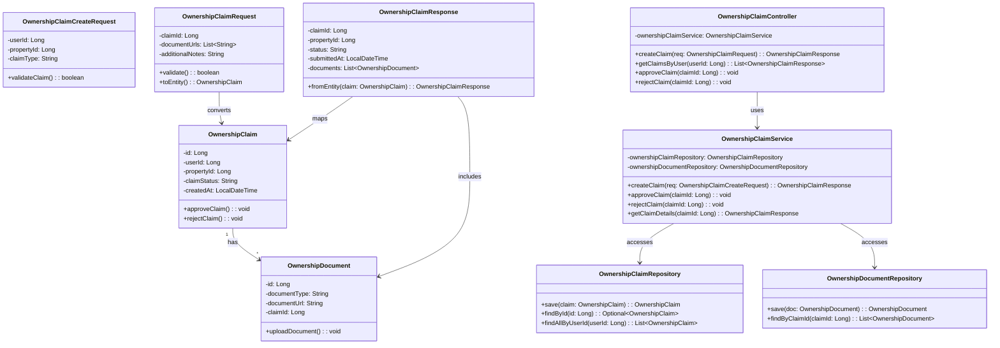
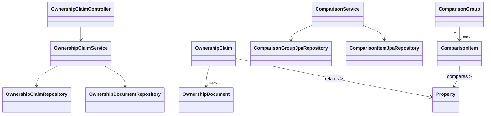

# 소유권 검증 관련

## 1. class name : OwnershipClaim

### 1.1. class description :
부동산에 대한 소유권 주장을 표현하는 엔티티. 사용자와 매물 간의 소유권 검증 절차의 핵심 레코드를 담고, 상태 전이(PENDING→APPROVED/REJECTED), 생성/검토 시점을 추적한다.

### 1.2. attribution 구분
* 1.2.1. name : id
* 1.2.2. type : Long
* 1.2.3. visibility : private
* 1.2.4. description : PK. 소유권 주장 고유 식별자.

* 1.2.1. name : userId
* 1.2.2. type : Long
* 1.2.3. visibility : private
* 1.2.4. description : 주장을 제기한 사용자 ID. User와 연계 조회 용도.

* 1.2.1. name : propertyId
* 1.2.2. type : Long
* 1.2.3. visibility : private
* 1.2.4. description : 대상 매물 ID. Property와 연계.

* 1.2.1. name : claimStatus
* 1.2.2. type : String  (PENDING/APPROVED/REJECTED/NEED_MORE_DOCS 등)
* 1.2.3. visibility : private
* 1.2.4. description : 현재 주장 처리 상태.

* 1.2.1. name : reason
* 1.2.2. type : String
* 1.2.3. visibility : private
* 1.2.4. description : 거절/보류 사유 또는 비고.

* 1.2.1. name : createdAt
* 1.2.2. type : LocalDateTime
* 1.2.3. visibility : private
* 1.2.4. description : 주장 생성 시각.

* 1.2.1. name : updatedAt
* 1.2.2. type : LocalDateTime
* 1.2.3. visibility : private
* 1.2.4. description : 상태/내용 갱신 시각.

### 1.3. Operations 구분
* 1.3.1. name : approve()
* 1.3.2. type : void
* 1.3.3. visibility : public
* 1.3.4. description : claimStatus를 APPROVED로 변경하고 updatedAt을 갱신.

* 1.3.1. name : reject(reason: String)
* 1.3.2. type : void
* 1.3.3. visibility : public
* 1.3.4. description : claimStatus를 REJECTED로 변경, 사유 기록.

* 1.3.1. name : requestMoreDocs(reason: String)
* 1.3.2. type : void
* 1.3.3. visibility : public
* 1.3.4. description : 추가 서류 요청 상태(NEED_MORE_DOCS)로 전환.

* 1.3.1. name : isTerminal()
* 1.3.2. type : boolean
* 1.3.3. visibility : public
* 1.3.4. description : APPROVED/REJECTED 여부 반환.

## 2. class name : OwnershipDocument

### 2.1. class description :
소유권 주장에 첨부되는 증빙 문서(등기부등본, 세금영수증, 매매계약서 등)를 표현하는 엔티티. 스토리지 URL 및 문서 유형/검증 상태를 포함한다.

### 2.2. attribution 구분
* 2.2.1. name : id
* 2.2.2. type : Long
* 2.2.3. visibility : private
* 2.2.4. description : PK.

* 2.2.1. name : claimId
* 2.2.2. type : Long
* 2.2.3. visibility : private
* 2.2.4. description : 소유권 주장(OwnershipClaim) 참조 FK.

* 2.2.1. name : documentType
* 2.2.2. type : String (DEED/TAX/BILL/ETC)
* 2.2.3. visibility : private
* 2.2.4. description : 문서 유형.

* 2.2.1. name : documentUrl
* 2.2.2. type : String
* 2.2.3. visibility : private
* 2.2.4. description : 문서 저장소의 절대/서명 URL.

* 2.2.1. name : verified
* 2.2.2. type : boolean
* 2.2.3. visibility : private
* 2.2.4. description : 검토자가 문서를 확인 완료했는지 여부.

* 2.2.1. name : uploadedAt
* 2.2.2. type : LocalDateTime
* 2.2.3. visibility : private
* 2.2.4. description : 업로드 시각.

### 2.3. Operations 구분
* 2.3.1. name : markVerified()
* 2.3.2. type : void
* 2.3.3. visibility : public
* 2.3.4. description : verified=true로 설정.

* 2.3.1. name : isImageLike()
* 2.3.2. type : boolean
* 2.3.3. visibility : public
* 2.3.4. description : 확장자 기반 이미지형 문서 여부.

## 3. class name : OwnershipClaimCreateRequest

### 3.1. class description :
소유권 주장 최초 생성에 사용되는 요청 DTO. 사용자/매물/초기 메시지/문서 목록을 포함.

### 3.2. attribution 구분
* 3.2.1. name : userId (Long) / private / 주장을 제기한 사용자 ID.
* 3.2.1. name : propertyId (Long) / private / 대상 매물 ID.
* 3.2.1. name : message (String) / private / 검토자에게 전달할 보충 설명.
* 3.2.1. name : documentUrls (List<String>) / private / 업로드된 문서 URL 목록.

### 3.3. Operations 구분
* 3.3.1. name : validate() / boolean / public / 필수 필드 검증.
* 3.3.1. name : toEntity() / OwnershipClaim / public / 엔티티 변환(초기 상태:PENDING).

## 4. class name : OwnershipClaimRequest

### 4.1. class description :
소유권 주장 일반 갱신/추가 제출 등에 사용되는 요청 DTO. 상태 변경 요청, 추가 문서 첨부 등의 입력을 받는다.

### 4.2. attribution 구분
* 4.2.1. name : claimId (Long) / private / 대상 주장 ID.
* 4.2.1. name : action (String) / private / APPROVE/REJECT/NEED_MORE_DOCS 등.
* 4.2.1. name : reason (String) / private / 거절/보류 사유.
* 4.2.1. name : additionalDocumentUrls (List<String>) / private / 추가 문서.

### 4.3. Operations 구분
* 4.3.1. name : validate() / boolean / public / 상태 전이 규칙 검증.
* 4.3.1. name : toUpdateInstruction() / Map<String,Object> / public / 서비스 계층용 변경 명세 생성.

## 5. class name : OwnershipClaimResponse

### 5.1. class description :
소유권 주장 상세/목록 응답 DTO. 엔티티/문서/상태/사유/타임스탬프를 클라이언트에 전달한다.

### 5.2. attribution 구분
* 5.2.1. name : claimId (Long) / private / 주장 ID.
* 5.2.1. name : userId (Long) / private / 사용자 ID.
* 5.2.1. name : propertyId (Long) / private / 매물 ID.
* 5.2.1. name : status (String) / private / 처리 상태.
* 5.2.1. name : reason (String) / private / 사유.
* 5.2.1. name : documents (List<OwnershipDocumentSummary>) / private / 첨부 요약.
* 5.2.1. name : createdAt (LocalDateTime) / private / 생성.
* 5.2.1. name : updatedAt (LocalDateTime) / private / 갱신.

### 5.3. Operations 구분
* 5.3.1. name : from(entity: OwnershipClaim, docs: List<OwnershipDocument>) / OwnershipClaimResponse / public / 매핑 팩토리.
* 5.3.1. name : summarize() / String / public / 상태+문서수 요약 텍스트.

## 6. class name : OwnershipClaimService

### 6.1. class description :
소유권 주장 생성/수정/승인/거절/문서 첨부/조회 로직을 제공하는 서비스.

### 6.2. attribution 구분
* 6.2.1. name : claimRepository (OwnershipClaimRepository) / private / 주장 저장소.
* 6.2.1. name : documentRepository (OwnershipDocumentRepository) / private / 문서 저장소.
* 6.2.1. name : clock (Clock) / private / 시간 주입(테스트 편의).

### 6.3. Operations 구분
* 6.3.1. name : create(req: OwnershipClaimCreateRequest) / OwnershipClaimResponse / public / 주장 생성, 문서 저장.
* 6.3.1. name : update(req: OwnershipClaimRequest) / OwnershipClaimResponse / public / 상태 전이/사유/문서 추가 반영.
* 6.3.1. name : getDetail(id: Long) / OwnershipClaimResponse / public / 상세 조회.
* 6.3.1. name : listByUser(userId: Long) / List<OwnershipClaimResponse> / public / 사용자별 목록.
* 6.3.1. name : attachDocuments(id: Long, urls: List<String>) / OwnershipClaimResponse / public / 문서 추가.

## 7. class name : OwnershipClaimController

### 7.1. class description :
소유권 주장 REST 컨트롤러. 생성/갱신/조회 HTTP 엔드포인트 제공.

### 7.2. attribution 구분
* 7.2.1. name : service (OwnershipClaimService) / private / 도메인 서비스.
* 7.2.1. name : mapper (ObjectMapper or Mapper) / private / DTO 매핑 보조.

### 7.3. Operations 구분
* 7.3.1. name : POST /ownership-claims / OwnershipClaimResponse / public / 주장 생성.
* 7.3.1. name : PATCH /ownership-claims/{id} / OwnershipClaimResponse / public / 상태 갱신/문서 추가.
* 7.3.1. name : GET /ownership-claims/{id} / OwnershipClaimResponse / public / 상세 조회.
* 7.3.1. name : GET /ownership-claims?userId= / List<OwnershipClaimResponse> / public / 사용자별 목록.

## 8. class name : OwnershipClaimRepository

### 8.1. class description :
OwnershipClaim JPA/스프링 데이터 리포지토리 인터페이스. CRUD + 검색 제공.

### 8.2. attribution 구분
* 8.2.1. name : (상태없음, 인터페이스) 

### 8.3. Operations 구분
* 8.3.1. name : save(entity: OwnershipClaim) / OwnershipClaim / public / 저장.
* 8.3.1. name : findById(id: Long) / Optional<OwnershipClaim> / public / 단건 조회.
* 8.3.1. name : findAllByUserId(userId: Long) / List<OwnershipClaim> / public / 사용자별 조회.
* 8.3.1. name : existsByPropertyIdAndUserId(propertyId: Long, userId: Long) / boolean / public / 중복 주장 여부.

## 9. class name : OwnershipDocumentRepository

### 9.1. class description :
OwnershipDocument 리포지토리 인터페이스. 문서 CRUD 및 주장 ID별 조회 제공.

### 9.2. attribution 구분
* 9.2.1. name : (상태없음, 인터페이스)

### 9.3. Operations 구분
* 9.3.1. name : save(doc: OwnershipDocument) / OwnershipDocument / public / 저장.
* 9.3.1. name : findAllByClaimId(claimId: Long) / List<OwnershipDocument> / public / 문서 목록.
* 9.3.1. name : deleteById(id: Long) / void / public / 삭제.

---
# 매물 비교 관련

```mermaid
classDiagram
    %% ===== 엔티티 =====
    class ComparisonGroup {
        -id: Long
        -groupName: String
        -description: String
        +addItem(item: ComparisonItem): void
        +removeItem(itemId: Long): void
    }

    class ComparisonItem {
        -id: Long
        -propertyId: Long
        -comparisonValue: String
        +compare(): void
    }

    %% ===== DTO =====
    class CreateGroupRequest {
        -groupName: String
        -description: String
        +toEntity(): ComparisonGroup
    }

    class GroupDetailResponse {
        -groupId: Long
        -groupName: String
        -items: List~ItemResponse~
        +fromEntity(group: ComparisonGroup): GroupDetailResponse
    }

    class GroupResponse {
        -groupId: Long
        -groupName: String
        +fromEntity(group: ComparisonGroup): GroupResponse
    }

    class GroupSummaryResponse {
        -groupId: Long
        -groupName: String
        -itemCount: int
        +fromEntity(group: ComparisonGroup): GroupSummaryResponse
    }

    class AddItemRequest {
        -groupId: Long
        -propertyId: Long
        -comparisonValue: String
        +toEntity(group: ComparisonGroup): ComparisonItem
    }

    class CompareResultResponse {
        -groupId: Long
        -comparisonResults: Map~String,Double~
        +calculateResults(): CompareResultResponse
    }

    class RenameGroupRequest {
        -groupId: Long
        -newName: String
        +validate(): boolean
    }

    class ItemResponse {
        -itemId: Long
        -propertyId: Long
        -comparisonValue: String
        +fromEntity(item: ComparisonItem): ItemResponse
    }

    class WeightsRequest {
        -priceWeight: double
        -sizeWeight: double
        -locationWeight: double
        +normalizeWeights(): void
    }

    %% ===== Service, Repository =====
    class ComparisonService {
        +createGroup(req: CreateGroupRequest): GroupResponse
        +addItem(req: AddItemRequest): ItemResponse
        +compareGroup(groupId: Long, weights: WeightsRequest): CompareResultResponse
        +renameGroup(req: RenameGroupRequest): void
        +getGroupSummary(userId: Long): List~GroupSummaryResponse~
    }

    class ComparisonGroupJpaRepository {
        +save(group: ComparisonGroup): ComparisonGroup
        +findById(id: Long): Optional~ComparisonGroup~
        +findAllByUserId(userId: Long): List~ComparisonGroup~
    }

    class ComparisonItemJpaRepository {
        +save(item: ComparisonItem): ComparisonItem
        +findAllByGroupId(groupId: Long): List~ComparisonItem~
    }

    %% ===== Relationships =====
    ComparisonGroup "1" --> "many" ComparisonItem : contains >
    ComparisonService --> ComparisonGroupJpaRepository : accesses >
    ComparisonService --> ComparisonItemJpaRepository : accesses >
    ComparisonService --> CreateGroupRequest : uses >
    ComparisonService --> AddItemRequest : uses >
    ComparisonService --> CompareResultResponse : returns >
    ComparisonService --> GroupResponse : returns >
    GroupDetailResponse --> ComparisonGroup : maps >
    GroupDetailResponse --> ItemResponse : includes >
    AddItemRequest --> ComparisonItem : converts >
    WeightsRequest --> CompareResultResponse : influences >
```

## 10. class name : ComparisonGroup

### 10.1. class description :
사용자별 매물 비교 그룹 엔티티. 여러 매물을 하나의 그룹으로 묶어 비교/공유/이름 변경/가중치 적용을 지원한다.

### 10.2. attribution 구분
* 10.2.1. name : id (Long) / private / PK.
* 10.2.1. name : ownerUserId (Long) / private / 그룹 소유 사용자 ID.
* 10.2.1. name : name (String) / private / 그룹명.
* 10.2.1. name : description (String) / private / 그룹 설명.
* 10.2.1. name : createdAt (LocalDateTime) / private / 생성 시각.
* 10.2.1. name : updatedAt (LocalDateTime) / private / 수정 시각.

### 10.3. Operations 구분
* 10.3.1. name : rename(newName: String) / void / public / 그룹명 변경.
* 10.3.1. name : changeDescription(desc: String) / void / public / 설명 변경.

## 11. class name : ComparisonItem

### 11.1. class description :
비교 그룹에 포함된 개별 매물 항목 엔티티. 비교용 지표(가격/면적/위치 등)의 스냅샷 값을 보관한다.

### 11.2. attribution 구분
* 11.2.1. name : id (Long) / private / PK.
* 11.2.1. name : groupId (Long) / private / ComparisonGroup FK.
* 11.2.1. name : propertyId (Long) / private / 원본 매물 ID.
* 11.2.1. name : capturedPrice (Long) / private / 비교 시점 가격.
* 11.2.1. name : capturedArea (Double) / private / 전용/공급 면적 중 선택 값.
* 11.2.1. name : capturedLocationScore (Double) / private / 가중치 연산용 점수.
* 11.2.1. name : note (String) / private / 비고.

### 11.3. Operations 구분
* 11.3.1. name : updateSnapshot(price: Long, area: Double) / void / public / 스냅샷 갱신.
* 11.3.1. name : applyNote(note: String) / void / public / 비고 저장.

## 12. class name : CreateGroupRequest

### 12.1. class description :
비교 그룹 생성 요청 DTO.

### 12.2. attribution 구분
* 12.2.1. name : name (String) / private / 그룹명.
* 12.2.1. name : description (String) / private / 설명(선택).

### 12.3. Operations 구분
* 12.3.1. name : validate() / boolean / public / 이름 필수/길이 규칙.
* 12.3.1. name : toEntity(ownerUserId: Long) / ComparisonGroup / public / 엔티티 변환.

## 13. class name : GroupDetailResponse

### 13.1. class description :
그룹 상세 응답 DTO. 그룹 메타 + 항목 목록 + 집계 지표.

### 13.2. attribution 구분
* 13.2.1. name : group (GroupResponse) / private / 그룹 요약.
* 13.2.1. name : items (List<ItemResponse>) / private / 항목들.
* 13.2.1. name : weights (WeightsRequest) / private / 적용 가중치(에코 백).
* 13.2.1. name : computedScore (Double) / private / 그룹 비교 결과 점수(예: 가중합).

### 13.3. Operations 구분
* 13.3.1. name : of(...) / GroupDetailResponse / public / 조립 팩토리.
* 13.3.1. name : summaryText() / String / public / UI 요약 문자열.

## 14. class name : GroupResponse

### 14.1. class description :
그룹 단건 응답 DTO(요약).

### 14.2. attribution 구분
* 14.2.1. name : id (Long) / private
* 14.2.1. name : name (String) / private
* 14.2.1. name : description (String) / private
* 14.2.1. name : itemCount (int) / private
* 14.2.1. name : createdAt (LocalDateTime) / private

### 14.3. Operations 구분
* 14.3.1. name : from(entity: ComparisonGroup, itemCount: int) / GroupResponse / public / 매핑.

## 15. class name : GroupSummaryResponse

### 15.1. class description :
여러 그룹의 요약 목록 응답 DTO.

### 15.2. attribution 구분
* 15.2.1. name : groups (List<GroupResponse>) / private / 그룹 요약 배열.
* 15.2.1. name : totalCount (long) / private / 전체 그룹 수.

### 15.3. Operations 구분
* 15.3.1. name : of(list: List<GroupResponse>, total: long) / GroupSummaryResponse / public / 조립.
* 15.3.1. name : hasMore(offset: int, limit: int) / boolean / public / 페이지네이션 보조.

## 16. class name : AddItemRequest

### 16.1. class description :
그룹에 항목(매물)을 추가하는 요청 DTO.

### 16.2. attribution 구분
* 16.2.1. name : groupId (Long) / private / 대상 그룹.
* 16.2.1. name : propertyId (Long) / private / 추가할 매물.
* 16.2.1. name : note (String) / private / 비고(선택).

### 16.3. Operations 구분
* 16.3.1. name : validate() / boolean / public / 중복/권한 체크 선행 여부.
* 16.3.1. name : toEntity() / ComparisonItem / public / 엔티티 변환(스냅샷 채우기).

## 17. class name : CompareResultResponse

### 17.1. class description :
가중치/지표에 따라 계산된 비교 결과 응답 DTO. 항목별 점수와 순위를 포함.

### 17.2. attribution 구분
* 17.2.1. name : groupId (Long) / private
* 17.2.1. name : itemScores (List<Map<String,Object>>) / private / 항목별 {itemId, score, rank}.
* 17.2.1. name : usedWeights (WeightsRequest) / private / 적용 가중치.
* 17.2.1. name : computedAt (LocalDateTime) / private / 계산 시각.

### 17.3. Operations 구분
* 17.3.1. name : of(...) / CompareResultResponse / public / 조립 팩토리.
* 17.3.1. name : topN(n: int) / List<Long> / public / 상위 N개 항목 ID 반환.

## 18. class name : RenameGroupRequest

### 18.1. class description :
그룹명 변경 요청 DTO.

### 18.2. attribution 구분
* 18.2.1. name : groupId (Long) / private
* 18.2.1. name : newName (String) / private

### 18.3. Operations 구분
* 18.3.1. name : validate() / boolean / public / 길이/금칙어 체크.

## 19. class name : ItemResponse

### 19.1. class description :
그룹 항목 요약 응답 DTO.

### 19.2. attribution 구분
* 19.2.1. name : itemId (Long) / private
* 19.2.1. name : propertyId (Long) / private
* 19.2.1. name : price (Long) / private
* 19.2.1. name : area (Double) / private
* 19.2.1. name : locationScore (Double) / private
* 19.2.1. name : note (String) / private

### 19.3. Operations 구분
* 19.3.1. name : from(entity: ComparisonItem) / ItemResponse / public / 매핑.

## 20. class name : WeightsRequest

### 20.1. class description :
비교 계산 시 사용할 가중치 입력 DTO. (예: 가격, 면적, 위치/교통 등)

### 20.2. attribution 구분
* 20.2.1. name : priceWeight (Double) / private
* 20.2.1. name : areaWeight (Double) / private
* 20.2.1. name : locationWeight (Double) / private
* 20.2.1. name : normalize (boolean) / private / 합=1 정규화 여부.

### 20.3. Operations 구분
* 20.3.1. name : validate() / boolean / public / 음수/합계 규칙.
* 20.3.1. name : normalized() / WeightsRequest / public / 정규화된 사본 반환.

## 21. class name : ComparisonService

### 21.1. class description :
그룹/항목 CRUD, 비교 계산, 가중치 적용, 요약 응답 조립을 담당하는 도메인 서비스.

### 21.2. attribution 구분
* 21.2.1. name : groupRepo (ComparisonGroupJpaRepository) / private
* 21.2.1. name : itemRepo (ComparisonItemJpaRepository) / private
* 21.2.1. name : scorer (Function or Component) / private / 점수 계산기.

### 21.3. Operations 구분
* 21.3.1. name : createGroup(req: CreateGroupRequest, ownerUserId: Long) / GroupResponse / public
* 21.3.1. name : renameGroup(req: RenameGroupRequest, ownerUserId: Long) / GroupResponse / public
* 21.3.1. name : addItem(req: AddItemRequest, ownerUserId: Long) / ItemResponse / public
* 21.3.1. name : getGroupDetail(groupId: Long, ownerUserId: Long, weights: WeightsRequest) / GroupDetailResponse / public
* 21.3.1. name : compare(groupId: Long, weights: WeightsRequest) / CompareResultResponse / public

## 22. class name : ComparisonGroupJpaRepository

### 22.1. class description :
ComparisonGroup용 JPA/스프링 데이터 리포지토리 인터페이스.

### 22.2. attribution 구분
* 22.2.1. name : (상태없음, 인터페이스)

### 22.3. Operations 구분
* 22.3.1. name : save(group: ComparisonGroup) / ComparisonGroup / public
* 22.3.1. name : findById(id: Long) / Optional<ComparisonGroup> / public
* 22.3.1. name : findAllByOwnerUserId(ownerUserId: Long) / List<ComparisonGroup> / public
* 22.3.1. name : deleteById(id: Long) / void / public

## 23. class name : ComparisonItemJpaRepository

### 23.1. class description :
ComparisonItem용 JPA/스프링 데이터 리포지토리 인터페이스.

### 23.2. attribution 구분
* 23.2.1. name : (상태없음, 인터페이스)

### 23.3. Operations 구분
* 23.3.1. name : save(item: ComparisonItem) / ComparisonItem / public
* 23.3.1. name : findById(id: Long) / Optional<ComparisonItem> / public
* 23.3.1. name : findAllByGroupId(groupId: Long) / List<ComparisonItem> / public
* 23.3.1. name : deleteById(id: Long) / void / public

### 전체 구조 요약

