# 1. PropertyController

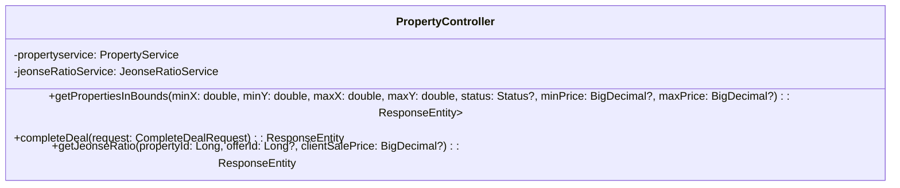
## 1.1. class description
지도 범위 검색, 거래 완료 처리, 전세가율 계산 요청을 처리하는 클래스이다. REST 요청을 검증하고 서비스 계층에 위임한다.

## 1.2. attribution 구분

### 1.2.1. propertyservice
* **name**: propertyservice
* **type**: PropertyService
* **visibility**: private
* **description**: 지도/상세/거래완료 로직을 수행한다.

### 1.2.2. jeonseRatioService
* **name**: jeonseRatioService
* **type**: JeonseRatioService
* **visibility**: private
* **description**: 전세가율 계산을 수행한다.

## 1.3. Operations 구분

### 1.3.1. getPropertiesInBounds
* **name**: getPropertiesInBounds
* **type**: ResponseEntity<List<PropertyMarkerDto>>
* **visibility**: public
* **description**: 지도 사각 범위와 상태/가격 조건으로 매물 마커 목록을 조회한다.

### 1.3.2. completeDeal
* **name**: completeDeal
* **type**: ResponseEntity<Void>
* **visibility**: public
* **description**: 브로커 권한 확인 후 특정 매물을 거래 완료로 처리한다.

### 1.3.3. getJeonseRatio
* **name**: getJeonseRatio
* **type**: ResponseEntity<JeonseRatioResponse>
* **visibility**: public
* **description**: 전세가율을 계산하여 반환한다.


# 2. PropertyFavoriteController

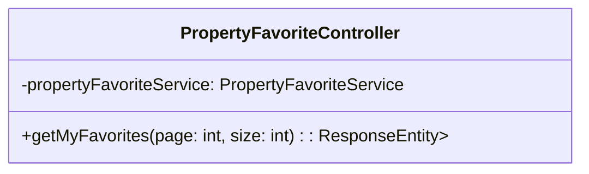
## 1.1. class description
인증 사용자의 찜 목록 API를 제공하는 클래스이다. 로그인 컨텍스트를 이용해 페이지네이션 조회를 수행한다.

## 1.2. attribution 구분

### 1.2.1. propertyFavoriteService
* **name**: propertyFavoriteService
* **type**: PropertyFavoriteService
* **visibility**: private
* **description**: 찜 목록 조회 비즈니스 로직을 수행한다.

## 1.3. Operations 구분

### 1.3.1. getMyFavorites
* **name**: getMyFavorites
* **type**: ResponseEntity<List<PropertyFavoriteDto>>
* **visibility**: public
* **description**: 로그인 사용자의 찜 목록을 조회한다.


# 3. PropertyFavoriteToggleController

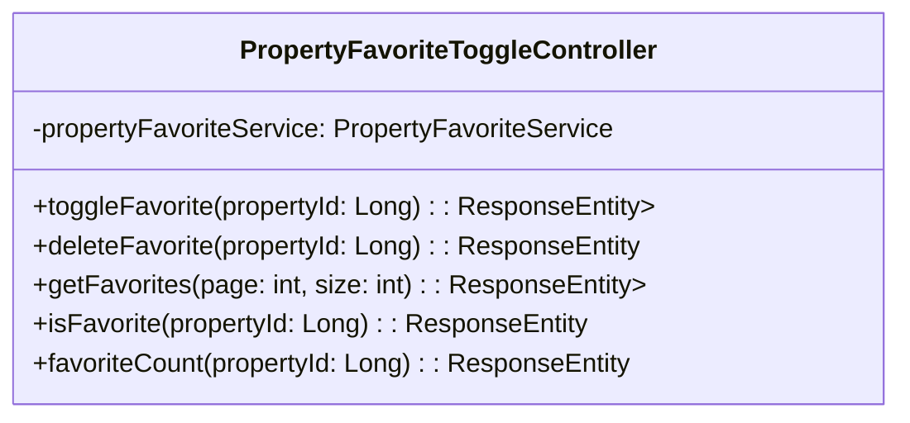
## 1.1. class description
특정 매물에 대한 찜 on/off 토글 및 조회 기능을 제공하는 클래스이다.

## 1.2. attribution 구분

### 1.2.1. propertyFavoriteService
* **name**: propertyFavoriteService
* **type**: PropertyFavoriteService
* **visibility**: private
* **description**: 찜 토글/카운트 로직을 수행한다.

## 1.3. Operations 구분

### 1.3.1. toggleFavorite
* **name**: toggleFavorite
* **type**: ResponseEntity<Map<String, Boolean>>
* **visibility**: public
* **description**: 해당 매물의 찜 상태를 토글한다.

### 1.3.2. deleteFavorite
* **name**: deleteFavorite
* **type**: ResponseEntity<Void>
* **visibility**: public
* **description**: 해당 매물의 찜을 해제한다.

### 1.3.3. getFavorites
* **name**: getFavorites
* **type**: ResponseEntity<List<PropertyFavoriteDto>>
* **visibility**: public
* **description**: 내 찜 목록을 조회한다.

### 1.3.4. isFavorite
* **name**: isFavorite
* **type**: ResponseEntity<Boolean>
* **visibility**: public
* **description**: 특정 매물에 대한 내 찜 여부를 반환한다.

### 1.3.5. favoriteCount
* **name**: favoriteCount
* **type**: ResponseEntity<Long>
* **visibility**: public
* **description**: 해당 매물의 총 찜 수를 반환한다.


# 4. PropertyOfferController

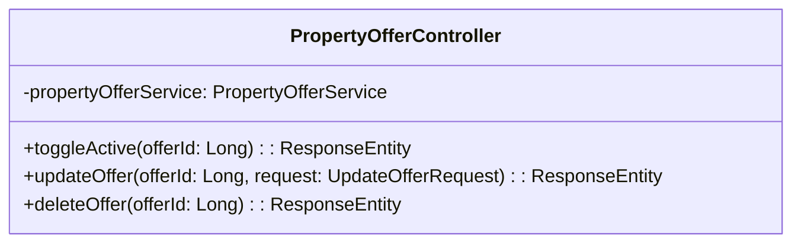
## 1.1. class description
매물 오퍼의 활성화/수정/삭제를 처리하는 클래스이다. 오퍼 소유자 권한을 검증한다.

## 1.2. attribution 구분

### 1.2.1. propertyOfferService
* **name**: propertyOfferService
* **type**: PropertyOfferService
* **visibility**: private
* **description**: 오퍼 권한 검증과 상태 변경을 수행한다.

## 1.3. Operations 구분

### 1.3.1. toggleActive
* **name**: toggleActive
* **type**: ResponseEntity<PropertyOfferResponse>
* **visibility**: public
* **description**: 특정 오퍼의 활성/비활성을 토글한다.

### 1.3.2. updateOffer
* **name**: updateOffer
* **type**: ResponseEntity<PropertyOfferResponse>
* **visibility**: public
* **description**: 오퍼의 상세 정보를 수정한다.

### 1.3.3. deleteOffer
* **name**: deleteOffer
* **type**: ResponseEntity<Void>
* **visibility**: public
* **description**: 정책 검증 후 오퍼를 삭제한다.


# 5. PropertyQueryController

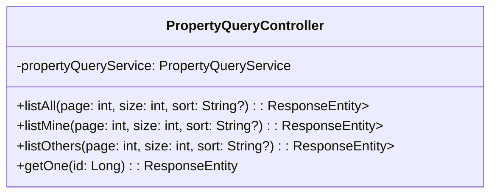
## 1.1. class description
목록/상세 조회(전체/내 것/타인 것) 엔드포인트를 제공하는 클래스이다.

## 1.2. attribution 구분

### 1.2.1. propertyQueryService
* **name**: propertyQueryService
* **type**: PropertyQueryService
* **visibility**: private
* **description**: 페이지네이션·정렬·상세 변환 로직을 수행한다.

## 1.3. Operations 구분

### 1.3.1. listAll
* **name**: listAll
* **type**: ResponseEntity<List<PropertyResponse>>
* **visibility**: public
* **description**: 전체 매물 목록을 조회한다.

### 1.3.2. listMine
* **name**: listMine
* **type**: ResponseEntity<List<PropertyResponse>>
* **visibility**: public
* **description**: 내가 등록한 매물 목록을 조회한다.

### 1.3.3. listOthers
* **name**: listOthers
* **type**: ResponseEntity<List<PropertyResponse>>
* **visibility**: public
* **description**: 타인이 등록한 매물 목록을 조회한다.

### 1.3.4. getOne
* **name**: getOne
* **type**: ResponseEntity<PropertyWithOffersDto>
* **visibility**: public
* **description**: 단건 상세(오퍼 포함)를 조회한다.


# 6. PropertySearchController

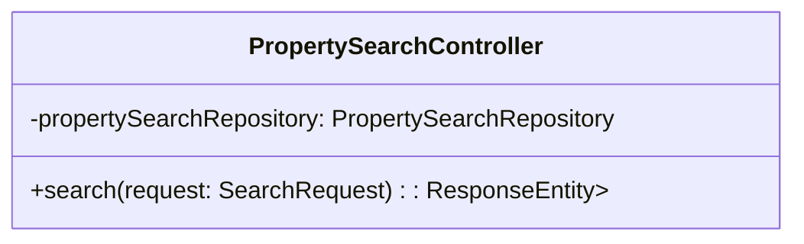
## 1.1. class description
복합 조건의 검색을 수행하는 클래스이다.

## 1.2. attribution 구분

### 1.2.1. propertySearchRepository
* **name**: propertySearchRepository
* **type**: PropertySearchRepository
* **visibility**: private
* **description**: 동적 쿼리 빌드를 통해 검색을 수행한다.

## 1.3. Operations 구분

### 1.3.1. search
* **name**: search
* **type**: ResponseEntity<List<PropertyResponse>>
* **visibility**: public
* **description**: SearchRequest 바디를 받아 조건 검색을 수행한다.


# 7. CompleteDealRequest

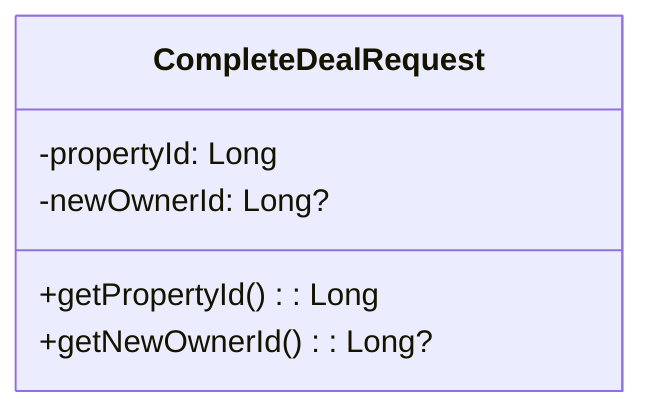
## 1.1. class description
거래 완료 처리에 필요한 입력 값을 담는 클래스이다.

## 1.2. attribution 구분

### 1.2.1. propertyId
* **name**: propertyId
* **type**: Long
* **visibility**: private
* **description**: 거래 완료 대상 매물의 식별자이다.

### 1.2.2. newOwnerId
* **name**: newOwnerId
* **type**: Long?
* **visibility**: private
* **description**: 거래 완료 시 새 소유자의 식별자이다(선택).

## 1.3. Operations 구분

### 1.3.1. getters/setters
* **name**: getters/setters
* **type**: Long / Long?
* **visibility**: public
* **description**: 직렬화/역직렬화를 위해 접근자를 제공한다.


# 8. JeonseRatioResponse

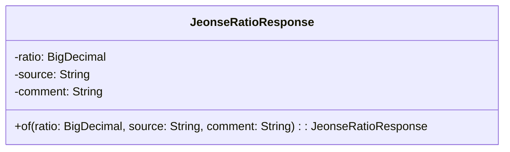
## 1.1. class description
전세가율 계산 결과를 담는 클래스이다.

## 1.2. attribution 구분

### 1.2.1. ratio
* **name**: ratio
* **type**: BigDecimal
* **visibility**: private
* **description**: 계산된 전세가율 값이다.

### 1.2.2. source
* **name**: source
* **type**: String
* **visibility**: private
* **description**: 매매가의 출처를 나타낸다.

### 1.2.3. comment
* **name**: comment
* **type**: String
* **visibility**: private
* **description**: 전세가율 해석 코멘트이다.

## 1.3. Operations 구분

### 1.3.1. of
* **name**: of
* **type**: static factory
* **visibility**: public
* **description**: 전달된 값으로 응답 객체를 생성한다.


# 9. PropertyDetailDto

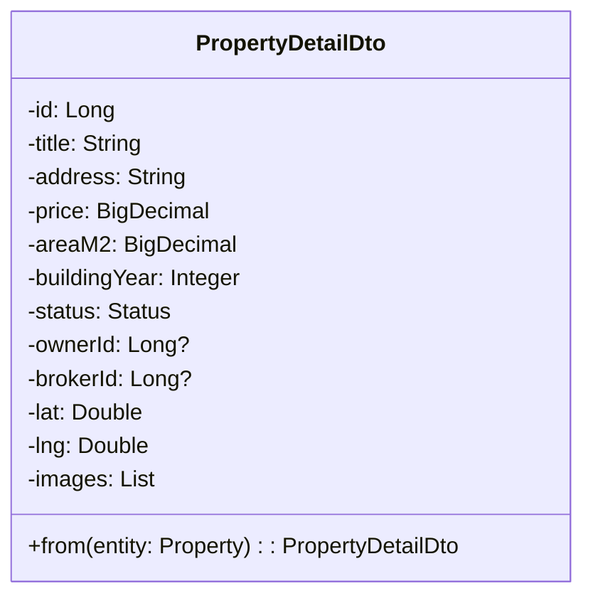
## 1.1. class description
단건 상세 화면에 필요한 매물 정보를 묶는 클래스이다.

## 1.2. attribution 구분

### 1.2.1. id
* **name**: id
* **type**: Long
* **visibility**: private
* **description**: 매물의 식별자이다.

### 1.2.2. title
* **name**: title
* **type**: String
* **visibility**: private
* **description**: 매물의 제목이다.

### 1.2.3. address
* **name**: address
* **type**: String
* **visibility**: private
* **description**: 매물의 주소이다.

### 1.2.4. price
* **name**: price
* **type**: BigDecimal
* **visibility**: private
* **description**: 대표 가격(매매가)이다.

### 1.2.5. areaM2
* **name**: areaM2
* **type**: BigDecimal
* **visibility**: private
* **description**: 전용면적(m²)이다.

### 1.2.6. buildingYear
* **name**: buildingYear
* **type**: Integer
* **visibility**: private
* **description**: 준공년도이다.

### 1.2.7. status
* **name**: status
* **type**: Enum
* **visibility**: private
* **description**: 매물의 상태이다.

### 1.2.8. ownerId
* **name**: ownerId
* **type**: Long?
* **visibility**: private
* **description**: 소유자 식별자이다.

### 1.2.9. brokerId
* **name**: brokerId
* **type**: Long?
* **visibility**: private
* **description**: 브로커 식별자이다.

### 1.2.10. lat
* **name**: lat
* **type**: Double
* **visibility**: private
* **description**: 위도 값이다.

### 1.2.11. lng
* **name**: lng
* **type**: Double
* **visibility**: private
* **description**: 경도 값이다.

### 1.2.12. images
* **name**: images
* **type**: List<String>
* **visibility**: private
* **description**: 이미지 URL 목록이다.

## 1.3. Operations 구분

### 1.3.1. from
* **name**: from
* **type**: static builder
* **visibility**: public
* **description**: 엔티티와 연관 데이터로 DTO를 생성한다.


# 10. PropertyFavoriteDto

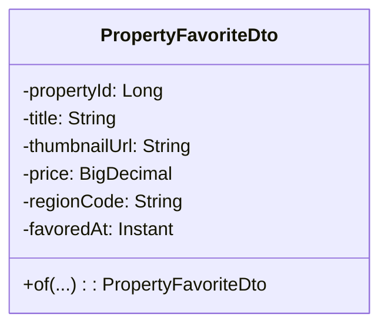
## 1.1. class description
찜 카드 목록 표시를 위한 정보를 담는 클래스이다.

## 1.2. attribution 구분

### 1.2.1. propertyId
* **name**: propertyId
* **type**: Long
* **visibility**: private
* **description**: 매물 식별자이다.

### 1.2.2. title
* **name**: title
* **type**: String
* **visibility**: private
* **description**: 매물 제목이다.

### 1.2.3. thumbnailUrl
* **name**: thumbnailUrl
* **type**: String
* **visibility**: private
* **description**: 대표 이미지 URL이다.

### 1.2.4. price
* **name**: price
* **type**: BigDecimal
* **visibility**: private
* **description**: 표시용 가격이다.

### 1.2.5. regionCode
* **name**: regionCode
* **type**: String
* **visibility**: private
* **description**: 행정 구역 코드이다.

### 1.2.6. favoredAt
* **name**: favoredAt
* **type**: Instant
* **visibility**: private
* **description**: 찜한 시각이다.

## 1.3. Operations 구분

### 1.3.1. of
* **name**: of
* **type**: static builder
* **visibility**: public
* **description**: 네이티브/템플릿 결과에서 DTO를 생성한다.


# 11. PropertyFilterDto

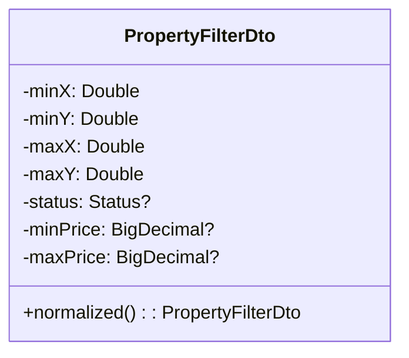
## 1.1. class description
지도 범위/상태/가격 필터를 보관하는 클래스이다.

## 1.2. attribution 구분

### 1.2.1. minX
* **name**: minX
* **type**: Double
* **visibility**: private
* **description**: 좌하단 경도의 최소값이다.

### 1.2.2. minY
* **name**: minY
* **type**: Double
* **visibility**: private
* **description**: 좌하단 위도의 최소값이다.

### 1.2.3. maxX
* **name**: maxX
* **type**: Double
* **visibility**: private
* **description**: 우상단 경도의 최대값이다.

### 1.2.4. maxY
* **name**: maxY
* **type**: Double
* **visibility**: private
* **description**: 우상단 위도의 최대값이다.

### 1.2.5. status
* **name**: status
* **type**: Enum?
* **visibility**: private
* **description**: 매물 상태 필터이다.

### 1.2.6. minPrice
* **name**: minPrice
* **type**: BigDecimal?
* **visibility**: private
* **description**: 최소 가격 필터이다.

### 1.2.7. maxPrice
* **name**: maxPrice
* **type**: BigDecimal?
* **visibility**: private
* **description**: 최대 가격 필터이다.

## 1.3. Operations 구분

### 1.3.1. normalized
* **name**: normalized
* **type**: PropertyFilterDto
* **visibility**: public
* **description**: 경계 뒤집힘을 보정한 새 필터를 반환한다.


# 12. PropertyMarkerDto

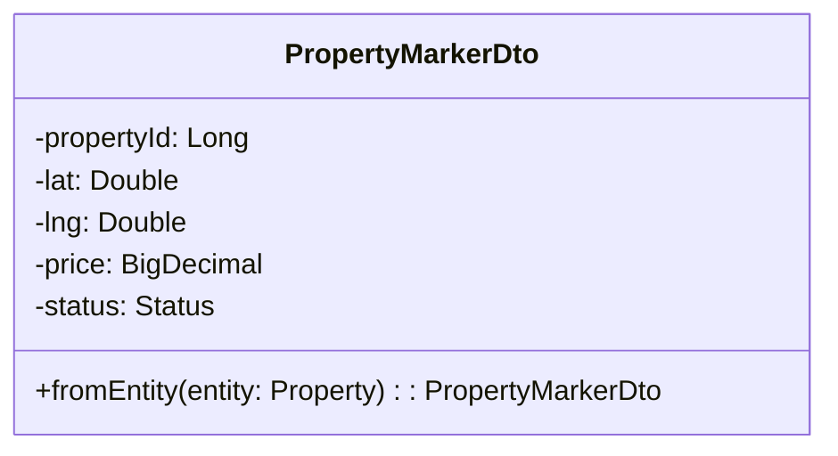
## 1.1. class description
지도 마커 렌더링에 필요한 최소 정보를 담는 클래스이다.

## 1.2. attribution 구분

### 1.2.1. propertyId
* **name**: propertyId
* **type**: Long
* **visibility**: private
* **description**: 매물 식별자이다.

### 1.2.2. lat
* **name**: lat
* **type**: Double
* **visibility**: private
* **description**: 위도 값이다.

### 1.2.3. lng
* **name**: lng
* **type**: Double
* **visibility**: private
* **description**: 경도 값이다.

### 1.2.4. price
* **name**: price
* **type**: BigDecimal
* **visibility**: private
* **description**: 표시용 가격이다.

### 1.2.5. status
* **name**: status
* **type**: Enum
* **visibility**: private
* **description**: 매물 상태이다.

## 1.3. Operations 구분

### 1.3.1. fromEntity
* **name**: fromEntity
* **type**: static builder
* **visibility**: public
* **description**: 엔티티로부터 DTO를 생성한다.


# 13. PropertyOfferCreateRequest

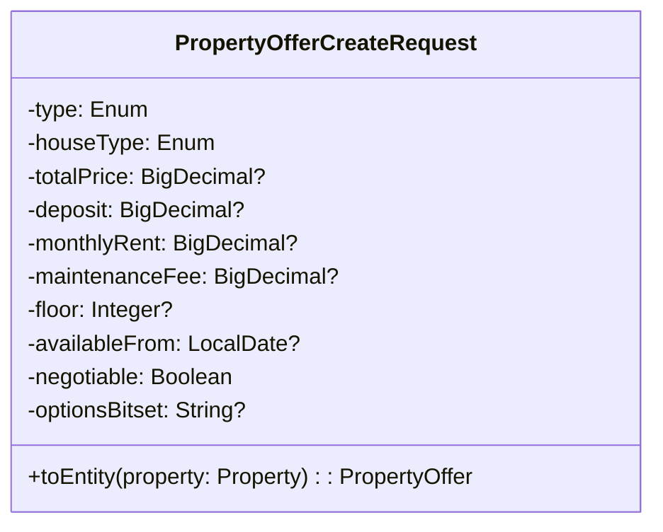
## 1.1. class description
오퍼 생성/수정 입력을 담는 클래스이다.

## 1.2. attribution 구분

### 1.2.1. type
* **name**: type
* **type**: Enum
* **visibility**: private
* **description**: 거래 유형이다.

### 1.2.2. houseType
* **name**: houseType
* **type**: Enum
* **visibility**: private
* **description**: 주택 유형이다.

### 1.2.3. totalPrice
* **name**: totalPrice
* **type**: BigDecimal?
* **visibility**: private
* **description**: 매매가이다.

### 1.2.4. deposit
* **name**: deposit
* **type**: BigDecimal?
* **visibility**: private
* **description**: 보증금이다.

### 1.2.5. monthlyRent
* **name**: monthlyRent
* **type**: BigDecimal?
* **visibility**: private
* **description**: 월세 금액이다.

### 1.2.6. maintenanceFee
* **name**: maintenanceFee
* **type**: BigDecimal?
* **visibility**: private
* **description**: 관리비이다.

### 1.2.7. floor
* **name**: floor
* **type**: Integer?
* **visibility**: private
* **description**: 층수이다.

### 1.2.8. availableFrom
* **name**: availableFrom
* **type**: LocalDate?
* **visibility**: private
* **description**: 입주 가능일이다.

### 1.2.9. negotiable
* **name**: negotiable
* **type**: Boolean
* **visibility**: private
* **description**: 가격 협상 가능 여부이다.

### 1.2.10. optionsBitset
* **name**: optionsBitset
* **type**: String?
* **visibility**: private
* **description**: 옵션 비트마스크 문자열이다.

## 1.3. Operations 구분

### 1.3.1. toEntity
* **name**: toEntity
* **type**: PropertyOffer
* **visibility**: public
* **description**: 유효성 검증 후 엔티티로 변환한다.


# 14. PropertyOfferDto

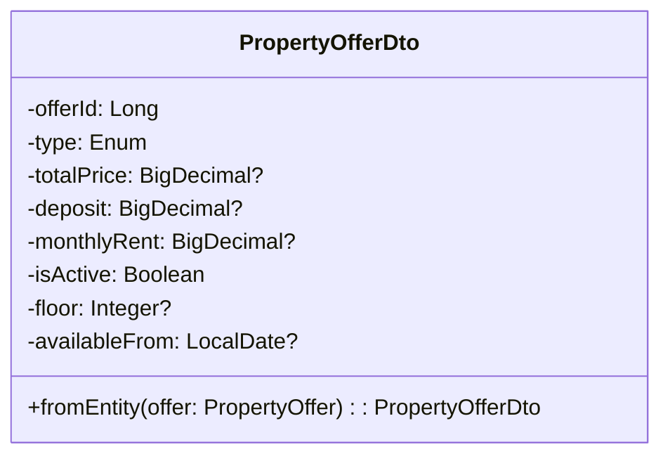
## 1.1. class description
화면 표시용 오퍼 정보를 담는 클래스이다.

## 1.2. attribution 구분

### 1.2.1. offerId
* **name**: offerId
* **type**: Long
* **visibility**: private
* **description**: 오퍼의 식별자이다.

### 1.2.2. type
* **name**: type
* **type**: Enum
* **visibility**: private
* **description**: 거래 유형이다.

### 1.2.3. totalPrice
* **name**: totalPrice
* **type**: BigDecimal?
* **visibility**: private
* **description**: 매매가이다.

### 1.2.4. deposit
* **name**: deposit
* **type**: BigDecimal?
* **visibility**: private
* **description**: 보증금이다.

### 1.2.5. monthlyRent
* **name**: monthlyRent
* **type**: BigDecimal?
* **visibility**: private
* **description**: 월세 금액이다.

### 1.2.6. isActive
* **name**: isActive
* **type**: Boolean
* **visibility**: private
* **description**: 활성 여부이다.

### 1.2.7. floor
* **name**: floor
* **type**: Integer?
* **visibility**: private
* **description**: 층수이다.

### 1.2.8. availableFrom
* **name**: availableFrom
* **type**: LocalDate?
* **visibility**: private
* **description**: 입주 가능일이다.

## 1.3. Operations 구분

### 1.3.1. fromEntity
* **name**: fromEntity
* **type**: static builder
* **visibility**: public
* **description**: 오퍼 엔티티를 DTO로 변환한다.


# 15. PropertyOfferResponse

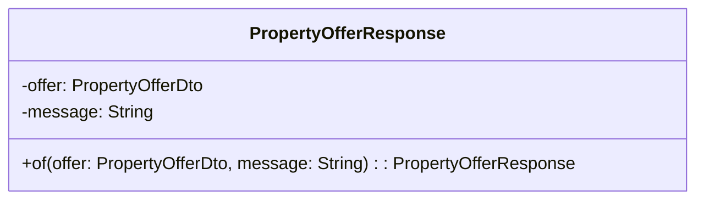
## 1.1. class description
오퍼 활성 토글/수정/삭제 응답을 담는 클래스이다.

## 1.2. attribution 구분

### 1.2.1. offer
* **name**: offer
* **type**: PropertyOfferDto
* **visibility**: private
* **description**: 응답에 포함되는 오퍼 DTO이다.

### 1.2.2. message
* **name**: message
* **type**: String
* **visibility**: private
* **description**: 처리 결과 메시지이다.

## 1.3. Operations 구분

### 1.3.1. of
* **name**: of
* **type**: static factory
* **visibility**: public
* **description**: 편의 생성기를 제공한다.


# 16. PropertyResponse

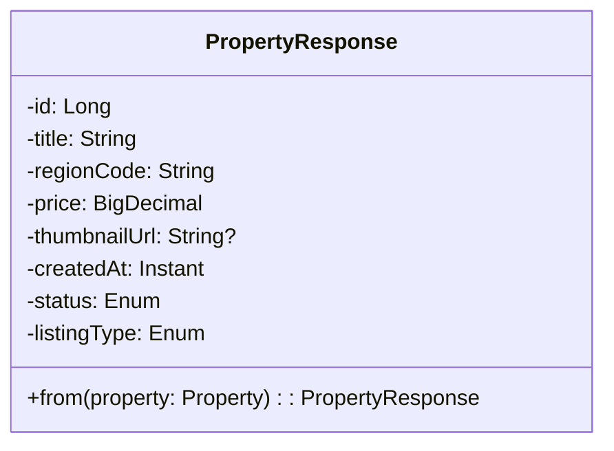
## 1.1. class description
목록 화면용 매물 요약 정보를 담는 클래스이다.

## 1.2. attribution 구분

### 1.2.1. id
* **name**: id
* **type**: Long
* **visibility**: private
* **description**: 매물 식별자이다.

### 1.2.2. title
* **name**: title
* **type**: String
* **visibility**: private
* **description**: 매물 제목이다.

### 1.2.3. regionCode
* **name**: regionCode
* **type**: String
* **visibility**: private
* **description**: 행정 구역 코드이다.

### 1.2.4. price
* **name**: price
* **type**: BigDecimal
* **visibility**: private
* **description**: 대표 가격이다.

### 1.2.5. thumbnailUrl
* **name**: thumbnailUrl
* **type**: String?
* **visibility**: private
* **description**: 썸네일 URL이다.

### 1.2.6. createdAt
* **name**: createdAt
* **type**: Instant
* **visibility**: private
* **description**: 생성일시이다.

### 1.2.7. status
* **name**: status
* **type**: Enum
* **visibility**: private
* **description**: 상태 값이다.

### 1.2.8. listingType
* **name**: listingType
* **type**: Enum
* **visibility**: private
* **description**: 등록 유형이다.

## 1.3. Operations 구분

### 1.3.1. from
* **name**: from
* **type**: static builder
* **visibility**: public
* **description**: 엔티티/조인 결과에서 DTO로 변환한다.


# 17. PropertyWithOffersDto

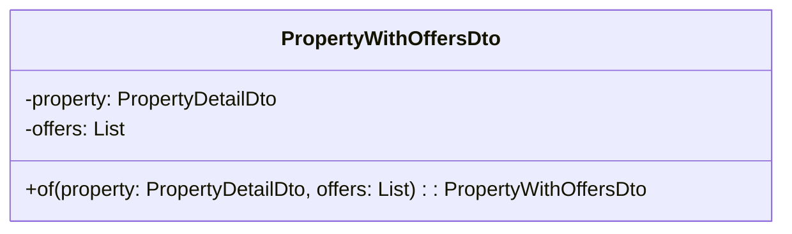
## 1.1. class description
상세 화면에서 매물 + 다수 오퍼를 함께 반환하는 클래스이다.

## 1.2. attribution 구분

### 1.2.1. property
* **name**: property
* **type**: PropertyDetailDto
* **visibility**: private
* **description**: 매물 상세 DTO이다.

### 1.2.2. offers
* **name**: offers
* **type**: List<PropertyOfferDto>
* **visibility**: private
* **description**: 오퍼 DTO 목록이다.

## 1.3. Operations 구분

### 1.3.1. of
* **name**: of
* **type**: static factory
* **visibility**: public
* **description**: 편의 생성기를 제공한다.


# 18. UpdateOfferRequest

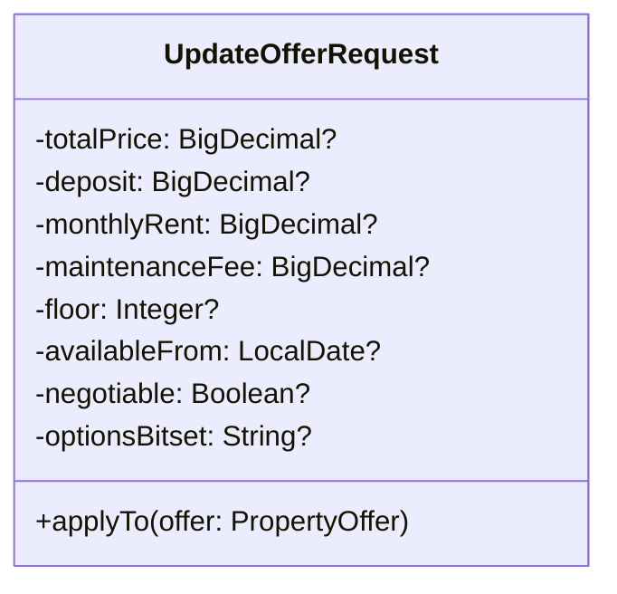
## 1.1. class description
오퍼 수정에 필요한 입력 값을 담는 클래스이다.

## 1.2. attribution 구분

### 1.2.1. totalPrice
* **name**: totalPrice
* **type**: BigDecimal?
* **visibility**: private
* **description**: 매매가(선택)이다.

### 1.2.2. deposit
* **name**: deposit
* **type**: BigDecimal?
* **visibility**: private
* **description**: 보증금(선택)이다.

### 1.2.3. monthlyRent
* **name**: monthlyRent
* **type**: BigDecimal?
* **visibility**: private
* **description**: 월세(선택)이다.

### 1.2.4. maintenanceFee
* **name**: maintenanceFee
* **type**: BigDecimal?
* **visibility**: private
* **description**: 관리비(선택)이다.

### 1.2.5. floor
* **name**: floor
* **type**: Integer?
* **visibility**: private
* **description**: 층수(선택)이다.

### 1.2.6. availableFrom
* **name**: availableFrom
* **type**: LocalDate?
* **visibility**: private
* **description**: 입주 가능일(선택)이다.

### 1.2.7. negotiable
* **name**: negotiable
* **type**: Boolean?
* **visibility**: private
* **description**: 협상 가능 여부(선택)이다.

### 1.2.8. optionsBitset
* **name**: optionsBitset
* **type**: String?
* **visibility**: private
* **description**: 옵션 비트마스크(선택)이다.

## 1.3. Operations 구분

### 1.3.1. applyTo
* **name**: applyTo
* **type**: void
* **visibility**: public
* **description**: 전달된 엔티티에 변경 사항을 반영한다.


# 19. SearchRequest

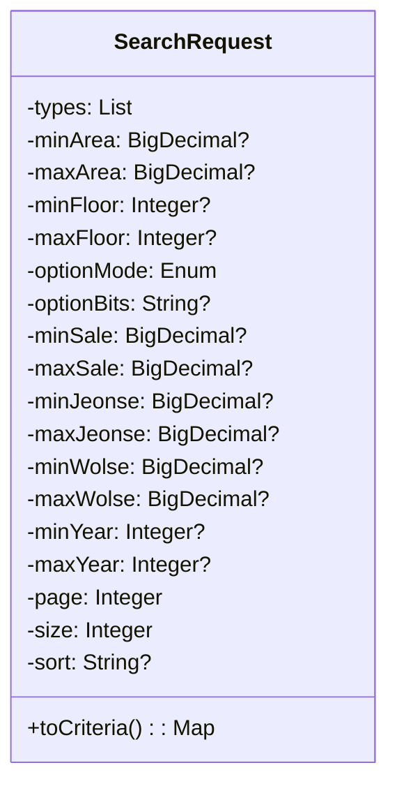
## 1.1. class description
다중 조건 검색을 위한 요청 바디를 담는 클래스이다.

## 1.2. attribution 구분

### 1.2.1. types
* **name**: types
* **type**: List<Enum>
* **visibility**: private
* **description**: 오퍼 타입 목록이다.

### 1.2.2. minArea
* **name**: minArea
* **type**: BigDecimal?
* **visibility**: private
* **description**: 면적 최소값이다.

### 1.2.3. maxArea
* **name**: maxArea
* **type**: BigDecimal?
* **visibility**: private
* **description**: 면적 최대값이다.

### 1.2.4. minFloor
* **name**: minFloor
* **type**: Integer?
* **visibility**: private
* **description**: 층수 최소값이다.

### 1.2.5. maxFloor
* **name**: maxFloor
* **type**: Integer?
* **visibility**: private
* **description**: 층수 최대값이다.

### 1.2.6. optionMode
* **name**: optionMode
* **type**: Enum
* **visibility**: private
* **description**: 옵션 비트마스크 매칭 모드이다.

### 1.2.7. optionBits
* **name**: optionBits
* **type**: String?
* **visibility**: private
* **description**: 옵션 비트마스크 문자열이다.

### 1.2.8. minSale/maxSale/minJeonse/maxJeonse/minWolse/maxWolse
* **name**: minSale/maxSale/minJeonse/maxJeonse/minWolse/maxWolse
* **type**: BigDecimal?×6
* **visibility**: private
* **description**: 거래유형별 가격 범위 필터이다.

### 1.2.9. minYear
* **name**: minYear
* **type**: Integer?
* **visibility**: private
* **description**: 준공년도 최소값이다.

### 1.2.10. maxYear
* **name**: maxYear
* **type**: Integer?
* **visibility**: private
* **description**: 준공년도 최대값이다.

### 1.2.11. page
* **name**: page
* **type**: Integer
* **visibility**: private
* **description**: 페이지 번호이다.

### 1.2.12. size
* **name**: size
* **type**: Integer
* **visibility**: private
* **description**: 페이지 크기이다.

### 1.2.13. sort
* **name**: sort
* **type**: String?
* **visibility**: private
* **description**: 정렬 스펙이다.

## 1.3. Operations 구분

### 1.3.1. toCriteria
* **name**: toCriteria
* **type**: Map<String, Object>
* **visibility**: public
* **description**: 검색 레포지토리에 전달할 파라미터 맵으로 변환한다.


# 20. FavoriteJpaRepository

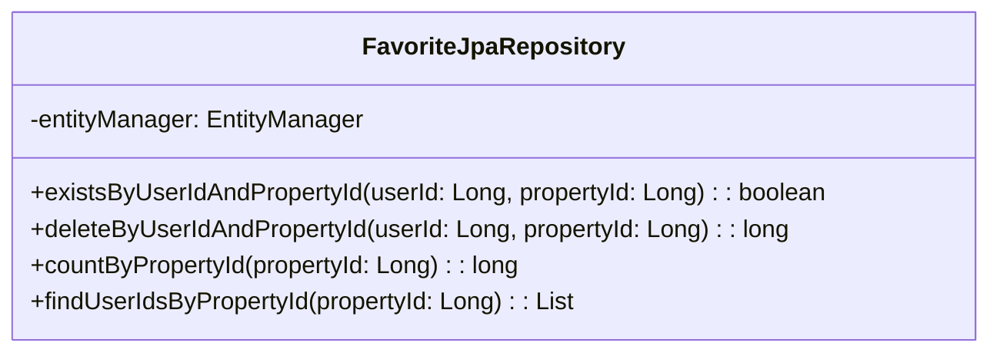
## 1.1. class description
찜(Favorite) 엔티티 JPA 접근을 제공하는 클래스이다.

## 1.2. attribution 구분

### 1.2.1. entityManager
* **name**: entityManager
* **type**: EntityManager
* **visibility**: protected
* **description**: 기본 JPA 동작에 사용한다.

## 1.3. Operations 구분

### 1.3.1. existsByUserIdAndPropertyId
* **name**: existsByUserIdAndPropertyId
* **type**: boolean
* **visibility**: public
* **description**: 특정 유저-매물 조합의 찜 존재 여부를 확인한다.

### 1.3.2. deleteByUserIdAndPropertyId
* **name**: deleteByUserIdAndPropertyId
* **type**: long
* **visibility**: public
* **description**: 찜을 삭제한다.

### 1.3.3. countByPropertyId
* **name**: countByPropertyId
* **type**: long
* **visibility**: public
* **description**: 매물의 총 찜 수를 반환한다.

### 1.3.4. findUserIdsByPropertyId
* **name**: findUserIdsByPropertyId
* **type**: List<Long>
* **visibility**: public
* **description**: 해당 매물을 찜한 사용자 ID 목록을 반환한다.


# 21. PropertyFavoriteRepository

```mermaid
classDiagram
  class PropertyFavoriteRepository {
    -jdbcTemplate: NamedParameterJdbcTemplate
    +findFavorites(userId: Long, limit: int, offset: int): List<PropertyFavoriteDto>
  }
```
## 1.1. class description
네이티브 SQL/템플릿으로 찜 목록 조회를 제공하는 클래스이다.

## 1.2. attribution 구분

### 1.2.1. jdbcTemplate
* **name**: jdbcTemplate
* **type**: NamedParameterJdbcTemplate
* **visibility**: private
* **description**: 네이티브 조인/페이지네이션 처리를 수행한다.

## 1.3. Operations 구분

### 1.3.1. findFavorites
* **name**: findFavorites
* **type**: List<PropertyFavoriteDto>
* **visibility**: public
* **description**: 썸네일 1장을 포함하여 내 찜 목록을 조회한다.


# 22. PropertyOfferRepository

```mermaid
classDiagram
  class PropertyOfferRepository {
    +jpaRepository: SpringData
    +findByPropertyId(propertyId: Long): List<PropertyOffer>
    +findActiveJeonseTop1ByPropertyIdOrderByUpdatedAtDesc(propertyId: Long): Optional<PropertyOffer>
  }
```
## 1.1. class description
오퍼 엔티티 JPA 접근을 제공하는 클래스이다.

## 1.2. attribution 구분

### 1.2.1. jpaRepository
* **name**: jpaRepository
* **type**: Spring Data Infrastructure
* **visibility**: public
* **description**: 표준 CRUD/조회 기능을 제공한다.

## 1.3. Operations 구분

### 1.3.1. findByPropertyId
* **name**: findByPropertyId
* **type**: List<PropertyOffer>
* **visibility**: public
* **description**: 특정 매물의 모든 오퍼를 조회한다.

### 1.3.2. findActiveJeonseTop1ByPropertyIdOrderByUpdatedAtDesc
* **name**: findActiveJeonseTop1ByPropertyIdOrderByUpdatedAtDesc
* **type**: Optional<PropertyOffer>
* **visibility**: public
* **description**: 활성 전세 오퍼 최신 1건을 조회한다.


# 23. PropertyRepository

```mermaid
classDiagram
  class PropertyRepository {
    -entityManager: EntityManager
    +findInBounds(minX: double, minY: double, maxX: double, maxY: double, status: Status?, minPrice: BigDecimal?, maxPrice: BigDecimal?): List<Property>
    +markAsSoldIfBrokerAuthorized(propertyId: Long, brokerId: Long): int
  }
```
## 1.1. class description
매물 엔티티 JPA 접근을 제공하는 클래스이다.

## 1.2. attribution 구분

### 1.2.1. entityManager
* **name**: entityManager
* **type**: EntityManager
* **visibility**: protected
* **description**: JPQL 업데이트 및 조회에 사용한다.

## 1.3. Operations 구분

### 1.3.1. findInBounds
* **name**: findInBounds
* **type**: List<Property>
* **visibility**: public
* **description**: 지도 경계/상태/가격으로 필터링된 매물을 조회한다.

### 1.3.2. markAsSoldIfBrokerAuthorized
* **name**: markAsSoldIfBrokerAuthorized
* **type**: int
* **visibility**: public
* **description**: 브로커 권한/상태 조건을 만족할 때 거래 완료로 업데이트한다.


# 24. PropertySearchRepository

```mermaid
classDiagram
  class PropertySearchRepository {
    -jdbcTemplate: NamedParameterJdbcTemplate
    +search(params: Map<String,Object>): List<PropertyResponse>
  }
```
## 1.1. class description
NamedParameterJdbcTemplate로 복합 검색을 수행하는 클래스이다.

## 1.2. attribution 구분

### 1.2.1. jdbcTemplate
* **name**: jdbcTemplate
* **type**: NamedParameterJdbcTemplate
* **visibility**: private
* **description**: SQL 실행과 매핑을 담당한다.

## 1.3. Operations 구분

### 1.3.1. search
* **name**: search
* **type**: List<PropertyResponse>
* **visibility**: public
* **description**: SearchRequest를 해석해 필터링/페이징된 결과를 반환한다.


# 25. PropertywoRepository

```mermaid
classDiagram
  class PropertywoRepository {
    +jpaRepository: SpringData
    +findAllByStatusOrderByCreatedAtDesc(status: Status, pageable: Pageable): Page<Property>
    +findAllByOwnerId(ownerId: Long, pageable: Pageable): Page<Property>
  }
```
## 1.1. class description
매물 목록 페이지네이션 파생 쿼리를 제공하는 클래스이다.

## 1.2. attribution 구분

### 1.2.1. jpaRepository
* **name**: jpaRepository
* **type**: Spring Data Infrastructure
* **visibility**: public
* **description**: 표준 CRUD/조회 기능을 제공한다.

## 1.3. Operations 구분

### 1.3.1. findAllByStatusOrderByCreatedAtDesc
* **name**: findAllByStatusOrderByCreatedAtDesc
* **type**: Page<Property>
* **visibility**: public
* **description**: 상태별 최신순 목록을 반환한다.

### 1.3.2. findAllByOwnerId
* **name**: findAllByOwnerId
* **type**: Page<Property>
* **visibility**: public
* **description**: 내 매물만 페이지네이션으로 조회한다.


# 26. JeonseRatioService

```mermaid
classDiagram
  class JeonseRatioService {
    -propertyRepository: PropertyRepository
    -propertyOfferRepository: PropertyOfferRepository
    +calculate(propertyId: Long, offerId: Long?, clientSalePrice: BigDecimal?): JeonseRatioResponse
  }
```
## 1.1. class description
전세가율을 계산하는 클래스이다.

## 1.2. attribution 구분

### 1.2.1. propertyRepository
* **name**: propertyRepository
* **type**: PropertyRepository
* **visibility**: private
* **description**: 매물 정보를 조회한다.

### 1.2.2. propertyOfferRepository
* **name**: propertyOfferRepository
* **type**: PropertyOfferRepository
* **visibility**: private
* **description**: 오퍼 정보를 조회한다.

## 1.3. Operations 구분

### 1.3.1. calculate
* **name**: calculate
* **type**: JeonseRatioResponse
* **visibility**: public
* **description**: 보증금/매매가로 전세가율을 계산한다(소수 둘째 자리 반올림).


# 27. PropertyFavoriteService

```mermaid
classDiagram
  class PropertyFavoriteService {
    -favoriteJpaRepository: FavoriteJpaRepository
    -propertyFavoriteRepository: PropertyFavoriteRepository
    +toggle(userId: Long, propertyId: Long): boolean
    +delete(userId: Long, propertyId: Long)
    +list(userId: Long, limit: int, offset: int): List<PropertyFavoriteDto>
    +exists(userId: Long, propertyId: Long): boolean
    +count(propertyId: Long): long
  }
```
## 1.1. class description
찜 토글/삭제/조회 로직을 제공하는 클래스이다.

## 1.2. attribution 구분

### 1.2.1. favoriteJpaRepository
* **name**: favoriteJpaRepository
* **type**: FavoriteJpaRepository
* **visibility**: private
* **description**: 단순 존재/삭제/카운트 조회에 사용한다.

### 1.2.2. propertyFavoriteRepository
* **name**: propertyFavoriteRepository
* **type**: PropertyFavoriteRepository
* **visibility**: private
* **description**: 조인 기반 찜 목록 조회에 사용한다.

## 1.3. Operations 구분

### 1.3.1. toggle
* **name**: toggle
* **type**: boolean
* **visibility**: public
* **description**: 찜을 토글하고 현재 상태를 반환한다.

### 1.3.2. delete
* **name**: delete
* **type**: void
* **visibility**: public
* **description**: 찜을 명시적으로 해제한다.

### 1.3.3. list
* **name**: list
* **type**: List<PropertyFavoriteDto>
* **visibility**: public
* **description**: 내 찜 목록을 조회한다.

### 1.3.4. exists
* **name**: exists
* **type**: boolean
* **visibility**: public
* **description**: 특정 유저-매물 찜 존재 여부를 확인한다.

### 1.3.5. count
* **name**: count
* **type**: long
* **visibility**: public
* **description**: 해당 매물의 찜 수를 반환한다.


# 28. PropertyOfferService

```mermaid
classDiagram
  class PropertyOfferService {
    -propertyOfferRepository: PropertyOfferRepository
    +toggleActive(offerId: Long, userId: Long): PropertyOfferResponse
    +update(offerId: Long, request: UpdateOfferRequest, userId: Long): PropertyOfferResponse
    +delete(offerId: Long, userId: Long)
  }
```
## 1.1. class description
오퍼의 권한 검증 및 상태 변경을 수행하는 클래스이다.

## 1.2. attribution 구분

### 1.2.1. propertyOfferRepository
* **name**: propertyOfferRepository
* **type**: PropertyOfferRepository
* **visibility**: private
* **description**: 오퍼 CRUD에 사용한다.

## 1.3. Operations 구분

### 1.3.1. toggleActive
* **name**: toggleActive
* **type**: PropertyOfferResponse
* **visibility**: public
* **description**: 오퍼 활성/비활성을 토글한다.

### 1.3.2. update
* **name**: update
* **type**: PropertyOfferResponse
* **visibility**: public
* **description**: 오퍼 내용을 수정한다.

### 1.3.3. delete
* **name**: delete
* **type**: void
* **visibility**: public
* **description**: 삭제 정책을 검증한 뒤 오퍼를 삭제한다.


# 29. PropertyQueryService

```mermaid
classDiagram
  class PropertyQueryService {
    -propertywoRepository: PropertywoRepository
    -propertyOfferRepository: PropertyOfferRepository
    +listAll(page: int, size: int, sort: String?): List<PropertyResponse>
    +listMine(userId: Long, page: int, size: int, sort: String?): List<PropertyResponse>
    +listOthers(userId: Long, page: int, size: int, sort: String?): List<PropertyResponse>
    +getOneWithOffers(id: Long): PropertyWithOffersDto
  }
```
## 1.1. class description
목록/상세 조회를 담당하는 클래스이다.

## 1.2. attribution 구분

### 1.2.1. propertywoRepository
* **name**: propertywoRepository
* **type**: PropertywoRepository
* **visibility**: private
* **description**: 페이지네이션 목록 조회에 사용한다.

### 1.2.2. propertyOfferRepository
* **name**: propertyOfferRepository
* **type**: PropertyOfferRepository
* **visibility**: private
* **description**: 오퍼 묶음 조회에 사용한다.

## 1.3. Operations 구분

### 1.3.1. listAll
* **name**: listAll
* **type**: List<PropertyResponse>
* **visibility**: public
* **description**: 전체 목록을 조회한다.

### 1.3.2. listMine
* **name**: listMine
* **type**: List<PropertyResponse>
* **visibility**: public
* **description**: 내가 등록한 매물 목록을 조회한다.

### 1.3.3. listOthers
* **name**: listOthers
* **type**: List<PropertyResponse>
* **visibility**: public
* **description**: 타인이 등록한 매물 목록을 조회한다.

### 1.3.4. getOneWithOffers
* **name**: getOneWithOffers
* **type**: PropertyWithOffersDto
* **visibility**: public
* **description**: 단건 상세와 오퍼 리스트를 함께 반환한다.


# 30. propertyservice

```mermaid
classDiagram
  class propertyservice {
    -propertyRepository: PropertyRepository
    -propertyOfferRepository: PropertyOfferRepository
    +getMarkers(filter: PropertyFilterDto): List<PropertyMarkerDto>
    +getDetail(id: Long): PropertyDetailDto
    +completeDeal(request: CompleteDealRequest, brokerId: Long)
  }
```
## 1.1. class description
지도 마커 조회, 단건 상세, 브로커 거래 완료를 처리하는 클래스이다.

## 1.2. attribution 구분

### 1.2.1. propertyRepository
* **name**: propertyRepository
* **type**: PropertyRepository
* **visibility**: private
* **description**: 매물 조회 및 업데이트에 사용한다.

### 1.2.2. propertyOfferRepository
* **name**: propertyOfferRepository
* **type**: PropertyOfferRepository
* **visibility**: private
* **description**: 오퍼 조회에 사용한다.

## 1.3. Operations 구분

### 1.3.1. getMarkers
* **name**: getMarkers
* **type**: List<PropertyMarkerDto>
* **visibility**: public
* **description**: lat=Y/lng=X 규칙으로 지도 마커를 생성한다.

### 1.3.2. getDetail
* **name**: getDetail
* **type**: PropertyDetailDto
* **visibility**: public
* **description**: 단건 상세 데이터를 생성한다.

### 1.3.3. completeDeal
* **name**: completeDeal
* **type**: void
* **visibility**: public
* **description**: 브로커 권한 검증 후 거래 완료를 반영하고 이벤트를 발행한다.


# 31. Favorite

```mermaid
classDiagram
  class BaseEntity {
    +createdAt: Instant
    +updatedAt: Instant
  }
  class Favorite {
    -id: Long
    -userId: Long
    -propertyId: Long
    +@PrePersist setCreatedAt()
  }
  BaseEntity <|-- Favorite
```
## 1.1. class description
유저와 매물 간의 찜 관계를 나타내는 클래스이다.

## 1.2. attribution 구분

### 1.2.1. id
* **name**: id
* **type**: Long
* **visibility**: private
* **description**: PK 식별자이다.

### 1.2.2. userId
* **name**: userId
* **type**: Long
* **visibility**: private
* **description**: 사용자 식별자이다.

### 1.2.3. propertyId
* **name**: propertyId
* **type**: Long
* **visibility**: private
* **description**: 매물 식별자이다.

### 1.2.4. createdAt
* **name**: createdAt
* **type**: Instant
* **visibility**: private
* **description**: 생성일시는 상속.

## 1.3. Operations 구분

### 1.3.1. @PrePersist setCreatedAt
* **name**: @PrePersist setCreatedAt
* **type**: void
* **visibility**: private
* **description**: 저장 시 생성일을 기록한다.


# 32. PriceAnomaly

```mermaid
classDiagram
  class BaseEntity {
    +createdAt: Instant
    +updatedAt: Instant
  }
  class PriceAnomaly {
    -id: Long
    -property: Property
    -score: BigDecimal
    -reason: String
    +@PrePersist setCreatedAt()
  }
  BaseEntity <|-- PriceAnomaly
```
## 1.1. class description
매물의 가격 이상치 정보를 기록하는 클래스이다.

## 1.2. attribution 구분

### 1.2.1. id
* **name**: id
* **type**: Long
* **visibility**: private
* **description**: PK 식별자이다.

### 1.2.2. property
* **name**: property
* **type**: Property
* **visibility**: private
* **description**: 대상 매물 레퍼런스이다.

### 1.2.3. score
* **name**: score
* **type**: BigDecimal
* **visibility**: private
* **description**: 이상치 점수이다.

### 1.2.4. reason
* **name**: reason
* **type**: String
* **visibility**: private
* **description**: 이상치 사유이다.

### 1.2.5. createdAt
* **name**: createdAt
* **type**: Instant
* **visibility**: private
* **description**: 생성일시는 상속.

## 1.3. Operations 구분

### 1.3.1. @PrePersist setCreatedAt
* **name**: @PrePersist setCreatedAt
* **type**: void
* **visibility**: private
* **description**: 저장 시 생성일을 기록한다.


# 33. Property

```mermaid
classDiagram
  class BaseEntity {
    +createdAt: Instant
    +updatedAt: Instant
  }
  class Property {
    -id: Long
    -title: String
    -address: String
    -regionCode: String
    -locationX: Double
    -locationY: Double
    -areaM2: BigDecimal
    -price: BigDecimal
    -status: Enum
    -listingType: Enum
    -buildingYear: Integer
    -ownerId: Long?
    -brokerId: Long?
    -anomalyAlert: Boolean
    +@PrePersist setCreatedAt()
    +@PreUpdate setUpdatedAt()
  }
  BaseEntity <|-- Property
```
## 1.1. class description
매물의 기본 정보를 나타내는 클래스이다.

## 1.2. attribution 구분

### 1.2.1. id
* **name**: id
* **type**: Long
* **visibility**: private
* **description**: PK 식별자이다.

### 1.2.2. title
* **name**: title
* **type**: String
* **visibility**: private
* **description**: 매물 제목이다.

### 1.2.3. address
* **name**: address
* **type**: String
* **visibility**: private
* **description**: 주소이다.

### 1.2.4. regionCode
* **name**: regionCode
* **type**: String
* **visibility**: private
* **description**: 행정 구역 코드이다.

### 1.2.5. locationX
* **name**: locationX
* **type**: Double
* **visibility**: private
* **description**: 경도 값이다.

### 1.2.6. locationY
* **name**: locationY
* **type**: Double
* **visibility**: private
* **description**: 위도 값이다.

### 1.2.7. areaM2
* **name**: areaM2
* **type**: BigDecimal
* **visibility**: private
* **description**: 전용면적(m²)이다.

### 1.2.8. price
* **name**: price
* **type**: BigDecimal
* **visibility**: private
* **description**: 대표 가격이다.

### 1.2.9. status
* **name**: status
* **type**: Enum
* **visibility**: private
* **description**: 상태 값이다.

### 1.2.10. listingType
* **name**: listingType
* **type**: Enum
* **visibility**: private
* **description**: 등록 유형이다.

### 1.2.11. buildingYear
* **name**: buildingYear
* **type**: Integer
* **visibility**: private
* **description**: 준공년도이다.

### 1.2.12. ownerId
* **name**: ownerId
* **type**: Long?
* **visibility**: private
* **description**: 소유자 식별자이다.

### 1.2.13. brokerId
* **name**: brokerId
* **type**: Long?
* **visibility**: private
* **description**: 브로커 식별자이다.

### 1.2.14. anomalyAlert
* **name**: anomalyAlert
* **type**: Boolean
* **visibility**: private
* **description**: 이상치 경고 여부이다.

### 1.2.15. createdAt/updatedAt
* **name**: createdAt/updatedAt
* **type**: Instant
* **visibility**: private
* **description**: 상속된 생성/갱신일시이다.

## 1.3. Operations 구분

### 1.3.1. @PrePersist setCreatedAt
* **name**: @PrePersist setCreatedAt
* **type**: void
* **visibility**: private
* **description**: 저장 시 생성일을 기록한다.

### 1.3.2. @PreUpdate setUpdatedAt
* **name**: @PreUpdate setUpdatedAt
* **type**: void
* **visibility**: private
* **description**: 수정 시 갱신일을 기록한다.


# 34. PropertyImage

```mermaid
classDiagram
  class BaseEntity {
    +createdAt: Instant
    +updatedAt: Instant
  }
  class PropertyImage {
    -id: Long
    -property: Property
    -imageUrl: String
    -sortOrder: Integer
    +@PrePersist setCreatedAt()
  }
  BaseEntity <|-- PropertyImage
```
## 1.1. class description
매물의 이미지 정보를 나타내는 클래스이다.

## 1.2. attribution 구분

### 1.2.1. id
* **name**: id
* **type**: Long
* **visibility**: private
* **description**: PK 식별자이다.

### 1.2.2. property
* **name**: property
* **type**: Property
* **visibility**: private
* **description**: 소속 매물이다.

### 1.2.3. imageUrl
* **name**: imageUrl
* **type**: String
* **visibility**: private
* **description**: 이미지 URL이다.

### 1.2.4. sortOrder
* **name**: sortOrder
* **type**: Integer
* **visibility**: private
* **description**: 정렬 순서이다.

### 1.2.5. createdAt
* **name**: createdAt
* **type**: Instant
* **visibility**: private
* **description**: 생성일시는 상속.

## 1.3. Operations 구분

### 1.3.1. @PrePersist setCreatedAt
* **name**: @PrePersist setCreatedAt
* **type**: void
* **visibility**: private
* **description**: 저장 시 생성일을 기록한다.


# 35. PropertyOffer

```mermaid
classDiagram
  class BaseEntity {
    +createdAt: Instant
    +updatedAt: Instant
  }
  class PropertyOffer {
    -id: Long
    -property: Property
    -type: Enum
    -houseType: Enum
    -totalPrice: BigDecimal?
    -deposit: BigDecimal?
    -monthlyRent: BigDecimal?
    -maintenanceFee: BigDecimal?
    -floor: Integer?
    -availableFrom: LocalDate?
    -negotiable: Boolean
    -isActive: Boolean
    -optionsBitset: String?
    +@PrePersist setCreatedAt()
    +@PreUpdate setUpdatedAt()
  }
  BaseEntity <|-- PropertyOffer
```
## 1.1. class description
매물의 판매/전세/월세 등 거래 제안을 나타내는 클래스이다.

## 1.2. attribution 구분

### 1.2.1. id
* **name**: id
* **type**: Long
* **visibility**: private
* **description**: PK 식별자이다.

### 1.2.2. property
* **name**: property
* **type**: Property
* **visibility**: private
* **description**: 대상 매물이다.

### 1.2.3. type
* **name**: type
* **type**: Enum
* **visibility**: private
* **description**: 거래 유형이다.

### 1.2.4. houseType
* **name**: houseType
* **type**: Enum
* **visibility**: private
* **description**: 주택 유형이다.

### 1.2.5. totalPrice
* **name**: totalPrice
* **type**: BigDecimal?
* **visibility**: private
* **description**: 매매가이다.

### 1.2.6. deposit
* **name**: deposit
* **type**: BigDecimal?
* **visibility**: private
* **description**: 보증금이다.

### 1.2.7. monthlyRent
* **name**: monthlyRent
* **type**: BigDecimal?
* **visibility**: private
* **description**: 월세이다.

### 1.2.8. maintenanceFee
* **name**: maintenanceFee
* **type**: BigDecimal?
* **visibility**: private
* **description**: 관리비이다.

### 1.2.9. floor
* **name**: floor
* **type**: Integer?
* **visibility**: private
* **description**: 층수이다.

### 1.2.10. availableFrom
* **name**: availableFrom
* **type**: LocalDate?
* **visibility**: private
* **description**: 입주 가능일이다.

### 1.2.11. negotiable
* **name**: negotiable
* **type**: Boolean
* **visibility**: private
* **description**: 협상 가능 여부이다.

### 1.2.12. isActive
* **name**: isActive
* **type**: Boolean
* **visibility**: private
* **description**: 활성 여부이다.

### 1.2.13. optionsBitset
* **name**: optionsBitset
* **type**: String?
* **visibility**: private
* **description**: 옵션 비트마스크이다.

### 1.2.14. createdAt/updatedAt
* **name**: createdAt/updatedAt
* **type**: Instant
* **visibility**: private
* **description**: 상속된 생성/갱신일시이다.

## 1.3. Operations 구분

### 1.3.1. @PrePersist setCreatedAt
* **name**: @PrePersist setCreatedAt
* **type**: void
* **visibility**: private
* **description**: 저장 시 생성일을 기록한다.

### 1.3.2. @PreUpdate setUpdatedAt
* **name**: @PreUpdate setUpdatedAt
* **type**: void
* **visibility**: private
* **description**: 수정 시 갱신일을 기록한다.


# 36. PropertyReview

```mermaid
classDiagram
  class BaseEntity {
    +createdAt: Instant
    +updatedAt: Instant
  }
  class PropertyReview {
    -id: Long
    -property: Property
    -userId: Long
    -rating: Integer
    -comment: String
    +@PrePersist setCreatedAt()
    +@PreUpdate setUpdatedAt()
  }
  BaseEntity <|-- PropertyReview
```
## 1.1. class description
사용자가 매물에 남긴 리뷰를 나타내는 클래스이다.

## 1.2. attribution 구분

### 1.2.1. id
* **name**: id
* **type**: Long
* **visibility**: private
* **description**: PK 식별자이다.

### 1.2.2. property
* **name**: property
* **type**: Property
* **visibility**: private
* **description**: 리뷰 대상 매물이다.

### 1.2.3. userId
* **name**: userId
* **type**: Long
* **visibility**: private
* **description**: 작성자 식별자이다.

### 1.2.4. rating
* **name**: rating
* **type**: Integer
* **visibility**: private
* **description**: 평점(1~5)이다.

### 1.2.5. comment
* **name**: comment
* **type**: String
* **visibility**: private
* **description**: 리뷰 코멘트이다.

### 1.2.6. createdAt/updatedAt
* **name**: createdAt/updatedAt
* **type**: Instant
* **visibility**: private
* **description**: 상속된 생성/갱신일시이다.

## 1.3. Operations 구분

### 1.3.1. @PrePersist setCreatedAt
* **name**: @PrePersist setCreatedAt
* **type**: void
* **visibility**: private
* **description**: 저장 시 생성일을 기록한다.

### 1.3.2. @PreUpdate setUpdatedAt
* **name**: @PreUpdate setUpdatedAt
* **type**: void
* **visibility**: private
* **description**: 수정 시 갱신일을 기록한다.
