# User 클래스

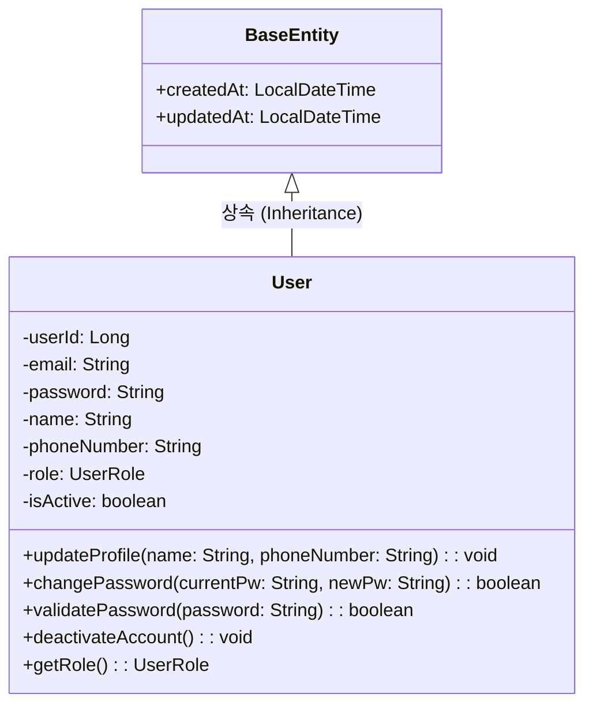

## 1.1. class description
일반 사용자의 기본 정보와 인증 정보를 관리하는 클래스이다. 회원가입, 로그인, 프로필 수정 등 사용자와 관련된 핵심 정보를 담고 있으며, 모든 사용자 유형의 기본이 되는 클래스이다.

## 1.2. attribution 구분

### 1.2.1. userId
* **name**: userId
* **type**: Long
* **visibility**: private
* **description**: 사용자를 고유하게 식별하기 위한 primary key로, 데이터베이스에서 자동 생성되는 사용자의 고유 ID이다.

### 1.2.2. email
* **name**: email
* **type**: String
* **visibility**: private
* **description**: 사용자의 이메일 주소로 로그인 ID로 사용되며, 시스템 내에서 고유해야 한다. 이메일 인증 및 알림 발송에도 사용된다.

### 1.2.3. password
* **name**: password
* **type**: String
* **visibility**: private
* **description**: BCrypt 알고리즘으로 암호화된 사용자의 비밀번호이다. 평문으로 저장되지 않으며, 보안을 위해 암호화된 형태로만 데이터베이스에 저장된다.

### 1.2.4. name
* **name**: name
* **type**: String
* **visibility**: private
* **description**: 사용자의 실명이다. 거래 시 본인 확인 및 계약서 작성에 사용되는 중요한 정보이다.

### 1.2.5. phoneNumber
* **name**: phoneNumber
* **type**: String
* **visibility**: private
* **description**: 사용자의 휴대폰 번호로, 연락처 확인 및 SMS 알림 발송에 사용된다.

### 1.2.6. role
* **name**: role
* **type**: UserRole
* **visibility**: private
* **description**: 사용자의 권한 수준을 나타내는 열거형 변수이다. GENERAL, BROKER, ADMIN 중 하나의 값을 가지며, 접근 권한 제어에 사용된다.

### 1.2.7. isActive
* **name**: isActive
* **type**: boolean
* **visibility**: private
* **description**: 사용자 계정의 활성화 상태를 나타낸다. false인 경우 로그인이 차단되며, 계정 정지나 탈퇴 시 사용된다.

### 1.2.8. createdAt
* **name**: createdAt
* **type**: LocalDateTime
* **visibility**: private
* **description**: 사용자 계정이 생성된 날짜와 시간이다. BaseEntity로부터 상속받아 자동으로 설정된다.

### 1.2.9. updatedAt
* **name**: updatedAt
* **type**: LocalDateTime
* **visibility**: private
* **description**: 사용자 정보가 마지막으로 수정된 날짜와 시간이다. BaseEntity로부터 상속받아 자동으로 업데이트된다.

## 1.3. Operations 구분

### 1.3.1. updateProfile
* **name**: updateProfile
* **type**: void
* **visibility**: public
* **description**: 사용자의 프로필 정보(이름, 전화번호 등)를 수정하는 메서드이다. 이메일과 비밀번호를 제외한 기본 정보를 업데이트한다.

### 1.3.2. changePassword
* **name**: changePassword
* **type**: boolean
* **visibility**: public
* **description**: 현재 비밀번호를 확인한 후 새로운 비밀번호로 변경하는 메서드이다. 변경 성공 시 true를 반환한다.

### 1.3.3. validatePassword
* **name**: validatePassword
* **type**: boolean
* **visibility**: public
* **description**: 입력받은 평문 비밀번호가 저장된 암호화된 비밀번호와 일치하는지 BCrypt를 통해 검증하는 메서드이다.

### 1.3.4. deactivateAccount
* **name**: deactivateAccount
* **type**: void
* **visibility**: public
* **description**: 사용자 계정을 비활성화하는 메서드이다. isActive를 false로 설정하여 로그인을 차단한다.

### 1.3.5. getRole
* **name**: getRole
* **type**: UserRole
* **visibility**: public
* **description**: 현재 사용자의 권한 수준을 반환하는 getter 메서드이다. 권한 검증 시 사용된다.

# Broker 클래스

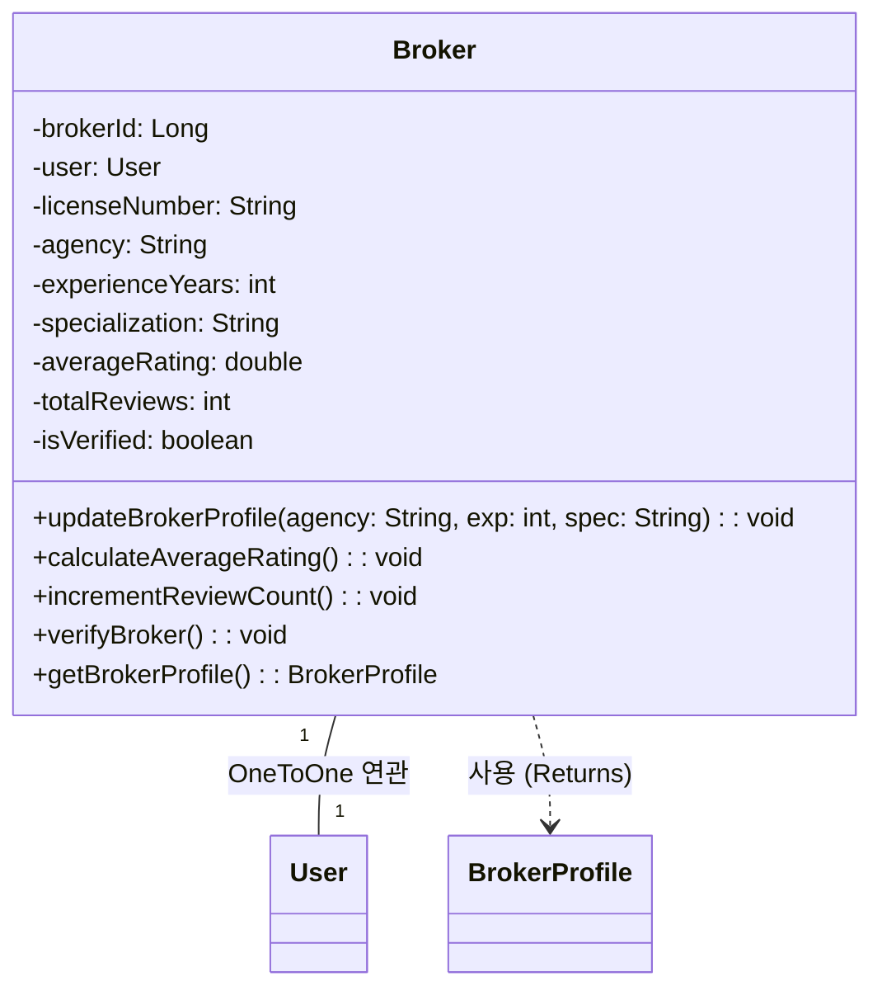

## 2.1. class description
브로커 사용자의 정보를 관리하는 클래스이다. User 클래스를 상속받아 일반 사용자의 모든 속성을 포함하며, 브로커 고유의 프로필 정보와 자격증 정보를 추가로 관리한다.

## 2.2. attribution 구분

### 2.2.1. brokerId
* **name**: brokerId
* **type**: Long
* **visibility**: private
* **description**: 브로커를 고유하게 식별하기 위한 primary key이다. userId와는 별도로 관리된다.

### 2.2.2. user
* **name**: user
* **type**: User
* **visibility**: private
* **description**: 연관된 User 객체에 대한 참조이다. OneToOne 관계로 브로커의 기본 사용자 정보를 담고 있다.

### 2.2.3. licenseNumber
* **name**: licenseNumber
* **type**: String
* **visibility**: private
* **description**: 브로커의 부동산 중개사 자격증 번호이다. 브로커 자격 검증에 필수적인 정보이다.

### 2.2.4. agency
* **name**: agency
* **type**: String
* **visibility**: private
* **description**: 브로커가 소속된 부동산 중개업소의 이름이다.

### 2.2.5. experienceYears
* **name**: experienceYears
* **type**: int
* **visibility**: private
* **description**: 브로커의 경력 연수이다. 프로필에 표시되어 신뢰도 판단 지표로 사용된다.

### 2.2.6. specialization
* **name**: specialization
* **type**: String
* **visibility**: private
* **description**: 브로커의 전문 분야이다. 예를 들어 아파트, 상가, 오피스텔 등의 특화 분야를 나타낸다.

### 2.2.7. averageRating
* **name**: averageRating
* **type**: double
* **visibility**: private
* **description**: 브로커가 받은 리뷰들의 평균 평점이다. 0.0부터 5.0까지의 값을 가진다.

### 2.2.8. totalReviews
* **name**: totalReviews
* **type**: int
* **visibility**: private
* **description**: 브로커가 받은 총 리뷰 개수이다. 신뢰도 판단에 사용된다.

### 2.2.9. isVerified
* **name**: isVerified
* **type**: boolean
* **visibility**: private
* **description**: 브로커의 자격증 및 소속 업소가 관리자에 의해 검증되었는지 여부를 나타낸다.

## 2.3. Operations 구분

### 2.3.1. updateBrokerProfile
* **name**: updateBrokerProfile
* **type**: void
* **visibility**: public
* **description**: 브로커의 프로필 정보(소속 업소, 전문 분야, 경력 등)를 수정하는 메서드이다.

### 2.3.2. calculateAverageRating
* **name**: calculateAverageRating
* **type**: void
* **visibility**: public
* **description**: 브로커가 받은 모든 리뷰의 평점을 계산하여 averageRating을 업데이트하는 메서드이다.

### 2.3.3. incrementReviewCount
* **name**: incrementReviewCount
* **type**: void
* **visibility**: public
* **description**: 새로운 리뷰가 등록될 때 totalReviews를 1 증가시키는 메서드이다.

### 2.3.4. verifyBroker
* **name**: verifyBroker
* **type**: void
* **visibility**: public
* **description**: 관리자가 브로커의 자격을 검증했을 때 isVerified를 true로 설정하는 메서드이다.

### 2.3.5. getBrokerProfile
* **name**: getBrokerProfile
* **type**: BrokerProfile
* **visibility**: public
* **description**: 브로커의 상세 프로필 정보를 BrokerProfile 객체로 반환하는 메서드이다.

# Admin 클래스

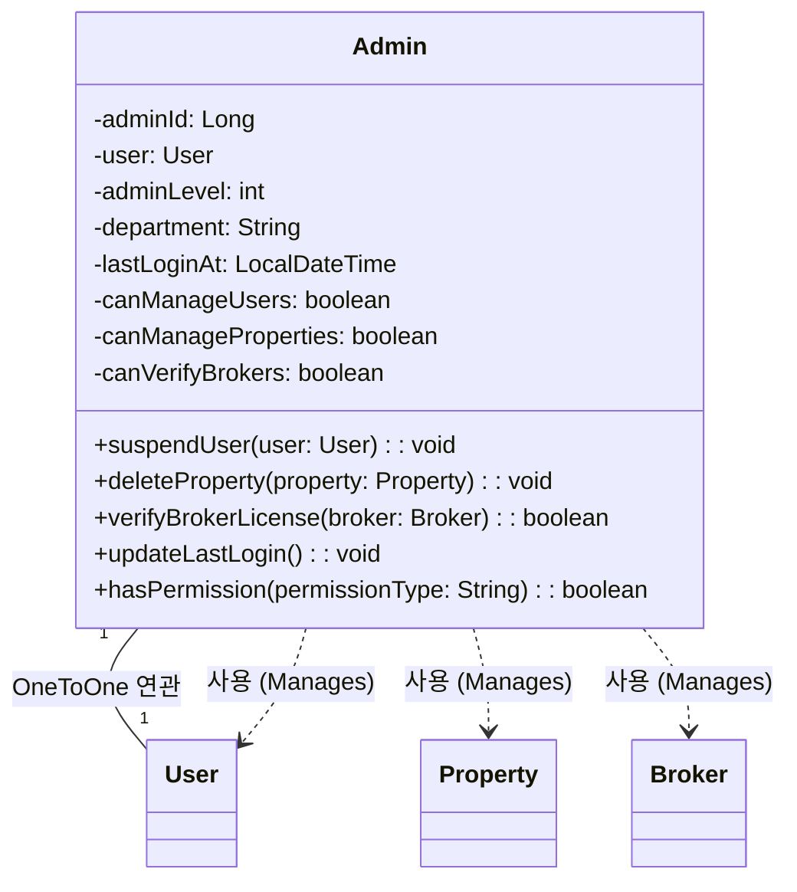

## 3.1. class description
시스템 관리자의 정보를 관리하는 클래스이다. User 클래스를 상속받아 일반 사용자의 모든 속성을 포함하며, 관리자 고유의 권한 및 활동 이력을 추가로 관리한다.

## 3.2. attribution 구분

### 3.2.1. adminId
* **name**: adminId
* **type**: Long
* **visibility**: private
* **description**: 관리자를 고유하게 식별하기 위한 primary key이다. userId와는 별도로 관리된다.

### 3.2.2. user
* **name**: user
* **type**: User
* **visibility**: private
* **description**: 연관된 User 객체에 대한 참조이다. OneToOne 관계로 관리자의 기본 사용자 정보를 담고 있다.

### 3.2.3. adminLevel
* **name**: adminLevel
* **type**: int
* **visibility**: private
* **description**: 관리자의 권한 수준을 나타낸다. 레벨이 높을수록 더 많은 관리 권한을 가진다.

### 3.2.4. department
* **name**: department
* **type**: String
* **visibility**: private
* **description**: 관리자가 소속된 부서명이다. 예를 들어 운영팀, 고객지원팀 등이 있다.

### 3.2.5. lastLoginAt
* **name**: lastLoginAt
* **type**: LocalDateTime
* **visibility**: private
* **description**: 관리자가 마지막으로 로그인한 날짜와 시간이다. 관리자 활동 모니터링에 사용된다.

### 3.2.6. canManageUsers
* **name**: canManageUsers
* **type**: boolean
* **visibility**: private
* **description**: 사용자 관리 권한이 있는지 여부를 나타낸다. true인 경우 사용자 계정을 차단하거나 삭제할 수 있다.

### 3.2.7. canManageProperties
* **name**: canManageProperties
* **type**: boolean
* **visibility**: private
* **description**: 매물 관리 권한이 있는지 여부를 나타낸다. true인 경우 부적절한 매물을 삭제하거나 수정할 수 있다.

### 3.2.8. canVerifyBrokers
* **name**: canVerifyBrokers
* **type**: boolean
* **visibility**: private
* **description**: 브로커 검증 권한이 있는지 여부를 나타낸다. true인 경우 브로커의 자격증을 검증할 수 있다.

## 3.3. Operations 구분

### 3.3.1. suspendUser
* **name**: suspendUser
* **type**: void
* **visibility**: public
* **description**: 특정 사용자의 계정을 정지시키는 메서드이다. canManageUsers 권한이 있어야 실행 가능하다.

### 3.3.2. deleteProperty
* **name**: deleteProperty
* **type**: void
* **visibility**: public
* **description**: 부적절한 매물을 삭제하는 메서드이다. canManageProperties 권한이 있어야 실행 가능하다.

### 3.3.3. verifyBrokerLicense
* **name**: verifyBrokerLicense
* **type**: boolean
* **visibility**: public
* **description**: 브로커의 자격증을 검증하는 메서드이다. 검증 성공 시 true를 반환하며, canVerifyBrokers 권한이 필요하다.

### 3.3.4. updateLastLogin
* **name**: updateLastLogin
* **type**: void
* **visibility**: public
* **description**: 관리자가 로그인할 때 lastLoginAt을 현재 시간으로 업데이트하는 메서드이다.

### 3.3.5. hasPermission
* **name**: hasPermission
* **type**: boolean
* **visibility**: public
* **description**: 특정 작업에 대한 권한이 있는지 확인하는 메서드이다. 권한 종류를 인자로 받아 해당 권한 여부를 반환한다.

# AuthService 클래스

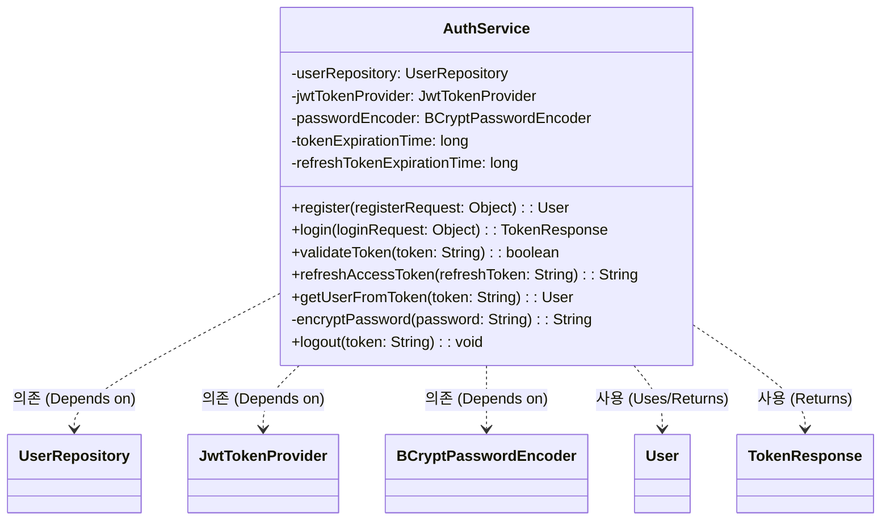

## 4.1. class description
사용자 인증 및 인가를 처리하는 서비스 클래스이다. 회원가입, 로그인, JWT 토큰 생성 및 검증, 비밀번호 암호화 등 인증과 관련된 모든 비즈니스 로직을 담당한다.

## 4.2. attribution 구분

### 4.2.1. userRepository
* **name**: userRepository
* **type**: UserRepository
* **visibility**: private
* **description**: User 엔티티에 대한 데이터베이스 접근을 담당하는 Repository이다. 사용자 정보 조회 및 저장에 사용된다.

### 4.2.2. jwtTokenProvider
* **name**: jwtTokenProvider
* **type**: JwtTokenProvider
* **visibility**: private
* **description**: JWT 토큰 생성 및 검증을 담당하는 컴포넌트이다. 액세스 토큰과 리프레시 토큰을 관리한다.

### 4.2.3. passwordEncoder
* **name**: passwordEncoder
* **type**: BCryptPasswordEncoder
* **visibility**: private
* **description**: 비밀번호를 BCrypt 알고L리즘으로 암호화하는 인코더이다. Spring Security에서 제공한다.

### 4.2.4. tokenExpirationTime
* **name**: tokenExpirationTime
* **type**: long
* **visibility**: private
* **description**: 액세스 토큰의 유효 시간이다. 밀리초 단위로 저장되며, 기본값은 1시간이다.

### 4.2.5. refreshTokenExpirationTime
* **name**: refreshTokenExpirationTime
* **type**: long
* **visibility**: private
* **description**: 리프레시 토큰의 유효 시간이다. 밀리초 단위로 저장되며, 기본값은 7일이다.

## 4.3. Operations 구분

### 4.3.1. register
* **name**: register
* **type**: User
* **visibility**: public
* **description**: 새로운 사용자를 회원가입 처리하는 메서드이다. 이메일 중복 확인, 비밀번호 암호화를 수행한 후 사용자를 데이터베이스에 저장하고 생성된 User 객체를 반환한다.

### 4.3.2. login
* **name**: login
* **type**: TokenResponse
* **visibility**: public
* **description**: 사용자 로그인을 처리하는 메서드이다. 이메일과 비밀번호를 검증한 후 액세스 토큰과 리프레시 토큰을 생성하여 TokenResponse 객체로 반환한다.

### 4.3.3. validateToken
* **name**: validateToken
* **type**: boolean
* **visibility**: public
* **description**: JWT 토큰의 유효성을 검증하는 메서드이다. 토큰의 서명, 만료 시간 등을 확인하여 유효한 토큰인지 판단한다.

### 4.3.4. refreshAccessToken
* **name**: refreshAccessToken
* **type**: String
* **visibility**: public
* **description**: 리프레시 토큰을 사용하여 새로운 액세스 토큰을 발급하는 메서드이다. 리프레시 토큰이 유효한 경우에만 새로운 액세스 토큰을 반환한다.

### 4.3.5. getUserFromToken
* **name**: getUserFromToken
* **type**: User
* **visibility**: public
* **description**: JWT 토큰에서 사용자 정보를 추출하는 메서드이다. 토큰의 클레임에서 사용자 ID를 가져와 해당 User 객체를 반환한다.

### 4.3.6. encryptPassword
* **name**: encryptPassword
* **type**: String
* **visibility**: private
* **description**: 평문 비밀번호를 BCrypt 알고리즘으로 암호화하는 메서드이다. 회원가입 및 비밀번호 변경 시 사용된다.

### 4.3.7. logout
* **name**: logout
* **type**: void
* **visibility**: public
* **description**: 사용자 로그아웃을 처리하는 메서드이다. 토큰을 무효화하거나 블랙리스트에 추가한다.

# UserRole 클래스

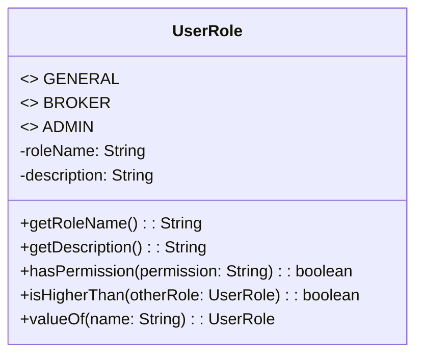

## 5.1. class description
사용자의 권한 수준을 정의하는 열거형(Enum) 클래스이다. GENERAL, BROKER, ADMIN의 세 가지 역할을 정의하며, 각 역할에 따라 시스템 접근 권한이 달라진다.

## 5.2. attribution 구분

### 5.2.1. GENERAL
* **name**: GENERAL
* **type**: UserRole
* **visibility**: public
* **description**: 일반 사용자를 나타내는 열거형 상수이다. 매물 검색, 관심 매물 등록, 브로커에게 중개 요청 등의 기본 기능을 사용할 수 있다.

### 5.2.2. BROKER
* **name**: BROKER
* **type**: UserRole
* **visibility**: public
* **description**: 브로커 사용자를 나타내는 열거형 상수이다. 일반 사용자의 모든 기능에 더해 프로필 관리, 중개 위임 수락, 고객과의 채팅 등의 기능을 사용할 수 있다.

### 5.2.3. ADMIN
* **name**: ADMIN
* **type**: UserRole
* **visibility**: public
* **description**: 관리자를 나타내는 열거형 상수이다. 시스템의 모든 기능에 접근할 수 있으며, 사용자 관리, 매물 관리, 브로커 검증 등의 관리 기능을 수행할 수 있다.

### 5.2.4. roleName
* **name**: roleName
* **type**: String
* **visibility**: private
* **description**: 역할의 이름을 문자열로 저장하는 속성이다. 예를 들어 GENERAL의 경우 "일반사용자", BROKER의 경우 "브로커"로 저장된다.

### 5.2.5. description
* **name**: description
* **type**: String
* **visibility**: private
* **description**: 각 역할에 대한 설명을 저장하는 속성이다. UI에 역할 정보를 표시할 때 사용된다.

## 5.3. Operations 구분

### 5.3.1. getRoleName
* **name**: getRoleName
* **type**: String
* **visibility**: public
* **description**: 역할의 이름을 반환하는 getter 메서드이다. UI에 사용자 권한을 표시할 때 사용된다.

### 5.3.2. getDescription
* **name**: getDescription
* **type**: String
* **visibility**: public
* **description**: 역할에 대한 설명을 반환하는 getter 메서드이다. 사용자에게 권한에 대한 안내를 제공할 때 사용된다.

### 5.3.3. hasPermission
* **name**: hasPermission
* **type**: boolean
* **visibility**: public
* **description**: 특정 기능에 대한 접근 권한이 있는지 확인하는 메서드이다. 권한 종류를 문자열로 받아 해당 역할이 그 권한을 가지고 있는지 boolean으로 반환한다.

### 5.3.4. isHigherThan
* **name**: isHigherThan
* **type**: boolean
* **visibility**: public
* **description**: 다른 역할과 비교하여 현재 역할의 권한 수준이 더 높은지 확인하는 메서드이다. 예를 들어 ADMIN이 BROKER보다 높은 권한을 가진다.

### 5.3.5. valueOf
* **name**: valueOf
* **type**: UserRole
* **visibility**: public static
* **description**: 문자열로부터 해당하는 UserRole 열거형 상수를 반환하는 정적 메서드이다. 데이터베이스에서 읽어온 문자열을 열거형으로 변환할 때 사용된다.

# 6. BrokerProfile 클래스

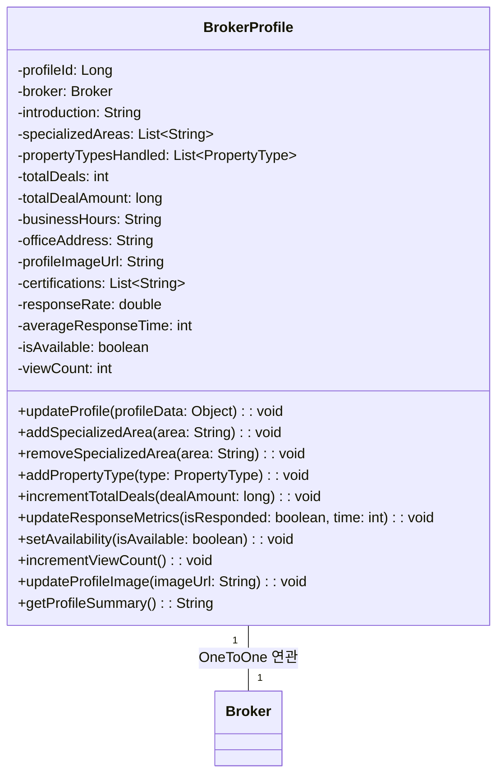

## 6.1. class description
브로커의 상세 프로필 정보를 관리하는 클래스이다. Broker 클래스와 OneToOne 관계를 맺으며, 브로커의 자기소개, 전문 지역, 거래 실적, 영업시간 등 고객에게 보여질 상세한 프로필 정보를 담고 있다. 이 클래스는 사용자가 브로커를 선택할 때 참고하는 핵심 정보를 제공한다.

## 6.2. attribution 구분

### 6.2.1. profileId
* **name**: profileId
* **type**: Long
* **visibility**: private
* **description**: 브로커 프로필을 고유하게 식별하기 위한 primary key이다. 데이터베이스에서 자동 생성되는 프로필의 고유 ID로, 각 브로커마다 하나의 프로필만 존재한다.

### 6.2.2. broker
* **name**: broker
* **type**: Broker
* **visibility**: private
* **description**: 이 프로필이 속한 브로커 객체에 대한 참조이다. OneToOne 관계로 연결되어 있으며, 브로커의 기본 정보에 접근할 때 사용된다.

### 6.2.3. introduction
* **name**: introduction
* **type**: String
* **visibility**: private
* **description**: 브로커의 자기소개 텍스트이다. 최대 1000자까지 작성할 수 있으며, 브로커의 경력, 강점, 서비스 철학 등을 자유롭게 표현한다. 고객들이 브로커의 성향을 파악하는 데 중요한 정보이다.

### 6.2.4. specializedAreas
* **name**: specializedAreas
* **type**: List\<String\>
* **visibility**: private
* **description**: 브로커가 전문적으로 다루는 지역 목록이다. 예를 들어 "강남구", "서초구", "송파구" 등이 포함될 수 있으며, 사용자가 특정 지역의 전문가를 찾을 때 필터링 기준으로 사용된다.

### 6.2.5. propertyTypesHandled
* **name**: propertyTypesHandled
* **type**: List\<PropertyType\>
* **visibility**: private
* **description**: 브로커가 주로 취급하는 매물 유형 목록이다. 아파트, 빌라, 오피스텔, 상가 등의 PropertyType 열거형 값들을 리스트로 저장하며, 각 브로커의 전문 분야를 명확히 보여준다.

### 6.2.6. totalDeals
* **name**: totalDeals
* **type**: int
* **visibility**: private
* **description**: 브로커가 성사시킨 총 거래 건수이다. 경력과 더불어 브로커의 실력을 보여주는 객관적인 지표로, 숫자가 높을수록 경험이 풍부한 브로커임을 나타낸다.

### 6.2.7. totalDealAmount
* **name**: totalDealAmount
* **type**: long
* **visibility**: private
* **description**: 브로커가 성사시킨 거래의 총 금액이다. 단위는 원이며, 브로커가 다룬 매물의 규모를 파악할 수 있는 지표이다. 고액 거래 경험이 많은 브로커를 찾을 때 참고된다.

### 6.2.8. businessHours
* **name**: businessHours
* **type**: String
* **visibility**: private
* **description**: 브로커의 영업 시간 정보이다. 예를 들어 "평일 09:00-18:00, 주말 10:00-17:00" 형식으로 저장되며, 고객이 연락 가능한 시간대를 확인할 수 있다.

### 6.2.9. officeAddress
* **name**: officeAddress
* **type**: String
* **visibility**: private
* **description**: 브로커가 근무하는 사무실의 주소이다. 직접 방문 상담을 원하는 고객들을 위한 정보이며, 지도 API와 연동하여 위치를 표시할 수 있다.

### 6.2.10. profileImageUrl
* **name**: profileImageUrl
* **type**: String
* **visibility**: private
* **description**: 브로커의 프로필 사진 URL이다. S3나 다른 클라우드 스토리지에 저장된 이미지 파일의 경로를 문자열로 저장하며, 사용자에게 브로커의 얼굴을 보여줌으로써 신뢰감을 높인다.

### 6.2.11. certifications
* **name**: certifications
* **type**: List\<String\>
* **visibility**: private
* **description**: 브로커가 보유한 자격증 및 인증서 목록이다. 부동산 관련 추가 자격증이나 교육 이수 내역을 저장하며, 전문성을 입증하는 데 사용된다.

### 6.2.12. responseRate
* **name**: responseRate
* **type**: double
* **visibility**: private
* **description**: 브로커의 문의 응답률이다. 0부터 100까지의 값을 가지며, 고객의 채팅이나 연락에 얼마나 빠르게 응답하는지를 백분율로 나타낸다. 높은 응답률은 성실한 브로커임을 보여준다.

### 6.2.13. averageResponseTime
* **name**: averageResponseTime
* **type**: int
* **visibility**: private
* **description**: 브로커의 평균 응답 시간이다. 단위는 분이며, 고객의 문의에 평균적으로 얼마나 빨리 답변하는지를 나타낸다. 빠른 응답 시간은 고객 만족도를 높이는 중요한 요소이다.

### 6.2.14. isAvailable
* **name**: isAvailable
* **type**: boolean
* **visibility**: private
* **description**: 브로커가 현재 새로운 의뢰를 받을 수 있는 상태인지를 나타낸다. false인 경우 일시적으로 휴무 중이거나 업무 포화 상태임을 의미하며, 사용자에게 표시된다.

### 6.2.15. viewCount
* **name**: viewCount
* **type**: int
* **visibility**: private
* **description**: 브로커 프로필이 조회된 총 횟수이다. 인기도를 나타내는 지표로 사용되며, 검색 결과 정렬 시 참고될 수 있다.

## 6.3. Operations 구분

### 6.3.1. updateProfile
* **name**: updateProfile
* **type**: void
* **visibility**: public
* **description**: 브로커가 자신의 프로필 정보를 수정하는 메서드이다. 자기소개, 전문 지역, 영업시간, 사무실 주소 등 변경 가능한 모든 정보를 업데이트할 수 있다. 수정 시 updatedAt 필드가 자동으로 갱신된다.

### 6.3.2. addSpecializedArea
* **name**: addSpecializedArea
* **type**: void
* **visibility**: public
* **description**: 브로커의 전문 지역 목록에 새로운 지역을 추가하는 메서드이다. 지역명을 매개변수로 받아 specializedAreas 리스트에 추가하며, 중복된 지역은 추가하지 않도록 검증한다.

### 6.3.3. removeSpecializedArea
* **name**: removeSpecializedArea
* **type**: void
* **visibility**: public
* **description**: 브로커의 전문 지역 목록에서 특정 지역을 제거하는 메서드이다. 더 이상 해당 지역을 전문적으로 다루지 않을 때 사용된다.

### 6.3.4. addPropertyType
* **name**: addPropertyType
* **type**: void
* **visibility**: public
* **description**: 브로커가 취급하는 매물 유형 목록에 새로운 유형을 추가하는 메서드이다. PropertyType 열거형을 매개변수로 받아 propertyTypesHandled 리스트에 추가한다.

### 6.3.5. incrementTotalDeals
* **name**: incrementTotalDeals
* **type**: void
* **visibility**: public
* **description**: 새로운 거래가 성사되었을 때 총 거래 건수를 1 증가시키는 메서드이다. 거래 금액을 매개변수로 받아 totalDealAmount도 함께 업데이트한다.

### 6.3.6. updateResponseMetrics
* **name**: updateResponseMetrics
* **type**: void
* **visibility**: public
* **description**: 새로운 문의 응답 데이터를 바탕으로 응답률과 평균 응답 시간을 재계산하는 메서드이다. 응답 여부와 응답 시간을 매개변수로 받아 통계를 업데이트한다.

### 6.3.7. setAvailability
* **name**: setAvailability
* **type**: void
* **visibility**: public
* **description**: 브로커의 현재 의뢰 가능 상태를 변경하는 메서드이다. boolean 값을 매개변수로 받아 isAvailable을 설정하며, 브로커가 휴가나 업무 과부하로 일시적으로 의뢰를 받을 수 없을 때 사용된다.

### 6.3.8. incrementViewCount
* **name**: incrementViewCount
* **type**: void
* **visibility**: public
* **description**: 브로커 프로필이 조회될 때마다 viewCount를 1 증가시키는 메서드이다. 프로필 페이지가 로드될 때 자동으로 호출되어 인기도를 추적한다.

### 6.3.9. updateProfileImage
* **name**: updateProfileImage
* **type**: void
* **visibility**: public
* **description**: 브로커의 프로필 사진을 변경하는 메서드이다. 새로운 이미지 URL을 매개변수로 받아 profileImageUrl을 업데이트하며, 이전 이미지는 스토리지에서 삭제할 수 있다.

### 6.3.10. getProfileSummary
* **name**: getProfileSummary
* **type**: String
* **visibility**: public
* **description**: 브로커 프로필의 요약 정보를 반환하는 메서드이다. 이름, 경력 연수, 평균 평점, 총 거래 건수 등 핵심 정보를 간단한 문자열로 조합하여 리스트 뷰에서 표시할 때 사용된다.

# 7. BrokerReview 클래스

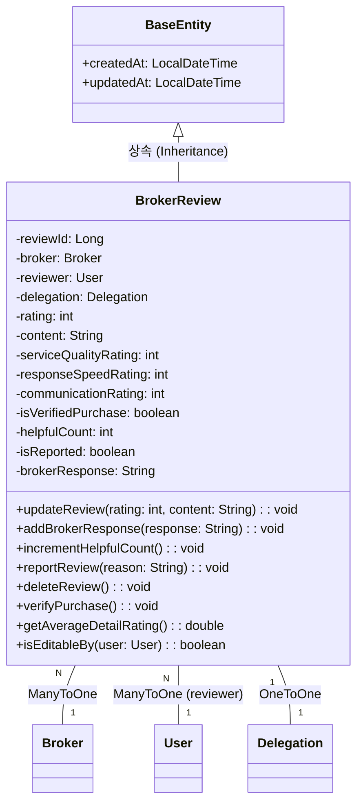

## 7.1. class description
브로커에 대한 고객의 리뷰를 관리하는 클래스이다. 중개 서비스를 이용한 사용자가 브로커에게 남긴 평점과 후기를 저장하며, 다른 사용자들이 브로커를 선택할 때 중요한 참고 자료가 된다. 각 리뷰는 작성자, 대상 브로커, 평점, 내용, 작성일 등의 정보를 포함한다.

## 7.2. attribution 구분

### 7.2.1. reviewId
* **name**: reviewId
* **type**: Long
* **visibility**: private
* **description**: 리뷰를 고유하게 식별하기 위한 primary key이다. 데이터베이스에서 자동 생성되는 리뷰의 고유 ID로, 각 리뷰를 구분하는 데 사용된다.

### 7.2.2. broker
* **name**: broker
* **type**: Broker
* **visibility**: private
* **description**: 리뷰 대상이 되는 브로커 객체에 대한 참조이다. ManyToOne 관계로, 한 브로커는 여러 개의 리뷰를 받을 수 있다. 이 참조를 통해 특정 브로커의 모든 리뷰를 조회할 수 있다.

### 7.2.3. reviewer
* **name**: reviewer
* **type**: User
* **visibility**: private
* **description**: 리뷰를 작성한 사용자 객체에 대한 참조이다. ManyToOne 관계로, 한 사용자는 여러 브로커에게 리뷰를 남길 수 있다. 리뷰어의 이름과 정보를 표시할 때 사용된다.

### 7.2.4. delegation
* **name**: delegation
* **type**: Delegation
* **visibility**: private
* **description**: 이 리뷰가 연관된 중개 위임 건에 대한 참조이다. OneToOne 관계로, 각 중개 위임이 완료된 후 하나의 리뷰를 남길 수 있다. 실제 거래를 경험한 사용자만 리뷰를 작성하도록 보장한다.

### 7.2.5. rating
* **name**: rating
* **type**: int
* **visibility**: private
* **description**: 브로커에 대한 평점이다. 1부터 5까지의 정수값을 가지며, 5점이 가장 높은 평가이다. 이 값들이 모여 브로커의 평균 평점을 계산하는 데 사용된다.

### 7.2.6. content
* **name**: content
* **type**: String
* **visibility**: private
* **description**: 리뷰의 상세 내용이다. 최대 1000자까지 작성할 수 있으며, 브로커의 서비스에 대한 구체적인 경험과 평가를 자유롭게 서술한다. 다른 사용자들이 브로커를 선택할 때 실질적인 도움을 준다.

### 7.2.7. serviceQualityRating
* **name**: serviceQualityRating
* **type**: int
* **visibility**: private
* **description**: 서비스 품질에 대한 세부 평점이다. 1부터 5까지의 값을 가지며, 브로커의 전문성, 친절도, 정확성 등을 구체적으로 평가한다.

### 7.2.8. responseSpeedRating
* **name**: responseSpeedRating
* **type**: int
* **visibility**: private
* **description**: 응답 속도에 대한 세부 평점이다. 1부터 5까지의 값을 가지며, 브로커가 문의나 요청에 얼마나 신속하게 응답했는지를 평가한다.

### 7.2.9. communicationRating
* **name**: communicationRating
* **type**: int
* **visibility**: private
* **description**: 의사소통 능력에 대한 세부 평점이다. 1부터 5까지의 값을 가지며, 브로커의 설명 능력, 경청 태도 등을 평가한다.

### 7.2.10. isVerifiedPurchase
* **name**: isVerifiedPurchase
* **type**: boolean
* **visibility**: private
* **description**: 실제 거래를 완료한 후 작성된 리뷰인지를 나타낸다. delegation이 완료 상태인 경우 자동으로 true가 되며, 검증된 리뷰임을 표시하여 신뢰도를 높인다.

### 7.2.11. helpfulCount
* **name**: helpfulCount
* **type**: int
* **visibility**: private
* **description**: 다른 사용자들이 이 리뷰를 도움이 된다고 표시한 횟수이다. 리뷰의 유용성을 나타내는 지표로, 정렬 시 우선순위를 결정하는 데 사용된다.

### 7.2.12. isReported
* **name**: isReported
* **type**: boolean
* **visibility**: private
* **description**: 이 리뷰가 부적절한 내용으로 신고되었는지를 나타낸다. true인 경우 관리자 검토 대기 상태이며, 일시적으로 공개가 제한될 수 있다.

### 7.2.13. brokerResponse
* **name**: brokerResponse
* **type**: String
* **visibility**: private
* **description**: 브로커가 리뷰에 대해 남긴 답변이다. 최대 500자까지 작성할 수 있으며, 브로커가 고객의 의견에 성실하게 응대하는 모습을 보여줄 수 있다.

### 7.2.14. createdAt
* **name**: createdAt
* **type**: LocalDateTime
* **visibility**: private
* **description**: 리뷰가 작성된 날짜와 시간이다. BaseEntity로부터 상속받아 자동으로 설정되며, 최신 리뷰를 우선 표시하는 정렬 기준으로 사용된다.

### 7.2.15. updatedAt
* **name**: updatedAt
* **type**: LocalDateTime
* **visibility**: private
* **description**: 리뷰가 마지막으로 수정된 날짜와 시간이다. 리뷰어가 내용을 수정하거나 브로커가 답변을 추가할 때 자동으로 갱신된다.

## 7.3. Operations 구분

### 7.3.1. updateReview
* **name**: updateReview
* **type**: void
* **visibility**: public
* **description**: 리뷰 작성자가 리뷰 내용을 수정하는 메서드이다. 평점과 내용을 매개변수로 받아 업데이트하며, 작성 후 일정 기간 내에만 수정이 가능하도록 제한할 수 있다.

### 7.3.2. addBrokerResponse
* **name**: addBrokerResponse
* **type**: void
* **visibility**: public
* **description**: 브로커가 리뷰에 대한 답변을 작성하는 메서드이다. 답변 내용을 매개변수로 받아 brokerResponse 필드를 설정하며, 브로커만 자신의 리뷰에 답변할 수 있도록 권한을 확인한다.

### 7.3.3. incrementHelpfulCount
* **name**: incrementHelpfulCount
* **type**: void
* **visibility**: public
* **description**: 사용자가 리뷰를 도움이 된다고 표시할 때 helpfulCount를 1 증가시키는 메서드이다. 같은 사용자가 중복으로 표시하지 못하도록 검증이 필요하다.

### 7.3.4. reportReview
* **name**: reportReview
* **type**: void
* **visibility**: public
* **description**: 사용자가 부적절한 리뷰를 신고하는 메서드이다. 신고 사유를 매개변수로 받아 isReported를 true로 설정하고, 관리자에게 알림을 전송한다.

### 7.3.5. deleteReview
* **name**: deleteReview
* **type**: void
* **visibility**: public
* **description**: 리뷰를 삭제하는 메서드이다. 작성자 본인이나 관리자만 삭제할 수 있으며, 실제로는 데이터를 삭제하지 않고 isDeleted 플래그를 설정하는 소프트 삭제를 수행한다.

### 7.3.6. verifyPurchase
* **name**: verifyPurchase
* **type**: void
* **visibility**: public
* **description**: 연관된 중개 위임이 완료되었을 때 isVerifiedPurchase를 true로 설정하는 메서드이다. 실제 거래를 기반으로 한 검증된 리뷰임을 표시한다.

### 7.3.7. getAverageDetailRating
* **name**: getAverageDetailRating
* **type**: double
* **visibility**: public
* **description**: 세부 평점들(서비스 품질, 응답 속도, 의사소통)의 평균을 계산하여 반환하는 메서드이다. 브로커의 다양한 측면을 종합적으로 평가하는 데 사용된다.

### 7.3.8. isEditableBy
* **name**: isEditableBy
* **type**: boolean
* **visibility**: public
* **description**: 특정 사용자가 이 리뷰를 수정할 수 있는 권한이 있는지 확인하는 메서드이다. 작성자 본인이거나 작성 후 일정 시간이 지나지 않았을 때 true를 반환한다.

# 8. BrokerRating 클래스

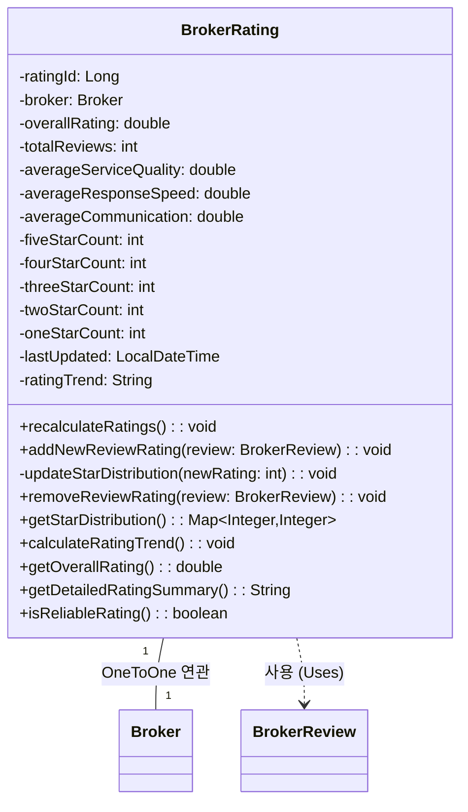

## 8.1. class description
브로커의 평점을 계산하고 관리하는 클래스이다. 여러 리뷰의 평점을 종합하여 브로커의 전체 평균 평점을 계산하고, 각 세부 항목별 평점도 산출한다. 이 클래스는 브로커의 평가 지표를 실시간으로 업데이트하고, 사용자에게 신뢰할 수 있는 평점 정보를 제공하는 역할을 한다.

## 8.2. attribution 구분

### 8.2.1. ratingId
* **name**: ratingId
* **type**: Long
* **visibility**: private
* **description**: 평점 레코드를 고유하게 식별하기 위한 primary key이다. 데이터베이스에서 자동 생성되는 평점의 고유 ID로, 각 브로커마다 하나의 평점 레코드를 가진다.

### 8.2.2. broker
* **name**: broker
* **type**: Broker
* **visibility**: private
* **description**: 이 평점이 속한 브로커 객체에 대한 참조이다. OneToOne 관계로 연결되어 있으며, 각 브로커는 하나의 종합 평점 정보를 가진다.

### 8.2.3. overallRating
* **name**: overallRating
* **type**: double
* **visibility**: private
* **description**: 브로커의 전체 평균 평점이다. 0.0부터 5.0까지의 값을 가지며, 소수점 첫째 자리까지 표시된다. 모든 리뷰의 rating 값을 평균하여 계산되며, 브로커 검색 시 가장 중요한 정렬 기준 중 하나이다.

### 8.2.4. totalReviews
* **name**: totalReviews
* **type**: int
* **visibility**: private
* **description**: 브로커가 받은 총 리뷰 개수이다. 평점의 신뢰도를 판단하는 데 중요한 지표로, 리뷰 개수가 많을수록 평점의 신뢰성이 높아진다.

### 8.2.5. averageServiceQuality
* **name**: averageServiceQuality
* **type**: double
* **visibility**: private
* **description**: 서비스 품질에 대한 평균 평점이다. 0.0부터 5.0까지의 값을 가지며, 모든 리뷰의 serviceQualityRating을 평균하여 계산된다.

### 8.2.6. averageResponseSpeed
* **name**: averageResponseSpeed
* **type**: double
* **visibility**: private
* **description**: 응답 속도에 대한 평균 평점이다. 0.0부터 5.0까지의 값을 가지며, 모든 리뷰의 responseSpeedRating을 평균하여 계산된다.

### 8.2.7. averageCommunication
* **name**: averageCommunication
* **type**: double
* **visibility**: private
* **description**: 의사소통 능력에 대한 평균 평점이다. 0.0부터 5.0까지의 값을 가지며, 모든 리뷰의 communicationRating을 평균하여 계산된다.

### 8.2.8. fiveStarCount
* **name**: fiveStarCount
* **type**: int
* **visibility**: private
* **description**: 5점 평점을 받은 리뷰의 개수이다. 평점 분포를 시각화할 때 사용되며, 브로커의 우수성을 나타내는 지표이다.

### 8.2.9. fourStarCount
* **name**: fourStarCount
* **type**: int
* **visibility**: private
* **description**: 4점 평점을 받은 리뷰의 개수이다. 평점 분포 분석에 사용된다.

### 8.2.10. threeStarCount
* **name**: threeStarCount
* **type**: int
* **visibility**: private
* **description**: 3점 평점을 받은 리뷰의 개수이다. 평점 분포 분석에 사용된다.

### 8.2.11. twoStarCount
* **name**: twoStarCount
* **type**: int
* **visibility**: private
* **description**: 2점 평점을 받은 리뷰의 개수이다. 평점 분포 분석에 사용된다.

### 8.2.12. oneStarCount
* **name**: oneStarCount
* **type**: int
* **visibility**: private
* **description**: 1점 평점을 받은 리뷰의 개수이다. 평점 분포를 완성하며, 낮은 평가를 받은 경우를 파악하는 데 사용된다.

### 8.2.13. lastUpdated
* **name**: lastUpdated
* **type**: LocalDateTime
* **visibility**: private
* **description**: 평점이 마지막으로 업데이트된 날짜와 시간이다. 새로운 리뷰가 추가되거나 기존 리뷰가 수정될 때 자동으로 갱신된다.

### 8.2.14. ratingTrend
* **name**: ratingTrend
* **type**: String
* **visibility**: private
* **description**: 최근 평점의 변화 추세를 나타낸다. "상승", "유지", "하락" 중 하나의 값을 가지며, 최근 3개월간의 평점 변화를 분석하여 설정된다.

## 8.3. Operations 구분

### 8.3.1. recalculateRatings
* **name**: recalculateRatings
* **type**: void
* **visibility**: public
* **description**: 브로커의 모든 리뷰를 다시 조회하여 평점을 재계산하는 메서드이다. 전체 평균 평점과 세부 항목별 평점을 모두 업데이트하며, 새로운 리뷰가 추가되거나 기존 리뷰가 수정/삭제될 때 호출된다.

### 8.3.2. addNewReviewRating
* **name**: addNewReviewRating
* **type**: void
* **visibility**: public
* **description**: 새로운 리뷰가 추가되었을 때 기존 평점에 새 평점을 반영하는 메서드이다. BrokerReview 객체를 매개변수로 받아, 전체 평점을 재계산하지 않고 효율적으로 업데이트한다. 리뷰 개수가 많을 때 성능상 이점이 있다.

### 8.3.3. updateStarDistribution
* **name**: updateStarDistribution
* **type**: void
* **visibility**: private
* **description**: 새로운 평점이 추가될 때 해당 평점에 맞는 카운터를 증가시키는 메서드이다. 예를 들어 5점 리뷰가 추가되면 fiveStarCount를 1 증가시킨다.

### 8.3.4. removeReviewRating
* **name**: removeReviewRating
* **type**: void
* **visibility**: public
* **description**: 리뷰가 삭제되었을 때 해당 리뷰의 평점을 전체 평점에서 제외하는 메서드이다. BrokerReview 객체를 매개변수로 받아 평점을 재계산하고 별점 분포도 조정한다.

### 8.3.5. getStarDistribution
* **name**: getStarDistribution
* **type**: Map\<Integer, Integer\>
* **visibility**: public
* **description**: 1점부터 5점까지의 평점 분포를 Map 형태로 반환하는 메서드이다. UI에서 평점 분포를 막대 그래프나 원형 차트로 표시할 때 사용된다.

### 8.3.6. calculateRatingTrend
* **name**: calculateRatingTrend
* **type**: void
* **visibility**: public
* **description**: 최근 3개월간의 평점 변화를 분석하여 ratingTrend를 업데이트하는 메서드이다. 이전 기간과 현재 기간의 평점을 비교하여 상승, 유지, 하락 중 하나를 설정한다.

### 8.3.7. getOverallRating
* **name**: getOverallRating
* **type**: double
* **visibility**: public
* **description**: 현재 전체 평균 평점을 반환하는 getter 메서드이다. 브로커 리스트나 프로필 페이지에서 평점을 표시할 때 사용된다.

### 8.3.8. getDetailedRatingSummary
* **name**: getDetailedRatingSummary
* **type**: String
* **visibility**: public
* **description**: 전체 평점, 리뷰 개수, 세부 항목별 평점을 포함한 종합 요약 정보를 문자열로 반환하는 메서드이다. 브로커 프로필에서 평점 정보를 상세히 표시할 때 사용된다.

### 8.3.9. isReliableRating
* **name**: isReliableRating
* **type**: boolean
* **visibility**: public
* **description**: 평점이 신뢰할 수 있는 수준인지 판단하는 메서드이다. 일반적으로 리뷰 개수가 10개 이상일 때 신뢰할 수 있다고 판단하며, 이를 기반으로 사용자에게 정보를 제공한다.

# 9. Delegation 클래스

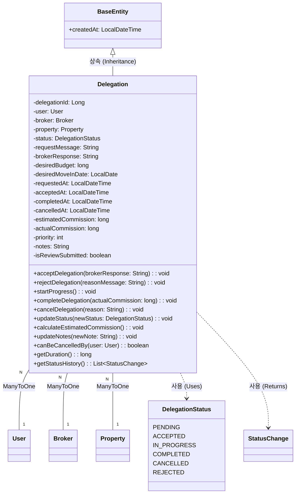

## 9.1. class description
사용자가 브로커에게 부동산 중개를 위임한 건에 대한 정보를 관리하는 핵심 클래스이다. 위임의 생성부터 완료까지의 전체 생명주기를 추적하며, 사용자와 브로커 간의 중개 계약 관계를 나타낸다. 이 클래스는 누가 누구에게 어떤 매물에 대해 중개를 요청했는지, 현재 진행 상태는 어떠한지, 언제 요청되고 완료되었는지 등의 모든 정보를 포함하고 있다. 중개 위임은 사용자가 매물을 직접 거래하는 것이 아니라 전문가인 브로커의 도움을 받아 거래를 진행하고자 할 때 생성되며, Real Estate Hub 플랫폼의 핵심 비즈니스 프로세스를 구현한다.

## 9.2. attribution 구분

### 9.2.1. delegationId
* **name**: delegationId
* **type**: Long
* **visibility**: private
* **description**: 중개 위임 건을 고유하게 식별하기 위한 primary key이다. 데이터베이스에서 자동 생성되는 위임의 고유 ID로, 각 위임 건을 추적하고 관리하는 데 사용된다. 이 ID를 통해 특정 위임 건의 전체 이력과 관련 정보를 조회할 수 있다.

### 9.2.2. user
* **name**: user
* **type**: User
* **visibility**: private
* **description**: 중개를 요청한 일반 사용자 객체에 대한 참조이다. ManyToOne 관계로, 한 사용자는 여러 브로커에게 다양한 매물에 대해 중개를 요청할 수 있다. 이 참조를 통해 위임을 요청한 고객의 연락처, 선호도, 과거 거래 이력 등의 정보에 접근할 수 있다.

### 9.2.3. broker
* **name**: broker
* **type**: Broker
* **visibility**: private
* **description**: 중개를 담당하는 브로커 객체에 대한 참조이다. ManyToOne 관계로, 한 브로커는 여러 고객으로부터 중개 의뢰를 받을 수 있다. 이 참조를 통해 담당 브로커의 프로필, 전문 분야, 연락처 등의 정보에 접근하며, 브로커에게 알림을 전송하거나 채팅을 시작할 때 사용된다.

### 9.2.4. property
* **name**: property
* **type**: Property
* **visibility**: private
* **description**: 중개 대상이 되는 매물 객체에 대한 참조이다. ManyToOne 관계로, 하나의 매물에 대해 여러 사용자가 각각 다른 브로커에게 중개를 요청할 수 있다. 이 참조를 통해 매물의 상세 정보, 가격, 위치 등을 확인하며, 브로커가 해당 매물에 대한 정보를 제공하거나 협상을 진행할 때 필요하다.

### 9.2.5. status
* **name**: status
* **type**: DelegationStatus
* **visibility**: private
* **description**: 현재 위임의 진행 상태를 나타내는 열거형 변수이다. PENDING(대기중), ACCEPTED(수락됨), IN_PROGRESS(진행중), COMPLETED(완료됨), CANCELLED(취소됨), REJECTED(거절됨) 등의 값을 가질 수 있으며, 위임 건의 생명주기를 추적한다. 이 상태에 따라 사용자와 브로커에게 다른 UI와 기능이 제공되며, 상태가 변경될 때마다 관련 당사자들에게 알림이 전송된다.

### 9.2.6. requestMessage
* **name**: requestMessage
* **type**: String
* **visibility**: private
* **description**: 사용자가 브로커에게 중개를 요청할 때 함께 보낸 메시지이다. 최대 1000자까지 작성할 수 있으며, 사용자의 구체적인 요구사항, 예산, 선호 조건, 원하는 거래 시기 등을 자유롭게 표현한다. 브로커는 이 메시지를 읽고 고객의 니즈를 파악하여 맞춤형 서비스를 제공할 수 있다.

### 9.2.7. brokerResponse
* **name**: brokerResponse
* **type**: String
* **visibility**: private
* **description**: 브로커가 위임 요청에 대해 답변한 메시지이다. 최대 1000자까지 작성할 수 있으며, 수락하는 경우 서비스 계획과 예상 일정을 안내하고, 거절하는 경우 사유를 설명한다. 이 메시지는 사용자에게 전달되어 브로커의 전문성과 성실성을 판단하는 데 도움을 준다.

### 9.2.8. desiredBudget
* **name**: desiredBudget
* **type**: long
* **visibility**: private
* **description**: 사용자가 희망하는 예산 범위이다. 단위는 원이며, 브로커가 고객에게 적합한 매물을 추천하거나 가격 협상을 진행할 때 중요한 기준이 된다. 실제 매물 가격보다 낮을 수도 있으며, 이 경우 브로커는 협상을 통해 가격을 조정하거나 대안 매물을 제시한다.

### 9.2.9. desiredMoveInDate
* **name**: desiredMoveInDate
* **type**: LocalDate
* **visibility**: private
* **description**: 사용자가 희망하는 입주 날짜이다. 브로커는 이 날짜를 고려하여 거래 일정을 계획하고, 매도자와 협상할 때 이 정보를 활용한다. 급하게 이사해야 하는 고객의 경우 이 날짜가 매우 중요한 조건이 될 수 있다.

### 9.2.10. requestedAt
* **name**: requestedAt
* **type**: LocalDateTime
* **visibility**: private
* **description**: 위임이 요청된 날짜와 시간이다. BaseEntity로부터 상속받은 createdAt과 동일한 값을 가지며, 위임 건을 시간순으로 정렬하거나 브로커의 응답 속도를 측정할 때 사용된다. 또한 오래된 미처리 요청을 자동으로 만료시키는 로직에도 활용된다.

### 9.2.11. acceptedAt
* **name**: acceptedAt
* **type**: LocalDateTime
* **visibility**: private
* **description**: 브로커가 위임을 수락한 날짜와 시간이다. null 값일 수 있으며, 브로커가 수락했을 때만 설정된다. 요청 시간과의 차이를 계산하여 브로커의 평균 응답 시간을 산출하는 데 사용된다.

### 9.2.12. completedAt
* **name**: completedAt
* **type**: LocalDateTime
* **visibility**: private
* **description**: 위임이 완료된 날짜와 시간이다. null 값일 수 있으며, 거래가 성사되었거나 중개 서비스가 종료되었을 때 설정된다. 이 시점 이후에 사용자는 브로커에 대한 리뷰를 작성할 수 있다.

### 9.2.13. cancelledAt
* **name**: cancelledAt
* **type**: LocalDateTime
* **visibility**: private
* **description**: 위임이 취소된 날짜와 시간이다. null 값일 수 있으며, 사용자나 브로커가 위임을 취소했을 때 설정된다. 취소 사유와 함께 기록되어 향후 분쟁이나 통계 분석에 활용될 수 있다.

### 9.2.14. estimatedCommission
* **name**: estimatedCommission
* **type**: long
* **visibility**: private
* **description**: 예상 중개 수수료이다. 단위는 원이며, 법정 수수료율을 기준으로 자동 계산되거나 브로커가 직접 제시할 수 있다. 사용자는 중개를 요청하기 전에 이 금액을 확인하여 총 비용을 파악할 수 있다.

### 9.2.15. actualCommission
* **name**: actualCommission
* **type**: long
* **visibility**: private
* **description**: 실제로 지불된 중개 수수료이다. 거래가 완료된 후에 설정되며, 협상이나 할인으로 인해 예상 수수료와 다를 수 있다. 이 금액은 브로커의 수익 통계와 플랫폼 수수료 계산에 사용된다.

### 9.2.16. priority
* **name**: priority
* **type**: int
* **visibility**: private
* **description**: 위임의 우선순위를 나타낸다. 1부터 5까지의 값을 가지며, 5가 가장 높은 우선순위이다. 사용자가 급하게 거래를 원하거나 프리미엄 서비스를 이용하는 경우 높은 우선순위가 부여된다. 브로커는 우선순위가 높은 위임을 먼저 처리하도록 권장된다.

### 9.2.17. notes
* **name**: notes
* **type**: String
* **visibility**: private
* **description**: 브로커가 위임 진행 과정에서 작성하는 메모이다. 고객과의 통화 내용, 현장 방문 결과, 매도자와의 협상 진행 상황 등을 자유롭게 기록한다. 이 메모는 브로커 본인만 볼 수 있으며, 업무 연속성을 유지하는 데 도움을 준다.

### 9.2.18. isReviewSubmitted
* **name**: isReviewSubmitted
* **type**: boolean
* **visibility**: private
* **description**: 위임 완료 후 사용자가 리뷰를 작성했는지 여부를 나타낸다. 완료된 위임에 대해 아직 리뷰가 작성되지 않은 경우, 사용자에게 리뷰 작성을 유도하는 알림을 전송하는 데 사용된다.

## 9.3. Operations 구분

### 9.3.1. acceptDelegation
* **name**: acceptDelegation
* **type**: void
* **visibility**: public
* **description**: 브로커가 위임 요청을 수락하는 메서드이다. 브로커의 응답 메시지를 매개변수로 받아 brokerResponse에 저장하고, status를 ACCEPTED로 변경하며, acceptedAt을 현재 시간으로 설정한다. 동시에 사용자에게 수락 알림을 전송하고, 채팅방을 자동으로 생성하여 원활한 의사소통이 가능하도록 한다. 브로커의 현재 업무 부하를 고려하여 수락 가능 여부를 먼저 확인하는 검증 로직도 포함된다.

### 9.3.2. rejectDelegation
* **name**: rejectDelegation
* **type**: void
* **visibility**: public
* **description**: 브로커가 위임 요청을 거절하는 메서드이다. 거절 사유를 담은 메시지를 매개변수로 받아 brokerResponse에 저장하고, status를 REJECTED로 변경한다. 사용자에게 거절 알림과 함께 다른 브로커 추천 목록을 제공하여 대안을 모색할 수 있도록 돕는다. 거절 사유는 통계로 수집되어 향후 매칭 알고리즘 개선에 활용된다.

### 9.3.3. startProgress
* **name**: startProgress
* **type**: void
* **visibility**: public
* **description**: 수락된 위임의 실제 작업을 시작하는 메서드이다. status를 IN_PROGRESS로 변경하며, 이 시점부터 브로커는 본격적으로 매물 상담, 현장 방문, 가격 협상 등의 중개 활동을 시작한다. 사용자에게 작업 시작 알림을 전송하고, 진행 상황을 주기적으로 업데이트하도록 브로커에게 안내한다.

### 9.3.4. completeDelegation
* **name**: completeDelegation
* **type**: void
* **visibility**: public
* **description**: 위임을 완료 처리하는 메서드이다. 거래가 성사되었거나 중개 서비스가 종료되었을 때 호출되며, status를 COMPLETED로 변경하고 completedAt을 현재 시간으로 설정한다. 실제 지불된 중개 수수료를 매개변수로 받아 actualCommission에 저장하며, 브로커의 거래 실적에 반영한다. 완료 후 사용자에게 리뷰 작성을 요청하는 알림을 전송한다.

### 9.3.5. cancelDelegation
* **name**: cancelDelegation
* **type**: void
* **visibility**: public
* **description**: 위임을 취소하는 메서드이다. 사용자나 브로커가 취소할 수 있으며, 취소 사유를 매개변수로 받아 기록한다. status를 CANCELLED로 변경하고 cancelledAt을 설정하며, 상대방에게 취소 알림을 전송한다. 위임의 현재 상태에 따라 취소 가능 여부와 위약금 발생 여부를 판단하는 로직도 포함된다.

### 9.3.6. updateStatus
* **name**: updateStatus
* **type**: void
* **visibility**: public
* **description**: 위임의 상태를 변경하는 범용 메서드이다. 새로운 DelegationStatus를 매개변수로 받아 현재 상태에서 해당 상태로 전환이 유효한지 검증한 후 변경한다. 상태 전환 규칙을 엄격하게 관리하여 잘못된 상태 변경을 방지하며, 각 상태 변경 시 적절한 후속 작업을 자동으로 수행한다.

### 9.3.7. calculateEstimatedCommission
* **name**: calculateEstimatedCommission
* **type**: void
* **visibility**: public
* **description**: 예상 중개 수수료를 계산하는 메서드이다. 매물 가격과 법정 중개보수 요율을 기준으로 자동 계산하며, 계산된 금액을 estimatedCommission에 저장한다. 거래 유형과 매물 가격대에 따라 다른 요율이 적용되며, 이 정보는 사용자가 위임을 요청하기 전에 확인할 수 있도록 제공된다.

### 9.3.8. updateNotes
* **name**: updateNotes
* **type**: void
* **visibility**: public
* **description**: 브로커가 위임 진행 과정에서 메모를 추가하거나 수정하는 메서드이다. 새로운 메모 내용을 매개변수로 받아 기존 notes에 타임스탬프와 함께 추가하며, 브로커가 작업 이력을 체계적으로 관리할 수 있도록 돕는다. 이 메모는 나중에 분쟁이 발생했을 때 증거 자료로도 활용될 수 있다.

### 9.3.9. canBeCancelledBy
* **name**: canBeCancelledBy
* **type**: boolean
* **visibility**: public
* **description**: 특정 사용자가 현재 위임을 취소할 수 있는 권한이 있는지 확인하는 메서드이다. 사용자 객체를 매개변수로 받아, 그 사용자가 위임을 요청한 고객이거나 담당 브로커인지, 그리고 현재 위임의 상태가 취소 가능한 상태인지를 종합적으로 판단하여 boolean 값을 반환한다.

### 9.3.10. getDuration
* **name**: getDuration
* **type**: long
* **visibility**: public
* **description**: 위임이 요청된 시점부터 현재까지의 경과 시간을 계산하는 메서드이다. 완료된 위임의 경우 요청부터 완료까지의 총 소요 시간을 반환하며, 단위는 일(day)이다. 이 정보는 브로커의 업무 처리 속도를 평가하는 지표로 사용된다.

### 9.3.11. getStatusHistory
* **name**: getStatusHistory
* **type**: List\<StatusChange\>
* **visibility**: public
* **description**: 위임의 상태 변경 이력을 시간순으로 반환하는 메서드이다. 언제 어떤 상태로 변경되었는지를 추적하여 리스트로 제공하며, 위임의 전체 진행 과정을 타임라인 형태로 시각화할 때 사용된다. 이는 투명한 서비스 제공과 분쟁 해결에 도움을 준다.

# 10. DelegationStatus 클래스

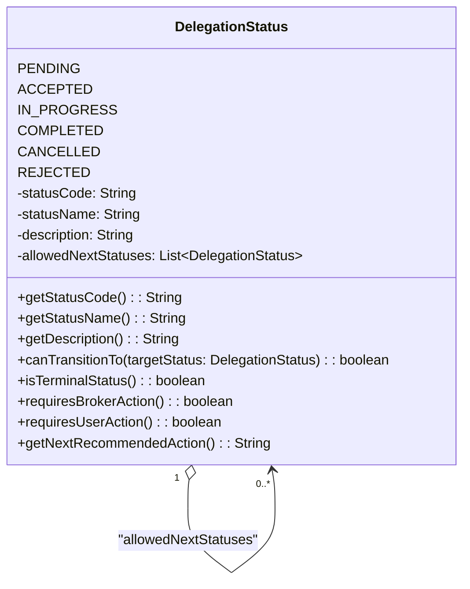

## 10.1. class description
중개 위임의 진행 상태를 정의하는 열거형(Enum) 클래스이다. 위임의 생명주기 전체를 여섯 가지 주요 상태로 구분하여 관리하며, 각 상태는 특정한 의미와 다음 가능한 상태 전환을 정의한다. 이 열거형은 위임 프로세스의 명확한 흐름을 보장하고, 각 상태에 따라 사용자와 브로커에게 적절한 기능과 정보를 제공하는 기준이 된다. 예를 들어 PENDING 상태에서는 브로커에게 수락/거절 버튼이 표시되고, IN_PROGRESS 상태에서는 진행 상황 업데이트와 채팅 기능이 활성화된다.

## 10.2. attribution 구분

### 10.2.1. PENDING
* **name**: PENDING
* **type**: DelegationStatus
* **visibility**: public
* **description**: 사용자가 브로커에게 중개를 요청했지만 브로커가 아직 응답하지 않은 대기 상태이다. 이 상태는 위임이 생성된 직후의 초기 상태이며, 브로커는 일정 시간 내에 수락 또는 거절로 응답해야 한다. 너무 오래 대기 상태로 남아있는 경우 자동으로 만료되거나 다른 브로커에게 재할당될 수 있다.

### 10.2.2. ACCEPTED
* **name**: ACCEPTED
* **type**: DelegationStatus
* **visibility**: public
* **description**: 브로커가 중개 요청을 수락한 상태이다. 이 시점에서 사용자와 브로커 간의 중개 계약이 성립되며, 채팅방이 자동으로 생성되어 양측이 소통할 수 있다. 브로커는 곧 실제 중개 활동을 시작할 준비를 하며, 사용자는 브로커의 다음 연락을 기다린다.

### 10.2.3. IN_PROGRESS
* **name**: IN_PROGRESS
* **type**: DelegationStatus
* **visibility**: public
* **description**: 브로커가 실제로 중개 활동을 진행하고 있는 상태이다. 매물 상담, 현장 방문, 가격 협상, 계약서 준비 등의 구체적인 작업이 이루어지는 단계이며, 가장 긴 시간이 소요되는 상태이다. 브로커는 주기적으로 진행 상황을 사용자에게 업데이트하며, 사용자는 언제든지 질문하거나 추가 요청을 할 수 있다.

### 10.2.4. COMPLETED
* **name**: COMPLETED
* **type**: DelegationStatus
* **visibility**: public
* **description**: 중개가 성공적으로 완료된 상태이다. 거래가 성사되었거나, 계약이 체결되었거나, 또는 중개 서비스가 정상적으로 종료되었음을 의미한다. 이 상태에 도달하면 사용자는 브로커에 대한 리뷰를 작성할 수 있으며, 중개 수수료가 정산된다. 완료된 위임은 양측의 거래 이력에 기록되어 향후 참고 자료가 된다.

### 10.2.5. CANCELLED
* **name**: CANCELLED
* **type**: DelegationStatus
* **visibility**: public
* **description**: 위임이 취소된 상태이다. 사용자나 브로커가 중도에 중개를 중단하기로 결정했거나, 고객이 다른 브로커를 선택했거나, 더 이상 매물이 필요하지 않게 된 경우 등의 이유로 취소된다. 취소 사유는 별도로 기록되며, 취소 시점과 진행 정도에 따라 부분적인 수수료가 발생할 수 있다.

### 10.2.6. REJECTED
* **name**: REJECTED
* **type**: DelegationStatus
* **visibility**: public
* **description**: 브로커가 중개 요청을 거절한 상태이다. 브로커의 업무 과부하, 전문 분야 불일치, 지역적 한계, 또는 고객의 비현실적인 요구사항 등의 이유로 거절될 수 있다. 거절 사유는 사용자에게 전달되며, 시스템은 자동으로 다른 적합한 브로커를 추천하여 사용자가 빠르게 대안을 찾을 수 있도록 돕는다.

### 10.2.7. statusCode
* **name**: statusCode
* **type**: String
* **visibility**: private
* **description**: 각 상태를 코드로 표현한 문자열이다. 예를 들어 PENDING은 "PD", ACCEPTED는 "AC"와 같은 짧은 코드로 저장될 수 있으며, 데이터베이스 저장 공간을 절약하거나 API 응답을 간소화할 때 사용된다.

### 10.2.8. statusName
* **name**: statusName
* **type**: String
* **visibility**: private
* **description**: 각 상태의 한글 또는 현지 언어 이름이다. 예를 들어 PENDING은 "대기중", ACCEPTED는 "수락됨"으로 저장되며, 사용자 인터페이스에 표시할 때 사용된다. 다국어 지원을 위해 언어별로 다른 값을 가질 수 있다.

### 10.2.9. description
* **name**: description
* **type**: String
* **visibility**: private
* **description**: 각 상태에 대한 자세한 설명이다. 사용자나 브로커에게 현재 상태가 무엇을 의미하는지, 다음 단계는 무엇인지를 안내하는 도움말로 사용되며, 툴팁이나 정보 패널에 표시된다.

### 10.2.10. allowedNextStatuses
* **name**: allowedNextStatuses
* **type**: List\<DelegationStatus\>
* **visibility**: private
* **description**: 현재 상태에서 전환 가능한 다음 상태들의 목록이다. 예를 들어 PENDING 상태에서는 ACCEPTED, REJECTED, CANCELLED로만 전환할 수 있으며, 잘못된 상태 전환을 방지하는 검증에 사용된다. 이를 통해 비즈니스 규칙을 코드 레벨에서 강제할 수 있다.

## 10.3. Operations 구분

### 10.3.1. getStatusCode
* **name**: getStatusCode
* **type**: String
* **visibility**: public
* **description**: 현재 상태의 코드를 반환하는 getter 메서드이다. API 응답이나 데이터베이스 조회 시 간결한 형태로 상태 정보를 전달할 때 사용되며, 프론트엔드에서 상태별 아이콘이나 색상을 결정하는 데 활용된다.

### 10.3.2. getStatusName
* **name**: getStatusName
* **type**: String
* **visibility**: public
* **description**: 현재 상태의 이름을 반환하는 getter 메서드이다. 사용자 인터페이스에서 상태를 읽기 쉬운 형태로 표시할 때 사용되며, 언어 설정에 따라 적절한 번역된 텍스트를 제공한다.

### 10.3.3. getDescription
* **name**: getDescription
* **type**: String
* **visibility**: public
* **description**: 현재 상태에 대한 설명을 반환하는 getter 메서드이다. 사용자가 상태의 의미를 정확히 이해할 수 있도록 상세한 안내 텍스트를 제공하며, 도움말 기능에 활용된다.

### 10.3.4. canTransitionTo
* **name**: canTransitionTo
* **type**: boolean
* **visibility**: public
* **description**: 현재 상태에서 특정 다른 상태로 전환이 가능한지 확인하는 메서드이다. 목표 상태를 매개변수로 받아 allowedNextStatuses에 포함되어 있는지 검사하며, 상태 변경 전에 유효성을 검증하는 데 사용된다. 이를 통해 잘못된 상태 전환으로 인한 데이터 무결성 문제를 예방한다.

### 10.3.5. isTerminalStatus
* **name**: isTerminalStatus
* **type**: boolean
* **visibility**: public
* **description**: 현재 상태가 최종 상태인지 확인하는 메서드이다. COMPLETED, CANCELLED, REJECTED는 최종 상태로 간주되며, 이 상태에 도달하면 더 이상 상태 변경이 불가능하다. 최종 상태의 위임은 아카이브되거나 통계 자료로 활용된다.

### 10.3.6. requiresBrokerAction
* **name**: requiresBrokerAction
* **type**: boolean
* **visibility**: public
* **description**: 현재 상태에서 브로커의 조치가 필요한지 확인하는 메서드이다. PENDING 상태에서는 브로커의 수락/거절 결정이 필요하고, IN_PROGRESS 상태에서는 진행 상황 업데이트가 필요하다. 이를 바탕으로 브로커에게 적절한 알림과 액션 버튼을 제공한다.

### 10.3.7. requiresUserAction
* **name**: requiresUserAction
* **type**: boolean
* **visibility**: public
* **description**: 현재 상태에서 사용자의 조치가 필요한지 확인하는 메서드이다. COMPLETED 상태에서는 리뷰 작성이 필요하며, 이를 기반으로 사용자에게 적절한 안내와 알림을 제공한다.

### 10.3.8. getNextRecommendedAction
* **name**: getNextRecommendedAction
* **type**: String
* **visibility**: public
* **description**: 현재 상태에서 권장되는 다음 행동을 문자열로 반환하는 메서드이다. 예를 들어 PENDING 상태에서는 브로커에게 "24시간 이내에 응답해주세요"라는 안내를, ACCEPTED 상태에서는 "고객에게 연락하여 일정을 잡으세요"라는 안내를 제공한다.

# 11. DelegationRequest 클래스

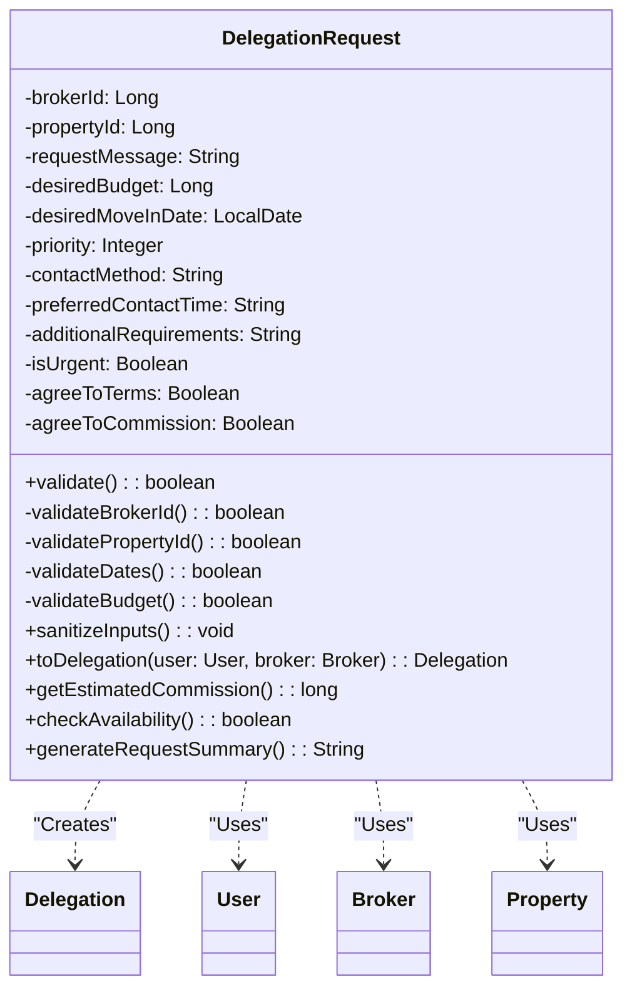

## 11.1. class description
사용자가 브로커에게 중개를 요청할 때 전달하는 정보를 담은 DTO(Data Transfer Object) 클래스이다. 실제 Delegation 엔티티가 생성되기 전에 사용자로부터 필요한 모든 정보를 수집하고 검증하는 역할을 한다. 이 클래스는 웹 요청의 바디로 전달되거나 폼 데이터로 제출되며, 서비스 레이어에서 유효성을 검증한 후 실제 Delegation 엔티티로 변환된다. DTO 패턴을 사용함으로써 엔티티 클래스를 직접 노출하지 않고, 요청에 필요한 데이터만 선택적으로 받을 수 있어 보안과 유연성이 향상된다.

## 11.2. attribution 구분

### 11.2.1. brokerId
* **name**: brokerId
* **type**: Long
* **visibility**: private
* **description**: 중개를 요청할 브로커의 ID이다. 사용자가 브로커 목록에서 특정 브로커를 선택했을 때 그 브로커의 고유 ID가 여기에 저장된다. 이 ID를 통해 실제 Broker 엔티티를 조회하여 위임을 생성한다. null이 아니어야 하며, 존재하는 브로커의 ID여야 한다.

### 11.2.2. propertyId
* **name**: propertyId
* **type**: Long
* **visibility**: private
* **description**: 중개를 요청하려는 매물의 ID이다. 사용자가 관심 있는 매물 상세 페이지에서 중개 요청 버튼을 클릭했을 때 해당 매물의 ID가 자동으로 설정된다. 이 ID를 통해 실제 Property 엔티티를 조회하여 위임과 연결한다. null이 아니어야 하며, 실제 존재하는 매물이어야 한다.

### 11.2.3. requestMessage
* **name**: requestMessage
* **type**: String
* **visibility**: private
* **description**: 사용자가 브로커에게 전달하려는 메시지이다. 사용자의 구체적인 요구사항, 질문, 선호 조건 등을 자유롭게 작성할 수 있으며, 최소 10자 이상, 최대 1000자까지 입력 가능하다. 이 필드는 필수가 아닐 수 있지만, 구체적인 메시지가 있을 때 브로커가 더 나은 서비스를 제공할 수 있다.

### 11.2.4. desiredBudget
* **name**: desiredBudget
* **type**: Long
* **visibility**: private
* **description**: 사용자가 희망하는 예산이다. 양수여야 하며, 실제 매물 가격과 다를 수 있다. 브로커는 이 예산을 참고하여 가격 협상을 진행하거나 예산 내에서 가능한 대안을 제시한다. null일 수 있으며, 이 경우 매물의 정가를 기준으로 한다.

### 11.2.5. desiredMoveInDate
* **name**: desiredMoveInDate
* **type**: LocalDate
* **visibility**: private
* **description**: 사용자가 희망하는 입주 날짜이다. 오늘 날짜 이후여야 하며, 너무 먼 미래(예: 1년 후)는 허용되지 않을 수 있다. 브로커는 이 날짜를 고려하여 거래 일정을 조율하며, 급한 경우 우선순위를 높게 설정할 수 있다.

### 11.2.6. priority
* **name**: priority
* **type**: Integer
* **visibility**: private
* **description**: 사용자가 설정하는 요청의 우선순위이다. 1부터 5까지의 값을 가질 수 있으며, 기본값은 3(보통)이다. 프리미엄 사용자나 급한 거래의 경우 높은 우선순위를 설정할 수 있으며, 이는 브로커의 작업 순서에 영향을 줄 수 있다.

### 11.2.7. contactMethod
* **name**: contactMethod
* **type**: String
* **visibility**: private
* **description**: 사용자가 선호하는 연락 방법이다. "전화", "이메일", "채팅", "문자" 등의 값을 가질 수 있으며, 브로커가 고객에게 연락할 때 이 선호도를 참고한다. 여러 방법을 선택할 수 있도록 쉼표로 구분된 문자열로 저장될 수 있다.

### 11.2.8. preferredContactTime
* **name**: preferredContactTime
* **type**: String
* **visibility**: private
* **description**: 사용자가 연락 받기 선호하는 시간대이다. "오전", "오후", "저녁", "주말만" 등의 값을 가질 수 있으며, 브로커가 고객에게 연락할 최적의 시간을 파악하는 데 도움을 준다. 직장인 고객의 경우 업무 시간을 피하고자 할 때 유용하다.

### 11.2.9. additionalRequirements
* **name**: additionalRequirements
* **type**: String
* **visibility**: private
* **description**: 사용자의 추가적인 요구사항이나 특별한 조건이다. 예를 들어 반려동물 동반 가능 여부, 주차 공간 필요성, 리모델링 필요 여부 등 requestMessage에 포함되지 않은 구체적인 조건들을 기술한다. 선택적 필드이며 최대 500자까지 작성 가능하다.

### 11.2.10. isUrgent
* **name**: isUrgent
* **type**: Boolean
* **visibility**: private
* **description**: 긴급 처리가 필요한지 여부를 나타낸다. true인 경우 시스템은 자동으로 priority를 높게 설정하고, 브로커에게 긴급 알림을 전송한다. 기본값은 false이며, 남용을 방지하기 위해 일정 기간 동안 긴급 요청 횟수를 제한할 수 있다.

### 11.2.11. agreeToTerms
* **name**: agreeToTerms
* **type**: Boolean
* **visibility**: private
* **description**: 사용자가 중개 서비스 이용 약관에 동의했는지 여부이다. true여야만 요청이 처리되며, 필수 동의 항목이다. 법적 보호와 명확한 서비스 조건 제시를 위해 반드시 확인해야 한다.

### 11.2.12. agreeToCommission
* **name**: agreeToCommission
* **type**: Boolean
* **visibility**: private
* **description**: 사용자가 중개 수수료 지불에 동의했는지 여부이다. true여야만 요청이 처리되며, 예상 수수료 금액을 확인한 후 동의하도록 프로세스가 설계되어야 한다. 나중에 수수료 분쟁을 예방하는 중요한 필드이다.

## 11.3. Operations 구분

### 11.3.1. validate
* **name**: validate
* **type**: boolean
* **visibility**: public
* **description**: 요청 데이터의 유효성을 종합적으로 검증하는 메서드이다. 모든 필수 필드가 채워져 있는지, 각 필드의 값이 허용된 범위 내에 있는지, 논리적으로 모순되는 부분은 없는지 등을 체크한다. 검증에 실패하면 구체적인 오류 메시지와 함께 false를 반환하여 사용자에게 수정을 요청한다.

### 11.3.2. validateBrokerId
* **name**: validateBrokerId
* **type**: boolean
* **visibility**: private
* **description**: 브로커 ID의 유효성을 검증하는 메서드이다. null이 아닌지, 양수인지, 그리고 실제로 존재하는 브로커의 ID인지를 확인한다. 또한 해당 브로커가 현재 새로운 위임을 받을 수 있는 활성 상태인지도 검증한다.

### 11.3.3. validatePropertyId
* **name**: validatePropertyId
* **type**: boolean
* **visibility**: private
* **description**: 매물 ID의 유효성을 검증하는 메서드이다. null이 아닌지, 양수인지, 그리고 실제로 존재하며 현재 판매 중인 매물의 ID인지를 확인한다. 이미 거래 완료된 매물에 대한 위임 요청은 거부된다.

### 11.3.4. validateDates
* **name**: validateDates
* **type**: boolean
* **visibility**: private
* **description**: 날짜 관련 필드의 유효성을 검증하는 메서드이다. 희망 입주일이 오늘 이후인지, 너무 먼 미래가 아닌지 등을 확인하며, 날짜 형식이 올바른지도 검사한다.

### 11.3.5. validateBudget
* **name**: validateBudget
* **type**: boolean
* **visibility**: private
* **description**: 예산의 유효성을 검증하는 메서드이다. 양수인지, 현실적인 범위 내의 금액인지를 확인한다. 매물 가격의 일정 비율 이하로 너무 낮은 예산은 경고와 함께 재확인을 요청할 수 있다.

### 11.3.6. sanitizeInputs
* **name**: sanitizeInputs
* **type**: void
* **visibility**: public
* **description**: 사용자 입력값을 정제하는 메서드이다. 문자열 필드의 앞뒤 공백을 제거하고, XSS 공격을 방지하기 위해 위험한 HTML 태그나 스크립트를 제거하며, 허용되지 않은 특수 문자를 필터링한다. 보안을 위해 데이터베이스에 저장하기 전에 반드시 실행되어야 한다.

### 11.3.7. toDelegation
* **name**: toDelegation
* **type**: Delegation
* **visibility**: public
* **description**: 검증된 DTO 데이터를 실제 Delegation 엔티티 객체로 변환하는 메서드이다. User와 Broker 객체를 매개변수로 받아 새로운 Delegation 인스턴스를 생성하고, DTO의 모든 필드 값을 엔티티의 적절한 필드에 매핑한다. 초기 상태는 PENDING으로 설정되며, 생성 시간도 자동으로 기록된다.

### 11.3.8. getEstimatedCommission
* **name**: getEstimatedCommission
* **type**: long
* **visibility**: public
* **description**: 이 요청에 대한 예상 중개 수수료를 계산하여 반환하는 메서드이다. 매물 가격이나 사용자가 입력한 예산을 기준으로 법정 수수료율을 적용하여 계산하며, 사용자가 요청을 제출하기 전에 예상 비용을 확인할 수 있도록 한다.

### 11.3.9. checkAvailability
* **name**: checkAvailability
* **type**: boolean
* **visibility**: public
* **description**: 선택한 브로커가 현재 새로운 위임을 받을 수 있는 상태인지 확인하는 메서드이다. 브로커의 현재 업무 부하, 휴가 상태, 전문 지역 등을 종합적으로 고려하여 위임 가능 여부를 판단한다. 불가능한 경우 대체 브로커를 추천할 수 있다.

### 11.3.10. generateRequestSummary
* **name**: generateRequestSummary
* **type**: String
* **visibility**: public
* **description**: 요청 내용을 요약한 문자열을 생성하는 메서드이다. 매물 정보, 예산, 희망 일정 등의 핵심 정보를 간단히 정리하여 확인 화면이나 알림 메시지에 사용할 수 있는 형태로 제공한다. 사용자가 요청을 제출하기 전 최종 확인 단계에서 활용된다.
