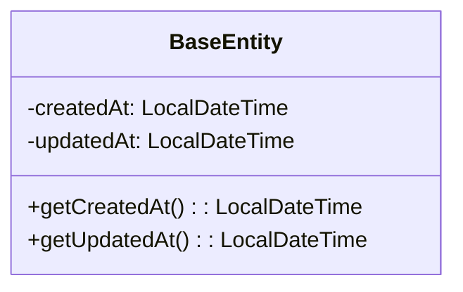
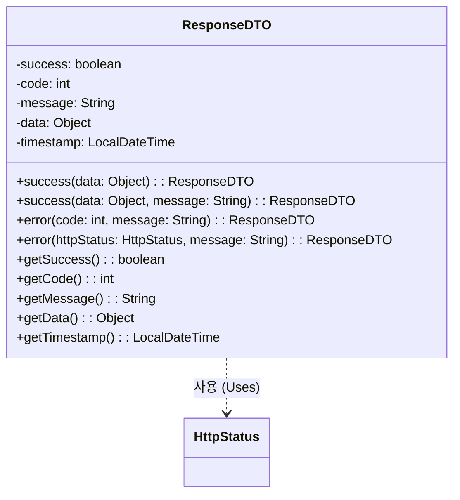
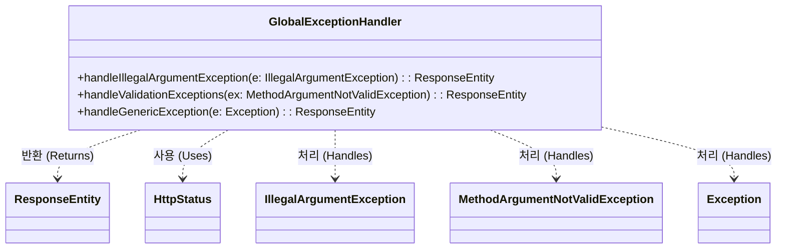
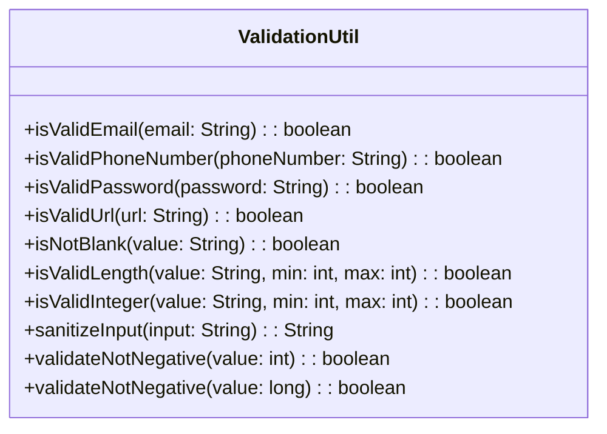
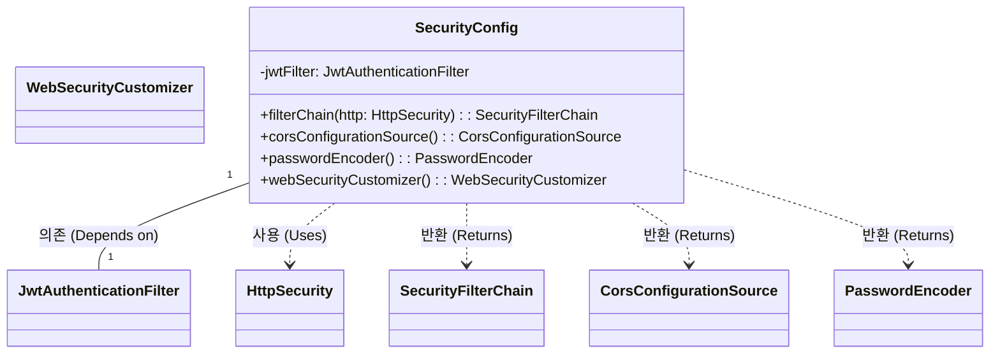
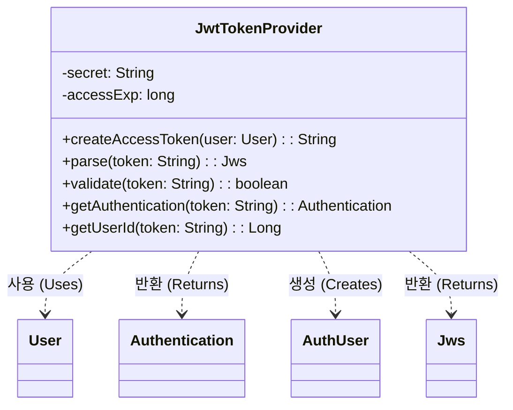

# 1. BaseEntity 클래스

## 1.1. class description
모든 엔티티 클래스가 상속받는 공통 클래스이다. 생성 날짜와 수정 날짜를 자동으로 관리한다. 이 클래스를 상속받은 엔티티들은 데이터베이스에 저장되거나 수정될 때 날짜가 자동으로 설정된다.

## 1.2. attribution 구분

### 1.2.1. createdAt
* **name**: createdAt
* **type**: LocalDateTime
* **visibility**: private
* **description**: 데이터가 생성된 날짜와 시간을 저장한다. 생성 후에는 수정할 수 없다.

### 1.2.2. updatedAt
* **name**: updatedAt
* **type**: LocalDateTime
* **visibility**: private
* **description**: 데이터가 마지막으로 수정된 날짜와 시간을 저장한다. 데이터가 수정될 때마다 자동으로 현재 시간으로 업데이트된다.

## 1.3. Operations 구분

### 1.3.1. getCreatedAt
* **name**: getCreatedAt
* **type**: LocalDateTime
* **visibility**: public
* **description**: createdAt 필드의 값을 반환하는 getter 메서드이다. Lombok의 @Getter 어노테이션에 의해 자동 생성된다.

### 1.3.2. getUpdatedAt
* **name**: getUpdatedAt
* **type**: LocalDateTime
* **visibility**: public
* **description**: updatedAt 필드의 값을 반환하는 getter 메서드이다. Lombok의 @Getter 어노테이션에 의해 자동 생성된다.

# 2. ResponseDTO 클래스

## 2.1. class description
모든 API 응답을 일관된 형식으로 만들기 위한 공통 클래스이다. 성공/실패 여부, 상태 코드, 메시지, 데이터를 포함하여 프론트엔드에서 쉽게 처리할 수 있도록 한다.

## 2.2. attribution 구분

### 2.2.1. success
* **name**: success
* **type**: boolean
* **visibility**: private
* **description**: 요청이 성공했는지 실패했는지를 나타낸다. true면 성공, false면 실패이다.

### 2.2.2. code
* **name**: code
* **type**: int
* **visibility**: private
* **description**: HTTP 상태 코드를 저장한다. 200(성공), 400(잘못된 요청), 500(서버 오류) 등의 값을 가진다.

### 2.2.3. message
* **name**: message
* **type**: String
* **visibility**: private
* **description**: 응답에 대한 설명 메시지이다. 성공 시에는 안내 메시지가, 실패 시에는 오류 원인이 포함된다.

### 2.2.4. data
* **name**: data
* **type**: T (제네릭)
* **visibility**: private
* **description**: 실제 응답 데이터를 저장한다. 어떤 타입의 데이터도 담을 수 있다. 오류 응답의 경우 null일 수 있다.

### 2.2.5. timestamp
* **name**: timestamp
* **type**: LocalDateTime
* **visibility**: private
* **description**: 응답이 생성된 시점의 시간을 저장한다.

## 2.3. Operations 구분

### 2.3.1. success
* **name**: success
* **type**: ResponseDTO\<T\>
* **visibility**: public static
* **description**: 성공 응답을 만드는 메서드이다. 데이터를 받아서 성공 응답 객체를 반환한다.

### 2.3.2. success
* **name**: success
* **type**: ResponseDTO\<T\>
* **visibility**: public static
* **description**: 메시지가 포함된 성공 응답을 만드는 메서드이다. 데이터와 메시지를 받아서 성공 응답 객체를 반환한다.

### 2.3.3. error
* **name**: error
* **type**: ResponseDTO\<void\>
* **visibility**: public static
* **description**: 오류 응답을 만드는 메서드이다. 상태 코드와 메시지를 받아서 오류 응답 객체를 반환한다.

### 2.3.4. error
* **name**: error
* **type**: ResponseDTO\<void\>
* **visibility**: public static
* **description**: HttpStatus 객체를 이용하여 오류 응답을 만드는 메서드이다.

### 2.3.5. getSuccess
* **name**: getSuccess
* **type**: boolean
* **visibility**: public
* **description**: success 필드의 값을 반환하는 메서드이다.

### 2.3.6. getCode
* **name**: getCode
* **type**: int
* **visibility**: public
* **description**: code 필드의 값을 반환하는 메서드이다.

### 2.3.7. getMessage
* **name**: getMessage
* **type**: String
* **visibility**: public
* **description**: message 필드의 값을 반환하는 메서드이다.

### 2.3.8. getData
* **name**: getData
* **type**: T
* **visibility**: public
* **description**: data 필드의 값을 반환하는 메서드이다.

### 2.3.9. getTimestamp
* **name**: getTimestamp
* **type**: LocalDateTime
* **visibility**: public
* **description**: timestamp 필드의 값을 반환하는 메서드이다.

# 3. GlobalExceptionHandler 클래스

## 3.1. class description
애플리케이션에서 발생하는 모든 예외를 처리하는 클래스이다. 컨트롤러에서 발생한 예외를 잡아서 적절한 오류 메시지와 상태 코드를 반환한다.

## 3.2. attribution 구분

* GlobalExceptionHandler 클래스는 필드나 속성을 가지지 않는다. 예외를 처리하는 메서드만 제공한다.

## 3.3. Operations 구분

### 3.3.1. handleIllegalArgumentException
* **name**: handleIllegalArgumentException
* **type**: ResponseEntity\<String\>
* **visibility**: public
* **description**: 잘못된 인자가 전달되었을 때 발생하는 예외를 처리한다. HTTP 400 상태 코드와 함께 오류 메시지를 반환한다.

### 3.3.2. handleValidationExceptions
* **name**: handleValidationExceptions
* **type**: ResponseEntity\<Map\<String, String\>\>
* **visibility**: public
* **description**: 입력값 검증 실패 시 발생하는 예외를 처리한다. 필드별 오류 메시지를 모아서 반환한다. 현재는 첫 번째 오류 메시지만 반환한다.

### 3.3.3. handleGenericException
* **name**: handleGenericException
* **type**: ResponseEntity\<String\>
* **visibility**: public
* **description**: 처리되지 않은 모든 예외를 처리하는 메서드이다. HTTP 500 상태 코드와 함께 일반적인 오류 메시지를 반환한다.

# 4. ValidationUtil 클래스

## 4.1. class description
입력값이 올바른 형식인지 검증하는 유틸리티 클래스이다. 이메일, 전화번호, 비밀번호 등의 형식을 확인하고, 입력값을 정제하는 기능도 제공한다.

## 4.2. attribution 구분

* ValidationUtil 클래스는 필드를 가지지 않는다. 모든 메서드가 static 메서드로 구현되어 있어서 인스턴스를 만들지 않고 사용할 수 있다.

## 4.3. Operations 구분

### 4.3.1. isValidEmail
* **name**: isValidEmail
* **type**: boolean
* **visibility**: public static
* **description**: 이메일 주소가 올바른 형식인지 확인한다. 예: user@example.com

### 4.3.2. isValidPhoneNumber
* **name**: isValidPhoneNumber
* **type**: boolean
* **visibility**: public static
* **description**: 전화번호가 올바른 형식인지 확인한다. 예: 010-1234-5678

### 4.3.3. isValidPassword
* **name**: isValidPassword
* **type**: boolean
* **visibility**: public static
* **description**: 비밀번호가 강력한 비밀번호 정책을 만족하는지 확인한다. 최소 길이, 대소문자, 숫자, 특수문자 포함 여부를 체크한다.

### 4.3.4. isValidUrl
* **name**: isValidUrl
* **type**: boolean
* **visibility**: public static
* **description**: URL이 올바른 형식인지 확인한다. http:// 또는 https://로 시작하는지 체크한다.

### 4.3.5. isNotBlank
* **name**: isNotBlank
* **type**: boolean
* **visibility**: public static
* **description**: 문자열이 비어있지 않은지 확인한다. null이 아니고, 빈 문자열이 아니고, 공백만으로 구성되지 않았는지 체크한다.

### 4.3.6. isValidLength
* **name**: isValidLength
* **type**: boolean
* **visibility**: public static
* **description**: 문자열의 길이가 지정된 최소값과 최대값 사이에 있는지 확인한다.

### 4.3.7. isValidInteger
* **name**: isValidInteger
* **type**: boolean
* **visibility**: public static
* **description**: 문자열이 정수로 변환 가능한지 확인하고, 값이 지정된 범위 안에 있는지 체크한다.

### 4.3.8. sanitizeInput
* **name**: sanitizeInput
* **type**: String
* **visibility**: public static
* **description**: 입력값에서 위험한 문자나 스크립트를 제거하여 안전하게 만든다. 보안을 위해 데이터베이스에 저장하기 전에 사용한다.

### 4.3.9. validateNotNegative
* **name**: validateNotNegative
* **type**: boolean
* **visibility**: public static
* **description**: int 타입 정수 값이 음수가 아닌지 확인한다.

### 4.3.10. validateNotNegative
* **name**: validateNotNegative
* **type**: boolean
* **visibility**: public static
* **description**: long 타입 정수 값이 음수가 아닌지 확인한다.

# 5. SecurityConfig 클래스

## 5.1. class description
Spring Security의 보안 설정을 담당하는 클래스이다. JWT 인증, CORS 설정, 비밀번호 암호화, 접근 권한 관리 등을 설정한다.

## 5.2. attribution 구분

### 5.2.1. jwtFilter
* **name**: jwtFilter
* **type**: JwtAuthenticationFilter
* **visibility**: private
* **description**: JWT 토큰을 검증하는 필터 객체이다. 생성자 주입으로 주입되며, 요청마다 토큰을 검증한다.

## 5.3. Operations 구분

### 5.3.1. filterChain
* **name**: filterChain
* **type**: SecurityFilterChain
* **visibility**: public
* **description**: 보안 필터 체인을 설정하는 메서드이다. 어떤 경로는 인증 없이 접근 가능하고, 어떤 경로는 인증이 필요하도록 설정한다. JWT 인증 필터를 추가하여 토큰 검증을 수행한다.

### 5.3.2. corsConfigurationSource
* **name**: corsConfigurationSource
* **type**: CorsConfigurationSource
* **visibility**: public
* **description**: CORS 설정을 구성하는 메서드이다. 프론트엔드 개발 서버의 요청을 허용하고, 허용할 HTTP 메서드와 헤더를 설정한다.

### 5.3.3. passwordEncoder
* **name**: passwordEncoder
* **type**: PasswordEncoder
* **visibility**: public
* **description**: 비밀번호를 암호화하는 인코더를 만드는 메서드이다. BCrypt 알고리즘을 사용한다.

### 5.3.4. webSecurityCustomizer
* **name**: webSecurityCustomizer
* **type**: WebSecurityCustomizer
* **visibility**: public
* **description**: CSS, JavaScript 같은 정적 파일에 대해서는 보안 검사를 하지 않도록 설정하는 메서드이다.

# 6. JwtTokenProvider 클래스

## 6.1. class description
JWT 토큰을 만들고 검증하는 클래스이다. 사용자 정보를 토큰으로 만들고, 요청 시 토큰을 검증하여 사용자 정보를 추출한다.

## 6.2. attribution 구분

### 6.2.1. secret
* **name**: secret
* **type**: String
* **visibility**: private
* **description**: 토큰을 서명하는 데 사용하는 비밀 키이다. application.yml에서 가져온다. 외부에 노출되면 안 된다.

### 6.2.2. accessExp
* **name**: accessExp
* **type**: long
* **visibility**: private
* **description**: 토큰이 유효한 시간을 초 단위로 저장한다. 기본값은 3600초(1시간)이다. application.yml에서 설정할 수 있다.

## 6.3. Operations 구분

### 6.3.1. createAccessToken
* **name**: createAccessToken
* **type**: String
* **visibility**: public
* **description**: 사용자 정보를 이용해서 JWT 토큰을 만드는 메서드이다. 사용자 ID, 이메일, 역할을 포함한다. 로그인 성공 시 호출된다.

### 6.3.2. parse
* **name**: parse
* **type**: Jws\<Claims\>
* **visibility**: public
* **description**: 토큰 문자열을 읽어서 검증하는 메서드이다. 서명이 유효하고 만료되지 않았는지 확인한다.

### 6.3.3. validate
* **name**: validate
* **type**: boolean
* **visibility**: public
* **description**: 토큰이 유효한지 확인하는 메서드이다. 유효하면 true, 아니면 false를 반환한다.

### 6.3.4. getAuthentication
* **name**: getAuthentication
* **type**: Authentication
* **visibility**: public
* **description**: 토큰에서 사용자 정보를 추출해서 Spring Security의 인증 객체를 만드는 메서드이다.

### 6.3.5. getUserId
* **name**: getUserId
* **type**: Long
* **visibility**: public
* **description**: 토큰에서 사용자 ID만 추출하는 메서드이다.