# MapApiService 클래스

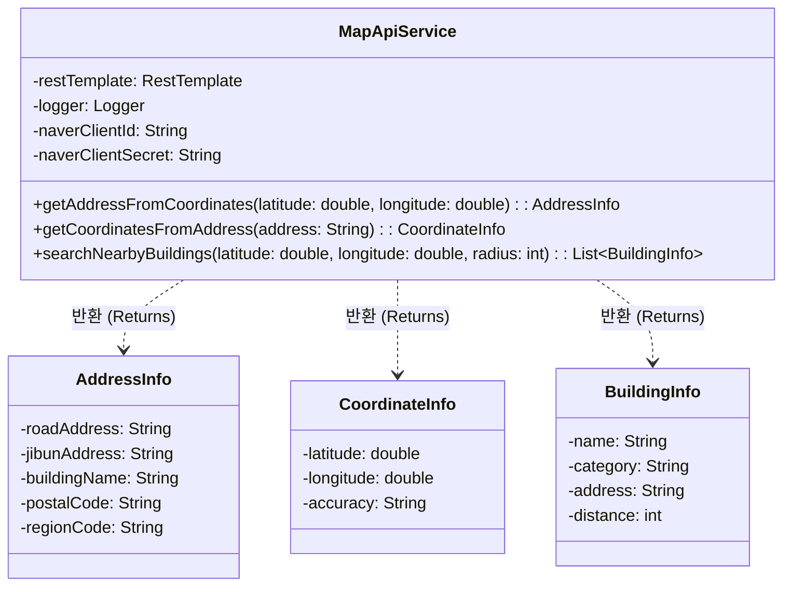

## 1.1. class description

지도 API 연동 서비스로 카카오맵, 네이버맵, 구글맵 등의 API를 통합 관리하는 클래스이다. 좌표를 주소로 변환하는 Reverse Geocoding, 주소를 좌표로 변환하는 Geocoding, 주변 건물 검색 기능을 제공한다. 현재는 네이버 API 구독이 필요하므로 더미 데이터를 사용하여 구현되어 있다.

## 1.2. attribution 구분

### 1.2.1. restTemplate

- **name**: restTemplate
- **type**: RestTemplate
- **visibility**: private
- **description**: HTTP 요청을 수행하기 위한 Spring의 RestTemplate 객체이다. 외부 지도 API 호출 시 사용된다.

### 1.2.2. logger

- **name**: logger
- **type**: Logger
- **visibility**: private
- **description**: SLF4J Logger 객체로 지도 API 호출 및 응답에 대한 로깅을 수행한다. 디버깅 및 모니터링에 사용된다.

### 1.2.3. naverClientId

- **name**: naverClientId
- **type**: String
- **visibility**: private
- **description**: 네이버 지도 API 호출 시 필요한 클라이언트 ID이다. application.yml의 `naver.map.client-id` 설정값이 주입된다.

### 1.2.4. naverClientSecret

- **name**: naverClientSecret
- **type**: String
- **visibility**: private
- **description**: 네이버 지도 API 호출 시 필요한 클라이언트 시크릿 키이다. application.yml의 `naver.map.client-secret` 설정값이 주입된다.

## 1.3. Operations 구분

### 1.3.1. getAddressFromCoordinates

- **name**: getAddressFromCoordinates
- **type**: AddressInfo
- **visibility**: public
- **description**: 좌표(위도, 경도)를 입력받아 해당 위치의 주소 정보를 반환하는 Reverse Geocoding 메서드이다. 좌표 범위에 따라 대구, 부산, 서울 강남, 서울 시청(기본값) 중 하나의 주소 정보를 반환한다. 도로명주소, 지번주소, 건물명, 우편번호, 행정구역코드를 포함한 AddressInfo 객체를 반환한다.

### 1.3.2. getCoordinatesFromAddress

- **name**: getCoordinatesFromAddress
- **type**: CoordinateInfo
- **visibility**: public
- **description**: 주소 문자열을 입력받아 해당 위치의 좌표 정보를 반환하는 Geocoding 메서드이다. 주소에 "대구", "남구", "부산", "서울", "강남" 등의 키워드가 포함되어 있는지 확인하여 해당 지역의 좌표를 반환한다. 위도, 경도, 정확도(EXACT 또는 APPROXIMATE)를 포함한 CoordinateInfo 객체를 반환한다.

### 1.3.3. searchNearbyBuildings

- **name**: searchNearbyBuildings
- **type**: List<BuildingInfo>
- **visibility**: public
- **description**: 특정 좌표를 중심으로 지정된 반경 내의 주변 건물 정보를 검색하는 메서드이다. 현재는 더미 데이터로 "강남역"과 "강남파이낸스센터" 두 개의 건물 정보를 반환한다. 실제 구현 시에는 POI(Point of Interest) 검색 API를 사용할 예정이다. 건물명, 카테고리, 주소, 거리(미터)를 포함한 BuildingInfo 객체의 리스트를 반환한다.

---

# AddressInfo 클래스

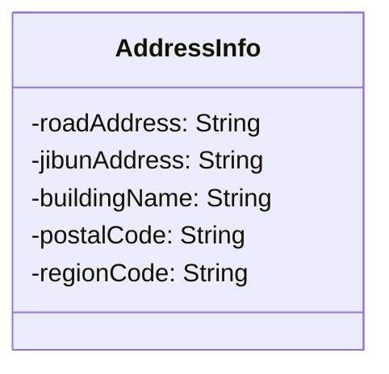

## 2.1. class description

Reverse Geocoding 결과로 반환되는 주소 정보를 담는 DTO(Data Transfer Object) 클래스이다. 좌표를 주소로 변환한 결과를 구조화하여 전달하며, 도로명주소, 지번주소, 건물명, 우편번호, 행정구역코드 등의 상세 주소 정보를 포함한다.

## 2.2. attribution 구분

### 2.2.1. roadAddress

- **name**: roadAddress
- **type**: String
- **visibility**: private
- **description**: 도로명주소 정보이다. 예: "서울 강남구 강남대로 396"

### 2.2.2. jibunAddress

- **name**: jibunAddress
- **type**: String
- **visibility**: private
- **description**: 지번주소 정보이다. 예: "서울 강남구 역삼동 825"

### 2.2.3. buildingName

- **name**: buildingName
- **type**: String
- **visibility**: private
- **description**: 건물명 정보이다. 예: "강남역", "서울시청"

### 2.2.4. postalCode

- **name**: postalCode
- **type**: String
- **visibility**: private
- **description**: 우편번호 정보이다. 예: "06292"

### 2.2.5. regionCode

- **name**: regionCode
- **type**: String
- **visibility**: private
- **description**: 행정구역코드 정보이다. 예: "1168010100"

---

# CoordinateInfo 클래스

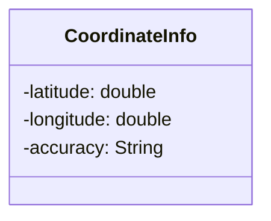

## 3.1. class description

Geocoding 결과로 반환되는 좌표 정보를 담는 DTO(Data Transfer Object) 클래스이다. 주소를 좌표로 변환한 결과를 구조화하여 전달하며, 위도, 경도, 정확도 정보를 포함한다.

## 3.2. attribution 구분

### 3.2.1. latitude

- **name**: latitude
- **type**: double
- **visibility**: private
- **description**: 위도 정보이다. 예: 37.4979 (서울 강남 지역)

### 3.2.2. longitude

- **name**: longitude
- **type**: double
- **visibility**: private
- **description**: 경도 정보이다. 예: 127.0276 (서울 강남 지역)

### 3.2.3. accuracy

- **name**: accuracy
- **type**: String
- **visibility**: private
- **description**: 좌표의 정확도를 나타낸다. "EXACT"(정확한 매칭), "INTERPOLATION"(보간), "APPROXIMATE"(근사값) 중 하나의 값을 가진다.

---

# BuildingInfo 클래스

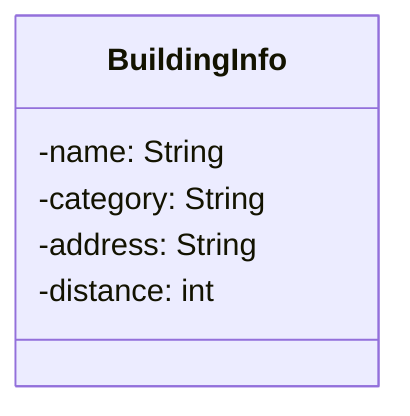

## 4.1. class description

주변 건물 검색 결과로 반환되는 건물 정보를 담는 DTO(Data Transfer Object) 클래스이다. POI(Point of Interest) 검색 결과를 구조화하여 전달하며, 건물명, 카테고리, 주소, 거리 정보를 포함한다.

## 4.2. attribution 구분

### 4.2.1. name

- **name**: name
- **type**: String
- **visibility**: private
- **description**: 건물명 또는 장소명이다. 예: "강남역", "강남파이낸스센터"

### 4.2.2. category

- **name**: category
- **type**: String
- **visibility**: private
- **description**: 건물의 카테고리 또는 유형이다. 예: "지하철역", "오피스빌딩"

### 4.2.3. address

- **name**: address
- **type**: String
- **visibility**: private
- **description**: 건물의 주소 정보이다. 예: "서울 강남구 강남대로 396"

### 4.2.4. distance

- **name**: distance
- **type**: int
- **visibility**: private
- **description**: 검색 기준 좌표로부터의 거리를 미터 단위로 나타낸다. 예: 0 (현재 위치), 200 (200미터 거리)

---

# UserMapState 클래스

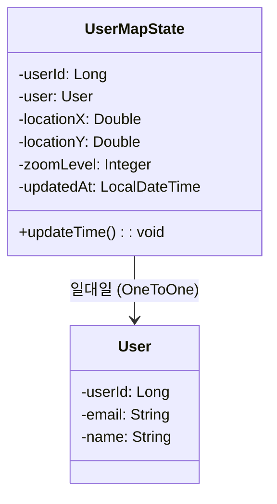

## 5.1. class description

사용자의 지도 상태(마지막 위치와 줌 레벨)를 저장하는 클래스이다. 사용자가 지도를 사용할 때 마지막으로 본 위치와 줌 레벨을 기억하여, 다음 접속 시 동일한 상태로 지도를 표시할 수 있도록 한다. User 엔티티와 일대일 관계를 가지며, userId를 Primary Key로 사용한다.

## 5.2. attribution 구분

### 5.2.1. userId

- **name**: userId
- **type**: Long
- **visibility**: private
- **description**: 사용자를 고유하게 식별하기 위한 primary key이다. User 엔티티의 userId와 동일한 값을 가지며, @MapsId 어노테이션을 통해 User의 ID를 공유한다.

### 5.2.2. user

- **name**: user
- **type**: User
- **visibility**: private
- **description**: 지도 상태를 소유한 사용자 엔티티에 대한 참조이다. @OneToOne 관계로 설정되어 있으며, LAZY 로딩 방식을 사용한다. @MapsId를 통해 userId를 공유한다.

### 5.2.3. locationX

- **name**: locationX
- **type**: Double
- **visibility**: private
- **description**: 사용자가 마지막으로 본 지도의 경도(longitude) 좌표이다. null 값을 허용하며, 사용자가 지도를 처음 사용하는 경우 null일 수 있다.

### 5.2.4. locationY

- **name**: locationY
- **type**: Double
- **visibility**: private
- **description**: 사용자가 마지막으로 본 지도의 위도(latitude) 좌표이다. null 값을 허용하며, 사용자가 지도를 처음 사용하는 경우 null일 수 있다.

### 5.2.5. zoomLevel

- **name**: zoomLevel
- **type**: Integer
- **visibility**: private
- **description**: 사용자가 마지막으로 설정한 지도의 줌 레벨이다. 숫자가 클수록 더 확대된 상태를 의미한다. null 값을 허용하며, 기본 줌 레벨은 클라이언트에서 설정된다.

### 5.2.6. updatedAt

- **name**: updatedAt
- **type**: LocalDateTime
- **visibility**: private
- **description**: 지도 상태가 마지막으로 업데이트된 날짜와 시간이다. @PrePersist와 @PreUpdate를 통해 엔티티가 저장되거나 수정될 때 자동으로 현재 시간으로 갱신된다.

## 5.3. Operations 구분

### 5.3.1. updateTime

- **name**: updateTime
- **type**: void
- **visibility**: public
- **description**: 엔티티가 저장되거나 수정될 때 자동으로 호출되는 메서드이다. @PrePersist와 @PreUpdate 어노테이션이 적용되어 있어, updatedAt 필드를 현재 시간으로 자동 갱신한다. 사용자가 지도 상태를 변경할 때마다 마지막 업데이트 시간이 기록된다.

---

# PropertyMarkerDto 클래스

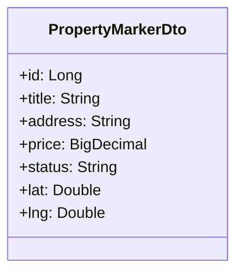

## 6.1. class description

지도에 표시할 매물 마커 정보를 담는 DTO(Data Transfer Object) 클래스이다. Java Record 타입으로 구현되어 불변(immutable) 객체이며, 매물의 기본 정보와 위치 좌표를 포함한다. 지도 API에서 매물 위치를 마커로 표시할 때 사용되며, 사용자가 지도를 탐색할 때 효율적으로 매물 정보를 전달하기 위한 경량화된 데이터 구조이다.

## 6.2. attribution 구분

### 6.2.1. id

- **name**: id
- **type**: Long
- **visibility**: public
- **description**: 매물을 고유하게 식별하기 위한 primary key이다. Property 엔티티의 id와 동일한 값을 가지며, 마커 클릭 시 상세 정보를 조회하는 데 사용된다.

### 6.2.2. title

- **name**: title
- **type**: String
- **visibility**: public
- **description**: 매물의 제목이다. 지도 마커에 마우스를 올렸을 때 또는 마커 클릭 시 표시되는 매물의 간략한 이름이다. 예: "강남역 오피스텔", "서울시청 인근 아파트"

### 6.2.3. address

- **name**: address
- **type**: String
- **visibility**: public
- **description**: 매물의 주소 정보이다. 도로명주소 또는 지번주소가 저장되며, 마커 팝업이나 간략 정보 표시 시 사용된다. 예: "서울 강남구 강남대로 396"

### 6.2.4. price

- **name**: price
- **type**: BigDecimal
- **visibility**: public
- **description**: 매물의 가격 정보이다. 매매가, 전세가, 월세 등의 금액을 나타내며, 지도에서 가격 필터링이나 마커 정보 표시에 사용된다. null 값을 허용하여 가격 미정인 매물도 표시할 수 있다.

### 6.2.5. status

- **name**: status
- **type**: String
- **visibility**: public
- **description**: 매물의 거래 상태를 나타낸다. "AVAILABLE"(거래 가능), "PENDING"(거래 진행 중), "SOLD"(판매 완료), "HIDDEN"(숨김) 중 하나의 값을 가진다. 마커의 색상이나 아이콘을 다르게 표시하는 데 사용된다.

### 6.2.6. lat

- **name**: lat
- **type**: Double
- **visibility**: public
- **description**: 매물의 위도(latitude) 좌표이다. 지도에서 마커를 표시할 Y축 위치를 나타낸다. 예: 37.4979 (서울 강남 지역)

### 6.2.7. lng

- **name**: lng
- **type**: Double
- **visibility**: public
- **description**: 매물의 경도(longitude) 좌표이다. 지도에서 마커를 표시할 X축 위치를 나타낸다. 예: 127.0276 (서울 강남 지역)

## 6.3. Operations 구분

### 6.3.1. Record 특성

- **name**: Record 타입
- **type**: N/A
- **visibility**: N/A
- **description**: PropertyMarkerDto는 Java Record로 구현되어 있어 다음과 같은 특성을 가진다:
  - 모든 필드는 final이며 불변(immutable)이다.
  - 생성자, getter, equals(), hashCode(), toString() 메서드가 자동으로 생성된다.
  - 별도의 setter 메서드가 없어 생성 후 값을 변경할 수 없다.
  - 간결한 문법으로 DTO를 정의할 수 있다.

---

# ChatRoom 클래스

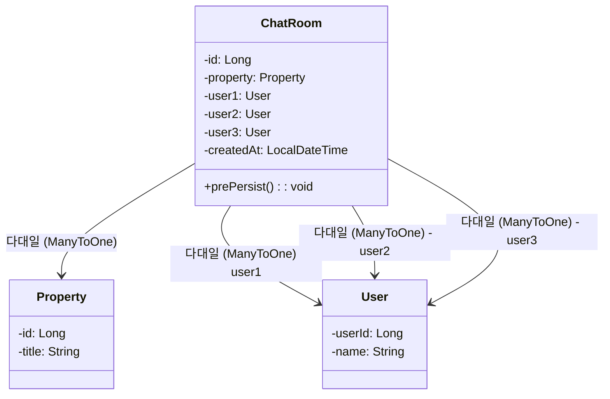

## 7.1. class description

채팅방을 관리하는 클래스이다. 특정 매물에 대해 사용자들 간의 대화를 위한 채팅방을 생성하고 관리한다. 최대 3명의 사용자가 참여할 수 있으며, 일반적으로 매물 소유자, 구매 희망자, 중개인이 참여한다. 동일한 매물과 참여자 조합으로 중복 채팅방이 생성되지 않도록 유니크 제약조건이 설정되어 있다.

## 7.2. attribution 구분

### 7.2.1. id

- **name**: id
- **type**: Long
- **visibility**: private
- **description**: 채팅방을 고유하게 식별하기 위한 primary key로, 데이터베이스에서 자동 생성되는 채팅방의 고유 ID이다.

### 7.2.2. property

- **name**: property
- **type**: Property
- **visibility**: private
- **description**: 채팅방이 연결된 매물 정보이다. 채팅의 주제가 되는 매물을 참조하며, LAZY 로딩 방식을 사용한다. null 값을 허용하지 않는 필수 필드이다.

### 7.2.3. user1

- **name**: user1
- **type**: User
- **visibility**: private
- **description**: 채팅방의 첫 번째 참여자이다. 일반적으로 채팅방을 생성한 사용자(매물 문의자)가 된다. LAZY 로딩 방식을 사용하며, null 값을 허용하지 않는 필수 필드이다.

### 7.2.4. user2

- **name**: user2
- **type**: User
- **visibility**: private
- **description**: 채팅방의 두 번째 참여자이다. 일반적으로 매물 소유자 또는 중개인이 된다. LAZY 로딩 방식을 사용하며, null 값을 허용하지 않는 필수 필드이다.

### 7.2.5. user3

- **name**: user3
- **type**: User
- **visibility**: private
- **description**: 채팅방의 세 번째 참여자이다. 선택적으로 중개인이 참여할 때 사용된다. LAZY 로딩 방식을 사용하며, null 값을 허용하는 선택 필드이다.

### 7.2.6. createdAt

- **name**: createdAt
- **type**: LocalDateTime
- **visibility**: private
- **description**: 채팅방이 생성된 날짜와 시간이다. @PrePersist를 통해 엔티티가 저장될 때 자동으로 현재 시간으로 설정되며, 이후 수정되지 않는다.

## 7.3. Operations 구분

### 7.3.1. prePersist

- **name**: prePersist
- **type**: void
- **visibility**: public
- **description**: 엔티티가 데이터베이스에 저장되기 전에 자동으로 호출되는 메서드이다. @PrePersist 어노테이션이 적용되어 있어, createdAt 필드를 현재 시간으로 자동 설정한다.

## 7.4. Constraints

### 7.4.1. Unique Constraint

- **name**: uniq_room
- **columns**: property_id, user1_id, user2_id
- **description**: 동일한 매물과 동일한 참여자 조합으로 중복 채팅방이 생성되는 것을 방지한다. 같은 매물에 대해 같은 사용자들이 여러 개의 채팅방을 만들 수 없도록 제약한다.

---

# ChatMessage 클래스

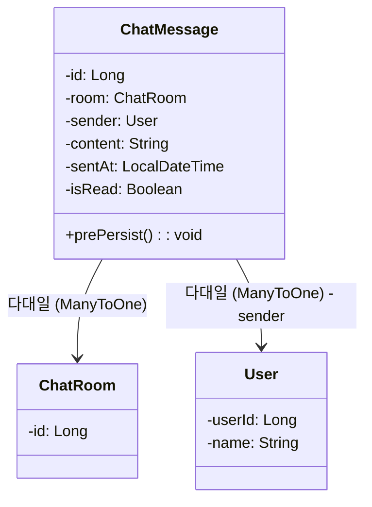

## 8.1. class description

채팅 메시지 정보를 담는 클래스이다. 특정 채팅방에서 사용자가 전송한 메시지의 내용, 발신자, 전송 시간, 읽음 여부 등을 관리한다. 효율적인 메시지 조회를 위해 room_id와 id, 그리고 읽지 않은 메시지 조회를 위한 인덱스가 설정되어 있다.

## 8.2. attribution 구분

### 8.2.1. id

- **name**: id
- **type**: Long
- **visibility**: private
- **description**: 메시지를 고유하게 식별하기 위한 primary key로, 데이터베이스에서 자동 생성되는 메시지의 고유 ID이다.

### 8.2.2. room

- **name**: room
- **type**: ChatRoom
- **visibility**: private
- **description**: 메시지가 속한 채팅방 정보이다. 어느 채팅방에서 전송된 메시지인지를 나타내며, LAZY 로딩 방식을 사용한다. null 값을 허용하지 않는 필수 필드이다.

### 8.2.3. sender

- **name**: sender
- **type**: User
- **visibility**: private
- **description**: 메시지를 전송한 사용자 정보이다. 메시지의 발신자를 나타내며, LAZY 로딩 방식을 사용한다. null 값을 허용하지 않는 필수 필드이다.

### 8.2.4. content

- **name**: content
- **type**: String
- **visibility**: private
- **description**: 메시지의 실제 내용이다. TEXT 타입으로 저장되어 긴 메시지도 저장할 수 있다. null 값을 허용하지 않는 필수 필드이다.

### 8.2.5. sentAt

- **name**: sentAt
- **type**: LocalDateTime
- **visibility**: private
- **description**: 메시지가 전송된 날짜와 시간이다. @PrePersist를 통해 엔티티가 저장될 때 자동으로 현재 시간으로 설정된다. null 값을 허용하지 않는 필수 필드이다.

### 8.2.6. isRead

- **name**: isRead
- **type**: Boolean
- **visibility**: private
- **description**: 메시지의 읽음 여부를 나타낸다. 기본값은 false이며, 수신자가 메시지를 읽으면 true로 변경된다. 읽지 않은 메시지 개수를 계산하거나 알림을 표시하는 데 사용된다.

## 8.3. Operations 구분

### 8.3.1. prePersist

- **name**: prePersist
- **type**: void
- **visibility**: public
- **description**: 엔티티가 데이터베이스에 저장되기 전에 자동으로 호출되는 메서드이다. @PrePersist 어노테이션이 적용되어 있어, sentAt 필드를 현재 시간으로 자동 설정한다.

## 8.4. Indexes

### 8.4.1. idx_msg_room_id_id_asc

- **name**: idx_msg_room_id_id_asc
- **columns**: room_id, id
- **description**: 특정 채팅방의 메시지를 ID 순서대로 빠르게 조회하기 위한 복합 인덱스이다. 채팅방별 메시지 목록 조회 성능을 향상시킨다.

### 8.4.2. idx_msg_room_sender_unread

- **name**: idx_msg_room_sender_unread
- **columns**: room_id, sender_id, is_read
- **description**: 특정 채팅방에서 특정 발신자의 읽지 않은 메시지를 빠르게 조회하기 위한 복합 인덱스이다. 읽지 않은 메시지 개수 계산 및 알림 기능의 성능을 향상시킨다.

---

# Notification 클래스

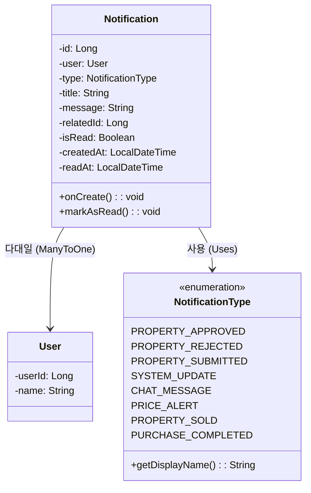

## 9.1. class description

사용자에게 전송되는 알림 정보를 관리하는 클래스이다. 매물 승인/거절, 채팅 메시지, 가격 알림, 시스템 업데이트 등 다양한 유형의 알림을 통합 관리한다. 알림의 읽음 여부를 추적하고, 관련 엔티티와의 연결을 통해 알림 클릭 시 해당 페이지로 이동할 수 있도록 지원한다.

## 9.2. attribution 구분

### 9.2.1. id

- **name**: id
- **type**: Long
- **visibility**: private
- **description**: 알림을 고유하게 식별하기 위한 primary key로, 데이터베이스에서 자동 생성되는 알림의 고유 ID이다.

### 9.2.2. user

- **name**: user
- **type**: User
- **visibility**: private
- **description**: 알림을 받을 사용자 정보이다. LAZY 로딩 방식을 사용하며, null 값을 허용하지 않는 필수 필드이다.

### 9.2.3. type

- **name**: type
- **type**: NotificationType
- **visibility**: private
- **description**: 알림의 유형을 나타내는 열거형 필드이다. PROPERTY_APPROVED, PROPERTY_REJECTED, CHAT_MESSAGE, PRICE_ALERT 등의 값을 가지며, 알림의 종류에 따라 다른 아이콘이나 색상을 표시하는 데 사용된다. 최대 50자로 제한되며, null 값을 허용하지 않는 필수 필드이다.

### 9.2.4. title

- **name**: title
- **type**: String
- **visibility**: private
- **description**: 알림의 제목이다. 알림 목록에서 표시되는 간략한 제목으로, 최대 200자로 제한된다. null 값을 허용하지 않는 필수 필드이다.

### 9.2.5. message

- **name**: message
- **type**: String
- **visibility**: private
- **description**: 알림의 상세 내용이다. TEXT 타입으로 저장되어 긴 메시지도 저장할 수 있다. null 값을 허용하지 않는 필수 필드이다.

### 9.2.6. relatedId

- **name**: relatedId
- **type**: Long
- **visibility**: private
- **description**: 알림과 관련된 엔티티의 ID이다. 예를 들어 매물 신청 알림의 경우 OwnershipClaim의 ID, 채팅 메시지 알림의 경우 ChatRoom의 ID가 저장된다. 알림 클릭 시 해당 페이지로 이동하는 데 사용되며, null 값을 허용한다.

### 9.2.7. isRead

- **name**: isRead
- **type**: Boolean
- **visibility**: private
- **description**: 알림의 읽음 여부를 나타낸다. 기본값은 false이며, 사용자가 알림을 확인하면 true로 변경된다. 읽지 않은 알림 개수를 계산하는 데 사용된다.

### 9.2.8. createdAt

- **name**: createdAt
- **type**: LocalDateTime
- **visibility**: private
- **description**: 알림이 생성된 날짜와 시간이다. @PrePersist를 통해 엔티티가 저장될 때 자동으로 현재 시간으로 설정되며, 이후 수정되지 않는다.

### 9.2.9. readAt

- **name**: readAt
- **type**: LocalDateTime
- **visibility**: private
- **description**: 알림을 읽은 날짜와 시간이다. markAsRead() 메서드 호출 시 현재 시간으로 설정되며, null 값을 허용한다.

## 9.3. Operations 구분

### 9.3.1. onCreate

- **name**: onCreate
- **type**: void
- **visibility**: protected
- **description**: 엔티티가 데이터베이스에 저장되기 전에 자동으로 호출되는 메서드이다. @PrePersist 어노테이션이 적용되어 있어, createdAt 필드를 현재 시간으로 자동 설정한다.

### 9.3.2. markAsRead

- **name**: markAsRead
- **type**: void
- **visibility**: public
- **description**: 알림을 읽음 처리하는 메서드이다. isRead를 true로 설정하고, readAt을 현재 시간으로 설정한다. 사용자가 알림을 클릭하거나 확인했을 때 호출된다.

## 9.4. NotificationType Enum

### 9.4.1. Enum Values

- **PROPERTY_APPROVED**: 매물 승인 알림 (displayName: "매물 승인")
- **PROPERTY_REJECTED**: 매물 거절 알림 (displayName: "매물 거절")
- **PROPERTY_SUBMITTED**: 매물 신청 알림 (displayName: "매물 신청")
- **SYSTEM_UPDATE**: 시스템 업데이트 알림 (displayName: "시스템 업데이트")
- **CHAT_MESSAGE**: 새 메시지 알림 (displayName: "새 메시지")
- **PRICE_ALERT**: 가격 알림 (displayName: "가격 알림")
- **PROPERTY_SOLD**: 찜한 매물 거래 완료 알림 (displayName: "찜한 매물 거래 완료")
- **PURCHASE_COMPLETED**: 구매 완료 알림 (displayName: "구매 완료")

### 9.4.2. getDisplayName()

- **name**: getDisplayName
- **type**: String
- **visibility**: public
- **description**: 알림 유형의 한글 표시명을 반환하는 메서드이다. UI에서 사용자에게 알림 유형을 표시할 때 사용된다.

---

# PriceAlert 클래스

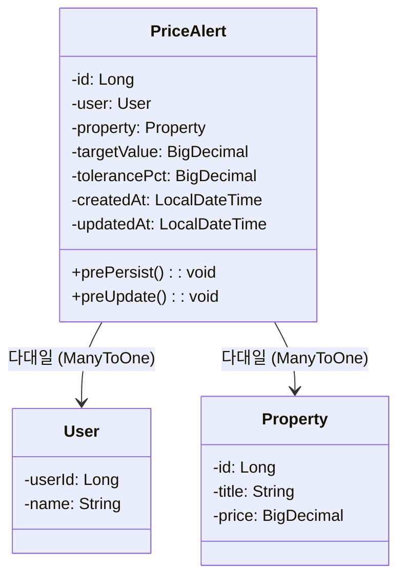

## 10.1. class description

가격 기반 알림 조건을 관리하는 클래스이다. 사용자가 특정 매물의 가격이 목표 가격에 도달하거나 허용 오차 범위 내에 들어올 때 알림을 받을 수 있도록 설정한다. 매물 가격 변동을 모니터링하여 사용자가 원하는 가격대의 매물을 놓치지 않도록 지원한다.

## 10.2. attribution 구분

### 10.2.1. id

- **name**: id
- **type**: Long
- **visibility**: private
- **description**: 가격 알림을 고유하게 식별하기 위한 primary key로, 데이터베이스에서 자동 생성되는 알림의 고유 ID이다.

### 10.2.2. user

- **name**: user
- **type**: User
- **visibility**: private
- **description**: 가격 알림을 설정한 사용자 정보이다. LAZY 로딩 방식을 사용하며, null 값을 허용하지 않는 필수 필드이다.

### 10.2.3. property

- **name**: property
- **type**: Property
- **visibility**: private
- **description**: 가격 알림을 설정한 매물 정보이다. 해당 매물의 가격 변동을 모니터링한다. LAZY 로딩 방식을 사용하며, null 값을 허용하지 않는 필수 필드이다.

### 10.2.4. targetValue

- **name**: targetValue
- **type**: BigDecimal
- **visibility**: private
- **description**: 사용자가 설정한 목표 가격이다. 매물 가격이 이 값에 도달하거나 허용 오차 범위 내에 들어오면 알림이 발송된다. precision 14, scale 2로 설정되어 최대 12자리 정수와 2자리 소수를 저장할 수 있다. null 값을 허용하지 않는 필수 필드이다.

### 10.2.5. tolerancePct

- **name**: tolerancePct
- **type**: BigDecimal
- **visibility**: private
- **description**: 목표 가격의 허용 오차 비율(%)이다. 예를 들어 5%로 설정하면 목표 가격의 ±5% 범위 내에서 알림이 발송된다. precision 5, scale 2로 설정되어 최대 3자리 정수와 2자리 소수를 저장할 수 있다. null 값을 허용한다.

### 10.2.6. createdAt

- **name**: createdAt
- **type**: LocalDateTime
- **visibility**: private
- **description**: 가격 알림이 생성된 날짜와 시간이다. @PrePersist를 통해 엔티티가 저장될 때 자동으로 현재 시간으로 설정되며, 이후 수정되지 않는다.

### 10.2.7. updatedAt

- **name**: updatedAt
- **type**: LocalDateTime
- **visibility**: private
- **description**: 가격 알림이 마지막으로 수정된 날짜와 시간이다. @PrePersist와 @PreUpdate를 통해 엔티티가 저장되거나 수정될 때 자동으로 현재 시간으로 갱신된다.

## 10.3. Operations 구분

### 10.3.1. prePersist

- **name**: prePersist
- **type**: void
- **visibility**: public
- **description**: 엔티티가 데이터베이스에 저장되기 전에 자동으로 호출되는 메서드이다. @PrePersist 어노테이션이 적용되어 있어, createdAt과 updatedAt 필드를 현재 시간으로 자동 설정한다.

### 10.3.2. preUpdate

- **name**: preUpdate
- **type**: void
- **visibility**: public
- **description**: 엔티티가 수정될 때 자동으로 호출되는 메서드이다. @PreUpdate 어노테이션이 적용되어 있어, updatedAt 필드를 현재 시간으로 자동 갱신한다.

---

# ScoreAlert 클래스

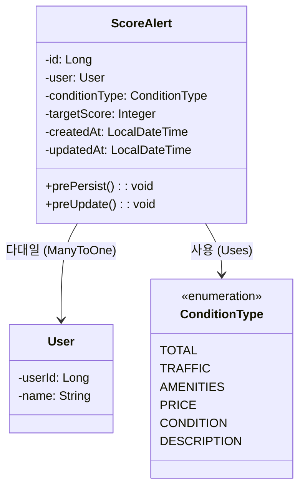

## 11.1. class description

점수 기반 알림 조건을 관리하는 클래스이다. 사용자가 특정 평가 항목(교통, 편의시설, 가격, 상태 등)의 점수가 목표 점수 이상인 매물이 등록될 때 알림을 받을 수 있도록 설정한다. 매물의 다양한 평가 지표를 기반으로 사용자의 선호도에 맞는 매물을 자동으로 추천하고 알림을 제공한다.

## 11.2. attribution 구분

### 11.2.1. id

- **name**: id
- **type**: Long
- **visibility**: private
- **description**: 점수 알림을 고유하게 식별하기 위한 primary key로, 데이터베이스에서 자동 생성되는 알림의 고유 ID이다.

### 11.2.2. user

- **name**: user
- **type**: User
- **visibility**: private
- **description**: 점수 알림을 설정한 사용자 정보이다. LAZY 로딩 방식을 사용하며, null 값을 허용하지 않는 필수 필드이다.

### 11.2.3. conditionType

- **name**: conditionType
- **type**: ConditionType
- **visibility**: private
- **description**: 평가 조건의 유형을 나타내는 열거형 필드이다. TOTAL(종합 점수), TRAFFIC(교통 점수), AMENITIES(편의시설 점수), PRICE(가격 점수), CONDITION(상태 점수), DESCRIPTION(설명 점수) 중 하나의 값을 가진다. 최대 32자로 제한되며, null 값을 허용하지 않는 필수 필드이다.

### 11.2.4. targetScore

- **name**: targetScore
- **type**: Integer
- **visibility**: private
- **description**: 사용자가 설정한 최소 목표 점수이다. 매물의 해당 평가 항목 점수가 이 값 이상일 때 알림이 발송된다. null 값을 허용하지 않는 필수 필드이다.

### 11.2.5. createdAt

- **name**: createdAt
- **type**: LocalDateTime
- **visibility**: private
- **description**: 점수 알림이 생성된 날짜와 시간이다. @PrePersist를 통해 엔티티가 저장될 때 자동으로 현재 시간으로 설정되며, 이후 수정되지 않는다.

### 11.2.6. updatedAt

- **name**: updatedAt
- **type**: LocalDateTime
- **visibility**: private
- **description**: 점수 알림이 마지막으로 수정된 날짜와 시간이다. @PrePersist와 @PreUpdate를 통해 엔티티가 저장되거나 수정될 때 자동으로 현재 시간으로 갱신된다.

## 11.3. Operations 구분

### 11.3.1. prePersist

- **name**: prePersist
- **type**: void
- **visibility**: public
- **description**: 엔티티가 데이터베이스에 저장되기 전에 자동으로 호출되는 메서드이다. @PrePersist 어노테이션이 적용되어 있어, createdAt과 updatedAt 필드를 현재 시간으로 자동 설정한다.

### 11.3.2. preUpdate

- **name**: preUpdate
- **type**: void
- **visibility**: public
- **description**: 엔티티가 수정될 때 자동으로 호출되는 메서드이다. @PreUpdate 어노테이션이 적용되어 있어, updatedAt 필드를 현재 시간으로 자동 갱신한다.

## 11.4. ConditionType Enum

### 11.4.1. Enum Values

- **TOTAL**: 종합 점수 - 모든 평가 항목을 종합한 전체 점수
- **TRAFFIC**: 교통 점수 - 대중교통 접근성, 주요 도로 접근성 등
- **AMENITIES**: 편의시설 점수 - 주변 편의시설(마트, 병원, 학교 등)의 접근성
- **PRICE**: 가격 점수 - 가격 대비 가치 평가
- **CONDITION**: 상태 점수 - 매물의 물리적 상태 및 관리 상태
- **DESCRIPTION**: 설명 점수 - 매물 설명의 상세도 및 품질

---

# AlertNotification 클래스

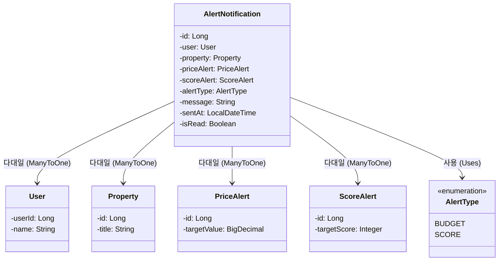

## 12.1. class description

가격 또는 점수 알림 조건이 충족되었을 때 발송되는 알림 정보를 관리하는 클래스이다. PriceAlert 또는 ScoreAlert에서 설정한 조건이 만족되면 자동으로 생성되어 사용자에게 전송된다. 어떤 알림 조건에 의해 발송되었는지, 어떤 매물에 대한 알림인지 등의 정보를 포함한다.

## 12.2. attribution 구분

### 12.2.1. id

- **name**: id
- **type**: Long
- **visibility**: private
- **description**: 알림을 고유하게 식별하기 위한 primary key로, 데이터베이스에서 자동 생성되는 알림의 고유 ID이다.

### 12.2.2. user

- **name**: user
- **type**: User
- **visibility**: private
- **description**: 알림을 받을 사용자 정보이다. LAZY 로딩 방식을 사용하며, null 값을 허용하지 않는 필수 필드이다.

### 12.2.3. property

- **name**: property
- **type**: Property
- **visibility**: private
- **description**: 알림과 관련된 매물 정보이다. 조건을 충족한 매물을 나타낸다. LAZY 로딩 방식을 사용하며, null 값을 허용한다.

### 12.2.4. priceAlert

- **name**: priceAlert
- **type**: PriceAlert
- **visibility**: private
- **description**: 이 알림을 발생시킨 가격 알림 조건이다. alertType이 BUDGET인 경우에만 값이 설정된다. LAZY 로딩 방식을 사용하며, null 값을 허용한다.

### 12.2.5. scoreAlert

- **name**: scoreAlert
- **type**: ScoreAlert
- **visibility**: private
- **description**: 이 알림을 발생시킨 점수 알림 조건이다. alertType이 SCORE인 경우에만 값이 설정된다. LAZY 로딩 방식을 사용하며, null 값을 허용한다.

### 12.2.6. alertType

- **name**: alertType
- **type**: AlertType
- **visibility**: private
- **description**: 알림의 유형을 나타내는 열거형 필드이다. BUDGET(가격 알림) 또는 SCORE(점수 알림) 중 하나의 값을 가진다. 최대 16자로 제한되며, null 값을 허용하지 않는 필수 필드이다.

### 12.2.7. message

- **name**: message
- **type**: String
- **visibility**: private
- **description**: 알림의 상세 메시지이다. 어떤 조건이 충족되었는지, 매물의 어떤 정보가 변경되었는지 등을 설명한다. TEXT 타입으로 저장되어 긴 메시지도 저장할 수 있으며, null 값을 허용한다.

### 12.2.8. sentAt

- **name**: sentAt
- **type**: LocalDateTime
- **visibility**: private
- **description**: 알림이 발송된 날짜와 시간이다. null 값을 허용한다.

### 12.2.9. isRead

- **name**: isRead
- **type**: Boolean
- **visibility**: private
- **description**: 알림의 읽음 여부를 나타낸다. 기본값은 false이며, 사용자가 알림을 확인하면 true로 변경된다. null 값을 허용하지 않는 필수 필드이다.

## 12.3. AlertType Enum

### 12.3.1. Enum Values

- **BUDGET**: 가격 기반 알림 - PriceAlert 조건이 충족되었을 때 발송
- **SCORE**: 점수 기반 알림 - ScoreAlert 조건이 충족되었을 때 발송
