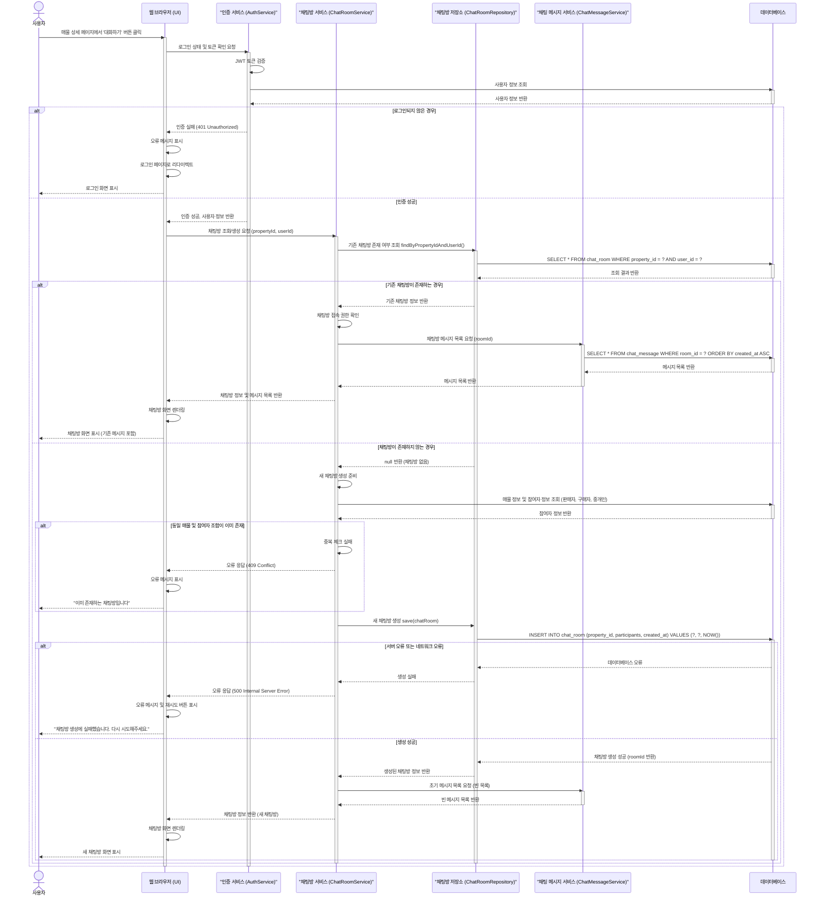

# 도림이의 use case 9번 기능 예시

```mermaid
sequenceDiagram
    actor User as 사용자
    participant Browser as 웹 브라우저 (UI)
    participant Auth as "인증 서비스 (AuthService)"
    participant ChatService as "채팅방 서비스 (ChatRoomService)"
    participant ChatRepo as "채팅방 저장소 (ChatRoomRepository)"
    participant MessageService as "채팅 메시지 서비스 (ChatMessageService)"
    participant DB as 데이터베이스

    %% Main Success Scenario %%

    User->>Browser: 매물 상세 페이지에서 '대화하기' 버튼 클릭
    activate Browser

    Browser->>Auth: 로그인 상태 및 토큰 확인 요청
    activate Auth

    Auth->>Auth: JWT 토큰 검증
    Auth->>DB: 사용자 정보 조회
    activate DB
    DB-->>Auth: 사용자 정보 반환
    deactivate DB

    alt 로그인되지 않은 경우
        Auth-->>Browser: 인증 실패 (401 Unauthorized)
        Browser->>Browser: 오류 메시지 표시
        Browser->>Browser: 로그인 페이지로 리다이렉트
        Browser-->>User: 로그인 화면 표시
    else 인증 성공
        Auth-->>Browser: 인증 성공, 사용자 정보 반환

        Browser->>ChatService: 채팅방 조회/생성 요청 (propertyId, userId)
        activate ChatService

        ChatService->>ChatRepo: 기존 채팅방 존재 여부 조회 findByPropertyIdAndUserId()
        activate ChatRepo

        ChatRepo->>DB: SELECT * FROM chat_room WHERE property_id = ? AND user_id = ?
        activate DB
        DB-->>ChatRepo: 조회 결과 반환
        deactivate DB

        alt 기존 채팅방이 존재하는 경우
            ChatRepo-->>ChatService: 기존 채팅방 정보 반환
            
            ChatService->>ChatService: 채팅방 접속 권한 확인
            
            ChatService->>MessageService: 채팅방 메시지 목록 요청 (roomId)
            activate MessageService
            
            MessageService->>DB: SELECT * FROM chat_message WHERE room_id = ? ORDER BY created_at ASC
            activate DB
            DB-->>MessageService: 메시지 목록 반환
            deactivate DB
            
            MessageService-->>ChatService: 메시지 목록 반환
            deactivate MessageService
            
            ChatService-->>Browser: 채팅방 정보 및 메시지 목록 반환
            
            Browser->>Browser: 채팅방 화면 렌더링
            Browser-->>User: 채팅방 화면 표시 (기존 메시지 포함)

        else 채팅방이 존재하지 않는 경우
            ChatRepo-->>ChatService: null 반환 (채팅방 없음)
            
            ChatService->>ChatService: 새 채팅방 생성 준비
            
            ChatService->>DB: 매물 정보 및 참여자 정보 조회 (판매자, 구매자, 중개인)
            activate DB
            DB-->>ChatService: 참여자 정보 반환
            deactivate DB
            
            alt 동일 매물 및 참여자 조합이 이미 존재
                ChatService->>ChatService: 중복 체크 실패
                ChatService-->>Browser: 오류 응답 (409 Conflict)
                Browser->>Browser: 오류 메시지 표시
                Browser-->>User: "이미 존재하는 채팅방입니다"
            end
            
            ChatService->>ChatRepo: 새 채팅방 생성 save(chatRoom)
            
            ChatRepo->>DB: INSERT INTO chat_room (property_id, participants, created_at) VALUES (?, ?, NOW())
            activate DB
            
            alt 서버 오류 또는 네트워크 오류
                DB-->>ChatRepo: 데이터베이스 오류
                ChatRepo-->>ChatService: 생성 실패
                ChatService-->>Browser: 오류 응답 (500 Internal Server Error)
                Browser->>Browser: 오류 메시지 및 재시도 버튼 표시
                Browser-->>User: "채팅방 생성에 실패했습니다. 다시 시도해주세요."
            else 생성 성공
                DB-->>ChatRepo: 채팅방 생성 성공 (roomId 반환)
                ChatRepo-->>ChatService: 생성된 채팅방 정보 반환
                
                ChatService->>MessageService: 초기 메시지 목록 요청 (빈 목록)
                activate MessageService
                MessageService-->>ChatService: 빈 메시지 목록 반환
                deactivate MessageService
                
                ChatService-->>Browser: 채팅방 정보 반환 (새 채팅방)
                
                Browser->>Browser: 채팅방 화면 렌더링
                Browser-->>User: 새 채팅방 화면 표시
            end
            deactivate DB
        end
        deactivate ChatRepo
        deactivate ChatService
    end
    deactivate Auth
    deactivate Browser
```
