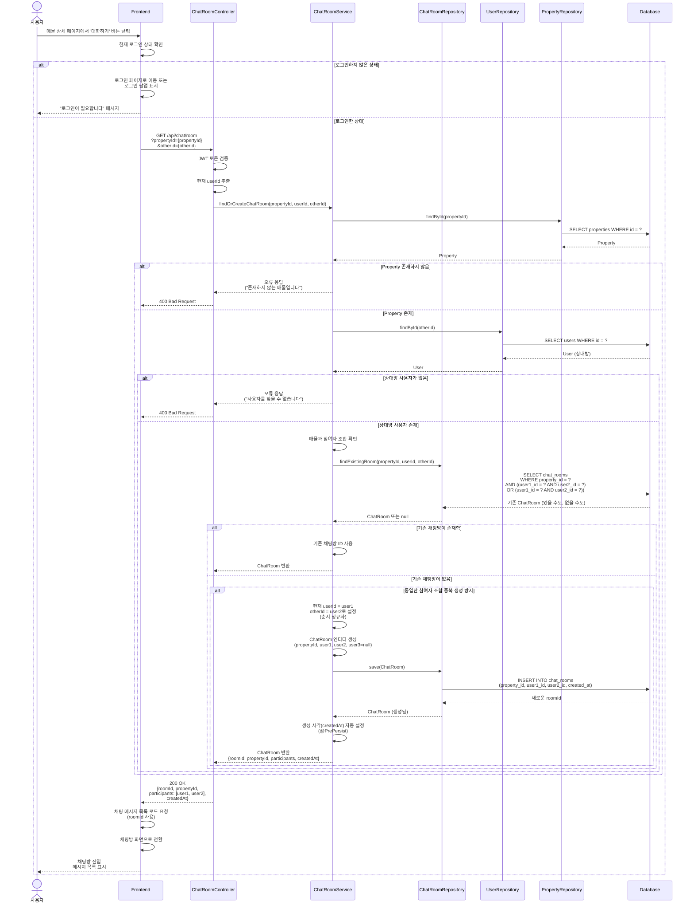
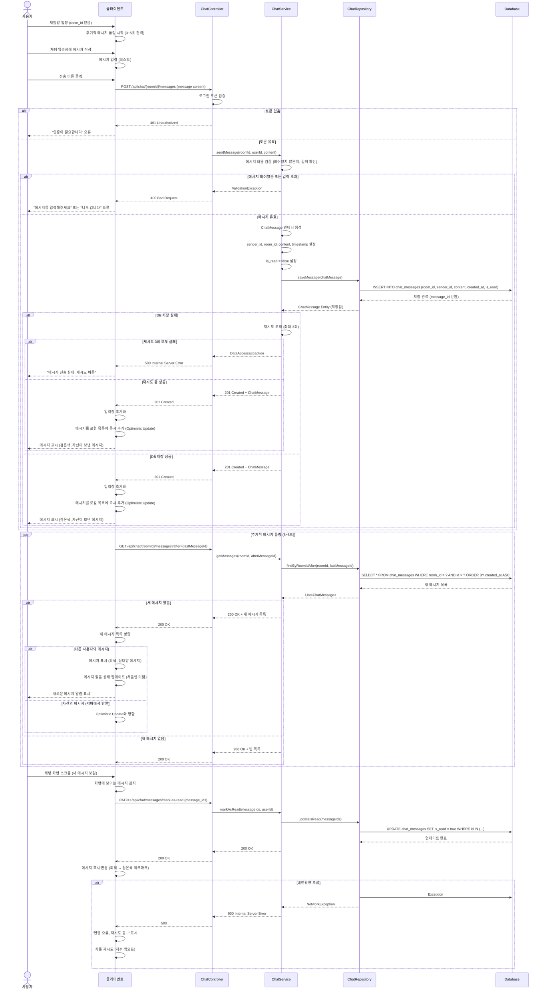
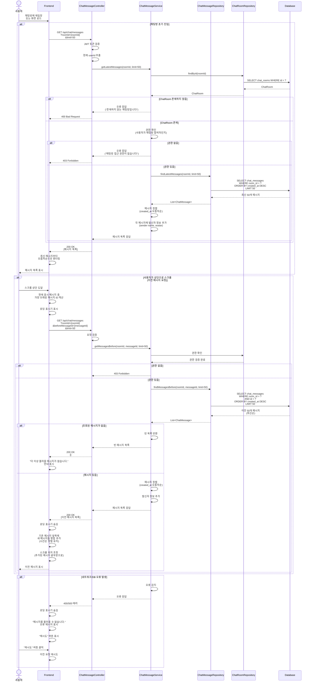
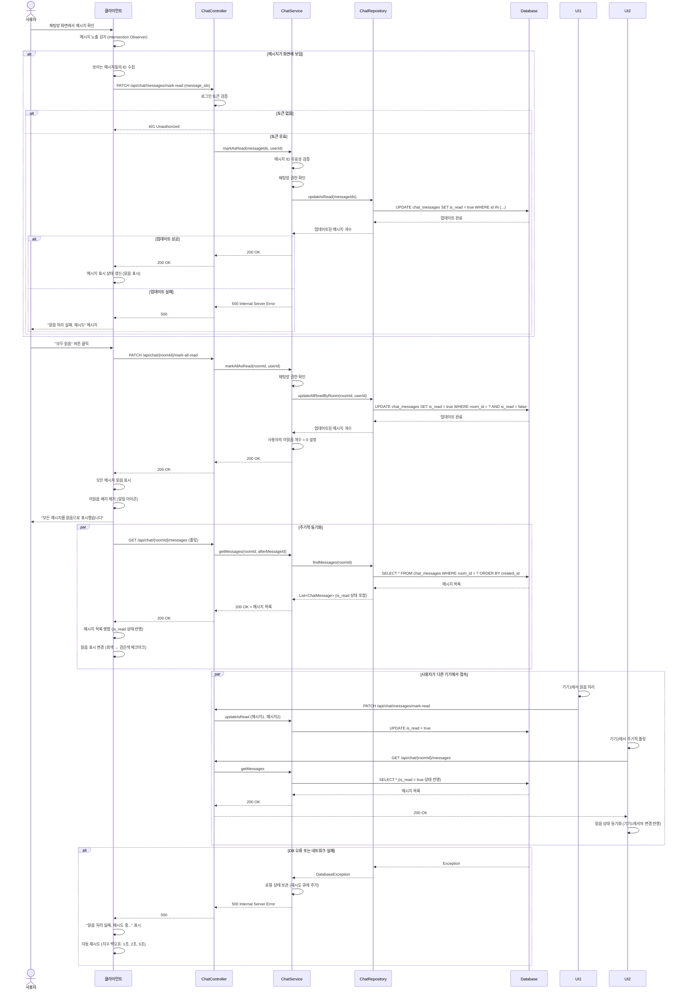
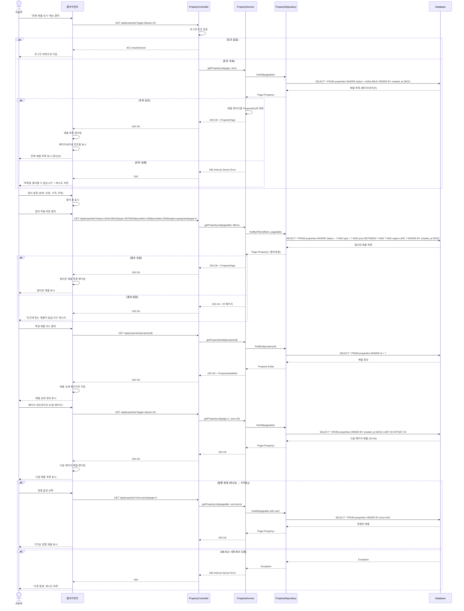
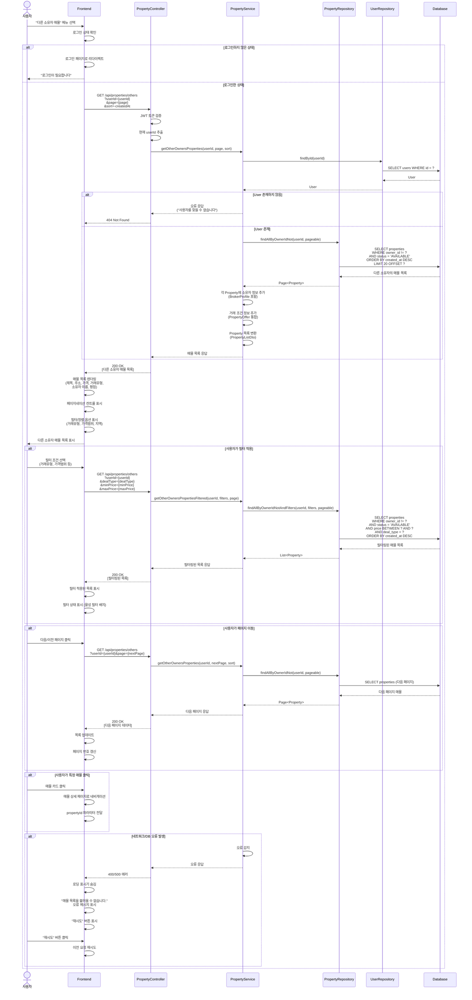
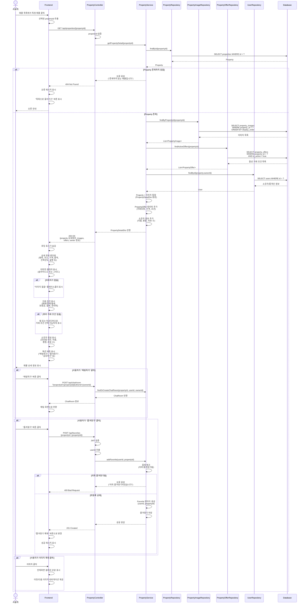

# 9번

---

# 9번 기능 설명: 채팅방 접속 및 생성
이 시퀀스 다이어그램은 사용자가 매물 상세 페이지에서 ‘대화하기’ 버튼을 클릭했을 때,
시스템이 기존 채팅방을 조회하거나, 없을 경우 새로운 채팅방을 생성해 입장하는 전체 과정을 나타냅니다.

## 채팅 요청 및 로그인 확인
* **요청:** 사용자가 매물 상세 화면에서 ‘대화하기’ 버튼을 클릭합니다.
* **인증 및 위임:** 프런트엔드는 로그인 상태를 확인하며, 미로그인 시 로그인 화면 또는 팝업으로 이동합니다.
  로그인된 경우 요청을 보냅니다.

## 채팅방 존재 여부 확인
* **토큰 검증:** ChatRoomController가 JWT를 검증하여 사용자 인증 상태를 확인합니다.
* **서비스 위임:** 컨트롤러는 ChatRoomService.findOrCreateChatRoom()을 호출해 로직을 위임합니다.

## 매물 및 사용자 유효성 검증
* **매물 확인:** PropertyRepository에서 매물을 조회하고 없으면 "존재하지 않는 매물입니다" 오류를 반환합니다.
* **사용자 확인:** 매물이 존재하면 UserRepository에서 상대 사용자를 조회하며, 없을 경우 "사용자를 찾을 수 없습니다" 오류를 반환합니다.

## 기존 채팅방 조회 및 생성
* **중복 조회:** 두 사용자가 동일 매물에서 대화 중인지 확인합니다.
  기존 방이 있으면 해당 roomId를 반환하고, 없으면 새로운 방을 생성합니다.
* **엔티티 생성:** ChatRoom 엔티티를 생성하고 DB에 저장합니다.

## 결과 반환 및 화면 전환
* **응답 반환:** 컨트롤러가 200 OK를 반환하며 roomId, participants 정보를 전달합니다.
* **UI 반영:** 프런트엔드는 roomId로 메시지를 로드하고 채팅 화면으로 전환합니다.
* **사용자 피드백:** “채팅방에 입장하였습니다.” 안내 표시 후 대화 시작.

---
 
# 10번

---

# 10번 기능 설명: 메시지 송수신
이 시퀀스 다이어그램은 사용자가 채팅방에서 메시지를 작성하고 전송, 그리고 서버에 저장된 메시지를 주기적으로 조회(폴링) 하여 표시하는 전체 과정을 설명합니다.

## 메시지 전송 및 검증
* **요청:** 사용자가 채팅 입력창에서 메시지를 입력하고 “전송”을 누릅니다.
* **인증:** ChatController가 JWT를 검증하며, 미인증 시 401 Unauthorized를 반환합니다.
* **검증:** ChatService가 비어 있거나 너무 긴 메시지를 거부합니다.

## 메시지 저장
* **DB 저장:** ChatRepository가 메시지를 chat_messages 테이블에 INSERT 합니다.
  실패 시 최대 3회 재시도 후 오류 반환.
* **성공 시:** 201 Created 응답과 함께 messageId를 반환하며,
  클라이언트는 입력창을 초기화하고 Optimistic Update로 메시지를 즉시 표시합니다.

## 주기적 폴링 (3~5초)
* **DB 조회:** 새로운 메시지만 반환하여 UI에 병합합니다.
  - 상대방 메시지: 회색
  - 본인 메시지: 검정

## 읽음 처리
* **UI 동작:** 사용자가 스크롤하여 메시지를 읽으면
  PATCH /api/chat/messages/mark-as-read 요청을 보냅니다.
* **DB 업데이트:** is_read=true로 갱신 후 UI에서 체크마크 표시.

## 오류 처리
* **네트워크 오류:** UI는 “연결 오류, 재시도 중...” 메시지를 표시하고 지수 백오프 방식으로 재시도합니다.

---

# 11번

---

# 11번 기능 설명: 기존 대화 내역 불러오기
이 시퀀스 다이어그램은 사용자가 채팅방에 다시 입장했을 때
기존 메시지 내역을 불러오거나, 스크롤을 통해 이전 메시지를 추가 조회하는 과정을 나타냅니다.

## 채팅방 초기 진입
* **요청:** GET /api/chat/messages?roomId={roomId}&limit=50 요청.
* **검증:** ChatMessageController가 JWT를 검증하고 참여자 권한을 확인합니다.
* **조회:** ChatMessageRepository가 최신 50개의 메시지를 가져옵니다.
* **정렬:** 시간순으로 정렬 후 UI에 표시.

## 과거 메시지 조회
* **스크롤 동작:** 사용자가 상단에 도달하면 가장 오래된 메시지 ID 기준으로
  GET /api/chat/messages?beforeMessageId={id} 요청을 보냅니다.
* **결과 처리:** 메시지가 없으면 “더 이상 불러올 메시지가 없습니다.” 표시,
  있으면 목록 앞쪽에 병합하여 표시합니다.

## 오류 처리
* **DB/네트워크 오류:** “메시지를 불러올 수 없습니다.” 메시지 표시 후 재시도 버튼 제공.

---

# 12번

---

# 12번 기능 설명: 읽음 처리
이 시퀀스 다이어그램은 사용자가 채팅방에서 메시지를 읽었을 때,
읽음 상태를 DB에 반영하고, 여러 기기 간 읽음 상태를 동기화하는 과정을 나타냅니다.

## 개별 메시지 읽음
* **감지:** UI가 Intersection Observer로 보이는 메시지 ID를 감지합니다.
* **요청:** PATCH /api/chat/messages/mark-read 요청으로 읽음 처리.
* **DB 업데이트:** is_read=true 업데이트 후 200 OK 응답.
* **UI 반영:** 읽은 메시지를 검은색 체크마크로 표시.

## 모두 읽음
* **요청:** PATCH /api/chat/{roomId}/mark-all-read
* **처리:** 해당 채팅방의 모든 메시지를 읽음 처리.
* **UI 반영:** “모든 메시지를 읽음으로 표시했습니다.” 안내 표시.

## 다중 기기 동기화
* **기기1에서 읽음 처리 시**, 기기2는 주기적 폴링을 통해
  최신 is_read=true 상태를 수신하여 읽음 표시를 동기화합니다.

## 오류 처리
* **DB/네트워크 오류:** 로컬 큐에 보관 후 자동 재시도.
  UI는 “읽음 처리 실패, 재시도 중...” 메시지를 표시.

---

# 13번

```mermaid
sequenceDiagram
    actor User as 사용자
    participant UI as Frontend
    participant Controller as ChatMessageController
    participant Service as ChatMessageService
    participant ChatRoomRepo as ChatRoomRepository
    participant ChatMessageRepo as ChatMessageRepository
    participant UserChatStateRepo as UserChatStateRepository
    participant DB as Database

    User->>UI: 채팅방에 재입장
    
    UI->>UI: 현재 로그인 상태 확인
    
    alt 로그인 상태 아님
        UI->>UI: 로그인 페이지로 리다이렉트
        UI-->>User: "로그인이 필요합니다"
    else 로그인 상태
        UI->>Controller: GET /api/chat/resume<br/>?roomId={roomId}
        
        Controller->>Controller: JWT 토큰 검증
        Controller->>Controller: 현재 userId 추출
        
        Controller->>Service: getResumePoint(roomId, userId)
        
        Service->>ChatRoomRepo: findById(roomId)
        ChatRoomRepo->>DB: SELECT chat_rooms WHERE id = ?
        DB-->>ChatRoomRepo: ChatRoom
        ChatRoomRepo-->>Service: ChatRoom
        
        alt ChatRoom 존재하지 않음
            Service-->>Controller: 오류 응답
            Controller-->>UI: 404 Not Found
        else ChatRoom 존재
            Service->>Service: 권한 확인<br/>(사용자가 참여자인지)
            
            alt 권한 없음
                Service-->>Controller: 403 Forbidden
                Controller-->>UI: 403 오류
            else 권한 있음
                Service->>UserChatStateRepo: findLastReadMessage(roomId, userId)
                UserChatStateRepo->>DB: SELECT user_chat_states<br/>WHERE room_id = ? AND user_id = ?
                DB-->>UserChatStateRepo: 마지막 읽음 포인터<br/>(message_id 또는 null)
                UserChatStateRepo-->>Service: last_read_message_id
                
                alt 마지막 읽음 포인터가 없음<br/>(첫 입장 또는 초기화)
                    Service->>Service: 기본값 사용<br/>(최근 N개 메시지)
                    Service->>ChatMessageRepo: findLatestMessages(roomId, limit=50)
                    ChatMessageRepo->>DB: SELECT chat_messages<br/>WHERE room_id = ?<br/>ORDER BY created_at DESC<br/>LIMIT 50
                    DB-->>ChatMessageRepo: 최신 50개 메시지
                    ChatMessageRepo-->>Service: List<ChatMessage>
                else 마지막 읽음 포인터 존재
                    Service->>ChatMessageRepo: findMessagesAfter(roomId, messageId)
                    ChatMessageRepo->>DB: SELECT chat_messages<br/>WHERE room_id = ?<br/>AND id > ?<br/>ORDER BY created_at ASC
                    DB-->>ChatMessageRepo: 포인터 이후 메시지
                    ChatMessageRepo-->>Service: List<ChatMessage>
                    
                    alt 포인터 이후 새 메시지 없음
                        Service->>Service: 포인터 주변<br/>메시지 조회<br/>(context를 위해 이전 메시지 포함)
                        Service->>ChatMessageRepo: findContextMessages(roomId, messageId, before=10, after=5)
                        ChatMessageRepo->>DB: 컨텍스트 메시지 조회
                        DB-->>ChatMessageRepo: 컨텍스트
                        ChatMessageRepo-->>Service: List<ChatMessage>
                    end
                end
                
                Service->>Service: 메시지 정렬<br/>(created_at 오름차순)
                
                Service->>Service: 각 메시지에 발신자 정보 추가
                
                Service-->>Controller: 메시지 목록 및<br/>마지막 읽음 포인터 응답
            end
        end
        
        Controller-->>UI: 200 OK<br/>{messages, lastReadMessageId, unreadCount}
        
        UI->>UI: 로딩 표시기 표시
        
        alt 새로운 메시지 있음 (포인터 이후)
            UI->>UI: 새 메시지부터 우선 렌더링<br/>(강조 또는 구분)
        else 새로운 메시지 없음
            UI->>UI: 포인터 주변 컨텍스트<br/>메시지 렌더링
            UI->>UI: 포인터 위치로 자동 스크롤
        end
        
        UI->>UI: 로딩 표시기 숨김
        
        UI->>UI: 화면 노출 범위 계산<br/>(뷰포트 내 최하단 메시지)
        
        alt 새 메시지 표시됨 (뷰포트 내)
            UI->>Controller: PUT /api/chat/read-state<br/>?roomId={roomId}<br/>&lastMessageId={messageId}
            
            Controller->>Controller: 요청 검증
            
            Controller->>Service: updateReadState(roomId, userId, lastMessageId)
            
            Service->>UserChatStateRepo: findById(roomId, userId)
            UserChatStateRepo->>DB: SELECT FROM user_chat_states
            DB-->>UserChatStateRepo: 기존 상태
            UserChatStateRepo-->>Service: UserChatState
            
            alt 기존 상태 없음
                Service->>Service: 새로운 UserChatState 생성
                Service->>UserChatStateRepo: save(newState)
                UserChatStateRepo->>DB: INSERT INTO user_chat_states
                DB-->>UserChatStateRepo: 저장 완료
            else 기존 상태 있음
                Service->>Service: 단조 증가 규칙 확인<br/>(새 messageId > 기존)
                
                alt 새 포인터가 더 오래됨
                    Service->>Service: 기존 포인터 유지<br/>(무시)
                else 새 포인터가 더 최신
                    Service->>UserChatStateRepo: update(lastMessageId)
                    UserChatStateRepo->>DB: UPDATE user_chat_states
                    DB-->>UserChatStateRepo: 업데이트 완료
                end
            end
            
            Service-->>Controller: 성공 응답
            Controller-->>UI: 200 OK
        end
        
        UI-->>User: 채팅방 표시<br/>이어서 보기 완료
    end

```

---

# 13번 기능 설명: 재접속 시 이어보기
이 시퀀스 다이어그램은 사용자가 채팅방에 다시 입장할 때,
마지막으로 읽은 메시지 이후의 새 메시지만 불러오고 이어서 볼 수 있도록 하는 과정을 설명합니다.

## 재입장 및 검증
* **검증:** 컨트롤러가 JWT와 참여자 권한을 확인합니다.
* **방 유효성:** 존재하지 않으면 404, 권한이 없으면 403을 반환합니다.

## 이어보기 로직
* **마지막 읽음 포인터 조회:** UserChatStateRepository에서 last_read_message_id 조회.
  - 없음: 최근 50개 메시지 로드.
  - 있음: 해당 ID 이후의 메시지 로드.
* **정렬 및 표시:** 메시지를 시간순으로 정렬하고 UI에 표시.
* **읽음 포인터 갱신:** 새 메시지를 확인 시 PUT /api/chat/read-state 요청으로 갱신.

## 결과
* UI는 “이어서 보기 완료” 상태를 표시하고, 포인터 이후 새 메시지만 강조 렌더링.

# 19번

---

# 19번 기능 설명: 매물 목록 조회 (전체)
이 시퀀스 다이어그램은 사용자가 등록된 전체 매물 목록을 조회하고 필터링하거나 페이지를 이동하는 과정을 나타냅니다.

## 전체 조회
* **요청:** “전체 매물 보기” 선택 → GET /api/properties?page=0&size=20 요청.
* **검증:** JWT 토큰 검증 후 매물 목록 조회.
* **표시:** 최신순으로 정렬된 매물 목록을 UI에 표시.

## 필터 조회
* **요청:** 사용자가 필터를 설정 후
  GET /api/properties?status=AVAILABLE&type=JEONSE&region=... 요청.
* **응답:** 조건에 맞는 매물만 표시, 결과 없으면 “조건에 맞는 매물이 없습니다.” 출력.

## 페이지 이동
* **요청:** 다음 페이지 요청 시 GET /api/properties?page=n 호출.
* **응답:** 다음 페이지 매물 목록 표시.

## 오류 처리
* DB/네트워크 오류 시 “목록을 불러올 수 없습니다.” 메시지와 재시도 버튼 표시.

---

# 20번

```mermaid
sequenceDiagram
    actor User as 사용자
    participant UI as Frontend
    participant Controller as PropertyController
    participant Service as PropertyService
    participant PropertyRepo as PropertyRepository
    participant UserRepo as UserRepository
    participant DB as Database

    User->>UI: "내 매물" 메뉴 선택
    
    UI->>UI: 현재 로그인 상태 확인
    
    alt 로그인하지 않은 상태
        UI->>UI: 로그인 페이지로 리다이렉트
        UI-->>User: "로그인이 필요합니다"
    else 로그인한 상태
        UI->>Controller: GET /api/user/properties<br/>?userId={userId}<br/>&page={page}<br/>&sort=-createdAt
        
        Controller->>Controller: JWT 토큰 검증
        Controller->>Controller: 현재 userId 추출
        
        Controller->>Service: getMyProperties(userId, page, sort)
        
        Service->>UserRepo: findById(userId)
        UserRepo->>DB: SELECT users WHERE id = ?
        DB-->>UserRepo: User
        UserRepo-->>Service: User
        
        alt User 존재하지 않음
            Service-->>Controller: 오류 응답<br/>("사용자를 찾을 수 없습니다")
            Controller-->>UI: 404 Not Found
        else User 존재
            Service->>PropertyRepo: findAllByOwnerId(userId, pageable)
            PropertyRepo->>DB: SELECT properties<br/>WHERE owner_id = ?<br/>ORDER BY created_at DESC<br/>LIMIT 20 OFFSET ?
            DB-->>PropertyRepo: 사용자의 매물 목록
            PropertyRepo-->>Service: Page<Property>
            
            Service->>Service: 각 Property에 거래 정보 추가<br/>(PropertyOffer 통합)
            
            Service->>Service: Property 목록 변환<br/>(PropertyResponseDto)
            
            Service-->>Controller: 매물 목록 응답
        end
        
        Controller-->>UI: 200 OK<br/>[매물 목록]
        
        UI->>UI: 매물 목록 렌더링<br/>(제목, 주소, 가격, 상태)
        UI->>UI: 필터/정렬 옵션 표시<br/>(상태, 거래유형, 가격순)
        UI-->>User: 내 매물 목록 표시
        
        alt 사용자가 매물 필터 적용
            User->>UI: 필터 조건 선택<br/>(상태, 거래유형, 가격범위)
            
            UI->>Controller: GET /api/user/properties<br/>?userId={userId}<br/>&status={status}<br/>&dealType={dealType}<br/>&minPrice={minPrice}<br/>&maxPrice={maxPrice}
            
            Controller->>Service: getMyPropertiesFiltered(userId, filters, page)
            
            Service->>PropertyRepo: findAllByOwnerIdAndFilters(userId, filters, pageable)
            PropertyRepo->>DB: SELECT properties<br/>WHERE owner_id = ? AND<br/>status = ? AND<br/>price BETWEEN ? AND ?<br/>ORDER BY created_at DESC
            DB-->>PropertyRepo: 필터링된 매물 목록
            PropertyRepo-->>Service: List<Property>
            
            Service-->>Controller: 필터링된 목록 응답
            Controller-->>UI: 200 OK<br/>[필터링된 매물 목록]
            
            UI->>UI: 필터 적용된 목록 표시
        end
        
        alt 사용자가 특정 매물 선택
            User->>UI: 매물 클릭
            
            UI->>UI: 매물 상세 정보 표시<br/>(제목, 주소, 가격, 거래조건,<br/>이미지, 설명)
            
            UI->>UI: 관리 기능 활성화<br/>("수정", "상태 변경", "삭제" 버튼)
        end
        
        alt 사용자가 매물 상태 변경
            User->>UI: "상태 변경" 버튼 클릭<br/>(AVAILABLE→PENDING→SOLD)
            
            UI->>UI: 상태 변경 옵션 표시
            
            User->>UI: 새로운 상태 선택
            
            UI->>Controller: PUT /api/user/properties/{propertyId}<br/>{status: newStatus}
            
            Controller->>Controller: JWT 토큰 검증
            Controller->>Controller: userId 추출
            
            Controller->>Service: updatePropertyStatus(propertyId, userId, newStatus)
            
            Service->>PropertyRepo: findById(propertyId)
            PropertyRepo->>DB: SELECT properties WHERE id = ?
            DB-->>PropertyRepo: Property
            PropertyRepo-->>Service: Property
            
            alt 매물 존재하지 않음
                Service-->>Controller: 오류 응답<br/>("존재하지 않는 매물입니다")
                Controller-->>UI: 404 Not Found
            else 매물 존재
                Service->>Service: 권한 확인<br/>(owner_id = userId?)
                
                alt 권한 없음
                    Service-->>Controller: 오류 응답<br/>("수정 권한이 없습니다")
                    Controller-->>UI: 403 Forbidden
                else 권한 있음
                    Service->>Service: 상태 변경<br/>(status = newStatus)
                    Service->>Service: updatedAt 갱신<br/>(@PreUpdate)
                    
                    Service->>PropertyRepo: save(Property)
                    PropertyRepo->>DB: UPDATE properties<br/>SET status = ?, updated_at = NOW()
                    DB-->>PropertyRepo: 업데이트 완료
                    PropertyRepo-->>Service: Property (업데이트됨)
                    
                    Service-->>Controller: 업데이트 완료 응답
                end
            end
            
            Controller-->>UI: 200 OK<br/>{매물 정보}
            
            UI->>UI: 성공 메시지 표시
            UI->>UI: 목록 새로고침<br/>업데이트된 상태 표시
            UI-->>User: "상태가 변경되었습니다"
        end
        
        alt 사용자가 매물 정보 수정
            User->>UI: "수정" 버튼 클릭
            
            UI->>UI: 수정 폼 로드<br/>(기존 정보 표시)
            
            User->>UI: 매물 정보 수정<br/>(가격, 설명, 이미지 등)
            
            User->>UI: "저장" 버튼 클릭
            
            UI->>Controller: PUT /api/user/properties/{propertyId}<br/>{title, price, description, ...}
            
            Controller->>Service: updateProperty(propertyId, userId, updateRequest)
            
            Service->>PropertyRepo: findById(propertyId)
            PropertyRepo->>DB: SELECT properties WHERE id = ?
            DB-->>PropertyRepo: Property
            PropertyRepo-->>Service: Property
            
            Service->>Service: 권한 확인
            
            alt 권한 없음
                Service-->>Controller: 403 Forbidden
            else 권한 있음
                Service->>Service: 매물 정보 업데이트<br/>(title, price, description 등)
                Service->>Service: updatedAt 갱신
                
                Service->>PropertyRepo: save(Property)
                PropertyRepo->>DB: UPDATE properties
                DB-->>PropertyRepo: 완료
                PropertyRepo-->>Service: Property (업데이트됨)
                
                Service-->>Controller: 200 OK<br/>{매물 정보}
            end
            
            Controller-->>UI: 200 OK
            
            UI->>UI: 성공 메시지 표시
            UI->>UI: 목록 새로고침
            UI-->>User: "매물 정보가 수정되었습니다"
        end
    end

```

---

# 20번 기능 설명: 내 매물 관리
이 시퀀스 다이어그램은 사용자가 자신이 등록한 매물을 조회·수정·상태 변경하는 과정을 설명합니다.

## 내 매물 조회
* **요청:** “내 매물” 메뉴 선택 → GET /api/user/properties 요청.
* **검증:** JWT 검증 및 userId 추출.
* **조회:** PropertyRepository에서 owner_id=userId 조건으로 목록 반환.

## 매물 상태 변경
* **요청:** 상태 변경 버튼 클릭 → PUT /api/user/properties/{propertyId}
* **검증:** 권한 확인(owner_id=userId), 존재하지 않으면 404.
* **저장:** 상태 변경 후 DB 업데이트 및 UI 갱신.

## 매물 수정
* **요청:** “수정” 클릭 후 변경사항 저장 → PUT /api/user/properties/{propertyId}
* **응답:** 성공 시 “매물 정보가 수정되었습니다” 메시지 표시.

---

# 21번

---

# 21번 기능 설명: 상의 매물 조회
이 시퀀스 다이어그램은 사용자가 다른 소유자가 등록한 매물 목록을 조회하는 과정을 보여줍니다.

## 조회 요청
* **요청:** “다른 소유자 매물” 메뉴 선택 → GET /api/properties/others 요청.
* **검증:** JWT 검증 후 PropertyRepository에서 owner_id != userId 조건으로 조회.

## 필터 적용
* **요청:** GET /api/properties/others?dealType=...&minPrice=...
* **응답:** 필터링된 매물 목록 표시, 결과 없음 시 안내 메시지 출력.

## 페이지 이동
* **요청:** 다음 페이지 클릭 시 page 인자 변경.
* **응답:** 새로운 매물 목록으로 UI 갱신.

## 오류 처리
* DB 오류 시 “매물 목록을 불러올 수 없습니다.” 표시 후 재시도 버튼 제공.

---

# 22번

---

# 22번 기능 설명: 매물 상세 조회
이 시퀀스 다이어그램은 사용자가 매물 목록에서 특정 매물을 클릭했을 때,
서버가 매물의 상세 정보, 이미지, 거래 조건, 소유자 정보를 함께 조회하여 표시하는 과정을 설명합니다.

## 상세 요청
* **검증:** PropertyController가 ID 유효성 확인.
* **조회:** 매물, 이미지(PropertyImageRepo), 거래조건(PropertyOfferRepo), 소유자(UserRepo) 순으로 조회.

## 데이터 통합
* **가공:** Service는 매물+이미지+거래조건+소유자 정보를 통합하여 PropertyDetailDto를 구성.
* **응답:** 200 OK와 함께 상세정보 반환.

## UI 표시
* **렌더링:** 매물 정보, 이미지 갤러리, 거래 조건, 소유자 정보 표시.
* **추가 기능:**
  - “채팅하기”: ChatRoom 생성 후 채팅화면 전환
  - “즐겨찾기”: Favorite 등록 및 버튼 상태 변경
  - “이미지 확대”: 갤러리 모달 표시

## 오류 처리
* 존재하지 않는 매물: 404 Not Found + “목록으로 돌아가기” 버튼 표시.

---
