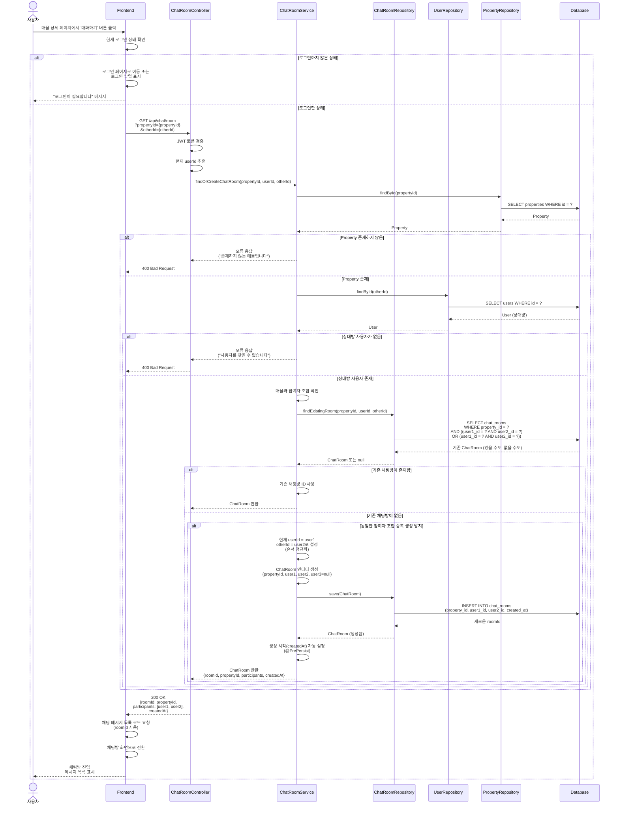
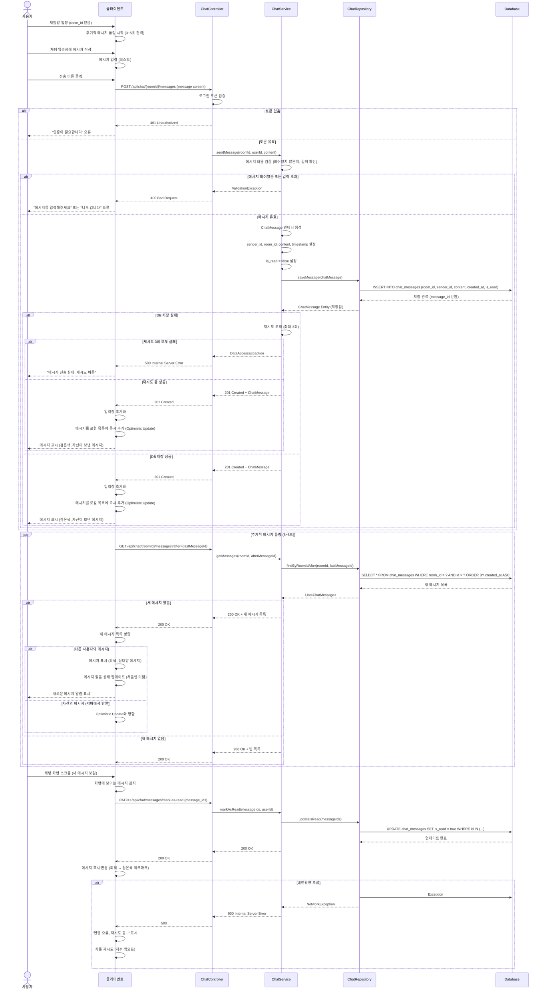
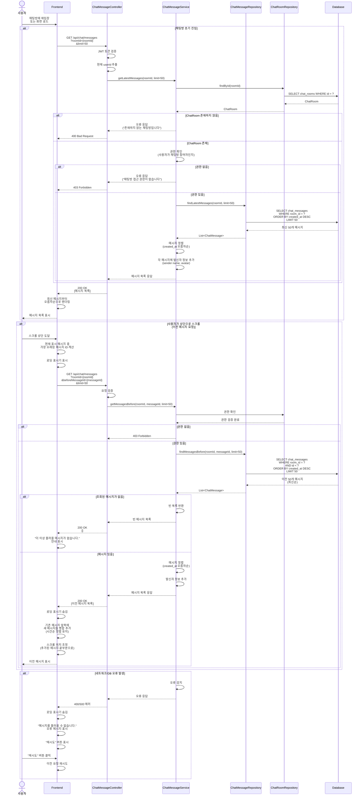
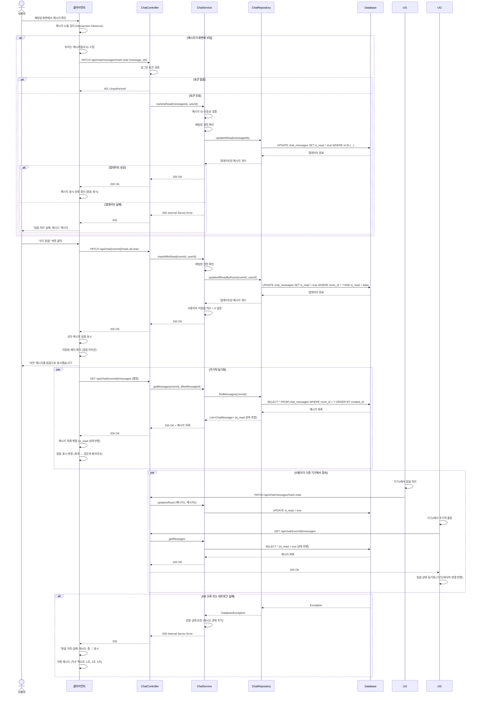
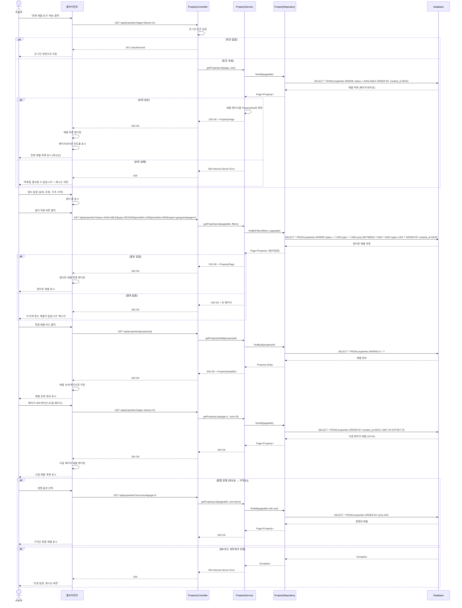
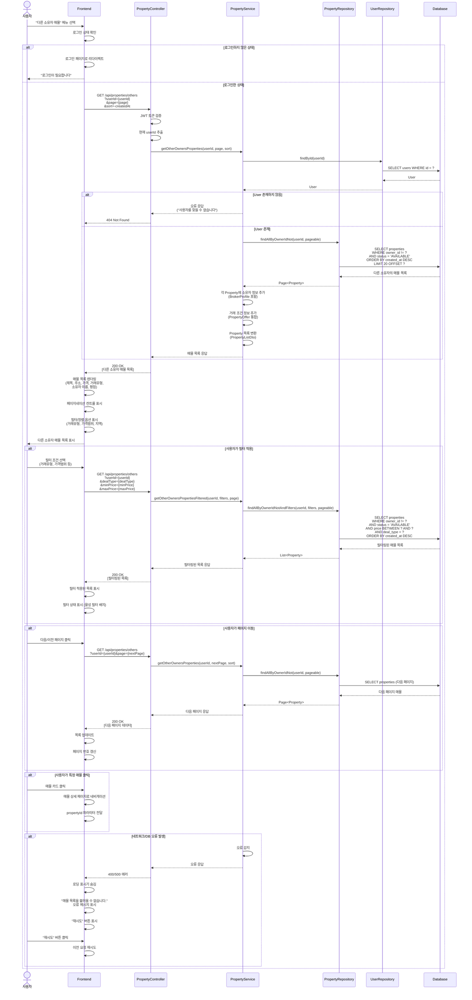
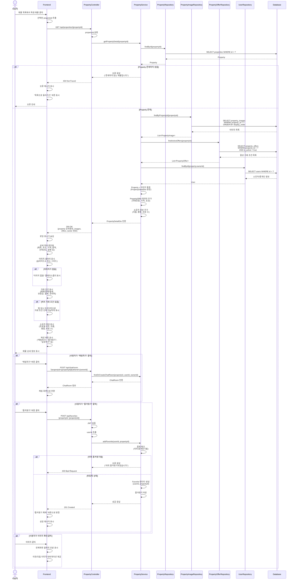

```mermaid
sequenceDiagram
    actor User as 사용자
    participant UI as Frontend
    participant Controller as PropertyController
    participant Service as PropertyService
    participant PropertyRepo as PropertyRepository
    participant UserRepo as UserRepository
    participant DB as Database

    User->>UI: "내 매물" 메뉴 선택
    
    UI->>UI: 현재 로그인 상태 확인
    
    alt 로그인하지 않은 상태
        UI->>UI: 로그인 페이지로 리다이렉트
        UI-->>User: "로그인이 필요합니다"
    else 로그인한 상태
        UI->>Controller: GET /api/user/properties<br/>?userId={userId}<br/>&page={page}<br/>&sort=-createdAt
        
        Controller->>Controller: JWT 토큰 검증
        Controller->>Controller: 현재 userId 추출
        
        Controller->>Service: getMyProperties(userId, page, sort)
        
        Service->>UserRepo: findById(userId)
        UserRepo->>DB: SELECT users WHERE id = ?
        DB-->>UserRepo: User
        UserRepo-->>Service: User
        
        alt User 존재하지 않음
            Service-->>Controller: 오류 응답<br/>("사용자를 찾을 수 없습니다")
            Controller-->>UI: 404 Not Found
        else User 존재
            Service->>PropertyRepo: findAllByOwnerId(userId, pageable)
            PropertyRepo->>DB: SELECT properties<br/>WHERE owner_id = ?<br/>ORDER BY created_at DESC<br/>LIMIT 20 OFFSET ?
            DB-->>PropertyRepo: 사용자의 매물 목록
            PropertyRepo-->>Service: Page<Property>
            
            Service->>Service: 각 Property에 거래 정보 추가<br/>(PropertyOffer 통합)
            
            Service->>Service: Property 목록 변환<br/>(PropertyResponseDto)
            
            Service-->>Controller: 매물 목록 응답
        end
        
        Controller-->>UI: 200 OK<br/>[매물 목록]
        
        UI->>UI: 매물 목록 렌더링<br/>(제목, 주소, 가격, 상태)
        UI->>UI: 필터/정렬 옵션 표시<br/>(상태, 거래유형, 가격순)
        UI-->>User: 내 매물 목록 표시
        
        alt 사용자가 매물 필터 적용
            User->>UI: 필터 조건 선택<br/>(상태, 거래유형, 가격범위)
            
            UI->>Controller: GET /api/user/properties<br/>?userId={userId}<br/>&status={status}<br/>&dealType={dealType}<br/>&minPrice={minPrice}<br/>&maxPrice={maxPrice}
            
            Controller->>Service: getMyPropertiesFiltered(userId, filters, page)
            
            Service->>PropertyRepo: findAllByOwnerIdAndFilters(userId, filters, pageable)
            PropertyRepo->>DB: SELECT properties<br/>WHERE owner_id = ? AND<br/>status = ? AND<br/>price BETWEEN ? AND ?<br/>ORDER BY created_at DESC
            DB-->>PropertyRepo: 필터링된 매물 목록
            PropertyRepo-->>Service: List<Property>
            
            Service-->>Controller: 필터링된 목록 응답
            Controller-->>UI: 200 OK<br/>[필터링된 매물 목록]
            
            UI->>UI: 필터 적용된 목록 표시
        end
        
        alt 사용자가 특정 매물 선택
            User->>UI: 매물 클릭
            
            UI->>UI: 매물 상세 정보 표시<br/>(제목, 주소, 가격, 거래조건,<br/>이미지, 설명)
            
            UI->>UI: 관리 기능 활성화<br/>("수정", "상태 변경", "삭제" 버튼)
        end
        
        alt 사용자가 매물 상태 변경
            User->>UI: "상태 변경" 버튼 클릭<br/>(AVAILABLE→PENDING→SOLD)
            
            UI->>UI: 상태 변경 옵션 표시
            
            User->>UI: 새로운 상태 선택
            
            UI->>Controller: PUT /api/user/properties/{propertyId}<br/>{status: newStatus}
            
            Controller->>Controller: JWT 토큰 검증
            Controller->>Controller: userId 추출
            
            Controller->>Service: updatePropertyStatus(propertyId, userId, newStatus)
            
            Service->>PropertyRepo: findById(propertyId)
            PropertyRepo->>DB: SELECT properties WHERE id = ?
            DB-->>PropertyRepo: Property
            PropertyRepo-->>Service: Property
            
            alt 매물 존재하지 않음
                Service-->>Controller: 오류 응답<br/>("존재하지 않는 매물입니다")
                Controller-->>UI: 404 Not Found
            else 매물 존재
                Service->>Service: 권한 확인<br/>(owner_id = userId?)
                
                alt 권한 없음
                    Service-->>Controller: 오류 응답<br/>("수정 권한이 없습니다")
                    Controller-->>UI: 403 Forbidden
                else 권한 있음
                    Service->>Service: 상태 변경<br/>(status = newStatus)
                    Service->>Service: updatedAt 갱신<br/>(@PreUpdate)
                    
                    Service->>PropertyRepo: save(Property)
                    PropertyRepo->>DB: UPDATE properties<br/>SET status = ?, updated_at = NOW()
                    DB-->>PropertyRepo: 업데이트 완료
                    PropertyRepo-->>Service: Property (업데이트됨)
                    
                    Service-->>Controller: 업데이트 완료 응답
                end
            end
            
            Controller-->>UI: 200 OK<br/>{매물 정보}
            
            UI->>UI: 성공 메시지 표시
            UI->>UI: 목록 새로고침<br/>업데이트된 상태 표시
            UI-->>User: "상태가 변경되었습니다"
        end
        
        alt 사용자가 매물 정보 수정
            User->>UI: "수정" 버튼 클릭
            
            UI->>UI: 수정 폼 로드<br/>(기존 정보 표시)
            
            User->>UI: 매물 정보 수정<br/>(가격, 설명, 이미지 등)
            
            User->>UI: "저장" 버튼 클릭
            
            UI->>Controller: PUT /api/user/properties/{propertyId}<br/>{title, price, description, ...}
            
            Controller->>Service: updateProperty(propertyId, userId, updateRequest)
            
            Service->>PropertyRepo: findById(propertyId)
            PropertyRepo->>DB: SELECT properties WHERE id = ?
            DB-->>PropertyRepo: Property
            PropertyRepo-->>Service: Property
            
            Service->>Service: 권한 확인
            
            alt 권한 없음
                Service-->>Controller: 403 Forbidden
            else 권한 있음
                Service->>Service: 매물 정보 업데이트<br/>(title, price, description 등)
                Service->>Service: updatedAt 갱신
                
                Service->>PropertyRepo: save(Property)
                PropertyRepo->>DB: UPDATE properties
                DB-->>PropertyRepo: 완료
                PropertyRepo-->>Service: Property (업데이트됨)
                
                Service-->>Controller: 200 OK<br/>{매물 정보}
            end
            
            Controller-->>UI: 200 OK
            
            UI->>UI: 성공 메시지 표시
            UI->>UI: 목록 새로고침
            UI-->>User: "매물 정보가 수정되었습니다"
        end
    end

```

# 9번 채팅방 접속 및 생성

---

 이 시퀀스 다이어그램은 사용자가 매물 상세 페이지에서 ‘대화하기’ 버튼을 클릭했을 때, 시스템이 기존 채팅방을 조회하거나 없을 경우 새로운 채팅방을 생성해 입장하기까지의 전체 과정을 보여준다. 사용자가 매물 상세 화면에서 ‘대화하기’를 누르면, 프런트엔드는 우선 로그인 상태를 확인한다. 로그인되어 있지 않은 경우 로그인 화면 또는 팝업으로 이동하며, 로그인된 사용자라면 채팅 요청을 서버로 전송한다. 요청이 서버에 도달하면 ChatRoomController가 JWT 토큰을 검증해 사용자 인증 상태를 확인하고, 검증이 완료되면 ChatRoomService.findOrCreateChatRoom() 메서드를 호출해 실제 로직 처리를 위임한다. 서비스 계층에서는 우선 매물과 사용자에 대한 유효성을 점검한다. PropertyRepository를 통해 매물 정보를 조회하고, 해당 매물이 존재하지 않으면 “존재하지 않는 매물입니다.”라는 오류를 반환한다. 매물이 유효할 경우 UserRepository에서 상대 사용자를 조회하며, 존재하지 않을 경우 “사용자를 찾을 수 없습니다.” 오류가 발생한다. 검증이 모두 완료되면 시스템은 두 사용자가 동일 매물에서 이미 대화를 진행 중인지 확인한다. 기존 채팅방이 존재하면 해당 roomId를 반환하고, 존재하지 않을 경우 새로운 ChatRoom 엔티티를 생성하여 데이터베이스에 저장한다. 생성이 완료되면 ChatRoomController는 200 OK 응답과 함께 roomId 및 participants 정보를 포함한 결과를 반환한다. 프런트엔드는 수신한 roomId를 바탕으로 해당 채팅방의 메시지 히스토리를 불러오고, 채팅 화면으로 전환한다. 이후 “채팅방에 입장하였습니다.”라는 안내 메시지를 표시하며 사용자가 실시간 대화를 시작할 수 있도록 인터페이스를 활성화한다. 결국 이 과정은 사용자의 단순한 클릭이 서버 단의 인증, 데이터 검증, 채팅방 조회 및 생성 로직을 거쳐 자연스럽게 연결되는 엔드투엔드(End-to-End) 상호작용을 보여준다.

---
 
# 10번 메시지 송수신

---

 이 시퀀스 다이어그램은 사용자가 채팅 입력창에 메시지를 작성해 “전송”을 누르면 ChatController가 JWT를 검증해 미인증이면 401 Unauthorized를 반환하고, 인증이 통과되면 ChatService가 내용 비어 있음이나 과도한 길이 등 유효성 검사를 수행한 뒤 통과된 메시지를 ChatRepository를 통해 chat_messages 테이블에 INSERT하며 실패 시 최대 3회 재시도 후 오류를 반환하는 흐름을 보여준다. 저장이 성공하면 서버는 201 Created와 함께 messageId를 응답하고, 클라이언트는 입력창을 초기화한 뒤 Optimistic Update로 방금 전송한 메시지를 즉시 화면에 그려 사용자 체감 지연을 줄인다. 이후 클라이언트는 3~5초 간격의 주기적 폴링으로 신규 메시지만 효율적으로 가져와 UI에 병합하며, 수신자(상대방)의 메시지는 회색, 본인 메시지는 검정으로 구분해 가독성을 높인다. 사용자가 스크롤로 메시지를 실제로 확인하면 클라이언트는 PATCH /api/chat/messages/mark-as-read 요청을 보내 읽음 상태를 is_read=true로 갱신하고, UI에는 체크마크 등 읽음 표시가 반영된다. 네트워크 장애나 서버 일시 오류가 발생할 경우 화면에는 “연결 오류, 재시도 중...” 안내가 나타나며 지수 백오프 전략으로 폴링과 전송을 자동 재시도해 안정적인 송수신을 보장한다.

---

# 11번 기존 대화 내역 불러오기

---

 이 시퀀스 다이어그램은 사용자가 채팅방에 다시 입장했을 때 기존 대화 내역을 불러오거나, 스크롤을 통해 이전 메시지를 추가 조회하는 전체 흐름을 보여준다. 사용자가 채팅방에 처음 들어오면 클라이언트는 GET /api/chat/messages?roomId={roomId}&limit=50 요청을 보낸다. 서버에서는 ChatMessageController가 JWT 토큰을 검증해 인증 상태를 확인하고, 해당 사용자가 해당 채팅방의 참여자인지 권한을 검사한다. 검증이 완료되면 ChatMessageRepository가 데이터베이스에서 최신 50개의 메시지를 조회해 시간순으로 정렬하고, 그 결과를 응답으로 반환한다. 프런트엔드는 응답받은 메시지들을 UI에 렌더링해 최신 대화부터 표시한다. 이후 사용자가 화면 상단으로 스크롤을 올릴 경우 클라이언트는 가장 오래된 메시지의 ID를 기준으로 GET /api/chat/messages?beforeMessageId={id} 요청을 전송해 이전 메시지를 추가로 요청한다. 서버는 해당 ID 이전의 메시지를 조회하여 반환하며, 결과가 비어 있으면 “더 이상 불러올 메시지가 없습니다.”라는 안내 문구를 UI에 표시한다. 메시지가 존재할 경우 기존 목록의 앞부분에 병합하여 자연스럽게 이전 대화가 확장되는 형태로 보여준다. 만약 데이터베이스 조회 실패나 네트워크 오류가 발생하면 클라이언트는 “메시지를 불러올 수 없습니다.”라는 오류 메시지를 표시하고, 사용자가 수동으로 재시도할 수 있는 버튼을 제공한다. 이를 통해 사용자는 끊김 없이 과거 대화 기록을 탐색할 수 있으며, 시스템은 안정적인 페이징 기반 메시지 조회를 지원한다.

---

# 12번 읽음 처리

---

 이 시퀀스 다이어그램은 사용자가 채팅방에서 메시지를 읽었을 때 읽음 상태를 데이터베이스에 반영하고, 여러 기기 간 읽음 정보를 실시간으로 동기화하는 전체 흐름을 설명한다. 사용자가 채팅방을 열면 프런트엔드 UI는 Intersection Observer를 통해 현재 화면에 보이는 메시지의 ID를 자동으로 감지한다. 감지된 메시지는 PATCH /api/chat/messages/mark-read 요청으로 서버에 전달되며, 서버는 해당 메시지의 is_read 필드를 true로 업데이트한 뒤 200 OK 응답을 반환한다. 응답이 도착하면 프런트엔드는 해당 메시지 옆에 검은색 체크마크를 표시해 사용자가 읽은 상태임을 시각적으로 보여준다. 또한 사용자가 채팅방 전체를 확인했거나 “모두 읽음” 버튼을 눌렀을 경우, 클라이언트는 PATCH /api/chat/{roomId}/mark-all-read 요청을 보낸다. 서버는 해당 채팅방 내 사용자가 수신한 모든 메시지를 읽음 처리하고, 성공 시 “모든 메시지를 읽음으로 표시했습니다.”라는 안내 문구를 UI에 표시한다. 이후 다중 기기 환경에서도 일관된 읽음 상태를 유지하기 위해, 예를 들어 기기1에서 읽음 처리가 완료되면 기기2는 주기적 폴링을 통해 변경된 메시지들의 최신 is_read=true 상태를 수신받아 로컬 UI에 반영한다. 이를 통해 동일한 계정으로 로그인된 여러 기기에서 읽음 여부가 자동으로 동기화된다. 만약 데이터베이스 업데이트 실패나 네트워크 오류가 발생하면 클라이언트는 읽음 요청을 **로컬 큐(Local Queue)**에 임시 저장하고, 일정 주기로 재전송을 시도한다. 이때 화면에는 “읽음 처리 실패, 재시도 중...”이라는 안내 문구가 나타나 사용자가 오류 상태를 인지할 수 있다. 이런 과정을 통해 시스템은 메시지 읽음 상태를 정확하게 반영하면서, 불안정한 네트워크 환경에서도 안정적인 동기화를 유지한다.

---

# 13번

```mermaid
sequenceDiagram
    actor User as 사용자
    participant UI as Frontend
    participant Controller as ChatMessageController
    participant Service as ChatMessageService
    participant ChatRoomRepo as ChatRoomRepository
    participant ChatMessageRepo as ChatMessageRepository
    participant UserChatStateRepo as UserChatStateRepository
    participant DB as Database

    User->>UI: 채팅방에 재입장
    
    UI->>UI: 현재 로그인 상태 확인
    
    alt 로그인 상태 아님
        UI->>UI: 로그인 페이지로 리다이렉트
        UI-->>User: "로그인이 필요합니다"
    else 로그인 상태
        UI->>Controller: GET /api/chat/resume<br/>?roomId={roomId}
        
        Controller->>Controller: JWT 토큰 검증
        Controller->>Controller: 현재 userId 추출
        
        Controller->>Service: getResumePoint(roomId, userId)
        
        Service->>ChatRoomRepo: findById(roomId)
        ChatRoomRepo->>DB: SELECT chat_rooms WHERE id = ?
        DB-->>ChatRoomRepo: ChatRoom
        ChatRoomRepo-->>Service: ChatRoom
        
        alt ChatRoom 존재하지 않음
            Service-->>Controller: 오류 응답
            Controller-->>UI: 404 Not Found
        else ChatRoom 존재
            Service->>Service: 권한 확인<br/>(사용자가 참여자인지)
            
            alt 권한 없음
                Service-->>Controller: 403 Forbidden
                Controller-->>UI: 403 오류
            else 권한 있음
                Service->>UserChatStateRepo: findLastReadMessage(roomId, userId)
                UserChatStateRepo->>DB: SELECT user_chat_states<br/>WHERE room_id = ? AND user_id = ?
                DB-->>UserChatStateRepo: 마지막 읽음 포인터<br/>(message_id 또는 null)
                UserChatStateRepo-->>Service: last_read_message_id
                
                alt 마지막 읽음 포인터가 없음<br/>(첫 입장 또는 초기화)
                    Service->>Service: 기본값 사용<br/>(최근 N개 메시지)
                    Service->>ChatMessageRepo: findLatestMessages(roomId, limit=50)
                    ChatMessageRepo->>DB: SELECT chat_messages<br/>WHERE room_id = ?<br/>ORDER BY created_at DESC<br/>LIMIT 50
                    DB-->>ChatMessageRepo: 최신 50개 메시지
                    ChatMessageRepo-->>Service: List<ChatMessage>
                else 마지막 읽음 포인터 존재
                    Service->>ChatMessageRepo: findMessagesAfter(roomId, messageId)
                    ChatMessageRepo->>DB: SELECT chat_messages<br/>WHERE room_id = ?<br/>AND id > ?<br/>ORDER BY created_at ASC
                    DB-->>ChatMessageRepo: 포인터 이후 메시지
                    ChatMessageRepo-->>Service: List<ChatMessage>
                    
                    alt 포인터 이후 새 메시지 없음
                        Service->>Service: 포인터 주변<br/>메시지 조회<br/>(context를 위해 이전 메시지 포함)
                        Service->>ChatMessageRepo: findContextMessages(roomId, messageId, before=10, after=5)
                        ChatMessageRepo->>DB: 컨텍스트 메시지 조회
                        DB-->>ChatMessageRepo: 컨텍스트
                        ChatMessageRepo-->>Service: List<ChatMessage>
                    end
                end
                
                Service->>Service: 메시지 정렬<br/>(created_at 오름차순)
                
                Service->>Service: 각 메시지에 발신자 정보 추가
                
                Service-->>Controller: 메시지 목록 및<br/>마지막 읽음 포인터 응답
            end
        end
        
        Controller-->>UI: 200 OK<br/>{messages, lastReadMessageId, unreadCount}
        
        UI->>UI: 로딩 표시기 표시
        
        alt 새로운 메시지 있음 (포인터 이후)
            UI->>UI: 새 메시지부터 우선 렌더링<br/>(강조 또는 구분)
        else 새로운 메시지 없음
            UI->>UI: 포인터 주변 컨텍스트<br/>메시지 렌더링
            UI->>UI: 포인터 위치로 자동 스크롤
        end
        
        UI->>UI: 로딩 표시기 숨김
        
        UI->>UI: 화면 노출 범위 계산<br/>(뷰포트 내 최하단 메시지)
        
        alt 새 메시지 표시됨 (뷰포트 내)
            UI->>Controller: PUT /api/chat/read-state<br/>?roomId={roomId}<br/>&lastMessageId={messageId}
            
            Controller->>Controller: 요청 검증
            
            Controller->>Service: updateReadState(roomId, userId, lastMessageId)
            
            Service->>UserChatStateRepo: findById(roomId, userId)
            UserChatStateRepo->>DB: SELECT FROM user_chat_states
            DB-->>UserChatStateRepo: 기존 상태
            UserChatStateRepo-->>Service: UserChatState
            
            alt 기존 상태 없음
                Service->>Service: 새로운 UserChatState 생성
                Service->>UserChatStateRepo: save(newState)
                UserChatStateRepo->>DB: INSERT INTO user_chat_states
                DB-->>UserChatStateRepo: 저장 완료
            else 기존 상태 있음
                Service->>Service: 단조 증가 규칙 확인<br/>(새 messageId > 기존)
                
                alt 새 포인터가 더 오래됨
                    Service->>Service: 기존 포인터 유지<br/>(무시)
                else 새 포인터가 더 최신
                    Service->>UserChatStateRepo: update(lastMessageId)
                    UserChatStateRepo->>DB: UPDATE user_chat_states
                    DB-->>UserChatStateRepo: 업데이트 완료
                end
            end
            
            Service-->>Controller: 성공 응답
            Controller-->>UI: 200 OK
        end
        
        UI-->>User: 채팅방 표시<br/>이어서 보기 완료
    end

```

---

 이 시퀀스 다이어그램은 사용자가 채팅방에 다시 접속했을 때 마지막으로 읽은 메시지 이후의 새 메시지만 불러와 자연스럽게 이어볼 수 있도록 하는 전체 과정을 설명한다. 사용자가 재입장하면 컨트롤러가 우선 JWT를 검증해 로그인 여부를 확인하고, 사용자가 해당 채팅방의 참여자인지를 검사한다. 채팅방이 존재하지 않으면 404 오류를, 권한이 없을 경우 403 오류를 반환한다. 검증이 통과되면 UserChatStateRepository에서 사용자의 last_read_message_id를 조회해 이어보기 기준점을 결정한다. 만약 포인터 값이 없으면 기본적으로 최근 50개의 메시지를 불러오고, 포인터가 존재할 경우 해당 ID 이후의 메시지만 로드한다. 이후 서버는 가져온 메시지를 시간순으로 정렬해 클라이언트에 반환하며, UI는 응답받은 데이터를 기반으로 새 메시지를 기존 대화 뒤에 자연스럽게 이어서 표시한다. 사용자가 새로운 메시지를 모두 확인하면 클라이언트는 PUT /api/chat/read-state 요청을 통해 최신 메시지 ID로 읽음 포인터를 갱신해 서버에 저장한다. 처리 완료 후 UI는 “이어서 보기 완료”라는 안내 문구를 표시하고, 새로 불러온 메시지들은 시각적으로 강조 표시되어 사용자가 어디까지 읽었는지 쉽게 인지할 수 있게 한다.

---

# 19번 매물 목록 조회 (전체)

---

 이 시퀀스 다이어그램은 사용자가 등록된 전체 매물 목록을 조회하고, 필터를 적용하거나 페이지를 이동하면서 원하는 매물을 탐색하는 과정을 보여준다. 사용자가 “전체 매물 보기” 버튼을 선택하면 클라이언트는 GET /api/properties?page=0&size=20 요청을 전송하고, 서버는 JWT 토큰을 검증해 사용자 인증 상태를 확인한 뒤 데이터베이스에서 매물 목록을 조회한다. 조회된 매물들은 최신순으로 정렬되어 클라이언트로 전달되며, UI는 이를 카드 형태로 화면에 표시한다. 이후 사용자가 필터를 설정하면 클라이언트는 GET /api/properties?status=AVAILABLE&type=JEONSE&region=... 형태의 요청을 보내며, 서버는 전달된 조건에 맞는 매물만 선별해 응답한다. 조건에 부합하는 결과가 없을 경우 UI는 “조건에 맞는 매물이 없습니다.”라는 안내 문구를 표시한다. 사용자가 페이지를 이동할 경우 클라이언트는 GET /api/properties?page=n 요청을 보내고, 서버는 해당 페이지의 매물 목록을 반환해 기존 목록 뒤에 추가로 표시한다. 네트워크 장애나 데이터베이스 오류가 발생하면 클라이언트는 “목록을 불러올 수 없습니다.”라는 메시지를 표시하고, 사용자가 다시 시도할 수 있도록 재시도 버튼을 함께 제공한다. 이 과정을 통해 사용자는 전체 매물을 손쉽게 탐색하고, 조건별 필터링과 페이지 이동을 통해 효율적으로 원하는 매물을 찾을 수 있다.

---

# 20번 내 매물 관리

---

 이 시퀀스 다이어그램은 사용자가 자신이 등록한 매물을 조회하고, 필요 시 매물 상태를 변경하거나 정보를 수정하는 전체 과정을 나타낸다. 사용자가 “내 매물” 메뉴를 선택하면 클라이언트는 GET /api/user/properties 요청을 전송하고, 서버는 JWT 토큰을 검증해 인증된 사용자임을 확인한 뒤 토큰에서 userId를 추출한다. 이후 PropertyRepository는 owner_id=userId 조건으로 데이터베이스를 조회하여 해당 사용자가 등록한 매물 목록을 반환하고, 프런트엔드는 이를 목록 형태로 화면에 표시한다. 사용자가 특정 매물의 상태(예: 공개/비공개, 거래중/완료)를 변경하기 위해 상태 변경 버튼을 클릭하면 클라이언트는 PUT /api/user/properties/{propertyId} 요청을 보낸다. 서버는 요청자의 권한을 확인해 owner_id가 userId와 일치하지 않으면 403 Forbidden 또는 매물이 존재하지 않으면 404 Not Found를 반환한다. 검증이 통과되면 매물 상태를 업데이트하고 데이터베이스에 반영한 뒤 성공 응답을 전송하며, UI는 변경된 상태를 즉시 갱신해 표시한다. 또한 사용자가 매물 정보를 수정하려고 “수정” 버튼을 클릭한 뒤 변경 내용을 입력하고 저장하면 동일한 PUT /api/user/properties/{propertyId} 요청이 전송되고, 서버는 수정된 데이터를 DB에 반영한 후 200 OK 응답을 반환한다. 프런트엔드는 응답을 받으면 “매물 정보가 수정되었습니다.”라는 알림을 표시해 수정 성공을 사용자에게 안내한다. 전체 과정은 인증, 권한 확인, 데이터 갱신, UI 피드백이 순차적으로 이루어지는 구조로, 사용자는 안전하게 자신의 매물을 관리할 수 있다.

---

# 21번 상의 매물 조회

---

 이 시퀀스 다이어그램은 사용자가 자신이 아닌 다른 소유자가 등록한 매물 목록을 조회하고, 필터를 적용하거나 페이지를 이동하면서 탐색하는 과정을 설명한다. 사용자가 “다른 소유자 매물” 메뉴를 선택하면 클라이언트는 GET /api/properties/others 요청을 전송하고, 서버는 JWT 토큰을 검증해 로그인 상태를 확인한 뒤 토큰에서 userId를 추출한다. 이후 PropertyRepository는 owner_id != userId 조건으로 데이터베이스를 조회해 다른 사용자가 등록한 매물만 선별하여 반환한다. 응답이 성공적으로 도착하면 프런트엔드는 해당 매물들을 목록 형태로 UI에 표시한다. 사용자가 조건을 추가로 지정할 경우 클라이언트는 GET /api/properties/others?dealType=...&minPrice=... 형식으로 요청을 전송하며, 서버는 전달된 필터 조건을 기반으로 데이터를 다시 조회한다. 결과가 존재하면 필터링된 매물 목록을 표시하고, 조건에 맞는 매물이 없을 경우 “조건에 맞는 매물이 없습니다.”라는 안내 문구를 출력한다. 또한 사용자가 페이지를 넘길 때 클라이언트는 page 파라미터를 변경해 재요청을 보내고, 서버는 해당 페이지의 매물 데이터를 반환해 UI를 새로운 목록으로 갱신한다. 만약 데이터베이스 접근 오류나 네트워크 장애가 발생하면 클라이언트는 “매물 목록을 불러올 수 없습니다.”라는 오류 메시지를 표시하고, 사용자가 다시 시도할 수 있도록 재시도 버튼을 제공한다. 이를 통해 사용자는 다른 소유자의 매물을 안정적으로 탐색할 수 있으며, 조건 검색과 페이징 기능을 활용해 효율적으로 원하는 매물을 찾아볼 수 있다.

---

# 22번 매물 상세 조회

---

 이 시퀀스 다이어그램은 사용자가 매물 목록에서 특정 매물을 클릭했을 때 서버가 해당 매물의 상세 정보를 비롯해 관련 이미지, 거래 조건, 소유자 정보를 함께 조회하고 이를 화면에 표시하는 전체 과정을 설명한다. 사용자가 특정 매물을 선택하면 클라이언트는 매물 ID를 포함한 요청을 전송하고, PropertyController는 우선 해당 ID의 유효성을 검증한다. 유효하지 않으면 즉시 오류를 반환하고, 유효한 경우 PropertyRepository를 통해 매물 기본 정보를 조회한 뒤, 순차적으로 PropertyImageRepository에서 매물 이미지, PropertyOfferRepository에서 거래 조건(전세·월세·매매 정보), UserRepository에서 소유자 정보를 불러온다. 이후 PropertyService는 조회된 모든 데이터를 통합해 PropertyDetailDto 객체로 가공하고, 이를 포함한 200 OK 응답을 클라이언트에 반환한다. 프런트엔드는 응답받은 상세 정보를 기반으로 매물 설명, 이미지 갤러리, 거래 조건, 소유자 프로필 등을 렌더링하며, 사용자가 매물 정보를 직관적으로 확인할 수 있도록 UI를 구성한다. 화면에는 추가 기능으로 “채팅하기”, “즐겨찾기”, “이미지 확대” 버튼이 함께 제공된다. 사용자가 “채팅하기”를 누르면 새로운 ChatRoom이 생성되거나 기존 방으로 연결되어 채팅 화면으로 전환되며, “즐겨찾기”를 누르면 매물이 Favorite 목록에 등록되고 버튼 색상이 변경된다. 또한 “이미지 확대”를 선택하면 갤러리 모달이 열려 세부 이미지를 크게 볼 수 있다. 만약 요청한 매물이 존재하지 않으면 서버는 404 Not Found 응답을 반환하고, 클라이언트는 “존재하지 않는 매물입니다.” 안내 문구와 함께 “목록으로 돌아가기” 버튼을 표시하여 사용자가 안전하게 이전 화면으로 복귀할 수 있도록 안내한다.

---
