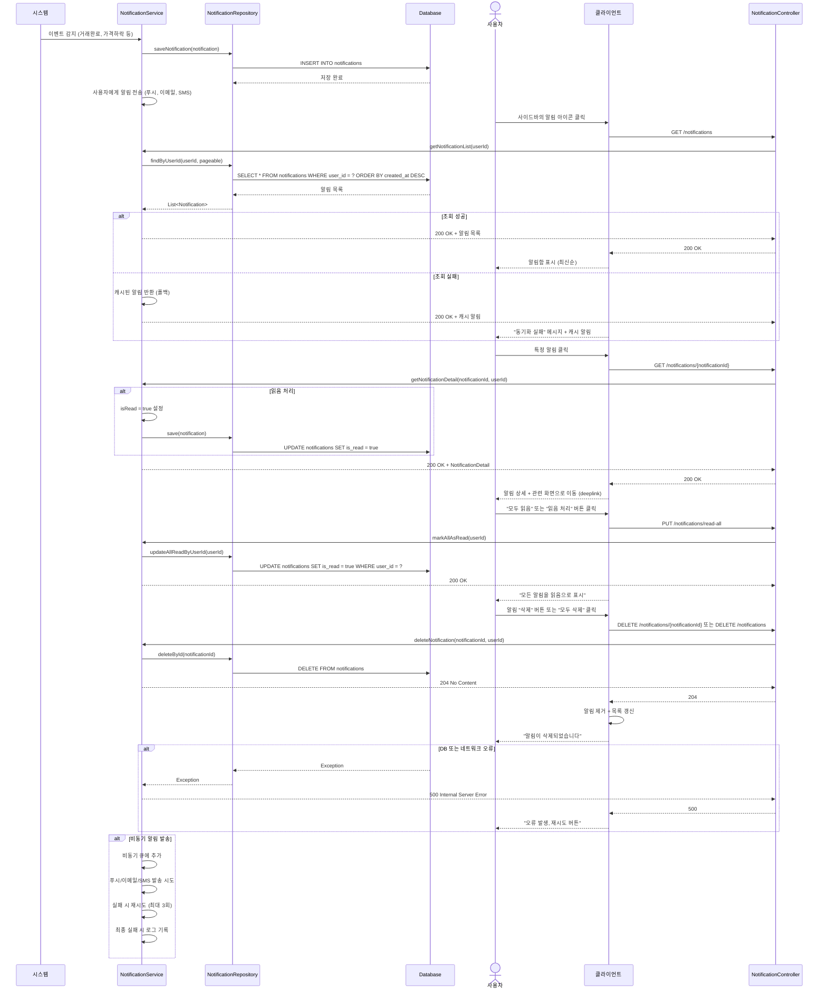
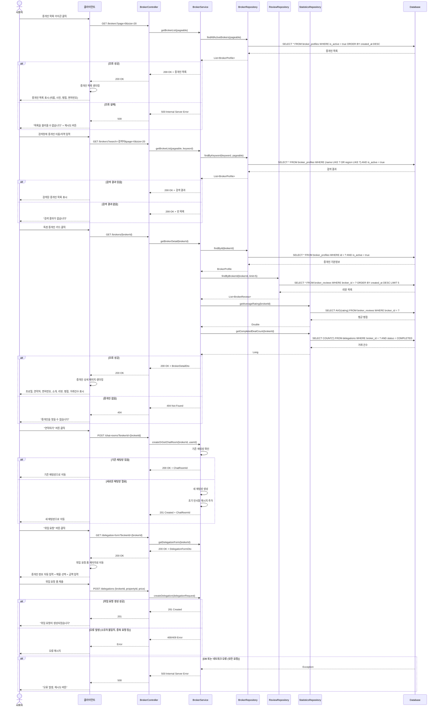
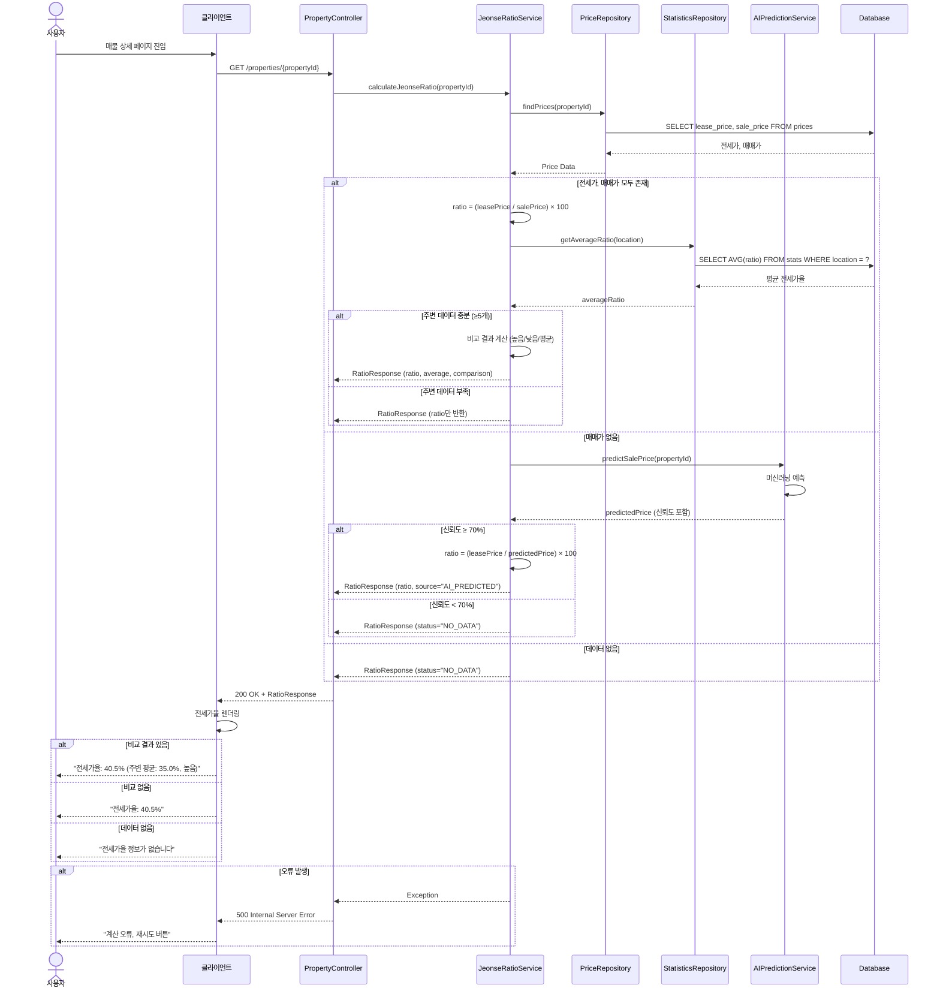

## #23 위임(Delegation) 플로우

```mermaid
sequenceDiagram
    actor Owner as 소유자
    actor Broker as 브로커
    participant UI as 클라이언트
    participant Controller as DelegationController
    participant Service as DelegationService
    participant DelegRepo as DelegationRepository
    participant PropertyRepo as PropertyRepository
    participant DB as Database

    Owner->>UI: 매물 상세화면 진입
    UI->>Controller: GET /properties/{propertyId}
    
    Owner->>UI: "브로커 위임 요청" 버튼 클릭
    UI->>Controller: POST /delegations (propertyId, brokerId, dealType, price)
    
    Controller->>Service: createDelegation(owner, propertyId, brokerId)
    
    Service->>PropertyRepo: findById(propertyId)
    PropertyRepo->>DB: SELECT * FROM properties
    DB-->>PropertyRepo: Property
    PropertyRepo-->>Service: Property
    
    alt 소유자 확인
        Service->>Service: property.ownerId == owner.id?
        alt 소유자 불일치
            Service-->>Controller: UnauthorizedException
            Controller-->>UI: 403
            UI-->>Owner: "소유자만 위임 가능"
        else 소유자 일치
            Service->>DelegRepo: checkPending(propertyId)
            DelegRepo->>DB: SELECT * FROM delegations WHERE property_id = ? AND status = PENDING
            DB-->>DelegRepo: 기존 요청
            
            alt PENDING 요청 존재
                Service-->>Controller: ConflictException
                Controller-->>UI: 409
                UI-->>Owner: "이미 요청 진행 중"
            else PENDING 요청 없음
                Service->>Service: 위임 요청 생성 (status=PENDING)
                Service->>DelegRepo: saveDelegation(delegation)
                DelegRepo->>DB: INSERT INTO delegations
                DB-->>DelegRepo: 저장 완료
                Service-->>Controller: 201 Created
                Controller-->>UI: 201
                UI-->>Owner: "위임 요청 생성됨"
            end
        end
    end

    Broker->>UI: 위임 요청 목록 조회
    UI->>Controller: GET /delegations/received
    
    Controller->>Service: getReceivedDelegations(brokerId)
    Service->>DelegRepo: findByBrokerId(brokerId)
    DelegRepo->>DB: SELECT * FROM delegations WHERE broker_id = ? AND status = PENDING
    DB-->>DelegRepo: 요청 목록
    DelegRepo-->>Service: List<Delegation>
    Service-->>Controller: 200 OK
    Controller-->>UI: 200
    UI-->>Broker: 위임 요청 목록 표시

    Broker->>UI: 요청 승인 버튼 클릭
    UI->>Controller: PATCH /delegations/{id}/approve
    
    Controller->>Service: approveDelegation(delegationId, brokerId)
    
    Service->>DelegRepo: findById(delegationId)
    DelegRepo->>DB: SELECT * FROM delegations WHERE id = ?
    DB-->>DelegRepo: Delegation
    DelegRepo-->>Service: Delegation
    
    alt 상태 확인
        Service->>Service: status == PENDING?
        alt PENDING 아님
            Service-->>Controller: InvalidStateException
            Controller-->>UI: 400
        else PENDING
            Service->>Service: status = ACCEPTED
            Service->>DelegRepo: save(delegation)
            DelegRepo->>DB: UPDATE delegations SET status = ACCEPTED
            DB-->>DelegRepo: 완료
            Service-->>Controller: 200 OK
            Controller-->>UI: 200
            UI-->>Broker: "승인 완료"
            UI-->>Owner: 알림 "위임 요청 승인됨"
        end
    end

    Broker->>UI: 요청 거절 버튼 클릭 (사유 입력)
    UI->>Controller: PATCH /delegations/{id}/reject (reason)
    
    Controller->>Service: rejectDelegation(delegationId, reason)
    
    Service->>Service: status = REJECTED, reason 설정
    Service->>DelegRepo: save(delegation)
    DelegRepo->>DB: UPDATE delegations SET status = REJECTED, reason = ?
    DB-->>DelegRepo: 완료
    Service-->>Controller: 200 OK
    Controller-->>UI: 200
    UI-->>Broker: "거절 완료"
    UI-->>Owner: 알림 "위임 요청 거절됨: {사유}"

    Owner->>UI: 보낸 요청 목록에서 PENDING 요청 취소
    UI->>Controller: PATCH /delegations/{id}/cancel
    
    Controller->>Service: cancelDelegation(delegationId, owner)
    
    Service->>Service: 소유자 확인 + status = PENDING 확인
    Service->>Service: status = CANCELLED
    Service->>DelegRepo: save(delegation)
    DelegRepo->>DB: UPDATE delegations SET status = CANCELLED
    Service-->>Controller: 200 OK
    UI-->>Owner: "요청 취소됨"
    UI-->>Broker: 알림 "위임 요청이 취소됨"

    Owner->>UI: 완료된 요청 삭제 (REJECTED/CANCELLED만)
    UI->>Controller: DELETE /delegations/{id}
    
    Controller->>Service: deleteDelegation(delegationId, owner)
    
    Service->>Service: status == ACCEPTED?
    alt ACCEPTED
        Service-->>Controller: 400 Bad Request
        UI-->>Owner: "ACCEPTED 요청은 삭제 불가"
    else REJECTED/CANCELLED
        Service->>DelegRepo: deleteById(delegationId)
        DelegRepo->>DB: DELETE FROM delegations
        Service-->>Controller: 204 No Content
        UI-->>Owner: "삭제 완료"
    end

    alt DB 또는 네트워크 오류
        DB-->>DelegRepo: Exception
        DelegRepo-->>Service: DatabaseException
        Service-->>Controller: 500 Internal Server Error
        Controller-->>UI: 500
        UI-->>Owner: "오류 발생, 재시도"
    end

```

**설명**  
소유자가 매물 상세 화면에 진입하면 클라이언트는 먼저 GET /properties/{propertyId}를 호출해 매물 기초 정보를 당겨온다. 이후 소유자가 “브로커 위임 요청” 버튼을 누르면 클라이언트는 POST /delegations로 propertyId, brokerId, 거래유형(dealType), 금액(price) 등을 전송한다. 이 요청은 DelegationController에서 수신되며, 현재 로그인한 사용자(Owner) 정보를 확보한 뒤 DelegationService.createDelegation(ownerId, propertyId, brokerId, dealType, price)를 실행한다. 서비스의 첫 단계는 위임 대상 매물이 실제로 존재하는지 확인하는 것이다. 이를 위해 PropertyRepository.findById(propertyId)가 호출되고, 결과가 없으면 404 Not Found를 던진다. 매물이 존재하면 소유자 일치성 검증으로 넘어간다. 서비스는 property.owner.id == ownerId를 비교하고, 불일치 시 UnauthorizedException 혹은 AccessDeniedException을 던져 컨트롤러가 403 응답을 반환하게 한다. 소유자 일치가 확정되면 중복 진행 방지를 위해 DelegationRepository.existsByPropertyIdAndStatus(propertyId, PENDING) 또는 checkPending(propertyId)를 호출해 동일 매물에 대기(PENDING) 중인 요청이 이미 있는지 확인한다. 대기 건이 발견되면 비즈니스 충돌로 분류해 409 Conflict를 반환한다. 기존 대기 요청이 없다면 서비스는 새 Delegation 엔티티를 구성한다. 기본 상태는 PENDING이며, 요청자·대상 브로커·매물·요청 금액·거래유형 등의 필드를 채운다. 이 엔티티는 DelegationRepository.save(delegation)을 통해 DB에 영속화되며, 컨트롤러는 201 Created와 함께 생성 결과(식별자, 상태, 타임스탬프)를 반환한다. 클라이언트는 “위임 요청 생성됨” 토스트와 함께 상세 화면 UI를 갱신한다.

브로커 측에서는 받은 위임 요청을 조회하기 위해 GET /delegations/received를 호출한다. 컨트롤러는 인증된 브로커의 ID를 확보 후 DelegationService.getReceivedDelegations(brokerId)를 호출한다. 서비스는 DelegationRepository.findByBrokerIdAndStatus(brokerId, PENDING, pageable) 같은 쿼리를 사용해 자신에게 온 대기 중 요청 목록을 가져온다. 목록에는 매물 요약(주소/타이틀/면적), 소유자 식별자(마스킹), 제안 금액 및 요청일 같은 최소 필드가 포함된다. 성공 시 200 OK로 리스트가 반환되고, 클라이언트는 목록을 카드 형태로 보여준다.

브로커가 특정 요청을 승인하려고 목록의 카드에서 “승인”을 누르면 PATCH /delegations/{id}/approve가 호출된다. 컨트롤러는 브로커 인증을 확인한 뒤 DelegationService.approveDelegation(delegationId, brokerId)를 수행한다. 서비스는 먼저 DelegationRepository.findById(delegationId)로 엔티티를 로드하고, 수신자 검증(해당 위임의 brokerId가 현재 브로커와 일치하는가)을 통과해야 한다. 그 다음 상태 유효성 검사를 진행한다. 이미 ACCEPTED/REJECTED/CANCELLED/COMPLETED 인 건에 대해 승인 요청이 오면 InvalidStateException을 던져 컨트롤러가 400 Bad Request를 반환하도록 한다. 상태가 정확히 PENDING인 경우에만 승인 가능한데, 이때 서비스는 상태를 ACCEPTED로 전이시키고 DelegationRepository.save(delegation)이나 변경감지로 업데이트한다. 커밋이 성공하면 200 OK를 반환하며, 보통 여기서 알림 시스템을 연동해 소유자에게 “위임 요청이 승인되었습니다” 푸시/인앱 알림을 발송한다.

거절의 경우 UI에서 사유를 입력받아 PATCH /delegations/{id}/reject로 전달한다. 컨트롤러는 인증과 파라미터 유효성 검사를 마친 뒤 DelegationService.rejectDelegation(delegationId, brokerId, reason)를 호출한다. 승인과 동일하게 대기 상태인지 확인하고, 맞다면 status = REJECTED로 바꾸고 reason(거절사유)을 세팅한다. 저장 후 200 OK를 돌려주며, 소유자에게는 “거절됨: {사유}” 알림이 발송된다.

소유자가 스스로 보낸 대기 중 요청을 취소하는 플로우는 PATCH /delegations/{id}/cancel을 통해 이뤄진다. 컨트롤러는 로그인 사용자가 해당 위임의 소유자인지 먼저 필터링하고, 서비스는 대상 엔티티를 로드한 다음 상태가 PENDING인지 검사한다. PENDING이 아니라면 취소 불가로 보고 400을 반환한다. PENDING이면 status = CANCELLED로 전이시켜 저장하고 200 OK를 반환한다. 수신자 브로커에게는 “요청이 취소됨” 알림을 보낸다.

마지막으로 소유자가 완료된 요청 중에서 REJECTED/CANCELLED 상태인 항목을 목록에서 제거하려고 DELETE /delegations/{id}를 호출한다. DelegationService.deleteDelegation(delegationId, ownerId)는 소유자 일치 및 상태 검사를 수행한다. 상태가 ACCEPTED(혹은 COMPLETED)인 경우에는 삭제 금지 규칙을 적용하여 400 Bad Request를 반환하고, 반대로 REJECTED/CANCELLED라면 DelegationRepository.deleteById(delegationId)로 물리 삭제한다. 전 과정에서 DB 예외나 네트워크 타임아웃이 발생하면 서비스 계층에서 예외가 전파되어 컨트롤러가 500 Internal Server Error를 내려주며, 클라이언트는 “오류가 발생했습니다. 재시도 해주세요.” 메시지와 함께 리트라이 UX를 제공한다.

---

## #24 알림(Notification) 플로우

**설명**  
시스템 내부에서 거래 완료, 가격 하락, 위임 상태 변경 등 이벤트가 감지되면 NotificationService.publish(event)를 호출한다. 이 서비스는 이벤트를 해당 사용자(또는 다수 구독자)의 Notification 도메인 모델로 변환하고, NotificationRepository.save(notification)로 즉시 저장한다. 저장 시점에는 메시지 본문, 이벤트 타입, 라우팅용 딥링크(예: 매물 상세, 채팅방, 위임 상세), 읽음 여부(isRead=false), 생성시각이 기록된다. 저장과는 별개로 NotificationService는 비동기 큐에 푸시 작업을 넣어, 모바일 푸시/이메일/SMS 등 외부 채널 발송을 시도한다. 외부 채널은 실패 시 재시도 정책(예: 최대 3회)을 적용하고, 최종 실패는 영구 로그에 남긴다.

사용자가 클라이언트에서 사이드바의 종 아이콘을 누르면 GET /notifications가 호출되고, NotificationController는 인증 토큰에서 userId를 추출해 NotificationService.getList(userId, pageable)을 호출한다. 서비스는 NotificationRepository.findByUserIdOrderByCreatedAtDesc(userId, pageable)로 최신순 목록을 가져오고, 필요하다면 캐시를 먼저 조회한 뒤 캐시 미스 시 DB를 타도록 구성할 수 있다. 조회 성공 시 컨트롤러는 200 OK와 함께 페이징 결과를 반환하고, UI는 최신순으로 리스트를 렌더링한다. 만약 DB 연결 문제가 발생하면 서비스는 캐시된 스냅샷을 반환해 사용자가 최소한의 정보를 볼 수 있게 하며, UI는 “동기화 실패 – 캐시 표시 중” 배지를 함께 보여준다.

사용자가 특정 알림을 누르면 GET /notifications/{id}로 상세가 요청된다. 컨트롤러는 NotificationService.getDetail(notificationId, userId)를 호출하고, 서비스는 대상 알림이 요청 사용자 소유인지 검증한 뒤 읽음 처리를 수행한다. 읽음 처리의 구현은 상세 응답과 동시에 isRead=true로 바꾸어 NotificationRepository.save()/update를 실행한다. 컨트롤러는 NotificationDetail DTO를 200 OK로 반환하고, 앱은 관련 화면으로 이동하거나, 알림 카드에서 읽음 표시를 적용한다.

“모두 읽음” 기능은 PUT /notifications/read-all로 호출된다. 컨트롤러는 인증된 사용자 기준으로 NotificationService.markAllAsRead(userId)를 부르고, 서비스는 NotificationRepository.updateAllReadByUserId(userId)와 같은 벌크 업데이트로 해당 사용자의 모든 미확인 알림을 일괄 갱신한다. 성공 시 200 OK가 내려가고, 클라이언트는 즉시 모든 카드에 읽음 UI를 적용한다.

삭제 플로우는 단건 삭제(DELETE /notifications/{id})와 일괄 삭제(DELETE /notifications)를 모두 지원한다. 단건 삭제는 NotificationService.delete(notificationId, userId)가 알림 소유권을 재확인한 뒤 deleteById를 수행한다. 성공 시 204 No Content가 반환되며, UI는 해당 카드를 제거하고 나머지 목록을 리프레시한다. 일괄 삭제는 사용자 범위 조건으로 DELETE FROM notifications WHERE user_id=?와 같이 실행된다. 모든 경로에서 DB나 네트워크 예외가 발생할 수 있으며, 이 경우 서비스가 예외를 위로 던지고 컨트롤러는 500을 반환, UI는 재시도 버튼과 함께 사용자에게 안내한다.

---

## #35 중개인 목록/검색/상세/연락/위임요청 플로우

**설명**  
사용자가 “중개인 목록” 아이콘을 누르면 클라이언트는 GET /brokers?page=0&size=20 요청을 보낸다. BrokerController는 BrokerService.getBrokerList(pageable)을 호출한다. 서비스는 BrokerRepository.findAllActiveBrokers(pageable)로 활성(is_active=true) 브로커 프로필을 최신순으로 조회한다. 성공 시 200 OK와 함께 (이름, 프로필 이미지 URL, 평점, 면허번호, 지역) 등 리스트용 요약 DTO가 반환된다. DB 오류가 발생하면 컨트롤러는 500을 반환하고, UI는 “불러오기에 실패했습니다”와 재시도 버튼을 표시한다.

검색은 동일 엔드포인트에 search 파라미터를 얹어 GET /brokers?search=키워드&page=...로 수행된다. 컨트롤러는 BrokerService.getBrokerList(keyword, pageable)을 호출하고, 서비스는 BrokerRepository.findByKeyword(keyword, pageable)로 이름/지역 LIKE 조건을 적용해 활성 브로커 중 검색어를 만족하는 대상만 페이징 조회한다. 결과가 있으면 200 OK로 목록을 반환하고, 없으면 빈 리스트와 함께 “검색 결과가 없습니다” UI를 렌더링한다.

사용자가 특정 브로커 카드를 탭하면 GET /brokers/{brokerId}로 상세가 요청된다. 컨트롤러는 BrokerService.getBrokerDetail(brokerId)를 호출하고, 서비스는 먼저 BrokerRepository.findByIdAndIsActiveTrue(brokerId)로 기본 프로필을 가져온다. 이어서 최신 리뷰 5건을 ReviewRepository.findByBrokerIdOrderByCreatedAtDesc(brokerId, limit=5)로 가져오고, 별도의 통계 리포지토리(혹은 동일 리포지토리의 커스텀 쿼리)로 평균 평점(SELECT AVG(rating))과 완료된 거래 건수(SELECT COUNT(*) FROM delegations WHERE broker_id=? AND status=COMPLETED)를 집계한다. 이 세 정보를 합쳐 BrokerDetailDto로 구성해 200 OK를 반환한다. 대상이 없거나 비활성인 경우에는 404 Not Found가 내려간다.

상세 화면의 “연락하기” 버튼은 채팅방을 만들기 위한 플로우를 시작한다. 클라이언트는 POST /chat-rooms?brokerId={id}로 요청하고, 서버는 createOrGetChatRoom(brokerId, currentUserId)를 수행한다. 서비스는 먼저 기존 1:1 채팅방 존재 여부를 확인하여 있으면 해당 roomId를 반환하고, 없으면 새 채팅방을 만들고 첫 인사말 메시지를 추가한다. 새 방이면 201 Created, 기존 방이면 200 OK로 응답하고, 클라이언트는 해당 채팅방으로 이동한다.

상세 화면의 “위임 요청” 버튼은 위임 폼을 띄우기 위해 GET /delegation-form?brokerId=...를 호출한다. 서버는 브로커 정보, 사용자가 보유한 매물 목록(소유자 필터), 기본 제안 금액/유형 입력 필드를 포함한 DelegationFormDto를 200 OK로 내려준다. 폼을 제출하면 POST /delegations가 호출되고, 흐름은 #23의 위임 생성과 동일하게 처리된다. 소유자 불일치·중복 PENDING 같은 오류는 각각 403/409로 명확하게 분기되며, 성공 시 “위임 요청이 생성되었습니다”가 표시된다.

---

## #38 전세가율(Jeonse Ratio) 계산 플로우

**설명**  
사용자가 매물 상세로 진입하면 클라이언트는 GET /properties/{propertyId}와 함께 전세가율 표시를 위해 서버에 계산을 의뢰한다. 컨트롤러는 JeonseRatioService.calculate(propertyId)(혹은 computeByProperty(propertyId, fallbackSalePrice) 형태)를 호출한다. 서비스의 1순위 데이터 소스는 해당 매물에 연결된 최신 활성 전세 오퍼다. 보통 PropertyOfferRepository.findTopByPropertyIdAndTypeAndIsActiveOrderByUpdatedAtDesc(propertyId, JEONSE, true) 같은 쿼리로 보증금(deposit)을 가져온다. 동시에 매매가 소스를 결정해야 하는데, 우선순위는 첫 번째는 요청에서 제공된 임시 매매가(클라 폴백), 두 번째는 매물 테이블의 price, 마지막으로는 둘 다 없으면 “계산 불가”로 처리한다. 전세 보증금과 매매가가 둘 다 확보되면 ratio = round((deposit / salePrice) * 100, 2)로 전세가율을 산출한다.

산출된 전세가율을 맥락화하기 위해 서비스는 선택적으로 지역 평균 전세가율을 조회한다. 구현에 따라 StatisticsRepository.getAverageJeonseRatio(regionCode, houseType) 또는 사전 집계 테이블에서 AVG(ratio)를 가져온다. 표본 수가 충분하면 사용자의 매물 전세가율과 평균을 비교해 “낮음/보통/높음” 같은 해석 값을 생성한다. 표본 수가 부족하면 비교 항목 없이 단일 전세가율만 응답한다.

만약 매매가가 존재하지 않는 경우에는 보조 경로를 통해 AI 예측을 시도할 수 있다. 이때 AIPredictionService.predictSalePrice(propertyId)를 호출해 유사 물건/지역/면적/준공년도/거래유형/옵션비트 같은 특징량을 입력으로 사용한 회귀 모델로 매매가를 추정한다. 모델이 반환하는 값에는 신뢰도(예: 0~100%)가 포함된다. 신뢰도가 기준치(예: 70%) 이상이면 해당 예측값을 매매가로 사용해 전세가율을 다시 계산하고, 응답에는 source="AI_PREDICTED"를 삽입한다. 신뢰도가 낮으면 사용성 측면에서 오판 리스크가 커지므로 status="NO_DATA"로 전세가율을 비표시 처리한다.

최종적으로 컨트롤러는 JeonseRatioResponse를 200 OK로 반환한다. 이 응답은 전세가율 숫자, 비교 평균, 해석 텍스트(높음/보통/낮음), 데이터 출처(실데이터/예측), 산출 불가 사유(데이터 없음/신뢰도 부족)를 포함한다. 클라이언트는 값이 존재하면 퍼센트로 렌더링하고, 비교 결과가 있으면 “전세가율 40.5% (주변 평균 35.0%, 높음)”와 같이 강조한다. 데이터가 아예 없거나 신뢰도 미달인 경우에는 “전세가율 정보를 제공할 수 없습니다” 메시지를 노출한다. 계산 중 DB 예외나 예측 서비스 장애가 발생하면 클라이언트는 재시도 버튼을 제공한다.
