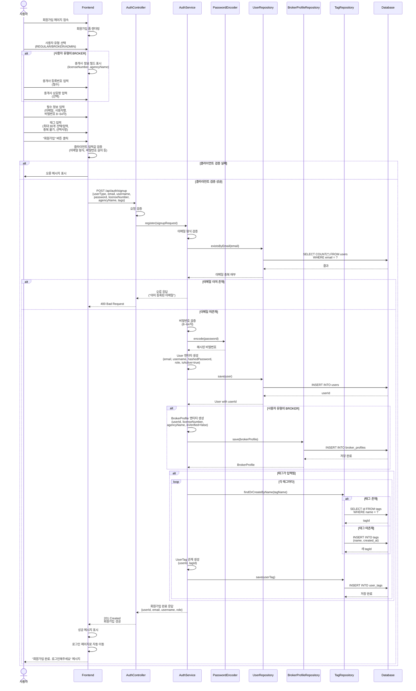
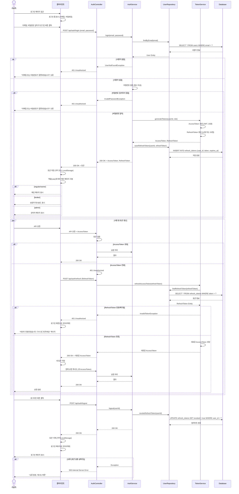
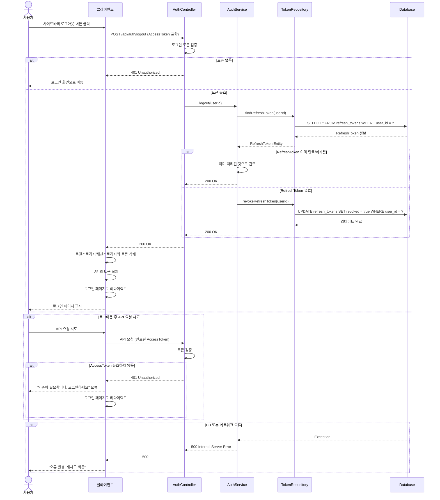
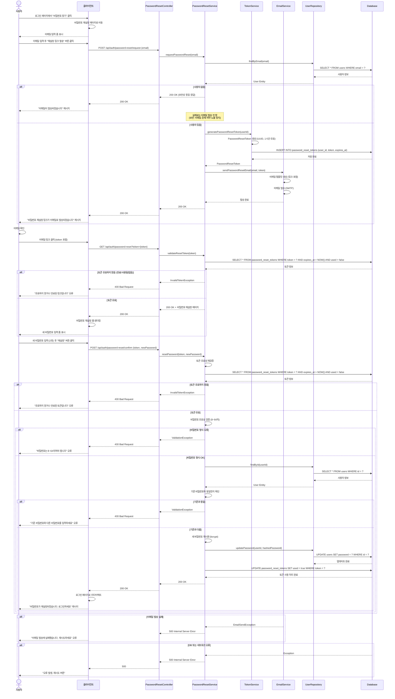

## #14 회원가입

**설명**  
사용자가 회원가입 페이지에 접속하면 Frontend는 회원가입 폼을 렌더링한다. 사용자는 사용자 유형(REGULAR/BROKER/ADMIN)을 선택한다. BROKER 선택 시 Frontend는 내부에서 중개사 정보 필드를 추가로 표시하고, 사용자는 등록번호(필수)와 상호명(선택)을 입력한다. 이후 필수 정보(이메일, 사용자명, 8~64자 비밀번호)와 태그(최대 30개, 중복 불가)를 입력하고 회원가입 버튼을 클릭한다.

Frontend는 내부에서 입력값을 검증한다. 클라이언트 검증이 실패하면 Frontend는 사용자에게 오류 메시지를 표시한다. 클라이언트 검증이 성공하면 Frontend는 AuthController로 POST 요청을 전송한다.

Controller는 내부에서 요청을 검증한 후 AuthService의 register 메서드를 호출한다. Service는 내부에서 이메일 형식을 검증한 후 UserRepository를 통해 이메일 중복을 확인한다. Repository는 Database에 SELECT 쿼리를 실행하여 중복 여부를 확인하고 결과를 Service로 반환한다. 이메일이 이미 존재하면 Service는 오류 응답을 Controller로 전달하고, Controller는 Frontend로 400 오류를 응답한다.

이메일이 미존재하면 Service는 내부에서 비밀번호를 검증(8~64자)한 후 PasswordEncoder를 통해 해시화한다. PasswordEncoder는 해시된 비밀번호를 Service로 반환한다. Service는 내부에서 User 엔티티를 생성한 후 UserRepository의 save 메서드를 호출한다. Repository는 Database에 INSERT 쿼리를 실행하여 사용자를 저장하고, Database는 생성된 userId를 Repository로 반환한다. Repository는 User 엔티티를 Service로 반환한다.

사용자 유형이 BROKER인 경우 Service는 내부에서 BrokerProfile 엔티티를 생성한 후 BrokerRepository의 save 메서드를 호출한다. Repository는 Database에 INSERT 쿼리를 실행하여 브로커 정보를 저장하고, Database는 저장 완료를 Repository로 알린다. Repository는 BrokerProfile을 Service로 반환한다.

태그가 입력된 경우 각 태그마다 Service는 TagRepository의 findOrCreateByName 메서드를 호출한다. 태그가 존재하면 Repository는 Database에서 SELECT하여 tagId를 반환하고, 태그가 미존재하면 Repository는 Database에 INSERT하여 새 tagId를 반환한다. Service는 내부에서 UserTag 관계를 생성한 후 TagRepository의 save 메서드를 호출한다. Repository는 Database에 INSERT 쿼리를 실행하여 관계를 저장한다.

모든 저장이 완료되면 Service는 회원가입 완료 응답을 Controller로 반환하고, Controller는 201 Created 응답을 Frontend로 전송한다. Frontend는 내부에서 성공 메시지를 표시하고 로그인 페이지로 자동 이동한 후, 사용자에게 "회원가입 완료. 로그인해주세요" 메시지를 표시한다.

---

## #15 로그인 / 토큰 관리

**설명**  
사용자가 로그인 페이지에 접근하면 클라이언트는 내부에서 로그인 폼을 표시한다. 사용자가 이메일과 비밀번호를 입력하고 로그인 버튼을 클릭하면 클라이언트는 AuthController로 POST 요청을 전송한다.

Controller는 AuthService의 login 메서드를 호출한다. Service는 UserRepository를 통해 이메일로 사용자를 조회한다. Repository는 Database에 SELECT 쿼리를 실행하고 사용자 정보를 Service로 반환한다. 사용자가 없으면 Service는 Controller로 예외를 전달하고, Controller는 클라이언트로 401 오류를 응답한다. 클라이언트는 오류 메시지를 사용자에게 표시한다.

사용자가 존재하면 Service는 내부에서 비밀번호를 검증한다. 비밀번호가 일치하지 않으면 Service는 Controller로 예외를 전달하고, Controller는 클라이언트로 401 오류를 응답한다. 클라이언트는 오류 메시지를 사용자에게 표시한다.

비밀번호가 일치하면 Service는 TokenService의 generateTokens 메서드를 호출한다. TokenService는 내부에서 AccessToken(JWT, 15분 유효)을 생성하고, RefreshToken(14일 또는 30일 유효)을 생성한 후 Service로 반환한다. Service는 Repository의 saveRefreshToken 메서드를 호출한다. Repository는 Database에 INSERT 쿼리를 실행하여 RefreshToken을 저장하고, Database는 저장 완료를 Repository로 알린다.

Service는 Controller로 200 응답과 AccessToken, RefreshToken을 전달한다. Controller는 클라이언트로 200 응답과 토큰을 전송한다. 클라이언트는 내부에서 토큰을 저장하고, 역할에 따라 메인 페이지로 이동한다. 역할이 regular/owner인 경우 메인 페이지를 표시하고, broker인 경우 브로커 대시보드를 표시하고, admin인 경우 관리자 페이지를 표시한다.

사용 중 사용자가 API 요청을 하면 클라이언트는 Controller로 API 요청과 AccessToken을 전송한다. Controller는 내부에서 토큰을 검증한다. AccessToken이 유효하면 Controller는 Service를 호출하여 요청을 처리하고, Service는 결과를 Controller로 반환한다. Controller는 클라이언트로 200 응답을 전송한다.

AccessToken이 만료되었으면 Controller는 내부에서 401 Unauthorized를 처리한다. 클라이언트는 Controller로 POST 요청과 RefreshToken을 전송한다. Controller는 TokenService의 refreshAccessToken 메서드를 호출한다. TokenService는 Repository를 통해 RefreshToken을 조회한다. Repository는 Database에 SELECT 쿼리를 실행하고 토큰 정보를 TokenService로 반환한다.

RefreshToken이 만료되거나 폐기되었으면 TokenService는 Controller로 예외를 전달하고, Controller는 클라이언트로 401 오류를 응답한다. 클라이언트는 내부에서 로그인 화면으로 리다이렉트하고 사용자에게 "세션이 만료되었습니다. 다시 로그인하세요" 메시지를 표시한다.

RefreshToken이 유효하면 TokenService는 내부에서 새로운 AccessToken을 생성하여 Controller로 반환한다. Controller는 클라이언트로 200 응답과 새로운 AccessToken을 전송한다. 클라이언트는 내부에서 새 토큰을 저장하고 원래 요청을 새 AccessToken과 함께 Controller로 재전송한다. Controller는 Service를 호출하여 요청을 처리하고, Service는 결과를 Controller로 반환한다. Controller는 클라이언트로 200 응답을 전송하고, 클라이언트는 요청 완료를 사용자에게 표시한다.

사용자가 로그아웃 버튼을 클릭하면 클라이언트는 Controller로 POST 요청을 전송한다. Controller는 Service의 logout 메서드를 호출한다. Service는 Repository의 revokeRefreshToken 메서드를 호출한다. Repository는 Database에 UPDATE 쿼리를 실행하여 RefreshToken을 무효화하고, Database는 업데이트 완료를 Repository로 알린다. Service는 Controller로 200 응답을 전달하고, Controller는 클라이언트로 200 응답을 전송한다. 클라이언트는 내부에서 토큰을 삭제하고, 로그인 페이지로 리다이렉트한 후 사용자에게 로그인 페이지를 표시한다.

오류가 발생하면 Service는 Controller로 예외를 전달하고, Controller는 클라이언트로 500 오류를 응답한다. 클라이언트는 오류 발생 메시지와 재시도 버튼을 사용자에게 표시한다.

---

## #16 로그아웃

**설명**  
사용자가 사이드바의 로그아웃 버튼을 클릭하면 클라이언트는 AccessToken을 포함하여 AuthController로 POST 요청을 전송한다. Controller는 내부에서 토큰을 검증하여 인증 상태를 확인한다. 토큰이 없으면 Controller는 클라이언트로 401 오류를 응답하고, 클라이언트는 로그인 화면으로 이동한다.

토큰이 유효하면 Controller는 AuthService의 logout 메서드를 호출한다. Service는 TokenRepository의 findRefreshToken 메서드를 통해 해당 사용자의 RefreshToken을 조회한다. Repository는 Database에 SELECT 쿼리를 실행하여 RefreshToken 정보를 조회하고 Service로 반환한다.

RefreshToken이 이미 만료되거나 폐기된 상태면 Service는 내부에서 이미 처리된 것으로 간주하고 Controller로 200 응답을 반환한다. RefreshToken이 유효한 경우 Service는 Repository의 revokeRefreshToken 메서드를 호출하여 토큰을 무효화한다. Repository는 Database에 UPDATE 쿼리를 실행하여 revoked를 true로 설정하고, Database는 업데이트 완료를 Repository로 알린다.

Service는 Controller로 200 응답을 전달하고, Controller는 클라이언트로 200 응답을 전송한다. 클라이언트는 내부에서 로컬스토리지와 세션스토리지의 토큰을 삭제하고, 쿠키의 토큰을 삭제한 후, 로그인 페이지로 리다이렉트한다. 클라이언트는 사용자에게 로그인 페이지를 표시한다.

로그아웃 후 사용자가 API 요청을 시도하면 클라이언트는 만료된 AccessToken과 함께 Controller로 API 요청을 전송한다. Controller는 내부에서 토큰을 검증한다. AccessToken이 유효하지 않으면 Controller는 클라이언트로 401 오류를 응답하고, 클라이언트는 "인증이 필요합니다. 로그인하세요" 오류 메시지를 사용자에게 표시한다. 클라이언트는 내부에서 로그인 페이지로 리다이렉트한다.

Database 또는 네트워크 오류가 발생하면 Database는 Service로 예외를 전달하고, Service는 Controller로 전달한다. Controller는 클라이언트로 500 오류를 응답하고, 클라이언트는 "오류 발생, 재시도 버튼" 메시지를 사용자에게 표시한다.

---

## #17 비밀번호 재설정

**설명**  
사용자가 로그인 페이지에서 "비밀번호 찾기"를 클릭하면 클라이언트는 내부에서 비밀번호 재설정 페이지로 이동한다. 클라이언트는 이메일 입력 폼을 사용자에게 표시한다.

사용자가 이메일을 입력하고 "재설정 링크 발송" 버튼을 클릭하면 클라이언트는 PasswordResetController로 POST 요청을 전송한다. Controller는 PasswordResetService의 requestPasswordReset 메서드를 호출한다. Service는 UserRepository의 findByEmail 메서드를 통해 이메일로 사용자를 조회한다. Repository는 Database에 SELECT 쿼리를 실행하고 사용자 정보를 Service로 반환한다.

사용자가 없으면 보안을 위해 Service는 Controller로 200 응답을 반환하고, Controller는 클라이언트로 전달한다. 클라이언트는 "이메일이 발송되었습니다" 메시지를 사용자에게 표시한다(실제로는 이메일 발송 안 함).

사용자가 존재하면 Service는 TokenService의 generatePasswordResetToken 메서드를 호출한다. TokenService는 내부에서 PasswordResetToken을 생성(UUID, 1시간 유효)한 후 Database에 INSERT 쿼리를 실행하여 저장한다. Database는 저장 완료를 TokenService로 알리고, TokenService는 PasswordResetToken을 Service로 반환한다. Service는 EmailService의 sendPasswordResetEmail 메서드를 호출한다. EmailService는 내부에서 재설정 링크가 포함된 이메일 템플릿을 생성하고, 이메일을 발송한 후 Service로 발송 완료를 알린다. Service는 Controller로 200 응답을 전달하고, Controller는 클라이언트로 전송한다. 클라이언트는 "비밀번호 재설정 링크가 이메일로 발송되었습니다" 메시지를 사용자에게 표시한다.

사용자가 이메일을 확인하고 링크를 클릭하면 클라이언트는 토큰을 포함하여 Controller로 GET 요청을 전송한다. Controller는 Service의 validateResetToken 메서드를 호출한다. Service는 Database에 SELECT 쿼리를 실행하여 토큰의 유효성을 검증한다. Database는 토큰 정보를 Service로 반환한다. 토큰이 만료되었거나 사용되었거나 없으면 Service는 Controller로 예외를 전달하고, Controller는 클라이언트로 400 오류를 응답한다. 클라이언트는 "유효하지 않거나 만료된 링크입니다" 오류 메시지를 사용자에게 표시한다.

토큰이 유효하면 Service는 Controller로 200 응답과 비밀번호 재설정 페이지를 전달하고, Controller는 클라이언트로 전송한다. 클라이언트는 내부에서 비밀번호 재설정 폼을 렌더링하여 새 비밀번호 입력 폼을 사용자에게 표시한다.

사용자가 새 비밀번호를 2회 입력하고 "재설정" 버튼을 클릭하면 클라이언트는 Controller로 POST 요청을 전송한다. Controller는 Service의 resetPassword 메서드를 호출한다. Service는 내부에서 토큰 유효성을 재검증하고 Database에 SELECT 쿼리를 실행한다. Database는 토큰 정보를 Service로 반환한다. 토큰이 유효하지 않으면 Service는 Controller로 예외를 전달하고, Controller는 클라이언트로 400 오류를 응답한다. 클라이언트는 "유효하지 않거나 만료된 토큰입니다" 오류 메시지를 사용자에게 표시한다.

토큰이 유효하면 Service는 내부에서 비밀번호 유효성을 검증한다(8~64자). 비밀번호 형식이 오류면 Service는 Controller로 예외를 전달하고, Controller는 클라이언트로 400 오류를 응답한다. 클라이언트는 "비밀번호는 8~64자여야 합니다" 오류 메시지를 사용자에게 표시한다.

비밀번호 형식이 맞으면 Service는 Repository의 findById 메서드를 호출한다. Repository는 Database에 SELECT 쿼리를 실행하여 사용자 정보를 조회하고 Service로 반환한다. Service는 내부에서 기존 비밀번호와 동일한지 확인한다. 기존과 동일하면 Service는 Controller로 예외를 전달하고, Controller는 클라이언트로 400 오류를 응답한다. 클라이언트는 "기존 비밀번호와 다른 비밀번호를 입력하세요" 오류 메시지를 사용자에게 표시한다.

기존과 다르면 Service는 내부에서 새 비밀번호를 해시화하고 Repository의 updatePassword 메서드를 호출한다. Repository는 Database에 UPDATE 쿼리를 실행하여 비밀번호를 저장하고, Database는 업데이트 완료를 Repository로 알린다. Service는 Database에 UPDATE 쿼리를 실행하여 토큰을 used=true로 설정하고, Database는 토큰 사용 처리 완료를 Service로 알린다.

Service는 Controller로 200 응답을 전달하고, Controller는 클라이언트로 전송한다. 클라이언트는 내부에서 로그인 페이지로 리다이렉트하고 "비밀번호가 재설정되었습니다. 로그인하세요" 메시지를 사용자에게 표시한다.

이메일 발송이 실패하면 EmailService는 Service로 예외를 전달하고, Service는 Controller로 전달한다. Controller는 클라이언트로 500 오류를 응답하고, 클라이언트는 "이메일 발송에 실패했습니다. 재시도하세요" 오류 메시지를 사용자에게 표시한다. Database 또는 네트워크 오류가 발생하면 Database는 Service로 예외를 전달하고, Service는 Controller로 전달한다. Controller는 클라이언트로 500 오류를 응답하고, 클라이언트는 "오류 발생, 재시도 버튼" 메시지를 사용자에게 표시한다.

---

## #18 사용자 프로필 관리

```mermaid
sequenceDiagram
    actor User as 사용자
    participant UI as Frontend
    participant Controller as UserController
    participant Service as UserService
    participant UserRepo as UserRepository
    participant BrokerRepo as BrokerProfileRepository
    participant TagRepo as TagRepository
    participant PasswordEncoder as PasswordEncoder
    participant DB as Database

    User->>UI: 프로필 버튼 클릭
    
    UI->>Controller: GET /api/user/profile
    
    Controller->>Controller: JWT 토큰 검증
    Controller->>Controller: 현재 userId 추출
    
    Controller->>Service: getProfileDetail(userId)
    
    Service->>UserRepo: findById(userId)
    UserRepo->>DB: SELECT users WHERE id = ?
    DB-->>UserRepo: User
    UserRepo-->>Service: User
    
    alt 사용자의 role이 BROKER
        Service->>BrokerRepo: findById(userId)
        BrokerRepo->>DB: SELECT broker_profiles WHERE user_id = ?
        DB-->>BrokerRepo: BrokerProfile
        BrokerRepo-->>Service: BrokerProfile
    end
    
    Service->>TagRepo: findUserTags(userId)
    TagRepo->>DB: SELECT tags FROM user_tags WHERE user_id = ?
    DB-->>TagRepo: 태그 목록
    TagRepo-->>Service: List<Tag>
    
    Service->>Service: 프로필 정보 조합<br/>(이메일, 닉네임, 역할, 전화번호,<br/>소개글, 사진, 태그 목록)
    
    Service-->>Controller: 프로필 정보 응답
    
    Controller-->>UI: 200 OK<br/>{프로필 정보}
    
    UI->>UI: 프로필 패널에 정보 표시
    
    alt 프로필 수정을 원하지 않음
        UI-->>User: 프로필 조회 완료
    else 프로필 수정 버튼 클릭
        User->>UI: "프로필 수정" 버튼 클릭
        
        UI->>UI: 프로필 수정 폼 활성화<br/>(현재 정보 미리 채우기)
        
        User->>UI: 기본 정보 수정<br/>(전화번호, 소개글 등)
        
        alt 사진 변경
            User->>UI: 새로운 사진 업로드
            UI->>UI: 이미지 미리보기 표시
        end
        
        alt 태그 변경
            User->>UI: 태그 삭제 및 추가
            UI->>UI: 태그 최대 30개 확인
            UI->>UI: 중복 태그 검사
        end
        
        alt 비밀번호 변경 필요
            User->>UI: "비밀번호 변경" 섹션<br/>현재 비밀번호 입력
            User->>UI: 새 비밀번호 입력 (8~64자)
            User->>UI: 새 비밀번호 재입력
            
            UI->>UI: 유효성 검증<br/>(길이, 동일성)
        end
        
        User->>UI: "수정 완료" 버튼 클릭
        
        UI->>UI: 클라이언트 검증
        
        alt 비밀번호 변경 포함
            UI->>Controller: PUT /api/user/profile<br/>{기본정보, 태그, 새비밀번호}
        else 비밀번호 변경 미포함
            UI->>Controller: PUT /api/user/profile<br/>{기본정보, 태그}
        end
        
        Controller->>Controller: JWT 토큰 검증
        Controller->>Controller: 현재 userId 추출
        
        Controller->>Service: updateProfile(userId, updateRequest)
        
        Service->>UserRepo: findById(userId)
        UserRepo->>DB: SELECT users WHERE id = ?
        DB-->>UserRepo: User
        UserRepo-->>Service: User
        
        alt 비밀번호 변경 요청됨
            Service->>Service: 현재 비밀번호 입력 검증 필요<br/>확인
            
            Service->>PasswordEncoder: encode(currentPassword)
            PasswordEncoder-->>Service: 비교를 위한 해시
            
            Service->>Service: 입력된 현재 비밀번호와<br/>저장된 비밀번호 비교
            
            alt 현재 비밀번호 일치하지 않음
                Service-->>Controller: 오류 응답<br/>("현재 비밀번호가 일치하지 않습니다")
                Controller-->>UI: 400 Bad Request
            else 현재 비밀번호 일치
                Service->>Service: 새 비밀번호와 기존 비밀번호<br/>동일성 확인
                
                alt 새 비밀번호 = 기존 비밀번호
                    Service-->>Controller: 오류 응답<br/>("새 비밀번호는 기존과 달라야 합니다")
                    Controller-->>UI: 400 Bad Request
                else 새 비밀번호 ≠ 기존 비밀번호
                    Service->>PasswordEncoder: encode(newPassword)
                    PasswordEncoder-->>Service: 새 해시 비밀번호
                end
            end
        end
        
        Service->>Service: 기본 정보 업데이트<br/>(전화번호, 소개글, 이미지 URL)
        
        alt 태그 수정됨
            Service->>TagRepo: 기존 UserTag 삭제
            loop 각 기존 태그마다
                Service->>DB: DELETE FROM user_tags
                DB-->>TagRepo: 삭제 완료
            end
            
            loop 각 새 태그마다
                Service->>TagRepo: findOrCreateByName(tagName)
                
                alt 태그 존재
                    TagRepo->>DB: SELECT id FROM tags WHERE name = ?
                    DB-->>TagRepo: tagId
                else 태그 미존재
                    TagRepo->>DB: INSERT INTO tags(name)
                    DB-->>TagRepo: 새 tagId
                end
                
                Service->>TagRepo: createUserTag(userId, tagId)
                TagRepo->>DB: INSERT INTO user_tags
                DB-->>TagRepo: 저장 완료
            end
        end
        
        Service->>UserRepo: save(User)
        UserRepo->>DB: UPDATE users<br/>SET updated_at = NOW()
        DB-->>UserRepo: 업데이트 완료
        UserRepo-->>Service: User
        
        Service-->>Controller: 수정 완료 응답
        
        Controller-->>UI: 200 OK<br/>{업데이트된 프로필 정보}
        
        UI->>UI: 성공 메시지 표시
        UI->>UI: 프로필 패널 새로고침
        UI-->>User: 프로필 수정 완료
    end

```

**설명**  
사용자가 프로필 버튼을 클릭하면 Frontend는 UserController로 GET 요청을 전송한다. Controller는 내부에서 JWT 토큰을 검증하여 현재 userId를 추출한 후 UserService의 getProfileDetail 메서드를 호출한다.

Service는 UserRepository의 findById 메서드를 통해 사용자 정보를 조회한다. Repository는 Database에 SELECT 쿼리를 실행하고 User 정보를 Service로 반환한다. 사용자의 역할이 BROKER인 경우 Service는 BrokerRepository의 findById 메서드를 통해 브로커 프로필 정보를 조회한다. Repository는 Database에 SELECT 쿼리를 실행하여 BrokerProfile을 조회하고 Service로 반환한다.

Service는 TagRepository의 findUserTags 메서드를 통해 사용자와 연결된 태그 목록을 조회한다. Repository는 Database에 SELECT 쿼리를 실행하여 태그 목록을 조회하고 Service로 반환한다. Service는 내부에서 프로필 정보를 조합하여 Controller로 프로필 정보 응답을 전달한다. Controller는 Frontend로 200 응답과 프로필 정보를 전송한다. Frontend는 내부에서 프로필 패널에 정보를 표시한다.

프로필 수정을 원하지 않으면 Frontend는 프로필 조회 완료를 사용자에게 표시한다. 사용자가 "프로필 수정" 버튼을 클릭하면 Frontend는 내부에서 프로필 수정 폼을 활성화하고 현재 정보를 미리 채운다. 사용자는 기본 정보(전화번호, 소개글 등)를 수정한다.

사진을 변경하는 경우 사용자가 새로운 사진을 업로드하면 Frontend는 내부에서 이미지 미리보기를 표시한다. 태그를 변경하는 경우 사용자가 태그를 삭제하고 추가하면 Frontend는 내부에서 태그 최대 30개를 확인하고 중복 태그를 검사한다. 비밀번호 변경이 필요한 경우 사용자가 현재 비밀번호를 입력하고, 새 비밀번호(8~64자)를 입력하고, 새 비밀번호를 재입력하면 Frontend는 내부에서 유효성을 검증한다.

사용자가 "수정 완료" 버튼을 클릭하면 Frontend는 내부에서 클라이언트 검증을 수행한다. 비밀번호 변경이 포함된 경우 Frontend는 Controller로 PUT 요청(기본정보, 태그, 새비밀번호)을 전송하고, 포함되지 않은 경우 PUT 요청(기본정보, 태그)을 전송한다.

Controller는 내부에서 JWT 토큰을 검증하여 현재 userId를 추출한 후 UserService의 updateProfile 메서드를 호출한다. Service는 UserRepository의 findById 메서드를 통해 사용자 정보를 조회한다. Repository는 Database에 SELECT 쿼리를 실행하고 User 정보를 Service로 반환한다.

비밀번호 변경이 요청된 경우 Service는 내부에서 현재 비밀번호 입력 검증이 필요한지 확인한다. Service는 PasswordEncoder의 encode 메서드를 통해 현재 비밀번호를 해시화하고, PasswordEncoder는 비교를 위한 해시를 Service로 반환한다. Service는 내부에서 입력된 현재 비밀번호와 저장된 비밀번호를 비교한다. 현재 비밀번호가 일치하지 않으면 Service는 Controller로 오류 응답을 전달하고, Controller는 Frontend로 400 오류를 응답한다.

현재 비밀번호가 일치하면 Service는 내부에서 새 비밀번호와 기존 비밀번호의 동일성을 확인한다. 새 비밀번호가 기존 비밀번호와 같으면 Service는 Controller로 오류 응답을 전달하고, Controller는 Frontend로 400 오류를 응답한다. 새 비밀번호가 기존 비밀번호와 다르면 Service는 PasswordEncoder의 encode 메서드를 통해 새 비밀번호를 해시화하고, PasswordEncoder는 새 해시 비밀번호를 Service로 반환한다.

Service는 내부에서 기본 정보를 업데이트한다(전화번호, 소개글, 이미지 URL). 태그가 수정된 경우 Service는 TagRepository를 통해 기존 UserTag를 삭제한다. 각 기존 태그마다 Service는 Database에 DELETE 쿼리를 실행하고, Database는 삭제 완료를 TagRepository로 알린다. 그 후 각 새 태그마다 Service는 TagRepository의 findOrCreateByName 메서드를 호출한다. 태그가 존재하면 Repository는 Database에 SELECT 쿼리를 실행하여 tagId를 반환하고, 태그가 미존재하면 Repository는 Database에 INSERT 쿼리를 실행하여 새 tagId를 반환한다.

Service는 TagRepository의 createUserTag 메서드를 호출하고, Repository는 Database에 INSERT 쿼리를 실행하여 관계를 저장한다. Database는 저장 완료를 Repository로 알린다. Service는 UserRepository의 save 메서드를 호출한다. Repository는 Database에 UPDATE 쿼리를 실행하여 사용자 정보와 updated_at을 갱신하고, Database는 업데이트 완료를 Repository로 알린다. Repository는 User를 Service로 반환한다.

Service는 Controller로 수정 완료 응답을 전달하고, Controller는 Frontend로 200 응답과 업데이트된 프로필 정보를 전송한다. Frontend는 내부에서 성공 메시지를 표시하고 프로필 패널을 새로고침한 후, 사용자에게 프로필 수정 완료를 표시한다.
