# 1. 매물 등록 신청

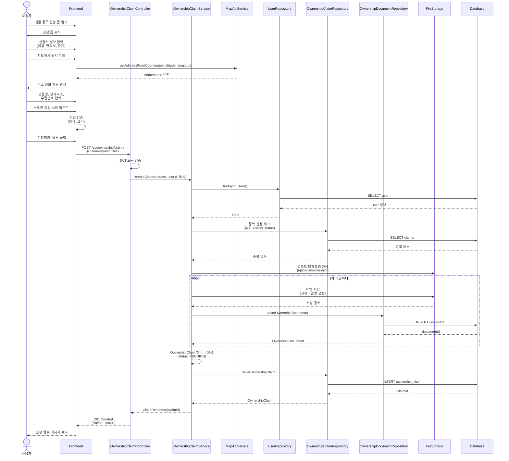
```mermaid
sequenceDiagram
    actor User as 사용자
    participant UI as Frontend
    participant Controller as OwnershipClaimController
    participant Service as OwnershipClaimService
    participant MapAPI as MapApiService
    participant UserRepo as UserRepository
    participant ClaimRepo as OwnershipClaimRepository
    participant DocRepo as OwnershipDocumentRepository
    participant FileStorage as FileStorage
    participant DB as Database

    User->>UI: 매물 등록 신청 폼 열기
    UI->>User: 신청 폼 표시

    User->>UI: 신청자 정보 입력<br/>(이름, 연락처, 관계)
    User->>UI: 지도에서 위치 선택

    UI->>MapAPI: getAddressFromCoordinates(latitude, longitude)
    MapAPI-->>UI: AddressInfo 반환
    UI->>User: 주소 정보 자동 완성

    User->>UI: 건물명, 상세주소,<br/>우편번호 입력
    User->>UI: 소유권 증명 서류 업로드

    UI->>UI: 파일 검증<br/>(형식, 크기)

    User->>UI: "신청하기" 버튼 클릭

    UI->>Controller: POST /api/ownership/claims<br/>(ClaimRequest, files)

    Controller->>Controller: JWT 토큰 검증

    Controller->>Service: createClaim(request, userId, files)

    Service->>UserRepo: findById(userId)
    UserRepo->>DB: SELECT user
    DB-->>UserRepo: User 정보
    UserRepo-->>Service: User

    Service->>ClaimRepo: 중복 신청 체크<br/>(주소, userId, status)
    ClaimRepo->>DB: SELECT claims
    DB-->>ClaimRepo: 중복 여부
    ClaimRepo-->>Service: 중복 없음

    Service->>FileStorage: 업로드 디렉토리 생성<br/>(uploads/ownership/)

    loop 각 파일마다
        Service->>FileStorage: 파일 저장<br/>(고유파일명 생성)
        FileStorage-->>Service: 저장 경로

        Service->>DocRepo: save(OwnershipDocument)
        DocRepo->>DB: INSERT document
        DB-->>DocRepo: documentId
        DocRepo-->>Service: OwnershipDocument
    end

    Service->>Service: OwnershipClaim 엔티티 생성<br/>(status: PENDING)

    Service->>ClaimRepo: save(OwnershipClaim)
    ClaimRepo->>DB: INSERT ownership_claim
    DB-->>ClaimRepo: claimId
    ClaimRepo-->>Service: OwnershipClaim

    Service-->>Controller: ClaimResponse(claimId)
    Controller-->>UI: 201 Created<br/>{claimId, status}
    UI-->>User: 신청 완료 메시지 표시

```
---

**설명**
소유자가 소유권을 증명하려고 화면에 진입하면 클라이언트는 먼저 소유권 신청 폼을 렌더링해 신청자 정보(이름, 연락처, 관계)와 위치를 입력하게 하고, 사용자가 지도에서 좌표를 찍으면 UI가 MapApiService의 getAddressFromCoordinates(latitude, longitude)를 호출해 사람이 읽을 수 있는 주소를 받아 자동 완성해 준 뒤 사용자가 건물명·상세주소·우편번호를 추가로 입력하고 소유권 증명 서류(등기부등본, 매매계약서, 위임장 등)를 업로드하면 프런트는 파일 형식·크기를 1차로 검증한 다음 사용자가 “신청하기”를 누르는 순간까지는 서버에 아무것도 저장하지 않다가 버튼 클릭 시 입력된 신청 데이터(ClaimRequest)와 업로드된 파일들을 multipart 형태로 묶어 POST /api/ownership/claims로 보낸다; 컨트롤러는 이 요청을 받자마자 헤더의 JWT를 검증해 실제 로그인된 사용자 ID를 확보하고, 검증에 실패하면 401/403을 바로 반환하지만 통과하면 OwnershipClaimService.createClaim(request, userId, files)를 호출해 비즈니스 로직으로 넘기며, 서비스는 첫 단계로 UserRepository.findById(userId)로 신청자가 실제 존재하는지 DB에서 확인하고 없으면 404를 던진다; 사용자가 존재하면 이제 “이 주소로 이미 처리 중인 신청이 있는가”를 막기 위해 OwnershipClaimRepository에서 주소·userId·상태(PENDING)를 조건으로 중복 신청을 검사해 동일한 주소에 아직 끝나지 않은(PENDING) 신청이 있으면 비즈니스 충돌로 보고 409 Conflict를 리턴해 사용자가 같은 주소를 여러 번 올리는 것을 차단한다; 중복이 없을 때에만 파일 저장을 진행하는데, 먼저 FileStorage에 uploads/ownership/ 같은 전용 디렉터리를 만들거나 준비시킨 뒤 업로드된 파일 목록을 한 개씩 돌면서 서버 내부용으로 충돌 없는 고유 파일명을 생성해 저장하고, 실제 저장 경로·원본명·MIME 타입 등을 OwnershipDocument 엔티티로 만들어 OwnershipDocumentRepository에 INSERT 해 문서마다 하나씩 DB에 기록해 둔다(이 부분이 다이어그램의 loop 각 파일마다에 해당한다); 모든 파일이 정상적으로 저장되면 이제서야 본 신청 엔티티인 OwnershipClaim을 조립하는데 여기에는 신청한 사용자, 주소·좌표·상세주소 정보, 방금 저장해 둔 증빙 문서들의 참조, 생성 시간, 그리고 가장 중요하게는 “아직 관리자가 승인하지 않았다”는 뜻의 상태값 status = PENDING이 들어가며 이 엔티티를 OwnershipClaimRepository.save(...)로 DB에 영속화하면 DB가 새 claimId를 발급해 주고, 서비스는 이 claimId와 현재 상태를 포함한 ClaimResponse를 컨트롤러에 넘긴다; 컨트롤러는 이를 받아 HTTP 201 Created와 {claimId, status: "PENDING"} 같은 JSON을 응답해 주고, 프런트는 이 결과를 받아 “소유권 신청이 접수되었습니다” 같은 토스트나 안내 문구를 띄우면서 화면의 상태를 “대기중”으로 바꾼다; 전체적으로 이 구조는 네가 위에서 예로 든 “브로커 위임 요청” 플로우와 거의 같아서 그쪽이 POST /delegations → 컨트롤러 인증 → 서비스에서 매물 존재 확인 → 소유자 일치성 확인 → PENDING 중복 위임 검사 → Delegation 엔티티 생성(status=PENDING) → 저장 → 201 반환으로 흘렀듯이, 여기서는 주소 기반 중복 검사와 파일 스토리지 단계가 추가돼 있을 뿐 패턴은 “UI가 입력 수집 → 컨트롤러가 인증 → 서비스가 존재성·중복성·상태를 검증 → 엔티티를 PENDING으로 저장 → 201과 식별자 반환”이라는 동일한 5단 구성이다.

---

# 2. 매물 신청 현황 조회

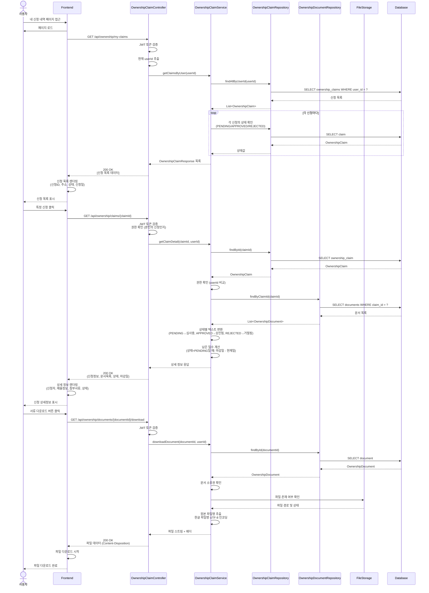
```mermaid
sequenceDiagram
    actor User as 사용자
    participant UI as Frontend
    participant Controller as OwnershipClaimController
    participant Service as OwnershipClaimService
    participant ClaimRepo as OwnershipClaimRepository
    participant DocRepo as OwnershipDocumentRepository
    participant FileStorage as FileStorage
    participant DB as Database

    User->>UI: 내 신청 내역 페이지 접근
    UI->>User: 페이지 로드

    UI->>Controller: GET /api/ownership/my-claims

    Controller->>Controller: JWT 토큰 검증
    Controller->>Controller: 현재 userId 추출

    Controller->>Service: getClaimsByUser(userId)

    Service->>ClaimRepo: findAllByUserId(userId)
    ClaimRepo->>DB: SELECT ownership_claims WHERE user_id = ?
    DB-->>ClaimRepo: 신청 목록
    ClaimRepo-->>Service: List<OwnershipClaim>

    loop 각 신청마다
        Service->>ClaimRepo: 각 신청의 상태 확인<br/>(PENDING/APPROVED/REJECTED)
        ClaimRepo->>DB: SELECT claim
        DB-->>ClaimRepo: OwnershipClaim
        ClaimRepo-->>Service: 상태값
    end

    Service-->>Controller: OwnershipClaimResponse 목록

    Controller-->>UI: 200 OK<br/>[신청 목록 데이터]

    UI->>UI: 신청 목록 렌더링<br/>(신청ID, 주소, 상태, 신청일)
    UI-->>User: 신청 목록 표시

    User->>UI: 특정 신청 클릭

    UI->>Controller: GET /api/ownership/claims/{claimId}

    Controller->>Controller: JWT 토큰 검증<br/>권한 확인 (본인의 신청인지)

    Controller->>Service: getClaimDetail(claimId, userId)

    Service->>ClaimRepo: findById(claimId)
    ClaimRepo->>DB: SELECT ownership_claim
    DB-->>ClaimRepo: OwnershipClaim
    ClaimRepo-->>Service: OwnershipClaim

    Service->>Service: 권한 확인 (userId 비교)

    Service->>DocRepo: findByClaimId(claimId)
    DocRepo->>DB: SELECT documents WHERE claim_id = ?
    DB-->>DocRepo: 문서 목록
    DocRepo-->>Service: List<OwnershipDocument>

    Service->>Service: 상태별 텍스트 변환<br/>(PENDING→심사중, APPROVED→승인됨, REJECTED→거절됨)

    Service->>Service: 남은 일수 계산<br/>(상태=PENDING일 때: 마감일 - 현재일)

    Service-->>Controller: 상세 정보 응답

    Controller-->>UI: 200 OK<br/>{신청정보, 문서목록, 상태, 마감일}

    UI->>UI: 상세 정보 렌더링<br/>(신청자, 매물정보, 첨부서류, 상태)
    UI-->>User: 신청 상세정보 표시

    User->>UI: 서류 다운로드 버튼 클릭

    UI->>Controller: GET /api/ownership/documents/{documentId}/download

    Controller->>Controller: JWT 토큰 검증

    Controller->>Service: downloadDocument(documentId, userId)

    Service->>DocRepo: findById(documentId)
    DocRepo->>DB: SELECT document
    DB-->>DocRepo: OwnershipDocument
    DocRepo-->>Service: OwnershipDocument

    Service->>Service: 문서 소유권 확인

    Service->>FileStorage: 파일 존재 여부 확인
    FileStorage-->>Service: 파일 경로 및 상태

    Service->>Service: 원본 파일명 추출<br/>한글 파일명 UTF-8 인코딩

    Service-->>Controller: 파일 스트림 + 헤더

    Controller-->>UI: 200 OK<br/>파일 데이터 (Content-Disposition)

    UI->>UI: 파일 다운로드 시작
    UI-->>User: 파일 다운로드 완료

```
---

**설명**
사용자가 내 소유권 신청 현황을 확인하려고 “내 신청 내역” 화면에 들어가면 프런트엔드는 먼저 페이지를 렌더링한 뒤 바로 서버에 GET /api/ownership/my-claims를 호출해 현재 로그인한 사용자가 올렸던 소유권 신청 목록을 가져온다; 컨트롤러는 이 요청을 받자마자 JWT 토큰을 검증해 유효한 로그인인지 확인하고, 토큰에서 현재 사용자 ID를 추출한 다음 OwnershipClaimService.getClaimsByUser(userId)를 호출한다; 서비스는 이 userId로 OwnershipClaimRepository.findAllByUserId(userId)를 실행해 DB에서 SELECT ownership_claims WHERE user_id = ?로 해당 사용자가 올린 모든 신청 레코드를 가져오고, 가져온 목록에 대해 필요하다면 각 신청의 최신 상태(PENDING/APPROVED/REJECTED)를 다시 한 번 확인하기 위해 루프를 돌며 리포지토리에서 개별 건을 조회해 상태값을 확정한다(다이어그램의 loop 각 신청마다 부분); 이렇게 정리된 신청 목록을 서비스가 컨트롤러로 돌려주면 컨트롤러는 200 OK와 함께 [신청ID, 주소, 상태, 신청일] 같은 요약 정보 배열을 응답하고, 프런트는 이걸 목록 형태로 렌더링해 사용자에게 보여준다; 사용자가 목록 중 하나를 눌러 상세를 보려고 하면 프런트는 해당 신청의 식별자를 가지고 GET /api/ownership/claims/{claimId}를 다시 서버에 보낸다; 컨트롤러는 또다시 JWT를 검증한 뒤 “이 신청이 정말 이 사용자 것이냐”를 확인하는 권한 체크를 하고, 통과하면 getClaimDetail(claimId, userId)를 서비스에 위임한다; 서비스는 먼저 OwnershipClaimRepository.findById(claimId)로 신청 본문을 DB에서 꺼내고, 꺼낸 엔티티의 userId와 현재 요청자의 userId가 같은지 비교해 본인 신청이 아닌 경우를 차단한다(여기서 다르면 403/404를 던질 수 있음); 본인 신청이 맞으면 이번에는 신청에 첨부돼 있던 서류들을 보여주기 위해 OwnershipDocumentRepository.findByClaimId(claimId)를 호출해 SELECT documents WHERE claim_id = ?로 문서 목록을 전부 가져오고, 이 문서들을 응답 DTO에 붙이기 전에 상태값을 사람이 읽기 쉬운 형태로 변환한다(예: PENDING → “심사중”, APPROVED → “승인됨”, REJECTED → “거절됨”); 또 PENDING 상태인 경우에는 “심사 예상 마감일” 같은 정보를 보여주기 위해 현재일과 마감일을 가지고 남은 일수를 계산해 둔다; 이렇게 조립된 상세 응답을 서비스가 컨트롤러에 돌려주면 컨트롤러는 200 OK와 함께 {신청정보, 문서목록, 상태(텍스트), 마감일/남은일수}를 반환하고, 프런트는 이를 신청자·주소/매물 정보·첨부 서류 리스트·현재 심사 상태로 나눠서 화면에 뿌린다; 이후 사용자가 “첨부 서류 다운로드”를 누르면 프런트는 그 문서의 식별자로 GET /api/ownership/documents/{documentId}/download를 호출하고, 컨트롤러는 다시 JWT를 검증한 뒤 downloadDocument(documentId, userId)를 서비스에 요청한다; 서비스는 먼저 DocRepo.findById(documentId)로 해당 문서를 DB에서 찾고(여기에는 어떤 신청에 속한 문서인지, 실제 저장 경로가 어디인지가 들어 있음), 그 문서가 속한 신청의 소유자가 지금 요청한 사용자와 같은지 확인해 문서 무단 열람을 막은 뒤, 실제 파일이 스토리지에 존재하는지 FileStorage에 묻는다; 스토리지에서 파일 경로와 상태를 돌려주면 서비스는 원본 파일명을 꺼내 한글 파일명이라도 깨지지 않도록 UTF-8로 인코딩한 Content-Disposition 헤더를 세팅해 컨트롤러로 돌려주고, 컨트롤러는 200 OK와 함께 실제 파일 스트림을 응답해준다; 프런트는 이 응답을 받아 곧바로 다운로드를 시작하고, 사용자에게 “파일 다운로드 완료”를 보여주면 전체 플로우가 끝난다.

---

# 3. 매물 관리 현황 요약

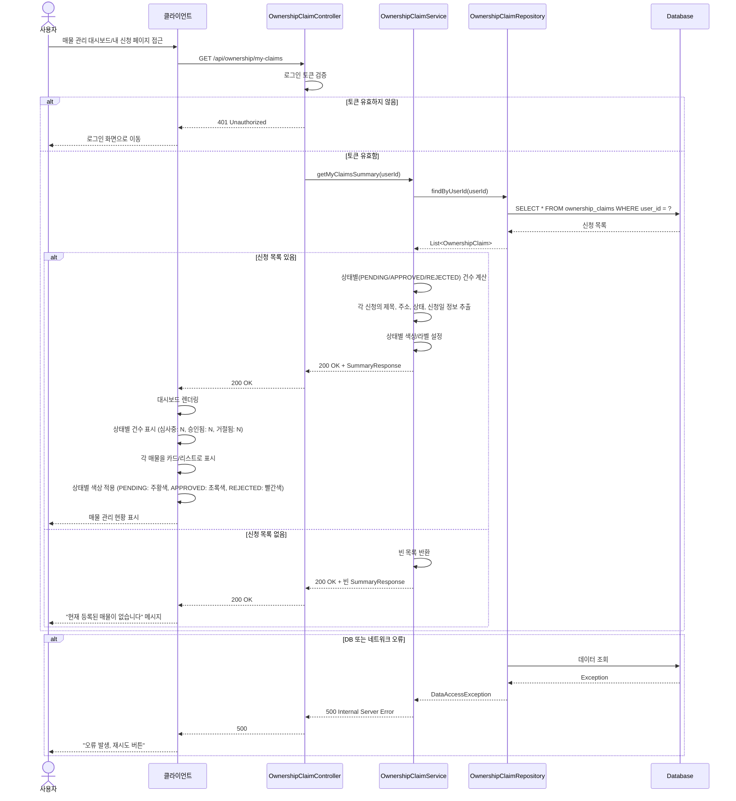
```mermaid
sequenceDiagram
    actor User as 사용자
    participant UI as 클라이언트
    participant Controller as OwnershipClaimController
    participant Service as OwnershipClaimService
    participant Repository as OwnershipClaimRepository
    participant DB as Database

    User->>UI: 매물 관리 대시보드/내 신청 페이지 접근
    UI->>Controller: GET /api/ownership/my-claims

    Controller->>Controller: 로그인 토큰 검증
    alt 토큰 유효하지 않음
        Controller-->>UI: 401 Unauthorized
        UI-->>User: 로그인 화면으로 이동
    else 토큰 유효함
        Controller->>Service: getMyClaimsSummary(userId)

        Service->>Repository: findByUserId(userId)
        Repository->>DB: SELECT * FROM ownership_claims WHERE user_id = ?
        DB-->>Repository: 신청 목록
        Repository-->>Service: List<OwnershipClaim>

        alt 신청 목록 있음
            Service->>Service: 상태별(PENDING/APPROVED/REJECTED) 건수 계산
            Service->>Service: 각 신청의 제목, 주소, 상태, 신청일 정보 추출
            Service->>Service: 상태별 색상/라벨 설정
            Service-->>Controller: 200 OK + SummaryResponse

            Controller-->>UI: 200 OK
            UI->>UI: 대시보드 렌더링
            UI->>UI: 상태별 건수 표시 (심사중: N, 승인됨: N, 거절됨: N)
            UI->>UI: 각 매물을 카드/리스트로 표시
            UI->>UI: 상태별 색상 적용 (PENDING: 주황색, APPROVED: 초록색, REJECTED: 빨간색)
            UI-->>User: 매물 관리 현황 표시

        else 신청 목록 없음
            Service->>Service: 빈 목록 반환
            Service-->>Controller: 200 OK + 빈 SummaryResponse
            Controller-->>UI: 200 OK
            UI-->>User: "현재 등록된 매물이 없습니다" 메시지
        end
    end

    alt DB 또는 네트워크 오류
        Repository->>DB: 데이터 조회
        DB-->>Repository: Exception
        Repository-->>Service: DataAccessException
        Service-->>Controller: 500 Internal Server Error
        Controller-->>UI: 500
        UI-->>User: "오류 발생, 재시도 버튼"
    end

```
---

**설명**
사용자가 매물 관리 대시보드(혹은 “내 신청” 페이지)에 들어오면 클라이언트는 먼저 로그인 여부를 신뢰하지 않고 항상 서버에 `GET /api/ownership/my-claims`를 쏴서 최신 소유권 신청 현황을 가져오려 하고, 컨트롤러는 이 요청을 받자마자 로그인 토큰(JWT)을 검증해 유효하지 않으면 즉시 401 Unauthorized를 돌려보내서 프런트가 로그인 화면으로 보내게 하며, 토큰이 유효한 경우에만 현재 사용자 ID를 꺼내 `OwnershipClaimService.getMyClaimsSummary(userId)`를 호출한다; 서비스는 이 사용자에 대해 어떤 소유권 신청이 있었는지 보려고 `OwnershipClaimRepository.findByUserId(userId)`를 호출하고, 리포지토리는 DB에 `SELECT * FROM ownership_claims WHERE user_id = ?`를 날려 이 사용자가 올렸던 모든 신청 행을 가져와 서비스로 넘긴다; 서비스는 반환된 목록이 비어 있지 않은 경우에만 대시보드에서 바로 쓸 수 있게 가공하는데, 먼저 상태별로(PENDING/APPROVED/REJECTED) 개수를 집계해 “심사중 몇 건, 승인됨 몇 건, 거절됨 몇 건”을 계산하고, 동시에 각 신청에서 화면에 보여줄 핵심 필드(제목/주소/상태/신청일)를 뽑아 리스트로 만들며, 상태값에 따라 뱃지나 카드에 적용할 색상/라벨 정보도 같이 붙여 SummaryResponse 형태로 컨트롤러에 돌려준다; 컨트롤러는 이걸 200 OK로 그대로 응답하고, 프런트는 응답에 담긴 “상태별 건수”를 대시보드 상단에 표시하고, 아래쪽에는 개별 신청을 카드/리스트로 뿌리면서 상태에 따라 PENDING은 주황, APPROVED는 초록, REJECTED는 빨강처럼 시각적으로 구분해 사용자가 한눈에 현재 소유권 신청 진행 상황을 볼 수 있게 만든다; 반대로 DB에서 이 사용자에 대한 신청이 한 건도 안 나왔을 경우 서비스는 비어 있는 SummaryResponse(건수 0, 목록 빈 배열)를 반환하고, 프런트는 같은 200 OK를 받더라도 “현재 등록된 매물이 없습니다”나 “신청 내역이 없습니다”라는 안내 문구만 보여준다; 이 전체 과정 중에 DB나 네트워크에서 예외가 터지면 리포지토리가 예외를 서비스로, 서비스가 다시 컨트롤러로 전파해 컨트롤러가 500 Internal Server Error를 반환하고, 프런트는 이때 “오류가 발생했습니다. 다시 시도해주세요.” 같은 메시지와 재시도 버튼을 노출해 사용자가 동일 요청을 다시 보낼 수 있게 한다.

---

# 4. 지도 위치 설정 기능

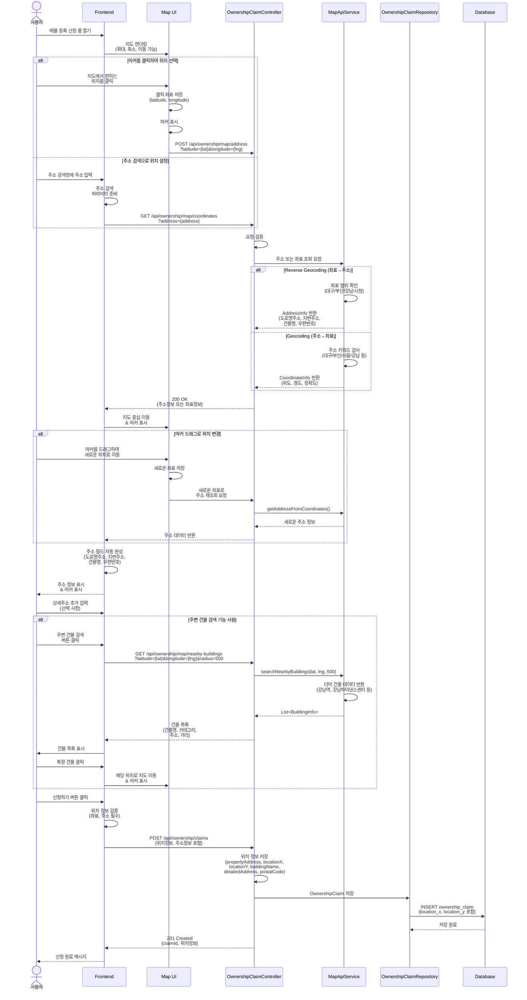
```mermaid
sequenceDiagram
    actor User as 사용자
    participant UI as Frontend
    participant MapComponent as Map UI
    participant Controller as OwnershipClaimController
    participant MapService as MapApiService
    participant Repository as OwnershipClaimRepository
    participant DB as Database

    User->>UI: 매물 등록 신청 폼 열기
    UI->>MapComponent: 지도 렌더링<br/>(확대, 축소, 이동 가능)

    alt 마커를 클릭하여 위치 선택
        User->>MapComponent: 지도에서 원하는<br/>위치를 클릭
        MapComponent->>MapComponent: 클릭 좌표 저장<br/>(latitude, longitude)
        MapComponent->>MapComponent: 마커 표시

        MapComponent->>Controller: POST /api/ownership/map/address<br/>?latitude={lat}&longitude={lng}
    else 주소 검색으로 위치 설정
        User->>UI: 주소 검색창에 주소 입력
        UI->>UI: 주소 검색<br/>파라미터 준비

        UI->>Controller: GET /api/ownership/map/coordinates<br/>?address={address}
    end

    Controller->>Controller: 요청 검증

    Controller->>MapService: 주소 또는 좌표 조회 요청

    alt Reverse Geocoding (좌표→주소)
        MapService->>MapService: 좌표 범위 확인<br/>(대구/부산/강남/시청)
        MapService-->>Controller: AddressInfo 반환<br/>(도로명주소, 지번주소,<br/>건물명, 우편번호)
    else Geocoding (주소→좌표)
        MapService->>MapService: 주소 키워드 검사<br/>(대구/부산/서울/강남 등)
        MapService-->>Controller: CoordinateInfo 반환<br/>(위도, 경도, 정확도)
    end

    Controller-->>UI: 200 OK<br/>{주소정보 또는 좌표정보}

    UI->>MapComponent: 지도 중심 이동<br/>& 마커 표시

    alt 마커 드래그로 위치 변경
        User->>MapComponent: 마커를 드래그하여<br/>새로운 위치로 이동
        MapComponent->>MapComponent: 새로운 좌표 저장

        MapComponent->>Controller: 새로운 좌표로<br/>주소 재조회 요청
        Controller->>MapService: getAddressFromCoordinates()
        MapService-->>Controller: 새로운 주소 정보
        Controller-->>UI: 주소 데이터 반환
    end

    UI->>UI: 주소 필드 자동 완성<br/>(도로명주소, 지번주소,<br/>건물명, 우편번호)

    UI-->>User: 주소 정보 표시<br/>& 마커 표시

    User->>UI: 상세주소 추가 입력<br/>(선택 사항)

    alt 주변 건물 검색 기능 사용
        User->>UI: 주변 건물 검색<br/>버튼 클릭

        UI->>Controller: GET /api/ownership/map/nearby-buildings<br/>?latitude={lat}&longitude={lng}&radius=500

        Controller->>MapService: searchNearbyBuildings(lat, lng, 500)
        MapService->>MapService: 더미 건물 데이터 반환<br/>(강남역, 강남파이낸스센터 등)
        MapService-->>Controller: List<BuildingInfo>

        Controller-->>UI: 건물 목록<br/>{건물명, 카테고리,<br/>주소, 거리}

        UI->>User: 건물 목록 표시

        User->>UI: 특정 건물 클릭
        UI->>MapComponent: 해당 위치로 지도 이동<br/>& 마커 표시
    end

    User->>UI: 신청하기 버튼 클릭

    UI->>UI: 위치 정보 검증<br/>(좌표, 주소 필수)

    UI->>Controller: POST /api/ownership/claims<br/>{위치정보, 주소정보 포함}

    Controller->>Controller: 위치 정보 저장<br/>(propertyAddress, locationX,<br/>locationY, buildingName,<br/>detailedAddress, postalCode)

    Controller->>Repository: OwnershipClaim 저장
    Repository->>DB: INSERT ownership_claim<br/>(location_x, location_y 포함)
    DB-->>Repository: 저장 완료

    Controller-->>UI: 201 Created<br/>{claimId, 위치정보}

    UI-->>User: 신청 완료 메시지

```
---

**설명**
사용자가 매물 등록 신청 폼을 열면 프런트는 먼저 지도 컴포넌트(Map UI)를 렌더링해 확대·축소·이동이 가능한 지도를 보여주고, 사용자는 두 가지 방식 중 하나로 위치를 정한다: (1) **지도를 직접 찍는 방식**에서는 사용자가 지도에서 원하는 위치를 클릭하면 지도 컴포넌트가 그 좌표(lat, lng)를 내부에 저장하고 마커를 꽂은 뒤, 이 좌표로 역지오코딩을 하기 위해 백엔드 컨트롤러에 `POST /api/ownership/map/address?latitude={lat}&longitude={lng}`를 호출한다; (2) **주소 검색으로 찾는 방식**에서는 사용자가 주소 검색창에 “서울 강남구 …” 같은 텍스트를 넣으면 UI가 이걸 파라미터로 만들고 `GET /api/ownership/map/coordinates?address={address}`를 컨트롤러로 날린다; 컨트롤러는 두 경우 모두 요청이 유효한지 검증한 다음 MapApiService에 “좌표→주소” 또는 “주소→좌표” 중 필요한 쪽을 호출하고, 좌표→주소일 때는 주어진 위·경도가 지원 가능한 범위인지 확인한 뒤 도로명주소, 지번주소, 건물명, 우편번호가 들어 있는 AddressInfo를 돌려주고, 주소→좌표일 때는 주소 키워드(서울/부산/강남 등)를 검사해 위도·경도·정확도가 들어 있는 CoordinateInfo를 돌려준다; 컨트롤러는 받은 데이터를 200 OK와 함께 프런트로 보내고, 프런트는 지도 중심을 그 좌표로 이동시키면서 마커를 표시하고 동시에 주소 입력 필드(도로명, 지번, 건물명, 우편번호)를 자동 완성해 사용자에게 보여준다; 사용자가 마커를 다시 끌어서 위치를 조금 옮기면 지도 컴포넌트는 새 좌표를 저장하고 다시 컨트롤러에 좌표로 주소 재조회 요청을 보내고, 컨트롤러→MapService→컨트롤러로 돌아온 새 주소를 UI가 다시 자동 완성해 주는 식으로 “지도에서 찍은 위치 = 폼의 주소”가 계속 동기화된다; 여기에 더해 사용자가 주변 건물을 검색하고 싶을 때는 “주변 건물 검색” 버튼을 누르면 UI가 현재 좌표와 반경을 넣어 `GET /api/ownership/map/nearby-buildings?latitude={lat}&longitude={lng}&radius=500`을 호출하고, 컨트롤러는 MapService의 `searchNearbyBuildings`를 호출해 주변에 있는 건물 리스트(건물명, 카테고리, 주소, 거리)를 받아 200 OK로 돌려주며, 프런트는 이 목록을 띄워 사용자가 하나를 선택하면 그 건물 위치로 지도를 이동하고 마커를 다시 찍어준다; 이렇게 위치와 주소가 확정되면 사용자는 나머지 상세주소(동·호수 등)만 수동으로 보완 입력하고 “신청하기”를 누르는데, 이때 프런트는 좌표와 주소가 둘 다 있는지 마지막으로 검증한 뒤 위치정보·주소정보를 포함해 `POST /api/ownership/claims`를 보낸다; 컨트롤러는 요청을 받으면 폼에서 넘어온 locationX/locationY(위도·경도), propertyAddress(도로명/지번), buildingName, detailedAddress, postalCode를 서버 쪽 DTO/엔티티에 매핑해 실제 OwnershipClaim에 위치 정보를 같이 저장하도록 하고, 리포지토리를 통해 DB에 `INSERT ownership_claim (location_x, location_y, ...)`를 날려 기록하며, 저장이 끝나면 201 Created와 함께 `{claimId, 위치정보}`를 응답해 주고, 프런트는 “신청이 완료되었습니다” 메시지를 보여주면서 지도에 찍혀 있던 위치와 사용자가 입력한 주소가 실제로 서버에도 저장됐다는 걸 확인시켜 준다.

---

# 5. 소유권 증명 서류 업로드

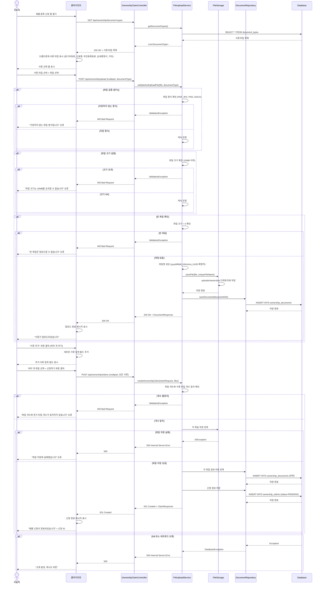
```mermaid
sequenceDiagram
    actor User as 사용자
    participant UI as 클라이언트
    participant Controller as OwnershipClaimController
    participant Service as FileUploadService
    participant FileStorage as FileStorage
    participant Repository as DocumentRepository
    participant DB as Database

    User->>UI: 매물 등록 신청 폼 열기
    UI->>Controller: GET /api/ownership/document-types

    Controller->>Service: getDocumentTypes()

    Service->>DB: SELECT * FROM document_types
    DB-->>Service: 서류 타입 목록
    Service-->>Controller: List<DocumentType>

    Controller-->>UI: 200 OK + 서류 타입 목록
    UI->>UI: 드롭다운에 서류 타입 표시 (등기부등본, 신분증, 주민등록등본, 납세증명서, 기타)
    UI-->>User: 서류 선택 폼 표시

    User->>UI: 서류 타입 선택 + 파일 선택
    UI->>Controller: POST /api/ownership/upload (multipart, documentType)

    Controller->>Service: validateAndUploadFile(file, documentType)

    alt 파일 검증 (형식)
        Service->>Service: 파일 형식 확인 (PDF, JPG, PNG, DOCX)
        alt 지원하지 않는 형식
            Service-->>Controller: ValidationException
            Controller-->>UI: 400 Bad Request
            UI-->>User: "지원하지 않는 파일 형식입니다" 오류
        else 지원 형식
            Service->>Service: 계속 진행
        end
    end

    alt 파일 크기 검증
        Service->>Service: 파일 크기 확인 (10MB 이하)
        alt 크기 초과
            Service-->>Controller: ValidationException
            Controller-->>UI: 400 Bad Request
            UI-->>User: "파일 크기는 10MB를 초과할 수 없습니다" 오류
        else 크기 OK
            Service->>Service: 계속 진행
        end
    end

    alt 빈 파일 확인
        Service->>Service: 파일 크기 = 0 확인
        alt 빈 파일
            Service-->>Controller: ValidationException
            Controller-->>UI: 400 Bad Request
            UI-->>User: "빈 파일은 업로드할 수 없습니다" 오류
        else 파일 있음
            Service->>Service: 파일명 생성 (yyyyMMdd_HHmmss_UUID.확장자)
            Service->>FileStorage: saveFile(file, uniqueFileName)
            FileStorage->>FileStorage: uploads/ownership/ 디렉토리에 저장
            FileStorage-->>Service: 저장 완료

            Service->>Repository: saveDocument(documentInfo)
            Repository->>DB: INSERT INTO ownership_documents
            DB-->>Repository: 저장 완료

            Service-->>Controller: 200 OK + DocumentResponse
            Controller-->>UI: 200 OK
            UI->>UI: 업로드 완료 메시지 표시
            UI-->>User: "서류가 업로드되었습니다"
        end
    end

    User->>UI: "서류 추가" 버튼 클릭 (여러 개 추가)
    UI->>UI: 새로운 서류 입력 필드 추가
    UI-->>User: 추가 서류 입력 필드 표시

    User->>UI: 여러 개 파일 선택 + 신청하기 버튼 클릭
    UI->>Controller: POST /api/ownership/claims (multipart, 모든 서류)

    Controller->>Service: createOwnershipClaim(claimRequest, files)

    Service->>Service: 파일 개수와 서류 타입 개수 일치 확인
    alt 개수 불일치
        Service-->>Controller: ValidationException
        Controller-->>UI: 400 Bad Request
        UI-->>User: "파일 개수와 문서 타입 개수가 일치하지 않습니다" 오류
    else 개수 일치
        Service->>FileStorage: 각 파일 저장 반복
        alt 파일 저장 실패
            FileStorage-->>Service: IOException
            Service-->>Controller: 500 Internal Server Error
            Controller-->>UI: 500
            UI-->>User: "파일 저장에 실패했습니다" 오류
        else 파일 저장 성공
            Service->>Repository: 각 파일 정보 저장 반복
            Repository->>DB: INSERT INTO ownership_documents (반복)
            DB-->>Repository: 저장 완료

            Service->>Repository: 신청 정보 저장
            Repository->>DB: INSERT INTO ownership_claims (status=PENDING)
            DB-->>Repository: 저장 완료

            Service-->>Controller: 201 Created + ClaimResponse
            Controller-->>UI: 201 Created
            UI->>UI: 신청 완료 메시지 표시
            UI-->>User: "매물 신청이 완료되었습니다" + 신청 ID
        end
    end

    alt DB 또는 네트워크 오류
        DB-->>Repository: Exception
        Repository-->>Service: DatabaseException
        Service-->>Controller: 500 Internal Server Error
        Controller-->>UI: 500
        UI-->>User: "오류 발생, 재시도 버튼"
    end

```
---

**설명**
사용자가 매물 등록 신청 폼을 열면 클라이언트는 먼저 “이 폼에서 어떤 종류의 서류를 받아야 하는지”를 알아내기 위해 `GET /api/ownership/document-types`를 호출하고, 컨트롤러는 이를 받아 `getDocumentTypes()`를 서비스에 넘기며 서비스는 DB에서 `SELECT * FROM document_types`로 등기부등본, 신분증, 주민등록등본, 납세증명서, 기타 같은 서류 타입 목록을 읽어와 컨트롤러에 돌려주고 컨트롤러는 200 OK로 이를 프런트에 내려보내므로 UI는 드롭다운에 서류 종류를 뿌려 사용자가 어떤 문서인지 먼저 고르게 만든다; 사용자가 “서류 타입 + 실제 파일”을 선택하면 프런트는 그걸 멀티파트로 묶어서 `POST /api/ownership/upload`를 보내고, 컨트롤러는 `validateAndUploadFile(file, documentType)`을 호출해 서비스에 검증을 맡기는데 서비스는 ① 파일 확장자가 허용된 형식(PDF, JPG, PNG, DOCX 등)인지 확인하고 아니면 ValidationException을 던져 컨트롤러가 400과 “지원하지 않는 파일 형식입니다”를 보내게 하고 ② 크기가 정책 한도(예: 10MB) 이하인지 확인해 넘으면 같은 식으로 400과 “파일 크기는 10MB를 초과할 수 없습니다”를 돌려보내고 ③ 파일이 비어 있지(0byte) 않은지도 확인해 비어 있으면 “빈 파일은 업로드할 수 없습니다”로 거절한다; 이 3단계 검증을 모두 통과한 파일만 실제 업로드가 진행되는데, 서비스는 `yyyyMMdd_HHmmss_UUID.확장자` 같은 충돌 없는 고유 파일명을 생성해 `FileStorage.saveFile(...)`로 `uploads/ownership/` 디렉터리에 저장시키고, 저장이 끝나면 이 파일이 어떤 타입(documentType)으로 어떤 사용자가 올린 것인지 등을 담아 DocumentRepository에 INSERT 해 문서 메타데이터를 DB에도 남긴다; 그 후 서비스는 업로드된 문서의 ID·원본명·파일경로가 담긴 DocumentResponse를 컨트롤러에 주고, 컨트롤러는 200 OK를 프런트에 내려보내므로 UI는 “서류가 업로드되었습니다”라고 사용자에게 알리고 필요하면 “서류 추가” 버튼을 누를 수 있게 새 입력 필드를 더해 준다; 사용자가 이렇게 여러 개 서류를 올린 다음 실제 신청을 마치기 위해 “신청하기”를 누르면 프런트는 지금까지 선택된 모든 파일과 그 파일들에 대응하는 서류 타입을 한 번에 묶어 `POST /api/ownership/claims`로 보낸다; 컨트롤러는 이를 `createOwnershipClaim(claimRequest, files)`로 서비스에 넘기고, 서비스는 먼저 “파일 개수 == 문서 타입 개수”인지 검증해 안 맞으면 ValidationException을 던져 400과 “파일 개수와 문서 타입 개수가 일치하지 않습니다”를 돌려보내 데이터 짝이 안 맞는 상태로는 신청이 저장되지 않게 막는다; 개수가 맞으면 각 파일을 다시 한 번 저장 루프로 돌면서 스토리지에 넣고(여기서 IOException이 나면 바로 500 “파일 저장에 실패했습니다”로 응답) 성공한 파일마다 DocumentRepository에 INSERT를 반복해 ownership_documents에 기록한 후, 마지막에야 비로소 본 신청(ownership_claims)을 `status = PENDING`으로 INSERT 해 전체 신청을 완성하고 컨트롤러는 201 Created와 ClaimResponse(신청 ID 포함)를 반환하며, 프런트는 이를 받아 “매물 신청이 완료되었습니다”와 신청 ID를 사용자에게 보여준다; 이 과정 어느 단계에서든 DB나 네트워크 예외가 발생하면 예외가 서비스→컨트롤러로 전파되고 컨트롤러는 500을 내려보내며 UI는 “오류 발생, 재시도” 버튼을 보여줘 사용자가 다시 업로드/신청을 시도할 수 있게 한다.

---

# 6. 심사 중 매물 신청 수정

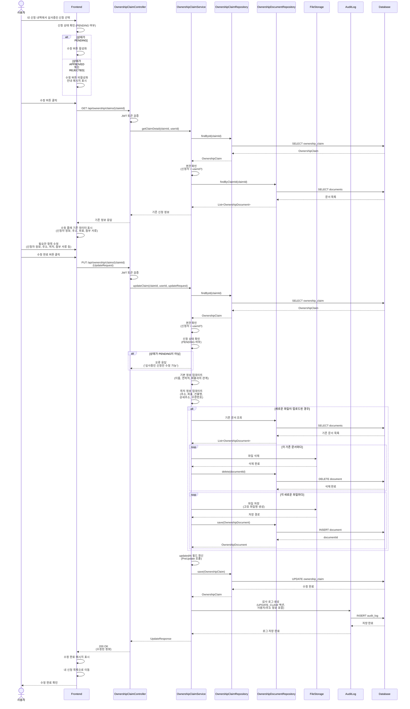
```mermaid
sequenceDiagram
    actor User as 사용자
    participant UI as Frontend
    participant Controller as OwnershipClaimController
    participant Service as OwnershipClaimService
    participant ClaimRepo as OwnershipClaimRepository
    participant DocRepo as OwnershipDocumentRepository
    participant FileStorage as FileStorage
    participant AuditLog as AuditLog
    participant DB as Database

    User->>UI: 내 신청 내역에서 심사중인 신청 선택
    UI->>UI: 신청 상태 확인 (PENDING 여부)

    alt 상태가 PENDING
        UI->>UI: 수정 버튼 활성화
    else 상태가 APPROVED 또는 REJECTED
        UI->>UI: 수정 버튼 비활성화<br/>안내 메시지 표시
    end

    User->>UI: 수정 버튼 클릭

    UI->>Controller: GET /api/ownership/claims/{claimId}

    Controller->>Controller: JWT 토큰 검증

    Controller->>Service: getClaimDetail(claimId, userId)

    Service->>ClaimRepo: findById(claimId)
    ClaimRepo->>DB: SELECT ownership_claim
    DB-->>ClaimRepo: OwnershipClaim
    ClaimRepo-->>Service: OwnershipClaim

    Service->>Service: 권한 확인<br/>(신청자 = userId?)

    Service->>DocRepo: findByClaimId(claimId)
    DocRepo->>DB: SELECT documents
    DB-->>DocRepo: 문서 목록
    DocRepo-->>Service: List<OwnershipDocument>

    Service-->>Controller: 기존 신청 정보

    Controller-->>UI: 기존 정보 응답

    UI->>UI: 수정 폼에 기존 데이터 표시<br/>(신청자 정보, 주소, 좌표, 첨부 서류)

    User->>UI: 필요한 항목 수정<br/>(신청자 정보, 주소, 위치, 첨부 서류 등)

    User->>UI: 수정 완료 버튼 클릭

    UI->>Controller: PUT /api/ownership/claims/{claimId}<br/>(UpdateRequest)

    Controller->>Controller: JWT 토큰 검증

    Controller->>Service: updateClaim(claimId, userId, updateRequest)

    Service->>ClaimRepo: findById(claimId)
    ClaimRepo->>DB: SELECT ownership_claim
    DB-->>ClaimRepo: OwnershipClaim
    ClaimRepo-->>Service: OwnershipClaim

    Service->>Service: 권한 확인<br/>(신청자 = userId?)

    Service->>Service: 신청 상태 확인<br/>(PENDING 여부)

    alt 상태가 PENDING이 아님
        Service-->>Controller: 오류 응답<br/>("심사중인 신청만 수정 가능")
    end

    Service->>Service: 기본 정보 업데이트<br/>(이름, 연락처, 매물과의 관계)

    Service->>Service: 위치 정보 업데이트<br/>(주소, 좌표, 건물명,<br/>상세주소, 우편번호)

    alt 새로운 파일이 업로드된 경우
        Service->>DocRepo: 기존 문서 조회
        DocRepo->>DB: SELECT documents
        DB-->>DocRepo: 기존 문서 목록
        DocRepo-->>Service: List<OwnershipDocument>

        loop 각 기존 문서마다
            Service->>FileStorage: 파일 삭제
            FileStorage-->>Service: 삭제 완료

            Service->>DocRepo: delete(documentId)
            DocRepo->>DB: DELETE document
            DB-->>DocRepo: 삭제 완료
        end

        loop 각 새로운 파일마다
            Service->>FileStorage: 파일 저장<br/>(고유 파일명 생성)
            FileStorage-->>Service: 저장 경로

            Service->>DocRepo: save(OwnershipDocument)
            DocRepo->>DB: INSERT document
            DB-->>DocRepo: documentId
            DocRepo-->>Service: OwnershipDocument
        end
    end

    Service->>Service: updatedAt 필드 갱신<br/>(PreUpdate 호출)

    Service->>ClaimRepo: save(OwnershipClaim)
    ClaimRepo->>DB: UPDATE ownership_claim
    DB-->>ClaimRepo: 수정 완료
    ClaimRepo-->>Service: OwnershipClaim

    Service->>AuditLog: 감사 로그 생성<br/>(UPDATE_CLAIM 액션,<br/>사용자/주소 정보 포함)
    AuditLog->>DB: INSERT audit_log
    DB-->>AuditLog: 저장 완료
    AuditLog-->>Service: 로그 저장 완료

    Service-->>Controller: UpdateResponse

    Controller-->>UI: 200 OK<br/>{수정된 정보}

    UI->>UI: 수정 완료 메시지 표시
    UI->>UI: 내 신청 목록으로 이동
    UI-->>User: 수정 완료 확인

```
---

**설명**
사용자가 “내 신청 내역”에서 아직 심사 중인(PENDING) 신청을 하나 고르면 프런트는 먼저 그 신청의 상태를 확인해 PENDING이면 수정 버튼을 활성화하고 이미 APPROVED나 REJECTED로 끝난 건이면 수정 버튼을 비활성화하면서 “심사 완료된 신청은 수정할 수 없습니다” 같은 안내를 띄운다; 사용자가 수정 버튼을 누르면 프런트는 해당 신청을 다시 불러오기 위해 `GET /api/ownership/claims/{claimId}`를 호출하고, 컨트롤러는 JWT를 검증한 뒤 `getClaimDetail(claimId, userId)`를 서비스에 넘긴다; 서비스는 먼저 `OwnershipClaimRepository.findById(claimId)`로 신청 본문을 가져오고, 가져온 신청의 소유자와 현재 요청자의 userId를 비교해 본인 신청이 아닌 경우를 차단한 다음, 이어서 `OwnershipDocumentRepository.findByClaimId(claimId)`로 이 신청에 붙어 있던 기존 첨부 서류 목록을 전부 읽어와 컨트롤러에 돌려주므로 컨트롤러는 이걸 200 OK로 프런트에 내려보내고 프런트는 수정 폼에 “기존 신청자 정보, 주소/좌표, 첨부 서류 리스트”를 그대로 채워 넣어 사용자가 어느 부분을 바꿀지 선택하게 한다; 사용자가 이름·연락처·매물과의 관계·주소·좌표를 바꾸거나 새로 서류를 교체한 후 “수정 완료”를 누르면 프런트는 바뀐 값들만 포함한 UpdateRequest를 가지고 `PUT /api/ownership/claims/{claimId}`를 호출하고, 컨트롤러는 다시 JWT를 검증한 뒤 `updateClaim(claimId, userId, updateRequest)`를 서비스에 위임한다; 서비스는 다시 한 번 해당 신청을 `findById`로 로드해 온 다음 ① 이 신청이 정말 이 사용자의 것인지(권한 확인) ② 이 신청의 현재 상태가 PENDING인지(상태 확인)를 순서대로 검사해 PENDING이 아니면 “심사중인 신청만 수정 가능”이라는 에러를 돌려보내고 처리를 중단한다; PENDING이면 실제 업데이트를 시작하는데, 먼저 신청자의 기본 정보(이름, 연락처, 관계)를 요청값으로 덮어쓰고, 위치 정보(주소, 좌표, 건물명, 상세주소, 우편번호)도 새로 들어온 값으로 갱신한다; 그리고 요청에 새 파일이 포함돼 있으면 기존에 이 신청에 묶여 있던 문서들을 전부 `DocRepo`로 조회해 하나씩 스토리지에서 지우고(DB에서도 DELETE) 그다음 새로 올라온 파일들을 반복문으로 저장해 고유 파일명을 만들어 스토리지에 넣은 뒤 각각을 OwnershipDocument로 DB에 INSERT 한다; 모든 필드가 갱신되면 서비스는 `updatedAt` 같은 갱신 시각을 현재 시각으로 다시 세팅해 변경 이력을 남기고, 최종적으로 `OwnershipClaimRepository.save(...)`로 UPDATE를 날려 수정된 신청을 DB에 반영한다; 수정이 성공하면 누가 어떤 신청을 어떤 시점에 고쳤는지를 남기기 위해 `AuditLog`에 UPDATE_CLAIM 액션을 INSERT 해 두고, 그 후에야 서비스가 컨트롤러로 UpdateResponse를 돌려보내며, 컨트롤러는 200 OK와 수정된 정보를 프런트에 주고 프런트는 “수정이 완료되었습니다” 메시지를 띄운 뒤 목록 화면을 다시 로드해 방금 수정된 신청이 갱신된 상태로 보이게 한다.

---

# 7. 관리자 매물 신청 검토 및 처리

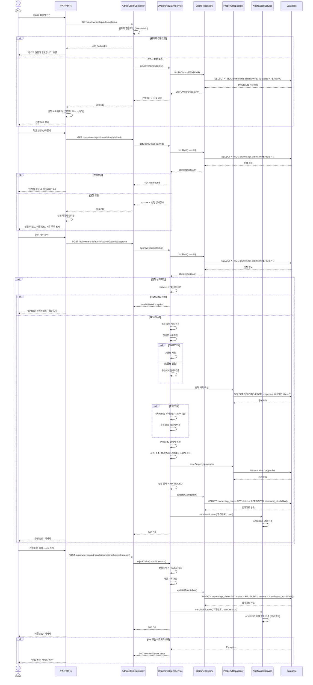
```mermaid
sequenceDiagram
    actor Admin as 관리자
    participant UI as 관리자 페이지
    participant Controller as AdminClaimController
    participant Service as OwnershipClaimService
    participant ClaimRepo as ClaimRepository
    participant PropertyRepo as PropertyRepository
    participant NotificationService as NotificationService
    participant DB as Database

    Admin->>UI: 관리자 페이지 접근
    UI->>Controller: GET /api/ownership/admin/claims

    Controller->>Controller: 관리자 권한 확인 (role=admin)
    alt 관리자 권한 없음
        Controller-->>UI: 403 Forbidden
        UI-->>Admin: "관리자 권한이 필요합니다" 오류
    else 관리자 권한 있음
        Controller->>Service: getAllPendingClaims()

        Service->>ClaimRepo: findByStatus(PENDING)
        ClaimRepo->>DB: SELECT * FROM ownership_claims WHERE status = PENDING
        DB-->>ClaimRepo: PENDING 신청 목록
        ClaimRepo-->>Service: List<OwnershipClaim>

        Service-->>Controller: 200 OK + 신청 목록
        Controller-->>UI: 200 OK
        UI->>UI: 신청 목록 렌더링 (신청자, 주소, 신청일)
        UI-->>Admin: 신청 목록 표시
    end

    Admin->>UI: 특정 신청 선택/클릭
    UI->>Controller: GET /api/ownership/admin/claims/{claimId}

    Controller->>Service: getClaimDetail(claimId)

    Service->>ClaimRepo: findById(claimId)
    ClaimRepo->>DB: SELECT * FROM ownership_claims WHERE id = ?
    DB-->>ClaimRepo: 신청 정보
    ClaimRepo-->>Service: OwnershipClaim

    alt 신청 없음
        Service-->>Controller: 404 Not Found
        UI-->>Admin: "신청을 찾을 수 없습니다" 오류
    else 신청 있음
        Service-->>Controller: 200 OK + 신청 상세정보
        Controller-->>UI: 200 OK
        UI->>UI: 상세 페이지 렌더링
        UI-->>Admin: 신청자 정보, 매물 정보, 서류 목록 표시
    end

    Admin->>UI: 승인 버튼 클릭
    UI->>Controller: POST /api/ownership/admin/claims/{claimId}/approve

    Controller->>Service: approveClaim(claimId)

    Service->>ClaimRepo: findById(claimId)
    ClaimRepo->>DB: SELECT * FROM ownership_claims WHERE id = ?
    DB-->>ClaimRepo: 신청 정보
    ClaimRepo-->>Service: OwnershipClaim

    alt 신청 상태 확인
        Service->>Service: status == PENDING?
        alt PENDING 아님
            Service-->>Controller: InvalidStateException
            UI-->>Admin: "심사중인 신청만 승인 가능" 오류
        else PENDING
            Service->>Service: 매물 제목 자동 생성
            Service->>Service: 건물명 유무 확인
            alt 건물명 있음
                Service->>Service: 건물명 사용
            else 건물명 없음
                Service->>Service: 주소에서 동/구 추출
            end

            Service->>PropertyRepo: 중복 제목 확인
            PropertyRepo->>DB: SELECT COUNT(*) FROM properties WHERE title = ?
            DB-->>PropertyRepo: 중복 여부

            alt 중복 있음
                Service->>Service: 제목에 번호 추가 (예: "강남역 (1)")
                Service->>Service: 중복 없을 때까지 반복
            end

            Service->>Service: Property 엔티티 생성
            Service->>Service: 제목, 주소, 상태(AVAILABLE), 소유자 설정
            Service->>PropertyRepo: saveProperty(property)
            PropertyRepo->>DB: INSERT INTO properties
            DB-->>PropertyRepo: 저장 완료

            Service->>Service: 신청 상태 = APPROVED
            Service->>ClaimRepo: updateClaim(claim)
            ClaimRepo->>DB: UPDATE ownership_claims SET status = APPROVED, reviewed_at = NOW()
            DB-->>ClaimRepo: 업데이트 완료

            Service->>NotificationService: sendNotification("승인완료", user)
            NotificationService->>NotificationService: 사용자에게 알림 전송

            Service-->>Controller: 200 OK
            UI-->>Admin: "승인 완료" 메시지
        end
    end

    Admin->>UI: 거절 버튼 클릭 + 사유 입력
    UI->>Controller: POST /api/ownership/admin/claims/{claimId}/reject (reason)

    Controller->>Service: rejectClaim(claimId, reason)

    Service->>Service: 신청 상태 = REJECTED
    Service->>Service: 거절 사유 저장
    Service->>ClaimRepo: updateClaim(claim)
    ClaimRepo->>DB: UPDATE ownership_claims SET status = REJECTED, reason = ?, reviewed_at = NOW()
    DB-->>ClaimRepo: 업데이트 완료

    Service->>NotificationService: sendNotification("거절완료", user, reason)
    NotificationService->>NotificationService: 사용자에게 거절 알림 전송 (사유 포함)

    Service-->>Controller: 200 OK
    UI-->>Admin: "거절 완료" 메시지

    alt DB 또는 네트워크 오류
        DB-->>Service: Exception
        Service-->>Controller: 500 Internal Server Error
        UI-->>Admin: "오류 발생, 재시도 버튼"
    end

```
---

**설명**
관리자가 관리자 페이지에 접속하면 화면은 먼저 관리자가 처리해야 할 소유권 신청이 있는지 알기 위해 `GET /api/ownership/admin/claims`를 호출하고, 컨트롤러는 이 요청이 진짜 관리자인지부터 확인해 `role=admin`이 아니면 곧바로 403 Forbidden을 내려 “관리자 권한이 필요합니다”를 표시하게 하고, 관리자 권한이 맞으면 서비스를 호출해 `getAllPendingClaims()`를 수행한다; 서비스는 `ClaimRepository.findByStatus(PENDING)`으로 DB에 `SELECT * FROM ownership_claims WHERE status = PENDING`을 날려 아직 심사되지 않은 신청 목록을 전부 가져와 컨트롤러에 넘기고, 컨트롤러는 200 OK로 이 목록을 반환하므로 관리자 화면은 “신청자, 주소, 신청일” 정도가 들어 있는 리스트를 렌더링한다; 관리자가 이 목록 중 하나를 눌러 세부 내용을 보려고 하면 화면은 `GET /api/ownership/admin/claims/{claimId}`를 호출하고, 컨트롤러는 서비스를 통해 `ClaimRepo.findById(claimId)`로 해당 신청을 DB에서 꺼내는데 없으면 404 Not Found로 “신청을 찾을 수 없습니다”를 보여주고, 있으면 신청자 정보(누가 올렸는지), 매물 정보(주소/좌표/건물명), 첨부 서류 목록 등을 담아 200 OK로 내려준다; 관리자가 이걸 검토해 “승인”을 누르면 화면은 `POST /api/ownership/admin/claims/{claimId}/approve`를 보내고, 컨트롤러는 서비스를 호출해 `approveClaim(claimId)`를 수행하게 하는데 서비스는 먼저 다시 한 번 그 신청을 `findById`로 읽어온 다음 현재 상태가 정말 PENDING인지 확인해 이미 APPROVED나 REJECTED 등으로 끝난 건이면 InvalidStateException을 던져 “심사중인 신청만 승인 가능”이라는 에러를 관리자에게 보여준다; 상태가 올바른 PENDING이라면 이제 이 소유권 신청을 실제 매물로 전환하는 작업을 하는데, 우선 매물 제목을 자동으로 만들기 위해 신청에 건물명이 있는지 보고 있으면 그걸 쓰고, 없으면 주소에서 동/구 같은 핵심 위치명을 뽑아 제목으로 쓴 뒤, 이 제목이 이미 존재하는지 `PropertyRepository`에 물어 중복이면 “(1)”, “(2)”처럼 번호를 붙이는 식으로 중복이 안 날 때까지 조정한다; 이렇게 만든 데이터를 기반으로 Property 엔티티를 생성해 소유자(신청자), 주소, 상태(AVAILABLE)를 세팅하고 `PropertyRepo.saveProperty(...)`로 DB에 INSERT 한다; 매물이 성공적으로 만들어지면 이제 원래 신청의 상태를 APPROVED로 바꾸고 `reviewed_at = NOW()`를 찍은 뒤 `ClaimRepo.updateClaim(...)`으로 DB에 업데이트하며, 동시에 `NotificationService`를 호출해 신청을 올린 사용자에게 “소유권 신청이 승인되었습니다”라는 알림을 보낸다; 모든 게 정상 처리되면 서비스는 200 OK를 컨트롤러로 돌려주고, 화면은 관리자에게 “승인 완료” 메시지를 보여준다; 반대로 관리자가 내용을 보고 승인할 수 없다고 판단하면 거절 사유를 적은 뒤 `POST /api/ownership/admin/claims/{claimId}/reject`를 보내고, 컨트롤러는 `rejectClaim(claimId, reason)`을 서비스로 넘기며 서비스는 그 신청의 상태를 REJECTED로 바꾸고 거절 사유를 신청 레코드에 함께 저장한 다음 `reviewed_at = NOW()`로 심사 시점을 찍고 DB에 UPDATE 한다; 이후 NotificationService를 통해 사용자에게 “거절되었습니다: {사유}” 알림을 보내고 컨트롤러는 200 OK를 반환하며, 관리자 화면은 “거절 완료”를 노출한다; 이 일련의 단계 도중 DB나 네트워크 예외가 발생하면 서비스는 500 Internal Server Error를 컨트롤러에 던지고, 화면은 관리자에게 “오류가 발생했습니다. 다시 시도하세요.” 같은 리트라이 UI를 보여준다.

---

# 8. 매물 자동 생성

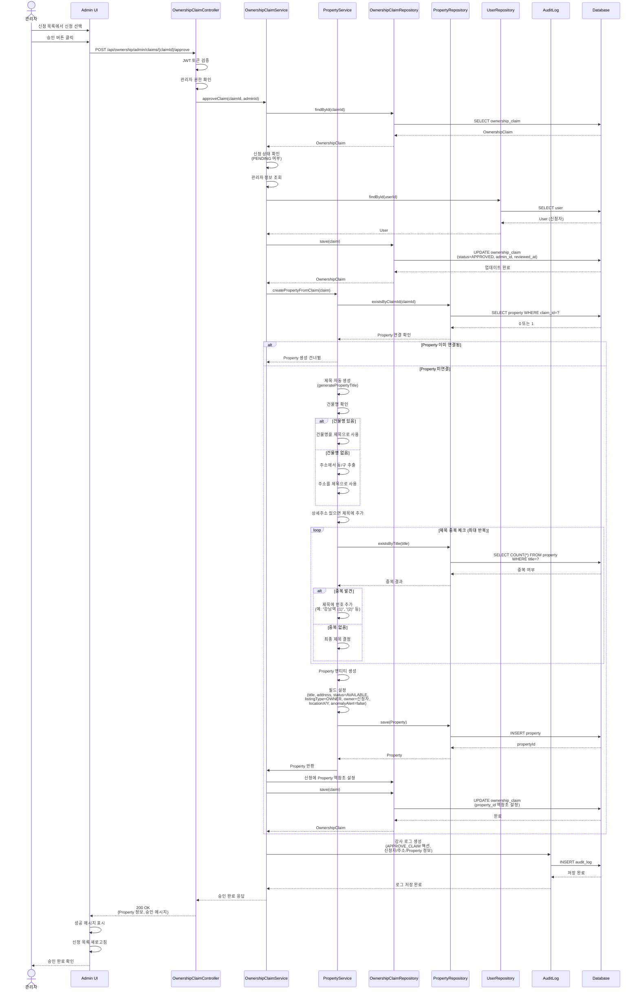
```mermaid
sequenceDiagram
    actor Admin as 관리자
    participant UI as Admin UI
    participant Controller as OwnershipClaimController
    participant Service as OwnershipClaimService
    participant PropertyService as PropertyService
    participant ClaimRepo as OwnershipClaimRepository
    participant PropertyRepo as PropertyRepository
    participant UserRepo as UserRepository
    participant AuditLog as AuditLog
    participant DB as Database

    Admin->>UI: 신청 목록에서 신청 선택
    Admin->>UI: 승인 버튼 클릭

    UI->>Controller: POST /api/ownership/admin/claims/{claimId}/approve

    Controller->>Controller: JWT 토큰 검증
    Controller->>Controller: 관리자 권한 확인

    Controller->>Service: approveClaim(claimId, adminId)

    Service->>ClaimRepo: findById(claimId)
    ClaimRepo->>DB: SELECT ownership_claim
    DB-->>ClaimRepo: OwnershipClaim
    ClaimRepo-->>Service: OwnershipClaim

    Service->>Service: 신청 상태 확인<br/>(PENDING 여부)
    Service->>Service: 관리자 정보 조회

    Service->>UserRepo: findById(userId)
    UserRepo->>DB: SELECT user
    DB-->>UserRepo: User (신청자)
    UserRepo-->>Service: User

    Service->>ClaimRepo: save(claim)
    ClaimRepo->>DB: UPDATE ownership_claim<br/>(status=APPROVED, admin_id, reviewed_at)
    DB-->>ClaimRepo: 업데이트 완료
    ClaimRepo-->>Service: OwnershipClaim

    Service->>PropertyService: createPropertyFromClaim(claim)

    PropertyService->>PropertyRepo: existsByClaimId(claimId)
    PropertyRepo->>DB: SELECT property WHERE claim_id=?
    DB-->>PropertyRepo: 0 또는 1
    PropertyRepo-->>PropertyService: Property 연결 확인

    alt Property 이미 연결됨
        PropertyService-->>Service: Property 생성 건너뜀
    else Property 미연결
        PropertyService->>PropertyService: 제목 자동 생성<br/>(generatePropertyTitle)

        PropertyService->>PropertyService: 건물명 확인

        alt 건물명 있음
            PropertyService->>PropertyService: 건물명을 제목으로 사용
        else 건물명 없음
            PropertyService->>PropertyService: 주소에서 동/구 추출
            PropertyService->>PropertyService: 주소를 제목으로 사용
        end

        PropertyService->>PropertyService: 상세주소 있으면 제목에 추가

        loop 제목 중복 체크 (최대 반복)
            PropertyService->>PropertyRepo: existsByTitle(title)
            PropertyRepo->>DB: SELECT COUNT(*) FROM property<br/>WHERE title=?
            DB-->>PropertyRepo: 중복 여부
            PropertyRepo-->>PropertyService: 중복 결과

            alt 중복 발견
                PropertyService->>PropertyService: 제목에 번호 추가<br/>(예: "강남역 (1)", "(2)" 등)
            else 중복 없음
                PropertyService->>PropertyService: 최종 제목 결정
            end
        end

        PropertyService->>PropertyService: Property 엔티티 생성
        PropertyService->>PropertyService: 필드 설정<br/>(title, address, status=AVAILABLE,<br/>listingType=OWNER, owner=신청자,<br/>locationX/Y, anomalyAlert=false)

        PropertyService->>PropertyRepo: save(Property)
        PropertyRepo->>DB: INSERT property
        DB-->>PropertyRepo: propertyId
        PropertyRepo-->>PropertyService: Property

        PropertyService->>Service: Property 반환

        Service->>ClaimRepo: 신청에 Property 역참조 설정
        Service->>ClaimRepo: save(claim)
        ClaimRepo->>DB: UPDATE ownership_claim<br/>(property_id 역참조 설정)
        DB-->>ClaimRepo: 완료
        ClaimRepo-->>Service: OwnershipClaim
    end

    Service->>AuditLog: 감사 로그 생성<br/>(APPROVE_CLAIM 액션,<br/>신청자/주소/Property 정보)
    AuditLog->>DB: INSERT audit_log
    DB-->>AuditLog: 저장 완료
    AuditLog-->>Service: 로그 저장 완료

    Service-->>Controller: 승인 완료 응답

    Controller-->>UI: 200 OK<br/>{Property 정보, 승인 메시지}

    UI->>UI: 성공 메시지 표시
    UI->>UI: 신청 목록 새로고침

    UI-->>Admin: 승인 완료 확인

```
---

**설명**
관리자가 관리자 UI에서 특정 소유권 신청을 선택하고 “승인”을 누르면 프런트는 `POST /api/ownership/admin/claims/{claimId}/approve`를 백엔드로 보낸다; 컨트롤러는 이 요청을 받으면 먼저 JWT가 유효한지 확인하고, 이어서 이 사용자가 진짜 관리자(role=admin)인지 검사해 아니면 403을 돌려보내 승인 기능을 막고, 관리자라면 `OwnershipClaimService.approveClaim(claimId, adminId)`를 호출해 실제 승인 로직으로 넘긴다; 서비스는 가장 먼저 `OwnershipClaimRepository.findById(claimId)`로 승인하려는 신청을 DB에서 읽어오고, 가져온 신청의 상태가 PENDING인지 확인해 이미 APPROVED/REJECTED 등으로 처리된 건이면 여기서 상태 오류로 끝낸다; 상태가 올바른 경우 이제 이 신청을 승인 처리하기 위해 당시 신청을 올린 사용자 정보가 필요하므로 `UserRepository.findById(userId)`로 신청자(User)를 다시 조회하고, 조회된 사용자와 신청을 묶은 상태로 신청 엔티티의 상태를 APPROVED로 바꾸고 어떤 관리자가 언제 승인했는지를 남기기 위해 `admin_id`와 `reviewed_at`을 세팅한 뒤 `ClaimRepo.save(claim)`으로 DB에 UPDATE 한다; 그 다음 단계가 핵심인데, 이 승인된 소유권 신청을 진짜 “매물”로 시스템에 올려야 하므로 서비스는 `PropertyService.createPropertyFromClaim(claim)`을 호출해 매물 생성으로 위임한다; PropertyService는 먼저 같은 신청에 대해 이미 매물이 만들어진 적이 있는지 `PropertyRepo.existsByClaimId(claimId)`로 확인하고, 이미 연결된 매물이 있으면 “이 신청으로부터의 매물 생성”은 건너뛰고 다시 서비스로 돌아간다; 연결된 매물이 없을 때만 실제 매물을 만든다: 우선 제목을 자동으로 만들기 위해 신청에 건물명이 있는지 보고 있으면 그걸 그대로 제목으로 쓰고, 없으면 주소에서 동/구 등을 뽑아 제목으로 삼고, 상세주소가 있으면 뒤에 덧붙인다; 이렇게 1차 제목을 만든 뒤에는 중복 매물명이 있는지 확인하기 위해 루프를 돌며 `PropertyRepo.existsByTitle(title)`을 호출하고, DB에서 같은 제목이 있으면 “(1)”, “(2)”처럼 번호를 붙여가며 없는 제목이 나올 때까지 반복해서 최종 제목을 확정한다; 제목이 확정되면 이제 Property 엔티티를 구성하는데 여기에는 제목(title), 주소(address), 매물 상태(status=AVAILABLE), 등록 유형(listingType=OWNER), 소유자=신청자, 위치 좌표(locationX/Y), 이상 감지 플래그(anomalyAlert=false) 등이 들어가고, 이 엔티티를 `PropertyRepo.save(...)`로 INSERT 해 실제 매물로 만든다; 매물이 생성되면 그 매물이 어떤 소유권 신청에서 파생된 것인지 역으로 알 수 있도록 원래 신청 레코드에 `property_id`를 다시 UPDATE 해 두어 양방향/역참조가 되게 하고, 이 승인 작업 전체가 누가 언제 무엇을 승인했는지 감사 추적이 가능하도록 `AuditLog`에 `APPROVE_CLAIM` 액션과 함께 신청자, 주소, 생성된 property 정보, 처리 관리자 정보를 INSERT 해 둔다; 모든 게 정상 처리되면 서비스는 컨트롤러에 “승인 완료” 응답과 함께 방금 생성된 Property 정보까지 넘기고, 컨트롤러는 200 OK로 이를 관리자 UI에 돌려주며, UI는 “승인이 완료되었습니다” 메시지를 보여주고 목록을 새로고침해 방금까지 PENDING이던 신청이 APPROVED로 바뀐 걸 관리자에게 보여준다.

---

# 9. 채팅방 접속 및 생성

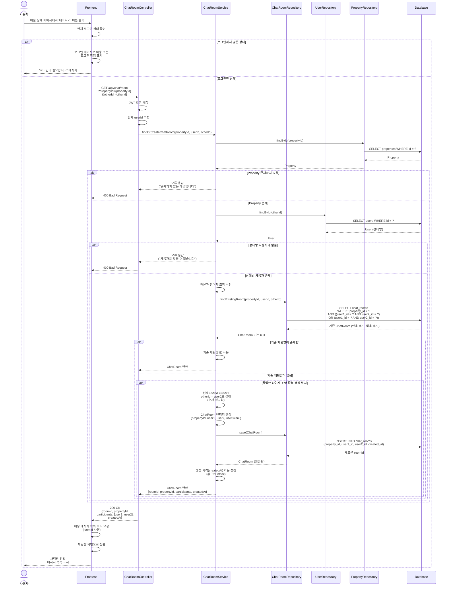
```mermaid
sequenceDiagram
    actor User as 사용자
    participant UI as Frontend
    participant Controller as ChatRoomController
    participant Service as ChatRoomService
    participant ChatRoomRepo as ChatRoomRepository
    participant UserRepo as UserRepository
    participant PropertyRepo as PropertyRepository
    participant DB as Database

    User->>UI: 매물 상세 페이지에서 '대화하기' 버튼 클릭
    
    UI->>UI: 현재 로그인 상태 확인
    
    alt 로그인하지 않은 상태
        UI->>UI: 로그인 페이지로 이동 또는<br/>로그인 팝업 표시
        UI-->>User: "로그인이 필요합니다" 메시지
    else 로그인한 상태
        UI->>Controller: GET /api/chat/room<br/>?propertyId={propertyId}<br/>&otherId={otherId}
        
        Controller->>Controller: JWT 토큰 검증
        Controller->>Controller: 현재 userId 추출
        
        Controller->>Service: findOrCreateChatRoom(propertyId, userId, otherId)
        
        Service->>PropertyRepo: findById(propertyId)
        PropertyRepo->>DB: SELECT properties WHERE id = ?
        DB-->>PropertyRepo: Property
        PropertyRepo-->>Service: Property
        
        alt Property 존재하지 않음
            Service-->>Controller: 오류 응답<br/>("존재하지 않는 매물입니다")
            Controller-->>UI: 400 Bad Request
        else Property 존재
            Service->>UserRepo: findById(otherId)
            UserRepo->>DB: SELECT users WHERE id = ?
            DB-->>UserRepo: User (상대방)
            UserRepo-->>Service: User
            
            alt 상대방 사용자가 없음
                Service-->>Controller: 오류 응답<br/>("사용자를 찾을 수 없습니다")
                Controller-->>UI: 400 Bad Request
            else 상대방 사용자 존재
                Service->>Service: 매물과 참여자 조합 확인
                
                Service->>ChatRoomRepo: findExistingRoom(propertyId, userId, otherId)
                ChatRoomRepo->>DB: SELECT chat_rooms<br/>WHERE property_id = ?<br/>AND ((user1_id = ? AND user2_id = ?)<br/>OR (user1_id = ? AND user2_id = ?))
                DB-->>ChatRoomRepo: 기존 ChatRoom (있을 수도, 없을 수도)
                ChatRoomRepo-->>Service: ChatRoom 또는 null
                
                alt 기존 채팅방이 존재함
                    Service->>Service: 기존 채팅방 ID 사용
                    Service-->>Controller: ChatRoom 반환
                else 기존 채팅방이 없음
                    alt 동일한 참여자 조합 중복 생성 방지
                        Service->>Service: 현재 userId = user1<br/>otherId = user2로 설정<br/>(순서 정규화)
                        
                        Service->>Service: ChatRoom 엔티티 생성<br/>(propertyId, user1, user2, user3=null)
                        
                        Service->>ChatRoomRepo: save(ChatRoom)
                        ChatRoomRepo->>DB: INSERT INTO chat_rooms<br/>(property_id, user1_id, user2_id, created_at)
                        DB-->>ChatRoomRepo: 새로운 roomId
                        ChatRoomRepo-->>Service: ChatRoom (생성됨)
                        
                        Service->>Service: 생성 시각(createdAt) 자동 설정<br/>(@PrePersist)
                        
                        Service-->>Controller: ChatRoom 반환<br/>{roomId, propertyId, participants, createdAt}
                    end
                end
            end
        end
        
        Controller-->>UI: 200 OK<br/>{roomId, propertyId,<br/>participants: [user1, user2],<br/>createdAt}
        
        UI->>UI: 채팅 메시지 목록 로드 요청<br/>(roomId 사용)
        
        UI->>UI: 채팅방 화면으로 전환
        
        UI-->>User: 채팅방 진입<br/>메시지 목록 표시
    end

```
---

 이 시퀀스 다이어그램은 사용자가 매물 상세 페이지에서 ‘대화하기’ 버튼을 클릭했을 때, 시스템이 기존 채팅방을 조회하거나 없을 경우 새로운 채팅방을 생성해 입장하기까지의 전체 과정을 보여준다. 사용자가 매물 상세 화면에서 ‘대화하기’를 누르면, 프런트엔드는 우선 로그인 상태를 확인한다. 로그인되어 있지 않은 경우 로그인 화면 또는 팝업으로 이동하며, 로그인된 사용자라면 채팅 요청을 서버로 전송한다. 요청이 서버에 도달하면 ChatRoomController가 JWT 토큰을 검증해 사용자 인증 상태를 확인하고, 검증이 완료되면 ChatRoomService.findOrCreateChatRoom() 메서드를 호출해 실제 로직 처리를 위임한다. 서비스 계층에서는 우선 매물과 사용자에 대한 유효성을 점검한다. PropertyRepository를 통해 매물 정보를 조회하고, 해당 매물이 존재하지 않으면 “존재하지 않는 매물입니다.”라는 오류를 반환한다. 매물이 유효할 경우 UserRepository에서 상대 사용자를 조회하며, 존재하지 않을 경우 “사용자를 찾을 수 없습니다.” 오류가 발생한다. 검증이 모두 완료되면 시스템은 두 사용자가 동일 매물에서 이미 대화를 진행 중인지 확인한다. 기존 채팅방이 존재하면 해당 roomId를 반환하고, 존재하지 않을 경우 새로운 ChatRoom 엔티티를 생성하여 데이터베이스에 저장한다. 생성이 완료되면 ChatRoomController는 200 OK 응답과 함께 roomId 및 participants 정보를 포함한 결과를 반환한다. 프런트엔드는 수신한 roomId를 바탕으로 해당 채팅방의 메시지 히스토리를 불러오고, 채팅 화면으로 전환한다. 이후 “채팅방에 입장하였습니다.”라는 안내 메시지를 표시하며 사용자가 실시간 대화를 시작할 수 있도록 인터페이스를 활성화한다. 결국 이 과정은 사용자의 단순한 클릭이 서버 단의 인증, 데이터 검증, 채팅방 조회 및 생성 로직을 거쳐 자연스럽게 연결되는 엔드투엔드(End-to-End) 상호작용을 보여준다.

---
 
# 10. 메시지 송수신

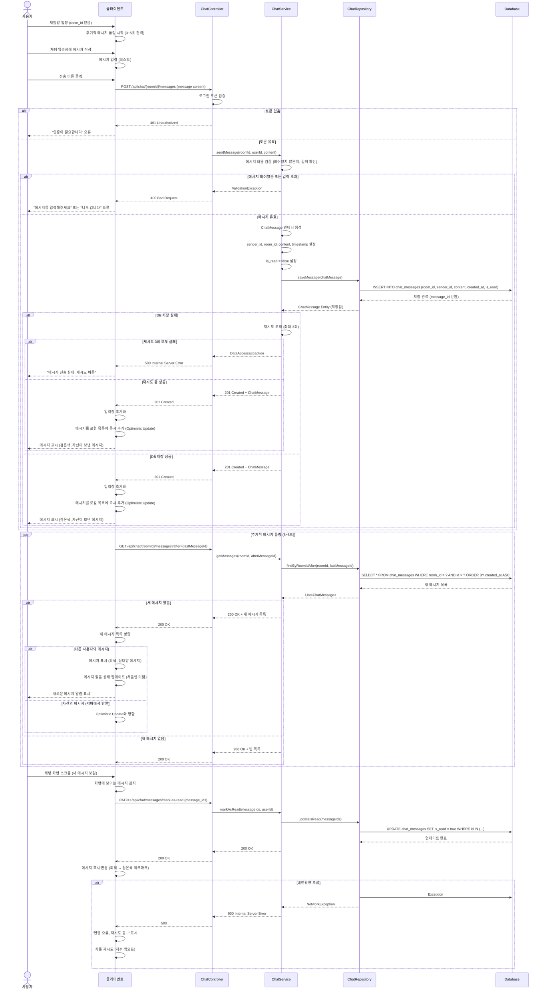
```mermaid
sequenceDiagram
    actor User as 사용자
    participant UI as 클라이언트
    participant Controller as ChatController
    participant Service as ChatService
    participant Repository as ChatRepository
    participant DB as Database

    User->>UI: 채팅방 입장 (room_id 있음)
    UI->>UI: 주기적 메시지 폴링 시작 (3~5초 간격)

    User->>UI: 채팅 입력창에 메시지 작성
    UI->>UI: 메시지 입력 (텍스트)
    
    User->>UI: 전송 버튼 클릭
    UI->>Controller: POST /api/chat/{roomId}/messages (message content)
    
    Controller->>Controller: 로그인 토큰 검증
    alt 토큰 없음
        Controller-->>UI: 401 Unauthorized
        UI-->>User: "인증이 필요합니다" 오류
    else 토큰 유효
        Controller->>Service: sendMessage(roomId, userId, content)
        
        Service->>Service: 메시지 내용 검증 (비어있지 않은지, 길이 확인)
        alt 메시지 비어있음 또는 길이 초과
            Service-->>Controller: ValidationException
            Controller-->>UI: 400 Bad Request
            UI-->>User: "메시지를 입력해주세요" 또는 "너무 깁니다" 오류
        else 메시지 유효
            Service->>Service: ChatMessage 엔티티 생성
            Service->>Service: sender_id, room_id, content, timestamp 설정
            Service->>Service: is_read = false 설정
            
            Service->>Repository: saveMessage(chatMessage)
            Repository->>DB: INSERT INTO chat_messages (room_id, sender_id, content, created_at, is_read)
            DB-->>Repository: 저장 완료 (message_id 반환)
            Repository-->>Service: ChatMessage Entity (저장됨)
            
            alt DB 저장 실패
                Service->>Service: 재시도 로직 (최대 3회)
                alt 재시도 3회 모두 실패
                    Service-->>Controller: DataAccessException
                    Controller-->>UI: 500 Internal Server Error
                    UI-->>User: "메시지 전송 실패, 재시도 버튼"
                else 재시도 중 성공
                    Service-->>Controller: 201 Created + ChatMessage
                    Controller-->>UI: 201 Created
                    UI->>UI: 입력창 초기화
                    UI->>UI: 메시지를 로컬 목록에 즉시 추가 (Optimistic Update)
                    UI-->>User: 메시지 표시 (검은색, 자신이 보낸 메시지)
                end
            else DB 저장 성공
                Service-->>Controller: 201 Created + ChatMessage
                Controller-->>UI: 201 Created
                UI->>UI: 입력창 초기화
                UI->>UI: 메시지를 로컬 목록에 즉시 추가 (Optimistic Update)
                UI-->>User: 메시지 표시 (검은색, 자신이 보낸 메시지)
            end
        end
    end

    par 주기적 메시지 폴링 (3~5초)
        UI->>Controller: GET /api/chat/{roomId}/messages?after={lastMessageId}
        
        Controller->>Service: getMessages(roomId, afterMessageId)
        
        Service->>Repository: findByRoomIdAfter(roomId, lastMessageId)
        Repository->>DB: SELECT * FROM chat_messages WHERE room_id = ? AND id > ? ORDER BY created_at ASC
        DB-->>Repository: 새 메시지 목록
        Repository-->>Service: List<ChatMessage>
        
        alt 새 메시지 있음
            Service-->>Controller: 200 OK + 새 메시지 목록
            Controller-->>UI: 200 OK
            UI->>UI: 새 메시지 목록 병합
            
            alt 다른 사용자의 메시지
                UI->>UI: 메시지 표시 (회색, 상대방 메시지)
                UI->>UI: 메시지 읽음 상태 업데이트 (처음엔 미읽)
                UI-->>User: 새로운 메시지 알림 표시
            else 자신의 메시지 (서버에서 반환)
                UI->>UI: Optimistic Update와 병합
            end
        else 새 메시지 없음
            Service-->>Controller: 200 OK + 빈 목록
            Controller-->>UI: 200 OK
        end
    end

    User->>UI: 채팅 화면 스크롤 (새 메시지 보임)
    UI->>UI: 화면에 보이는 메시지 감지
    UI->>Controller: PATCH /api/chat/messages/mark-as-read (message_ids)
    
    Controller->>Service: markAsRead(messageIds, userId)
    
    Service->>Repository: updateIsRead(messageIds)
    Repository->>DB: UPDATE chat_messages SET is_read = true WHERE id IN (...)
    DB-->>Repository: 업데이트 완료
    
    Service-->>Controller: 200 OK
    Controller-->>UI: 200 OK
    UI->>UI: 메시지 표시 변경 (회색 → 검은색 체크마크)

    alt 네트워크 오류
        Repository->>DB: Exception
        Repository-->>Service: NetworkException
        Service-->>Controller: 500 Internal Server Error
        Controller-->>UI: 500
        UI->>UI: "연결 오류, 재시도 중..." 표시
        UI->>UI: 자동 재시도 (지수 백오프)
    end

```

---

 이 시퀀스 다이어그램은 사용자가 채팅 입력창에 메시지를 작성해 “전송”을 누르면 ChatController가 JWT를 검증해 미인증이면 401 Unauthorized를 반환하고, 인증이 통과되면 ChatService가 내용 비어 있음이나 과도한 길이 등 유효성 검사를 수행한 뒤 통과된 메시지를 ChatRepository를 통해 chat_messages 테이블에 INSERT하며 실패 시 최대 3회 재시도 후 오류를 반환하는 흐름을 보여준다. 저장이 성공하면 서버는 201 Created와 함께 messageId를 응답하고, 클라이언트는 입력창을 초기화한 뒤 Optimistic Update로 방금 전송한 메시지를 즉시 화면에 그려 사용자 체감 지연을 줄인다. 이후 클라이언트는 3~5초 간격의 주기적 폴링으로 신규 메시지만 효율적으로 가져와 UI에 병합하며, 수신자(상대방)의 메시지는 회색, 본인 메시지는 검정으로 구분해 가독성을 높인다. 사용자가 스크롤로 메시지를 실제로 확인하면 클라이언트는 PATCH /api/chat/messages/mark-as-read 요청을 보내 읽음 상태를 is_read=true로 갱신하고, UI에는 체크마크 등 읽음 표시가 반영된다. 네트워크 장애나 서버 일시 오류가 발생할 경우 화면에는 “연결 오류, 재시도 중...” 안내가 나타나며 지수 백오프 전략으로 폴링과 전송을 자동 재시도해 안정적인 송수신을 보장한다.

---

# 11. 기존 대화 내역 불러오기

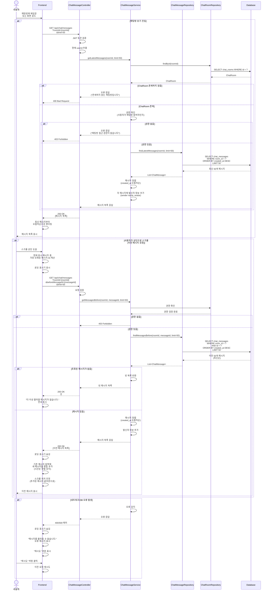
```mermaid
sequenceDiagram
    actor User as 사용자
    participant UI as Frontend
    participant Controller as ChatMessageController
    participant Service as ChatMessageService
    participant ChatMessageRepo as ChatMessageRepository
    participant ChatRoomRepo as ChatRoomRepository
    participant DB as Database

    User->>UI: 채팅방에 재입장<br/>또는 화면 로드
    
    alt 채팅방 초기 진입
        UI->>Controller: GET /api/chat/messages<br/>?roomId={roomId}<br/>&limit=50
        
        Controller->>Controller: JWT 토큰 검증
        Controller->>Controller: 현재 userId 추출
        
        Controller->>Service: getLatestMessages(roomId, limit=50)
        
        Service->>ChatRoomRepo: findById(roomId)
        ChatRoomRepo->>DB: SELECT chat_rooms WHERE id = ?
        DB-->>ChatRoomRepo: ChatRoom
        ChatRoomRepo-->>Service: ChatRoom
        
        alt ChatRoom 존재하지 않음
            Service-->>Controller: 오류 응답<br/>("존재하지 않는 채팅방입니다")
            Controller-->>UI: 400 Bad Request
        else ChatRoom 존재
            Service->>Service: 권한 확인<br/>(사용자가 채팅방 참여자인지)
            
            alt 권한 없음
                Service-->>Controller: 오류 응답<br/>("채팅방 접근 권한이 없습니다")
                Controller-->>UI: 403 Forbidden
            else 권한 있음
                Service->>ChatMessageRepo: findLatestMessages(roomId, limit=50)
                ChatMessageRepo->>DB: SELECT chat_messages<br/>WHERE room_id = ?<br/>ORDER BY created_at DESC<br/>LIMIT 50
                DB-->>ChatMessageRepo: 최신 50개 메시지
                ChatMessageRepo-->>Service: List<ChatMessage>
                
                Service->>Service: 메시지 정렬<br/>(created_at 오름차순)
                
                Service->>Service: 각 메시지에 발신자 정보 추가<br/>(sender name, avatar)
                
                Service-->>Controller: 메시지 목록 응답
            end
        end
        
        Controller-->>UI: 200 OK<br/>[메시지 목록]
        
        UI->>UI: 최신 메시지부터<br/>오름차순으로 렌더링
        UI-->>User: 메시지 목록 표시
    end
    
    alt 사용자가 상단으로 스크롤<br/>(이전 메시지 요청)
        User->>UI: 스크롤 상단 도달
        
        UI->>UI: 현재 표시 메시지 중<br/>가장 오래된 메시지 ID 계산
        
        UI->>UI: 로딩 표시기 표시
        
        UI->>Controller: GET /api/chat/messages<br/>?roomId={roomId}<br/>&beforeMessageId={messageId}<br/>&limit=50
        
        Controller->>Controller: 요청 검증
        
        Controller->>Service: getMessagesBefore(roomId, messageId, limit=50)
        
        Service->>ChatRoomRepo: 권한 확인
        ChatRoomRepo-->>Service: 권한 검증 완료
        
        alt 권한 없음
            Service-->>Controller: 403 Forbidden
        else 권한 있음
            Service->>ChatMessageRepo: findMessagesBefore(roomId, messageId, limit=50)
            ChatMessageRepo->>DB: SELECT chat_messages<br/>WHERE room_id = ?<br/>AND id < ?<br/>ORDER BY created_at DESC<br/>LIMIT 50
            DB-->>ChatMessageRepo: 이전 50개 메시지<br/>(최신순)
            ChatMessageRepo-->>Service: List<ChatMessage>
            
            alt 조회된 메시지가 없음
                Service->>Service: 빈 목록 반환
                Service-->>Controller: 빈 메시지 목록
                
                Controller-->>UI: 200 OK<br/>[]
                
                UI->>UI: "더 이상 불러올 메시지가 없습니다."<br/>안내 표시
            else 메시지 있음
                Service->>Service: 메시지 정렬<br/>(created_at 오름차순)
                
                Service->>Service: 발신자 정보 추가
                
                Service-->>Controller: 메시지 목록 응답
                
                Controller-->>UI: 200 OK<br/>[이전 메시지 목록]
                
                UI->>UI: 로딩 표시기 숨김
                
                UI->>UI: 기존 메시지 앞쪽에<br/>새 메시지들 병합 추가<br/>(시간순 정렬 유지)
                
                UI->>UI: 스크롤 위치 조정<br/>(추가된 메시지 끝부분으로)
                
                UI-->>User: 이전 메시지 표시
            end
        end
    end
    
    alt 네트워크/DB 오류 발생
        Service->>Service: 오류 감지
        
        Service-->>Controller: 오류 응답
        Controller-->>UI: 400/500 에러
        
        UI->>UI: 로딩 표시기 숨김
        UI->>UI: "메시지를 불러올 수 없습니다."<br/>오류 메시지 표시
        UI->>UI: "재시도" 버튼 표시
        
        User->>UI: "재시도" 버튼 클릭
        UI->>UI: 이전 요청 재시도
    end

```
---

 이 시퀀스 다이어그램은 사용자가 채팅방에 다시 입장했을 때 기존 대화 내역을 불러오거나, 스크롤을 통해 이전 메시지를 추가 조회하는 전체 흐름을 보여준다. 사용자가 채팅방에 처음 들어오면 클라이언트는 GET /api/chat/messages?roomId={roomId}&limit=50 요청을 보낸다. 서버에서는 ChatMessageController가 JWT 토큰을 검증해 인증 상태를 확인하고, 해당 사용자가 해당 채팅방의 참여자인지 권한을 검사한다. 검증이 완료되면 ChatMessageRepository가 데이터베이스에서 최신 50개의 메시지를 조회해 시간순으로 정렬하고, 그 결과를 응답으로 반환한다. 프런트엔드는 응답받은 메시지들을 UI에 렌더링해 최신 대화부터 표시한다. 이후 사용자가 화면 상단으로 스크롤을 올릴 경우 클라이언트는 가장 오래된 메시지의 ID를 기준으로 GET /api/chat/messages?beforeMessageId={id} 요청을 전송해 이전 메시지를 추가로 요청한다. 서버는 해당 ID 이전의 메시지를 조회하여 반환하며, 결과가 비어 있으면 “더 이상 불러올 메시지가 없습니다.”라는 안내 문구를 UI에 표시한다. 메시지가 존재할 경우 기존 목록의 앞부분에 병합하여 자연스럽게 이전 대화가 확장되는 형태로 보여준다. 만약 데이터베이스 조회 실패나 네트워크 오류가 발생하면 클라이언트는 “메시지를 불러올 수 없습니다.”라는 오류 메시지를 표시하고, 사용자가 수동으로 재시도할 수 있는 버튼을 제공한다. 이를 통해 사용자는 끊김 없이 과거 대화 기록을 탐색할 수 있으며, 시스템은 안정적인 페이징 기반 메시지 조회를 지원한다.

---

# 12. 읽음 처리

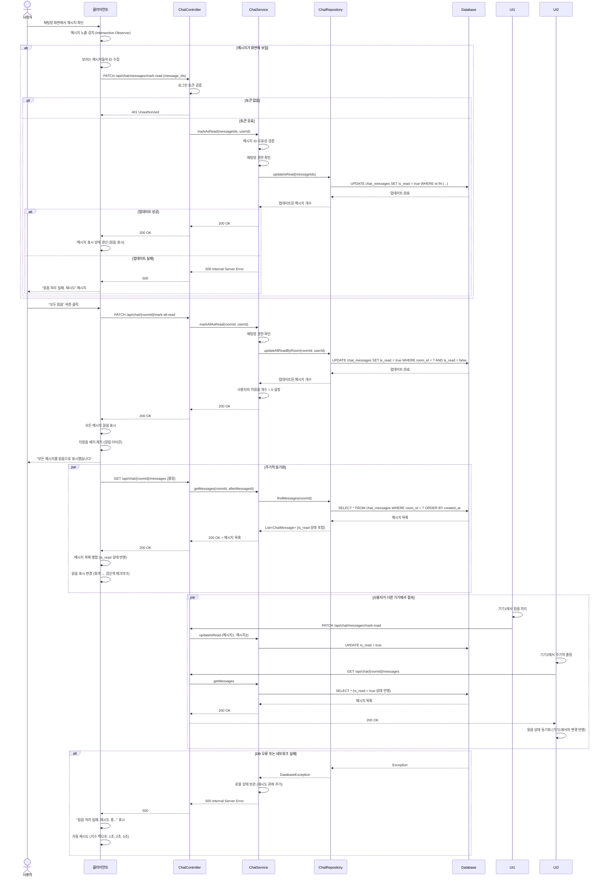
```mermaid
sequenceDiagram
    actor User as 사용자
    participant UI as 클라이언트
    participant Controller as ChatController
    participant Service as ChatService
    participant Repository as ChatRepository
    participant DB as Database

    User->>UI: 채팅방 화면에서 메시지 확인
    UI->>UI: 메시지 노출 감지 (Intersection Observer)
    
    alt 메시지가 화면에 보임
        UI->>UI: 보이는 메시지들의 ID 수집
        UI->>Controller: PATCH /api/chat/messages/mark-read (message_ids)
        
        Controller->>Controller: 로그인 토큰 검증
        alt 토큰 없음
            Controller-->>UI: 401 Unauthorized
        else 토큰 유효
            Controller->>Service: markAsRead(messageIds, userId)
            
            Service->>Service: 메시지 ID 유효성 검증
            Service->>Service: 채팅방 권한 확인
            
            Service->>Repository: updateIsRead(messageIds)
            Repository->>DB: UPDATE chat_messages SET is_read = true WHERE id IN (...)
            DB-->>Repository: 업데이트 완료
            Repository-->>Service: 업데이트된 메시지 개수
            
            alt 업데이트 성공
                Service-->>Controller: 200 OK
                Controller-->>UI: 200 OK
                UI->>UI: 메시지 표시 상태 갱신 (읽음 표시)
            else 업데이트 실패
                Service-->>Controller: 500 Internal Server Error
                Controller-->>UI: 500
                UI-->>User: "읽음 처리 실패, 재시도" 메시지
            end
        end
    end

    User->>UI: "모두 읽음" 버튼 클릭
    UI->>Controller: PATCH /api/chat/{roomId}/mark-all-read
    
    Controller->>Service: markAllAsRead(roomId, userId)
    
    Service->>Service: 채팅방 권한 확인
    Service->>Repository: updateAllReadByRoom(roomId, userId)
    Repository->>DB: UPDATE chat_messages SET is_read = true WHERE room_id = ? AND is_read = false
    DB-->>Repository: 업데이트 완료
    Repository-->>Service: 업데이트된 메시지 개수
    
    Service->>Service: 사용자의 미읽음 개수 = 0 설정
    Service-->>Controller: 200 OK
    Controller-->>UI: 200 OK
    UI->>UI: 모든 메시지 읽음 표시
    UI->>UI: 미읽음 배지 제거 (알림 아이콘)
    UI-->>User: "모든 메시지를 읽음으로 표시했습니다"

    par 주기적 동기화
        UI->>Controller: GET /api/chat/{roomId}/messages (폴링)
        
        Controller->>Service: getMessages(roomId, afterMessageId)
        Service->>Repository: findMessages(roomId)
        Repository->>DB: SELECT * FROM chat_messages WHERE room_id = ? ORDER BY created_at
        DB-->>Repository: 메시지 목록
        Repository-->>Service: List<ChatMessage> (is_read 상태 포함)
        
        Service-->>Controller: 200 OK + 메시지 목록
        Controller-->>UI: 200 OK
        UI->>UI: 메시지 목록 병합 (is_read 상태 반영)
        UI->>UI: 읽음 표시 변경 (회색 → 검은색 체크마크)
    end

    par 사용자가 다른 기기에서 접속
        UI1->>UI1: 기기1에서 읽음 처리
        UI1->>Controller: PATCH /api/chat/messages/mark-read
        Controller->>Service: updateIsRead (메시지1, 메시지2)
        Service->>DB: UPDATE is_read = true
        
        UI2->>UI2: 기기2에서 주기적 폴링
        UI2->>Controller: GET /api/chat/{roomId}/messages
        Controller->>Service: getMessages
        Service->>DB: SELECT * (is_read = true 상태 반영)
        DB-->>Service: 메시지 목록
        Service-->>Controller: 200 OK
        Controller-->>UI2: 200 OK
        UI2->>UI2: 읽음 상태 동기화 (기기1에서의 변경 반영)
    end

    alt DB 오류 또는 네트워크 실패
        DB-->>Repository: Exception
        Repository-->>Service: DatabaseException
        Service->>Service: 로컬 상태 보관 (재시도 큐에 추가)
        Service-->>Controller: 500 Internal Server Error
        Controller-->>UI: 500
        UI->>UI: "읽음 처리 실패, 재시도 중..." 표시
        UI->>UI: 자동 재시도 (지수 백오프: 1초, 2초, 5초)
    end

```
---

 이 시퀀스 다이어그램은 사용자가 채팅방에서 메시지를 읽었을 때 읽음 상태를 데이터베이스에 반영하고, 여러 기기 간 읽음 정보를 실시간으로 동기화하는 전체 흐름을 설명한다. 사용자가 채팅방을 열면 프런트엔드 UI는 Intersection Observer를 통해 현재 화면에 보이는 메시지의 ID를 자동으로 감지한다. 감지된 메시지는 PATCH /api/chat/messages/mark-read 요청으로 서버에 전달되며, 서버는 해당 메시지의 is_read 필드를 true로 업데이트한 뒤 200 OK 응답을 반환한다. 응답이 도착하면 프런트엔드는 해당 메시지 옆에 검은색 체크마크를 표시해 사용자가 읽은 상태임을 시각적으로 보여준다. 또한 사용자가 채팅방 전체를 확인했거나 “모두 읽음” 버튼을 눌렀을 경우, 클라이언트는 PATCH /api/chat/{roomId}/mark-all-read 요청을 보낸다. 서버는 해당 채팅방 내 사용자가 수신한 모든 메시지를 읽음 처리하고, 성공 시 “모든 메시지를 읽음으로 표시했습니다.”라는 안내 문구를 UI에 표시한다. 이후 다중 기기 환경에서도 일관된 읽음 상태를 유지하기 위해, 예를 들어 기기1에서 읽음 처리가 완료되면 기기2는 주기적 폴링을 통해 변경된 메시지들의 최신 is_read=true 상태를 수신받아 로컬 UI에 반영한다. 이를 통해 동일한 계정으로 로그인된 여러 기기에서 읽음 여부가 자동으로 동기화된다. 만약 데이터베이스 업데이트 실패나 네트워크 오류가 발생하면 클라이언트는 읽음 요청을 **로컬 큐(Local Queue)**에 임시 저장하고, 일정 주기로 재전송을 시도한다. 이때 화면에는 “읽음 처리 실패, 재시도 중...”이라는 안내 문구가 나타나 사용자가 오류 상태를 인지할 수 있다. 이런 과정을 통해 시스템은 메시지 읽음 상태를 정확하게 반영하면서, 불안정한 네트워크 환경에서도 안정적인 동기화를 유지한다.

---

# 13. 재접속 시 이어보기

```mermaid
sequenceDiagram
    actor User as 사용자
    participant UI as Frontend
    participant Controller as ChatMessageController
    participant Service as ChatMessageService
    participant ChatRoomRepo as ChatRoomRepository
    participant ChatMessageRepo as ChatMessageRepository
    participant UserChatStateRepo as UserChatStateRepository
    participant DB as Database

    User->>UI: 채팅방에 재입장
    
    UI->>UI: 현재 로그인 상태 확인
    
    alt 로그인 상태 아님
        UI->>UI: 로그인 페이지로 리다이렉트
        UI-->>User: "로그인이 필요합니다"
    else 로그인 상태
        UI->>Controller: GET /api/chat/resume<br/>?roomId={roomId}
        
        Controller->>Controller: JWT 토큰 검증
        Controller->>Controller: 현재 userId 추출
        
        Controller->>Service: getResumePoint(roomId, userId)
        
        Service->>ChatRoomRepo: findById(roomId)
        ChatRoomRepo->>DB: SELECT chat_rooms WHERE id = ?
        DB-->>ChatRoomRepo: ChatRoom
        ChatRoomRepo-->>Service: ChatRoom
        
        alt ChatRoom 존재하지 않음
            Service-->>Controller: 오류 응답
            Controller-->>UI: 404 Not Found
        else ChatRoom 존재
            Service->>Service: 권한 확인<br/>(사용자가 참여자인지)
            
            alt 권한 없음
                Service-->>Controller: 403 Forbidden
                Controller-->>UI: 403 오류
            else 권한 있음
                Service->>UserChatStateRepo: findLastReadMessage(roomId, userId)
                UserChatStateRepo->>DB: SELECT user_chat_states<br/>WHERE room_id = ? AND user_id = ?
                DB-->>UserChatStateRepo: 마지막 읽음 포인터<br/>(message_id 또는 null)
                UserChatStateRepo-->>Service: last_read_message_id
                
                alt 마지막 읽음 포인터가 없음<br/>(첫 입장 또는 초기화)
                    Service->>Service: 기본값 사용<br/>(최근 N개 메시지)
                    Service->>ChatMessageRepo: findLatestMessages(roomId, limit=50)
                    ChatMessageRepo->>DB: SELECT chat_messages<br/>WHERE room_id = ?<br/>ORDER BY created_at DESC<br/>LIMIT 50
                    DB-->>ChatMessageRepo: 최신 50개 메시지
                    ChatMessageRepo-->>Service: List<ChatMessage>
                else 마지막 읽음 포인터 존재
                    Service->>ChatMessageRepo: findMessagesAfter(roomId, messageId)
                    ChatMessageRepo->>DB: SELECT chat_messages<br/>WHERE room_id = ?<br/>AND id > ?<br/>ORDER BY created_at ASC
                    DB-->>ChatMessageRepo: 포인터 이후 메시지
                    ChatMessageRepo-->>Service: List<ChatMessage>
                    
                    alt 포인터 이후 새 메시지 없음
                        Service->>Service: 포인터 주변<br/>메시지 조회<br/>(context를 위해 이전 메시지 포함)
                        Service->>ChatMessageRepo: findContextMessages(roomId, messageId, before=10, after=5)
                        ChatMessageRepo->>DB: 컨텍스트 메시지 조회
                        DB-->>ChatMessageRepo: 컨텍스트
                        ChatMessageRepo-->>Service: List<ChatMessage>
                    end
                end
                
                Service->>Service: 메시지 정렬<br/>(created_at 오름차순)
                
                Service->>Service: 각 메시지에 발신자 정보 추가
                
                Service-->>Controller: 메시지 목록 및<br/>마지막 읽음 포인터 응답
            end
        end
        
        Controller-->>UI: 200 OK<br/>{messages, lastReadMessageId, unreadCount}
        
        UI->>UI: 로딩 표시기 표시
        
        alt 새로운 메시지 있음 (포인터 이후)
            UI->>UI: 새 메시지부터 우선 렌더링<br/>(강조 또는 구분)
        else 새로운 메시지 없음
            UI->>UI: 포인터 주변 컨텍스트<br/>메시지 렌더링
            UI->>UI: 포인터 위치로 자동 스크롤
        end
        
        UI->>UI: 로딩 표시기 숨김
        
        UI->>UI: 화면 노출 범위 계산<br/>(뷰포트 내 최하단 메시지)
        
        alt 새 메시지 표시됨 (뷰포트 내)
            UI->>Controller: PUT /api/chat/read-state<br/>?roomId={roomId}<br/>&lastMessageId={messageId}
            
            Controller->>Controller: 요청 검증
            
            Controller->>Service: updateReadState(roomId, userId, lastMessageId)
            
            Service->>UserChatStateRepo: findById(roomId, userId)
            UserChatStateRepo->>DB: SELECT FROM user_chat_states
            DB-->>UserChatStateRepo: 기존 상태
            UserChatStateRepo-->>Service: UserChatState
            
            alt 기존 상태 없음
                Service->>Service: 새로운 UserChatState 생성
                Service->>UserChatStateRepo: save(newState)
                UserChatStateRepo->>DB: INSERT INTO user_chat_states
                DB-->>UserChatStateRepo: 저장 완료
            else 기존 상태 있음
                Service->>Service: 단조 증가 규칙 확인<br/>(새 messageId > 기존)
                
                alt 새 포인터가 더 오래됨
                    Service->>Service: 기존 포인터 유지<br/>(무시)
                else 새 포인터가 더 최신
                    Service->>UserChatStateRepo: update(lastMessageId)
                    UserChatStateRepo->>DB: UPDATE user_chat_states
                    DB-->>UserChatStateRepo: 업데이트 완료
                end
            end
            
            Service-->>Controller: 성공 응답
            Controller-->>UI: 200 OK
        end
        
        UI-->>User: 채팅방 표시<br/>이어서 보기 완료
    end

```
---

 이 시퀀스 다이어그램은 사용자가 채팅방에 다시 접속했을 때 마지막으로 읽은 메시지 이후의 새 메시지만 불러와 자연스럽게 이어볼 수 있도록 하는 전체 과정을 설명한다. 사용자가 재입장하면 컨트롤러가 우선 JWT를 검증해 로그인 여부를 확인하고, 사용자가 해당 채팅방의 참여자인지를 검사한다. 채팅방이 존재하지 않으면 404 오류를, 권한이 없을 경우 403 오류를 반환한다. 검증이 통과되면 UserChatStateRepository에서 사용자의 last_read_message_id를 조회해 이어보기 기준점을 결정한다. 만약 포인터 값이 없으면 기본적으로 최근 50개의 메시지를 불러오고, 포인터가 존재할 경우 해당 ID 이후의 메시지만 로드한다. 이후 서버는 가져온 메시지를 시간순으로 정렬해 클라이언트에 반환하며, UI는 응답받은 데이터를 기반으로 새 메시지를 기존 대화 뒤에 자연스럽게 이어서 표시한다. 사용자가 새로운 메시지를 모두 확인하면 클라이언트는 PUT /api/chat/read-state 요청을 통해 최신 메시지 ID로 읽음 포인터를 갱신해 서버에 저장한다. 처리 완료 후 UI는 “이어서 보기 완료”라는 안내 문구를 표시하고, 새로 불러온 메시지들은 시각적으로 강조 표시되어 사용자가 어디까지 읽었는지 쉽게 인지할 수 있게 한다.

---
# 14. 회원가입

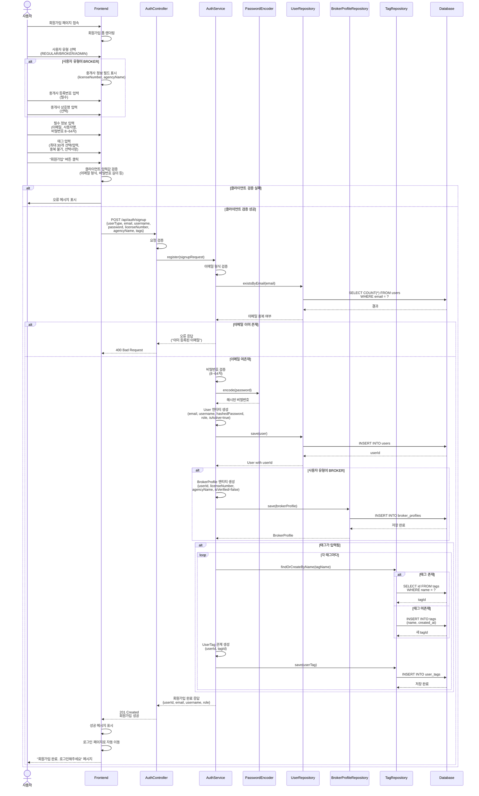
```mermaid
sequenceDiagram
    actor User as 사용자
    participant UI as Frontend
    participant Controller as AuthController
    participant Service as AuthService
    participant PasswordEncoder as PasswordEncoder
    participant UserRepo as UserRepository
    participant BrokerRepo as BrokerProfileRepository
    participant TagRepo as TagRepository
    participant DB as Database

    User->>UI: 회원가입 페이지 접속
    
    UI->>UI: 회원가입 폼 렌더링
    
    User->>UI: 사용자 유형 선택<br/>(REGULAR/BROKER/ADMIN)
    
    alt 사용자 유형이 BROKER
        UI->>UI: 중개사 정보 필드 표시<br/>(licenseNumber, agencyName)
        User->>UI: 중개사 등록번호 입력<br/>(필수)
        User->>UI: 중개사 상호명 입력<br/>(선택)
    end
    
    User->>UI: 필수 정보 입력<br/>(이메일, 사용자명,<br/>비밀번호 8~64자)
    
    User->>UI: 태그 입력<br/>(최대 30개 선택/입력,<br/>중복 불가, 선택사항)
    
    User->>UI: "회원가입" 버튼 클릭
    
    UI->>UI: 클라이언트 입력값 검증<br/>(이메일 형식, 비밀번호 길이 등)
    
    alt 클라이언트 검증 실패
        UI->>User: 오류 메시지 표시
    else 클라이언트 검증 성공
        UI->>Controller: POST /api/auth/signup<br/>{userType, email, username,<br/>password, licenseNumber,<br/>agencyName, tags}
        
        Controller->>Controller: 요청 검증
        
        Controller->>Service: register(signupRequest)
        
        Service->>Service: 이메일 형식 검증
        
        Service->>UserRepo: existsByEmail(email)
        UserRepo->>DB: SELECT COUNT(*) FROM users<br/>WHERE email = ?
        DB-->>UserRepo: 결과
        UserRepo-->>Service: 이메일 중복 여부
        
        alt 이메일 이미 존재
            Service-->>Controller: 오류 응답<br/>("이미 등록된 이메일")
            Controller-->>UI: 400 Bad Request
        else 이메일 미존재
            Service->>Service: 비밀번호 검증<br/>(8~64자)
            
            Service->>PasswordEncoder: encode(password)
            PasswordEncoder-->>Service: 해시된 비밀번호
            
            Service->>Service: User 엔티티 생성<br/>(email, username, hashedPassword,<br/>role, isActive=true)
            
            Service->>UserRepo: save(user)
            UserRepo->>DB: INSERT INTO users
            DB-->>UserRepo: userId
            UserRepo-->>Service: User with userId
            
            alt 사용자 유형이 BROKER
                Service->>Service: BrokerProfile 엔티티 생성<br/>(userId, licenseNumber,<br/>agencyName, isVerified=false)
                
                Service->>BrokerRepo: save(brokerProfile)
                BrokerRepo->>DB: INSERT INTO broker_profiles
                DB-->>BrokerRepo: 저장 완료
                BrokerRepo-->>Service: BrokerProfile
            end
            
            alt 태그가 입력됨
                loop 각 태그마다
                    Service->>TagRepo: findOrCreateByName(tagName)
                    
                    alt 태그 존재
                        TagRepo->>DB: SELECT id FROM tags<br/>WHERE name = ?
                        DB-->>TagRepo: tagId
                    else 태그 미존재
                        TagRepo->>DB: INSERT INTO tags<br/>(name, created_at)
                        DB-->>TagRepo: 새 tagId
                    end
                    
                    Service->>Service: UserTag 관계 생성<br/>(userId, tagId)
                    Service->>TagRepo: save(userTag)
                    TagRepo->>DB: INSERT INTO user_tags
                    DB-->>TagRepo: 저장 완료
                end
            end
            
            Service-->>Controller: 회원가입 완료 응답<br/>{userId, email, username, role}
            
            Controller-->>UI: 201 Created<br/>회원가입 성공
            
            UI->>UI: 성공 메시지 표시
            UI->>UI: 로그인 페이지로 자동 이동
            UI-->>User: "회원가입 완료. 로그인해주세요" 메시지
        end
    end

```

---

**설명**  
사용자가 회원가입 페이지에 접속하면 Frontend는 회원가입 폼을 렌더링한다. 사용자는 사용자 유형(REGULAR/BROKER/ADMIN)을 선택한다. BROKER 선택 시 Frontend는 내부에서 중개사 정보 필드를 추가로 표시하고, 사용자는 등록번호(필수)와 상호명(선택)을 입력한다. 이후 필수 정보(이메일, 사용자명, 8~64자 비밀번호)와 태그(최대 30개, 중복 불가)를 입력하고 회원가입 버튼을 클릭한다.

Frontend는 내부에서 입력값을 검증한다. 클라이언트 검증이 실패하면 Frontend는 사용자에게 오류 메시지를 표시한다. 클라이언트 검증이 성공하면 Frontend는 AuthController로 POST 요청을 전송한다.

Controller는 내부에서 요청을 검증한 후 AuthService의 register 메서드를 호출한다. Service는 내부에서 이메일 형식을 검증한 후 UserRepository를 통해 이메일 중복을 확인한다. Repository는 Database에 SELECT 쿼리를 실행하여 중복 여부를 확인하고 결과를 Service로 반환한다. 이메일이 이미 존재하면 Service는 오류 응답을 Controller로 전달하고, Controller는 Frontend로 400 오류를 응답한다.

이메일이 미존재하면 Service는 내부에서 비밀번호를 검증(8~64자)한 후 PasswordEncoder를 통해 해시화한다. PasswordEncoder는 해시된 비밀번호를 Service로 반환한다. Service는 내부에서 User 엔티티를 생성한 후 UserRepository의 save 메서드를 호출한다. Repository는 Database에 INSERT 쿼리를 실행하여 사용자를 저장하고, Database는 생성된 userId를 Repository로 반환한다. Repository는 User 엔티티를 Service로 반환한다.

사용자 유형이 BROKER인 경우 Service는 내부에서 BrokerProfile 엔티티를 생성한 후 BrokerRepository의 save 메서드를 호출한다. Repository는 Database에 INSERT 쿼리를 실행하여 브로커 정보를 저장하고, Database는 저장 완료를 Repository로 알린다. Repository는 BrokerProfile을 Service로 반환한다.

태그가 입력된 경우 각 태그마다 Service는 TagRepository의 findOrCreateByName 메서드를 호출한다. 태그가 존재하면 Repository는 Database에서 SELECT하여 tagId를 반환하고, 태그가 미존재하면 Repository는 Database에 INSERT하여 새 tagId를 반환한다. Service는 내부에서 UserTag 관계를 생성한 후 TagRepository의 save 메서드를 호출한다. Repository는 Database에 INSERT 쿼리를 실행하여 관계를 저장한다.

모든 저장이 완료되면 Service는 회원가입 완료 응답을 Controller로 반환하고, Controller는 201 Created 응답을 Frontend로 전송한다. Frontend는 내부에서 성공 메시지를 표시하고 로그인 페이지로 자동 이동한 후, 사용자에게 "회원가입 완료. 로그인해주세요" 메시지를 표시한다.

---

# 15. 로그인 / 토큰 관리

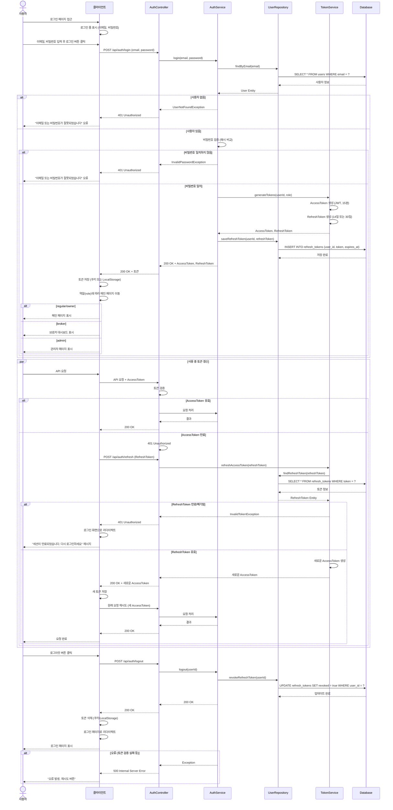
```mermaid
sequenceDiagram
    actor User as 사용자
    participant UI as 클라이언트
    participant Controller as AuthController
    participant Service as AuthService
    participant Repository as UserRepository
    participant TokenService as TokenService
    participant DB as Database

    User->>UI: 로그인 페이지 접근
    UI->>UI: 로그인 폼 표시 (이메일, 비밀번호)
    
    User->>UI: 이메일, 비밀번호 입력 후 로그인 버튼 클릭
    UI->>Controller: POST /api/auth/login (email, password)
    
    Controller->>Service: login(email, password)
    
    Service->>Repository: findByEmail(email)
    Repository->>DB: SELECT * FROM users WHERE email = ?
    DB-->>Repository: 사용자 정보
    Repository-->>Service: User Entity
    
    alt 사용자 없음
        Service-->>Controller: UserNotFoundException
        Controller-->>UI: 401 Unauthorized
        UI-->>User: "이메일 또는 비밀번호가 잘못되었습니다" 오류
    else 사용자 있음
        Service->>Service: 비밀번호 검증 (해시 비교)
        alt 비밀번호 일치하지 않음
            Service-->>Controller: InvalidPasswordException
            Controller-->>UI: 401 Unauthorized
            UI-->>User: "이메일 또는 비밀번호가 잘못되었습니다" 오류
        else 비밀번호 일치
            Service->>TokenService: generateTokens(userId, role)
            
            TokenService->>TokenService: AccessToken 생성 (JWT, 15분)
            TokenService->>TokenService: RefreshToken 생성 (14일 또는 30일)
            TokenService-->>Service: AccessToken, RefreshToken
            
            Service->>Repository: saveRefreshToken(userId, refreshToken)
            Repository->>DB: INSERT INTO refresh_tokens (user_id, token, expires_at)
            DB-->>Repository: 저장 완료
            
            Service-->>Controller: 200 OK + AccessToken, RefreshToken
            
            Controller-->>UI: 200 OK + 토큰
            UI->>UI: 토큰 저장 (쿠키 또는 LocalStorage)
            UI->>UI: 역할(role)에 따라 메인 페이지 이동
            alt regular/owner
                UI-->>User: 메인 페이지 표시
            else broker
                UI-->>User: 브로커 대시보드 표시
            else admin
                UI-->>User: 관리자 페이지 표시
            end
        end
    end

    par 사용 중 토큰 갱신
        User->>UI: API 요청
        UI->>Controller: API 요청 + AccessToken
        
        Controller->>Controller: 토큰 검증
        alt AccessToken 유효
            Controller->>Service: 요청 처리
            Service-->>Controller: 결과
            Controller-->>UI: 200 OK
        else AccessToken 만료
            Controller->>Controller: 401 Unauthorized
            UI->>Controller: POST /api/auth/refresh (RefreshToken)
            
            Controller->>TokenService: refreshAccessToken(refreshToken)
            
            TokenService->>Repository: findRefreshToken(refreshToken)
            Repository->>DB: SELECT * FROM refresh_tokens WHERE token = ?
            DB-->>Repository: 토큰 정보
            Repository-->>TokenService: RefreshToken Entity
            
            alt RefreshToken 만료/폐기됨
                TokenService-->>Controller: InvalidTokenException
                Controller-->>UI: 401 Unauthorized
                UI->>UI: 로그인 화면으로 리다이렉트
                UI-->>User: "세션이 만료되었습니다. 다시 로그인하세요" 메시지
            else RefreshToken 유효
                TokenService->>TokenService: 새로운 AccessToken 생성
                TokenService-->>Controller: 새로운 AccessToken
                
                Controller-->>UI: 200 OK + 새로운 AccessToken
                UI->>UI: 새 토큰 저장
                UI->>Controller: 원래 요청 재시도 (새 AccessToken)
                Controller->>Service: 요청 처리
                Service-->>Controller: 결과
                Controller-->>UI: 200 OK
                UI-->>User: 요청 완료
            end
        end
    end

    User->>UI: 로그아웃 버튼 클릭
    UI->>Controller: POST /api/auth/logout
    
    Controller->>Service: logout(userId)
    
    Service->>Repository: revokeRefreshToken(userId)
    Repository->>DB: UPDATE refresh_tokens SET revoked = true WHERE user_id = ?
    DB-->>Repository: 업데이트 완료
    
    Service-->>Controller: 200 OK
    
    Controller-->>UI: 200 OK
    UI->>UI: 토큰 삭제 (쿠키/LocalStorage)
    UI->>UI: 로그인 페이지로 리다이렉트
    UI-->>User: 로그인 페이지 표시

    alt 오류 (토큰 검증 실패 등)
        Service-->>Controller: Exception
        Controller-->>UI: 500 Internal Server Error
        UI-->>User: "오류 발생, 재시도 버튼"
    end

```

---

**설명**  
사용자가 로그인 페이지에 접근하면 클라이언트는 내부에서 로그인 폼을 표시한다. 사용자가 이메일과 비밀번호를 입력하고 로그인 버튼을 클릭하면 클라이언트는 AuthController로 POST 요청을 전송한다.

Controller는 AuthService의 login 메서드를 호출한다. Service는 UserRepository를 통해 이메일로 사용자를 조회한다. Repository는 Database에 SELECT 쿼리를 실행하고 사용자 정보를 Service로 반환한다. 사용자가 없으면 Service는 Controller로 예외를 전달하고, Controller는 클라이언트로 401 오류를 응답한다. 클라이언트는 오류 메시지를 사용자에게 표시한다.

사용자가 존재하면 Service는 내부에서 비밀번호를 검증한다. 비밀번호가 일치하지 않으면 Service는 Controller로 예외를 전달하고, Controller는 클라이언트로 401 오류를 응답한다. 클라이언트는 오류 메시지를 사용자에게 표시한다.

비밀번호가 일치하면 Service는 TokenService의 generateTokens 메서드를 호출한다. TokenService는 내부에서 AccessToken(JWT, 15분 유효)을 생성하고, RefreshToken(14일 또는 30일 유효)을 생성한 후 Service로 반환한다. Service는 Repository의 saveRefreshToken 메서드를 호출한다. Repository는 Database에 INSERT 쿼리를 실행하여 RefreshToken을 저장하고, Database는 저장 완료를 Repository로 알린다.

Service는 Controller로 200 응답과 AccessToken, RefreshToken을 전달한다. Controller는 클라이언트로 200 응답과 토큰을 전송한다. 클라이언트는 내부에서 토큰을 저장하고, 역할에 따라 메인 페이지로 이동한다. 역할이 regular/owner인 경우 메인 페이지를 표시하고, broker인 경우 브로커 대시보드를 표시하고, admin인 경우 관리자 페이지를 표시한다.

사용 중 사용자가 API 요청을 하면 클라이언트는 Controller로 API 요청과 AccessToken을 전송한다. Controller는 내부에서 토큰을 검증한다. AccessToken이 유효하면 Controller는 Service를 호출하여 요청을 처리하고, Service는 결과를 Controller로 반환한다. Controller는 클라이언트로 200 응답을 전송한다.

AccessToken이 만료되었으면 Controller는 내부에서 401 Unauthorized를 처리한다. 클라이언트는 Controller로 POST 요청과 RefreshToken을 전송한다. Controller는 TokenService의 refreshAccessToken 메서드를 호출한다. TokenService는 Repository를 통해 RefreshToken을 조회한다. Repository는 Database에 SELECT 쿼리를 실행하고 토큰 정보를 TokenService로 반환한다.

RefreshToken이 만료되거나 폐기되었으면 TokenService는 Controller로 예외를 전달하고, Controller는 클라이언트로 401 오류를 응답한다. 클라이언트는 내부에서 로그인 화면으로 리다이렉트하고 사용자에게 "세션이 만료되었습니다. 다시 로그인하세요" 메시지를 표시한다.

RefreshToken이 유효하면 TokenService는 내부에서 새로운 AccessToken을 생성하여 Controller로 반환한다. Controller는 클라이언트로 200 응답과 새로운 AccessToken을 전송한다. 클라이언트는 내부에서 새 토큰을 저장하고 원래 요청을 새 AccessToken과 함께 Controller로 재전송한다. Controller는 Service를 호출하여 요청을 처리하고, Service는 결과를 Controller로 반환한다. Controller는 클라이언트로 200 응답을 전송하고, 클라이언트는 요청 완료를 사용자에게 표시한다.

사용자가 로그아웃 버튼을 클릭하면 클라이언트는 Controller로 POST 요청을 전송한다. Controller는 Service의 logout 메서드를 호출한다. Service는 Repository의 revokeRefreshToken 메서드를 호출한다. Repository는 Database에 UPDATE 쿼리를 실행하여 RefreshToken을 무효화하고, Database는 업데이트 완료를 Repository로 알린다. Service는 Controller로 200 응답을 전달하고, Controller는 클라이언트로 200 응답을 전송한다. 클라이언트는 내부에서 토큰을 삭제하고, 로그인 페이지로 리다이렉트한 후 사용자에게 로그인 페이지를 표시한다.

오류가 발생하면 Service는 Controller로 예외를 전달하고, Controller는 클라이언트로 500 오류를 응답한다. 클라이언트는 오류 발생 메시지와 재시도 버튼을 사용자에게 표시한다.

---

# 16. 로그아웃

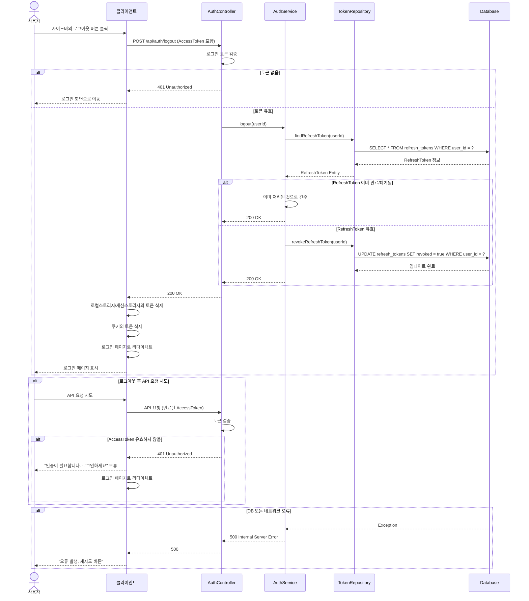
```mermaid
sequenceDiagram
    actor User as 사용자
    participant UI as 클라이언트
    participant Controller as AuthController
    participant Service as AuthService
    participant Repository as TokenRepository
    participant DB as Database

    User->>UI: 사이드바의 로그아웃 버튼 클릭
    UI->>Controller: POST /api/auth/logout (AccessToken 포함)
    
    Controller->>Controller: 로그인 토큰 검증
    alt 토큰 없음
        Controller-->>UI: 401 Unauthorized
        UI-->>User: 로그인 화면으로 이동
    else 토큰 유효
        Controller->>Service: logout(userId)
        
        Service->>Repository: findRefreshToken(userId)
        Repository->>DB: SELECT * FROM refresh_tokens WHERE user_id = ?
        DB-->>Repository: RefreshToken 정보
        Repository-->>Service: RefreshToken Entity
        
        alt RefreshToken 이미 만료/폐기됨
            Service->>Service: 이미 처리된 것으로 간주
            Service-->>Controller: 200 OK
        else RefreshToken 유효
            Service->>Repository: revokeRefreshToken(userId)
            Repository->>DB: UPDATE refresh_tokens SET revoked = true WHERE user_id = ?
            DB-->>Repository: 업데이트 완료
            
            Service-->>Controller: 200 OK
        end
        
        Controller-->>UI: 200 OK
        UI->>UI: 로컬스토리지/세션스토리지의 토큰 삭제
        UI->>UI: 쿠키의 토큰 삭제
        UI->>UI: 로그인 페이지로 리다이렉트
        UI-->>User: 로그인 페이지 표시
    end

    alt 로그아웃 후 API 요청 시도
        User->>UI: API 요청 시도
        UI->>Controller: API 요청 (만료된 AccessToken)
        
        Controller->>Controller: 토큰 검증
        alt AccessToken 유효하지 않음
            Controller-->>UI: 401 Unauthorized
            UI-->>User: "인증이 필요합니다. 로그인하세요" 오류
            UI->>UI: 로그인 페이지로 리다이렉트
        end
    end

    alt DB 또는 네트워크 오류
        DB-->>Service: Exception
        Service-->>Controller: 500 Internal Server Error
        Controller-->>UI: 500
        UI-->>User: "오류 발생, 재시도 버튼"
    end

```

---

**설명**  
사용자가 사이드바의 로그아웃 버튼을 클릭하면 클라이언트는 AccessToken을 포함하여 AuthController로 POST 요청을 전송한다. Controller는 내부에서 토큰을 검증하여 인증 상태를 확인한다. 토큰이 없으면 Controller는 클라이언트로 401 오류를 응답하고, 클라이언트는 로그인 화면으로 이동한다.

토큰이 유효하면 Controller는 AuthService의 logout 메서드를 호출한다. Service는 TokenRepository의 findRefreshToken 메서드를 통해 해당 사용자의 RefreshToken을 조회한다. Repository는 Database에 SELECT 쿼리를 실행하여 RefreshToken 정보를 조회하고 Service로 반환한다.

RefreshToken이 이미 만료되거나 폐기된 상태면 Service는 내부에서 이미 처리된 것으로 간주하고 Controller로 200 응답을 반환한다. RefreshToken이 유효한 경우 Service는 Repository의 revokeRefreshToken 메서드를 호출하여 토큰을 무효화한다. Repository는 Database에 UPDATE 쿼리를 실행하여 revoked를 true로 설정하고, Database는 업데이트 완료를 Repository로 알린다.

Service는 Controller로 200 응답을 전달하고, Controller는 클라이언트로 200 응답을 전송한다. 클라이언트는 내부에서 로컬스토리지와 세션스토리지의 토큰을 삭제하고, 쿠키의 토큰을 삭제한 후, 로그인 페이지로 리다이렉트한다. 클라이언트는 사용자에게 로그인 페이지를 표시한다.

로그아웃 후 사용자가 API 요청을 시도하면 클라이언트는 만료된 AccessToken과 함께 Controller로 API 요청을 전송한다. Controller는 내부에서 토큰을 검증한다. AccessToken이 유효하지 않으면 Controller는 클라이언트로 401 오류를 응답하고, 클라이언트는 "인증이 필요합니다. 로그인하세요" 오류 메시지를 사용자에게 표시한다. 클라이언트는 내부에서 로그인 페이지로 리다이렉트한다.

Database 또는 네트워크 오류가 발생하면 Database는 Service로 예외를 전달하고, Service는 Controller로 전달한다. Controller는 클라이언트로 500 오류를 응답하고, 클라이언트는 "오류 발생, 재시도 버튼" 메시지를 사용자에게 표시한다.

---

# 17. 비밀번호 재설정

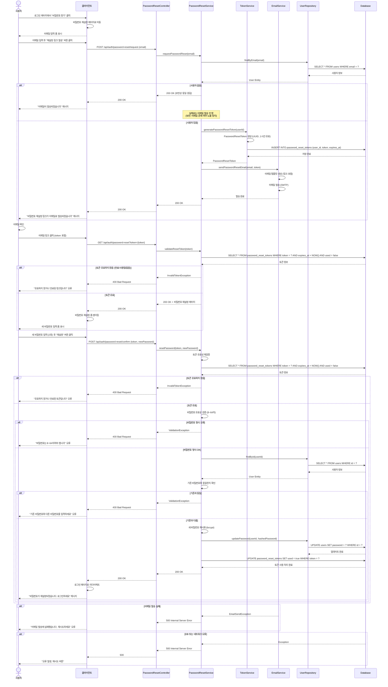
```mermaid
sequenceDiagram
    actor User as 사용자
    participant UI as 클라이언트
    participant Controller as PasswordResetController
    participant Service as PasswordResetService
    participant TokenService as TokenService
    participant EmailService as EmailService
    participant Repository as UserRepository
    participant DB as Database

    User->>UI: 로그인 페이지에서 "비밀번호 찾기" 클릭
    UI->>UI: 비밀번호 재설정 페이지로 이동
    UI-->>User: 이메일 입력 폼 표시

    User->>UI: 이메일 입력 후 "재설정 링크 발송" 버튼 클릭
    UI->>Controller: POST /api/auth/password-reset/request (email)
    
    Controller->>Service: requestPasswordReset(email)
    
    Service->>Repository: findByEmail(email)
    Repository->>DB: SELECT * FROM users WHERE email = ?
    DB-->>Repository: 사용자 정보
    Repository-->>Service: User Entity
    
    alt 사용자 없음
        Service-->>Controller: 200 OK (보안상 동일 응답)
        Controller-->>UI: 200 OK
        UI-->>User: "이메일이 발송되었습니다" 메시지
        Note over Service: 실제로는 이메일 발송 안 함<br/>(보안: 이메일 존재 여부 노출 방지)
    else 사용자 있음
        Service->>TokenService: generatePasswordResetToken(userId)
        
        TokenService->>TokenService: PasswordResetToken 생성 (UUID, 1시간 유효)
        TokenService->>DB: INSERT INTO password_reset_tokens (user_id, token, expires_at)
        DB-->>TokenService: 저장 완료
        TokenService-->>Service: PasswordResetToken
        
        Service->>EmailService: sendPasswordResetEmail(email, token)
        EmailService->>EmailService: 이메일 템플릿 생성 (링크 포함)
        EmailService->>EmailService: 이메일 발송 (SMTP)
        EmailService-->>Service: 발송 완료
        
        Service-->>Controller: 200 OK
        Controller-->>UI: 200 OK
        UI-->>User: "비밀번호 재설정 링크가 이메일로 발송되었습니다" 메시지
    end

    User->>User: 이메일 확인
    User->>UI: 이메일 링크 클릭 (token 포함)
    UI->>Controller: GET /api/auth/password-reset?token={token}
    
    Controller->>Service: validateResetToken(token)
    
    Service->>DB: SELECT * FROM password_reset_tokens WHERE token = ? AND expires_at > NOW() AND used = false
    DB-->>Service: 토큰 정보
    
    alt 토큰 유효하지 않음 (만료/사용됨/없음)
        Service-->>Controller: InvalidTokenException
        Controller-->>UI: 400 Bad Request
        UI-->>User: "유효하지 않거나 만료된 링크입니다" 오류
    else 토큰 유효
        Service-->>Controller: 200 OK + 비밀번호 재설정 페이지
        Controller-->>UI: 200 OK
        UI->>UI: 비밀번호 재설정 폼 렌더링
        UI-->>User: 새 비밀번호 입력 폼 표시
    end

    User->>UI: 새 비밀번호 입력 (2회) 후 "재설정" 버튼 클릭
    UI->>Controller: POST /api/auth/password-reset/confirm (token, newPassword)
    
    Controller->>Service: resetPassword(token, newPassword)
    
    Service->>Service: 토큰 유효성 재검증
    Service->>DB: SELECT * FROM password_reset_tokens WHERE token = ? AND expires_at > NOW() AND used = false
    DB-->>Service: 토큰 정보
    
    alt 토큰 유효하지 않음
        Service-->>Controller: InvalidTokenException
        Controller-->>UI: 400 Bad Request
        UI-->>User: "유효하지 않거나 만료된 토큰입니다" 오류
    else 토큰 유효
        Service->>Service: 비밀번호 유효성 검증 (8~64자)
        
        alt 비밀번호 형식 오류
            Service-->>Controller: ValidationException
            Controller-->>UI: 400 Bad Request
            UI-->>User: "비밀번호는 8~64자여야 합니다" 오류
        else 비밀번호 형식 OK
            Service->>Repository: findById(userId)
            Repository->>DB: SELECT * FROM users WHERE id = ?
            DB-->>Repository: 사용자 정보
            Repository-->>Service: User Entity
            
            Service->>Service: 기존 비밀번호와 동일한지 확인
            alt 기존과 동일
                Service-->>Controller: ValidationException
                Controller-->>UI: 400 Bad Request
                UI-->>User: "기존 비밀번호와 다른 비밀번호를 입력하세요" 오류
            else 기존과 다름
                Service->>Service: 새 비밀번호 해시화 (bcrypt)
                Service->>Repository: updatePassword(userId, hashedPassword)
                Repository->>DB: UPDATE users SET password = ? WHERE id = ?
                DB-->>Repository: 업데이트 완료
                
                Service->>DB: UPDATE password_reset_tokens SET used = true WHERE token = ?
                DB-->>Service: 토큰 사용 처리 완료
                
                Service-->>Controller: 200 OK
                Controller-->>UI: 200 OK
                UI->>UI: 로그인 페이지로 리다이렉트
                UI-->>User: "비밀번호가 재설정되었습니다. 로그인하세요" 메시지
            end
        end
    end

    alt 이메일 발송 실패
        EmailService-->>Service: EmailSendException
        Service-->>Controller: 500 Internal Server Error
        UI-->>User: "이메일 발송에 실패했습니다. 재시도하세요" 오류
    end

    alt DB 또는 네트워크 오류
        DB-->>Service: Exception
        Service-->>Controller: 500 Internal Server Error
        Controller-->>UI: 500
        UI-->>User: "오류 발생, 재시도 버튼"
    end

```

---

**설명**  
사용자가 로그인 페이지에서 "비밀번호 찾기"를 클릭하면 클라이언트는 내부에서 비밀번호 재설정 페이지로 이동한다. 클라이언트는 이메일 입력 폼을 사용자에게 표시한다.

사용자가 이메일을 입력하고 "재설정 링크 발송" 버튼을 클릭하면 클라이언트는 PasswordResetController로 POST 요청을 전송한다. Controller는 PasswordResetService의 requestPasswordReset 메서드를 호출한다. Service는 UserRepository의 findByEmail 메서드를 통해 이메일로 사용자를 조회한다. Repository는 Database에 SELECT 쿼리를 실행하고 사용자 정보를 Service로 반환한다.

사용자가 없으면 보안을 위해 Service는 Controller로 200 응답을 반환하고, Controller는 클라이언트로 전달한다. 클라이언트는 "이메일이 발송되었습니다" 메시지를 사용자에게 표시한다(실제로는 이메일 발송 안 함).

사용자가 존재하면 Service는 TokenService의 generatePasswordResetToken 메서드를 호출한다. TokenService는 내부에서 PasswordResetToken을 생성(UUID, 1시간 유효)한 후 Database에 INSERT 쿼리를 실행하여 저장한다. Database는 저장 완료를 TokenService로 알리고, TokenService는 PasswordResetToken을 Service로 반환한다. Service는 EmailService의 sendPasswordResetEmail 메서드를 호출한다. EmailService는 내부에서 재설정 링크가 포함된 이메일 템플릿을 생성하고, 이메일을 발송한 후 Service로 발송 완료를 알린다. Service는 Controller로 200 응답을 전달하고, Controller는 클라이언트로 전송한다. 클라이언트는 "비밀번호 재설정 링크가 이메일로 발송되었습니다" 메시지를 사용자에게 표시한다.

사용자가 이메일을 확인하고 링크를 클릭하면 클라이언트는 토큰을 포함하여 Controller로 GET 요청을 전송한다. Controller는 Service의 validateResetToken 메서드를 호출한다. Service는 Database에 SELECT 쿼리를 실행하여 토큰의 유효성을 검증한다. Database는 토큰 정보를 Service로 반환한다. 토큰이 만료되었거나 사용되었거나 없으면 Service는 Controller로 예외를 전달하고, Controller는 클라이언트로 400 오류를 응답한다. 클라이언트는 "유효하지 않거나 만료된 링크입니다" 오류 메시지를 사용자에게 표시한다.

토큰이 유효하면 Service는 Controller로 200 응답과 비밀번호 재설정 페이지를 전달하고, Controller는 클라이언트로 전송한다. 클라이언트는 내부에서 비밀번호 재설정 폼을 렌더링하여 새 비밀번호 입력 폼을 사용자에게 표시한다.

사용자가 새 비밀번호를 2회 입력하고 "재설정" 버튼을 클릭하면 클라이언트는 Controller로 POST 요청을 전송한다. Controller는 Service의 resetPassword 메서드를 호출한다. Service는 내부에서 토큰 유효성을 재검증하고 Database에 SELECT 쿼리를 실행한다. Database는 토큰 정보를 Service로 반환한다. 토큰이 유효하지 않으면 Service는 Controller로 예외를 전달하고, Controller는 클라이언트로 400 오류를 응답한다. 클라이언트는 "유효하지 않거나 만료된 토큰입니다" 오류 메시지를 사용자에게 표시한다.

토큰이 유효하면 Service는 내부에서 비밀번호 유효성을 검증한다(8~64자). 비밀번호 형식이 오류면 Service는 Controller로 예외를 전달하고, Controller는 클라이언트로 400 오류를 응답한다. 클라이언트는 "비밀번호는 8~64자여야 합니다" 오류 메시지를 사용자에게 표시한다.

비밀번호 형식이 맞으면 Service는 Repository의 findById 메서드를 호출한다. Repository는 Database에 SELECT 쿼리를 실행하여 사용자 정보를 조회하고 Service로 반환한다. Service는 내부에서 기존 비밀번호와 동일한지 확인한다. 기존과 동일하면 Service는 Controller로 예외를 전달하고, Controller는 클라이언트로 400 오류를 응답한다. 클라이언트는 "기존 비밀번호와 다른 비밀번호를 입력하세요" 오류 메시지를 사용자에게 표시한다.

기존과 다르면 Service는 내부에서 새 비밀번호를 해시화하고 Repository의 updatePassword 메서드를 호출한다. Repository는 Database에 UPDATE 쿼리를 실행하여 비밀번호를 저장하고, Database는 업데이트 완료를 Repository로 알린다. Service는 Database에 UPDATE 쿼리를 실행하여 토큰을 used=true로 설정하고, Database는 토큰 사용 처리 완료를 Service로 알린다.

Service는 Controller로 200 응답을 전달하고, Controller는 클라이언트로 전송한다. 클라이언트는 내부에서 로그인 페이지로 리다이렉트하고 "비밀번호가 재설정되었습니다. 로그인하세요" 메시지를 사용자에게 표시한다.

이메일 발송이 실패하면 EmailService는 Service로 예외를 전달하고, Service는 Controller로 전달한다. Controller는 클라이언트로 500 오류를 응답하고, 클라이언트는 "이메일 발송에 실패했습니다. 재시도하세요" 오류 메시지를 사용자에게 표시한다. Database 또는 네트워크 오류가 발생하면 Database는 Service로 예외를 전달하고, Service는 Controller로 전달한다. Controller는 클라이언트로 500 오류를 응답하고, 클라이언트는 "오류 발생, 재시도 버튼" 메시지를 사용자에게 표시한다.

---

# 18. 사용자 프로필 관리

```mermaid
sequenceDiagram
    actor User as 사용자
    participant UI as Frontend
    participant Controller as UserController
    participant Service as UserService
    participant UserRepo as UserRepository
    participant BrokerRepo as BrokerProfileRepository
    participant TagRepo as TagRepository
    participant PasswordEncoder as PasswordEncoder
    participant DB as Database

    User->>UI: 프로필 버튼 클릭
    
    UI->>Controller: GET /api/user/profile
    
    Controller->>Controller: JWT 토큰 검증
    Controller->>Controller: 현재 userId 추출
    
    Controller->>Service: getProfileDetail(userId)
    
    Service->>UserRepo: findById(userId)
    UserRepo->>DB: SELECT users WHERE id = ?
    DB-->>UserRepo: User
    UserRepo-->>Service: User
    
    alt 사용자의 role이 BROKER
        Service->>BrokerRepo: findById(userId)
        BrokerRepo->>DB: SELECT broker_profiles WHERE user_id = ?
        DB-->>BrokerRepo: BrokerProfile
        BrokerRepo-->>Service: BrokerProfile
    end
    
    Service->>TagRepo: findUserTags(userId)
    TagRepo->>DB: SELECT tags FROM user_tags WHERE user_id = ?
    DB-->>TagRepo: 태그 목록
    TagRepo-->>Service: List<Tag>
    
    Service->>Service: 프로필 정보 조합<br/>(이메일, 닉네임, 역할, 전화번호,<br/>소개글, 사진, 태그 목록)
    
    Service-->>Controller: 프로필 정보 응답
    
    Controller-->>UI: 200 OK<br/>{프로필 정보}
    
    UI->>UI: 프로필 패널에 정보 표시
    
    alt 프로필 수정을 원하지 않음
        UI-->>User: 프로필 조회 완료
    else 프로필 수정 버튼 클릭
        User->>UI: "프로필 수정" 버튼 클릭
        
        UI->>UI: 프로필 수정 폼 활성화<br/>(현재 정보 미리 채우기)
        
        User->>UI: 기본 정보 수정<br/>(전화번호, 소개글 등)
        
        alt 사진 변경
            User->>UI: 새로운 사진 업로드
            UI->>UI: 이미지 미리보기 표시
        end
        
        alt 태그 변경
            User->>UI: 태그 삭제 및 추가
            UI->>UI: 태그 최대 30개 확인
            UI->>UI: 중복 태그 검사
        end
        
        alt 비밀번호 변경 필요
            User->>UI: "비밀번호 변경" 섹션<br/>현재 비밀번호 입력
            User->>UI: 새 비밀번호 입력 (8~64자)
            User->>UI: 새 비밀번호 재입력
            
            UI->>UI: 유효성 검증<br/>(길이, 동일성)
        end
        
        User->>UI: "수정 완료" 버튼 클릭
        
        UI->>UI: 클라이언트 검증
        
        alt 비밀번호 변경 포함
            UI->>Controller: PUT /api/user/profile<br/>{기본정보, 태그, 새비밀번호}
        else 비밀번호 변경 미포함
            UI->>Controller: PUT /api/user/profile<br/>{기본정보, 태그}
        end
        
        Controller->>Controller: JWT 토큰 검증
        Controller->>Controller: 현재 userId 추출
        
        Controller->>Service: updateProfile(userId, updateRequest)
        
        Service->>UserRepo: findById(userId)
        UserRepo->>DB: SELECT users WHERE id = ?
        DB-->>UserRepo: User
        UserRepo-->>Service: User
        
        alt 비밀번호 변경 요청됨
            Service->>Service: 현재 비밀번호 입력 검증 필요<br/>확인
            
            Service->>PasswordEncoder: encode(currentPassword)
            PasswordEncoder-->>Service: 비교를 위한 해시
            
            Service->>Service: 입력된 현재 비밀번호와<br/>저장된 비밀번호 비교
            
            alt 현재 비밀번호 일치하지 않음
                Service-->>Controller: 오류 응답<br/>("현재 비밀번호가 일치하지 않습니다")
                Controller-->>UI: 400 Bad Request
            else 현재 비밀번호 일치
                Service->>Service: 새 비밀번호와 기존 비밀번호<br/>동일성 확인
                
                alt 새 비밀번호 = 기존 비밀번호
                    Service-->>Controller: 오류 응답<br/>("새 비밀번호는 기존과 달라야 합니다")
                    Controller-->>UI: 400 Bad Request
                else 새 비밀번호 ≠ 기존 비밀번호
                    Service->>PasswordEncoder: encode(newPassword)
                    PasswordEncoder-->>Service: 새 해시 비밀번호
                end
            end
        end
        
        Service->>Service: 기본 정보 업데이트<br/>(전화번호, 소개글, 이미지 URL)
        
        alt 태그 수정됨
            Service->>TagRepo: 기존 UserTag 삭제
            loop 각 기존 태그마다
                Service->>DB: DELETE FROM user_tags
                DB-->>TagRepo: 삭제 완료
            end
            
            loop 각 새 태그마다
                Service->>TagRepo: findOrCreateByName(tagName)
                
                alt 태그 존재
                    TagRepo->>DB: SELECT id FROM tags WHERE name = ?
                    DB-->>TagRepo: tagId
                else 태그 미존재
                    TagRepo->>DB: INSERT INTO tags(name)
                    DB-->>TagRepo: 새 tagId
                end
                
                Service->>TagRepo: createUserTag(userId, tagId)
                TagRepo->>DB: INSERT INTO user_tags
                DB-->>TagRepo: 저장 완료
            end
        end
        
        Service->>UserRepo: save(User)
        UserRepo->>DB: UPDATE users<br/>SET updated_at = NOW()
        DB-->>UserRepo: 업데이트 완료
        UserRepo-->>Service: User
        
        Service-->>Controller: 수정 완료 응답
        
        Controller-->>UI: 200 OK<br/>{업데이트된 프로필 정보}
        
        UI->>UI: 성공 메시지 표시
        UI->>UI: 프로필 패널 새로고침
        UI-->>User: 프로필 수정 완료
    end

```

---

**설명**  
사용자가 프로필 버튼을 클릭하면 Frontend는 UserController로 GET 요청을 전송한다. Controller는 내부에서 JWT 토큰을 검증하여 현재 userId를 추출한 후 UserService의 getProfileDetail 메서드를 호출한다.

Service는 UserRepository의 findById 메서드를 통해 사용자 정보를 조회한다. Repository는 Database에 SELECT 쿼리를 실행하고 User 정보를 Service로 반환한다. 사용자의 역할이 BROKER인 경우 Service는 BrokerRepository의 findById 메서드를 통해 브로커 프로필 정보를 조회한다. Repository는 Database에 SELECT 쿼리를 실행하여 BrokerProfile을 조회하고 Service로 반환한다.

Service는 TagRepository의 findUserTags 메서드를 통해 사용자와 연결된 태그 목록을 조회한다. Repository는 Database에 SELECT 쿼리를 실행하여 태그 목록을 조회하고 Service로 반환한다. Service는 내부에서 프로필 정보를 조합하여 Controller로 프로필 정보 응답을 전달한다. Controller는 Frontend로 200 응답과 프로필 정보를 전송한다. Frontend는 내부에서 프로필 패널에 정보를 표시한다.

프로필 수정을 원하지 않으면 Frontend는 프로필 조회 완료를 사용자에게 표시한다. 사용자가 "프로필 수정" 버튼을 클릭하면 Frontend는 내부에서 프로필 수정 폼을 활성화하고 현재 정보를 미리 채운다. 사용자는 기본 정보(전화번호, 소개글 등)를 수정한다.

사진을 변경하는 경우 사용자가 새로운 사진을 업로드하면 Frontend는 내부에서 이미지 미리보기를 표시한다. 태그를 변경하는 경우 사용자가 태그를 삭제하고 추가하면 Frontend는 내부에서 태그 최대 30개를 확인하고 중복 태그를 검사한다. 비밀번호 변경이 필요한 경우 사용자가 현재 비밀번호를 입력하고, 새 비밀번호(8~64자)를 입력하고, 새 비밀번호를 재입력하면 Frontend는 내부에서 유효성을 검증한다.

사용자가 "수정 완료" 버튼을 클릭하면 Frontend는 내부에서 클라이언트 검증을 수행한다. 비밀번호 변경이 포함된 경우 Frontend는 Controller로 PUT 요청(기본정보, 태그, 새비밀번호)을 전송하고, 포함되지 않은 경우 PUT 요청(기본정보, 태그)을 전송한다.

Controller는 내부에서 JWT 토큰을 검증하여 현재 userId를 추출한 후 UserService의 updateProfile 메서드를 호출한다. Service는 UserRepository의 findById 메서드를 통해 사용자 정보를 조회한다. Repository는 Database에 SELECT 쿼리를 실행하고 User 정보를 Service로 반환한다.

비밀번호 변경이 요청된 경우 Service는 내부에서 현재 비밀번호 입력 검증이 필요한지 확인한다. Service는 PasswordEncoder의 encode 메서드를 통해 현재 비밀번호를 해시화하고, PasswordEncoder는 비교를 위한 해시를 Service로 반환한다. Service는 내부에서 입력된 현재 비밀번호와 저장된 비밀번호를 비교한다. 현재 비밀번호가 일치하지 않으면 Service는 Controller로 오류 응답을 전달하고, Controller는 Frontend로 400 오류를 응답한다.

현재 비밀번호가 일치하면 Service는 내부에서 새 비밀번호와 기존 비밀번호의 동일성을 확인한다. 새 비밀번호가 기존 비밀번호와 같으면 Service는 Controller로 오류 응답을 전달하고, Controller는 Frontend로 400 오류를 응답한다. 새 비밀번호가 기존 비밀번호와 다르면 Service는 PasswordEncoder의 encode 메서드를 통해 새 비밀번호를 해시화하고, PasswordEncoder는 새 해시 비밀번호를 Service로 반환한다.

Service는 내부에서 기본 정보를 업데이트한다(전화번호, 소개글, 이미지 URL). 태그가 수정된 경우 Service는 TagRepository를 통해 기존 UserTag를 삭제한다. 각 기존 태그마다 Service는 Database에 DELETE 쿼리를 실행하고, Database는 삭제 완료를 TagRepository로 알린다. 그 후 각 새 태그마다 Service는 TagRepository의 findOrCreateByName 메서드를 호출한다. 태그가 존재하면 Repository는 Database에 SELECT 쿼리를 실행하여 tagId를 반환하고, 태그가 미존재하면 Repository는 Database에 INSERT 쿼리를 실행하여 새 tagId를 반환한다.

Service는 TagRepository의 createUserTag 메서드를 호출하고, Repository는 Database에 INSERT 쿼리를 실행하여 관계를 저장한다. Database는 저장 완료를 Repository로 알린다. Service는 UserRepository의 save 메서드를 호출한다. Repository는 Database에 UPDATE 쿼리를 실행하여 사용자 정보와 updated_at을 갱신하고, Database는 업데이트 완료를 Repository로 알린다. Repository는 User를 Service로 반환한다.

Service는 Controller로 수정 완료 응답을 전달하고, Controller는 Frontend로 200 응답과 업데이트된 프로필 정보를 전송한다. Frontend는 내부에서 성공 메시지를 표시하고 프로필 패널을 새로고침한 후, 사용자에게 프로필 수정 완료를 표시한다.

---
# 19. 매물 목록 조회 (전체)

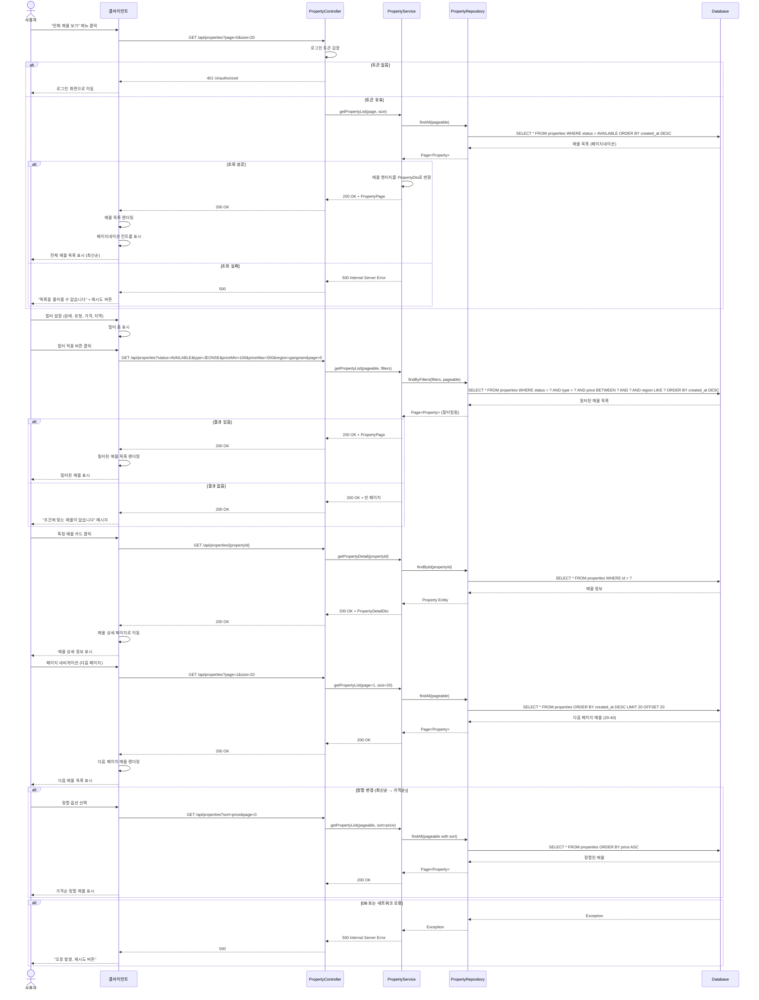
```mermaid
sequenceDiagram
    actor User as 사용자
    participant UI as 클라이언트
    participant Controller as PropertyController
    participant Service as PropertyService
    participant Repository as PropertyRepository
    participant DB as Database

    User->>UI: "전체 매물 보기" 메뉴 클릭
    UI->>Controller: GET /api/properties?page=0&size=20
    
    Controller->>Controller: 로그인 토큰 검증
    alt 토큰 없음
        Controller-->>UI: 401 Unauthorized
        UI-->>User: 로그인 화면으로 이동
    else 토큰 유효
        Controller->>Service: getPropertyList(page, size)
        
        Service->>Repository: findAll(pageable)
        Repository->>DB: SELECT * FROM properties WHERE status = AVAILABLE ORDER BY created_at DESC
        DB-->>Repository: 매물 목록 (페이지네이션)
        Repository-->>Service: Page<Property>
        
        alt 조회 성공
            Service->>Service: 매물 엔티티를 PropertyDto로 변환
            Service-->>Controller: 200 OK + PropertyPage
            
            Controller-->>UI: 200 OK
            UI->>UI: 매물 목록 렌더링
            UI->>UI: 페이지네이션 컨트롤 표시
            UI-->>User: 전체 매물 목록 표시 (최신순)
        else 조회 실패
            Service-->>Controller: 500 Internal Server Error
            Controller-->>UI: 500
            UI-->>User: "목록을 불러올 수 없습니다" + 재시도 버튼
        end
    end

    User->>UI: 필터 설정 (상태, 유형, 가격, 지역)
    UI->>UI: 필터 폼 표시
    
    User->>UI: 필터 적용 버튼 클릭
    UI->>Controller: GET /api/properties?status=AVAILABLE&type=JEONSE&priceMin=100&priceMax=500&region=gangnam&page=0
    
    Controller->>Service: getPropertyList(pageable, filters)
    
    Service->>Repository: findByFilters(filters, pageable)
    Repository->>DB: SELECT * FROM properties WHERE status = ? AND type = ? AND price BETWEEN ? AND ? AND region LIKE ? ORDER BY created_at DESC
    DB-->>Repository: 필터된 매물 목록
    Repository-->>Service: Page<Property> (필터링됨)
    
    alt 결과 있음
        Service-->>Controller: 200 OK + PropertyPage
        Controller-->>UI: 200 OK
        UI->>UI: 필터된 매물 목록 렌더링
        UI-->>User: 필터된 매물 표시
    else 결과 없음
        Service-->>Controller: 200 OK + 빈 페이지
        Controller-->>UI: 200 OK
        UI-->>User: "조건에 맞는 매물이 없습니다" 메시지
    end

    User->>UI: 특정 매물 카드 클릭
    UI->>Controller: GET /api/properties/{propertyId}
    
    Controller->>Service: getPropertyDetail(propertyId)
    Service->>Repository: findById(propertyId)
    Repository->>DB: SELECT * FROM properties WHERE id = ?
    DB-->>Repository: 매물 정보
    Repository-->>Service: Property Entity
    
    Service-->>Controller: 200 OK + PropertyDetailDto
    Controller-->>UI: 200 OK
    UI->>UI: 매물 상세 페이지로 이동
    UI-->>User: 매물 상세 정보 표시

    User->>UI: 페이지 네비게이션 (다음 페이지)
    UI->>Controller: GET /api/properties?page=1&size=20
    
    Controller->>Service: getPropertyList(page=1, size=20)
    Service->>Repository: findAll(pageable)
    Repository->>DB: SELECT * FROM properties ORDER BY created_at DESC LIMIT 20 OFFSET 20
    DB-->>Repository: 다음 페이지 매물 (20-40)
    Repository-->>Service: Page<Property>
    
    Service-->>Controller: 200 OK
    Controller-->>UI: 200 OK
    UI->>UI: 다음 페이지 매물 렌더링
    UI-->>User: 다음 매물 목록 표시

    alt 정렬 변경 (최신순 → 가격순)
        User->>UI: 정렬 옵션 선택
        UI->>Controller: GET /api/properties?sort=price&page=0
        
        Controller->>Service: getPropertyList(pageable, sort=price)
        Service->>Repository: findAll(pageable with sort)
        Repository->>DB: SELECT * FROM properties ORDER BY price ASC
        DB-->>Repository: 정렬된 매물
        Repository-->>Service: Page<Property>
        
        Service-->>Controller: 200 OK
        UI-->>User: 가격순 정렬 매물 표시
    end

    alt DB 또는 네트워크 오류
        DB-->>Repository: Exception
        Repository-->>Service: Exception
        Service-->>Controller: 500 Internal Server Error
        Controller-->>UI: 500
        UI-->>User: "오류 발생, 재시도 버튼"
    end

```

---

 이 시퀀스 다이어그램은 사용자가 등록된 전체 매물 목록을 조회하고, 필터를 적용하거나 페이지를 이동하면서 원하는 매물을 탐색하는 과정을 보여준다. 사용자가 “전체 매물 보기” 버튼을 선택하면 클라이언트는 GET /api/properties?page=0&size=20 요청을 전송하고, 서버는 JWT 토큰을 검증해 사용자 인증 상태를 확인한 뒤 데이터베이스에서 매물 목록을 조회한다. 조회된 매물들은 최신순으로 정렬되어 클라이언트로 전달되며, UI는 이를 카드 형태로 화면에 표시한다. 이후 사용자가 필터를 설정하면 클라이언트는 GET /api/properties?status=AVAILABLE&type=JEONSE&region=... 형태의 요청을 보내며, 서버는 전달된 조건에 맞는 매물만 선별해 응답한다. 조건에 부합하는 결과가 없을 경우 UI는 “조건에 맞는 매물이 없습니다.”라는 안내 문구를 표시한다. 사용자가 페이지를 이동할 경우 클라이언트는 GET /api/properties?page=n 요청을 보내고, 서버는 해당 페이지의 매물 목록을 반환해 기존 목록 뒤에 추가로 표시한다. 네트워크 장애나 데이터베이스 오류가 발생하면 클라이언트는 “목록을 불러올 수 없습니다.”라는 메시지를 표시하고, 사용자가 다시 시도할 수 있도록 재시도 버튼을 함께 제공한다. 이 과정을 통해 사용자는 전체 매물을 손쉽게 탐색하고, 조건별 필터링과 페이지 이동을 통해 효율적으로 원하는 매물을 찾을 수 있다.

---

# 20. 내 매물 관리

```mermaid
sequenceDiagram
    actor User as 사용자
    participant UI as Frontend
    participant Controller as PropertyController
    participant Service as PropertyService
    participant PropertyRepo as PropertyRepository
    participant UserRepo as UserRepository
    participant DB as Database

    User->>UI: "내 매물" 메뉴 선택
    
    UI->>UI: 현재 로그인 상태 확인
    
    alt 로그인하지 않은 상태
        UI->>UI: 로그인 페이지로 리다이렉트
        UI-->>User: "로그인이 필요합니다"
    else 로그인한 상태
        UI->>Controller: GET /api/user/properties<br/>?userId={userId}<br/>&page={page}<br/>&sort=-createdAt
        
        Controller->>Controller: JWT 토큰 검증
        Controller->>Controller: 현재 userId 추출
        
        Controller->>Service: getMyProperties(userId, page, sort)
        
        Service->>UserRepo: findById(userId)
        UserRepo->>DB: SELECT users WHERE id = ?
        DB-->>UserRepo: User
        UserRepo-->>Service: User
        
        alt User 존재하지 않음
            Service-->>Controller: 오류 응답<br/>("사용자를 찾을 수 없습니다")
            Controller-->>UI: 404 Not Found
        else User 존재
            Service->>PropertyRepo: findAllByOwnerId(userId, pageable)
            PropertyRepo->>DB: SELECT properties<br/>WHERE owner_id = ?<br/>ORDER BY created_at DESC<br/>LIMIT 20 OFFSET ?
            DB-->>PropertyRepo: 사용자의 매물 목록
            PropertyRepo-->>Service: Page<Property>
            
            Service->>Service: 각 Property에 거래 정보 추가<br/>(PropertyOffer 통합)
            
            Service->>Service: Property 목록 변환<br/>(PropertyResponseDto)
            
            Service-->>Controller: 매물 목록 응답
        end
        
        Controller-->>UI: 200 OK<br/>[매물 목록]
        
        UI->>UI: 매물 목록 렌더링<br/>(제목, 주소, 가격, 상태)
        UI->>UI: 필터/정렬 옵션 표시<br/>(상태, 거래유형, 가격순)
        UI-->>User: 내 매물 목록 표시
        
        alt 사용자가 매물 필터 적용
            User->>UI: 필터 조건 선택<br/>(상태, 거래유형, 가격범위)
            
            UI->>Controller: GET /api/user/properties<br/>?userId={userId}<br/>&status={status}<br/>&dealType={dealType}<br/>&minPrice={minPrice}<br/>&maxPrice={maxPrice}
            
            Controller->>Service: getMyPropertiesFiltered(userId, filters, page)
            
            Service->>PropertyRepo: findAllByOwnerIdAndFilters(userId, filters, pageable)
            PropertyRepo->>DB: SELECT properties<br/>WHERE owner_id = ? AND<br/>status = ? AND<br/>price BETWEEN ? AND ?<br/>ORDER BY created_at DESC
            DB-->>PropertyRepo: 필터링된 매물 목록
            PropertyRepo-->>Service: List<Property>
            
            Service-->>Controller: 필터링된 목록 응답
            Controller-->>UI: 200 OK<br/>[필터링된 매물 목록]
            
            UI->>UI: 필터 적용된 목록 표시
        end
        
        alt 사용자가 특정 매물 선택
            User->>UI: 매물 클릭
            
            UI->>UI: 매물 상세 정보 표시<br/>(제목, 주소, 가격, 거래조건,<br/>이미지, 설명)
            
            UI->>UI: 관리 기능 활성화<br/>("수정", "상태 변경", "삭제" 버튼)
        end
        
        alt 사용자가 매물 상태 변경
            User->>UI: "상태 변경" 버튼 클릭<br/>(AVAILABLE→PENDING→SOLD)
            
            UI->>UI: 상태 변경 옵션 표시
            
            User->>UI: 새로운 상태 선택
            
            UI->>Controller: PUT /api/user/properties/{propertyId}<br/>{status: newStatus}
            
            Controller->>Controller: JWT 토큰 검증
            Controller->>Controller: userId 추출
            
            Controller->>Service: updatePropertyStatus(propertyId, userId, newStatus)
            
            Service->>PropertyRepo: findById(propertyId)
            PropertyRepo->>DB: SELECT properties WHERE id = ?
            DB-->>PropertyRepo: Property
            PropertyRepo-->>Service: Property
            
            alt 매물 존재하지 않음
                Service-->>Controller: 오류 응답<br/>("존재하지 않는 매물입니다")
                Controller-->>UI: 404 Not Found
            else 매물 존재
                Service->>Service: 권한 확인<br/>(owner_id = userId?)
                
                alt 권한 없음
                    Service-->>Controller: 오류 응답<br/>("수정 권한이 없습니다")
                    Controller-->>UI: 403 Forbidden
                else 권한 있음
                    Service->>Service: 상태 변경<br/>(status = newStatus)
                    Service->>Service: updatedAt 갱신<br/>(@PreUpdate)
                    
                    Service->>PropertyRepo: save(Property)
                    PropertyRepo->>DB: UPDATE properties<br/>SET status = ?, updated_at = NOW()
                    DB-->>PropertyRepo: 업데이트 완료
                    PropertyRepo-->>Service: Property (업데이트됨)
                    
                    Service-->>Controller: 업데이트 완료 응답
                end
            end
            
            Controller-->>UI: 200 OK<br/>{매물 정보}
            
            UI->>UI: 성공 메시지 표시
            UI->>UI: 목록 새로고침<br/>업데이트된 상태 표시
            UI-->>User: "상태가 변경되었습니다"
        end
        
        alt 사용자가 매물 정보 수정
            User->>UI: "수정" 버튼 클릭
            
            UI->>UI: 수정 폼 로드<br/>(기존 정보 표시)
            
            User->>UI: 매물 정보 수정<br/>(가격, 설명, 이미지 등)
            
            User->>UI: "저장" 버튼 클릭
            
            UI->>Controller: PUT /api/user/properties/{propertyId}<br/>{title, price, description, ...}
            
            Controller->>Service: updateProperty(propertyId, userId, updateRequest)
            
            Service->>PropertyRepo: findById(propertyId)
            PropertyRepo->>DB: SELECT properties WHERE id = ?
            DB-->>PropertyRepo: Property
            PropertyRepo-->>Service: Property
            
            Service->>Service: 권한 확인
            
            alt 권한 없음
                Service-->>Controller: 403 Forbidden
            else 권한 있음
                Service->>Service: 매물 정보 업데이트<br/>(title, price, description 등)
                Service->>Service: updatedAt 갱신
                
                Service->>PropertyRepo: save(Property)
                PropertyRepo->>DB: UPDATE properties
                DB-->>PropertyRepo: 완료
                PropertyRepo-->>Service: Property (업데이트됨)
                
                Service-->>Controller: 200 OK<br/>{매물 정보}
            end
            
            Controller-->>UI: 200 OK
            
            UI->>UI: 성공 메시지 표시
            UI->>UI: 목록 새로고침
            UI-->>User: "매물 정보가 수정되었습니다"
        end
    end

```
---

 이 시퀀스 다이어그램은 사용자가 자신이 등록한 매물을 조회하고, 필요 시 매물 상태를 변경하거나 정보를 수정하는 전체 과정을 나타낸다. 사용자가 “내 매물” 메뉴를 선택하면 클라이언트는 GET /api/user/properties 요청을 전송하고, 서버는 JWT 토큰을 검증해 인증된 사용자임을 확인한 뒤 토큰에서 userId를 추출한다. 이후 PropertyRepository는 owner_id=userId 조건으로 데이터베이스를 조회하여 해당 사용자가 등록한 매물 목록을 반환하고, 프런트엔드는 이를 목록 형태로 화면에 표시한다. 사용자가 특정 매물의 상태(예: 공개/비공개, 거래중/완료)를 변경하기 위해 상태 변경 버튼을 클릭하면 클라이언트는 PUT /api/user/properties/{propertyId} 요청을 보낸다. 서버는 요청자의 권한을 확인해 owner_id가 userId와 일치하지 않으면 403 Forbidden 또는 매물이 존재하지 않으면 404 Not Found를 반환한다. 검증이 통과되면 매물 상태를 업데이트하고 데이터베이스에 반영한 뒤 성공 응답을 전송하며, UI는 변경된 상태를 즉시 갱신해 표시한다. 또한 사용자가 매물 정보를 수정하려고 “수정” 버튼을 클릭한 뒤 변경 내용을 입력하고 저장하면 동일한 PUT /api/user/properties/{propertyId} 요청이 전송되고, 서버는 수정된 데이터를 DB에 반영한 후 200 OK 응답을 반환한다. 프런트엔드는 응답을 받으면 “매물 정보가 수정되었습니다.”라는 알림을 표시해 수정 성공을 사용자에게 안내한다. 전체 과정은 인증, 권한 확인, 데이터 갱신, UI 피드백이 순차적으로 이루어지는 구조로, 사용자는 안전하게 자신의 매물을 관리할 수 있다.

---

# 21. 상의 매물 조회

```mermaid
sequenceDiagram
    actor User as 사용자
    participant UI as Frontend
    participant Controller as PropertyController
    participant Service as PropertyService
    participant PropertyRepo as PropertyRepository
    participant UserRepo as UserRepository
    participant DB as Database

    User->>UI: "다른 소유자 매물" 메뉴 선택
    
    UI->>UI: 로그인 상태 확인
    
    alt 로그인하지 않은 상태
        UI->>UI: 로그인 페이지로 리다이렉트
        UI-->>User: "로그인이 필요합니다"
    else 로그인한 상태
        UI->>Controller: GET /api/properties/others<br/>?userId={userId}<br/>&page={page}<br/>&sort=-createdAt
        
        Controller->>Controller: JWT 토큰 검증
        Controller->>Controller: 현재 userId 추출
        
        Controller->>Service: getOtherOwnersProperties(userId, page, sort)
        
        Service->>UserRepo: findById(userId)
        UserRepo->>DB: SELECT users WHERE id = ?
        DB-->>UserRepo: User
        UserRepo-->>Service: User
        
        alt User 존재하지 않음
            Service-->>Controller: 오류 응답<br/>("사용자를 찾을 수 없습니다")
            Controller-->>UI: 404 Not Found
        else User 존재
            Service->>PropertyRepo: findAllByOwnerIdNot(userId, pageable)
            PropertyRepo->>DB: SELECT properties<br/>WHERE owner_id != ?<br/>AND status = 'AVAILABLE'<br/>ORDER BY created_at DESC<br/>LIMIT 20 OFFSET ?
            DB-->>PropertyRepo: 다른 소유자의 매물 목록
            PropertyRepo-->>Service: Page<Property>
            
            Service->>Service: 각 Property에 소유자 정보 추가<br/>(BrokerProfile 포함)
            
            Service->>Service: 거래 조건 정보 추가<br/>(PropertyOffer 통합)
            
            Service->>Service: Property 목록 변환<br/>(PropertyListDto)
            
            Service-->>Controller: 매물 목록 응답
        end
        
        Controller-->>UI: 200 OK<br/>[다른 소유자 매물 목록]
        
        UI->>UI: 매물 목록 렌더링<br/>(제목, 주소, 가격, 거래유형,<br/>소유자 이름, 평점)
        UI->>UI: 페이지네이션 컨트롤 표시
        UI->>UI: 필터/정렬 옵션 표시<br/>(거래유형, 가격범위, 지역)
        UI-->>User: 다른 소유자 매물 목록 표시
        
        alt 사용자가 필터 적용
            User->>UI: 필터 조건 선택<br/>(거래유형, 가격범위 등)
            
            UI->>Controller: GET /api/properties/others<br/>?userId={userId}<br/>&dealType={dealType}<br/>&minPrice={minPrice}<br/>&maxPrice={maxPrice}
            
            Controller->>Service: getOtherOwnersPropertiesFiltered(userId, filters, page)
            
            Service->>PropertyRepo: findAllByOwnerIdNotAndFilters(userId, filters, pageable)
            PropertyRepo->>DB: SELECT properties<br/>WHERE owner_id != ?<br/>AND status = 'AVAILABLE'<br/>AND price BETWEEN ? AND ?<br/>AND deal_type = ?<br/>ORDER BY created_at DESC
            DB-->>PropertyRepo: 필터링된 매물 목록
            PropertyRepo-->>Service: List<Property>
            
            Service-->>Controller: 필터링된 목록 응답
            Controller-->>UI: 200 OK<br/>[필터링된 목록]
            
            UI->>UI: 필터 적용된 목록 표시
            UI->>UI: 필터 상태 표시 (활성 필터 배지)
        end
        
        alt 사용자가 페이지 이동
            User->>UI: 다음/이전 페이지 클릭
            
            UI->>Controller: GET /api/properties/others<br/>?userId={userId}&page={nextPage}
            
            Controller->>Service: getOtherOwnersProperties(userId, nextPage, sort)
            Service->>PropertyRepo: findAllByOwnerIdNot(userId, pageable)
            PropertyRepo->>DB: SELECT properties (다음 페이지)
            DB-->>PropertyRepo: 다음 페이지 매물
            PropertyRepo-->>Service: Page<Property>
            
            Service-->>Controller: 다음 페이지 응답
            Controller-->>UI: 200 OK<br/>[다음 페이지 데이터]
            
            UI->>UI: 목록 업데이트
            UI->>UI: 페이지 번호 갱신
        end
        
        alt 사용자가 특정 매물 클릭
            User->>UI: 매물 카드 클릭
            
            UI->>UI: 매물 상세 페이지로 네비게이션
            UI->>UI: propertyId 파라미터 전달
        end
        
        alt 네트워크/DB 오류 발생
            Service->>Service: 오류 감지
            
            Service-->>Controller: 오류 응답
            Controller-->>UI: 400/500 에러
            
            UI->>UI: 로딩 표시기 숨김
            UI->>UI: "매물 목록을 불러올 수 없습니다."<br/>오류 메시지 표시
            UI->>UI: "재시도" 버튼 표시
            
            User->>UI: "재시도" 버튼 클릭
            UI->>UI: 이전 요청 재시도
        end
    end

```
---

 이 시퀀스 다이어그램은 사용자가 자신이 아닌 다른 소유자가 등록한 매물 목록을 조회하고, 필터를 적용하거나 페이지를 이동하면서 탐색하는 과정을 설명한다. 사용자가 “다른 소유자 매물” 메뉴를 선택하면 클라이언트는 GET /api/properties/others 요청을 전송하고, 서버는 JWT 토큰을 검증해 로그인 상태를 확인한 뒤 토큰에서 userId를 추출한다. 이후 PropertyRepository는 owner_id != userId 조건으로 데이터베이스를 조회해 다른 사용자가 등록한 매물만 선별하여 반환한다. 응답이 성공적으로 도착하면 프런트엔드는 해당 매물들을 목록 형태로 UI에 표시한다. 사용자가 조건을 추가로 지정할 경우 클라이언트는 GET /api/properties/others?dealType=...&minPrice=... 형식으로 요청을 전송하며, 서버는 전달된 필터 조건을 기반으로 데이터를 다시 조회한다. 결과가 존재하면 필터링된 매물 목록을 표시하고, 조건에 맞는 매물이 없을 경우 “조건에 맞는 매물이 없습니다.”라는 안내 문구를 출력한다. 또한 사용자가 페이지를 넘길 때 클라이언트는 page 파라미터를 변경해 재요청을 보내고, 서버는 해당 페이지의 매물 데이터를 반환해 UI를 새로운 목록으로 갱신한다. 만약 데이터베이스 접근 오류나 네트워크 장애가 발생하면 클라이언트는 “매물 목록을 불러올 수 없습니다.”라는 오류 메시지를 표시하고, 사용자가 다시 시도할 수 있도록 재시도 버튼을 제공한다. 이를 통해 사용자는 다른 소유자의 매물을 안정적으로 탐색할 수 있으며, 조건 검색과 페이징 기능을 활용해 효율적으로 원하는 매물을 찾아볼 수 있다.

---

# 22. 매물 상세 조회

```mermaid
sequenceDiagram
    actor User as 사용자
    participant UI as Frontend
    participant Controller as PropertyController
    participant Service as PropertyService
    participant PropertyRepo as PropertyRepository
    participant PropertyImageRepo as PropertyImageRepository
    participant PropertyOfferRepo as PropertyOfferRepository
    participant UserRepo as UserRepository
    participant DB as Database

    User->>UI: 매물 목록에서 특정 매물 클릭
    
    UI->>UI: 선택된 propertyId 추출
    
    UI->>Controller: GET /api/properties/{propertyId}
    
    Controller->>Controller: propertyId 검증
    
    Controller->>Service: getPropertyDetail(propertyId)
    
    Service->>PropertyRepo: findById(propertyId)
    PropertyRepo->>DB: SELECT properties WHERE id = ?
    DB-->>PropertyRepo: Property
    PropertyRepo-->>Service: Property
    
    alt Property 존재하지 않음
        Service-->>Controller: 오류 응답<br/>("존재하지 않는 매물입니다")
        Controller-->>UI: 404 Not Found
        UI->>UI: 오류 메시지 표시
        UI->>UI: "목록으로 돌아가기" 버튼 표시
        UI-->>User: 오류 안내
    else Property 존재
        Service->>PropertyImageRepo: findByPropertyId(propertyId)
        PropertyImageRepo->>DB: SELECT property_images<br/>WHERE property_id = ?<br/>ORDER BY display_order
        DB-->>PropertyImageRepo: 이미지 목록
        PropertyImageRepo-->>Service: List<PropertyImage>
        
        Service->>PropertyOfferRepo: findActiveOffers(propertyId)
        PropertyOfferRepo->>DB: SELECT property_offers<br/>WHERE property_id = ?<br/>AND is_active = true
        DB-->>PropertyOfferRepo: 활성 거래 조건 목록
        PropertyOfferRepo-->>Service: List<PropertyOffer>
        
        Service->>UserRepo: findById(property.ownerId)
        UserRepo->>DB: SELECT users WHERE id = ?
        DB-->>UserRepo: 소유자/중개인 정보
        UserRepo-->>Service: User
        
        Service->>Service: Property + 이미지 통합<br/>(PropertyDetailDto 생성)
        
        Service->>Service: PropertyOffer 데이터 추가<br/>(거래유형, 가격, 조건)
        
        Service->>Service: 소유자 정보 추가<br/>(이름, 평점, 리뷰 수)
        
        Service-->>Controller: PropertyDetailDto 반환
        
        Controller-->>UI: 200 OK<br/>{property 상세정보, images,<br/>offers, owner 정보}
        
        UI->>UI: 로딩 표시기 숨김
        
        UI->>UI: 상세 정보 렌더링<br/>(제목, 주소, 가격, 면적,<br/>건축년도, 설명 등)
        
        UI->>UI: 이미지 갤러리 표시<br/>(슬라이드쇼 또는 그리드)
        
        alt 이미지가 없음
            UI->>UI: "이미지 없음" 플레이스홀더 표시
        end
        
        UI->>UI: 거래 조건 표시<br/>(매매/전세/월세,<br/>보증금, 월세, 관리비)
        
        alt 여러 거래 조건 있음
            UI->>UI: 탭 또는 아코디언으로<br/>거래 조건 선택 가능하게 표시
        end
        
        UI->>UI: 소유자 정보 표시<br/>(프로필 사진, 이름,<br/>평점, 리뷰 수)
        
        UI->>UI: 액션 버튼 표시<br/>("채팅하기", "즐겨찾기",<br/>"공유하기" 등)
        
        UI-->>User: 매물 상세 정보 표시
        
        alt 사용자가 "채팅하기" 클릭
            User->>UI: "채팅하기" 버튼 클릭
            UI->>Controller: POST /api/chat/room<br/>?propertyId={propertyId}&otherId={ownerId}
            Controller->>Service: findOrCreateChatRoom(propertyId, userId, ownerId)
            Service-->>Controller: ChatRoom 반환
            Controller-->>UI: ChatRoom 정보
            UI->>UI: 채팅 화면으로 전환
        end
        
        alt 사용자가 "즐겨찾기" 클릭
            User->>UI: "즐겨찾기" 버튼 클릭
            
            UI->>Controller: POST /api/favorites<br/>{propertyId: {propertyId}}
            
            Controller->>Controller: JWT 검증
            Controller->>Controller: userId 추출
            
            Controller->>Service: addFavorite(userId, propertyId)
            
            Service->>Service: 중복 체크<br/>(이미 즐겨찾기됨)
            
            alt 이미 즐겨찾기됨
                Service-->>Controller: 오류 응답<br/>("이미 즐겨찾기되었습니다")
                Controller-->>UI: 400 Bad Request
            else 미등록 상태
                Service->>Service: Favorite 엔티티 생성<br/>(userId, propertyId)
                
                Service->>Service: 즐겨찾기 저장
                
                Service-->>Controller: 성공 응답
                
                Controller-->>UI: 201 Created
                
                UI->>UI: "즐겨찾기 해제" 버튼으로 변경
                UI->>UI: 성공 메시지 표시
            end
        end
        
        alt 사용자가 이미지 확대 클릭
            User->>UI: 이미지 클릭
            
            UI->>UI: 전체화면 갤러리 모달 표시
            UI->>UI: 이전/다음 이미지 네비게이션 제공
        end
    end

```
---

 이 시퀀스 다이어그램은 사용자가 매물 목록에서 특정 매물을 클릭했을 때 서버가 해당 매물의 상세 정보를 비롯해 관련 이미지, 거래 조건, 소유자 정보를 함께 조회하고 이를 화면에 표시하는 전체 과정을 설명한다. 사용자가 특정 매물을 선택하면 클라이언트는 매물 ID를 포함한 요청을 전송하고, PropertyController는 우선 해당 ID의 유효성을 검증한다. 유효하지 않으면 즉시 오류를 반환하고, 유효한 경우 PropertyRepository를 통해 매물 기본 정보를 조회한 뒤, 순차적으로 PropertyImageRepository에서 매물 이미지, PropertyOfferRepository에서 거래 조건(전세·월세·매매 정보), UserRepository에서 소유자 정보를 불러온다. 이후 PropertyService는 조회된 모든 데이터를 통합해 PropertyDetailDto 객체로 가공하고, 이를 포함한 200 OK 응답을 클라이언트에 반환한다. 프런트엔드는 응답받은 상세 정보를 기반으로 매물 설명, 이미지 갤러리, 거래 조건, 소유자 프로필 등을 렌더링하며, 사용자가 매물 정보를 직관적으로 확인할 수 있도록 UI를 구성한다. 화면에는 추가 기능으로 “채팅하기”, “즐겨찾기”, “이미지 확대” 버튼이 함께 제공된다. 사용자가 “채팅하기”를 누르면 새로운 ChatRoom이 생성되거나 기존 방으로 연결되어 채팅 화면으로 전환되며, “즐겨찾기”를 누르면 매물이 Favorite 목록에 등록되고 버튼 색상이 변경된다. 또한 “이미지 확대”를 선택하면 갤러리 모달이 열려 세부 이미지를 크게 볼 수 있다. 만약 요청한 매물이 존재하지 않으면 서버는 404 Not Found 응답을 반환하고, 클라이언트는 “존재하지 않는 매물입니다.” 안내 문구와 함께 “목록으로 돌아가기” 버튼을 표시하여 사용자가 안전하게 이전 화면으로 복귀할 수 있도록 안내한다.

---

# 23. 위임(Delegation) 플로우

```mermaid
sequenceDiagram
    actor Owner as 소유자
    actor Broker as 브로커
    participant UI as 클라이언트
    participant Controller as DelegationController
    participant Service as DelegationService
    participant DelegRepo as DelegationRepository
    participant PropertyRepo as PropertyRepository
    participant DB as Database

    Owner->>UI: 매물 상세화면 진입
    UI->>Controller: GET /properties/{propertyId}
    
    Owner->>UI: "브로커 위임 요청" 버튼 클릭
    UI->>Controller: POST /delegations (propertyId, brokerId, dealType, price)
    
    Controller->>Service: createDelegation(owner, propertyId, brokerId)
    
    Service->>PropertyRepo: findById(propertyId)
    PropertyRepo->>DB: SELECT * FROM properties
    DB-->>PropertyRepo: Property
    PropertyRepo-->>Service: Property
    
    alt 소유자 확인
        Service->>Service: property.ownerId == owner.id?
        alt 소유자 불일치
            Service-->>Controller: UnauthorizedException
            Controller-->>UI: 403
            UI-->>Owner: "소유자만 위임 가능"
        else 소유자 일치
            Service->>DelegRepo: checkPending(propertyId)
            DelegRepo->>DB: SELECT * FROM delegations WHERE property_id = ? AND status = PENDING
            DB-->>DelegRepo: 기존 요청
            
            alt PENDING 요청 존재
                Service-->>Controller: ConflictException
                Controller-->>UI: 409
                UI-->>Owner: "이미 요청 진행 중"
            else PENDING 요청 없음
                Service->>Service: 위임 요청 생성 (status=PENDING)
                Service->>DelegRepo: saveDelegation(delegation)
                DelegRepo->>DB: INSERT INTO delegations
                DB-->>DelegRepo: 저장 완료
                Service-->>Controller: 201 Created
                Controller-->>UI: 201
                UI-->>Owner: "위임 요청 생성됨"
            end
        end
    end

    Broker->>UI: 위임 요청 목록 조회
    UI->>Controller: GET /delegations/received
    
    Controller->>Service: getReceivedDelegations(brokerId)
    Service->>DelegRepo: findByBrokerId(brokerId)
    DelegRepo->>DB: SELECT * FROM delegations WHERE broker_id = ? AND status = PENDING
    DB-->>DelegRepo: 요청 목록
    DelegRepo-->>Service: List<Delegation>
    Service-->>Controller: 200 OK
    Controller-->>UI: 200
    UI-->>Broker: 위임 요청 목록 표시

    Broker->>UI: 요청 승인 버튼 클릭
    UI->>Controller: PATCH /delegations/{id}/approve
    
    Controller->>Service: approveDelegation(delegationId, brokerId)
    
    Service->>DelegRepo: findById(delegationId)
    DelegRepo->>DB: SELECT * FROM delegations WHERE id = ?
    DB-->>DelegRepo: Delegation
    DelegRepo-->>Service: Delegation
    
    alt 상태 확인
        Service->>Service: status == PENDING?
        alt PENDING 아님
            Service-->>Controller: InvalidStateException
            Controller-->>UI: 400
        else PENDING
            Service->>Service: status = ACCEPTED
            Service->>DelegRepo: save(delegation)
            DelegRepo->>DB: UPDATE delegations SET status = ACCEPTED
            DB-->>DelegRepo: 완료
            Service-->>Controller: 200 OK
            Controller-->>UI: 200
            UI-->>Broker: "승인 완료"
            UI-->>Owner: 알림 "위임 요청 승인됨"
        end
    end

    Broker->>UI: 요청 거절 버튼 클릭 (사유 입력)
    UI->>Controller: PATCH /delegations/{id}/reject (reason)
    
    Controller->>Service: rejectDelegation(delegationId, reason)
    
    Service->>Service: status = REJECTED, reason 설정
    Service->>DelegRepo: save(delegation)
    DelegRepo->>DB: UPDATE delegations SET status = REJECTED, reason = ?
    DB-->>DelegRepo: 완료
    Service-->>Controller: 200 OK
    Controller-->>UI: 200
    UI-->>Broker: "거절 완료"
    UI-->>Owner: 알림 "위임 요청 거절됨: {사유}"

    Owner->>UI: 보낸 요청 목록에서 PENDING 요청 취소
    UI->>Controller: PATCH /delegations/{id}/cancel
    
    Controller->>Service: cancelDelegation(delegationId, owner)
    
    Service->>Service: 소유자 확인 + status = PENDING 확인
    Service->>Service: status = CANCELLED
    Service->>DelegRepo: save(delegation)
    DelegRepo->>DB: UPDATE delegations SET status = CANCELLED
    Service-->>Controller: 200 OK
    UI-->>Owner: "요청 취소됨"
    UI-->>Broker: 알림 "위임 요청이 취소됨"

    Owner->>UI: 완료된 요청 삭제 (REJECTED/CANCELLED만)
    UI->>Controller: DELETE /delegations/{id}
    
    Controller->>Service: deleteDelegation(delegationId, owner)
    
    Service->>Service: status == ACCEPTED?
    alt ACCEPTED
        Service-->>Controller: 400 Bad Request
        UI-->>Owner: "ACCEPTED 요청은 삭제 불가"
    else REJECTED/CANCELLED
        Service->>DelegRepo: deleteById(delegationId)
        DelegRepo->>DB: DELETE FROM delegations
        Service-->>Controller: 204 No Content
        UI-->>Owner: "삭제 완료"
    end

    alt DB 또는 네트워크 오류
        DB-->>DelegRepo: Exception
        DelegRepo-->>Service: DatabaseException
        Service-->>Controller: 500 Internal Server Error
        Controller-->>UI: 500
        UI-->>Owner: "오류 발생, 재시도"
    end

```

---

**설명**  
소유자가 매물 상세 화면에 진입하면 클라이언트는 먼저 GET /properties/{propertyId}를 호출해 매물 기초 정보를 당겨온다. 이후 소유자가 “브로커 위임 요청” 버튼을 누르면 클라이언트는 POST /delegations로 propertyId, brokerId, 거래유형(dealType), 금액(price) 등을 전송한다. 이 요청은 DelegationController에서 수신되며, 현재 로그인한 사용자(Owner) 정보를 확보한 뒤 DelegationService.createDelegation(ownerId, propertyId, brokerId, dealType, price)를 실행한다. 서비스의 첫 단계는 위임 대상 매물이 실제로 존재하는지 확인하는 것이다. 이를 위해 PropertyRepository.findById(propertyId)가 호출되고, 결과가 없으면 404 Not Found를 던진다. 매물이 존재하면 소유자 일치성 검증으로 넘어간다. 서비스는 property.owner.id == ownerId를 비교하고, 불일치 시 UnauthorizedException 혹은 AccessDeniedException을 던져 컨트롤러가 403 응답을 반환하게 한다. 소유자 일치가 확정되면 중복 진행 방지를 위해 DelegationRepository.existsByPropertyIdAndStatus(propertyId, PENDING) 또는 checkPending(propertyId)를 호출해 동일 매물에 대기(PENDING) 중인 요청이 이미 있는지 확인한다. 대기 건이 발견되면 비즈니스 충돌로 분류해 409 Conflict를 반환한다. 기존 대기 요청이 없다면 서비스는 새 Delegation 엔티티를 구성한다. 기본 상태는 PENDING이며, 요청자·대상 브로커·매물·요청 금액·거래유형 등의 필드를 채운다. 이 엔티티는 DelegationRepository.save(delegation)을 통해 DB에 영속화되며, 컨트롤러는 201 Created와 함께 생성 결과(식별자, 상태, 타임스탬프)를 반환한다. 클라이언트는 “위임 요청 생성됨” 토스트와 함께 상세 화면 UI를 갱신한다.

브로커 측에서는 받은 위임 요청을 조회하기 위해 GET /delegations/received를 호출한다. 컨트롤러는 인증된 브로커의 ID를 확보 후 DelegationService.getReceivedDelegations(brokerId)를 호출한다. 서비스는 DelegationRepository.findByBrokerIdAndStatus(brokerId, PENDING, pageable) 같은 쿼리를 사용해 자신에게 온 대기 중 요청 목록을 가져온다. 목록에는 매물 요약(주소/타이틀/면적), 소유자 식별자(마스킹), 제안 금액 및 요청일 같은 최소 필드가 포함된다. 성공 시 200 OK로 리스트가 반환되고, 클라이언트는 목록을 카드 형태로 보여준다.

브로커가 특정 요청을 승인하려고 목록의 카드에서 “승인”을 누르면 PATCH /delegations/{id}/approve가 호출된다. 컨트롤러는 브로커 인증을 확인한 뒤 DelegationService.approveDelegation(delegationId, brokerId)를 수행한다. 서비스는 먼저 DelegationRepository.findById(delegationId)로 엔티티를 로드하고, 수신자 검증(해당 위임의 brokerId가 현재 브로커와 일치하는가)을 통과해야 한다. 그 다음 상태 유효성 검사를 진행한다. 이미 ACCEPTED/REJECTED/CANCELLED/COMPLETED 인 건에 대해 승인 요청이 오면 InvalidStateException을 던져 컨트롤러가 400 Bad Request를 반환하도록 한다. 상태가 정확히 PENDING인 경우에만 승인 가능한데, 이때 서비스는 상태를 ACCEPTED로 전이시키고 DelegationRepository.save(delegation)이나 변경감지로 업데이트한다. 커밋이 성공하면 200 OK를 반환하며, 보통 여기서 알림 시스템을 연동해 소유자에게 “위임 요청이 승인되었습니다” 푸시/인앱 알림을 발송한다.

거절의 경우 UI에서 사유를 입력받아 PATCH /delegations/{id}/reject로 전달한다. 컨트롤러는 인증과 파라미터 유효성 검사를 마친 뒤 DelegationService.rejectDelegation(delegationId, brokerId, reason)를 호출한다. 승인과 동일하게 대기 상태인지 확인하고, 맞다면 status = REJECTED로 바꾸고 reason(거절사유)을 세팅한다. 저장 후 200 OK를 돌려주며, 소유자에게는 “거절됨: {사유}” 알림이 발송된다.

소유자가 스스로 보낸 대기 중 요청을 취소하는 플로우는 PATCH /delegations/{id}/cancel을 통해 이뤄진다. 컨트롤러는 로그인 사용자가 해당 위임의 소유자인지 먼저 필터링하고, 서비스는 대상 엔티티를 로드한 다음 상태가 PENDING인지 검사한다. PENDING이 아니라면 취소 불가로 보고 400을 반환한다. PENDING이면 status = CANCELLED로 전이시켜 저장하고 200 OK를 반환한다. 수신자 브로커에게는 “요청이 취소됨” 알림을 보낸다.

마지막으로 소유자가 완료된 요청 중에서 REJECTED/CANCELLED 상태인 항목을 목록에서 제거하려고 DELETE /delegations/{id}를 호출한다. DelegationService.deleteDelegation(delegationId, ownerId)는 소유자 일치 및 상태 검사를 수행한다. 상태가 ACCEPTED(혹은 COMPLETED)인 경우에는 삭제 금지 규칙을 적용하여 400 Bad Request를 반환하고, 반대로 REJECTED/CANCELLED라면 DelegationRepository.deleteById(delegationId)로 물리 삭제한다. 전 과정에서 DB 예외나 네트워크 타임아웃이 발생하면 서비스 계층에서 예외가 전파되어 컨트롤러가 500 Internal Server Error를 내려주며, 클라이언트는 “오류가 발생했습니다. 재시도 해주세요.” 메시지와 함께 리트라이 UX를 제공한다.

---

# 24. 알림(Notification) 플로우

```mermaid
sequenceDiagram
    participant System as 시스템
    participant Service as NotificationService
    participant Repository as NotificationRepository
    participant DB as Database
    actor User as 사용자
    participant UI as 클라이언트
    participant Controller as NotificationController

    System->>Service: 이벤트 감지 (거래완료, 가격하락 등)
    
    Service->>Repository: saveNotification(notification)
    Repository->>DB: INSERT INTO notifications
    DB-->>Repository: 저장 완료
    
    Service->>Service: 사용자에게 알림 전송 (푸시, 이메일, SMS)

    User->>UI: 사이드바의 알림 아이콘 클릭
    UI->>Controller: GET /notifications
    
    Controller->>Service: getNotificationList(userId)
    
    Service->>Repository: findByUserId(userId, pageable)
    Repository->>DB: SELECT * FROM notifications WHERE user_id = ? ORDER BY created_at DESC
    DB-->>Repository: 알림 목록
    Repository-->>Service: List<Notification>
    
    alt 조회 성공
        Service-->>Controller: 200 OK + 알림 목록
        Controller-->>UI: 200 OK
        UI-->>User: 알림함 표시 (최신순)
    else 조회 실패
        Service->>Service: 캐시된 알림 반환 (폴백)
        Service-->>Controller: 200 OK + 캐시 알림
        UI-->>User: "동기화 실패" 메시지 + 캐시 알림
    end

    User->>UI: 특정 알림 클릭
    UI->>Controller: GET /notifications/{notificationId}
    
    Controller->>Service: getNotificationDetail(notificationId, userId)
    
    alt 읽음 처리
        Service->>Service: isRead = true 설정
        Service->>Repository: save(notification)
        Repository->>DB: UPDATE notifications SET is_read = true
    end
    
    Service-->>Controller: 200 OK + NotificationDetail
    Controller-->>UI: 200 OK
    UI-->>User: 알림 상세 + 관련 화면으로 이동 (deeplink)

    User->>UI: "모두 읽음" 또는 "읽음 처리" 버튼 클릭
    UI->>Controller: PUT /notifications/read-all
    
    Controller->>Service: markAllAsRead(userId)
    
    Service->>Repository: updateAllReadByUserId(userId)
    Repository->>DB: UPDATE notifications SET is_read = true WHERE user_id = ?
    
    Service-->>Controller: 200 OK
    UI-->>User: "모든 알림을 읽음으로 표시"

    User->>UI: 알림 "삭제" 버튼 또는 "모두 삭제" 클릭
    UI->>Controller: DELETE /notifications/{notificationId} 또는 DELETE /notifications
    
    Controller->>Service: deleteNotification(notificationId, userId)
    
    Service->>Repository: deleteById(notificationId)
    Repository->>DB: DELETE FROM notifications
    
    Service-->>Controller: 204 No Content
    Controller-->>UI: 204
    UI->>UI: 알림 제거 + 목록 갱신
    UI-->>User: "알림이 삭제되었습니다"

    alt DB 또는 네트워크 오류
        DB-->>Repository: Exception
        Repository-->>Service: Exception
        Service-->>Controller: 500 Internal Server Error
        Controller-->>UI: 500
        UI-->>User: "오류 발생, 재시도 버튼"
    end

    alt 비동기 알림 발송
        Service->>Service: 비동기 큐에 추가
        Service->>Service: 푸시/이메일/SMS 발송 시도
        Service->>Service: 실패 시 재시도 (최대 3회)
        Service->>Service: 최종 실패 시 로그 기록
    end

```

---

**설명**  
시스템 내부에서 거래 완료, 가격 하락, 위임 상태 변경 등 이벤트가 감지되면 NotificationService.publish(event)를 호출한다. 이 서비스는 이벤트를 해당 사용자(또는 다수 구독자)의 Notification 도메인 모델로 변환하고, NotificationRepository.save(notification)로 즉시 저장한다. 저장 시점에는 메시지 본문, 이벤트 타입, 라우팅용 딥링크(예: 매물 상세, 채팅방, 위임 상세), 읽음 여부(isRead=false), 생성시각이 기록된다. 저장과는 별개로 NotificationService는 비동기 큐에 푸시 작업을 넣어, 모바일 푸시/이메일/SMS 등 외부 채널 발송을 시도한다. 외부 채널은 실패 시 재시도 정책(예: 최대 3회)을 적용하고, 최종 실패는 영구 로그에 남긴다.

사용자가 클라이언트에서 사이드바의 종 아이콘을 누르면 GET /notifications가 호출되고, NotificationController는 인증 토큰에서 userId를 추출해 NotificationService.getList(userId, pageable)을 호출한다. 서비스는 NotificationRepository.findByUserIdOrderByCreatedAtDesc(userId, pageable)로 최신순 목록을 가져오고, 필요하다면 캐시를 먼저 조회한 뒤 캐시 미스 시 DB를 타도록 구성할 수 있다. 조회 성공 시 컨트롤러는 200 OK와 함께 페이징 결과를 반환하고, UI는 최신순으로 리스트를 렌더링한다. 만약 DB 연결 문제가 발생하면 서비스는 캐시된 스냅샷을 반환해 사용자가 최소한의 정보를 볼 수 있게 하며, UI는 “동기화 실패 – 캐시 표시 중” 배지를 함께 보여준다.

사용자가 특정 알림을 누르면 GET /notifications/{id}로 상세가 요청된다. 컨트롤러는 NotificationService.getDetail(notificationId, userId)를 호출하고, 서비스는 대상 알림이 요청 사용자 소유인지 검증한 뒤 읽음 처리를 수행한다. 읽음 처리의 구현은 상세 응답과 동시에 isRead=true로 바꾸어 NotificationRepository.save()/update를 실행한다. 컨트롤러는 NotificationDetail DTO를 200 OK로 반환하고, 앱은 관련 화면으로 이동하거나, 알림 카드에서 읽음 표시를 적용한다.

“모두 읽음” 기능은 PUT /notifications/read-all로 호출된다. 컨트롤러는 인증된 사용자 기준으로 NotificationService.markAllAsRead(userId)를 부르고, 서비스는 NotificationRepository.updateAllReadByUserId(userId)와 같은 벌크 업데이트로 해당 사용자의 모든 미확인 알림을 일괄 갱신한다. 성공 시 200 OK가 내려가고, 클라이언트는 즉시 모든 카드에 읽음 UI를 적용한다.

삭제 플로우는 단건 삭제(DELETE /notifications/{id})와 일괄 삭제(DELETE /notifications)를 모두 지원한다. 단건 삭제는 NotificationService.delete(notificationId, userId)가 알림 소유권을 재확인한 뒤 deleteById를 수행한다. 성공 시 204 No Content가 반환되며, UI는 해당 카드를 제거하고 나머지 목록을 리프레시한다. 일괄 삭제는 사용자 범위 조건으로 DELETE FROM notifications WHERE user_id=?와 같이 실행된다. 모든 경로에서 DB나 네트워크 예외가 발생할 수 있으며, 이 경우 서비스가 예외를 위로 던지고 컨트롤러는 500을 반환, UI는 재시도 버튼과 함께 사용자에게 안내한다.

---
# 시스템 시퀀스 다이어그램 통합 보고서 (26, 27, 28+29, 30, 34번)

# 26. 지도 기반 매물 조회 및 상세 정보 확인

```mermaid
sequenceDiagram
    actor User as 사용자
    participant UI as 클라이언트
    participant Controller as MapController
    participant Service as PropertyMapService
    participant Repository as PropertyRepository
    participant MapAPI as Naver Map API
    participant DB as Database

    User->>UI: 지도 화면 진입
    UI->>Controller: GET /api/properties/map?bbox=...&filters=...
    
    Controller->>Controller: 로그인 토큰 검증
    alt 토큰 없음
        Controller-->>UI: 401 Unauthorized
        UI-->>User: 로그인 화면으로 이동
    else 토큰 유효
        Controller->>Service: getPropertiesInBbox(bbox, filters)
        
        Service->>Service: 뷰포트 좌표 분석 (BBOX: south, west, north, east)
        Service->>Service: 필터 조건 생성 (상태, 가격 범위 등)
        
        Service->>Repository: findByBboxAndFilters(bbox, filters)
        Repository->>DB: SELECT * FROM properties WHERE locationX BETWEEN ? AND ? AND locationY BETWEEN ? AND ? AND status = ? AND price BETWEEN ? AND ?
        DB-->>Repository: 매물 목록
        Repository-->>Service: List<Property>
        
        alt 매물 조회 성공
            Service->>Service: 매물 상태별 색상 지정 (AVAILABLE:파랑, PENDING:주황, SOLD:회색)
            Service->>Service: 매물 수에 따라 마커/클러스터 결정
            Service->>Service: 엔티티를 PropertyMapDto로 변환
            Service-->>Controller: 200 OK + 매물 목록
            
            Controller-->>UI: 200 OK
            UI->>MapAPI: initMap(locationX, locationY)
            MapAPI-->>UI: 지도 초기화 완료
            
            UI->>UI: 마커 추가 반복
            UI->>UI: 상태별 색상으로 마커 표시
            alt 매물 많음 (100개 이상)
                UI->>UI: 클러스터링 적용
            end
            UI-->>User: 지도에 매물 마커 표시
            
        else 매물 조회 실패
            Service->>Service: 캐시 사용 (폴백)
            Service-->>Controller: 200 OK + 캐시 매물
            UI-->>User: "동기화 실패" 메시지 + 캐시 데이터
        end
    end

    User->>UI: 지도 줌/팬 이벤트
    UI->>Controller: GET /api/properties/map?bbox=...&zoom=...
    
    Controller->>Service: getPropertiesInBbox(newBbox)
    
    alt 새로운 뷰포트 데이터 조회
        Service->>Repository: findByBboxAndFilters(newBbox)
        Repository->>DB: SELECT * FROM properties WHERE ... (새 범위)
        DB-->>Repository: 매물 목록 (새 범위)
        Repository-->>Service: List<Property>
        
        Service-->>Controller: 200 OK
        Controller-->>UI: 200 OK
        UI->>UI: 기존 마커 제거
        UI->>UI: 새로운 마커 추가
        UI-->>User: 지도 업데이트 (줌/팬 반영)
    end

    User->>UI: 지도 마커 클릭
    UI->>Controller: GET /api/properties/{propertyId}/details
    
    Controller->>Service: getPropertyDetail(propertyId)
    
    Service->>Repository: findById(propertyId)
    Repository->>DB: SELECT * FROM properties WHERE id = ?
    DB-->>Repository: 매물 정보
    Repository-->>Service: Property Entity
    
    alt 상세 조회 성공
        Service->>Service: 이미지, 오퍼 정보 포함
        Service->>Service: 엔티티를 PropertyDetailDto로 변환
        Service-->>Controller: 200 OK + PropertyDetailDto
        
        Controller-->>UI: 200 OK
        UI->>UI: 하단 시트/카드 열기
        UI->>UI: 매물 이미지, 제목, 주소, 가격, 면적 표시
        UI-->>User: 매물 상세 정보 표시
        
    else 조회 실패
        Service-->>Controller: 404 Not Found
        UI-->>User: "매물을 찾을 수 없습니다" 오류
    end

    User->>UI: 필터 적용 (상태, 가격, 구조 등)
    UI->>Controller: GET /api/properties/map?bbox=...&status=AVAILABLE&priceMin=...&priceMax=...
    
    Controller->>Service: getPropertiesInBbox(bbox, newFilters)
    
    Service->>Repository: findByBboxAndFilters(bbox, newFilters)
    Repository->>DB: SELECT * FROM properties WHERE ... (필터 조건)
    DB-->>Repository: 필터된 매물 목록
    Repository-->>Service: List<Property>
    
    Service-->>Controller: 200 OK
    Controller-->>UI: 200 OK
    UI->>UI: 기존 마커 제거
    UI->>UI: 필터된 마커 표시
    UI-->>User: "필터 적용됨" + 필터된 매물 표시

    alt 필터 적용 실패
        Service-->>Controller: 400 Bad Request
        UI-->>User: "필터 적용 실패, 재시도" 메시지
    end

    alt DB 또는 네트워크 오류
        DB-->>Repository: Exception
        Repository-->>Service: Exception
        Service-->>Controller: 500 Internal Server Error
        Controller-->>UI: 500
        UI-->>User: "오류 발생, 재시도 버튼"
    end
```

---

26번 기능 설명: 지도 기반 매물 조회 및 상세 정보 확인 
사용자가 **클라이언트(UI)**를 통해 지도 화면에 진입하면, 클라이언트는 현재 지도의 영역($\text{BBOX}$)과 필터 조건을 포함하여 $\text{GET /api/properties/map}$ 요청을 MapController에게 전송합니다. MapController는 수신된 요청의 로그인 토큰을 검증하는 인증 절차를 거친 후, 실제 매물 조회를 PropertyMapService에게 위임합니다. Service는 $\text{BBOX}$와 필터 조건을 사용하여 **Database(DB)**에서 매물 목록을 조회합니다. DB에서 조회된 매물 데이터는 Service로 반환되며, Service는 이 데이터를 기반으로 매물 상태별 색상을 지정하고 매물 수에 따라 마커 또는 클러스터링을 결정하여 최종 표시 데이터를 준비합니다. 만약 초기 조회에 실패할 경우, 캐시 데이터가 폴백(Fallback) 정보로 사용됩니다. 최종적으로 준비된 매물 데이터는 MapController를 거쳐 **클라이언트(UI)**에 반환되어 지도 화면에 마커/클러스터 형태로 표시됩니다.이후 사용자가 지도를 줌(Zoom) 하거나 팬(Pan) 하여 **새로운 $\text{BBOX}$**가 생성되거나 필터 조건을 변경하면, **클라이언트(UI)**는 새로운 조건을 포함한 $\text{GET /api/properties/map}$ 요청을 MapController에 다시 전송하고, Service는 DB에 새로운 범위/조건에 맞는 매물 목록을 재조회하여 **클라이언트(UI)**에 반환합니다. **클라이언트(UI)**는 이 데이터를 받아 기존 마커를 제거하고 새로운 마커를 추가하여 지도 화면을 갱신합니다.만약 사용자가 지도상의 특정 매물 마커를 클릭하면, **클라이언트(UI)**는 해당 매물의 $\text{{propertyId}}$를 포함한 $\text{GET /api/properties/\{propertyId\}/details}$ 요청을 전송합니다. Service는 이 요청을 받아 DB에서 해당 $\text{ID}$의 매물 상세 정보(예: 이미지, 오퍼 정보 포함)를 조회합니다. 조회된 상세 정보는 **클라이언트(UI)**에 반환되며, **클라이언트(UI)**는 이 정보를 하단 시트 또는 카드 형태로 열어 사용자에게 최종적으로 표시합니다.

---

# 27. 사용자 지도 상태(위치/줌 레벨) 관리

```mermaid
sequenceDiagram
    actor User as 사용자
    participant UI as Frontend
    participant LocationManager as LocationManager
    participant Controller as PreferenceController
    participant Service as UserMapStateService
    participant UserRepo as UserRepository
    participant MapStateRepo as UserMapStateRepository
    participant DB as Database

    User->>UI: 지도 화면 진입
    
    alt 위치 권한이 미허용
        UI->>LocationManager: 위치 권한 요청 팝업 표시
        LocationManager-->>UI: 권한 요청 결과
        
        alt 사용자 승인
            UI->>LocationManager: 현재 위치 획득 요청
        else 사용자 거부
            UI->>UI: 기본 위치(시청)로 설정<br/>(lat: 37.5665, lng: 126.9780)
            UI->>UI: 지도 중심 이동
        end
    else 위치 권한이 허용
        UI->>LocationManager: 현재 GPS 좌표 획득
        LocationManager-->>UI: 현재 위치 반환<br/>(latitude, longitude)
    end
    
    alt GPS 신호 수신 성공
        UI->>UI: 사용자 위치 마커 표시
        UI->>UI: 지도 중심을 현재 위치로 이동
        UI->>UI: 확인 후 지도에 파란색 점 표시
    else GPS 신호 수신 실패
        UI->>Controller: GET /api/user/map-state
        
        Controller->>Controller: JWT 토큰 검증
        Controller->>Controller: 현재 userId 추출
        
        Controller->>Service: getMapState(userId)
        
        Service->>MapStateRepo: findById(userId)
        MapStateRepo->>DB: SELECT user_map_state WHERE user_id = ?
        DB-->>MapStateRepo: UserMapState
        MapStateRepo-->>Service: UserMapState
        
        alt 저장된 위치 정보 있음
            Service->>Service: 마지막 저장된 위치 추출<br/>(locationX, locationY)
            Service-->>Controller: 위치 데이터 반환
        else 저장된 위치 정보 없음
            Service->>Service: 기본 위치(시청) 설정<br/>(lat: 37.5665, lng: 126.9780)
            Service-->>Controller: 기본 위치 반환
        end
        
        Controller-->>UI: 200 OK<br/>{latitude, longitude}
        
        UI->>UI: 지도 중심을 반환된 위치로 이동
        UI->>UI: 마커 표시
    end
    
    User->>UI: "현재 위치" 버튼 클릭<br/>(선택 사항)
    
    UI->>LocationManager: 현재 GPS 좌표 재획득
    LocationManager-->>UI: 현재 위치
    
    UI->>UI: 지도 중심 다시 이동
    UI->>UI: 마커 업데이트
    
    UI->>UI: 지도 보기 상태 변경<br/>(팬, 줌 레벨 조정 등)
    
    UI->>Controller: PUT /api/user/map-state<br/>{locationX, locationY, zoomLevel}
    
    Controller->>Controller: JWT 토큰 검증
    Controller->>Controller: 현재 userId 추출
    
    Controller->>Service: updateMapState(userId, request)
    
    Service->>MapStateRepo: findById(userId)
    MapStateRepo->>DB: SELECT user_map_state WHERE user_id = ?
    DB-->>MapStateRepo: UserMapState
    MapStateRepo-->>Service: UserMapState
    
    alt UserMapState 존재
        Service->>Service: 위치 정보 업데이트<br/>(locationX, locationY, zoomLevel)
        Service->>Service: updatedAt 갱신<br/>(PreUpdate)
    else UserMapState 없음
        Service->>Service: 새로운 UserMapState 생성<br/>(userId, locationX, locationY, zoomLevel)
    end
    
    Service->>MapStateRepo: save(UserMapState)
    MapStateRepo->>DB: INSERT/UPDATE user_map_state
    DB-->>MapStateRepo: 저장 완료
    MapStateRepo-->>Service: UserMapState
    
    Service-->>Controller: 저장 완료 응답
    
    Controller-->>UI: 200 OK<br/>{locationX, locationY, zoomLevel, updatedAt}
    
    UI->>UI: 지도 상태 업데이트 완료
```

---

27번 기능 설명: 사용자 지도 상태(위치/줌 레벨) 관리 
사용자가 지도 화면에 진입할 때 **클라이언트(UI)**는 우선적으로 위치 권한을 확인합니다. 만약 위치 권한이 허용되면, 클라이언트는 LocationManager를 통해 현재 GPS 좌표를 획득하고 지도 중심을 이 위치로 이동시켜 지도를 초기화합니다. 하지만 GPS 획득에 실패하거나 위치 권한이 거부된 경우에는, **클라이언트(UI)**는 PreferenceController를 통해 $\text{GET /api/user/map-state}$ 요청을 UserMapStateService에 전송하여 마지막으로 저장된 지도 위치를 요청합니다. Service는 이 요청을 받아 **Database(DB)**에서 사용자 지도 상태 정보를 조회하며, 저장된 정보가 있다면 이를 **클라이언트(UI)**에 반환하여 지도를 초기화합니다. 만약 DB에 저장된 정보가 없다면, Service는 **기본 위치(예: 시청)**를 설정하여 **클라이언트(UI)**에 반환하고 이를 통해 지도를 초기 설정합니다.이후 사용자가 지도를 팬(Pan) 하거나 줌 레벨을 조정하여 지도 보기 상태를 변경하면, **클라이언트(UI)**는 변경된 위치 좌표와 줌 레벨을 포함하여 $\text{PUT /api/user/map-state}$ 요청을 Controller에 전송합니다. Controller는 이 요청을 Service에 위임하고, Service는 UserMapStateRepository를 통해 **Database(DB)**에서 해당 사용자의 기존 지도 상태를 찾습니다. 최종적으로 Service는 해당 상태 정보를 업데이트하거나, 정보가 없을 경우 새로운 상태를 생성하여 저장하는 과정을 거쳐 사용자의 변경된 지도 상태를 반영합니다.

---

# 28. 매물 정보 표시/즐겨찾기(찜) 기능
```mermaid
sequenceDiagram
    actor User as 사용자
    participant UI as 클라이언트
    participant Controller as FavoriteController
    participant Service as FavoriteService
    participant FavoriteRepo as FavoriteRepository
    participant PropertyRepo as PropertyRepository
    participant DB as Database

    User->>UI: 즐겨찾기 탭 클릭
    UI->>Controller: GET /api/favorites
    
    Controller->>Controller: 로그인 토큰 검증
    alt 토큰 없음
        Controller-->>UI: 401 Unauthorized
        UI-->>User: 로그인 화면으로 이동
    else 토큰 유효
        Controller->>Service: getFavoritesByUserId(userId)
        
        Service->>FavoriteRepo: findByUserId(userId)
        FavoriteRepo->>DB: SELECT * FROM favorites WHERE user_id = ?
        DB-->>FavoriteRepo: 즐겨찾기 목록
        FavoriteRepo-->>Service: List<Favorite>
        
        alt 즐겨찾기 있음
            Service->>Service: 매물 좌표 추출
            Service->>Service: 엔티티를 FavoriteDto로 변환
            Service-->>Controller: 200 OK + 즐겨찾기 목록
            
            Controller-->>UI: 200 OK
            UI->>UI: 지도에 즐겨찾기 매물 표시 (하트 마크)
            UI-->>User: 즐겨찾기 매물 표시
            
        else 즐겨찾기 없음
            Service->>Service: 빈 목록 반환
            Service-->>Controller: 200 OK + 빈 목록
            UI-->>User: "즐겨찾기한 매물이 없습니다" 메시지
        end
    end

    User->>UI: 매물 카드의 하트 버튼 클릭 (즐겨찾기 추가)
    UI->>Controller: POST /api/favorites (propertyId)
    
    Controller->>Service: addFavorite(userId, propertyId)
    
    Service->>PropertyRepo: findById(propertyId)
    PropertyRepo->>DB: SELECT * FROM properties WHERE id = ?
    DB-->>PropertyRepo: 매물 정보
    PropertyRepo-->>Service: Property Entity
    
    alt 매물 없음
        Service-->>Controller: 404 Not Found
        UI-->>User: "매물을 찾을 수 없습니다" 오류
    else 매물 있음
        Service->>FavoriteRepo: checkIfExists(userId, propertyId)
        FavoriteRepo->>DB: SELECT * FROM favorites WHERE user_id = ? AND property_id = ?
        DB-->>FavoriteRepo: 중복 확인
        
        alt 이미 즐겨찾기됨
            Service-->>Controller: ConflictException
            UI-->>User: "이미 즐겨찾기된 매물입니다" 메시지
        else 미등록
            Service->>Service: Favorite 엔티티 생성
            Service->>FavoriteRepo: saveFavorite(favorite)
            FavoriteRepo->>DB: INSERT INTO favorites
            DB-->>FavoriteRepo: 저장 완료
            
            Service-->>Controller: 201 Created
            Controller-->>UI: 201 Created
            UI->>UI: 하트 버튼 색상 변경 (회색 → 빨강)
            UI-->>User: "즐겨찾기 추가됨" 메시지
        end
    end

    User->>UI: 빨간 하트 버튼 클릭 (즐겨찾기 제거)
    UI->>Controller: DELETE /api/favorites/{propertyId}
    
    Controller->>Service: removeFavorite(userId, propertyId)
    
    Service->>FavoriteRepo: deleteByUserIdAndPropertyId(userId, propertyId)
    FavoriteRepo->>DB: DELETE FROM favorites WHERE user_id = ? AND property_id = ?
    DB-->>FavoriteRepo: 삭제 완료
    
    alt 삭제 성공
        Service-->>Controller: 204 No Content
        Controller-->>UI: 204
        UI->>UI: 하트 버튼 색상 변경 (빨강 → 회색)
        UI-->>User: "즐겨찾기 제거됨" 메시지
    else 삭제 실패
        Service-->>Controller: 404 Not Found
        UI-->>User: "즐겨찾기를 찾을 수 없습니다" 오류
    end

    User->>UI: 즐겨찾기 매물 마커 클릭
    UI->>Controller: GET /api/properties/{propertyId}/details
    
    Controller->>Service: getPropertyDetail(propertyId)
    
    Service->>PropertyRepo: findById(propertyId)
    PropertyRepo->>DB: SELECT * FROM properties WHERE id = ?
    DB-->>PropertyRepo: 매물 상세정보
    PropertyRepo-->>Service: Property Entity
    
    Service->>Service: 즐겨찾기 상태 확인 (이미 좋아함)
    Service-->>Controller: 200 OK + PropertyDetailDto
    
    Controller-->>UI: 200 OK
    UI->>UI: 지도 중심을 해당 매물로 이동
    UI->>UI: 하단 패널/시트 열기
    UI->>UI: 매물 상세 정보 표시 (빨간 하트 표시)
    UI-->>User: 매물 상세 페이지 표시

    alt DB 또는 네트워크 오류
        DB-->>Service: Exception
        Service-->>Controller: 500 Internal Server Error
        Controller-->>UI: 500
        UI-->>User: "오류 발생, 재시도 버튼"
    end
```

---

28번+29번: 기능 설명: 매물 즐겨찾기(찜) 기능 
로그인된 사용자가 **클라이언트(UI)**에서 즐겨찾기 탭에 접근하면, 클라이언트는 $\text{GET /api/favorites}$ 요청을 FavoriteController로 보냅니다. Controller는 이 요청을 FavoriteService에 위임하고, Service는 FavoriteRepository를 통해 **Database(DB)**에서 해당 사용자의 즐겨찾기 목록을 조회합니다. DB에서 조회된 목록이 **클라이언트(UI)**에 반환되면, 목록이 있을 경우 **클라이언트(UI)**는 지도상에 해당 매물을 하트 마크 마커로 표시하며, 목록이 없을 경우 사용자에게 "즐겨찾기한 매물이 없습니다"라는 메시지를 표시합니다.즐겨찾기 추가를 위해 사용자가 매물 카드에서 하트 버튼을 클릭하면, $\text{POST /api/favorites}$ 요청이 Controller를 거쳐 Service로 전달됩니다. Service는 요청을 처리하기 전 매물의 존재 여부와 해당 매물이 **이미 즐겨찾기에 등록되었는지 여부(중복 등록)**를 검사합니다. 중복이 아닐 경우, Service는 새로운 Favorite 엔티티를 생성하고 DB에 저장하며(응답: 201 Created), **클라이언트(UI)**는 성공 응답을 받아 하트 버튼의 색상을 변경하여 추가 상태를 반영합니다.반대로, 사용자가 이미 즐겨찾기된 하트 버튼을 다시 클릭하여 제거를 시도하면 $\text{DELETE /api/favorites/\{propertyId\}}$ 요청이 Controller를 거쳐 Service로 전달됩니다. Service는 DB에서 해당 레코드를 찾아 삭제를 수행하고(응답: 204 No Content), **클라이언트(UI)**는 삭제 응답을 받아 하트 버튼 색상을 원래대로 복원합니다.또한, 즐겨찾기된 매물 마커를 클릭하여 상세 정보를 확인하는 과정은 일반 매물과 동일하게 상세 정보 조회가 이루어집니다. 이 상세 정보 조회 과정 중에 Service는 해당 매물의 즐겨찾기 상태를 확인하여 상세 정보 데이터에 포함시켜 **클라이언트(UI)**에 전달하며, **클라이언트(UI)**는 전달받은 상태 정보를 바탕으로 상세 페이지 내의 하트 아이콘을 빨간색으로 표시하여 즐겨찾기 상태를 반영합니다.

---

# 30. 상세 필터링 및 매물 마커 표시

```mermaid
sequenceDiagram
    actor User as 사용자
    participant UI as Frontend
    participant MapComponent as Map UI
    participant Controller as PropertyController
    participant Service as PropertyService
    participant PropertyRepo as PropertyRepository
    participant PropertyOfferRepo as PropertyOfferRepository
    participant DB as Database

    User->>UI: 지도 화면에서 필터 버튼 클릭
    
    UI->>MapComponent: 필터 패널 열기
    MapComponent->>User: 필터 옵션 표시<br/>(상태, 가격 범위, 위치 등)
    
    alt 위치 검색 필터 사용
        User->>UI: 위치 검색창에 주소 입력
        
        UI->>UI: 관련 위치 목록 표시<br/>(자동 완성)
        
        User->>UI: 특정 위치 클릭
        
        UI->>UI: 해당 위치 좌표로<br/>지도 중심 이동 (BBOX 생성)
    end
    
    User->>UI: 매물 상태 선택<br/>(AVAILABLE/PENDING/SOLD 등)
    
    User->>UI: 가격 범위 입력<br/>(최소가격, 최대가격)
    
    alt 추가 필터 조건 설정
        User->>UI: 다른 필터 옵션 선택<br/>(예: 건축년도, 면적 등)
    end
    
    User->>UI: "적용" 버튼 클릭
    
    UI->>UI: 필터 유효성 검증<br/>(가격 범위, 좌표 등)
    
    alt 필터 검증 실패
        UI->>User: 오류 메시지 표시
    else 필터 검증 성공
        UI->>MapComponent: 지도 BBOX 계산<br/>(minX, maxX, minY, maxY)
        
        UI->>Controller: GET /api/properties/in-bounds<br/>?minX={minX}&maxX={maxX}&minY={minY}&maxY={maxY}&status={status}&minPrice={minPrice}&maxPrice={maxPrice}
        
        Controller->>Controller: 요청 검증
        
        Controller->>Service: getPropertiesInBounds(filterDto)
        
        Service->>Service: 필터 정규화<br/>(normalize)
        
        Service->>PropertyRepo: 필터 조건으로 조회<br/>WHERE locationX BETWEEN ? AND ?<br/>AND locationY BETWEEN ? AND ?<br/>AND status = ?<br/>AND price BETWEEN ? AND ?
        
        PropertyRepo->>PropertyOfferRepo: 각 매물의 가격 정보 조회<br/>(PropertyOffer 활성 여부 확인)
        PropertyOfferRepo->>DB: SELECT offers WHERE property_id=?<br/>AND is_active=true
        DB-->>PropertyOfferRepo: 활성 오퍼 목록
        PropertyOfferRepo-->>PropertyRepo: 가격 정보 반환
        
        PropertyRepo->>DB: SELECT properties WHERE<br/>location_x IN [...], location_y IN [...],<br/>status = ?, price BETWEEN ?
        DB-->>PropertyRepo: 필터링된 매물 목록
        PropertyRepo-->>Service: List<Property>
        
        Service->>Service: PropertyMarkerDto 변환<br/>(propertyId, lat, lng, price, status)
        
        Service-->>Controller: List<PropertyMarkerDto>
        
        Controller-->>UI: 200 OK<br/>[마커 데이터 목록]
        
        UI->>MapComponent: 필터링된 매물<br/>마커로 표시
        
        UI->>MapComponent: 상태별 컬러 적용<br/>(AVAILABLE→초록, PENDING→노랑,<br/>SOLD→회색 등)
        
        UI->>MapComponent: 필터 적용 표시<br/>(필터 버튼 파란색 변경)
        
        alt 필터 적용 후 마커 클릭
            User->>MapComponent: 마커 클릭
            
            MapComponent->>Controller: GET /api/properties/{propertyId}
            
            Controller->>Service: getPropertyDetail(propertyId)
            Service-->>Controller: 매물 상세 정보
            Controller-->>UI: 200 OK<br/>{매물정보, 이미지, 오퍼 목록}
            
            UI->>User: 상세정보 패널 표시
        end
    end
    
    alt 필터 해제
        User->>UI: "필터 해제" 버튼 클릭<br/>(또는 "모두 보기")
        
        UI->>UI: 필터 조건 초기화
        
        UI->>Controller: GET /api/properties/in-bounds<br/>?minX={minX}&maxX={maxX}&minY={minY}&maxY={maxY}
        
        Controller->>Service: getPropertiesInBounds(noFilter)
        Service-->>Controller: 모든 매물 목록
        Controller-->>UI: 200 OK
        
        UI->>MapComponent: 필터링 없이 모든 매물 표시
        
        UI->>MapComponent: 필터 버튼 기본 색상으로 복원
    end
```

---

30번 기능 설명: 상세 필터링 및 매물 마커 표시 
사용자가 상세 필터 패널에서 위치 검색, 매물 상태, 가격 범위, 추가 조건 등 다양한 조건을 설정하면, **클라이언트(UI)**는 입력된 조건들의 유효성을 검증합니다. 유효성 검증이 성공적으로 완료되면, **클라이언트(UI)**는 **현재 지도의 $\text{BBOX}$**와 모든 상세 필터 조건을 포함한 $\text{GET /api/properties/in-bounds}$ 요청을 PropertyController로 전송합니다.PropertyController는 요청을 받아 PropertyService에 필터링 처리를 위임합니다. PropertyService는 전달받은 상세 필터 조건을 $\text{DB}$ 쿼리에 맞게 정규화합니다. 이후 PropertyRepository를 통해 **Database ($\text{DB}$)**에 접근하여 위치 좌표($\text{BBOX}$), 상태, 가격 범위 등 모든 정규화된 필터 조건을 사용하여 매물을 조회합니다. 이때 가격 범위 필터링을 위해 PropertyOfferRepository를 통해 활성 오퍼 가격 정보가 조건에 사용될 수 있습니다.Service는 필터링된 매물 목록을 받아 지도 마커 표시에 필요한 **최소 정보 (PropertyMarkerDto)**로 변환하여 Controller에 반환합니다. Controller는 이 데이터를 **클라이언트(UI)**에 전송하고, **클라이언트(UI)**는 반환된 마커 데이터를 **지도 컴포넌트 (MapComponent)**에 전달합니다. MapComponent는 매물 상태별 ($\text{AVAILABLE, PENDING, SOLD}$ 등)로 색상을 다르게 적용하여 최종적으로 지도에 마커를 표시하고 갱신합니다. 만약 사용자가 "필터 해제" 버튼을 누르면, **클라이언트(UI)**는 필터 조건을 초기화하고 현재 $\text{BBOX}$ 내의 모든 매물 목록을 다시 조회하여 지도에 표시합니다.

---

# 34. 인공지능 기반 매물 추천 기능

```mermaid
sequenceDiagram
    actor User as 사용자
    participant UI as 클라이언트
    participant Controller as RecommendationController
    participant Service as RecommendationService
    participant ViewRepository as PropertyViewRepository
    participant PreferenceRepository as PreferenceRepository
    participant PropertyRepository as PropertyRepository
    participant AIEngine as AIRecommendationEngine
    participant DB as Database

    User->>UI: 사이트 로그인/추천 매물 섹션 접근
    UI->>Controller: GET /api/recommendations
    
    Controller->>Controller: 로그인 토큰 검증
    alt 토큰 없음
        Controller-->>UI: 401 Unauthorized
        UI-->>User: 로그인 화면으로 이동
    else 토큰 유효
        Controller->>Service: getRecommendations(userId)
        
        Service->>ViewRepository: findViewsByUserId(userId, limit=20)
        ViewRepository->>DB: SELECT * FROM property_views WHERE user_id = ? ORDER BY viewed_at DESC LIMIT 20
        DB-->>ViewRepository: 열람 매물 목록
        ViewRepository-->>Service: List<PropertyView>
        
        alt 열람 매물 < 최소 기준 (5개)
            Service->>PreferenceRepository: findByUserId(userId)
            PreferenceRepository->>DB: SELECT * FROM user_preferences WHERE user_id = ?
            DB-->>PreferenceRepository: 사용자 선호도
            PreferenceRepository-->>Service: UserPreference
            
            alt 선호도 없음
                Service->>Service: "데이터 부족" 상태
                Service-->>Controller: 200 OK + emptyRecommendation
                UI-->>User: "추천 매물이 없습니다" 메시지
            else 선호도 있음
                Service->>Service: 선호도 기반 추천 계산
            end
        else 열람 매물 >= 5개
            Service->>Service: 열람 데이터 유효성 검증
            Service->>Service: 원-핫 인코딩/정규화 처리
            Service->>Service: 사용자 벡터 생성
            
            Service->>AIEngine: recommendProperties(userVector)
            
            AIEngine->>PropertyRepository: findAll()
            PropertyRepository->>DB: SELECT * FROM properties WHERE status = AVAILABLE
            DB-->>PropertyRepository: 전체 공개 매물
            PropertyRepository-->>AIEngine: List<Property>
            
            AIEngine->>AIEngine: 각 매물 벡터화
            AIEngine->>AIEngine: 유사도 계산 (코사인 유사도)
            AIEngine->>AIEngine: 유사도 순 정렬
            AIEngine->>AIEngine: 상위 10개 선택
            AIEngine-->>Service: List<RecommendedProperty> (유사도 포함)
            
            alt 추천 결과 있음
                Service->>Service: 엔티티를 RecommendationDto로 변환
                Service-->>Controller: 200 OK + RecommendationDto (10개)
                
                Controller-->>UI: 200 OK
                UI->>UI: 추천 매물 섹션 렌더링
                UI-->>User: 추천 매물 카드 표시 (유사도 바 포함)
            else 추천 결과 없음
                Service->>Service: 기본 인기 매물 반환 (폴백)
                Service-->>Controller: 200 OK + 인기 매물
                UI-->>User: 인기 매물 표시
            end
        end
    end

    User->>UI: 추천 매물 카드 클릭
    UI->>Controller: GET /api/properties/{propertyId}
    
    Controller->>Service: getPropertyDetail(propertyId)
    Service->>PropertyRepository: findById(propertyId)
    PropertyRepository->>DB: SELECT * FROM properties WHERE id = ?
    DB-->>PropertyRepository: 매물 정보
    PropertyRepository-->>Service: Property Entity
    
    alt 매물 있음
        Service->>ViewRepository: savePropertyView(userId, propertyId)
        ViewRepository->>DB: INSERT INTO property_views (user_id, property_id, viewed_at)
        DB-->>ViewRepository: 저장 완료
        
        Service-->>Controller: 200 OK + PropertyDetailDto
        Controller-->>UI: 200 OK
        UI->>UI: 매물 상세 페이지 이동
        UI-->>User: 매물 상세 표시
        
        par 백그라운드
            Service->>AIEngine: triggerRecommendationRecalc(userId)
            Note over AIEngine: 비동기로 추천 재계산<br/>(새로운 열람 데이터 반영)
        end
    else 매물 없음
        Service-->>Controller: 404 Not Found
        UI-->>User: "매물을 찾을 수 없습니다" 오류
    end

    alt DB 또는 네트워크 오류
        DB-->>Service: Exception
        Service->>Service: 폴백: 캐시된 추천 반환
        Service-->>Controller: 200 OK + 캐시 추천
        UI-->>User: "동기화 실패" 메시지 + 캐시 데이터
    end
```

---

34번 기능 설명: 인공지능 기반 매물 추천 기능 
 사용자가 **클라이언트(UI)**에 로그인한 후 추천 매물 섹션에 접근하면 $\text{GET /api/recommendations}$ 요청이 RecommendationController로 전송됩니다. Controller는 이 요청을 RecommendationService에 위임하고, Service는 PropertyViewRepository를 통해 **Database ($\text{DB}$)**에서 **사용자의 최근 열람 매물 이력(최대 20개)**을 조회합니다.Service는 조회된 열람 이력의 개수를 확인합니다. 만약 열람 매물이 최소 기준(5개) 미만일 경우, PreferenceRepository를 통해 사용자 선호도 정보를 조회하여 추천에 활용하거나, 데이터가 충분하지 않다는 폴백 메시지를 반환합니다. 반면, 열람 매물이 충분하다면 Service는 이 데이터를 바탕으로 사용자 벡터를 생성하여 AIRecommendationEngine에 전달합니다.AIRecommendationEngine은 전체 공개 매물 목록을 가져와 사용자 벡터와 **각 매물 벡터 간의 유사도(코사인 유사도)**를 계산하고, 유사도 순으로 정렬하여 상위 10개의 매물을 추천 목록으로 Service에 반환합니다. Service는 이 추천 목록을 Controller를 거쳐 **클라이언트(UI)**에 전달하며, **클라이언트(UI)**는 반환된 추천 매물 목록을 유사도 바와 함께 사용자에게 표시합니다.이후 사용자가 추천 매물을 클릭하여 $\text{GET /api/properties/\{propertyId\}}$ 요청으로 상세 페이지에 진입하면, Service는 상세 정보를 **클라이언트(UI)**에 반환하기 직전에 ViewRepository를 통해 해당 매물에 대한 새로운 열람 이력을 DB에 저장합니다. 이 열람 이력 저장이 완료된 후, Service는 백그라운드에서 AIRecommendationEngine에 추천 재계산을 비동기로 트리거하여, 다음번 추천 요청 시 최신 열람 데이터를 반영할 수 있도록 피드백 루프를 완성합니다.

---

# 35. 중개인 목록/검색/상세/연락/위임요청 플로우

```mermaid
sequenceDiagram
    actor User as 사용자
    participant UI as 클라이언트
    participant Controller as BrokerController
    participant Service as BrokerService
    participant BrokerRepo as BrokerRepository
    participant ReviewRepo as ReviewRepository
    participant StatRepo as StatisticsRepository
    participant DB as Database

    User->>UI: 중개인 목록 아이콘 클릭
    UI->>Controller: GET /brokers?page=0&size=20
    
    Controller->>Service: getBrokerList(pageable)
    
    Service->>BrokerRepo: findAllActiveBrokers(pageable)
    BrokerRepo->>DB: SELECT * FROM broker_profiles WHERE is_active = true ORDER BY created_at DESC
    DB-->>BrokerRepo: 중개인 목록
    BrokerRepo-->>Service: List<BrokerProfile>
    
    alt 조회 성공
        Service-->>Controller: 200 OK + 중개인 목록
        Controller-->>UI: 200 OK
        UI->>UI: 중개인 목록 렌더링
        UI-->>User: 중개인 목록 표시 (이름, 사진, 평점, 면허번호)
    else 조회 실패
        Service-->>Controller: 500 Internal Server Error
        Controller-->>UI: 500
        UI-->>User: "목록을 불러올 수 없습니다" + 재시도 버튼
    end

    User->>UI: 검색창에 중개인 이름/지역 입력
    UI->>Controller: GET /brokers?search=검색어&page=0&size=20
    
    Controller->>Service: getBrokerList(pageable, keyword)
    
    Service->>BrokerRepo: findByKeyword(keyword, pageable)
    BrokerRepo->>DB: SELECT * FROM broker_profiles WHERE (name LIKE ? OR region LIKE ?) AND is_active = true
    DB-->>BrokerRepo: 검색 결과
    BrokerRepo-->>Service: List<BrokerProfile>
    
    alt 검색 결과 있음
        Service-->>Controller: 200 OK + 검색 결과
        UI-->>User: 검색된 중개인 목록 표시
    else 검색 결과 없음
        Service-->>Controller: 200 OK + 빈 목록
        UI-->>User: "검색 결과가 없습니다"
    end

    User->>UI: 특정 중개인 카드 클릭
    UI->>Controller: GET /brokers/{brokerId}
    
    Controller->>Service: getBrokerDetail(brokerId)
    
    Service->>BrokerRepo: findById(brokerId)
    BrokerRepo->>DB: SELECT * FROM broker_profiles WHERE id = ? AND is_active = true
    DB-->>BrokerRepo: 중개인 기본정보
    BrokerRepo-->>Service: BrokerProfile
    
    Service->>ReviewRepo: findByBrokerId(brokerId, limit=5)
    ReviewRepo->>DB: SELECT * FROM broker_reviews WHERE broker_id = ? ORDER BY created_at DESC LIMIT 5
    DB-->>ReviewRepo: 리뷰 목록
    ReviewRepo-->>Service: List<BrokerReview>
    
    Service->>StatRepo: getAverageRating(brokerId)
    StatRepo->>DB: SELECT AVG(rating) FROM broker_reviews WHERE broker_id = ?
    DB-->>StatRepo: 평균 평점
    StatRepo-->>Service: Double
    
    Service->>StatRepo: getCompletedDealCount(brokerId)
    StatRepo->>DB: SELECT COUNT(*) FROM delegations WHERE broker_id = ? AND status = COMPLETED
    DB-->>StatRepo: 거래 건수
    StatRepo-->>Service: Long
    
    alt 조회 성공
        Service-->>Controller: 200 OK + BrokerDetailDto
        Controller-->>UI: 200 OK
        UI->>UI: 중개인 상세 페이지 렌더링
        UI-->>User: 프로필, 연락처, 면허번호, 소개, 리뷰, 평점, 거래건수 표시
    else 중개인 없음
        Service-->>Controller: 404 Not Found
        Controller-->>UI: 404
        UI-->>User: "중개인을 찾을 수 없습니다"
    end

    User->>UI: "연락하기" 버튼 클릭
    UI->>Controller: POST /chat-rooms?brokerId={brokerId}
    
    Controller->>Service: createOrGetChatRoom(brokerId, userId)
    
    Service->>Service: 기존 채팅방 확인
    alt 기존 채팅방 있음
        Service-->>Controller: 200 OK + ChatRoomId
        UI-->>User: 기존 채팅방으로 이동
    else 새로운 채팅방 필요
        Service->>Service: 새 채팅방 생성
        Service->>Service: 초기 인사말 메시지 추가
        Service-->>Controller: 201 Created + ChatRoomId
        UI-->>User: 새 채팅방으로 이동
    end

    User->>UI: "위임 요청" 버튼 클릭
    UI->>Controller: GET /delegation-form?brokerId={brokerId}
    
    Controller->>Service: getDelegationForm(brokerId)
    
    Service-->>Controller: 200 OK + DelegationFormDto
    Controller-->>UI: 200 OK
    UI->>UI: 위임 요청 폼 페이지로 이동
    UI-->>User: 중개인 정보 자동 입력 + 매물 선택 + 금액 입력

    User->>UI: 위임 요청 폼 제출
    UI->>Controller: POST /delegations (brokerId, propertyId, price)
    
    Controller->>Service: createDelegation(delegationRequest)
    
    alt 위임 요청 생성 성공
        Service-->>Controller: 201 Created
        Controller-->>UI: 201
        UI-->>User: "위임 요청이 생성되었습니다"
    else 오류 발생 (소유자 불일치, 중복 요청 등)
        Service-->>Controller: 400/409 Error
        Controller-->>UI: Error
        UI-->>User: 오류 메시지
    end

    alt DB 또는 네트워크 오류 (모든 요청)
        DB-->>Service: Exception
        Service-->>Controller: 500 Internal Server Error
        Controller-->>UI: 500
        UI-->>User: "오류 발생, 재시도 버튼"
    end

```

---

**설명**  
사용자가 “중개인 목록” 아이콘을 누르면 클라이언트는 GET /brokers?page=0&size=20 요청을 보낸다. BrokerController는 BrokerService.getBrokerList(pageable)을 호출한다. 서비스는 BrokerRepository.findAllActiveBrokers(pageable)로 활성(is_active=true) 브로커 프로필을 최신순으로 조회한다. 성공 시 200 OK와 함께 (이름, 프로필 이미지 URL, 평점, 면허번호, 지역) 등 리스트용 요약 DTO가 반환된다. DB 오류가 발생하면 컨트롤러는 500을 반환하고, UI는 “불러오기에 실패했습니다”와 재시도 버튼을 표시한다.

검색은 동일 엔드포인트에 search 파라미터를 얹어 GET /brokers?search=키워드&page=...로 수행된다. 컨트롤러는 BrokerService.getBrokerList(keyword, pageable)을 호출하고, 서비스는 BrokerRepository.findByKeyword(keyword, pageable)로 이름/지역 LIKE 조건을 적용해 활성 브로커 중 검색어를 만족하는 대상만 페이징 조회한다. 결과가 있으면 200 OK로 목록을 반환하고, 없으면 빈 리스트와 함께 “검색 결과가 없습니다” UI를 렌더링한다.

사용자가 특정 브로커 카드를 탭하면 GET /brokers/{brokerId}로 상세가 요청된다. 컨트롤러는 BrokerService.getBrokerDetail(brokerId)를 호출하고, 서비스는 먼저 BrokerRepository.findByIdAndIsActiveTrue(brokerId)로 기본 프로필을 가져온다. 이어서 최신 리뷰 5건을 ReviewRepository.findByBrokerIdOrderByCreatedAtDesc(brokerId, limit=5)로 가져오고, 별도의 통계 리포지토리(혹은 동일 리포지토리의 커스텀 쿼리)로 평균 평점(SELECT AVG(rating))과 완료된 거래 건수(SELECT COUNT(*) FROM delegations WHERE broker_id=? AND status=COMPLETED)를 집계한다. 이 세 정보를 합쳐 BrokerDetailDto로 구성해 200 OK를 반환한다. 대상이 없거나 비활성인 경우에는 404 Not Found가 내려간다.

상세 화면의 “연락하기” 버튼은 채팅방을 만들기 위한 플로우를 시작한다. 클라이언트는 POST /chat-rooms?brokerId={id}로 요청하고, 서버는 createOrGetChatRoom(brokerId, currentUserId)를 수행한다. 서비스는 먼저 기존 1:1 채팅방 존재 여부를 확인하여 있으면 해당 roomId를 반환하고, 없으면 새 채팅방을 만들고 첫 인사말 메시지를 추가한다. 새 방이면 201 Created, 기존 방이면 200 OK로 응답하고, 클라이언트는 해당 채팅방으로 이동한다.

상세 화면의 “위임 요청” 버튼은 위임 폼을 띄우기 위해 GET /delegation-form?brokerId=...를 호출한다. 서버는 브로커 정보, 사용자가 보유한 매물 목록(소유자 필터), 기본 제안 금액/유형 입력 필드를 포함한 DelegationFormDto를 200 OK로 내려준다. 폼을 제출하면 POST /delegations가 호출되고, 흐름은 #23의 위임 생성과 동일하게 처리된다. 소유자 불일치·중복 PENDING 같은 오류는 각각 403/409로 명확하게 분기되며, 성공 시 “위임 요청이 생성되었습니다”가 표시된다.

---

# 38. 전세가율(Jeonse Ratio) 계산 플로우

```mermaid
sequenceDiagram
    actor User as 사용자
    participant UI as 클라이언트
    participant Controller as PropertyController
    participant Service as JeonseRatioService
    participant PriceRepo as PriceRepository
    participant StatsRepo as StatisticsRepository
    participant AIService as AIPredictionService
    participant DB as Database

    User->>UI: 매물 상세 페이지 진입
    UI->>Controller: GET /properties/{propertyId}
    
    Controller->>Service: calculateJeonseRatio(propertyId)
    
    Service->>PriceRepo: findPrices(propertyId)
    PriceRepo->>DB: SELECT lease_price, sale_price FROM prices
    DB-->>PriceRepo: 전세가, 매매가
    PriceRepo-->>Service: Price Data
    
    alt 전세가, 매매가 모두 존재
        Service->>Service: ratio = (leasePrice / salePrice) × 100
        Service->>StatsRepo: getAverageRatio(location)
        StatsRepo->>DB: SELECT AVG(ratio) FROM stats WHERE location = ?
        DB-->>StatsRepo: 평균 전세가율
        StatsRepo-->>Service: averageRatio
        
        alt 주변 데이터 충분 (≥5개)
            Service->>Service: 비교 결과 계산 (높음/낮음/평균)
            Service-->>Controller: RatioResponse (ratio, average, comparison)
        else 주변 데이터 부족
            Service-->>Controller: RatioResponse (ratio만 반환)
        end
        
    else 매매가 없음
        Service->>AIService: predictSalePrice(propertyId)
        AIService->>AIService: 머신러닝 예측
        AIService-->>Service: predictedPrice (신뢰도 포함)
        
        alt 신뢰도 ≥ 70%
            Service->>Service: ratio = (leasePrice / predictedPrice) × 100
            Service-->>Controller: RatioResponse (ratio, source="AI_PREDICTED")
        else 신뢰도 < 70%
            Service-->>Controller: RatioResponse (status="NO_DATA")
        end
        
    else 데이터 없음
        Service-->>Controller: RatioResponse (status="NO_DATA")
    end
    
    Controller-->>UI: 200 OK + RatioResponse
    UI->>UI: 전세가율 렌더링
    alt 비교 결과 있음
        UI-->>User: "전세가율: 40.5% (주변 평균: 35.0%, 높음)"
    else 비교 없음
        UI-->>User: "전세가율: 40.5%"
    else 데이터 없음
        UI-->>User: "전세가율 정보가 없습니다"
    end

    alt 오류 발생
        Service-->>Controller: Exception
        Controller-->>UI: 500 Internal Server Error
        UI-->>User: "계산 오류, 재시도 버튼"
    end

```

---

**설명**  
사용자가 매물 상세로 진입하면 클라이언트는 GET /properties/{propertyId}와 함께 전세가율 표시를 위해 서버에 계산을 의뢰한다. 컨트롤러는 JeonseRatioService.calculate(propertyId)(혹은 computeByProperty(propertyId, fallbackSalePrice) 형태)를 호출한다. 서비스의 1순위 데이터 소스는 해당 매물에 연결된 최신 활성 전세 오퍼다. 보통 PropertyOfferRepository.findTopByPropertyIdAndTypeAndIsActiveOrderByUpdatedAtDesc(propertyId, JEONSE, true) 같은 쿼리로 보증금(deposit)을 가져온다. 동시에 매매가 소스를 결정해야 하는데, 우선순위는 첫 번째는 요청에서 제공된 임시 매매가(클라 폴백), 두 번째는 매물 테이블의 price, 마지막으로는 둘 다 없으면 “계산 불가”로 처리한다. 전세 보증금과 매매가가 둘 다 확보되면 ratio = round((deposit / salePrice) * 100, 2)로 전세가율을 산출한다.

산출된 전세가율을 맥락화하기 위해 서비스는 선택적으로 지역 평균 전세가율을 조회한다. 구현에 따라 StatisticsRepository.getAverageJeonseRatio(regionCode, houseType) 또는 사전 집계 테이블에서 AVG(ratio)를 가져온다. 표본 수가 충분하면 사용자의 매물 전세가율과 평균을 비교해 “낮음/보통/높음” 같은 해석 값을 생성한다. 표본 수가 부족하면 비교 항목 없이 단일 전세가율만 응답한다.

만약 매매가가 존재하지 않는 경우에는 보조 경로를 통해 AI 예측을 시도할 수 있다. 이때 AIPredictionService.predictSalePrice(propertyId)를 호출해 유사 물건/지역/면적/준공년도/거래유형/옵션비트 같은 특징량을 입력으로 사용한 회귀 모델로 매매가를 추정한다. 모델이 반환하는 값에는 신뢰도(예: 0~100%)가 포함된다. 신뢰도가 기준치(예: 70%) 이상이면 해당 예측값을 매매가로 사용해 전세가율을 다시 계산하고, 응답에는 source="AI_PREDICTED"를 삽입한다. 신뢰도가 낮으면 사용성 측면에서 오판 리스크가 커지므로 status="NO_DATA"로 전세가율을 비표시 처리한다.

최종적으로 컨트롤러는 JeonseRatioResponse를 200 OK로 반환한다. 이 응답은 전세가율 숫자, 비교 평균, 해석 텍스트(높음/보통/낮음), 데이터 출처(실데이터/예측), 산출 불가 사유(데이터 없음/신뢰도 부족)를 포함한다. 클라이언트는 값이 존재하면 퍼센트로 렌더링하고, 비교 결과가 있으면 “전세가율 40.5% (주변 평균 35.0%, 높음)”와 같이 강조한다. 데이터가 아예 없거나 신뢰도 미달인 경우에는 “전세가율 정보를 제공할 수 없습니다” 메시지를 노출한다. 계산 중 DB 예외나 예측 서비스 장애가 발생하면 클라이언트는 재시도 버튼을 제공한다.

---
