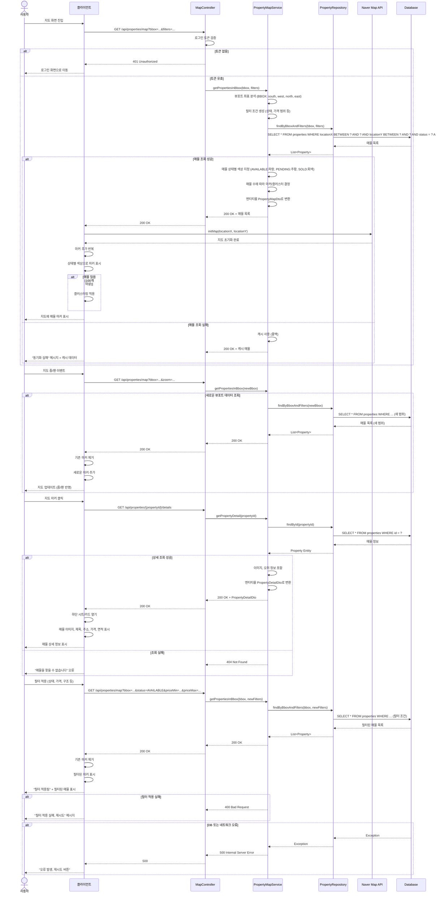
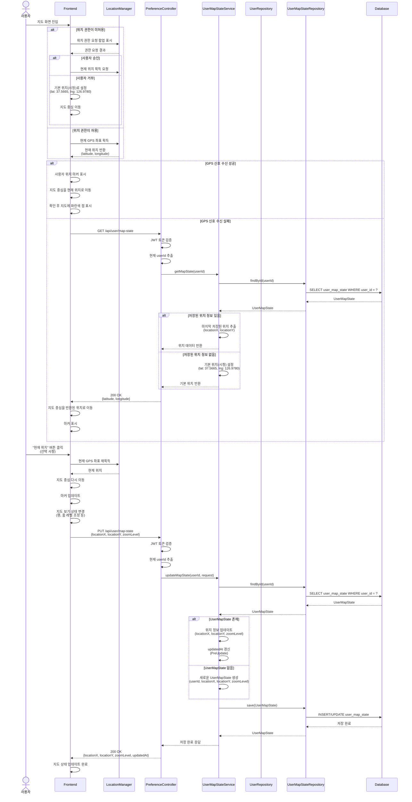
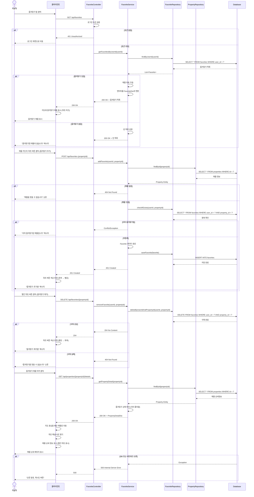
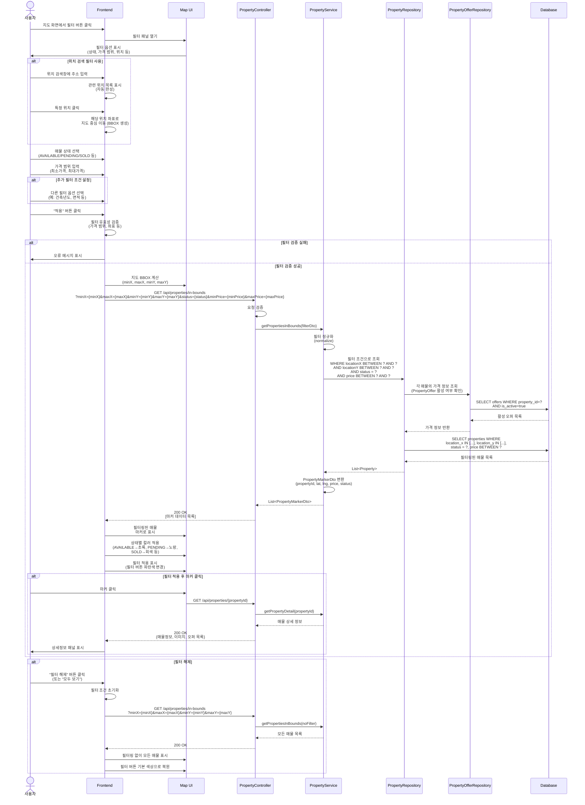
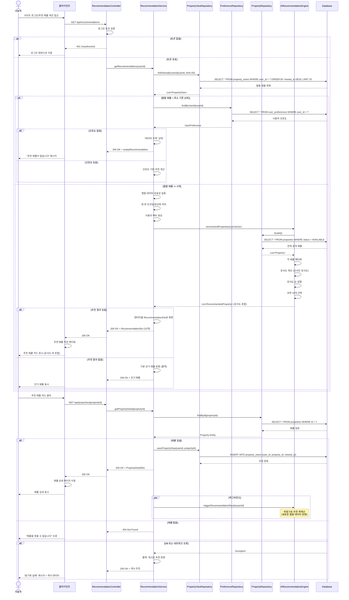

# 시스템 시퀀스 다이어그램 통합 보고서 (26, 27, 28+29, 30, 34번)

## 26번: 지도 기반 매물 조회 및 상세 정보 확인

26번 기능 설명: 지도 기반 매물 조회 및 상세 정보 확인 
사용자가 **클라이언트(UI)**를 통해 지도 화면에 진입하면, 클라이언트는 현재 지도의 영역($\text{BBOX}$)과 필터 조건을 포함하여 $\text{GET /api/properties/map}$ 요청을 MapController에게 전송합니다. MapController는 수신된 요청의 로그인 토큰을 검증하는 인증 절차를 거친 후, 실제 매물 조회를 PropertyMapService에게 위임합니다. Service는 $\text{BBOX}$와 필터 조건을 사용하여 **Database(DB)**에서 매물 목록을 조회합니다. DB에서 조회된 매물 데이터는 Service로 반환되며, Service는 이 데이터를 기반으로 매물 상태별 색상을 지정하고 매물 수에 따라 마커 또는 클러스터링을 결정하여 최종 표시 데이터를 준비합니다. 만약 초기 조회에 실패할 경우, 캐시 데이터가 폴백(Fallback) 정보로 사용됩니다. 최종적으로 준비된 매물 데이터는 MapController를 거쳐 **클라이언트(UI)**에 반환되어 지도 화면에 마커/클러스터 형태로 표시됩니다.이후 사용자가 지도를 줌(Zoom) 하거나 팬(Pan) 하여 **새로운 $\text{BBOX}$**가 생성되거나 필터 조건을 변경하면, **클라이언트(UI)**는 새로운 조건을 포함한 $\text{GET /api/properties/map}$ 요청을 MapController에 다시 전송하고, Service는 DB에 새로운 범위/조건에 맞는 매물 목록을 재조회하여 **클라이언트(UI)**에 반환합니다. **클라이언트(UI)**는 이 데이터를 받아 기존 마커를 제거하고 새로운 마커를 추가하여 지도 화면을 갱신합니다.만약 사용자가 지도상의 특정 매물 마커를 클릭하면, **클라이언트(UI)**는 해당 매물의 $\text{{propertyId}}$를 포함한 $\text{GET /api/properties/\{propertyId\}/details}$ 요청을 전송합니다. Service는 이 요청을 받아 DB에서 해당 $\text{ID}$의 매물 상세 정보(예: 이미지, 오퍼 정보 포함)를 조회합니다. 조회된 상세 정보는 **클라이언트(UI)**에 반환되며, **클라이언트(UI)**는 이 정보를 하단 시트 또는 카드 형태로 열어 사용자에게 최종적으로 표시합니다.
    
* * *
* * *

## 27번: 사용자 지도 상태(위치/줌 레벨) 관리

27번 기능 설명: 사용자 지도 상태(위치/줌 레벨) 관리 
사용자가 지도 화면에 진입할 때 **클라이언트(UI)**는 우선적으로 위치 권한을 확인합니다. 만약 위치 권한이 허용되면, 클라이언트는 LocationManager를 통해 현재 GPS 좌표를 획득하고 지도 중심을 이 위치로 이동시켜 지도를 초기화합니다. 하지만 GPS 획득에 실패하거나 위치 권한이 거부된 경우에는, **클라이언트(UI)**는 PreferenceController를 통해 $\text{GET /api/user/map-state}$ 요청을 UserMapStateService에 전송하여 마지막으로 저장된 지도 위치를 요청합니다. Service는 이 요청을 받아 **Database(DB)**에서 사용자 지도 상태 정보를 조회하며, 저장된 정보가 있다면 이를 **클라이언트(UI)**에 반환하여 지도를 초기화합니다. 만약 DB에 저장된 정보가 없다면, Service는 **기본 위치(예: 시청)**를 설정하여 **클라이언트(UI)**에 반환하고 이를 통해 지도를 초기 설정합니다.이후 사용자가 지도를 팬(Pan) 하거나 줌 레벨을 조정하여 지도 보기 상태를 변경하면, **클라이언트(UI)**는 변경된 위치 좌표와 줌 레벨을 포함하여 $\text{PUT /api/user/map-state}$ 요청을 Controller에 전송합니다. Controller는 이 요청을 Service에 위임하고, Service는 UserMapStateRepository를 통해 **Database(DB)**에서 해당 사용자의 기존 지도 상태를 찾습니다. 최종적으로 Service는 해당 상태 정보를 업데이트하거나, 정보가 없을 경우 새로운 상태를 생성하여 저장하는 과정을 거쳐 사용자의 변경된 지도 상태를 반영합니다.

* * *
* * *
## 28번+29번: 매물 정보 표시/즐겨찾기(찜) 기능

28번+29번: 기능 설명: 매물 즐겨찾기(찜) 기능 
로그인된 사용자가 **클라이언트(UI)**에서 즐겨찾기 탭에 접근하면, 클라이언트는 $\text{GET /api/favorites}$ 요청을 FavoriteController로 보냅니다. Controller는 이 요청을 FavoriteService에 위임하고, Service는 FavoriteRepository를 통해 **Database(DB)**에서 해당 사용자의 즐겨찾기 목록을 조회합니다. DB에서 조회된 목록이 **클라이언트(UI)**에 반환되면, 목록이 있을 경우 **클라이언트(UI)**는 지도상에 해당 매물을 하트 마크 마커로 표시하며, 목록이 없을 경우 사용자에게 "즐겨찾기한 매물이 없습니다"라는 메시지를 표시합니다.즐겨찾기 추가를 위해 사용자가 매물 카드에서 하트 버튼을 클릭하면, $\text{POST /api/favorites}$ 요청이 Controller를 거쳐 Service로 전달됩니다. Service는 요청을 처리하기 전 매물의 존재 여부와 해당 매물이 **이미 즐겨찾기에 등록되었는지 여부(중복 등록)**를 검사합니다. 중복이 아닐 경우, Service는 새로운 Favorite 엔티티를 생성하고 DB에 저장하며(응답: 201 Created), **클라이언트(UI)**는 성공 응답을 받아 하트 버튼의 색상을 변경하여 추가 상태를 반영합니다.반대로, 사용자가 이미 즐겨찾기된 하트 버튼을 다시 클릭하여 제거를 시도하면 $\text{DELETE /api/favorites/\{propertyId\}}$ 요청이 Controller를 거쳐 Service로 전달됩니다. Service는 DB에서 해당 레코드를 찾아 삭제를 수행하고(응답: 204 No Content), **클라이언트(UI)**는 삭제 응답을 받아 하트 버튼 색상을 원래대로 복원합니다.또한, 즐겨찾기된 매물 마커를 클릭하여 상세 정보를 확인하는 과정은 일반 매물과 동일하게 상세 정보 조회가 이루어집니다. 이 상세 정보 조회 과정 중에 Service는 해당 매물의 즐겨찾기 상태를 확인하여 상세 정보 데이터에 포함시켜 **클라이언트(UI)**에 전달하며, **클라이언트(UI)**는 전달받은 상태 정보를 바탕으로 상세 페이지 내의 하트 아이콘을 빨간색으로 표시하여 즐겨찾기 상태를 반영합니다.

* * *
* * *
## 30번 : 상세 필터링 및 매물 마커 표시

30번 기능 설명: 상세 필터링 및 매물 마커 표시 
사용자가 상세 필터 패널에서 위치 검색, 매물 상태, 가격 범위, 추가 조건 등 다양한 조건을 설정하면, **클라이언트(UI)**는 입력된 조건들의 유효성을 검증합니다. 유효성 검증이 성공적으로 완료되면, **클라이언트(UI)**는 **현재 지도의 $\text{BBOX}$**와 모든 상세 필터 조건을 포함한 $\text{GET /api/properties/in-bounds}$ 요청을 PropertyController로 전송합니다.PropertyController는 요청을 받아 PropertyService에 필터링 처리를 위임합니다. PropertyService는 전달받은 상세 필터 조건을 $\text{DB}$ 쿼리에 맞게 정규화합니다. 이후 PropertyRepository를 통해 **Database ($\text{DB}$)**에 접근하여 위치 좌표($\text{BBOX}$), 상태, 가격 범위 등 모든 정규화된 필터 조건을 사용하여 매물을 조회합니다. 이때 가격 범위 필터링을 위해 PropertyOfferRepository를 통해 활성 오퍼 가격 정보가 조건에 사용될 수 있습니다.Service는 필터링된 매물 목록을 받아 지도 마커 표시에 필요한 **최소 정보 (PropertyMarkerDto)**로 변환하여 Controller에 반환합니다. Controller는 이 데이터를 **클라이언트(UI)**에 전송하고, **클라이언트(UI)**는 반환된 마커 데이터를 **지도 컴포넌트 (MapComponent)**에 전달합니다. MapComponent는 매물 상태별 ($\text{AVAILABLE, PENDING, SOLD}$ 등)로 색상을 다르게 적용하여 최종적으로 지도에 마커를 표시하고 갱신합니다. 만약 사용자가 "필터 해제" 버튼을 누르면, **클라이언트(UI)**는 필터 조건을 초기화하고 현재 $\text{BBOX}$ 내의 모든 매물 목록을 다시 조회하여 지도에 표시합니다.

* * *
* * *

## 34번: 인공지능 기반 매물 추천 기능

34번 기능 설명: 인공지능 기반 매물 추천 기능 
 사용자가 **클라이언트(UI)**에 로그인한 후 추천 매물 섹션에 접근하면 $\text{GET /api/recommendations}$ 요청이 RecommendationController로 전송됩니다. Controller는 이 요청을 RecommendationService에 위임하고, Service는 PropertyViewRepository를 통해 **Database ($\text{DB}$)**에서 **사용자의 최근 열람 매물 이력(최대 20개)**을 조회합니다.Service는 조회된 열람 이력의 개수를 확인합니다. 만약 열람 매물이 최소 기준(5개) 미만일 경우, PreferenceRepository를 통해 사용자 선호도 정보를 조회하여 추천에 활용하거나, 데이터가 충분하지 않다는 폴백 메시지를 반환합니다. 반면, 열람 매물이 충분하다면 Service는 이 데이터를 바탕으로 사용자 벡터를 생성하여 AIRecommendationEngine에 전달합니다.AIRecommendationEngine은 전체 공개 매물 목록을 가져와 사용자 벡터와 **각 매물 벡터 간의 유사도(코사인 유사도)**를 계산하고, 유사도 순으로 정렬하여 상위 10개의 매물을 추천 목록으로 Service에 반환합니다. Service는 이 추천 목록을 Controller를 거쳐 **클라이언트(UI)**에 전달하며, **클라이언트(UI)**는 반환된 추천 매물 목록을 유사도 바와 함께 사용자에게 표시합니다.이후 사용자가 추천 매물을 클릭하여 $\text{GET /api/properties/\{propertyId\}}$ 요청으로 상세 페이지에 진입하면, Service는 상세 정보를 **클라이언트(UI)**에 반환하기 직전에 ViewRepository를 통해 해당 매물에 대한 새로운 열람 이력을 DB에 저장합니다. 이 열람 이력 저장이 완료된 후, Service는 백그라운드에서 AIRecommendationEngine에 추천 재계산을 비동기로 트리거하여, 다음번 추천 요청 시 최신 열람 데이터를 반영할 수 있도록 피드백 루프를 완성합니다.
