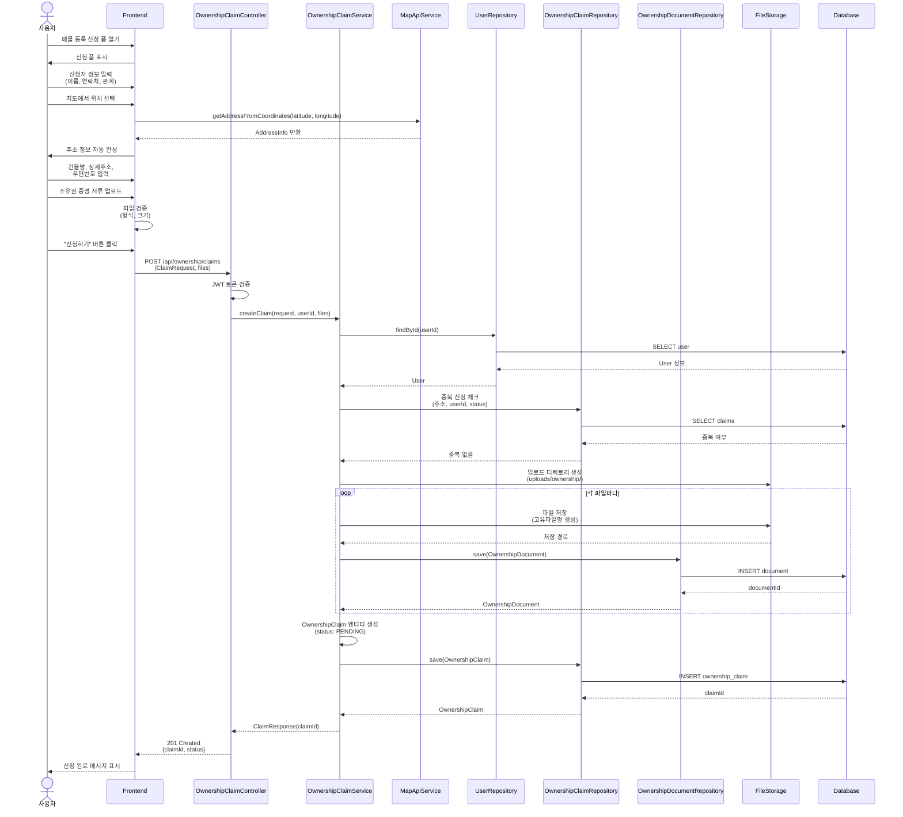
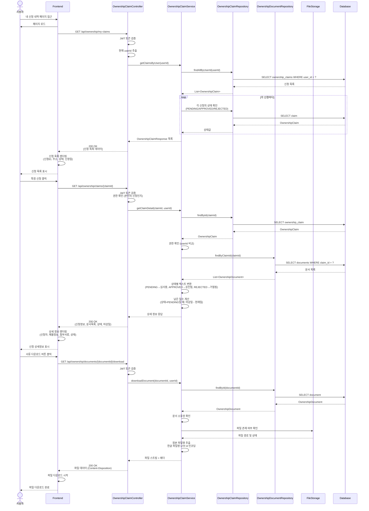
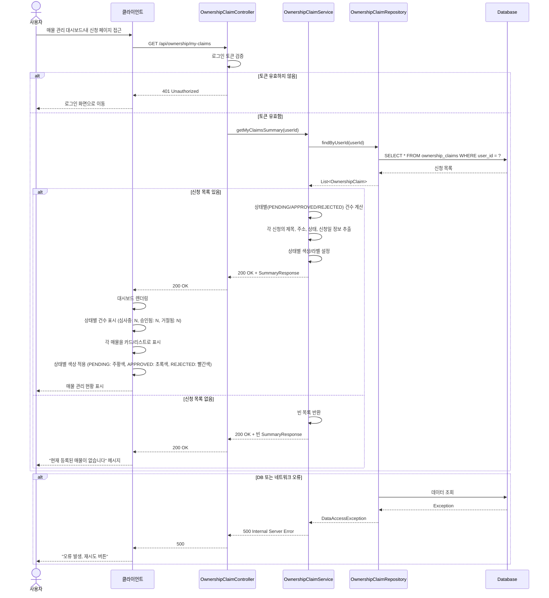
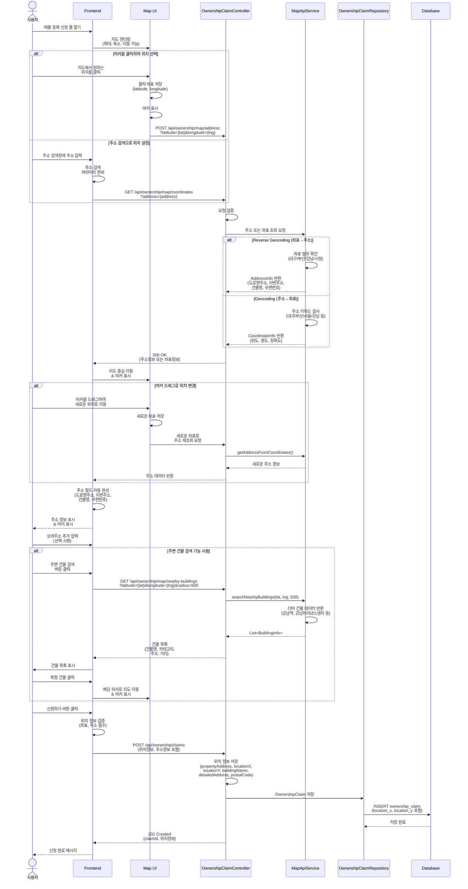
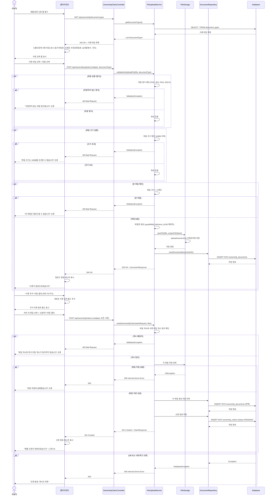
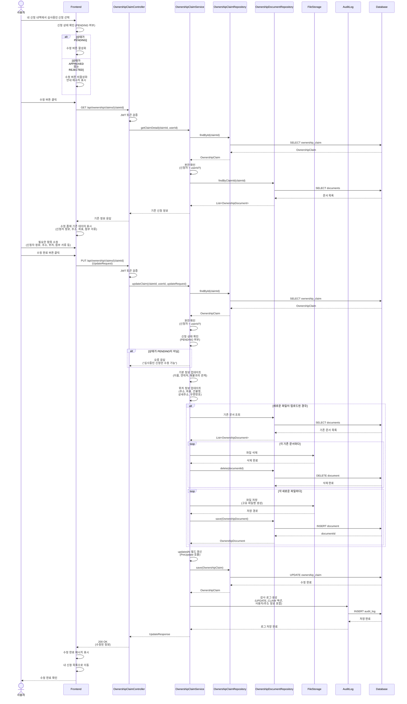
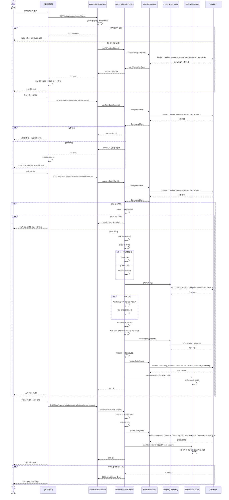
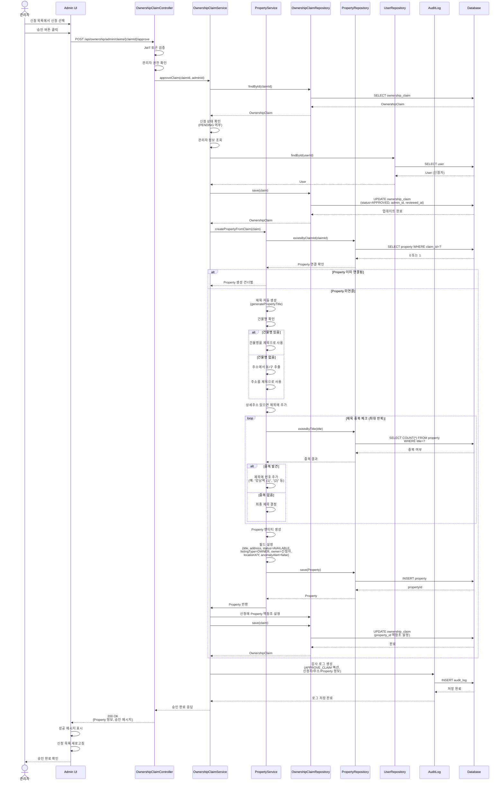

# 주원 1번

**설명**
소유자가 소유권을 증명하려고 화면에 진입하면 클라이언트는 먼저 소유권 신청 폼을 렌더링해 신청자 정보(이름, 연락처, 관계)와 위치를 입력하게 하고, 사용자가 지도에서 좌표를 찍으면 UI가 MapApiService의 getAddressFromCoordinates(latitude, longitude)를 호출해 사람이 읽을 수 있는 주소를 받아 자동 완성해 준 뒤 사용자가 건물명·상세주소·우편번호를 추가로 입력하고 소유권 증명 서류(등기부등본, 매매계약서, 위임장 등)를 업로드하면 프런트는 파일 형식·크기를 1차로 검증한 다음 사용자가 “신청하기”를 누르는 순간까지는 서버에 아무것도 저장하지 않다가 버튼 클릭 시 입력된 신청 데이터(ClaimRequest)와 업로드된 파일들을 multipart 형태로 묶어 POST /api/ownership/claims로 보낸다; 컨트롤러는 이 요청을 받자마자 헤더의 JWT를 검증해 실제 로그인된 사용자 ID를 확보하고, 검증에 실패하면 401/403을 바로 반환하지만 통과하면 OwnershipClaimService.createClaim(request, userId, files)를 호출해 비즈니스 로직으로 넘기며, 서비스는 첫 단계로 UserRepository.findById(userId)로 신청자가 실제 존재하는지 DB에서 확인하고 없으면 404를 던진다; 사용자가 존재하면 이제 “이 주소로 이미 처리 중인 신청이 있는가”를 막기 위해 OwnershipClaimRepository에서 주소·userId·상태(PENDING)를 조건으로 중복 신청을 검사해 동일한 주소에 아직 끝나지 않은(PENDING) 신청이 있으면 비즈니스 충돌로 보고 409 Conflict를 리턴해 사용자가 같은 주소를 여러 번 올리는 것을 차단한다; 중복이 없을 때에만 파일 저장을 진행하는데, 먼저 FileStorage에 uploads/ownership/ 같은 전용 디렉터리를 만들거나 준비시킨 뒤 업로드된 파일 목록을 한 개씩 돌면서 서버 내부용으로 충돌 없는 고유 파일명을 생성해 저장하고, 실제 저장 경로·원본명·MIME 타입 등을 OwnershipDocument 엔티티로 만들어 OwnershipDocumentRepository에 INSERT 해 문서마다 하나씩 DB에 기록해 둔다(이 부분이 다이어그램의 loop 각 파일마다에 해당한다); 모든 파일이 정상적으로 저장되면 이제서야 본 신청 엔티티인 OwnershipClaim을 조립하는데 여기에는 신청한 사용자, 주소·좌표·상세주소 정보, 방금 저장해 둔 증빙 문서들의 참조, 생성 시간, 그리고 가장 중요하게는 “아직 관리자가 승인하지 않았다”는 뜻의 상태값 status = PENDING이 들어가며 이 엔티티를 OwnershipClaimRepository.save(...)로 DB에 영속화하면 DB가 새 claimId를 발급해 주고, 서비스는 이 claimId와 현재 상태를 포함한 ClaimResponse를 컨트롤러에 넘긴다; 컨트롤러는 이를 받아 HTTP 201 Created와 {claimId, status: "PENDING"} 같은 JSON을 응답해 주고, 프런트는 이 결과를 받아 “소유권 신청이 접수되었습니다” 같은 토스트나 안내 문구를 띄우면서 화면의 상태를 “대기중”으로 바꾼다; 전체적으로 이 구조는 네가 위에서 예로 든 “브로커 위임 요청” 플로우와 거의 같아서 그쪽이 POST /delegations → 컨트롤러 인증 → 서비스에서 매물 존재 확인 → 소유자 일치성 확인 → PENDING 중복 위임 검사 → Delegation 엔티티 생성(status=PENDING) → 저장 → 201 반환으로 흘렀듯이, 여기서는 주소 기반 중복 검사와 파일 스토리지 단계가 추가돼 있을 뿐 패턴은 “UI가 입력 수집 → 컨트롤러가 인증 → 서비스가 존재성·중복성·상태를 검증 → 엔티티를 PENDING으로 저장 → 201과 식별자 반환”이라는 동일한 5단 구성이다.

# 주원 2번

**설명**
사용자가 내 소유권 신청 현황을 확인하려고 “내 신청 내역” 화면에 들어가면 프런트엔드는 먼저 페이지를 렌더링한 뒤 바로 서버에 GET /api/ownership/my-claims를 호출해 현재 로그인한 사용자가 올렸던 소유권 신청 목록을 가져온다; 컨트롤러는 이 요청을 받자마자 JWT 토큰을 검증해 유효한 로그인인지 확인하고, 토큰에서 현재 사용자 ID를 추출한 다음 OwnershipClaimService.getClaimsByUser(userId)를 호출한다; 서비스는 이 userId로 OwnershipClaimRepository.findAllByUserId(userId)를 실행해 DB에서 SELECT ownership_claims WHERE user_id = ?로 해당 사용자가 올린 모든 신청 레코드를 가져오고, 가져온 목록에 대해 필요하다면 각 신청의 최신 상태(PENDING/APPROVED/REJECTED)를 다시 한 번 확인하기 위해 루프를 돌며 리포지토리에서 개별 건을 조회해 상태값을 확정한다(다이어그램의 loop 각 신청마다 부분); 이렇게 정리된 신청 목록을 서비스가 컨트롤러로 돌려주면 컨트롤러는 200 OK와 함께 [신청ID, 주소, 상태, 신청일] 같은 요약 정보 배열을 응답하고, 프런트는 이걸 목록 형태로 렌더링해 사용자에게 보여준다; 사용자가 목록 중 하나를 눌러 상세를 보려고 하면 프런트는 해당 신청의 식별자를 가지고 GET /api/ownership/claims/{claimId}를 다시 서버에 보낸다; 컨트롤러는 또다시 JWT를 검증한 뒤 “이 신청이 정말 이 사용자 것이냐”를 확인하는 권한 체크를 하고, 통과하면 getClaimDetail(claimId, userId)를 서비스에 위임한다; 서비스는 먼저 OwnershipClaimRepository.findById(claimId)로 신청 본문을 DB에서 꺼내고, 꺼낸 엔티티의 userId와 현재 요청자의 userId가 같은지 비교해 본인 신청이 아닌 경우를 차단한다(여기서 다르면 403/404를 던질 수 있음); 본인 신청이 맞으면 이번에는 신청에 첨부돼 있던 서류들을 보여주기 위해 OwnershipDocumentRepository.findByClaimId(claimId)를 호출해 SELECT documents WHERE claim_id = ?로 문서 목록을 전부 가져오고, 이 문서들을 응답 DTO에 붙이기 전에 상태값을 사람이 읽기 쉬운 형태로 변환한다(예: PENDING → “심사중”, APPROVED → “승인됨”, REJECTED → “거절됨”); 또 PENDING 상태인 경우에는 “심사 예상 마감일” 같은 정보를 보여주기 위해 현재일과 마감일을 가지고 남은 일수를 계산해 둔다; 이렇게 조립된 상세 응답을 서비스가 컨트롤러에 돌려주면 컨트롤러는 200 OK와 함께 {신청정보, 문서목록, 상태(텍스트), 마감일/남은일수}를 반환하고, 프런트는 이를 신청자·주소/매물 정보·첨부 서류 리스트·현재 심사 상태로 나눠서 화면에 뿌린다; 이후 사용자가 “첨부 서류 다운로드”를 누르면 프런트는 그 문서의 식별자로 GET /api/ownership/documents/{documentId}/download를 호출하고, 컨트롤러는 다시 JWT를 검증한 뒤 downloadDocument(documentId, userId)를 서비스에 요청한다; 서비스는 먼저 DocRepo.findById(documentId)로 해당 문서를 DB에서 찾고(여기에는 어떤 신청에 속한 문서인지, 실제 저장 경로가 어디인지가 들어 있음), 그 문서가 속한 신청의 소유자가 지금 요청한 사용자와 같은지 확인해 문서 무단 열람을 막은 뒤, 실제 파일이 스토리지에 존재하는지 FileStorage에 묻는다; 스토리지에서 파일 경로와 상태를 돌려주면 서비스는 원본 파일명을 꺼내 한글 파일명이라도 깨지지 않도록 UTF-8로 인코딩한 Content-Disposition 헤더를 세팅해 컨트롤러로 돌려주고, 컨트롤러는 200 OK와 함께 실제 파일 스트림을 응답해준다; 프런트는 이 응답을 받아 곧바로 다운로드를 시작하고, 사용자에게 “파일 다운로드 완료”를 보여주면 전체 플로우가 끝난다.

# 주원 3번

**설명**
사용자가 매물 관리 대시보드(혹은 “내 신청” 페이지)에 들어오면 클라이언트는 먼저 로그인 여부를 신뢰하지 않고 항상 서버에 `GET /api/ownership/my-claims`를 쏴서 최신 소유권 신청 현황을 가져오려 하고, 컨트롤러는 이 요청을 받자마자 로그인 토큰(JWT)을 검증해 유효하지 않으면 즉시 401 Unauthorized를 돌려보내서 프런트가 로그인 화면으로 보내게 하며, 토큰이 유효한 경우에만 현재 사용자 ID를 꺼내 `OwnershipClaimService.getMyClaimsSummary(userId)`를 호출한다; 서비스는 이 사용자에 대해 어떤 소유권 신청이 있었는지 보려고 `OwnershipClaimRepository.findByUserId(userId)`를 호출하고, 리포지토리는 DB에 `SELECT * FROM ownership_claims WHERE user_id = ?`를 날려 이 사용자가 올렸던 모든 신청 행을 가져와 서비스로 넘긴다; 서비스는 반환된 목록이 비어 있지 않은 경우에만 대시보드에서 바로 쓸 수 있게 가공하는데, 먼저 상태별로(PENDING/APPROVED/REJECTED) 개수를 집계해 “심사중 몇 건, 승인됨 몇 건, 거절됨 몇 건”을 계산하고, 동시에 각 신청에서 화면에 보여줄 핵심 필드(제목/주소/상태/신청일)를 뽑아 리스트로 만들며, 상태값에 따라 뱃지나 카드에 적용할 색상/라벨 정보도 같이 붙여 SummaryResponse 형태로 컨트롤러에 돌려준다; 컨트롤러는 이걸 200 OK로 그대로 응답하고, 프런트는 응답에 담긴 “상태별 건수”를 대시보드 상단에 표시하고, 아래쪽에는 개별 신청을 카드/리스트로 뿌리면서 상태에 따라 PENDING은 주황, APPROVED는 초록, REJECTED는 빨강처럼 시각적으로 구분해 사용자가 한눈에 현재 소유권 신청 진행 상황을 볼 수 있게 만든다; 반대로 DB에서 이 사용자에 대한 신청이 한 건도 안 나왔을 경우 서비스는 비어 있는 SummaryResponse(건수 0, 목록 빈 배열)를 반환하고, 프런트는 같은 200 OK를 받더라도 “현재 등록된 매물이 없습니다”나 “신청 내역이 없습니다”라는 안내 문구만 보여준다; 이 전체 과정 중에 DB나 네트워크에서 예외가 터지면 리포지토리가 예외를 서비스로, 서비스가 다시 컨트롤러로 전파해 컨트롤러가 500 Internal Server Error를 반환하고, 프런트는 이때 “오류가 발생했습니다. 다시 시도해주세요.” 같은 메시지와 재시도 버튼을 노출해 사용자가 동일 요청을 다시 보낼 수 있게 한다.

# 주원 4번

**설명**
사용자가 매물 등록 신청 폼을 열면 프런트는 먼저 지도 컴포넌트(Map UI)를 렌더링해 확대·축소·이동이 가능한 지도를 보여주고, 사용자는 두 가지 방식 중 하나로 위치를 정한다: (1) **지도를 직접 찍는 방식**에서는 사용자가 지도에서 원하는 위치를 클릭하면 지도 컴포넌트가 그 좌표(lat, lng)를 내부에 저장하고 마커를 꽂은 뒤, 이 좌표로 역지오코딩을 하기 위해 백엔드 컨트롤러에 `POST /api/ownership/map/address?latitude={lat}&longitude={lng}`를 호출한다; (2) **주소 검색으로 찾는 방식**에서는 사용자가 주소 검색창에 “서울 강남구 …” 같은 텍스트를 넣으면 UI가 이걸 파라미터로 만들고 `GET /api/ownership/map/coordinates?address={address}`를 컨트롤러로 날린다; 컨트롤러는 두 경우 모두 요청이 유효한지 검증한 다음 MapApiService에 “좌표→주소” 또는 “주소→좌표” 중 필요한 쪽을 호출하고, 좌표→주소일 때는 주어진 위·경도가 지원 가능한 범위인지 확인한 뒤 도로명주소, 지번주소, 건물명, 우편번호가 들어 있는 AddressInfo를 돌려주고, 주소→좌표일 때는 주소 키워드(서울/부산/강남 등)를 검사해 위도·경도·정확도가 들어 있는 CoordinateInfo를 돌려준다; 컨트롤러는 받은 데이터를 200 OK와 함께 프런트로 보내고, 프런트는 지도 중심을 그 좌표로 이동시키면서 마커를 표시하고 동시에 주소 입력 필드(도로명, 지번, 건물명, 우편번호)를 자동 완성해 사용자에게 보여준다; 사용자가 마커를 다시 끌어서 위치를 조금 옮기면 지도 컴포넌트는 새 좌표를 저장하고 다시 컨트롤러에 좌표로 주소 재조회 요청을 보내고, 컨트롤러→MapService→컨트롤러로 돌아온 새 주소를 UI가 다시 자동 완성해 주는 식으로 “지도에서 찍은 위치 = 폼의 주소”가 계속 동기화된다; 여기에 더해 사용자가 주변 건물을 검색하고 싶을 때는 “주변 건물 검색” 버튼을 누르면 UI가 현재 좌표와 반경을 넣어 `GET /api/ownership/map/nearby-buildings?latitude={lat}&longitude={lng}&radius=500`을 호출하고, 컨트롤러는 MapService의 `searchNearbyBuildings`를 호출해 주변에 있는 건물 리스트(건물명, 카테고리, 주소, 거리)를 받아 200 OK로 돌려주며, 프런트는 이 목록을 띄워 사용자가 하나를 선택하면 그 건물 위치로 지도를 이동하고 마커를 다시 찍어준다; 이렇게 위치와 주소가 확정되면 사용자는 나머지 상세주소(동·호수 등)만 수동으로 보완 입력하고 “신청하기”를 누르는데, 이때 프런트는 좌표와 주소가 둘 다 있는지 마지막으로 검증한 뒤 위치정보·주소정보를 포함해 `POST /api/ownership/claims`를 보낸다; 컨트롤러는 요청을 받으면 폼에서 넘어온 locationX/locationY(위도·경도), propertyAddress(도로명/지번), buildingName, detailedAddress, postalCode를 서버 쪽 DTO/엔티티에 매핑해 실제 OwnershipClaim에 위치 정보를 같이 저장하도록 하고, 리포지토리를 통해 DB에 `INSERT ownership_claim (location_x, location_y, ...)`를 날려 기록하며, 저장이 끝나면 201 Created와 함께 `{claimId, 위치정보}`를 응답해 주고, 프런트는 “신청이 완료되었습니다” 메시지를 보여주면서 지도에 찍혀 있던 위치와 사용자가 입력한 주소가 실제로 서버에도 저장됐다는 걸 확인시켜 준다.

# 주원 5번

**설명**
사용자가 매물 등록 신청 폼을 열면 클라이언트는 먼저 “이 폼에서 어떤 종류의 서류를 받아야 하는지”를 알아내기 위해 `GET /api/ownership/document-types`를 호출하고, 컨트롤러는 이를 받아 `getDocumentTypes()`를 서비스에 넘기며 서비스는 DB에서 `SELECT * FROM document_types`로 등기부등본, 신분증, 주민등록등본, 납세증명서, 기타 같은 서류 타입 목록을 읽어와 컨트롤러에 돌려주고 컨트롤러는 200 OK로 이를 프런트에 내려보내므로 UI는 드롭다운에 서류 종류를 뿌려 사용자가 어떤 문서인지 먼저 고르게 만든다; 사용자가 “서류 타입 + 실제 파일”을 선택하면 프런트는 그걸 멀티파트로 묶어서 `POST /api/ownership/upload`를 보내고, 컨트롤러는 `validateAndUploadFile(file, documentType)`을 호출해 서비스에 검증을 맡기는데 서비스는 ① 파일 확장자가 허용된 형식(PDF, JPG, PNG, DOCX 등)인지 확인하고 아니면 ValidationException을 던져 컨트롤러가 400과 “지원하지 않는 파일 형식입니다”를 보내게 하고 ② 크기가 정책 한도(예: 10MB) 이하인지 확인해 넘으면 같은 식으로 400과 “파일 크기는 10MB를 초과할 수 없습니다”를 돌려보내고 ③ 파일이 비어 있지(0byte) 않은지도 확인해 비어 있으면 “빈 파일은 업로드할 수 없습니다”로 거절한다; 이 3단계 검증을 모두 통과한 파일만 실제 업로드가 진행되는데, 서비스는 `yyyyMMdd_HHmmss_UUID.확장자` 같은 충돌 없는 고유 파일명을 생성해 `FileStorage.saveFile(...)`로 `uploads/ownership/` 디렉터리에 저장시키고, 저장이 끝나면 이 파일이 어떤 타입(documentType)으로 어떤 사용자가 올린 것인지 등을 담아 DocumentRepository에 INSERT 해 문서 메타데이터를 DB에도 남긴다; 그 후 서비스는 업로드된 문서의 ID·원본명·파일경로가 담긴 DocumentResponse를 컨트롤러에 주고, 컨트롤러는 200 OK를 프런트에 내려보내므로 UI는 “서류가 업로드되었습니다”라고 사용자에게 알리고 필요하면 “서류 추가” 버튼을 누를 수 있게 새 입력 필드를 더해 준다; 사용자가 이렇게 여러 개 서류를 올린 다음 실제 신청을 마치기 위해 “신청하기”를 누르면 프런트는 지금까지 선택된 모든 파일과 그 파일들에 대응하는 서류 타입을 한 번에 묶어 `POST /api/ownership/claims`로 보낸다; 컨트롤러는 이를 `createOwnershipClaim(claimRequest, files)`로 서비스에 넘기고, 서비스는 먼저 “파일 개수 == 문서 타입 개수”인지 검증해 안 맞으면 ValidationException을 던져 400과 “파일 개수와 문서 타입 개수가 일치하지 않습니다”를 돌려보내 데이터 짝이 안 맞는 상태로는 신청이 저장되지 않게 막는다; 개수가 맞으면 각 파일을 다시 한 번 저장 루프로 돌면서 스토리지에 넣고(여기서 IOException이 나면 바로 500 “파일 저장에 실패했습니다”로 응답) 성공한 파일마다 DocumentRepository에 INSERT를 반복해 ownership_documents에 기록한 후, 마지막에야 비로소 본 신청(ownership_claims)을 `status = PENDING`으로 INSERT 해 전체 신청을 완성하고 컨트롤러는 201 Created와 ClaimResponse(신청 ID 포함)를 반환하며, 프런트는 이를 받아 “매물 신청이 완료되었습니다”와 신청 ID를 사용자에게 보여준다; 이 과정 어느 단계에서든 DB나 네트워크 예외가 발생하면 예외가 서비스→컨트롤러로 전파되고 컨트롤러는 500을 내려보내며 UI는 “오류 발생, 재시도” 버튼을 보여줘 사용자가 다시 업로드/신청을 시도할 수 있게 한다.

# 주원 6번

**설명**
사용자가 “내 신청 내역”에서 아직 심사 중인(PENDING) 신청을 하나 고르면 프런트는 먼저 그 신청의 상태를 확인해 PENDING이면 수정 버튼을 활성화하고 이미 APPROVED나 REJECTED로 끝난 건이면 수정 버튼을 비활성화하면서 “심사 완료된 신청은 수정할 수 없습니다” 같은 안내를 띄운다; 사용자가 수정 버튼을 누르면 프런트는 해당 신청을 다시 불러오기 위해 `GET /api/ownership/claims/{claimId}`를 호출하고, 컨트롤러는 JWT를 검증한 뒤 `getClaimDetail(claimId, userId)`를 서비스에 넘긴다; 서비스는 먼저 `OwnershipClaimRepository.findById(claimId)`로 신청 본문을 가져오고, 가져온 신청의 소유자와 현재 요청자의 userId를 비교해 본인 신청이 아닌 경우를 차단한 다음, 이어서 `OwnershipDocumentRepository.findByClaimId(claimId)`로 이 신청에 붙어 있던 기존 첨부 서류 목록을 전부 읽어와 컨트롤러에 돌려주므로 컨트롤러는 이걸 200 OK로 프런트에 내려보내고 프런트는 수정 폼에 “기존 신청자 정보, 주소/좌표, 첨부 서류 리스트”를 그대로 채워 넣어 사용자가 어느 부분을 바꿀지 선택하게 한다; 사용자가 이름·연락처·매물과의 관계·주소·좌표를 바꾸거나 새로 서류를 교체한 후 “수정 완료”를 누르면 프런트는 바뀐 값들만 포함한 UpdateRequest를 가지고 `PUT /api/ownership/claims/{claimId}`를 호출하고, 컨트롤러는 다시 JWT를 검증한 뒤 `updateClaim(claimId, userId, updateRequest)`를 서비스에 위임한다; 서비스는 다시 한 번 해당 신청을 `findById`로 로드해 온 다음 ① 이 신청이 정말 이 사용자의 것인지(권한 확인) ② 이 신청의 현재 상태가 PENDING인지(상태 확인)를 순서대로 검사해 PENDING이 아니면 “심사중인 신청만 수정 가능”이라는 에러를 돌려보내고 처리를 중단한다; PENDING이면 실제 업데이트를 시작하는데, 먼저 신청자의 기본 정보(이름, 연락처, 관계)를 요청값으로 덮어쓰고, 위치 정보(주소, 좌표, 건물명, 상세주소, 우편번호)도 새로 들어온 값으로 갱신한다; 그리고 요청에 새 파일이 포함돼 있으면 기존에 이 신청에 묶여 있던 문서들을 전부 `DocRepo`로 조회해 하나씩 스토리지에서 지우고(DB에서도 DELETE) 그다음 새로 올라온 파일들을 반복문으로 저장해 고유 파일명을 만들어 스토리지에 넣은 뒤 각각을 OwnershipDocument로 DB에 INSERT 한다; 모든 필드가 갱신되면 서비스는 `updatedAt` 같은 갱신 시각을 현재 시각으로 다시 세팅해 변경 이력을 남기고, 최종적으로 `OwnershipClaimRepository.save(...)`로 UPDATE를 날려 수정된 신청을 DB에 반영한다; 수정이 성공하면 누가 어떤 신청을 어떤 시점에 고쳤는지를 남기기 위해 `AuditLog`에 UPDATE_CLAIM 액션을 INSERT 해 두고, 그 후에야 서비스가 컨트롤러로 UpdateResponse를 돌려보내며, 컨트롤러는 200 OK와 수정된 정보를 프런트에 주고 프런트는 “수정이 완료되었습니다” 메시지를 띄운 뒤 목록 화면을 다시 로드해 방금 수정된 신청이 갱신된 상태로 보이게 한다.

# 주원 7번

**설명**
관리자가 관리자 페이지에 접속하면 화면은 먼저 관리자가 처리해야 할 소유권 신청이 있는지 알기 위해 `GET /api/ownership/admin/claims`를 호출하고, 컨트롤러는 이 요청이 진짜 관리자인지부터 확인해 `role=admin`이 아니면 곧바로 403 Forbidden을 내려 “관리자 권한이 필요합니다”를 표시하게 하고, 관리자 권한이 맞으면 서비스를 호출해 `getAllPendingClaims()`를 수행한다; 서비스는 `ClaimRepository.findByStatus(PENDING)`으로 DB에 `SELECT * FROM ownership_claims WHERE status = PENDING`을 날려 아직 심사되지 않은 신청 목록을 전부 가져와 컨트롤러에 넘기고, 컨트롤러는 200 OK로 이 목록을 반환하므로 관리자 화면은 “신청자, 주소, 신청일” 정도가 들어 있는 리스트를 렌더링한다; 관리자가 이 목록 중 하나를 눌러 세부 내용을 보려고 하면 화면은 `GET /api/ownership/admin/claims/{claimId}`를 호출하고, 컨트롤러는 서비스를 통해 `ClaimRepo.findById(claimId)`로 해당 신청을 DB에서 꺼내는데 없으면 404 Not Found로 “신청을 찾을 수 없습니다”를 보여주고, 있으면 신청자 정보(누가 올렸는지), 매물 정보(주소/좌표/건물명), 첨부 서류 목록 등을 담아 200 OK로 내려준다; 관리자가 이걸 검토해 “승인”을 누르면 화면은 `POST /api/ownership/admin/claims/{claimId}/approve`를 보내고, 컨트롤러는 서비스를 호출해 `approveClaim(claimId)`를 수행하게 하는데 서비스는 먼저 다시 한 번 그 신청을 `findById`로 읽어온 다음 현재 상태가 정말 PENDING인지 확인해 이미 APPROVED나 REJECTED 등으로 끝난 건이면 InvalidStateException을 던져 “심사중인 신청만 승인 가능”이라는 에러를 관리자에게 보여준다; 상태가 올바른 PENDING이라면 이제 이 소유권 신청을 실제 매물로 전환하는 작업을 하는데, 우선 매물 제목을 자동으로 만들기 위해 신청에 건물명이 있는지 보고 있으면 그걸 쓰고, 없으면 주소에서 동/구 같은 핵심 위치명을 뽑아 제목으로 쓴 뒤, 이 제목이 이미 존재하는지 `PropertyRepository`에 물어 중복이면 “(1)”, “(2)”처럼 번호를 붙이는 식으로 중복이 안 날 때까지 조정한다; 이렇게 만든 데이터를 기반으로 Property 엔티티를 생성해 소유자(신청자), 주소, 상태(AVAILABLE)를 세팅하고 `PropertyRepo.saveProperty(...)`로 DB에 INSERT 한다; 매물이 성공적으로 만들어지면 이제 원래 신청의 상태를 APPROVED로 바꾸고 `reviewed_at = NOW()`를 찍은 뒤 `ClaimRepo.updateClaim(...)`으로 DB에 업데이트하며, 동시에 `NotificationService`를 호출해 신청을 올린 사용자에게 “소유권 신청이 승인되었습니다”라는 알림을 보낸다; 모든 게 정상 처리되면 서비스는 200 OK를 컨트롤러로 돌려주고, 화면은 관리자에게 “승인 완료” 메시지를 보여준다; 반대로 관리자가 내용을 보고 승인할 수 없다고 판단하면 거절 사유를 적은 뒤 `POST /api/ownership/admin/claims/{claimId}/reject`를 보내고, 컨트롤러는 `rejectClaim(claimId, reason)`을 서비스로 넘기며 서비스는 그 신청의 상태를 REJECTED로 바꾸고 거절 사유를 신청 레코드에 함께 저장한 다음 `reviewed_at = NOW()`로 심사 시점을 찍고 DB에 UPDATE 한다; 이후 NotificationService를 통해 사용자에게 “거절되었습니다: {사유}” 알림을 보내고 컨트롤러는 200 OK를 반환하며, 관리자 화면은 “거절 완료”를 노출한다; 이 일련의 단계 도중 DB나 네트워크 예외가 발생하면 서비스는 500 Internal Server Error를 컨트롤러에 던지고, 화면은 관리자에게 “오류가 발생했습니다. 다시 시도하세요.” 같은 리트라이 UI를 보여준다.

# 주원 8번

**설명**
관리자가 관리자 UI에서 특정 소유권 신청을 선택하고 “승인”을 누르면 프런트는 `POST /api/ownership/admin/claims/{claimId}/approve`를 백엔드로 보낸다; 컨트롤러는 이 요청을 받으면 먼저 JWT가 유효한지 확인하고, 이어서 이 사용자가 진짜 관리자(role=admin)인지 검사해 아니면 403을 돌려보내 승인 기능을 막고, 관리자라면 `OwnershipClaimService.approveClaim(claimId, adminId)`를 호출해 실제 승인 로직으로 넘긴다; 서비스는 가장 먼저 `OwnershipClaimRepository.findById(claimId)`로 승인하려는 신청을 DB에서 읽어오고, 가져온 신청의 상태가 PENDING인지 확인해 이미 APPROVED/REJECTED 등으로 처리된 건이면 여기서 상태 오류로 끝낸다; 상태가 올바른 경우 이제 이 신청을 승인 처리하기 위해 당시 신청을 올린 사용자 정보가 필요하므로 `UserRepository.findById(userId)`로 신청자(User)를 다시 조회하고, 조회된 사용자와 신청을 묶은 상태로 신청 엔티티의 상태를 APPROVED로 바꾸고 어떤 관리자가 언제 승인했는지를 남기기 위해 `admin_id`와 `reviewed_at`을 세팅한 뒤 `ClaimRepo.save(claim)`으로 DB에 UPDATE 한다; 그 다음 단계가 핵심인데, 이 승인된 소유권 신청을 진짜 “매물”로 시스템에 올려야 하므로 서비스는 `PropertyService.createPropertyFromClaim(claim)`을 호출해 매물 생성으로 위임한다; PropertyService는 먼저 같은 신청에 대해 이미 매물이 만들어진 적이 있는지 `PropertyRepo.existsByClaimId(claimId)`로 확인하고, 이미 연결된 매물이 있으면 “이 신청으로부터의 매물 생성”은 건너뛰고 다시 서비스로 돌아간다; 연결된 매물이 없을 때만 실제 매물을 만든다: 우선 제목을 자동으로 만들기 위해 신청에 건물명이 있는지 보고 있으면 그걸 그대로 제목으로 쓰고, 없으면 주소에서 동/구 등을 뽑아 제목으로 삼고, 상세주소가 있으면 뒤에 덧붙인다; 이렇게 1차 제목을 만든 뒤에는 중복 매물명이 있는지 확인하기 위해 루프를 돌며 `PropertyRepo.existsByTitle(title)`을 호출하고, DB에서 같은 제목이 있으면 “(1)”, “(2)”처럼 번호를 붙여가며 없는 제목이 나올 때까지 반복해서 최종 제목을 확정한다; 제목이 확정되면 이제 Property 엔티티를 구성하는데 여기에는 제목(title), 주소(address), 매물 상태(status=AVAILABLE), 등록 유형(listingType=OWNER), 소유자=신청자, 위치 좌표(locationX/Y), 이상 감지 플래그(anomalyAlert=false) 등이 들어가고, 이 엔티티를 `PropertyRepo.save(...)`로 INSERT 해 실제 매물로 만든다; 매물이 생성되면 그 매물이 어떤 소유권 신청에서 파생된 것인지 역으로 알 수 있도록 원래 신청 레코드에 `property_id`를 다시 UPDATE 해 두어 양방향/역참조가 되게 하고, 이 승인 작업 전체가 누가 언제 무엇을 승인했는지 감사 추적이 가능하도록 `AuditLog`에 `APPROVE_CLAIM` 액션과 함께 신청자, 주소, 생성된 property 정보, 처리 관리자 정보를 INSERT 해 둔다; 모든 게 정상 처리되면 서비스는 컨트롤러에 “승인 완료” 응답과 함께 방금 생성된 Property 정보까지 넘기고, 컨트롤러는 200 OK로 이를 관리자 UI에 돌려주며, UI는 “승인이 완료되었습니다” 메시지를 보여주고 목록을 새로고침해 방금까지 PENDING이던 신청이 APPROVED로 바뀐 걸 관리자에게 보여준다.
