# 1. 사용자 인증 상태 machine

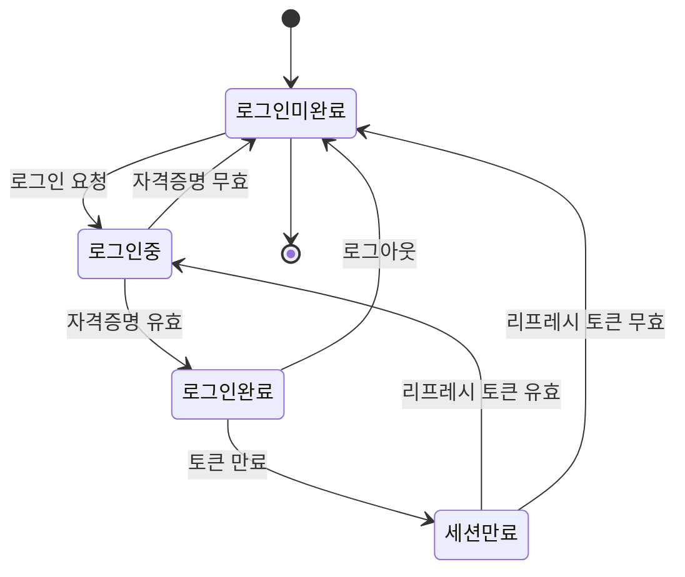
이 코드는 사용자 로그인 및 세션 관리의 전체 생명주기를 나타내는 상태 머신이다. 
사용자는 초기에 로그인미완료 상태에서 시작하며, 로그인 요청을 통해 로그인중 상태로 전환된다. 
로그인 과정에서 자격증명이 유효하면 로그인완료 상태에 도달하고, 유효하지 않으면 다시 로그인미완료 상태로 돌아간다. 
로그인이 완료된 사용자의 토큰이 만료되면 세션만료 상태로 변경되는데, 이 상태에서 리프레시 토큰이 유효하면 다시 로그인중 상태로 돌아가 재인증 절차를 거치게 된다. 
만약 리프레시 토큰마저 무효하면 로그인미완료 상태로 완전히 돌아가게 된다. 
또한 사용자가 명시적으로 로그아웃을 선택하면 로그인완료에서 바로 로그인미완료 상태로 전환되며, 최종적으로 시스템을 떠날 때는 로그인미완료 상태에서 종료된다.

# 2. 매물 소유권 신청 상태 machine

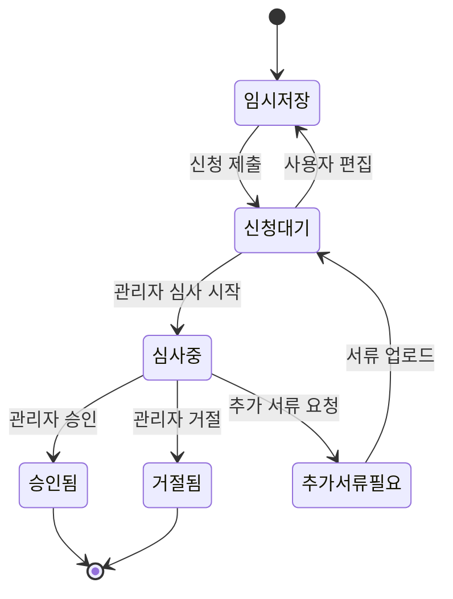
이 코드는 매물 소유권을 신청하고 승인받는 전체 과정을 나타내는 상태 머신이다. 
사용자는 초기 상태인 임시저장에서 신청 제출 액션을 통해 신청대기 상태로 전환된다. 
임시저장 상태에서는 사용자가 언제든지 작성 중인 정보를 수정할 수 있어 유연성을 제공하며, 신청대기 상태에서는 관리자의 심사를 기다린다. 
관리자가 심사를 시작하면 심사중 상태로 진입하게 되며, 이 단계에서 세 가지 결과가 나올 수 있다. 
첫째, 승인이 되면 승인됨 상태에 도달해 프로세스가 종료되고, 둘째, 거절되면 거절됨 상태에 이르러 프로세스가 종료된다. 
셋째, 추가 서류가 필요하다고 판단되면 추가서류필요 상태로 변경되며, 사용자가 서류를 업로드하면 다시 신청대기 상태로 돌아가 관리자의 재심사 기회를 갖게 된다. 

# 3. 매물 상태 machine

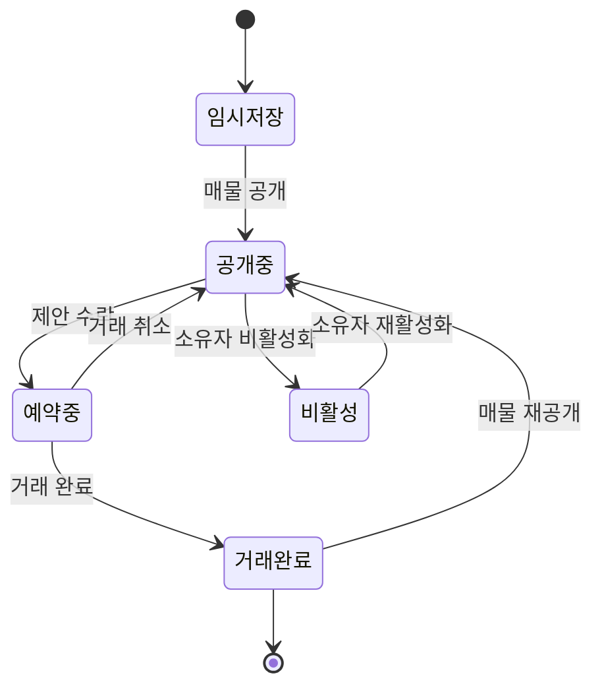
이 코드는 부동산 매물의 전체 생명주기를 나타내는 상태 머신이다. 
매물은 초기 상태인 임시저장에서 시작하여 소유자가 매물 공개를 선택하면 공개중 상태로 전환된다. 
공개중 상태에서는 잠재 구매자로부터 제안을 받을 수 있으며, 제안이 수락되면 예약중 상태로 이행되어 거래가 진행 중임을 나타낸다. 
예약중 상태에서는 거래가 최종적으로 완료되면 거래완료 상태에 도달하고, 만약 거래가 취소되면 다시 공개중 상태로 돌아가 새로운 구매자를 찾는 과정이 반복된다. 
한편 공개중 상태에 있는 매물이 소유자에 의해 비활성화되면 비활성 상태로 변경되며, 나중에 필요시 재활성화 액션을 통해 다시 공개중 상태로 복귀할 수 있다. 
거래완료 상태에 도달한 매물도 소유자가 매물 재공개를 선택하면 공개중 상태로 돌아가 다시 시장에 나올 수 있으며, 최종적으로 더 이상 관리할 필요가 없으면 시스템에서 제거된다.

# 4. 매물 제안 상태 machine

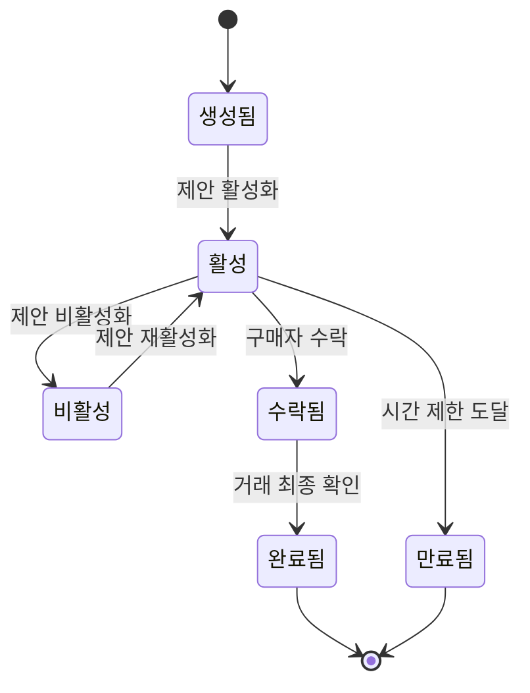
이 코드는 부동산 거래 시 구매자가 제시하는 제안의 생명주기를 나타내는 상태 머신이다. 
제안은 초기 상태인 생성됨에서 시작하며, 판매자가 이를 활성화하면 활성 상태로 전환되어 구매자의 응답을 기다릴 수 있게 된다. 
활성 상태에 있는 제안은 판매자에 의해 비활성화될 수 있으며, 비활성 상태에서 다시 필요하면 재활성화 액션을 통해 활성 상태로 돌아갈 수 있다. 
활성 상태에서 구매자가 제안을 수락하면 수락됨 상태로 진행되고, 이후 거래의 최종 확인 단계를 거치면 완료됨 상태에 도달하여 프로세스가 종료된다. 
한편 활성 상태에서 미리 설정한 시간 제한에 도달하면 자동으로 만료됨 상태로 변경되어 더 이상의 응답이 불가능해진다. 

# 5. 채팅방 상태 machine

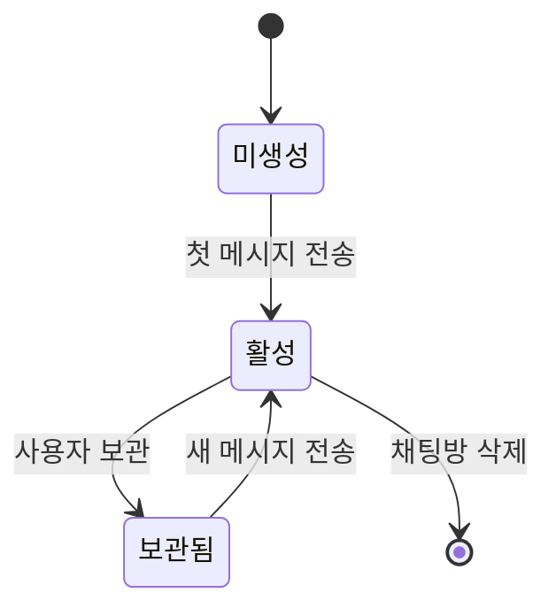
이 코드는 두 사용자 간의 채팅방 생명주기를 나타내는 상태 머신이다.
채팅방은 초기 상태인 미생성에서 첫 메시지가 전송되는 순간 활성 상태로 전환되며, 이로써 두 사용자 간의 실질적인 대화가 시작된다. 
활성 상태에서 사용자가 채팅방을 보관하기로 선택하면 보관됨 상태로 변경되는데, 이는 채팅방을 목록에서 숨기면서도 메시지 기록은 유지하도록 설계되었다. 
보관됨 상태에 있는 채팅방도 새로운 메시지가 전송되면 자동으로 다시 활성 상태로 복귀하여 사용자에게 보이게 되며, 이를 통해 중요한 대화를 놓치지 않도록 한다. 
활성 상태에서 사용자가 채팅방 삭제를 선택하면 채팅방은 완전히 제거되어 시스템에서 종료된다.

# 6. 채팅 메시지 상태 machine

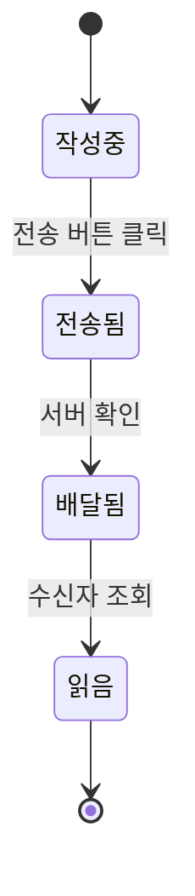
이 코드는 메시지가 발송자에서 수신자에 이르는 전체 전달 과정을 나타내는 상태 머신이다. 
메시지는 초기 상태인 작성중에서 사용자가 전송 버튼을 클릭하는 순간 전송됨 상태로 전환되며, 이때 메시지가 서버로 전달되기 시작한다. 
전송됨 상태에서 서버가 메시지 수신을 확인하면 배달됨 상태로 진행되어 메시지가 수신자의 기기에 도착했음을 나타낸다. 
배달됨 상태에 있는 메시지가 수신자에 의해 조회되면 읽음 상태로 변경되며, 이를 통해 발송자는 상대방이 자신의 메시지를 읽었는지 확인할 수 있다. 
최종적으로 읽음 상태에 도달한 메시지는 시스템에서 완전히 처리되어 종료된다. 

# 7. 중개사 프로필 상태 machine

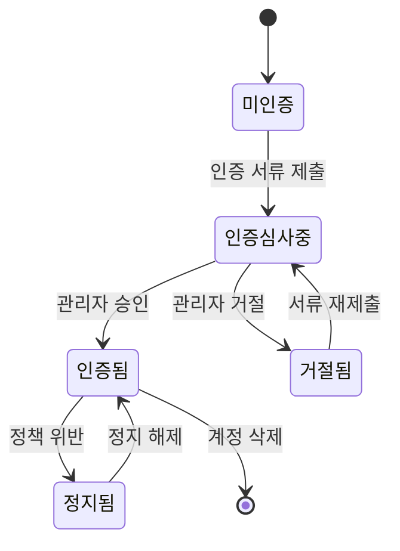
이 코드는 중개사 계정의 인증 및 관리 프로세스를 나타내는 상태 머신이다. 
중개사는 초기 상태인 미인증에서 시작하며, 인증 서류를 제출하면 인증심사중 상태로 진입하여 관리자의 검토를 기다린다. 
인증심사중 상태에서 관리자가 제출된 서류를 승인하면 인증됨 상태에 도달하여 정상적인 중개 활동을 시작할 수 있게 된다. 
반대로 관리자가 서류를 거절하면 거절됨 상태로 변경되는데, 이 상태에서 중개사는 서류를 재제출하여 다시 인증심사중 상태로 돌아가 재심사 기회를 얻을 수 있다. 
인증됨 상태에 있는 중개사가 플랫폼 정책을 위반하면 정지됨 상태로 전환되며, 이후 정지가 해제되면 다시 인증됨 상태로 복구된다. 
마지막으로 인증된 중개사가 계정 삭제를 선택하면 시스템에서 완전히 제거된다.

# 8. 매물 즐겨찾기 상태 machine

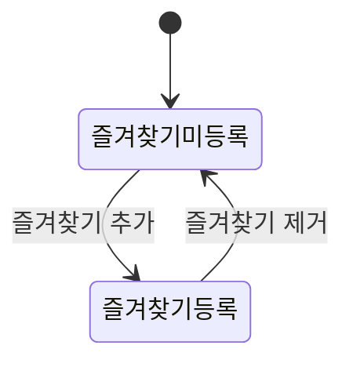
이 코드는 사용자가 마음에 드는 매물을 관리하는 즐겨찾기 기능의 상태 머신이다. 
모든 매물은 초기 상태인 즐겨찾기미등록에서 시작하며, 사용자가 즐겨찾기 추가 액션을 수행하면 즐겨찾기등록 상태로 전환되어 사용자의 관심 매물 목록에 포함된다. 
즐겨찾기등록 상태에 있는 매물은 사용자가 언제든지 즐겨찾기 제거 액션을 선택하면 다시 즐겨찾기미등록 상태로 되돌아간다.

# 9. 사용자 회원가입 상태 machine

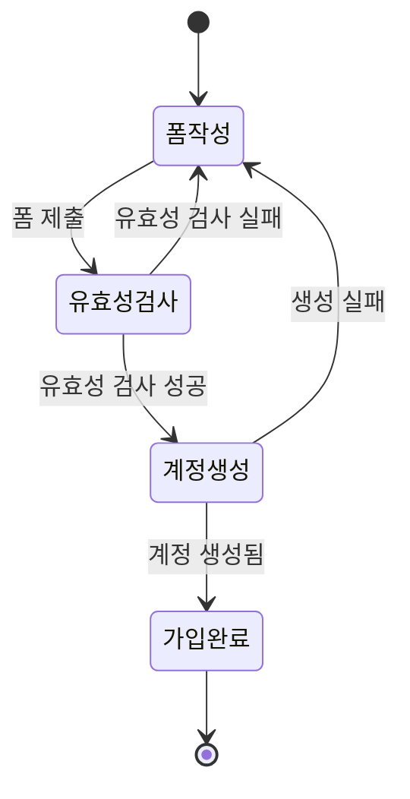
이 코드는 사용자의 회원가입 프로세스 전체를 나타내는 상태 머신이다. 
신규 사용자는 초기 상태인 폼작성에서 회원가입 양식을 작성하며, 폼 제출 액션을 수행하면 유효성검사 상태로 전환된다. 
유효성검사 상태에서 입력된 데이터가 형식이나 규칙에 맞지 않으면 검사 실패 메시지와 함께 폼작성 상태로 다시 돌아가 사용자가 정보를 수정할 수 있도록 한다. 
반대로 유효성 검사에 성공하면 계정생성 상태로 진행되어 데이터베이스에 새로운 계정이 생성되기 시작한다. 
계정생성 상태에서 모든 절차가 성공적으로 완료되면 가입완료 상태에 도달하여 회원가입이 최종 확정되고 사용자는 로그인할 수 있게 된다.

# 10. 비밀번호 재설정 상태 machine

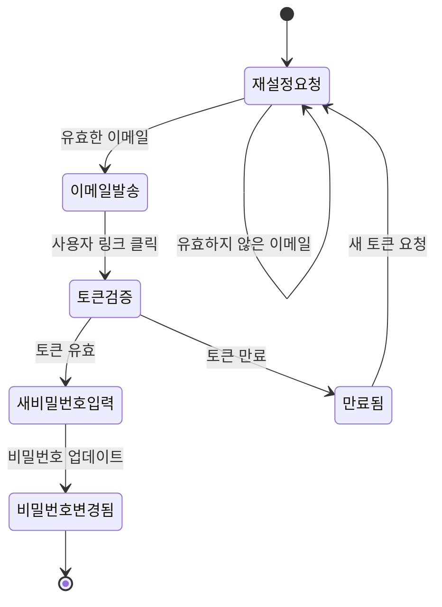
이 코드는 사용자의 비밀번호 재설정 프로세스 전체를 나타내는 상태 머신이다. 
사용자는 초기 상태인 재설정요청에서 계정에 등록된 이메일을 입력하며, 유효한 이메일이 확인되면 이메일발송 상태로 진행되어 비밀번호 재설정 링크가 포함된 이메일이 전송된다. 
만약 입력한 이메일이 시스템에 존재하지 않거나 유효하지 않으면 재설정요청 상태에 머물러 사용자가 올바른 이메일을 다시 입력할 기회를 갖는다. 
이메일을 받은 사용자가 메일에 포함된 링크를 클릭하면 토큰검증 상태로 진행되어 재설정 토큰의 유효성이 확인된다. 
토큰이 유효하면 새비밀번호입력 상태로 전환되어 새로운 비밀번호를 설정할 수 있지만, 토큰이 만료되었으면 만료됨 상태로 변경되고 사용자는 재설정요청 상태로 돌아가 새로운 토큰을 요청해야 한다. 
새비밀번호입력 상태에서 사용자가 새 비밀번호를 업데이트하면 비밀번호변경됨 상태에 도달하여 재설정 프로세스가 완료된다.

# 11. 매물 비교 상태 machine

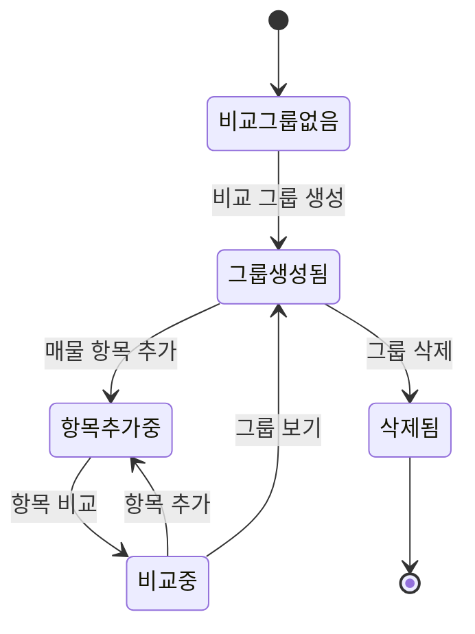
이 코드는 사용자가 여러 매물을 비교하는 기능의 생명주기를 나타내는 상태 머신이다. 
사용자는 초기 상태인 비교그룹없음에서 시작하며, 비교 그룹 생성 액션을 수행하면 그룹생성됨 상태로 전환되어 새로운 비교 그룹이 생성된다. 
그룹생성됨 상태에서 사용자가 매물 항목을 추가하면 항목추가중 상태로 진행되어 여러 매물을 선택하고 추가할 수 있으며, 충분한 항목을 모았으면 항목 비교 액션을 통해 비교중 상태로 변경된다. 
비교중 상태에서는 추가된 매물들을 나란히 비교하면서 필요하면 더 많은 항목을 추가하기 위해 다시 항목추가중 상태로 돌아갈 수 있다. 
또한 비교중 상태에서 그룹 보기 액션을 선택하면 그룹생성됨 상태로 돌아가 그룹의 정보를 확인할 수 있으며, 사용자가 비교 그룹이 더 이상 필요 없다고 판단하면 그룹 삭제 액션을 통해 그룹을 제거한다. 
그룹이 삭제되면 삭제됨 상태를 거쳐 최종적으로 시스템에서 제거된다.

# 12. 지도 인터랙션 상태 machine

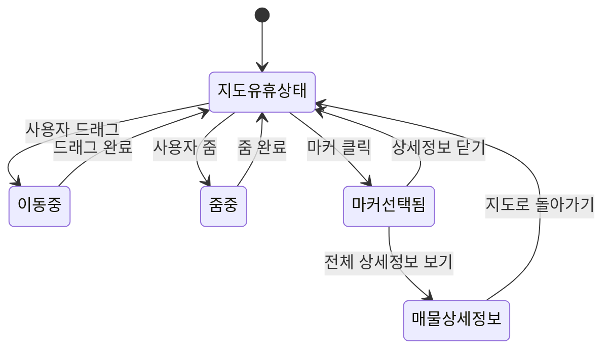
이 코드는 사용자가 지도에서 매물을 탐색하는 상호작용 전체를 나타내는 상태 머신이다. 
지도는 초기 상태인 지도유휴상태에서 대기하고 있으며, 사용자가 손가락으로 드래그 액션을 수행하면 이동중 상태로 전환되어 지도가 움직인다. 
드래그가 완료되면 다시 지도유휴상태로 돌아가 사용자가 다음 액션을 준비하게 되며, 이 과정은 여러 번 반복될 수 있다. 
마찬가지로 사용자가 줌 액션을 수행하면 줌중 상태로 진입하여 지도를 확대 또는 축소하고, 줌이 완료되면 다시 지도유휴상태로 복귀한다. 
지도유휴상태에서 사용자가 특정 매물 마커를 클릭하면 마커선택됨 상태로 변경되어 해당 매물의 기본 정보를 표시하며, 이 상태에서 사용자는 상세정보 닫기 액션으로 다시 지도유휴상태로 돌아가거나 전체 상세정보 보기 액션을 선택하여 매물상세정보 상태로 진행할 수 있다. 
매물상세정보 상태에서는 매물의 상세한 정보를 확인한 후 지도로 돌아가기 액션을 통해 지도유휴상태로 복귀하게 된다.

# 13. 실거래가 조회 상태 machine

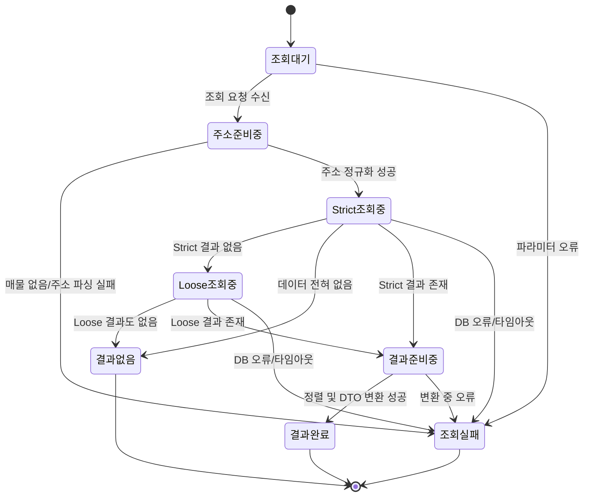

이 상태 머신은 특정 매물에 대한 실거래가 조회 요청이 들어왔을 때 서버 측에서 어떤 단계를 거치는지를 나타낸다.  
초기 상태는 아직 아무 조회도 받지 않은 `조회대기` 상태이며, 클라이언트가 propertyId 등 파라미터를 포함해 요청을 보내면 `주소준비중` 상태로 전환되어 매물 존재 여부와 주소 정규화를 수행한다.  
매물이 없거나 주소 파싱에 실패하면 `조회실패` 상태로 이동하며, 정규화에 성공하면 우선 도로명·시군구·면적 등을 기준으로 하는 `Strict조회중` 상태가 된다.  
Strict 검색에서 데이터가 전혀 없으면 `Loose조회중` 상태로 넘어가 같은 구 + 면적 기준으로 재검색하고, strict 또는 loose 어느 쪽에서든 결과가 생기면 `결과준비중` 상태에서 정렬 및 DTO 변환을 수행한다.  
이 과정이 정상적으로 완료되면 `결과완료` 상태가 되어 실거래 리스트를 반환하며, strict/loose 모두에서 데이터가 없을 경우에는 `결과없음` 상태로 마무리된다.  
어느 단계에서든 DB 오류·타임아웃·예상치 못한 예외가 발생하면 `조회실패` 상태로 전환되어 에러 응답을 반환하며 시퀀스는 종료된다.  

# 14. 이상 매물 탐지 상태 machine

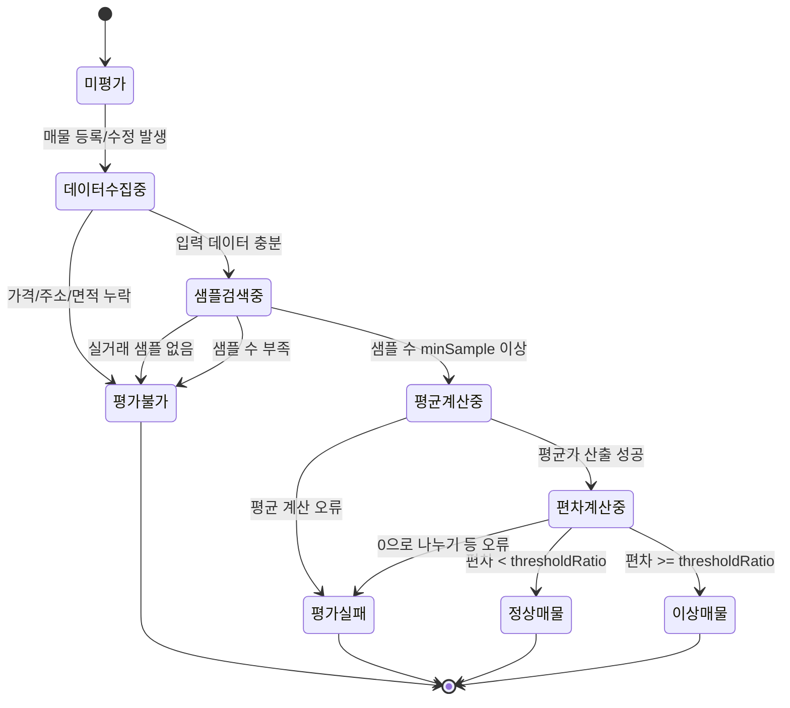

이 상태 머신은 하나의 매물이 저장되거나 수정될 때 가격 이상 여부를 판정하는 PriceAnomalyDetector의 흐름을 표현한 것이다.  
초기 상태는 아직 한 번도 평가되지 않은 `미평가` 상태이며, 매물 등록 또는 수정 이벤트가 발생하면 `데이터수집중` 상태로 들어가 가격·주소·면적 등 필수 정보가 모두 있는지 확인한다.  
중요 필드가 부족하면 즉시 `평가불가` 상태가 되어 anomaly_alert를 null로 두고 종료하며, 필수 정보가 충분하면 `샘플검색중` 상태에서 실거래 테이블에서 strict/loose 규칙에 따라 샘플을 조회한다.  
실거래가 하나도 없거나, 최소 표본 수(minSampleSize)에 못 미치는 경우에는 `평가불가` 상태가 되고, 충분한 샘플을 확보한 경우에는 `평균계산중` 상태에서 평균 가격을 계산한 뒤 성공하면 `편차계산중` 상태로 진입해 매물 가격과 평균 가격의 편차 비율을 산출한다.  
그 결과 편차가 thresholdRatio보다 작으면 `정상매물` 상태로, 크거나 같으면 `이상매물` 상태로 전환되며 각각 anomaly_alert=false 또는 true로 기록된다.  
평균 계산이나 편차 계산 중 0으로 나누기 등의 예외가 발생하면 `평가실패` 상태로 전환되며, 이 경우 시스템은 로그를 남기고 후속 배치 진단이나 재처리 대상으로 남길 수 있다.  
